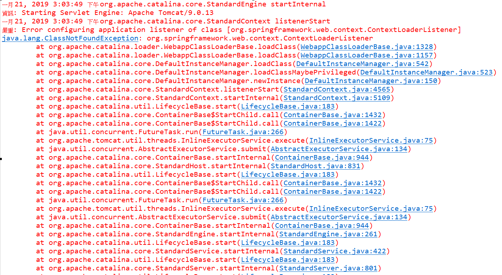
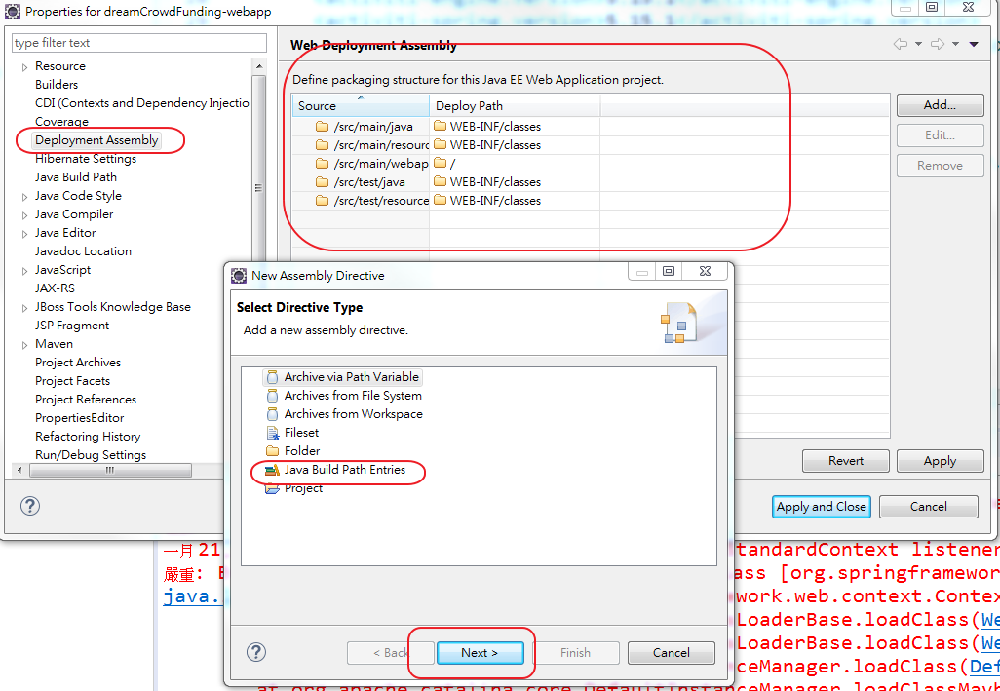
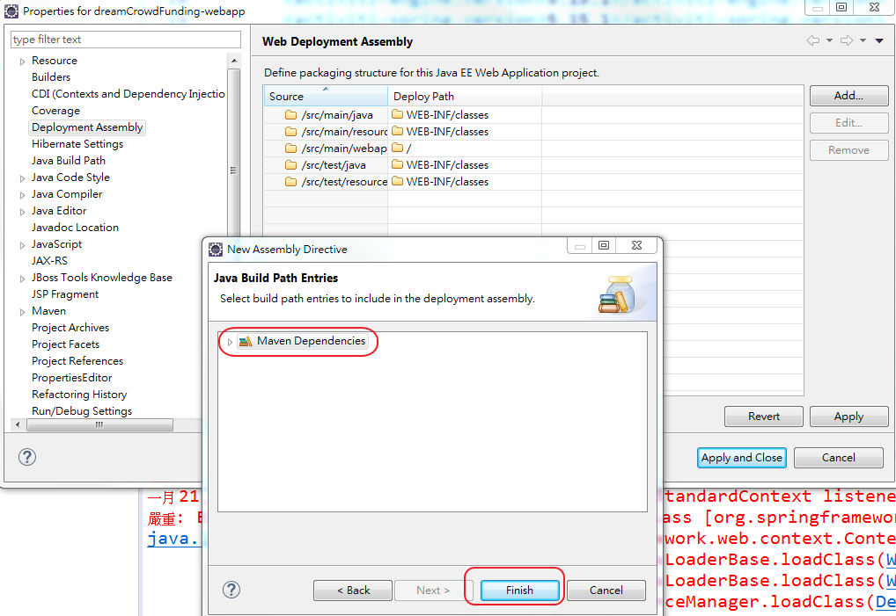

# 1.私服 nexus 安裝指令

```
nexus.exe /install nexus
nexus.exe /start nexus
```

# 2.常見錯誤

a.出現以下錯誤時



### **處理方式:**

​		**在Deployment Assembly 加入MAVEN Dependencies**





# 3. 設定JDK version


## 方式一:在pom.xml設定
```
	<properties>
		<maven.compiler.target>1.8</maven.compiler.target>
		<maven.compiler.source>1.8</maven.compiler.source>
	</properties>
```


## 方式二:在pom.xml設定

* jdk8
```
<build>
	<plugins>
		<plugin>
			<artifactId>maven-compiler-plugin</artifactId>
			<configuration>
				<source>1.8</source>
				<target>1.8</target>
			</configuration>
		</plugin>
	</plugins>
</build>
```

* jdk11
```
	<build>
		<plugins>
			<plugin>
				<groupId>org.apache.maven.plugins</groupId>
				<artifactId>maven-compiler-plugin</artifactId>
				<version>3.8.0</version>
				<configuration>
					<release>11</release> <!--or <release>10</release>-->
				</configuration>
			</plugin>
		</plugins>
	</build>
```

# 4.如果使用eclipse2021以上版本，使用maven專案pom.xml出現以下錯誤


* 這是因為POM中包含有maven-war-plugin插件，插件版本太低

## 處理方式:在pom.xml配置以下設定，更新maven-war-plugin版本


```xml
	<build>
		<plugins>
			<plugin>
				<groupId>org.apache.maven.plugins</groupId>
				<artifactId>maven-war-plugin</artifactId>
				<version>3.3.2</version>
			</plugin>
		</plugins>
	</build>
```
  