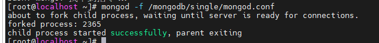
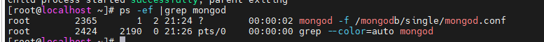

# 安裝

## CentOS9

### 壓縮包安裝

- 去官網下載 https://www.mongodb.com/try/download/community-kubernetes-operator
- 解壓縮 mongodb-linux-x86_64-rhel93-8.0.10.tgz
  - /usr/local 位子可自行更改
```cmd
tar -zxvf mongodb-linux-x86_64-rhel93-8.0.10.tgz -C /usr/local/mongodb
```
- 加入系統參數
```cmd
echo 'export PATH=/mongodb/mongodb-linux-x86_64-rhel93-8.0.10/bin:$PATH' | sudo tee -a /etc/profile
source /etc/profile
```
- 創建幾個目錄，存LOG跟數據
```cmd
#數據儲存目錄
mkdir -p /mongodb/single/data/db
#日誌儲存目錄
mkdir -p /mongodb/single/log
```
- 新建配置文件
```cmd
vi /mongodb/single/mongod.conf
```

```yml
storage:
  dbPath: /mongodb/single/data/db
systemLog:
  destination: file
  logAppend: true
  path: /mongodb/single/log/mongod.log
net:
  bindIp: localhost,192.168.47.137
  port: 27017
processManagement:
  fork: true  # 後臺運行

```
- 啟動
  - 如果啟動後不是successfully ，則是啟動失敗了。原因基本上就是設定檔有問題。
```cmd
mongod -f /mongodb/single/mongod.conf
```


- 檢查有沒有啟動
```cmd
ps -ef |grep mongod
```


- 開通防火牆
```cmd
#開啟防火牆27017 port
firewall-cmd --zone=public --add-port=27017/tcp --permanent

#重啟防火牆
service firewalld restart

#查看開啟的端口號
firewall-cmd --permanent --list-port
```

### 安裝MongoDB Shell (mongosh)

- 去官網下載 https://www.mongodb.com/try/download/shell
- 解壓縮 mongosh-2.5.3-linux-x64.tgz

```cmd
tar -zxvf mongosh-2.5.3-linux-x64.tgz -C /mongodb
```
- 加入系統參數
```cmd
echo 'export PATH=/mongodb/mongosh-2.5.3-linux-x64/bin:$PATH' | sudo tee -a /etc/profile
source /etc/profile
```

- 啟動
```cmd
mongosh "mongodb://192.168.47.137:27017" -u <username> -p <password> --authenticationDatabase <authDatabase>
```
