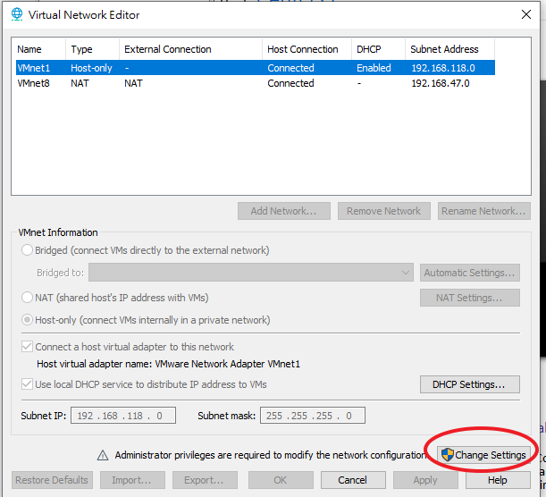

# 遇到無法使用ssh工具連上虛擬機

## 檢查以下設定，且subnet ip 要設成跟虛擬機系統上一樣的網段





## 配置上網

- 1.修改配置文件
  - BOOTPROTO --> static
  - ONBOOT --> yes

```
vi /etc/sysconfig/network-scripts/ifcfg-ens33
```


- 2.固定內網IP設置

  - IPADDR
  - METMASK
  - GATEWAY
  - DNS1


- 安裝VMWare 分享工具
```
sudo yum install open-vm-tools
```

```
/usr/bin/vmhgfs-fuse .host:/ /share -o subtype=vmhgfs-fuse,allow_other
```