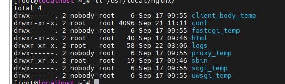
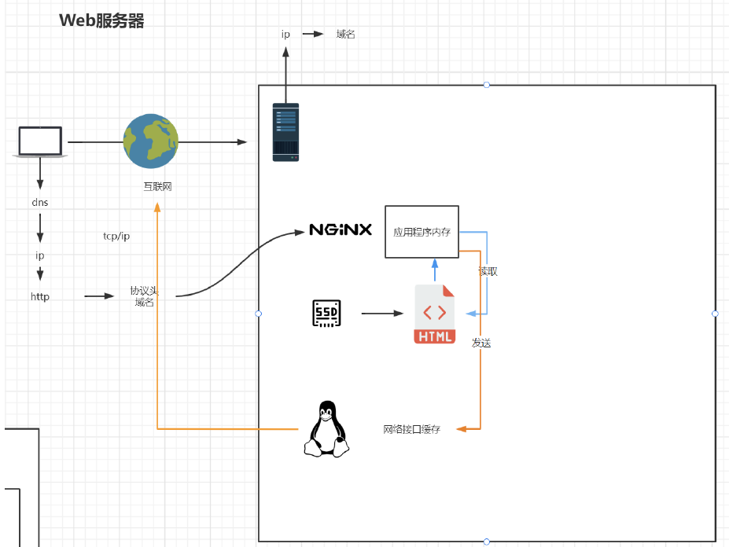
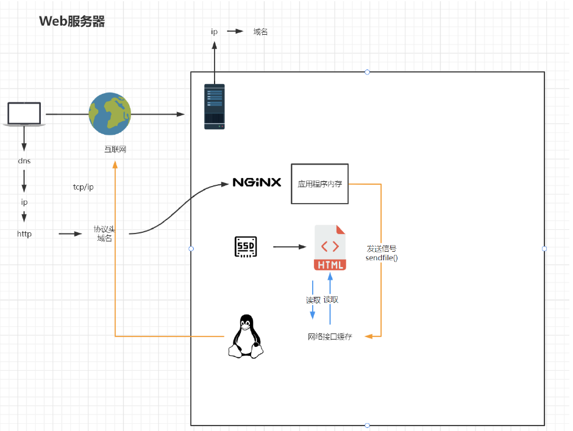

#

## 安裝Nginx

- 1.解壓縮nginx 包

```
 tar zxvf nginx-1.21.6.tar.gz
```

- 2.進入nginx資料夾，執行configure，產出makefile


預設安裝在/usr/local/nginx

```
./configure 
```

指定安裝路徑

```
./configure --prefix=/usr/local/nginx
```

出現以下錯誤

```
checking for OS
 + Linux 3.10.0-693.el7.x86_64 x86_64
checking for C compiler ... not found

./configure: error: C compiler cc is not found

[root@localhost nginx-1.21.6]# yum install -y gcc

```
安裝
```
 yum install -y gcc
```

出現以下錯誤
```
./configure: error: the HTTP rewrite module requires the PCRE library.
You can either disable the module by using --without-http_rewrite_module
option, or install the PCRE library into the system, or build the PCRE library
statically from the source with nginx by using --with-pcre=<path> option.

```
安裝

```
 yum install -y pcre pcre-devel
```

出現以下錯誤
```
./configure: error: the HTTP gzip module requires the zlib library.
You can either disable the module by using --without-http_gzip_module
option, or install the zlib library into the system, or build the zlib library
statically from the source with nginx by using --with-zlib=<path> option.

```

安裝

```
yum install -y zlib zlib-devel

```

成功後


產出makefile


- 執行make and make install

```
make
```
```
make install
```
安裝完成


- 開啟防火牆

放行埠
```
firewall-cmd --zone=public --add-port=80/tcp --permanent
```
重啟防火牆
```
firewall-cmd --reload
```


## 啟動nginx

### 1.一般指令
```
./nginx 啟動
./nginx -s stop
./nginx -s quit 優雅關閉，在退出前完成已經接受的連線請求
./nginx -s reload 重新載入配置
```

### 2.設置系統啟動用指令

- 建立服務腳本
```
vi /usr/lib/systemd/system/nginx.service
```

- 服務腳本內容

```
[Unit]
Description=nginx - web server
After=network.target remote-fs.target nss-lookup.target
[Service]
Type=forking
PIDFile=/usr/local/nginx/logs/nginx.pid
ExecStartPre=/usr/local/nginx/sbin/nginx -t -c /usr/local/nginx/conf/nginx.conf
ExecStart=/usr/local/nginx/sbin/nginx -c /usr/local/nginx/conf/nginx.conf
ExecReload=/usr/local/nginx/sbin/nginx -s reload
ExecStop=/usr/local/nginx/sbin/nginx -s stop
ExecQuit=/usr/local/nginx/sbin/nginx -s quit
PrivateTmp=true
[Install]
WantedBy=multi-user.target
```

- 重新啟動加載系統服務

```
systemctl daemon-reload
```

- 啟動服務

```
systemctl start nginx.service
```


### 3.設置開機時啟動

```
systemctl enable nginx.service
```

## nginx 目錄結構



- conf :放置nginx設定檔
- html :預設放置靜態檔的地方
- logs :log
- sbin :nginx 啟動檔案
- XXXX_temp: 這是啟動後產生的文件


## nginx 配置

- 最小配置
- worker_processes
  - worker_processes 1; 預設為1，表示開啟一個業務進程
- worker_connections
  - worker_connections 1024; 單一業務程序可接受連線數
- include mime.types;
  - include mime.types; 引入http mime類型
- default_type application/octet-stream;
  - default_type application/octet-stream; 如果mime類型沒符合上，預設使用二進位流的方式傳輸。
-  on;
  - sendfile on; 使用linux的sendfile(socket, file, len) 高效網路傳輸，也就是資料0拷貝。
  - 沒有開啟sendfile，文件會被讀取至應用程序內存，再由應用程序發送出去
  - 有開啟sendfile，應用程序直接發送訊號，讓網絡藉口直接讀取發送，不會先複製一份到應用程序緩存內

未開啟sendfile



開啟sendfile




- server

```
server {
    listen 80; 監聽埠號
    server_name localhost; 主機名
    location / { 匹配路徑
        root html; 檔案根目錄
        index index.html index.htm; 預設頁名稱
    }
    error_page 500 502 503 504 /50x.html; 報錯編碼對應頁面
    location = /50x.html {
        root html;
    }
}
```

- 虛擬主機
  - 原本一台伺服​​器只能對應一個站點，透過虛擬主機技術可以虛擬化成多個站點同時對外提供服務
- servername匹配規則
  - 我們要注意的是servername匹配分先後順序，寫在前面的匹配上就不會繼續往下匹配了。

- 完整匹配
  - 我們可以在同一servername中匹配多個域名
```
server_name vod.frank.com www1.frank.com;
```
- 通配符匹配

```
server_name *.frank.com
```
- 通配符結束匹配

```
server_name vod.*;
```

- 正規匹配

```
server_name ~^[0-9]+\.mmban\.com$;
```


## 反向代理

```
 server {
        listen       88;
        server_name  www.frank.com;

        location / {
            root   /www/video;
            index  index.html index.htm;
        }

       location /archive {
            proxy_pass http://tw.news.yahoo.com;
        }

       location /topic/us-election {

            proxy_pass  http://tw.news.yahoo.com;
        }
    }

```

- /archive 代理 會被導到http://tw.news.yahoo.com/archive，參數也會帶過去
- /topic/us-election 代理 會被導到http://tw.news.yahoo.com/topic/us-election，參數也會帶過去


## 基於反向代理的負載平衡


## 負載平衡策略
```
```


## 動靜分離

### 配置反向代理

```
location / {
  proxy_pass http://127.0.0.1:8080;
  root html;
  index index.html index.htm;
}
```

### 配置靜態檔 js/css/images

#### 個別增加一個location
```
location /css {
  root /usr/local/nginx/static;
  index index.html index.htm;
}
location /images {
  root /usr/local/nginx/static;
  index index.html index.htm;
}
location /js {
  root /usr/local/nginx/static;
  index index.html index.htm;
}
```

#### 使用一個location做配置

  - 使用正則

- location 前綴

  - / 通用匹配，任何請求都會匹配到。
  - = 精準匹配，不是以指定模式開頭
  - ~ 正規匹配，區分大小寫
  - ~* 正規匹配，不區分大小寫
  - ^~ 非正則匹配，匹配以指定模式開頭的location


##### location匹配順序
- 多個正則location直接按書寫順序匹配，成功後就不會繼續往後面匹配
- 普通（非正規）location會一直往下，直到找到匹配度最高的（最大前綴匹配）
- 當普通location與正規location同時存在，如果正則匹配成功,則不會再執行普通匹配
- 所有類型location存在時，“=”匹配 > “^~”匹配 > 正規匹配 > 普通（最大前綴匹配）

```
location ~*/(css|img|js) {
  root /usr/local/nginx/static;
  index index.html index.htm;
}
```

### alias與root

```
location /css {
  alias /usr/local/nginx/static/css;
  index index.html index.htm;
}
```

root用來設定根目錄，而alias在接受請求的時候在路徑上不會加上location。
- 1）alias指定的目錄是準確的，即location匹配訪問的path目錄下的文件直接是在alias目錄下查找的； 
- 2）root指定的目錄是location匹配訪問的path目錄的上一層目錄,這個path目錄一定要是真實存在root指定目錄下的； 
- 3）使用alias標籤的目錄區塊中不能使用rewrite的break（具體原因不明）；另外，alias指定的目錄後面必須加上"/"符號！ ！ 
- 4）在alias虛擬目錄配置中，location匹配的path目錄如果後面不帶"/"，那麼訪問的url地址中這個path目錄後面加不加"/"不影響訪問，訪問時它會自動加上"/"； 但是如果location匹配的path目錄後面加上"/"，那麼訪問的url地址中這個path目錄必須加上"/"，訪問時它不會自動加上"/"。如果不加上"/"，訪問就會失敗！ 
- 5）root目錄配置中，location匹配的path目錄後面帶不帶"/"，都不會影響訪問。


## UrlRewrite

### rewrite語法格式及參數語法

rewrite是實作URL重寫的關鍵指令，根據regex (正規表示式)部分內容，
重定向到replacement，結尾是flag標記。

```
rewrite   <regex>   <replacement>    [flag];
關鍵字     正規      替代內容         flag標記
```

- regex：perl相容正規表示式語句進行規則匹配
- replacement：將正規匹配的內容替換成replacement
- flag：rewrite支援的flag標記
- rewrite參數的標籤段位置：server,location,if
- flag標記說明：
  - last #本條規則符合完成後，繼續向下比對新的location URI規則
  - break #本條規則符合完成即終止，不再符合後面的任何規則
  - redirect #回傳302暫時重定向，瀏覽器位址會顯示跳轉後的URL位址
  - permanent #返回301永久重定向，瀏覽器網址列會顯示跳轉後的URL位址
- ^$ 中間寫正則

```
rewrite ^/([0-9]+).html$ /index.jsp?pageNum=$1 break;
```