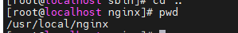

#

## 安裝Nginx

- 1.解壓縮nginx 包

```
 tar zxvf nginx-1.21.6.tar.gz
```

- 2.進入nginx資料夾，執行configure，產出makefile


預設安裝在/usr/local/nginx

```
./configure 
```

指定安裝路徑

```
./configure --prefix=/usr/local/nginx
```

出現以下錯誤

```
checking for OS
 + Linux 3.10.0-693.el7.x86_64 x86_64
checking for C compiler ... not found

./configure: error: C compiler cc is not found

[root@localhost nginx-1.21.6]# yum install -y gcc

```
安裝
```
 yum install -y gcc
```

出現以下錯誤
```
./configure: error: the HTTP rewrite module requires the PCRE library.
You can either disable the module by using --without-http_rewrite_module
option, or install the PCRE library into the system, or build the PCRE library
statically from the source with nginx by using --with-pcre=<path> option.

```
安裝

```
 yum install -y pcre pcre-devel
```

出現以下錯誤
```
./configure: error: the HTTP gzip module requires the zlib library.
You can either disable the module by using --without-http_gzip_module
option, or install the zlib library into the system, or build the zlib library
statically from the source with nginx by using --with-zlib=<path> option.

```

安裝

```
yum install -y zlib zlib-devel

```

成功後


產出makefile


- 執行make and make install

```
make
```
```
make install
```
安裝完成



- 開啟防火牆

放行埠
```
firewall-cmd --zone=public --add-port=80/tcp --permanent
```
重啟防火牆
```
firewall-cmd --reload
```


## 啟動nginx

### 1.一般指令
```
./nginx 啟動
./nginx -s stop
./nginx -s quit 優雅關閉，在退出前完成已經接受的連線請求
./nginx -s reload 重新載入配置
```

### 2.設置系統啟動用指令

- 建立服務腳本
```
vi /usr/lib/systemd/system/nginx.service
```

- 服務腳本內容

```
[Unit]
Description=nginx - web server
After=network.target remote-fs.target nss-lookup.target
[Service]
Type=forking
PIDFile=/usr/local/nginx/logs/nginx.pid
ExecStartPre=/usr/local/nginx/sbin/nginx -t -c /usr/local/nginx/conf/nginx.conf
ExecStart=/usr/local/nginx/sbin/nginx -c /usr/local/nginx/conf/nginx.conf
ExecReload=/usr/local/nginx/sbin/nginx -s reload
ExecStop=/usr/local/nginx/sbin/nginx -s stop
ExecQuit=/usr/local/nginx/sbin/nginx -s quit
PrivateTmp=true
[Install]
WantedBy=multi-user.target
```

- 重新啟動加載系統服務

```
systemctl daemon-reload
```

- 啟動服務

```
systemctl start nginx.service
```


### 3.設置開機時啟動

```
systemctl enable nginx.service
```