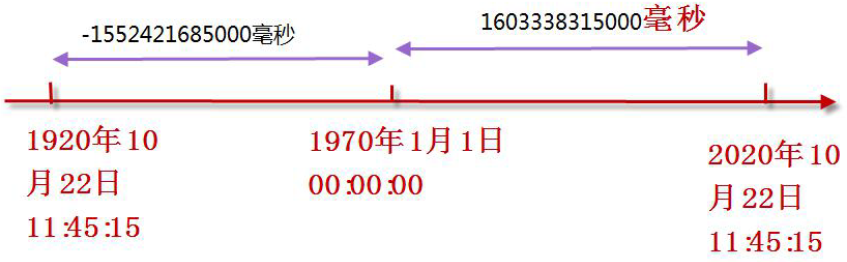

# python

# 基本規則

* 命名:

    1.開頭只能是底線(_)或者字母
    
    2.其他只能是底線、字母、數字

    3.盡量避免使用雙底線開頭或結尾，因為這是系統用設命名

    4.常數使用全大寫(python 沒有常數規範，故實際上是可以更改的)

    5.不能是系統保留字

* python 所以值皆是物件

    a = 3 ===>實際上是在堆內存建立3物件，在將物件內的ID賦值給棧內存內的a變數

    

* 不同的物件類型不能做運算

   a = 2 + "a"  ==>程式會報錯

# 變數宣告

* 語法:
    
        變數名 = 值

* 可以直接交換兩變數值

        a,b = 1,2
        a,b = b,a

        print(a,b) ==> 2,1

# 基本數據類型

* 整數

* 浮點數

round(value) : 用於四捨五入的函式

# 數字運算

/ ==> 浮點數除法

a = 8/4  #2.0

// ==> 整數除法

a = 7//2  #3 

# 時間模組(time)

  

* 獲取當前時間

time.time()  ==>

# is 跟 == 區別

* is 是比較兩物件是否相等(比較兩物件的id是否指向同物件)

* == 是比較物件裡的value是否相等

* 整數缓存問題

    因為增加效能，故在命令行中執行，整數範圍[-5,256]會放進缓存，不會建立新的物件，故用is比較。會參考到相同的id
    但如果是存成.py文件，缓存範圍變成[-5,無窮大]

    