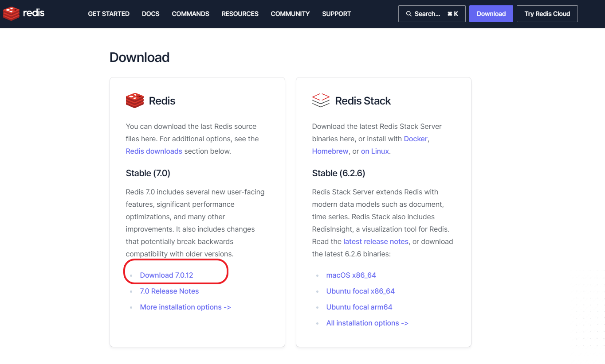
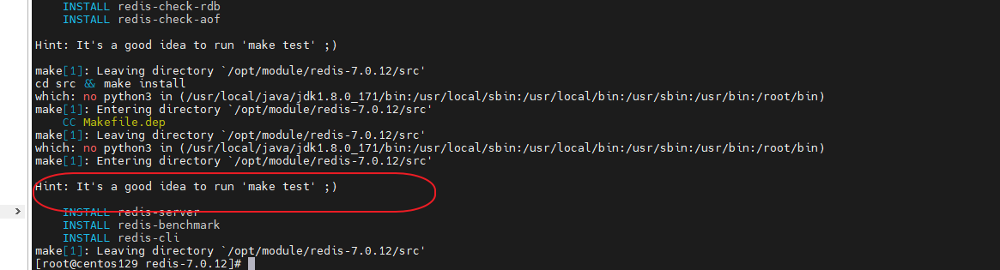
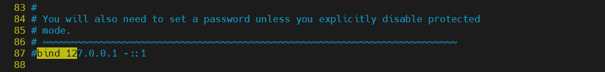
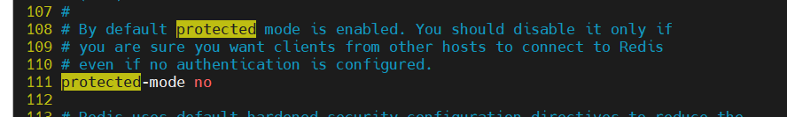
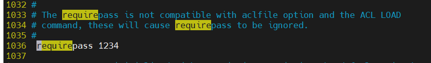
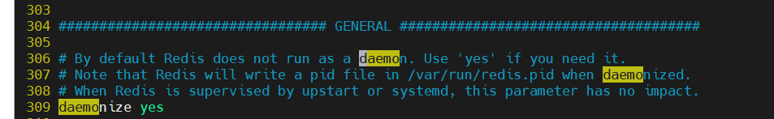
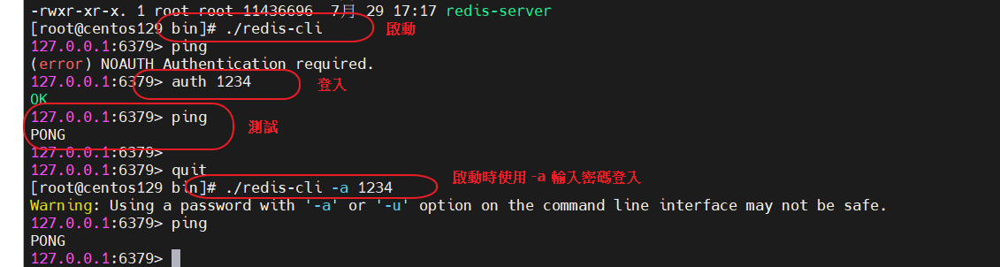
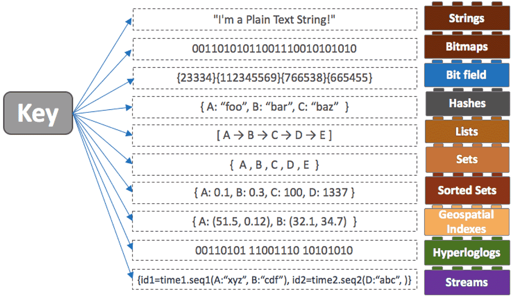
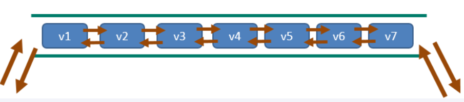
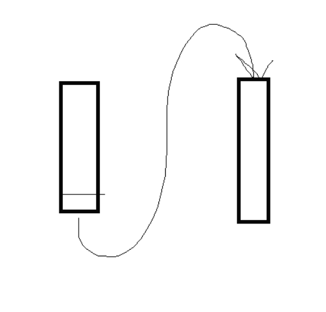

# Redis:REmote Dictionary Server(遠程字典服務器)

- Remote Dictionary Server(遠程字典服務)是完全開源的，使用ANSIC語言編寫遵守BSD協議，是一個高性能的Key-Value數據庫提供了豐富的數據結構，例如String、Hash、List、Set、SortedSet等等。數據是存在內存中的，同時Redis支持事務、持久化、LUA腳本、發布/訂閱、緩存淘汰、流技術等多種功能特性提供了主從模式、Redis Sentinel和Redis Cluster集群架構方案
- 官網 https://redis.io
- 中文 http://www.redis.cn/
- 下載 https://redis.io/download/

- redis中文文檔:https://redis.com.cn/documentation.html

- 指令:http://doc.redisfans.com/

## 版本

- Redis從發布至今，已經有十餘年的時光了，一直遵循著自己的命名規則：

- 版本號第二位如果是奇數，則為非穩定版本 如2.7、2.9、3.1

- 版本號第二位如果是偶數，則為穩定版本 如2.6、2.8、3.0、3.2

- 當前奇數版本就是下一個穩定版本的開發版本，如2.9版本是3.0版本的開發版本

- 我們可以通過redis.io官網來下載自己感興趣的版本進行源碼閱讀：

- 歷史發布版本的源碼：https://download.redis.io/releases/

## Redis7.0 部分新特性

|||
|--|--|
|多AOF文件支持|7.0 版本中一個比較大的變化就是 aof 文件由一個變成了多個，主要分為兩種類型：基本文件(base files)、增量文件(incr files)，請注意這些文件名稱是複數形式說明每一類文件不僅僅只有一個。在此之外還引入了一個清單文件(manifest) 用於跟踪文件以及文件的創建和應用順序（恢復）|
|config命令增強|對於Config Set 和Get命令，支持在一次調用過程中傳遞多個配置參數。例如，現在我們可以在執行一次Config Set命令中更改多個參數： config set maxmemory 10000001 maxmemory-clients 50% port 6399 |
|限制客戶端內存使用 Client-eviction|一旦 Redis 連接較多，再加上每個連接的內存佔用都比較大的時候， Redis總連接內存佔用可能會達到maxmemory的上限，可以增加允許限制所有客戶端的總內存使用量配置項，redis.config 中對應的配置項，兩種配置形式：指定內存大小、基於 maxmemory 的百分比。maxmemory-clients 1g maxmemory-clients 10%|
|listpack緊湊列表調整|listpack 是用來替代 ziplist 的新數據結構，在 7.0 版本已經沒有 ziplist 的配置了（6.0版本僅部分數據類型作為過渡階段在使用）listpack 已經替換了 ziplist 類似 hash-max-ziplist-entries 的配置|
|訪問安全性增強ACLV2|在redis.conf配置文件中，protected-mode默認為yes，只有當你希望你的客戶端在沒有授權的情況下可以連接到Redis server的時候可以將protected-mode設置為no|
|Redis Functions|Redis函數，一種新的通過服務端腳本擴展Redis的方式，函數與數據本身一起存儲。簡言之，redis自己要去搶奪Lua腳本的飯|
|RDB保存時間調整|將持久化文件RDB的保存規則發生了改變，尤其是時間記錄頻度變化|
|命令新增和變動|Zset (有序集合)增加 ZMPOP、BZMPOP、ZINTERCARD 等命令 Set (集合)增加 SINTERCARD 命令 LIST (列表)增加 POP、BLMPOP ，從提供的鍵名列表中的第一個非空列表鍵中彈出一個或多個元素。|
|性能資源利用率、安全、等改進|自身底層部分優化改動，Redis核心在許多方面進行了重構和改進，主動碎片整理V2：增強版主動碎片整理，合Jemalloc版本更新，更快更智能，延時更低，HyperLogLog改進：在Redis5.0中，HyperLogLog算法得到改進，優化了計數統計時的內存使用效率，7更加優秀，更好的內存統計報告，如果不為了API向後兼容，我們將不再使用slave一詞......(政治正確)|

## 安裝(linxu)

### 官網下載 



### 解壓縮放進指定目錄

```
 tar -zxvf redis-7.0.12.tar.gz
```

### 使用make安裝

- 使用make安裝，並使用PREFIX指定安裝路徑
```
# 安裝
make && make PREFIX=/opt/module/redis-7.0.12/build/ install

# 移除
make PREFIX=/opt/module/redis-7.0.12/build/ uninstall
make clean
```


### 設定redis.conf

- 複製原始redis.conf到 /opt/frank/redis_conf/

- redis.conf配置文件，改完後確保生效，記得重啟，記得重啟
  - 1 默認daemonize no (是否使用後台啟動)             改為  daemonize yes
  - 2 默認protected-mode  yes    改為  protected-mode no 這個設置影響到安全保護，有其他系統要連的話要打關掉它
  - 3 默認bind 127.0.0.1             改為  直接註釋掉(默認bind 127.0.0.1只能本機訪問)或改成本機IP地址，否則影響遠程IP連接
  - 4 添加redis密碼                      改為 requirepass 你自己設置的密碼






## 啟動

- 到安裝目錄裡 /opt/module/redis-7.0.12/build/
- 執行 

```
./redis-server /home/frank/redis_config/redis.conf
```
- 使用redis-cli 連線redis
- 使用auth 輸入密碼




## 停止

- 單實例關閉：redis-cli -a 1234 shutdown
- 多實例關閉，指定端口關閉:redis-cli -p 6379 shutdown
- 在redis-cli 裡使用 SHUTDOWN也可以


## 移除Redis

- 停止redis server
- 刪除安裝目錄底下的redis相關文件即可

# 常用命令

## keys *

- 查看當前庫所有的key

```
127.0.0.1:6379> keys *
1) "k1"

```

## exists key

- 判斷某個key是否存在

```
127.0.0.1:6379> exists k1
(integer) 1
127.0.0.1:6379>

```

## type key 

- 查看你的key是什麼類型

```
127.0.0.1:6379> type k1
string

```

## del key

- 刪除指定的key數據

```
127.0.0.1:6379> del k1
(integer) 1

```

## unlink key

- 非阻塞刪除，僅僅將keys從keyspace元數據中刪除，真正的刪除會在後續異步中操作。

```
# 1:執行成功
# 0:執行失敗

127.0.0.1:6379> UNLINK v1
(integer) 0
127.0.0.1:6379> UNLINK ki
(integer) 1
```

## ttl key

- 查看還有多少秒過期，-1表示永不過期，-2表示已過期，其他數字代表勝幾秒過期

```
127.0.0.1:6379> ttl k1
(integer) 92

```

## expire key 秒

- 為給定的key設置過期時間

- Redis 的過期時間設置有四種形式：
  - EXPIRE 秒——設置指定的過期時間(秒)，表示的是時間間隔。
  - PEXPIRE 毫秒——設置指定的過期時間，以毫秒為單位，表示的是時間間隔。
  - EXPIREAT 時間戳-秒——設置指定的 Key 過期的 Unix 時間，單位為秒，表示的是時間/時刻。
  - PEXPIREAT 時間戳-毫秒——設置指定的 Key 到期的 Unix 時間，以毫秒為單位，表示的是時間/時刻。
 
- expire key seconds [NX|XX|GT|LT]

```
127.0.0.1:6379> EXPIRE k1 100
(integer) 1
127.0.0.1:6379> ttl k1
(integer) 92

```

## move key dbindex【0-15】

- 當前數據庫的 key移動到給定的數據庫 db 當中

```
127.0.0.1:6379> keys *
1) "k2"
2) "k1"
127.0.0.1:6379> move k1 1
(integer) 1
127.0.0.1:6379> keys *
1) "k2"
127.0.0.1:6379> select 1
OK
127.0.0.1:6379[1]> keys *
1) "k1"

```

## select dbindex

- 切換數據庫【0-15】，默認為0

```
127.0.0.1:6379> select 1
OK
127.0.0.1:6379[1]> keys *
```

## dbsize

- 查看當前數據庫key的數量

```
127.0.0.1:6379[1]> DBSIZE
(integer) 3
127.0.0.1:6379[1]> keys *
1) "ki"
2) "b1"
3) "k1"

```

## flushdb

- 清空當前數據庫

```
127.0.0.1:6379[1]> flushdb
OK

```

## flushall

- 所有數據庫全部清除

```
127.0.0.1:6379> FLUSHALL
OK

```

# 10大數據類型



## String

- string是redis最基本的類型，一個key對應一個value。
 
- string類型是二進制安全的，意思是redis的string可以包含任何數據，比如jpg圖片或者序列化的對象 。
 
- string類型是Redis最基本的數據類型，一個redis中字符串value最多可以是512M

### SET 設置指定 key 的值

#### 語法

```
SET key value [NX | XX] [GET] [EX seconds | PX milliseconds | EXAT unix-time-seconds | PXAT unix-time-milliseconds | KEEPTTL]
```

- Redis SET 命令用於將鍵 key 設定為指定的“字符串”值。

- 如果 key 已經保存了一個值，那麼這個操作會直接覆蓋原來的值，並且忽略原始類型。

- 當 set 命令執行成功之後，之前設置的過期時間都將失效

- 選項
- 從2.6.12版本開始，redis為SET命令增加了一系列選項:

  - EX seconds – 設置鍵key的過期時間，單位時秒
  - PX milliseconds – 設置鍵key的過期時間，單位時毫秒
  - NX – 只有鍵key不存在的時候才會設置key的值
  - XX – 只有鍵key存在的時候才會設置key的值
  - KEEPTTL -- 保留設置前指定鍵的生存時間，就是說原本覆蓋完前面設置的值時過期時間也會跟著覆蓋，設了這個參數代表不覆蓋過期時間，沿用之前的過期時間，剩幾秒就剩幾秒
  - GET --返回指定鍵原本的值，若鍵不存在時返回nil
  - EXAT timestamp-seconds -- 設定值的過期的指定 Unix 時間，以秒為單位（正整數）。
  - PXAT timestamp-milliseconds --設定值的過期的指定 Unix 時間，以豪秒為單位（正整數）。

使用JAVA獲取UNIX時間  
```java
System.out.println(Long.toString(System.currentTimeMillis()/1000L));
```

- GET -- 返回 key 存儲的值，如果 key 不存在返回空
  - 注意: 由於SET命令加上選項已經可以完全取代SETNX, SETEX, PSETEX, GETSET,的功能，所以在將來的版本中，redis可能會不推薦使用並且最終拋棄這幾個命令。

- 返回值
  - 字符串: 如果SET命令正常執行那麼回返回OK 多行字符串: 使用GET 選項，返回key 存儲的值，如果key 不存在返回空空: 否則如果加了NX 或者XX選項，SET 沒執行，那麼會返回nil。


- 如何獲得設置指定的 Key 過期的 Unix 時間，單位為秒
```java
System.out.println(Long.toString(System.currentTimeMillis()/1000L));
```

### GET 獲取指定 key 的值

#### 語法

```
GET key
```

- Redis Get 命令用於獲取指定 key 的值。返回與 key 相關聯的字符串值。

- 如果鍵 key 不存在， 那麼返回特殊值 nil 。

- 如果鍵 key 的值不是字符串類型， 返回錯誤， 因為 GET 命令只能用於字符串值。

- 返回值
  - 多行字符串: 返回key中存儲的值，key 不存在是返回nil 。

### GETRANGE 返回 key 中字符串值的子字符

#### 語法

```
 GETRANGE KEY_NAME start end
```

- GETRANGE 命令返回存儲在 key 中的字符串的子串，由 start 和 end 偏移決定(都包括在內)。負數偏移提供相對字符串結尾的偏移。所以， -1 表示最後一個字符， -2 表示倒數第二個字符，以此類推。

- GETRANGE 通過將結果範圍限制為字符串的實際長度來處理超出範圍的請求。

- Warning: GETRANGE 是改名而來，在 Redis2.0 以前版本叫做 SUBSTR 。

- 返回值
  - 多行字符串：截取得到的子字符串。


```
redis> SET mykey "This is a string redis.com.cn"
"OK"
redis> GETRANGE mykey 0 3
"This"
redis> GETRANGE mykey -3 -1
".cn"
redis> GETRANGE mykey 0 -1
"This is a string redis.com.cn"
redis> GETRANGE mykey 10 100
"string redis.com.cn"
```

### GETSET 將給定 key 的值設為 value ，並返回 key 的舊值 ( old value )

#### 語法

```
GETSET key value
```

```
redis> GETSET db mongodb    # 沒有舊值，返回 nil
(nil)

redis> GET db
"mongodb"

redis> GETSET db redis      # 返回舊值 mongodb
"mongodb"

redis> GET db
"redis"
```

- 將鍵 key 的值設為 value ， 並返回鍵 key 在被設置之前的舊值。

- 返回給定鍵 key 的舊值。

- 如果鍵 key 沒有舊值， 也即是說， 鍵 key 在被設置之前並不存在， 那麼命令返回 nil 。

- 當鍵 key 存在但不是字符串類型時， 命令返回一個錯誤。

- GETSET 可以和 INCR 組合使用，實現一個有原子性(atomic)復位操作的計數器(counter)。

- 舉例來說，每次當某個事件發生時，進程可能對一個名為mycount 的key 調用INCR 操作，通常我們還要在一個原子時間內同時完成獲得計數器的值和將計數器值復位為0 兩個操作。

- 可以用命令 GETSET mycounter 0 來實現這一目標。

### GETBIT 對 key 所儲存的字符串值，獲取指定偏移量上的位 ( bit )

#### 語法

```
GETBIT key offset
```

- 對 key 所儲存的字符串值，獲取指定偏移量上的位(bit)。

- 當 offset 比字符串值的長度大，或者 key 不存在時，返回 0 。

- 返回值：
  - 字符串值指定偏移量上的位(bit)。


```
# 對不存在的 key 或者不存在的 offset 進行 GETBIT， 返回 0

redis> EXISTS bit
(integer) 0

redis> GETBIT bit 10086
(integer) 0


# 對已存在的 offset 進行 GETBIT

redis> SETBIT bit 10086 1
(integer) 0

redis> GETBIT bit 10086
(integer) 1
```

### SETBIT 對 key 所儲存的字符串值，設置或清除指定偏移量上的位(bit)

#### 語法

```
SETBIT key offset value
```
- 對 key 所儲存的字符串值，設置或清除指定偏移量上的位(bit)。

- 位的設置或清除取決於 value 參數，可以是 0 也可以是 1 。

- 當 key 不存在時，自動生成一個新的字符串值。

- 字符串會進行伸展(grown)以確保它可以將 value 保存在指定的偏移量上。當字符串值進行伸展時，空白位置以 0 填充。

- offset 參數必須大於或等於 0 ，小於 2^32 (bit 映射被限制在 512 MB 之內)。
- 對使用大的 offset 的 SETBIT 操作來說，內存分配可能造成 Redis 服務器被阻塞。具體參考 SETRANGE 命令，warning(警告)部分。

- 返回值：
  - 指定偏移量原來儲存的位。

```
redis> SETBIT bit 10086 1
(integer) 0

redis> GETBIT bit 10086
(integer) 1

redis> GETBIT bit 100   # bit 默認被初始化為 0
(integer) 0
```

### MGET 獲取所有(一個或多個)給定 key 的值

#### 語法

```
MGET key [key ...]
```

- 返回所有(一個或多個)給定 key 的值。

- 如果給定的 key 裡面，有某個 key 不存在，那麼這個 key 返回特殊值 nil 。因此，該命令永不失敗。

- 返回值：
  - 一個包含所有給定 key 的值的列表。

```
redis> SET redis redis.com
OK

redis> SET mongodb mongodb.org
OK

redis> MGET redis mongodb
1) "redis.com"
2) "mongodb.org"

redis> MGET redis mongodb mysql     # 不存在的 mysql 返回 nil
1) "redis.com"
2) "mongodb.org"
3) (nil)
```

### MSET 同時設置一個或多個 key-value 對

#### 語法

```
MSET key value [key value ...]
```

- 同時設置一個或多個 key-value 對。

- 如果某個給定key 已經存在，那麼MSET 會用新值覆蓋原來的舊值，如果這不是你所希望的效果，請考慮使用MSETNX 命令：它只會在所有給定key 都不存在的情況下進行設置操作。

- MSET 是一個原子性(atomic)操作，所有給定 key 都會在同一時間內被設置，某些給定 key 被更新而另一些給定 key 沒有改變的情況，不可能發生。

- 返回值：
  - 總是返回 OK (因為 MSET 不可能失敗)


### SETEX 設置 key 的值為 value 同時將過期時間設為 seconds

#### 語法

```
SETEX key seconds value
```

- 將值 value 關聯到 key ，並將 key 的生存時間設為 seconds (以秒為單位)。

- 如果 key 已經存在， SETEX 命令將覆寫舊值。

- 這個命令類似於以下兩個命令：

```
SET key value
EXPIRE key seconds  # 設置生存時間
```

- 不同之處是， SETEX 是一個原子性(atomic)操作，關聯值和設置生存時間兩個動作會在同一時間內完成，該命令在 Redis 用作緩存時，非常實用。

- 返回值：
  - 設置成功時返回 OK 。
  - 當 seconds 參數不合法時，返回一個錯誤。

```
# 在 key 不存在時進行 SETEX

redis> SETEX cache_user_id 60 10086
OK

redis> GET cache_user_id  # 值
"10086"

redis> TTL cache_user_id  # 剩餘生存時間
(integer) 49


# key 已經存在時，SETEX 覆蓋舊值

redis> SET cd "timeless"
OK

redis> SETEX cd 3000 "goodbye my love"
OK

redis> GET cd
"goodbye my love"

redis> TTL cd
(integer) 2997
```

### SETNX 只有在 key 不存在時設置 key 的值

#### 語法

```
SETNX key value
```

- 將 key 的值設為 value ，當且僅當 key 不存在。

- 若給定的 key 已經存在，則 SETNX 不做任何動作。

- SETNX 是『SET if Not eXists』(如果不存在，則 SET)的簡寫。

- 返回值：
  - 設置成功，返回 1 。
  - 設置失敗，返回 0 。

```
redis> EXISTS job                # job 不存在
(integer) 0

redis> SETNX job "programmer"    # job 設置成功
(integer) 1

redis> SETNX job "code-farmer"   # 嘗試覆蓋 job ，失敗
(integer) 0

redis> GET job                   # 沒有被覆蓋
"programmer"
```

### SETRANGE 從偏移量 offset 開始用 value 覆寫給定 key 所儲存的字符串值

#### 語法

```
SETRANGE key offset value
```

- 用 value 參數覆寫(overwrite)給定 key 所儲存的字符串值，從偏移量 offset 開始。

- 不存在的 key 當作空白字符串處理。

- SETRANGE 命令會確保字符串足夠長以便將value 設置在指定的偏移量上，如果給定key 原來儲存的字符串長度比偏移量小(比如字符串只有5 個字符長，但你設置的offset是10 )，那麼原字符和偏移量之間的空白將用零字節(zerobytes, "\x00" )來填充。

- 注意你能使用的最大偏移量是 2^29-1(536870911) ，因為 Redis 字符串的大小被限制在 512 兆(megabytes)以內。如果你需要使用比這更大的空間，你可以使用多個 key 。


***當生成一個很長的字符串時，Redis 需要分配內存空間，該操作有時候可能會造成服務器阻塞(block)。在2010年的Macbook Pro上，設置偏移量為536870911(512MB 內存分配)，耗費約300 毫秒， 設置偏移量為134217728(128MB 內存分配)，耗費約80 毫秒，設置偏移量33554432(32MB 內存分配)，耗費約30 毫秒，設置偏移量為8388608(8MB 內存分配)，耗費約8 毫秒。注意若首次內存分配成功之後，再對同一個 key 調用 SETRANGE 操作，無須再重新內存。***

- 返回值：
  - 被 SETRANGE 修改之後，字符串的長度。

```
# 對非空字符串進行 SETRANGE

redis> SET greeting "hello world"
OK

redis> SETRANGE greeting 6 "Redis"
(integer) 11

redis> GET greeting
"hello Redis"


# 對空字符串/不存在的 key 進行 SETRANGE

redis> EXISTS empty_string
(integer) 0

redis> SETRANGE empty_string 5 "Redis!"   # 對不存在的 key 使用 SETRANGE
(integer) 11

redis> GET empty_string                   # 空白處被"\x00"填充
"\x00\x00\x00\x00\x00Redis!"
```

### STRLEN 返回 key 所儲存的字符串值的長度

#### 語法

```
STRLEN key
```

- 返回 key 所儲存的字符串值的長度。

- 當 key 儲存的不是字符串值時，返回一個錯誤。

- 返回值：
  - 字符串值的長度。
  - 當 key 不存在時，返回 0 。

```
# 獲取字符串的長度

redis> SET mykey "Hello world"
OK

redis> STRLEN mykey
(integer) 11


# 不存在的 key 長度為 0

redis> STRLEN nonexisting
(integer) 0
```

### MSETNX 同時設置一個或多個 key-value 對

#### 語法

```
MSETNX key value [key value ...]
```

- 同時設置一個或多個 key-value 對，當且僅當所有給定 key 都不存在。

- 即使只有一個給定 key 已存在， MSETNX 也會拒絕執行所有給定 key 的設置操作。

- MSETNX 是原子性的，因此它可以用作設置多個不同 key 表示不同字段(field)的唯一性邏輯對象(unique logic object)，所有字段要么全被設置，要么全不被設置。

- 返回值：
  - 當所有 key 都成功設置，返回 1 。
  - 如果所有給定 key 都設置失敗(至少有一個 key 已經存在)，那麼返回 0 。

```
# 對不存在的 key 進行 MSETNX

redis> MSETNX rmdbs "MySQL" nosql "MongoDB" key-value-store "redis"
(integer) 1

redis> MGET rmdbs nosql key-value-store
1) "MySQL"
2) "MongoDB"
3) "redis"


# MSET 的給定 key 當中有已存在的 key

redis> MSETNX rmdbs "Sqlite" language "python"  # rmdbs 鍵已經存在，操作失敗
(integer) 0

redis> EXISTS language                          # 因為 MSET 是原子性操作，language 沒有被設置
(integer) 0

redis> GET rmdbs                                # rmdbs 也沒有被修改
"MySQL"
```

### PSETEX 以毫秒為單位設置 key 的生存時間

#### 語法

```
PSETEX key milliseconds value
```

- 這個命令和 SETEX 命令相似，但它以毫秒為單位設置 key 的生存時間，而不是像 SETEX 命令那樣，以秒為單位。

- 返回值：
  - 設置成功時返回 OK 。

```
redis> PSETEX mykey 1000 "Hello"
OK

redis> PTTL mykey
(integer) 999

redis> GET mykey
"Hello"
```

### INCR 將 key 中儲存的數字值增1

#### 語法

```
INCR key
```

- 將 key 中儲存的數字值增一。

- 如果 key 不存在，那麼 key 的值會先被初始化為 0 ，然後再執行 INCR 操作。

- 如果值包含錯誤的類型，或字符串類型的值不能表示為數字，那麼返回一個錯誤。

- 本操作的值限制在 64 位(bit)有符號數字表示之內。

***這是一個針對字符串的操作，因為 Redis 沒有專用的整數類型，所以 key 內儲存的字符串被解釋為十進制 64 位有符號整數來執行 INCR 操作。***

- 返回值：
  - 執行 INCR 命令之後 key 的值。

```
redis> SET page_view 20
OK

redis> INCR page_view
(integer) 21

redis> GET page_view    # 數字值在 Redis 中以字符串的形式保存
"21"
```

### INCRBY 將 key 所儲存的值加上給定的增量值 ( increment )

#### 語法

```
INCRBY key increment
```

- 將 key 所儲存的值加上增量 increment 。

- 如果 key 不存在，那麼 key 的值會先被初始化為 0 ，然後再執行 INCRBY 命令。

- 如果值包含錯誤的類型，或字符串類型的值不能表示為數字，那麼返回一個錯誤。

- 本操作的值限制在 64 位(bit)有符號數字表示之內。

- 關於遞增(increment) / 遞減(decrement)操作的更多信息，參見 INCR 命令。

- 返回值：
  - 加上 increment 之後， key 的值。

```
# key 存在且是數字值

redis> SET rank 50
OK

redis> INCRBY rank 20
(integer) 70

redis> GET rank
"70"


# key 不存在時

redis> EXISTS counter
(integer) 0

redis> INCRBY counter 30
(integer) 30

redis> GET counter
"30"


# key 不是數字值時

redis> SET book "long long ago..."
OK

redis> INCRBY book 200
(error) ERR value is not an integer or out of range
```

### INCRBYFLOAT 將 key 所儲存的值加上給定的浮點增量值 ( increment )

#### 語法

```
INCRBYFLOAT key increment
```

- 為 key 中所儲存的值加上浮點數增量 increment 。

- 如果 key 不存在，那麼 INCRBYFLOAT 會先將 key 的值設為 0 ，再執行加法操作。

- 如果命令執行成功，那麼 key 的值會被更新為（執行加法之後的）新值，並且新值會以字符串的形式返回給調用者。

- 無論是key 的值，還是增量increment ，都可以使用像2.0e7 、 3e5 、 90e-2 那樣的指數符號(exponential notation)來表示，但是，執行INCRBYFLOAT 命令之後的值總是以同樣的形式儲存，也即是，它們總是由一個數字，一個（可選的）小數點和一個任意位的小數部分組成（比如3.14 、 69.768 ，諸如此類)，小數部分尾隨的0 會被移除，如果有需要的話，還會將浮點數改為整數（比如3.0 會被保存成3 ）。

- 除此之外，無論加法計算所得的浮點數的實際精度有多長， INCRBYFLOAT 的計算結果也最多只能表示小數點的後十七位。

- 當以下任意一個條件發生時，返回一個錯誤：

  - key 的值不是字符串類型(因為 Redis 中的數字和浮點數都以字符串的形式保存，所以它們都屬於字符串類型）
  - key 當前的值或者給定的增量 increment 不能解釋(parse)為雙精度浮點數(double precision floating point number）

- 返回值：
  - 執行命令之後 key 的值。

```
# 值和增量都不是指數符號

redis> SET mykey 10.50
OK

redis> INCRBYFLOAT mykey 0.1
"10.6"


# 值和增量都是指數符號

redis> SET mykey 314e-2
OK

redis> GET mykey                # 用 SET 設置的值可以是指數符號
"314e-2"

redis> INCRBYFLOAT mykey 0      # 但執行 INCRBYFLOAT 之後格式會被改成非指數符號
"3.14"


# 可以對整數類型執行

redis> SET mykey 3
OK

redis> INCRBYFLOAT mykey 1.1
"4.1"


# 後跟的 0 會被移除

redis> SET mykey 3.0
OK

redis> GET mykey                                    # SET 設置的值小數部分可以是 0
"3.0"

redis> INCRBYFLOAT mykey 1.000000000000000000000    # 但 INCRBYFLOAT 會將無用的 0 忽略掉，有需要的話，將浮點變為整數
"4"

redis> GET mykey
"4"
```

### DECR 將 key 中儲存的數字值減1

#### 語法

```

```

### DECRBY 將 key 所儲存的值減去給定的減量值 ( decrement )


#### 語法

```

```
### APPEND 將 value 追加到 key 原來的值的末尾

#### 語法

```

```

## List列表


- 一個雙端鍊錶的結構，容量是2的32次方減1個元素，大概40多億，主要功能有push/pop等，一般用在棧、佇列、訊息佇列等場景。

- left、right都可以插入添加；

- 如果鍵不存在，建立新的鍊錶；

- 如果鍵已存在，新增內容；

- 如果值全移除，對應的鍵也就消失了。

- 它的底層實際上是雙向鍊錶，對兩端的操作效能很高，透過索引下標的操作中間的節點效能會較差。
  


### LPUSH	將一個或多個值插入到列表頭部

```
127.0.0.1:6379> LPUSH list1 1 2 3 4 5
(integer) 5

```
### RPUSH	在列表中添加一個或多個值
```
127.0.0.1:6379> RPUSH list2 11 22 33 44 55
(integer) 5
```

### LRANGE	獲取列表指定範圍內的元素

```
127.0.0.1:6379> LRANGE list1 0 -1
1) "5"
2) "4"
3) "3"
4) "2"
5) "1"
127.0.0.1:6379> LRANGE list2 0 -1
1) "11"
2) "22"
3) "33"
4) "44"
5) "55"

```
### LPOP	移出並獲取列表的第一個元素
```
127.0.0.1:6379> LRANGE list1 0 -1
1) "5"
2) "4"
3) "3"
4) "2"
5) "1"
127.0.0.1:6379> LPOP list1
"5"
127.0.0.1:6379> LRANGE list1 0 -1
1) "4"
2) "3"
3) "2"
4) "1"

```
### RPOP	移除並獲取列表最後一個元素
```
127.0.0.1:6379> LRANGE list1 0 -1
1) "4"
2) "3"
3) "2"
4) "1"
127.0.0.1:6379> RPOP list1
"1"
127.0.0.1:6379> LRANGE list1 0 -1
1) "4"
2) "3"
3) "2"

```
### LINDEX	通過索引獲取列表中的元素

```
127.0.0.1:6379> LRANGE list1 0 -1
1) "4"
2) "3"
3) "2"
127.0.0.1:6379> LINDEX list1 2
"2"
127.0.0.1:6379> LINDEX list1 1
"3"

```
### LLEN	獲取列表長度
```
127.0.0.1:6379> LRANGE list1 0 -1
1) "4"
2) "3"
3) "2"
127.0.0.1:6379> LLEN list1
(integer) 3

```
### LREM	移除列表元素

```
127.0.0.1:6379> LPUSH list3 1 1 1 1 2 2 2 2 3 3 3 3 4 4 4 5 5
(integer) 17
127.0.0.1:6379> LRANGE list3 0 -1
 1) "5"
 2) "5"
 3) "4"
 4) "4"
 5) "4"
 6) "3"
 7) "3"
 8) "3"
 9) "3"
10) "2"
11) "2"
12) "2"
13) "2"
14) "1"
15) "1"
16) "1"
17) "1"
127.0.0.1:6379> LREM list3 1 3
(integer) 1
127.0.0.1:6379> LRANGE list3 0 -1
 1) "5"
 2) "5"
 3) "4"
 4) "4"
 5) "4"
 6) "3"
 7) "3"
 8) "3"
 9) "2"
10) "2"
11) "2"
12) "2"
13) "1"
14) "1"
15) "1"
16) "1"
127.0.0.1:6379> LREM list3 3 1
(integer) 3
127.0.0.1:6379> LRANGE list3 0 -1
 1) "5"
 2) "5"
 3) "4"
 4) "4"
 5) "4"
 6) "3"
 7) "3"
 8) "3"
 9) "2"
10) "2"
11) "2"
12) "2"
13) "1"

```
### LTRIM	KEY 開始index結束index，截取指定範圍的值後再賦值給KEY

```
127.0.0.1:6379> LRANGE list4 0 -1
1) "7"
2) "6"
3) "5"
4) "4"
5) "3"
6) "2"
7) "1"
8) "0"
127.0.0.1:6379> LTRIM list4 1 4
OK
127.0.0.1:6379> LRANGE list4 0 -1
1) "6"
2) "5"
3) "4"
4) "3"

```
### RPOPLPUSH	移除列表的最後一個元素，並將該元素添加到另一個列表並返回



```
127.0.0.1:6379> LRANGE list4 0 -1
1) "6"
2) "5"
3) "4"
4) "3"
127.0.0.1:6379> LRANGE list4 0 -1
1) "6"
2) "5"
3) "4"
4) "3"
127.0.0.1:6379> LRANGE list1 0 -1
1) "4"
2) "3"
3) "2"
127.0.0.1:6379> RPOPLPUSH list4 list1
"3"
127.0.0.1:6379> LRANGE list1 0 -1
1) "3"
2) "4"
3) "3"
4) "2"
127.0.0.1:6379> LRANGE list4 0 -1
1) "6"
2) "5"
3) "4"

```

### LSET KEY INDEX VALUE 通過索引設置列表元素的值

```
127.0.0.1:6379> LRANGE list4 0 -1
1) "6"
2) "5"
3) "4"
127.0.0.1:6379> LSET list4 1 JAVA
OK
127.0.0.1:6379> LSET list4 2 C++
OK
127.0.0.1:6379> LRANGE list4 0 -1
1) "6"
2) "JAVA"
3) "C++"

```
### LINSERT	before/after 在列表的元素前或者後插入元素

```
127.0.0.1:6379> LRANGE list4 0 -1
1) "6"
2) "JAVA"
3) "C++"
127.0.0.1:6379> LINSERT list4 BEFORE JAVA PYTHON
(integer) 4
127.0.0.1:6379> LRANGE list4 0 -1
1) "6"
2) "PYTHON"
3) "JAVA"
4) "C++"
127.0.0.1:6379> LINSERT list4 AFTER JAVA PHP
(integer) 5
127.0.0.1:6379> LRANGE list4 0 -1
1) "6"
2) "PYTHON"
3) "JAVA"
4) "PHP"
5) "C++"

```

### BLPOP	移出並獲取列表的第一個元素
### BRPOP	移出並獲取列表的最後一個元素
### BRPOPLPUSH	從列表中彈出一個值，並將該值插入到另外一個列表中並返回它
### LPUSHX	將一個值插入到已存在的列表頭部

### RPUSHX	為已存在的列表添加值

## Hash哈希表

- Redis hash 是一個 string 類型的 field（字段） 和 value（值） 的映射表，hash 特別適合用於存儲對象。
 
- Redis 中每個 hash 可以存儲 2^32 - 1 鍵值對（40多億）

### HSET	用於設置存儲在 key 中的哈希表字段的值
### HGET	獲取存儲在哈希表中指定字段的值

```
127.0.0.1:6379> HSET user:001 name Frank id 11 age 36
(integer) 3
127.0.0.1:6379> HGET user:001 id
"11"
127.0.0.1:6379> HGET user:001 age
"36"
```

### HMSET
### HMGET

```
127.0.0.1:6379> HMSET user:002 name JIM id 12 age 30
OK
127.0.0.1:6379> HMGET user:002 name id age
1) "JIM"
2) "12"
3) "30"

```

### HGETALL	獲取在哈希表中指定 key 的所有字段和值

```
127.0.0.1:6379> HGETALL user:001
1) "name"
2) "Frank"
3) "id"
4) "11"
5) "age"
6) "36"

```

### HDEL	用於刪除哈希表中一個或多個字段

```
127.0.0.1:6379> HGETALL user:001
1) "name"
2) "Frank"
3) "id"
4) "11"
5) "age"
6) "36"
127.0.0.1:6379> HDEL user:001 id
(integer) 1
127.0.0.1:6379> HGETALL user:001
1) "name"
2) "Frank"
3) "age"
4) "36"

```
### HLEN	獲取存儲在 key 中的哈希表的字段數量

```
127.0.0.1:6379> HGETALL user:001
1) "name"
2) "Frank"
3) "age"
4) "36"
127.0.0.1:6379> HLEN user:001
(integer) 2

```

### HEXISTS	用於判斷哈希表中字段是否存在

```
127.0.0.1:6379> HGETALL user:001
1) "name"
2) "Frank"
3) "age"
4) "36"
127.0.0.1:6379> HEXISTS user:001 name
(integer) 1
127.0.0.1:6379> HEXISTS user:001 id
(integer) 0

```
### HKEYS	獲取存儲在 key 中的哈希表的所有字段

```
127.0.0.1:6379> HGETALL user:001
1) "name"
2) "Frank"
3) "age"
4) "36"
127.0.0.1:6379> HKEYS user:001
1) "name"
2) "age"

```

### HVALS	用於獲取哈希表中的所有值

```
127.0.0.1:6379> HGETALL user:001
1) "name"
2) "Frank"
3) "age"
4) "36"
127.0.0.1:6379> HVALS user:001
1) "Frank"
2) "36"

```

### HINCRBY	為存儲在 key 中的哈希表指定字段做整數增量運算

```
127.0.0.1:6379> HGETALL user:001
1) "name"
2) "Frank"
3) "age"
4) "18"
5) "score"
6) "99.1"
127.0.0.1:6379> HINCRBY user:001 age 1
(integer) 19
127.0.0.1:6379> HINCRBY user:001 age 2
(integer) 21
127.0.0.1:6379> HGETALL user:001
1) "name"
2) "Frank"
3) "age"
4) "21"
5) "score"
6) "99.1"

```

### HINCRBYFLOAT	為存儲在 key 中的哈希表指定字段做小數增量運算

```
127.0.0.1:6379> HGETALL user:001
1) "name"
2) "Frank"
3) "age"
4) "21"
5) "score"
6) "99.1"
127.0.0.1:6379> HINCRBYFLOAT user:001 score 0.2
"99.3"
127.0.0.1:6379> HINCRBYFLOAT user:001 score 0.4
"99.7"
127.0.0.1:6379> HGETALL user:001
1) "name"
2) "Frank"
3) "age"
4) "21"
5) "score"
6) "99.7"

```

### HSETNX不存在再新增

```
127.0.0.1:6379> HSETNX user:002 age 1
(integer) 0
127.0.0.1:6379> HSETNX user:003 age 1
(integer) 1

```

## Set集合

- Redis 的 Set 是 String 類型的無序集合。集合成員是唯一的，這就意味著集合中不能出現重複的數據，集合對象的編碼可以是 intset 或者 hashtable。
 
- Redis 中Set集合是通過哈希表實現的，所以添加，刪除，查找的複雜度都是 O(1)。
 
- 集合中最大的成員數為 2^32 - 1 (4294967295, 每個集合可存儲40多億個成員)


### SADD	向集合添加一個或多個成員
### SMEMBERS	返回集合中的所有成員
```
127.0.0.1:6379> SADD set1 1 1 1 1 1 2 2 2 2 3 3 3 3 4 5 6
(integer) 6
127.0.0.1:6379> SMEMBERS set1
1) "1"
2) "2"
3) "3"
4) "4"
5) "5"
6) "6"

```
### SISMEMBER	判斷 member 元素是否是集合 key 的成員


```
127.0.0.1:6379> SMEMBERS set1
1) "1"
2) "2"
3) "3"
4) "4"
5) "5"
6) "6"
127.0.0.1:6379> SISMEMBER set1 1
(integer) 1
127.0.0.1:6379> SISMEMBER set1 9
(integer) 0

```

### SREM	移除集合中一個或多個成員

```
127.0.0.1:6379> SMEMBERS set1
1) "1"
2) "2"
3) "3"
4) "4"
5) "5"
6) "6"
127.0.0.1:6379> SREM set1 1
(integer) 1
127.0.0.1:6379> SREM set1 9
(integer) 0
127.0.0.1:6379> SREM set1 5 6
(integer) 2

```

### SCARD	獲取集合的成員數

```
127.0.0.1:6379> SCARD set1
(integer) 3
127.0.0.1:6379> SMEMBERS set1
1) "2"
2) "3"
3) "4"

```
### SRANDMEMBER	返回集合中一個或多個隨機數

```
127.0.0.1:6379> SMEMBERS set2
 1) "0"
 2) "1"
 3) "2"
 4) "3"
 5) "4"
 6) "5"
 7) "6"
 8) "7"
 9) "8"
10) "9"
127.0.0.1:6379> SRANDMEMBER set2
"8"
127.0.0.1:6379> SRANDMEMBER set2
"7"
127.0.0.1:6379> SRANDMEMBER set2
"1"
127.0.0.1:6379> SRANDMEMBER set2
"2"
127.0.0.1:6379> SRANDMEMBER set2
"4"
127.0.0.1:6379> SMEMBERS set2
 1) "0"
 2) "1"
 3) "2"
 4) "3"
 5) "4"
 6) "5"
 7) "6"
 8) "7"
 9) "8"
10) "9"

```
### SPOP	移除並返回集合中的一個隨機元素

- 可用來做尾牙抽獎，或者任何活動抽獎，只能中獎一次

```
127.0.0.1:6379> SMEMBERS set2
 1) "0"
 2) "1"
 3) "2"
 4) "3"
 5) "4"
 6) "5"
 7) "6"
 8) "7"
 9) "8"
10) "9"
127.0.0.1:6379> SPOP set2
"9"
127.0.0.1:6379> SPOP set2
"1"
127.0.0.1:6379> SPOP set2
"3"
127.0.0.1:6379> SMEMBERS set2
1) "0"
2) "2"
3) "4"
4) "5"
5) "6"
6) "7"
7) "8"

```
### SMOVE	將 member 元素從 source 集合移動到 destination 集合

```
127.0.0.1:6379> SMEMBERS set2
1) "0"
2) "2"
3) "4"
4) "5"
5) "6"
6) "7"
7) "8"
127.0.0.1:6379> SMOVE set2 set3 4
(integer) 1
127.0.0.1:6379> SMEMBERS set2
1) "0"
2) "2"
3) "5"
4) "6"
5) "7"
6) "8"
127.0.0.1:6379> SMEMBERS set3
1) "4"

```
## SET 集合處理

### A-B

### A \cup B

### A \cap B

### SDIFF	返回給定所有集合的差集
### SDIFFSTORE	返回給定所有集合的差集並存儲在 destination 中
### SINTER	返回給定所有集合的交集
### SINTERSTORE	返回給定所有集合的交集並存儲在 destination 中
### SUNION	返回所有給定集合的並集
### SUNIONSTORE	所有給定集合的並集存儲在 destination 集合中
### SSCAN	迭代集合中的元素

## ZSet有序集合

- Redis 的 Set 是 String 類型的無序集合。集合成員是唯一的，這就意味著集合中不能出現重複的數據，集合對象的編碼可以是 intset 或者 hashtable。
 
- Redis 中Set集合是通過哈希表實現的，所以添加，刪除，查找的複雜度都是 O(1)。
 
- 集合中最大的成員數為 2^32 - 1 (4294967295, 每個集合可存儲40多億個成員)

### ZADD	向有序集合添加一個或多個成員，或者更新已存在成員的分數
### ZCARD	獲取有序集合的成員數
### ZCOUNT	計算在有序集合中指定區間分數的成員數
### ZINCRBY	有序集合中對指定成員的分數加上增量 increment
### ZINTERSTORE	計算給定的一個或多個有序集的交集並將結果集存儲在新的有序集合 key 中
### ZLEXCOUNT	在有序集合中計算指定字典區間內成員數量
### ZRANGE	通過索引區間返回有序集合成指定區間內的成員
### ZRANGEBYLEX	通過字典區間返回有序集合的成員
### ZRANGEBYSCORE	通過分數返回有序集合指定區間內的成員
### ZRANK	返回有序集合中指定成員的索引
### ZREM	移除有序集合中的一個或多個成員
### ZREMRANGEBYLEX	移除有序集合中給定的字典區間的所有成員
### ZREMRANGEBYRANK	移除有序集合中給定的排名區間的所有成員
### ZREMRANGEBYSCORE	移除有序集合中給定的分數區間的所有成員
### ZREVRANGE	返回有序集中指定區間內的成員，通過索引，分數從高到底
### ZREVRANGEBYSCORE	返回有序集中指定分數區間內的成員，分數從高到低排序
### ZREVRANK	返回有序集合中指定成員的排名，有序集成員按分數值遞減(從大到小)排序
### ZSCORE	返回有序集中，成員的分數值
### ZUNIONSTORE	計算一個或多個有序集的並集，並存儲在新的 key 中
### ZSCAN	迭代有序集合中的元素（包括元素成員和元素分值）

## GEO地理空間

- Redis GEO 主要用於存儲地理位置信息，並對存儲的信息進行操作，包括

- 添加地理位置的坐標。
- 獲取地理位置的坐標。
- 計算兩個位置之間的距離。
- 根據用戶給定的經緯度坐標來獲取指定範圍內的地理位置集合


### GEOHASH	返回一個或多個位置元素的 Geohash 表示
### GEOPOS	從key裡返回所有給定位置元素的位置（經度和緯度）
### GEODIST	返回兩個給定位置之間的距離
### GEORADIUS	以給定的經緯度為中心， 找出某一半徑內的元素
### GEOADD	將指定的地理空間位置（緯度、經度、名稱）添加到指定的key中
### GEORADIUSBYMEMBER	找出位於指定範圍內的元素，中心點是由給定的位置元素決定

## HyperLogLog基數統計

- HyperLogLog 是用來做基數統計的算法，HyperLogLog 的優點是，在輸入元素的數量或者體積非常非常大時，計算基數所需的空間總是固定且是很小的。
 
- 在 Redis 裡面，每個 HyperLogLog 鍵只需要花費 12 KB 內存，就可以計算接近 2^64 個不同元素的基 數。這和計算基數時，元素越多耗費內存就越多的集合形成鮮明對比。
 
- 但是，因為 HyperLogLog 只會根據輸入元素來計算基數，而不會儲存輸入元素本身，所以 HyperLogLog 不能像集合那樣，返回輸入的各個元素。

### PFGMERGE	將多個 HyperLogLog 合併為一個 HyperLogLog
### PFADD	添加指定元素到 HyperLogLog 中。
### PFCOUNT	返回給定 HyperLogLog 的基數估算值。

## bitmap

由0和1狀態表現的二進制位的bit數組

## bitfield

- 通過bitfield命令可以一次性操作多個比特位域(指的是連續的多個比特位)，它會執行一系列操作並返回一個響應數組，這個數組中的元素對應參數列表中的相應操作的執行結果。
 
- 說白了就是通過bitfield命令我們可以一次性對多個比特位域進行操作。

## Stream

- Redis Stream 是 Redis 5.0 版本新增加的數據結構。

- Redis Stream 主要用於消息隊列（MQ，Message Queue），Redis 本身是有一個Redis 發布訂閱(pub/sub) 來實現消息隊列的功能，但它有個缺點就是消息無法持久化，如果出現網絡斷開、Redis 宕機等，消息就會被丟棄。

- 簡單來說發布訂閱 (pub/sub) 可以分發消息，但無法記錄歷史消息。

- 而 Redis Stream 提供了消息的持久化和主備複製功能，可以讓任何客戶端訪問任何時刻的數據，並且能記住每一個客戶端的訪問位置，還能保證消息不丟失