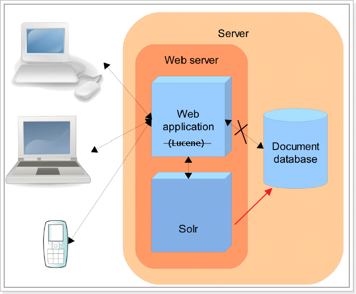
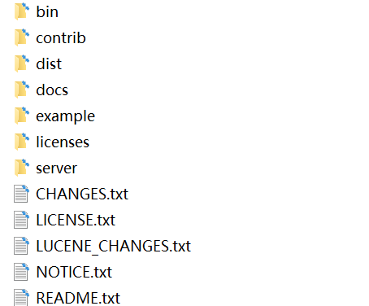
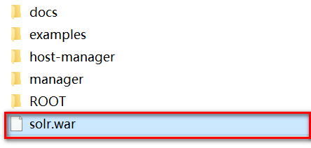
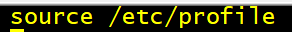
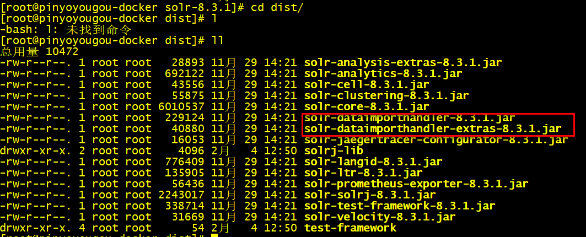
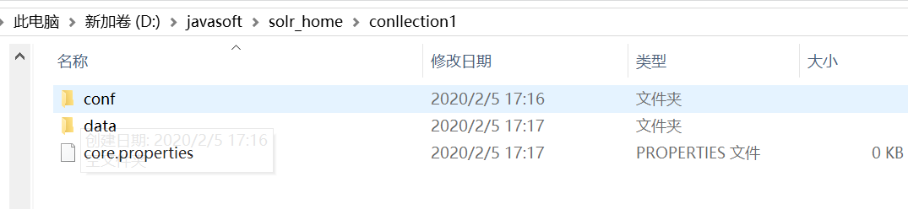
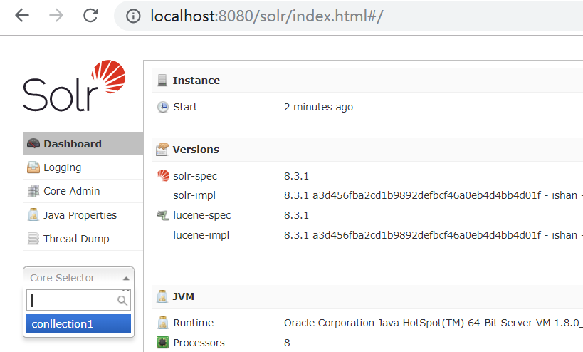
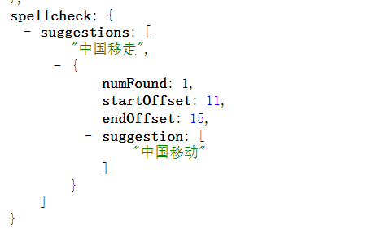
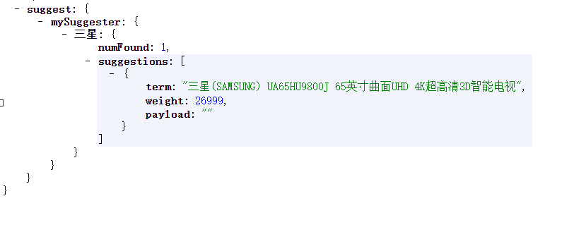

# 1. Solr簡介

## 1.1 Solr是什麼

- ​	Solr是Apache旗下基於Lucene開發的全文檢索的服務。用戶可以通過http請求，向Solr服務器提交一定格式的數據（XML,JSON），完成索引庫的索引。也可以通過Http請求查詢索引庫獲取返回結果(XML,JSON)。

​	Solr和Lucene的區別

- ​	Lucene是一個開放源代碼的全文檢索引擎工具包，它不是一個完整的全文檢索引擎，Lucene提供了完整的查詢引擎和索引引擎，目的是為軟件開發人員提供一個簡單易用的工具包，以方便的在目標系統中實現全文檢索的功能，或者以Lucene為基礎構建全文檢索引擎。

 Solr的目標是打造一款企業級的搜索引擎系統，它是一個搜索引擎服務，可以獨立運行，通過Solr可以非常快速的構建企業的搜索引擎，通過Solr也可以高效的完成站內搜索功能。

  


 ## 1.2 Solr的發展歷程

- ​		2004年，CNET NetWorks公司的Yonik Seeley工程師為公司網站開發搜索功能時完成了Solr的雛形。

起初Solr知識CNET公司的內部項目。

- ​        2006 年1月，CNET公司決定將Solr源碼捐贈給Apache軟件基金會。

- ​		2008 年9月，Solr1.3發布了新功能，其他包括分佈式搜索和性能增強等功能。

- ​        2009 年11月，Solr1.4版本發布，此版本對索引，搜索，Facet等方面進行優化，提高了對PDF，HTML等富文本文件處理能力，還推出了許多額外的插件；

- ​        2010 年3月，Lucene和Solr項目合併，自此,Solr稱為了Lucene的子項目，產品現在由雙方的參與者共同開發。

- ​		2011年，Solr改變了版本編號方案，以便與Lucene匹配。為了使Solr和Lucene有相同的版本號，Solr1.4下一版的版本變為3.1。

- ​		2012年10月，Solr4.0版本發布，新功能Solr Cloud也隨之發布。


## 1.3 Solr的功能優勢

- ​		靈活的查詢語法；
- ​         支持各種格式文件（Word，PDF）導入索引庫；
- ​        支持數據庫數據導入索引庫；
- ​        分頁查詢和排序
- ​       Facet維度查詢；
- ​       自動完成功能；
- ​       拼寫檢查；
- ​       搜索關鍵字高亮顯示；
- ​       Geo地理位置查詢;
- ​      Group 分組查詢;
- ​      Solr Cloud;

# 2. 下載和安裝

## 2.1 下載

​    solr的下載地址：https://lucene.apache.org/solr/downloads.html

​	Solr最新版本是8.4.1的版本，由於8屬於比較新的版本，可能有一些未知的Bug，出現問題後可能不好解決，所以我們使用Solr7.

   因為Solr是基於java語言開發，且Solr7.x要求的JDK版本最少是JDK8.所以我們在安裝solr之前，首先必須安裝JDK。

​	

## 2.2 Solr學習資源

​	 為了方便學習，Solr官方也提供了很多學習資料。可以在官方的Resources中查看；


​	官方提供的4種資料：

-    Solr Quick Start（即Solr快速上手教程）；

  ​	

-    Solr官方使用指南。

  ​	

-  Solr官方Wiki

  ​	

- Solr相關的英文書籍，如solr in action ,solr cookbook.

## 2.3 Window下安裝Solr

​	  window系統是我們平時開發和學習使用的一個平台，我們首先先來學習如何在window系統中安裝Solr;

### 	2.3.1**運行環境**

​		solr 需要運行在一個Servlet容器中，Solr7.x 要求jdk最少使用1.8以上，Solr默認提供Jetty（java寫的Servlet容器），本範例使用Tocmat作為Servlet容器，環境如下：

​		Solr：Solr7.x

​		Jdk：jdk1.8

​		Tomcat：apache-tomcat-9.0.56


### 	2.3.2 安裝步驟

- ​			下載solr-7.zip並解壓；

  ​		

  ​	bin：官方提供的一些solr的運行腳本。

  ​    contrib：社區的一些貢獻軟件/插件，用於增強solr的功能。

  ​	dist：Solr的核心JAR包和擴展JAR包

  ​	docs：solr的API文檔

  ​	example：官方提供的一些solr的demo代碼

  ​    licenses：solr遵守的一些開源協議文件

  ​	server:這個目錄有點意思，取名為sever，有點迷惑人，其實就是一個jetty.官方為了方便部署Solr，在安裝包中內置了一個Jetty; 我們直接就可以利用內置的jetty部署solr;

  ​	server/solr-webapp/webapp:進入到sever目錄中有一個webapp的目錄，這個目錄下部署的就是solr的war包（solr的服務）;

  接下來我們先來給大家簡單演示一下如何使用內置jetty服務器，部署solr服務；

-  jetty服務器，部署solr服務

  ​	進入bin目錄

  ​	啟動命令：solr start

  ​	

  ​    關閉命令：solr stop -all

  ​	

  ​    重啟solr  ：solr restart –p p_num


  使用localhost:8983就可以訪問solr後台管理系統；


  在實際開發中通常我們需要將solr部署到tomcat服務器中；接下來我們要講解的就是如何將solr部署到tomcat；

- ​    部署solr到tomcat；

  ​	1.解壓一個新的tomcat

  ​	2.將安裝包下server/solr-webapp/webapp下的solr服務打war包；

  ​	進入server/solr-webapp/webapp目錄

  ​	使用cmd窗口

```
  ​jar cvf  solr.war ./*
```


  ​	3.將solr.war複製到tomcat/webapps目錄中；

  

  4.啟動tomcat，解壓war包；

  5.修改webapp/solr/WEB-INF/web.xml的配置solr_home的位置；

  ```
  <env-entry>
     	<env-entry-name>solr/home</env-entry-name>
     	<env-entry-value>“你的solrhome位置”</env-entry-value>
     	<env-entry-type>java.lang.String</env-entry-type>
   </env-entry>
  ```

  Solr home目錄，SolrHome是Solr運行的主目錄，將來solr產生的數據就存儲在SolrHOME中；

  SolrHOME可以含多個SolrCore；

  SolrCore即Solr實例每個SolrCore可以對外單獨提供全文檢索的服務.

  理解為關係型數據庫中的數據庫. 關於solrCore的創建我們在後面的課程中專門來講解；

  6.取消安全配置

  ```
  <!--
    <security-constraint>
    <web-resource-collection>
        <web-resource-name>Disable TRACE</web-resource-name>
      <url-pattern>/</url-pattern>
        <http-method>TRACE</http-method>
      </web-resource-collection>
      <auth-constraint/>
    </security-constraint>
    <security-constraint>
      <web-resource-collection>
        <web-resource-name>Enable everything but TRACE</web-resource-name>
        <url-pattern>/</url-pattern>
        <http-method-omission>TRACE</http-method-omission>
      </web-resource-collection>
    </security-constraint>-->
  ```


  7.將solr-7.7.2/server/solr中所有的文件複製到solrHome

  8.複製日誌工具相關jar包：將solr-7.7.2/server/lib/ext下的jar包複製至上面Tomcat下Solr的/WEB-INF/lib/目錄下

  9.複製metrics相關jar包：將solr-7.7.2/server/lib下metrics相關jar包也複製至/WEB-INF/lib/目錄下*(solr聚合函數包)

  10.複製dataimport相關jar包:solr-7.7.2/dist下dataimport相關jar包也複製至/WEB-INF/lib/目錄下(solr 數據導入包)

  11.複製log4j2配置文件：將solr-7.7.2/server/resources目錄中的log4j配置文件拷入web工程目錄WEB-INF/classes（自行創建目錄） ，並且修改日誌文件的路徑

  12.重啟tomcat，看到welcome,說明solr就安裝完畢

  

  13.訪問後台管理系統進行測試

  http://localhost:8080/solr/index.html

  14.發生沒有solr.log.dir無法創建LOG文件的錯誤，要在tomcat的bin\catalina.bat中配置日誌文件的環境參數

- solr.log.dir 就是LOG的目錄
  ```
  set "JAVA_OPTS=%JAVA_OPTS% -Dsolr.log.dir=C:\webapps\fooFts\logs"
  ```

 

  ### 2.4 Linux下安裝Solr

​		在實際的生產環境中，通常我們都需要將solr安裝到linux服務器中；由於我們目前屬於學習階段。我們就使用虛擬機來模擬一個Linux服務器安裝solr；

- ​	  環境準備：

​			Cent0S 7.0 linux系統；

​			 Jdk1.8  linux安裝包

​				 https://www.oracle.com/technetwork/java/javase/downloads/jdk8-downloads-2133151.html

​		    tomcat：tomcat8.5

​				 https://tomcat.apache.org/

​            solr7.x 安裝包

​				http://mirror.bit.edu.cn/apache/lucene/solr/7.7.2/solr-7.7.2.tgz

​			這一塊的安裝包在資料中已經準備好了；

- ​    將linux中相關的安裝包上傳到linux

  ​	sftp上傳  Jdk1.8  tomcat8.5   solr7.x 安裝包到linux；

  1. ​	使用CRT連接到Linux

  2. ​     alt+p打開sftp,上傳相關的軟件安裝到到linux

     ​	

- ​    安裝jdk

  ​	

  1. ​	解壓jdk

      ```
      tar -xzvf jdk18 -C /usr/local
      ```

      

  2.    配置環境變量

     ```
     vi /etc/profile
     export JAVA_HOME=/usr/local/jdk1.8.0_171
     export PATH=$JAVA_HOME/bin:$PATH
     ```


  3. 重新加載profile文件,讓配置文件生效；

       

  4. 測試

      java -version

      


-    安裝tomcat，tomcat的安裝比較簡單，只需要解壓即可；

     

- ​    安裝solr,安裝solr的過程和windows系統過程完全相同。只不過通過linux命令來操作而已；

   1. 解壓solr安裝包,直接解壓在宿主目錄即可；

       解壓的目錄結構和window版的目錄結構相同；

      


   2. 將server/solr-webapp/webapp下的solr服務打war包；

      2.1 進入到webapp目錄

      cd server/solr-webapp/webapp

      2.2 將webapp中的代碼打成war包

       jar -cvf  solr.war ./*


​		3.將war包部署到tomcat的webapps目錄


​		4.啟動tomcat，解壓solr.war

​			4.1進入到tomcat的bin目錄

​				cd /usr/local/apache-tomcat-8.5.50

​			4.2 啟動tomcat

​				

​			4.3 進入到webapp目錄中查看

​				

5. 修改webapp/solr/WEB-INF/web.xml的配置solrhome的位置；

   ```
<env-entry>
      	<env-entry-name>solr/home</env-entry-name>
   	<env-entry-value>“你的solrhome位置”</env-entry-value>
      	<env-entry-type>java.lang.String</env-entry-type>
    </env-entry>
   ```

   既然solrhome指定的位置在/user/local/solr_home下面；所以需要創建一個solr_home的文件夾；

   

6.取消安全配置（和window相同）

7.將solr-7.7.2/server/solr中所有的文件複製到solrHome

  	7.1進入到solr-7.7.2/server/solr


​	  7.2將所有的文件複製到solrHome

​		


8.複製日誌工具相關jar包：將solr-7.7.2/server/lib/ext下的jar包複製至上面Tomcat下Solr的/WEB-INF/lib/目錄下

​	8.1 進入solr-7.7.2/server/lib/ext

```
	cd solr-7.7.2/server/lib/ext
```

   8.2 將所有文件複製到Tomcat下Solr的/WEB-INF/lib/


9.複製 metrics相關jar包：將solr-7.7.2/server/lib下metrics相關jar包也複製至/WEB-INF/lib/目錄下

​	9.1 進入solr-7.7.2/server/lib

​

```
cd solr-7.7.2/server/lib
```


   9.2 將metrics-開始的所有文件複製到Tomcat下Solr的/WEB-INF/lib/


10. 將solr安裝包中dist目錄中和數據導入相關的2個包，複製到tomcat/webapps/solr/WEB-INF/lib



```
 cp solr-dataimporthandler-* /usr/local/apache-tomcat-8.5.50/webapps/solr/WEB-INF/lib/
```

11.複製log4j2配置文件：將solr-7.7.2/server/resource目錄中的log4j配置文件拷入web工程目錄WEB-INF/classes（自行創建目錄） ，並且修改日誌文件的路徑

​	10.1 進入到solr-7.7.2/server/resource目錄中

```
cd solr-7.7.2/server/resource
```

​		

​	10.2  將log4j2的配置文件複製到solr 的WEB-INF/classes目錄；

​			創建classes目錄

​			

​			log4j的文件複製；

​			

12.重啟tomcat

​		進入到日誌文件中查看啟動情況；

```
cd ../logs

more catalina.out
```

13.訪問後台管理系統進行測試

http://localhost:8080/solr/index.html


# 3. Solr基礎

## 3.1 SolrCore

​		solr部署啟動成功之後，需要創建core才可以使用的，才可以使用Solr；類似於我們安裝完畢MySQL以後，需要創建數據庫一樣；

### 3.1.1 什麼是SolrCore

​	在Solr中、每一個Core、代表一個索引庫、裡麵包含索引數據及其配置信息。

​    Solr中可以擁有多個Core、也就是可以同時管理多個索引庫、就像mysql中可以有多個數據庫一樣。

​    所以SolrCore可以理解成MySQL中的數據庫；

### 3.1.2 SolrCore維護（windows）

​	簡單認識SolrCore以後，接下來要完成的是SolrCore的創建。在創建solrCore之前，我們首先認識一下SolrCore目錄結構：

​	1.SolrCore目錄結構

​    Core中有二個重要目錄：conf和data

​    

​    conf:存儲SolrCore相關的配置文件；

​    data:SolrCore的索引數據；

​    core.properties：SolrCore的名稱,name=SolrCore名稱；

​	所以搭建一個SolrCore只需要創建 2個目錄和一個properties文件即可；


2.SolrHome中搭建SolrCore

​	2.1 solrCore的目錄結構搞清楚以後，接下來就是關於SolrCore在哪裡進行創建呢？

​	在之前搭建Solr的時候，我們說一個solr_home是由多個solrCore構成，所以solrCore是搭建在solrHome中；

​	

​

​	2.2 將solr安裝包中的配置文件複製到conf目錄；

​		搭建好solrCore以後，conf目錄還沒沒有配置文件，我們需要將solr安裝包中提供的示例配置文件複製到conf目錄

​         solr安裝包中配置文件的位置：solr-7.7.2\example\example-DIH\solr\solr\conf


   2.3 重啟solr

   2.4 在solr的管理後台來查看

​		


3.如何創建多個solrCore；

​	只需要復制SolrCore一份，重啟solr；

​    


### 3.1.3 SolrCore維護（linux）

​	5.1 進入到SolrHome

```
 cd /usr/local/solr_home/
```

​        

​	5.2 創建SolrCore

		 mkdir -p collection1/data
		 mkdir -p collection1/conf
		 cd collection1
		 touch core.properties

	5.3  將solr安裝包中提供的示例配置文件複製到conf目錄

```
cd solr-8.3.1/example/example-DIH/solr/solr/conf/

cp -r *  /usr/local/solr_home/collection1/conf/
```

  5.4 重啟tomcat

  5.5訪問後台管理系統


## 3.2 Solr後台管理系統的使用

​	上一個章節我們已經學習完畢如何在solr中創建SolrCore。有了SolrCore以後我們就可以進行索引和搜索的操作，在進行索引和搜索操作之前，首先學習一下Solr後台管理系統的使用；

​	1.DashBoard:solr的版本信息、jvm的相關信息還有一些內存信息。

​	2.Logging:日誌信息，也有日誌級別，剛進入查看的時候肯定是有幾個警告（warn）信息的，因為複制solr的時候路徑發生了變化導致找不到文件，但是並不影響。
​	3.Core Admin:SolrCore的管理頁面。可以使用該管理界面完成SolrCore的卸載。也可以完成SolrCore的添加

 能添加的前提，SolrCore在solr_home中目錄結構是完整的。

   4.Java Properties:顧名思義，java的相關配置，比如類路徑，文件編碼等。

   5.Thread Dump:solr服務器當前活躍的一些線程的相關信息。
	以上的5個了解一下就行。

   6.當我們選擇某一個solrCore以後，又會出現一些菜單，這些菜單就是對選擇的SolrCore進行操作的，接下來我們重點要講解的就是這些菜單的使用；


   ### 3.2.1 Documents

​	首先我們先來講解第一個菜單：Documents

​	作用：向SolrCore中添加數據，刪除數據，更新數據(索引)。

​    在講解如何使用Documents菜單向Solr中添加數據之前，我們首先回顧一下我們之前在Lucene中學習的一些概念；

​	1. 概念介紹：

​	 文檔：document是lucene進行索引創建以及搜索的基本單元，我們要把數據添加到Lucene的索引庫中，數據結構就是document，如果我從Lucene的索引庫中進行數據的搜索， 搜索出來的結果的數據結構也document；

​	文檔的結構：學習過Lucene的同學都知道，一個文檔是由多個域（Field）組成，每個域包含了域名和域值；

如果數據庫進行類比，文檔相單于數據庫中的一行記錄，域（Field）則為一條記錄的字段。

​	數據庫中記錄：


​	lucene/solr中文檔

​	

​	索引：通常把添加數據這個操作也成為創建索引；

​    搜索：通常把搜索數據這個操作也成為搜索索引；

​    倒排索引：

​			Solr添加數據的流程：


​			Lucene首先對文檔域中的數據進行分詞，建立詞和文檔之間的關係；

​			

​			將來我們就可以根據域中的詞，快速查找到對應的文檔；

​

​			Lucene中相關概念回顧完畢；


​

​	2.添加文檔

​			使用後台管理系統，向Solr中添加文檔。文檔的數據格式可以是JSON，也可以XML；

​			以JSON的形式添加文檔：

​				

​		以XML的形式添加文檔

​				

  通常我們可以添加一些測試數據；

3.修改數據

​	Solr要求每一個文檔都需要有一個id域；如果添加的文檔id在SolrCore中已經存在，即可完成數據修改；

4.刪除數據

​	 只能通過XML的格式刪除文檔；下面我們提供2種刪除方式

```
根據id刪除
<delete>
 <id>8</id>
</delete>
<commit/>
根據條件刪除，需要指定查詢的字符串，根據查詢的字符串刪除。
<delete>
 <query>*:*</query>
</delete>
<commit/>
```
### 3.2.2 Analyse

​	作用：測試域/域類型（後面講解）分詞效果；

​	之前我們在講解倒排索引的時候，當我們向Solr中添加一個文檔，底層首先要對文檔域中的數據進行分詞。

建立詞和文檔關係。

### 3.2.4 Solr的配置-Field

​	在Solr中我們需要學習其中4個配置文件；

​		SolrHome中solr.xml

   	 SolrCore/conf中solrconfig.xml

​		SolrCore/confSolrCore中managed-schema

​		SolrCore/conf/data-config.xml

​	其中我們最常用的一個配置文件，managed-schema。

​	managed-schema（掌握）

​		在Solr中進行索引時，文檔中的域需要提前在managed-schema文件中定義，在這個文件中，solr已經提前定義了一些域，比如我們之前使用的id,price,title域。通過管理界面查看已經定義的域；

​	  

下面就是solr中一定定義好的一個域,name

```
<field name="name" type="text_general" indexed="true" stored="true"/>
```

​	field標籤：定義一個域；

​	name屬性：域名

​	indexed:是否索引，是否可以根據該域進行搜索；一般哪些域不需要搜索，圖片路徑。

​	stored:是否存儲，將來查詢的文檔中是否包含該域的數據； 商品的描述。

​	舉例：將圖書的信息存儲到Solr中；Description域。 indexed設置為true，store設置成false；

​	可以根據商品描述域進行查詢，但是查詢出來的文檔中是不包含description域的數據；


​	multiValued：是否多值，該域是否可以存儲一個數組； 圖片列表；

​	required:是否必須創建文檔的時候，該域是否必須；id

​	type:域類型，決定該域使用的分詞器。分詞器可以決定該域的分詞效果（分詞，不分詞，是否支持中文分詞）。域的類型在使用之前必須提前定義；在solr中已經提供了很多的域類型

```
<fieldType name="text_general" class="solr.TextField" positionIncrementGap="100">
      <analyzer type="index">
        <tokenizer class="solr.StandardTokenizerFactory"/>
        <filter class="solr.StopFilterFactory" ignoreCase="true" words="stopwords.txt" />
        <!-- in this example, we will only use synonyms at query time
        <filter class="solr.SynonymGraphFilterFactory" synonyms="index_synonyms.txt" ignoreCase="true" expand="false"/>
        <filter class="solr.FlattenGraphFilterFactory"/>
        -->
        <filter class="solr.LowerCaseFilterFactory"/>
      </analyzer>
      <analyzer type="query">
        <tokenizer class="solr.StandardTokenizerFactory"/>
        <filter class="solr.StopFilterFactory" ignoreCase="true" words="stopwords.txt" />
        <filter class="solr.SynonymGraphFilterFactory" synonyms="synonyms.txt" ignoreCase="true" expand="true"/>
        <filter class="solr.LowerCaseFilterFactory"/>
      </analyzer>
    </fieldType>
```

​	以上這些概念和Lucene中講解的是一樣的；

​	自定義一個商品描述域：

```
<field name="item_description" type="text_general" indexed="true" stored="false"/>
```

​	定義一個圖片域

```
<field name="item_image" type="string" indexed="false" stored="true" multiValued=true/>
```

重啟solr

​	測試分詞效果

​		通過測試我們發現text_general域類型，支持英文分詞，不支持中文分詞；


​	測試添加文檔

```
{id:"1101",name:"java編程思想",item_image:["big.jpg","small.jpg"],item_description:"lucene是apache的開源項目，是一個全文檢索的工具包。"}
```

測試item_description域搜索

​	

可以通過item_description域進行搜索，但是搜索結果的文檔中是沒有item_description域的數據的；

測試item_pic域搜索


### 3.2.5 Solr的配置-FieldType

介紹

上一章節我們講解了Field的定義。接下來我們要講解的是FieldType域類型；

剛才我們給大家講解瞭如何在schema文件中定義域，接下來我們要講解域類型如何定義；

每個域都需要指定域類型，而且域類型必須提前定義。域類型決定該域使用的索引和搜索的分詞器，影響分詞效果。

Solr中已經提供好了一些域類型；

​	text_general：支持英文分詞，不支持中文分詞；

​	string：不分詞；適合於id,訂單號等。

​	pfloat:適合小數類型的域，特殊分詞，支持大小比較；

​	pdate:適合日期類型的域，特殊分詞，支持大小比較；

​	pint:適合整數類型的域，特殊分詞，支持大小比較；

​	plong:適合長整數類型的域，特殊分詞，支持大小比較；

我們以text_general為例看一下如何定義FiledType.text_general是solr中已經提供好的一個域類型；他的定義如下；

```
  <fieldType name="text_general" class="solr.TextField" positionIncrementGap="100">
      <analyzer type="index">
        <tokenizer class="solr.StandardTokenizerFactory"/>
        <filter class="solr.StopFilterFactory" ignoreCase="true" words="stopwords.txt" />
        <!-- in this example, we will only use synonyms at query time
        <filter class="solr.SynonymGraphFilterFactory" synonyms="index_synonyms.txt" ignoreCase="true" expand="false"/>
        <filter class="solr.FlattenGraphFilterFactory"/>
        -->
        <filter class="solr.LowerCaseFilterFactory"/>
      </analyzer>
      <analyzer type="query">
        <tokenizer class="solr.StandardTokenizerFactory"/>
        <filter class="solr.StopFilterFactory" ignoreCase="true" words="stopwords.txt" />
        <filter class="solr.SynonymGraphFilterFactory" synonyms="synonyms.txt" ignoreCase="true" expand="true"/>
        <filter class="solr.LowerCaseFilterFactory"/>
      </analyzer>
    </fieldType>
```

##### 3.2.5.1 相關屬性

name:域類型名稱，定義域類型的必須指定，並且要唯一；將來定義域的時候需要指定通過域名稱來指定域類型；（重點）

class:域類型對應的java類，必須指定，如果該類是solr中的內置類，使用solr.類名指定即可。如果該類是第三方的類，需要指定全類名。 （重點）

如果class是TextField，我們還需要使用<analyzer>子標籤來配置分析器；

positionIncrementGap：用於多值字段，定義多值間的間隔，來阻止假的短語匹配（了解）。

autoGeneratePhraseQueries：用於文本字段，如果設為true，solr會自動對該字段的查詢生成短語查詢，即使搜索文本沒帶“”（了解）

enableGraphQueries：是否支持圖表查詢（了解）
docValuesFormat：docValues字段的存儲格式化器：schema-aware codec，配置在solrconfig.xml中的（了解）
postingsFormat：詞條格式器：schema-aware codec，配置在solrconfig.xml中的（了解）

##### 3.2.5.2 Solr自帶的FieldType類

​		solr除了提供了TextField類，我們也可以查看它提供的其他的FiledType類，我們可以通過官網查看其他的FieldType類的作用：

http://lucene.apache.org/solr/guide/8_1/field-types-included-with-solr.html


##### 3.2.5.3 FieldType常用類的使用

 TextField：支持對字符類型的數據進行分詞；對於 solr.TextField 域類型，需要為其定義分析器;

我們首先先來搞清楚什麼是Solr分析器；

###### 	分析器的基本概念

​	分析器就是將用戶輸入的一串文本分割成一個個token，一個個token組成了tokenStream，然後遍歷tokenStream對其進行過濾操作，比如去除停用詞,特殊字符，標點符號和統一轉化成小寫的形式等。分詞的準確的準確性會直接影響搜索的結果，從某種程度上來講，分詞的算法不同，都會影響返回的結果。因此分析器是搜索的基礎；

​	分析器的工作流程：

​		分詞

​		過濾


  

在solr中已經為我們提供了很多的分詞器及過濾器；

Solr中提供的分詞器tokenizer：http://lucene.apache.org/solr/guide/8_1/tokenizers.html

標準分詞器，經典分詞器，關鍵字分詞器，單詞分詞器等，不同的分詞器分詞的效果也不盡相同；


Solr中提供的過濾器tokenfilter：http://lucene.apache.org/solr/guide/8_1/about-filters.html

不同的過濾器過濾效果也不同，有些是去除標點符號的，有些是大寫轉化小寫的；


###### 常用分詞器的介紹

​	Standard Tokenizer

​	作用：這個Tokenizer將文本的空格和標點當做分隔符。注意，你的Email地址（含有@符合）可能會被分解開；用點號（就是小數點）連接的部分不會被分解開。對於有連字符的單詞，也會被分解開。

例子：

```
<analyzer>
  <tokenizer class="solr.StandardTokenizerFactory"/>
</analyzer>
```

```
輸入：“Please, email john.doe@foo.com by 03-09, re: m37-xq.”
輸出： “Please”, “email”, “john.doe”, “foo.com”, “by”, “03”, “09”, “re”, “m37”, “xq
```

​	Classic Tokenizer

作用：基本與Standard Tokenizer相同。注意，用點號（就是小數點）連接的部分不會被分解開；用@號（Email中常用）連接的部分不會被分解開；互聯網域名（比如wo.com.cn）不會被分解開；有連字符的單詞，如果是數字連接也會被分解開。

例子：

```
<analyzer>
  <tokenizer class="solr.ClassicTokenizerFactory"/>
</analyzer>
```

```
輸入： “Please, email john.doe@foo.com by 03-09, re: m37-xq.”
輸出： “Please”, “email”, “john.doe@foo.com”, “by”, “03-09”, “re”, “m37-xq”
```

​	Keyword Tokenizer

​	作用：把整個輸入文本當做一個整體。

例子：

```
<analyzer>
  <tokenizer class="solr.KeywordTokenizerFactory"/>
</analyzer>
```

```
輸入： “Please, email john.doe@foo.com by 03-09, re: m37-xq.”
輸出： “Please, email john.doe@foo.com by 03-09, re: m37-xq.”
```

 Letter Tokenizer

​	作用：只處理字母，其他的符號都被認為是分隔符

例子：

```
<analyzer>
  <tokenizer class="solr.LetterTokenizerFactory"/>
</analyzer>
```

```
輸入： “I can’t.”
輸出： “I”, “can”, “t”
```

 Lower Case Tokenizer

​	作用：以非字母元素分隔，將所有的字母轉化為小寫。

```
<analyzer>
  <tokenizer class="solr.LowerCaseTokenizerFactory"/>
</analyzer>
```

```
輸入： “I just LOVE my iPhone!”
輸出： “i”, “just”, “love”, “my”, “iphone”
```

 N-Gram Tokenizer

  作用：將輸入文本轉化成指定範圍大小的片段的詞，注意，空格也會被當成一個字符處理；


| 參數        | 值          | 說明                             |
| ----------- | ----------- | -------------------------------- |
| minGramSize | 整數，默認1 | 指定最小的片段大小，需大於0      |
| maxGramSize | 整數，默認2 | 指定最大的片段大小，需大於最小值 |

例子1：

```
<analyzer>
  <tokenizer class="solr.NGramTokenizerFactory"/>
</analyzer>
```

```
輸入： “hey man”
輸出： “h”, “e”, “y”, ” “, “m”, “a”, “n”, “he”, “ey”, “y “, ” m”, “ma”, “an”

```

例子2：

```
<analyzer>
  <tokenizer class="solr.NGramTokenizerFactory" minGramSize="4" maxGramSize="5"/>
</analyzer>
```

```
輸入： “bicycle”
輸出： “bicy”, “bicyc”, “icyc”, “icycl”, “cycl”, “cycle”, “ycle“
```

Edge N-Gram Tokenizer

​		作用：用法和N-Gram Tokenizer類似

| 參數        | 值                             | 說明                                   |
| ----------- | ------------------------------ | -------------------------------------- |
| minGramSize | 整數，默認1                    | 指定最小的片段大小，需大於0            |
| maxGramSize | 整數，默認1                    | 指定最大的片段大小，需大於或等於最小值 |
| side        | “front” 或 “back”, 默認”front” | 指定從哪個方向進行解析                 |

例子1：

```
<analyzer>
  <tokenizer class="solr.EdgeNGramTokenizerFactory" />
</analyzer>
```

```
輸入： “babaloo”
輸出： “b”
```

例子2：

```
<analyzer>
  <tokenizer class="solr.EdgeNGramTokenizerFactory" minGramSize="2" maxGramSize="5"/>
</analyzer>
```

```
輸入： “babaloo”
輸出： “ba”, “bab”, “baba”, “babal”
```

例子3：

```
<analyzer>
  <tokenizer class="solr.EdgeNGramTokenizerFactory" minGramSize="2" maxGramSize="5" side="back"/>
</analyzer>
```

```
輸入： “babaloo”
輸出： “oo”, “loo”, “aloo”, “baloo”
```

 Regular Expression Pattern Tokenizer

 	作用：可以指定正則表達式來分析文本。

| 參數   | 值                 | 說明                                                         |
| ------ | ------------------ | ------------------------------------------------------------ |
| attern | 必選項             | 正規表達式                                                   |
| roup   | 數字，可選，默認-1 | 負數表示用正則表達式做分界符；非正數表示只分析滿足正則表達式的部分；0表示滿足整個正則表達式；大於0表示滿足正則表達式的第幾個括號中的部分 |

   例子1：

```
<analyzer>
  <tokenizer class="solr.PatternTokenizerFactory" pattern="\s*,\s*"/>
</analyzer>
```

```
輸入： “fee,fie, foe , fum”
輸出： “fee”, “fie”, “foe”, “fum”
```

​	例子2：

```
<analyzer>
  <tokenizer class="solr.PatternTokenizerFactory" pattern="[A-Z][A-Za-z]*" group="0"/>
</analyzer>
```

```
輸入： “Hello. My name is Inigo Montoya. You killed my father. Prepare to die.”
輸出： “Hello”, “My”, “Inigo”, “Montoya”, “You”, “Prepare”
這裡的group為0，表示必須滿足整個表達式，正則表達式的含義是以大寫字母開頭，之後是大寫字母或小寫字母的組合。
```

   例子3：

```
<analyzer>
  <tokenizer class="solr.PatternTokenizerFactory" pattern="(SKU|Part(\sNumber)?):?\s(\[0-9-\]+)" group="3"/>
</analyzer>
```

```
輸入： “SKU: 1234, Part Number 5678, Part: 126-987”
輸出： “1234”, “5678”, “126-987”
這個group等於3，表示滿足第三個括號”[0-9-]+”中的正則表達式
```

White Space Tokenizer

  作用：這個Tokenizer將文本的空格當做分隔符。

| 參數 | 值       | 說明         |
| ---- | -------- | ------------ |
| rule | 默認java | 如何定義空格 |

  例子：

```
<analyzer>
  <tokenizer class="solr.WhitespaceTokenizerFactory" rule="java" />
</analyzer>
```

```
輸入： “To be, or what?”
輸出： “To”, “be,”, “or”, “what?”
```

###### 常用過濾器介紹

​	上一小結我們學習了Solr中的常用分詞器，接下來我們講解過濾器。過濾器是對分詞器的分詞結果進行再次處理，比如：將詞轉化為小寫，排除掉停用詞等。

​	Lower Case Filter

​		作用:這個Filter將所有的詞中大寫字符轉化為小寫

​		例子：

```
<analyzer>
  <tokenizer class="solr.StandardTokenizerFactory"/>
  <filter class="solr.LowerCaseFilterFactory"/>
</analyzer>
```

```
原始文本： “Down With CamelCase”
輸入： “Down”, “With”, “CamelCase”
輸出： “down”, “with”, “camelcase”
```

​	Length Filter

​		作用：這個Filter處理在給定範圍長度的tokens。

​		參數：

| 參數 | 值                    | 說明                |
| ---- | --------------------- | ------------------- |
| min  | 整數，必填            | 指定最小的token長度 |
| max  | 整數，必填，需大於min | 指定最大的token長度 |

​		例子：

```
<analyzer>
  <tokenizer class="solr.StandardTokenizerFactory"/>
  <filter class="solr.LengthFilterFactory" min="3" max="7"/>
</analyzer>
```

```
原始文本： “turn right at Albuquerque”
輸入： “turn”, “right”, “at”, “Albuquerque”
輸出： “turn”, “right”
```

​	pattern Replace Filter

​		作用：這個Filter可以使用正則表達式來替換token的一部分內容，與正則表達式想匹配的被替換，不匹配的不變。

​	參數：

| 參數        | 值                          | 說明                       |
| ----------- | --------------------------- | -------------------------- |
| pattern     | 必填，正則表達式            | 需要匹配的正則表達式       |
| replacement | 必填，字符串                | 需要替換的部分             |
| replace     | “all” 或 “first”, 默認”all” | 全部替換還是，只替換第一個 |

例子1：

```
<analyzer>
  <tokenizer class="solr.StandardTokenizerFactory"/>
  <filter class="solr.PatternReplaceFilterFactory" pattern="cat" replacement="dog"/>
</analyzer>
```

```
原始文本： “cat concatenate catycat”
輸入： “cat”, “concatenate”, “catycat”
輸出： “dog”, “condogenate”, “dogydog”
```

例子2：

```
<analyzer>
  <tokenizer class="solr.StandardTokenizerFactory"/>
  <filter class="solr.PatternReplaceFilterFactory" pattern="cat" replacement="dog" replace="first"/>
</analyzer>
```

```
原始文本： “cat concatenate catycat”
輸入： “cat”, “concatenate”, “catycat”
輸出： “dog”, “condogenate”, “dogycat”
```

Stop Words Filter

​		作用：這個Filter會在解析時忽略給定的停詞列表（stopwords.txt）中的內容；

​	參數：

| 參數       | 值                 | 說明               |
| ---------- | ------------------ | ------------------ |
| words      | 可選，停詞列表     | 指定停詞列表的路徑 |
| format     | 可選，如”snowball” | 停詞列表的格式     |
| ignoreCase | 布爾值，默認false  | 是否忽略大小寫     |

​	例子1：

```
<analyzer>
  <tokenizer class="solr.StandardTokenizerFactory"/>
  <filter class="solr.StopFilterFactory" words="stopwords.txt"/>
</analyzer>
```

```
保留詞列表stopwords.txt
	be
	or
	to
```

```
原始文本： “To be or what?”
輸入： “To”(1), “be”(2), “or”(3), “what”(4)
輸出： “To”(1), “what”(4)
```

​	例子2：

```
<analyzer>
  <tokenizer class="solr.StandardTokenizerFactory"/>
  <filter class="solr.StopFilterFactory" words="stopwords.txt" ignoreCase="true"/>
</analyzer>
```

```
保留詞列表stopwords.txt
be
or
to
```

```

原始文本： “To be or what?”
輸入： “To”(1), “be”(2), “or”(3), “what”(4)
輸出： “what”(4)
```

 Keep Word Filter

​	作用：這個Filter將不屬於列表中的單詞過濾掉。和`Stop Words Filter`的效果相反。

| 參數       | 值                     | 說明                     |
| ---------- | ---------------------- | ------------------------ |
| words      | 必填，以.txt結尾的文件 | 提供保留詞列表           |
| ignoreCase | 布爾值，默認false      | 是否忽略保留詞列表大小寫 |

​	例子1：

```

<analyzer>
  <tokenizer class="solr.StandardTokenizerFactory"/>
  <filter class="solr.KeepWordFilterFactory" words="keepwords.txt"/>
</analyzer>
```

```
保留詞列表keepwords.txt
happy
funny
silly
```

```
原始文本： “Happy, sad or funny”
輸入： “Happy”, “sad”, “or”, “funny”
輸出： “funny”
```

​	例子2：

```
<analyzer>
  <tokenizer class="solr.StandardTokenizerFactory"/>
  <filter class="solr.KeepWordFilterFactory" words="keepwords.txt" ignoreCase="true" />
</analyzer>
```

```
保留詞列表keepwords.txt
happy
funny
silly
```

```
原始文本： “Happy, sad or funny”
輸入： “Happy”, “sad”, “or”, “funny”
輸出： “Happy”, “funny”
```

 Synonym Filter

​	作用：這個Filter用來處理同義詞；

| 參數       | 值                     | 說明                 |
| ---------- | ---------------------- | -------------------- |
| synonyms   | 必選，以.txt結尾的文件 | 指定同義詞列表       |
| ignoreCase | 布爾值，默認false      | 是否忽略大小寫       |
| format     | 可選，默認solr         | 指定解析同義詞的策略 |

```
注意，常用的同義詞列表格式：
1. 以#開頭的行為註釋內容，忽略
2. 以,分隔的文本，為雙向同義詞，左右內容等價，互為同義詞
3. 以=>分隔的文本，為單向同義詞，匹配到左邊內容，將替換為右邊內容，反之不成立
```

例子：

```
<analyzer>
  <tokenizer class="solr.StandardTokenizerFactory"/>
  <filter class="solr.SynonymFilterFactory" synonyms="mysynonyms.txt"/>
</analyzer>
```
```
同義詞列表synonyms.txt
couch,sofa,divan
teh => the
huge,ginormous,humungous => large
small => tiny,teeny,weeny
```

```
原始文本： “teh small couch”
輸入： “teh”(1), “small”(2), “couch”(3)
輸出： “the”(1), “tiny”(2), “teeny”(2), “weeny”(2), “couch”(3), “sofa”(3), “divan”(3)

原始文本： “teh ginormous, humungous sofa”
輸入： “teh”(1), “ginormous”(2), “humungous”(3), “sofa”(4)
輸出： “the”(1), “large”(2), “large”(3), “couch”(4), “sofa”(4), “divan”(4)
```
###### TextField的使用

  	前面我們已經學習完畢solr中的分詞器和過濾器，有了這些知識的儲備後，我們就可以使用TextField這種類定義FieldType.

​	之前我們說過，在我們在使用TextField作為FieldType的class的時候，必須指定Analyzer，用一個`<analyzer>`標籤來聲明一個Analyzer；

方式一：直接通過class屬性指定分析器類，該類必須繼承org.apache.lucene.analysis.Analyzer

```
<fieldType name="nametext" class="solr.TextField">
  <analyzer class="org.apache.lucene.analysis.core.WhitespaceAnalyzer"/>
</fieldType>
```

這裡的`WhitespaceAnalyzer`就是一種分析器，這個分析器中封裝了我們之前講過了一個分詞器WhitespaceTokenizer。

這種方式寫起來比較簡單，但是透明度不夠，使用者可能不知道這個分析器中封裝了哪些分詞器和過濾器

測試：


對於那些複雜的分析需求，我們也可以在分析器中靈活地組合分詞器、過濾器；

方式二：可以靈活地組合分詞器、過濾器

```
<fieldType name="nametext" class="solr.TextField">
  <analyzer>
    <tokenizer class="solr.StandardTokenizerFactory"/>
    <filter class="solr.LowerCaseFilterFactory"/>
    <filter class="solr.StopFilterFactory" words="stopwords.txt"/>
  </analyzer>
</fieldType>
```

測試：


方式三：如果該類型字段索引、查詢時需要使用不同的分析器，則需區分配置analyzer(索引的時候，採用細粒度分詞器，搜索的時候，採用粗粒度分詞器)

```
<fieldType name="nametext" class="solr.TextField">
  <analyzer type="index">
    <tokenizer class="solr.StandardTokenizerFactory"/>
    <filter class="solr.LowerCaseFilterFactory"/>
    <filter class="solr.SynonymFilterFactory" synonyms="syns.txt"/>
  </analyzer>
  <analyzer type="query">
    <tokenizer class="solr.StandardTokenizerFactory"/>
    <filter class="solr.LowerCaseFilterFactory"/>
  </analyzer>
</fieldType>

```

測試索引分詞效果：


測試搜索分詞效果


 通過測試我們發現索引和搜索產生的分詞結果是不同；


 接下來我們使用myFeildType3定義一個域。使用該域創建一個文檔。我們來測試；


item_content:sofa可以搜索到嗎？

索引的時候:   sofa被分為couch,sofa,divan；


搜索的時候，sofa這個內容就被分為sofa這一個詞；

item_content:couch可以搜索到嗎？

item_content:small可以搜索到嗎？

索引的時候,small經過同義詞過濾器變成 tiny,teeny,weeny 。 small並沒有和文檔建立倒排索引關係；

搜索的時候small內容只能被分為samll這個詞；所以找不到；

結論:

所以一般我們在定義FieldType的時候，索引和搜索往往使用的分析器規則相同；

或者索引的時候採用細粒度的分詞器,目的是讓更多的詞和文檔建立倒排索引；

搜索的時候使用粗粒度分詞器，詞分的少一點，提高查詢的精度；

###### DateRangeField的使用


​		Solr中提供的時間域類型（ DatePointField, DateRangeField）是以時間毫秒數來存儲時間的。要求域值以ISO-8601標準格式來表示時間：yyyy-MM-ddTHH:mm:ssZ。 Z表示是UTC時間，如1999-05-20T17:33:18Z；

```
秒上可以帶小數來表示毫秒如：1972-05-20T17:33:18.772Z、1972-05-20T17:33:18.77Z、1972-05-20T17:33:18.7Z
```

域類型定義很簡單：

```
<fieldType name="myDate" class="solr.DateRangeField" />
```

使用myDate域類型定義一個域

```
<field name="item_birthday" type="myDate" indexed="true" stored="true" />
```

基於item_birthday域來索引

```
{id:666777,name:"xiaoming",item_birthday:"2020-3-6T19:21:22Z"}
{id:777888,name:"misscang",item_birthday:"2020-3-6T19:22:22.333Z"}
```

如何基於item_birthday搜索

語法：

```
查詢時如果是直接的時間串，需要用轉義字符進行轉義：
item_birthday:2020-2-14T19\:21\:22Z
#用字符串表示的則不需要轉義
item_birthday:"2020-2-14T19:21:22Z"
```

DateRangeField除了支持精確時間查詢，也支持對間段數據的搜索，支持兩種時間段表示方式：

```
方式一：截斷日期，它表示整個日期跨度的精確指示。
方式二：時間範圍，語法 [t1 TO t2] {t1 TO t2}，中括號表示包含邊界，大括號表示不包含邊界
```

例子：

```
2000-11		#表示2000年11月整個月.
2000-11T13		#表示2000年11月每天的13點這一個小時
[2000-11-01 TO 2014-12-01]		#日到日
[2014 TO 2014-12-01]		#2014年開始到2014-12-01止.
[* TO 2014-12-01]		#2014-12-01(含）前.
```

演示：

```
item_birthday:2020-11-21
item_birthday:[2020-02-14T19:21 TO 2020-02-14T19:22]
```

Solr中還支持用 【NOW ±/ 時間】的數學表達式來靈活表示時間。

```
NOW+1MONTH  #當前時間加上1個月
NOW+2MONTHS  #當前時間加上兩個月，複數要機上S
NOW-1DAY
NOW-2DAYS
NOW/DAY, NOW/HOURS表示，截斷。如果當前時間是2017-05-20T23:32:33Z，那麼即是2017-05-20T00:00:00Z，2017-05-20T23:00:00Z。取當日的0點，去當前小時0點
NOW+6MONTHS+3DAYS/DAY
1972-05-20T17:33:18.772Z+6MONTHS+3DAYS/DAY
```


演示：

```
item_birthday:[NOW-3MONTHS  TO NOW] 生日在三個月內的；
item_birthday:[NOW/DAY TO NOW] 當前時間的0點到當前時間
item_birthday:[NOW/HOURS TO NOW] 當前小時的0點到當前時間
```

###### EnumFieldType的使用


EnumFieldType 用於域值是一個枚舉集合，且排序順序可預定的情況，如新聞分類這樣的字段。如果我們想定義一個域類型，他的域值只能取指定的值，我們就可以使用EnumFieldType 定義該域類型；

域類型定義：

```
<fieldType name="mySex" class="solr.EnumFieldType"
enumsConfig="enumsConfig.xml" enumName="sexType" docValues="true" />
```

屬性：

| 參數        | 值              | 說明                                                    |
| :---------- | --------------- | ------------------------------------------------------- |
| enumsConfig | enumsConfig.xml | 指定枚舉值的配置文件，絕對路徑或相對內核conf/的相對路徑 |
| enumName    | 任意字符串      | 指定配置文件的枚舉名。 |
| docValues   | true/false      | 枚舉類型必須設置 true                                   |

enumsConfig.xml配置示例（若沒有該文件則新建）如下：注意以UTF-8無BOM格式保存；

```
<?xml version="1.0" encoding="UTF-8"?>
<enumsConfig>
    <enum name="sexType">
        <value>男</value>
        <value>女</value>
    </enum>
    <enum name="new_cat">
        <value>a</value>
        <value>b</value>
        <value>c</value>
        <value>d</value>
    </enum>
</enumsConfig>
```

演示：

```
<field name="item_sex" type="mySex" indexed="true" stored="true" />
```

基於item_sex進行索引

```
{id:123321,item_birthday:"1992-04-20T20:33:33Z",item_content:"i love sofa",item_sex:"男"}
{id:456564,item_birthday:"1992-04-20T20:33:33Z",item_content:"i love sofa",item_sex:"女"}
```

```
{id:789987,item_birthday:"1992-04-20T20:33:33Z",item_content:"i love sofa",item_sex:"妖"}
報錯
```


基於item_sex進行搜索

item_sex:男

item_sex:女

### 3.2.6  Solr的配置-DynamicField 動態域

​		在schema文件中我們還可以看到一種標籤dynamicField，這個標籤也是用來定義域的；他和field標籤有什麼區別呢

​	作用：如果某個業務中有近百個域需要定義，其中有很多域類型是相同，重複地定義域就十分的麻煩，因此可以定一個域名的規則，索引的時候，只要域名符合該規則即可；

​	如：整型域都是一樣的定義，則可以定義一個動態域如下

	<dynamicField name="*_i"  type="pint"    indexed="true"  stored="true"/>
	注意：動態域只能用符號*通配符進行表示，且只有前綴和後綴兩種方式

基於動態域索引；

```
{id:38383,item_birthday:"1992-04-20T20:33:33Z",item_content:"i love sofa",item_sex:"女",
bf_i:5}
bf_i就是符合上面動態域的域名；
```

### 3.2.7  Solr的配置-複製域

​	在schema文件中我們還可以看到一種標籤copyField ，這個標籤是用來定義復制域的；賦值域的作用是什麼呢？

​	作用：複製域允許將一個或多個域的數據填充到另外一個域中。他的最主要的作用，基於某一個域搜索，相當於在多個域中進行搜索；

```
   <copyField source="cat" dest="text"/>
   <copyField source="name" dest="text"/>
   <copyField source="manu" dest="text"/>
   <copyField source="features" dest="text"/>
   <copyField source="includes" dest="text"/>
   cat name manu features includes text都是solr提前定義好的域。
   將 cat name manu features includes域的內容填充到text域中；
   將來基於text域進行搜索，相當於在cat name manu features includes域中搜索；
```

​	演示：

​

```
索引:
{id:1,name:"pitter wang"}
{id:2,name:"pitter ma"}
{id:3,manu:"jack ma"}
{id:4,manu:"joice liu"}
```

```
搜索：
text:ma
```

結果：


### 3.2.8  Solr的配置-主鍵域

​	指定用作唯一標識文檔的域，必須。在solr中默認將id域作為主鍵域；也可以將其他改為主鍵域，但是一般都會修改；

```
 <field name="id" type="string" indexed="true" stored="true" required="true" multiValued="false" />
 <uniqueKey>id</uniqueKey>
 注意：主鍵域不可作為複制域，且不能分詞。
```

### 3.2.9  Solr的配置-中文分詞器

###### 	中文分詞器的介紹

​	之前我們給大家講解Solr中的分詞器的時候，我們說Solr中最常用的分詞器是Standard Tokenizer，

Standard Tokenizer可以對英文完成精確的分詞，但是對中文分詞是有問題的。

​	之前我們在schema文件中定義的一個FieldType.name為myFeildType2，class為TextField。使用TextField定義的域類型需要指定分析器，該分析器中使用的分詞器就是Standard Tokenizer。

```
    <fieldType name="myFeildType2" class="solr.TextField">
	  <analyzer>
		<tokenizer class="solr.StandardTokenizerFactory"/>
		<filter class="solr.LowerCaseFilterFactory"/>
		<filter class="solr.StopFilterFactory" words="stopwords.txt"/>
	  </analyzer>
	</fieldType>
```

​		測試myFeildType2的分詞效果：

​	

對於這種分詞效果，顯然不符合我們的要求.

中文分詞一直以來是分詞領域的一個難題，因為中文中的斷詞需要依賴語境。相同的一句話語境不同可能分出的詞就不同。

在Solr中提供了一個中文分詞器SmartCN。但是該分詞器並沒有納入到Solr的正式包中，屬於擴展包。

位置：solr-7.7.2\contrib\analysis-extras\lucene-libs\lucene-analyzers-smartcn-7.7.2.jar

而且SmartCN對中文分詞也不太理想，目前市面上比較主流的中文分詞器有IK，MMSeg4J,Ansj,Jcseg,TCTCLAS,HanLP.等

接下來我們就介紹一下這些分詞器。並且使用這些分詞器定義FieldType；

###### IK Analyzer

​	IK Analyzer是一個基於java語言開發的輕量級中文分詞器包。採用詞典分詞的原理，允許使用者擴展詞庫。

使用流程：

​	1.下載地址：https://github.com/EugenePig/ik-analyzer-solr5

​	2.編譯打包源碼:mvn package

​	3.安裝: 把ik-analyzer-solr5-5.x.jar拷貝到Tomcat的Solr/WEB-INF/lib目錄；

​	4.配置: 把IKAnalyzer.cfg.xml和stopword.dic(停用詞庫)，ext.dic(擴展詞庫)拷貝到Solr/WEB-INF/classes。

​	5.使用IK的分析器定義FiledType，IKAnalyzer分析器中提供了中分詞器和過濾器。

```
<fieldType name ="text_ik" class ="solr.TextField">
	<analyzer  class="org.wltea.analyzer.lucene.IKAnalyzer"/>
</fieldType>
```

​	6.測試text_ik分詞效果。

​	

​	7.傳智播客，被單字分詞，此處我們也可以添加擴展詞庫，讓傳智播客分成一個詞；

​		編輯Solr/WEB-INF/classes/ext.dic(擴展詞庫)，加入傳智播客；

​		再次測試

​		


###### Ansj

​	Ansj 是一個開源的 Java 中文分詞工具，基於中科院的 ictclas 中文分詞算法，比其他常用的開源分詞工具（如mmseg4j）的分詞準確率更高。 Ansj中文分詞是一款純Java的、主要應用於自然語言處理的、高精度的中文分詞工具，目標是“準確、高效、自由地進行中文分詞”，可用於人名識別、地名識別、組織機構名識別、多級詞性標註、關鍵詞提取、指紋提取等領域，支持行業詞典、用戶自定義詞典。

​	使用流程：

​		1.下載ansj以及其依賴包nlp-lang的源碼

​			https://github.com/NLPchina/ansj_seg

​		   https://github.com/NLPchina/nlp-lang

​		2.編譯打包源碼mvn package -DskipTests=true

​			打包ansj

​		打包nlp-lang

​	進入到ansj/plugin/ansj_lucene5_plugin目錄，打包ansj_lucene5

​	

​

​	4.安裝：將以上三個jar包複製到solr/WEB-INF/lib目錄

​	5.配置：將ansj的詞庫和配置文件複製到solr/WEB-INF/classes目錄

​	

​	6.使用ansj中提供的分析器，分詞器配置FieldType

```
   <fieldType name="text_ansj" class="solr.TextField" positionIncrementGap="100">
            <analyzer type="index">
                 <tokenizer class="org.ansj.lucene.util.AnsjTokenizerFactory" isQuery="false"/>
            </analyzer>
            <analyzer type="query">
                <tokenizer class="org.ansj.lucene.util.AnsjTokenizerFactory"/>
            </analyzer>
    </fieldType>
```

​	7.測試


關於Ansj中文分詞器的使用我們就給大家講解完畢。

###### MMSeg4J

​	mmseg4j用Chih-Hao Tsai 的MMSeg算法實現的中文分詞工具包，並實現lucene的analyzer和solr的r中使用。 MMSeg 算法有兩種分詞方法：Simple和Complex，都是基於正向最大匹配。 Complex加了四個規則。官方說：詞語的正確識別率達到了 98.41%。 mmseg4j已經實現了這兩種分詞算法。

​	流程：

​	1.下載mmseg4j-core及mmseg4J-solr的源碼;

​		 mmseg4j-core包含了一些詞庫；

​		 mmseg4J-solr包含了和solr整合相關的分析器

​		https://github.com/chenlb/mmseg4j-core

​        https://github.com/chenlb/mmseg4j-solr

​	2.編譯打包源碼:mvn package

​	3.安裝: 把 mmseg4j-core.jar和mmseg4J-solr.jar複製到Solr/WEB-INF/lib

​	4.使用mmseg4j的分析器定義FiledType，mmseg4j提供了3種不同模式。分別針對不同情況的解析。

​	tokenizer 的參數：

- dicPath 參數 － 設置詞庫位置，支持相對路徑(相對於 solrCore).

- mode 參數 － 分詞模式。

  complex：複雜模式，針對語義復雜的情況

```
<fieldtype name="textComplex" class="solr.TextField" positionIncrementGap="100">
	<analyzer>
		<tokenizer class="com.chenlb.mmseg4j.solr.MMSegTokenizerFactory" mode="complex" dicPath="dic"/>
	</analyzer>
</fieldtype>
```

​		max-word：最大詞模式，針對分出的詞最多

```
<fieldtype name="textMaxWord" class="solr.TextField" positionIncrementGap="100">
	<analyzer>
		<tokenizer class="com.chenlb.mmseg4j.solr.MMSegTokenizerFactory" mode="max-word"
		dicPath="dic"/>
	</analyzer>
</fieldtype>
```

​		simple：簡單模式，針對一般情況

```
<fieldtype name="textSimple" class="solr.TextField" positionIncrementGap="100">
	<analyzer>
		<tokenizer class="com.chenlb.mmseg4j.solr.MMSegTokenizerFactory" mode="simple" dicPath="dic" />
	</analyzer>
</fieldtype>
```

5.在collection1下創建詞庫目錄dic

​	將 mmseg4j-core/resources/data目錄中的詞庫文件複製到solr_home/collection1/dic目錄

```
chars.dic 是單字的詞，一般不用改動我們不需要關心它。
units.dic 是單字的單位，一般不用改動我們不需要關心它。
words.dic 是詞庫文件，一行一詞，可以自己進行擴展詞庫。
```

6.測試mmseg4j分詞效果。

```
近一百多年來，總有一些公司很幸運地、有意識或者無意識地站在技術革命的浪尖之上。一旦處在了那個位置，即使不做任何事，也可以隨著波浪順順噹噹地向前漂個十年甚至更長的時間。在這十幾年間，它們代表著科技的浪潮，直到下一波浪潮的來臨。從一百年前算起，AT&T公司、IBM公司、蘋果(Apple)公司 、英特爾(Intel) 公司、微軟(Microsoft) 公司、和谷歌(Google)公司都先後被幸運地推到了浪尖。雖然，它們來自不同的領域，中間有些已經衰落或者正在衰落，但是它們都極度輝煌過。這些公司裡的人，無論職位高低，在外人看來，都是時代的幸運兒。因為，雖然對一個公司來說，趕上一次浪潮不能保證其長盛不衰；但是，對一個人來說，一生趕上一次這樣的浪潮就足夠了。一個弄潮的年輕人，最幸運的，莫過於趕上一波大潮。
```


​	綜上所述可以看出，三種分詞方法存在著一些同樣的錯誤，比如名詞“英特爾“和”谷歌“都沒有識別出來。綜合比較Complex的分詞方法準確率最高。

###### jcseg

​	Jcseg是基於mmseg算法的一個輕量級Java中文分詞工具包，同時集成了關鍵字提取，關鍵短語提取，關鍵句子提取和文章自動摘要等功能，並且提供了一個基於Jetty的web服務器，方便各大語言直接http調用，同時提供了最新版本的lucene，solr和elasticsearch的搜索分詞接口;

使用流程：

​	1.下載地址：https://gitee.com/lionsoul/jcseg

​	2.編譯打包源碼jcseg-core,jcseg-analyzer

​		

​	3.安裝: 將jcseg-analyze.jar和jcseg-core.jar複製到Solr/WEB-INF/lib目錄

​	4.使用jcseg的分析器定義FieldType,Jcseg提供了很多模式；複雜模式最常用。


```
(1).簡易模式：FMM算法，適合速度要求場合。
(2).複雜模式：MMSEG四種過濾算法，具有較高的歧義去除，分詞準確率達到了98.41%。
(3).檢測模式：只返回詞庫中已有的詞條，很適合某些應用場合。
(4).最多模式：細粒度切分，專為檢索而生，除了中文處理外（不具備中文的人名，數字識別等智能功能）其他與復雜模式一致（英文，組合詞等）。
(5).分隔符模式：按照給定的字符切分詞條，默認是空格，特定場合的應用。
(6).NLP模式：繼承自複雜模式，更改了數字，單位等詞條的組合方式，增加電子郵件，大陸手機號碼，網址，人名，地名，貨幣等以及無限種自定義實體的識別與返回。
(7).n-gram模式：CJK和拉丁系字符的通用n-gram切分實現。
```

```
<!-- 複雜模式分詞: -->
<fieldtype name="text_jcseg" class="solr.TextField">
    <analyzer>
        <tokenizer class="org.lionsoul.jcseg.analyzer.JcsegTokenizerFactory" mode="complex"/>
    </analyzer>
</fieldtype>
<!-- 簡易模式分詞: -->
<fieldtype name="textSimple" class="solr.TextField">
    <analyzer>
        <tokenizer class="org.lionsoul.jcseg.analyzer.JcsegTokenizerFactory" mode="simple"/>
    </analyzer>
</fieldtype>
<!-- 檢測模式分詞: -->
<fieldtype name="textDetect" class="solr.TextField">
    <analyzer>
        <tokenizer class="org.lionsoul.jcseg.analyzer.JcsegTokenizerFactory" mode="detect"/>
    </analyzer>
</fieldtype>
<!-- 檢索模式分詞: -->
<fieldtype name="textSearch" class="solr.TextField">
    <analyzer>
        <tokenizer class="org.lionsoul.jcseg.analyzer.JcsegTokenizerFactory" mode="most"/>
    </analyzer>
</fieldtype>
<!-- NLP模式分詞: -->
<fieldtype name="textSearch" class="solr.TextField">
    <analyzer>
        <tokenizer class="org.lionsoul.jcseg.analyzer.JcsegTokenizerFactory" mode="nlp"/>
    </analyzer>
</fieldtype>
<!-- 空格分隔符模式分詞: -->
<fieldtype name="textSearch" class="solr.TextField">
    <analyzer>
        <tokenizer class="org.lionsoul.jcseg.analyzer.JcsegTokenizerFactory" mode="delimiter"/>
    </analyzer>
</fieldtype>
<!-- n-gram模式分詞: -->
<fieldtype name="textSearch" class="solr.TextField">
    <analyzer>
        <tokenizer class="org.lionsoul.jcseg.analyzer.JcsegTokenizerFactory" mode="ngram"/>
    </analyzer>
</fieldtype>
```

​	6.擴展詞庫定義

​			jcseg也支持對詞庫進行擴展

​			將jcseg的配置文件從jc-core/jcseg.properties複製到solr/WEB-INF/classess目錄

​			編輯jcseg.properties配置文件，指定lexicon.path即詞庫位置。

```
	lexicon.path = D:/jcseg/lexicon
```

​			將jcseg\vendors\lexicon目錄下的詞庫文件複製到 D:/jcseg/lexicon

​			jcseg對這些詞庫文件進行分類

```
	修改詞庫文件lex-place.lex加入新詞
	傳智播客/ns/chuan zhi bo ke/null
```

​	7.測試jcseg分詞效果。

​		


###### ICTCLAS（中科院分詞器）

​		ICTCLAS分詞器是中國科學院計算技術研究所在多年研究工作積累的基礎上，研製出了漢語詞法分析系統ICTCLAS(Institute of Computing Technology, Chinese Lexical Analysis System)，基於完全C/C++編寫，主要功能包括中文分詞；詞性標註；命名實體識別；新詞識別；同時支持用戶詞典。先後精心打造五年，內核升級6次，目前已經升級到了ICTCLAS3.0。 ICTCLAS3.0分詞速度單機996KB/s，分詞精度98.45%，API不超過200KB，各種詞典數據壓縮後不到3M，是當前世界上最好的漢語詞法分析器，商業收費。

使用流程：

​	1.下載ICTCLAS的分析器nlpir-analysis-cn-ictclas和ictclas SDK和jna.jar(java調用c的包)：

​			nlpir-analysis-cn-ictclas:https://github.com/NLPIR-team/nlpir-analysis-cn-ictclas

​			ictclas SDK:https://github.com/NLPIR-team/NLPIR

​			jna.jar:https://repo1.maven.org/maven2/net/java/dev/jna/jna/5.5.0/jna-5.5.0.jar

​	2.編譯：打包nlpir-analysis-cn-ictclas源碼生成lucene-analyzers-nlpir-ictclas-6.6.0.jar

​	3.安裝：將lucene-analyzers-nlpir-ictclas-6.6.0.jar,jna.jar複製到solr/WEB-INF/lib目錄

​	4.配置：在tomcat/bin目錄下創建配置文件nlpir.properties，為什麼要在tomcat/bin目錄中創建配置文件呢？

我猜是他的代碼中使用了相對路徑。而不是讀取classpath下面的文件；

```
data="D:/javasoft/NLPIR/NLPIR SDK/NLPIR-ICTCLAS" #Data directory‘s parent path，在ictclas SDK中；
encoding=1 #0 GBK;1 UTF-8
sLicenseCode="" # License code，此處也可以看出其收費
userDict="" # user dictionary, a text file
bOverwrite=false # whether overwrite the existed user dictionary or not
```

​	5.配置fieldType，指定對應的分析器

```
 <fieldType name="text_ictclas" class="solr.TextField" positionIncrementGap="100">
    <analyzer type="index">
      <tokenizer class="org.nlpir.lucene.cn.ictclas.NLPIRTokenizerFactory"/>
    </analyzer>
    <analyzer type="query">
      <tokenizer class="org.nlpir.lucene.cn.ictclas.NLPIRTokenizerFactory"/>
    </analyzer>
  </fieldType>
```

​	6.測試text_ictclas分詞效果。

​

###### 	HanLP

​		HanLP是由一系列模型與算法組成的java開源工具包，目標是普及自然語言處理在生產環境中的應用。 HanLP具備功能完善、性能高效、架構清晰、語料時新、可自定義的特點；提供詞法分析（中文分詞、詞性標註、命名實體識別）、句法分析、文本分類和情感分析等功能。

​		使用流程：

​	1.下載詞典http://nlp.hankcs.com/download.php?file=data

​	2.下載hanlp的jar包和配置文件http://nlp.hankcs.com/download.php?file=jar

​		下載handlp整合lucene的jar包https://github.com/hankcs/hanlp-lucene-plugin

​	3.將詞典文件壓縮包data-for-1.7.zip解壓到指定位置 eg:d:/javasoft下；


​	4.安裝: 將hanlp.jar和hanlp-lucene-plugin.jar包複製到solr/WEB-INF/lib

​	5.配置:將配置文件hanlp.properties複製solr/WEB-INF/classes

​	

​	6.配置：在hanlp.properties中指定詞典數據的目錄

​	

​	7.配置停用詞，擴展詞等。


​	8.使用HanLP中提供的分析器配置FieldType

```
<fieldType name="text_hanlp" class="solr.TextField">
		<analyzer type="index">
			<tokenizer class="com.hankcs.lucene.HanLPTokenizerFactory" enableIndexMode="true"/>
		</analyzer>
		<analyzer type="query">
			<!-- 切記不要在query中開啟index模式 -->
			<tokenizer class="com.hankcs.lucene.HanLPTokenizerFactory" enableIndexMode="false"/>
		</analyzer>
	</fieldType>
```

​	6.測試test_hanlp分詞效果。

​	

###### 中文分詞器建議

​	介紹了這麼多的中文分詞器，在實際開發中我們如何進行選擇呢？

​	中文分詞器核心就是算法和字典，算法決定了分詞的效率，字典決定了分詞的結果。詞庫不完善導致詞語分不出來，雖然可以通過擴展詞典進行補充，但是補充只能是發現問題再去補充，所以分詞器自動發現新詞的功能就很重要。

​	CRF（條件隨機場）算法是目前最好的識別新詞的分詞算法。 Ansj和HanLp都支持CRF，自動補充詞庫；

​	Ansj缺點是核心詞典不能修改，只能藉助擴展詞典進行補充。

​	HanLp是目前功能最齊全，社區最活躍的分詞器。

​	MMseg4J和Jcseg兩者都採用MMseg算法。但是Jcseg更活躍。 MMseg4J基本不再更新。

​	IK分詞器是使用最多的一種分詞器，雖然詞典不支持自動擴展詞彙，但是簡單，所以使用率最高；

​	最後一個就是Ictclas他是功能最強大的一款分詞器，但是是基於C/C++編寫，而且要進行商業授權。比較適合對分詞要求較高且不差錢的公司。

​	綜上：

​		一般對於追求簡單來說建議使用IK分詞器；

​		對分詞要求較高，但是希望免費，可以使用HanLp；


###### 自定義分詞器

​	我們都知道分析器由分詞器和過濾器構成。

​	要想使用分析器，首先要定義分詞器。如果不需要對分詞結果進行過濾，過濾器是可選的。

​	之前我們在使用分詞器的時候，都是使用Solr自帶的分詞器，比如標準分詞器。當然也使用到第三方的一些中文分詞器，比如IK分詞器。為了更好的理解分析器的java體系結構，下面講解自定義分詞器。

​


​	定義分詞器的步驟：

​		繼承Tokenizer或者CharTokenizer抽像類；Tokenizer字符串級別的分詞器，適合複雜分詞器。 CharTokenizer字符級別的分詞器，適合簡單分詞器；

​	定義過濾器的步驟：

​		繼承TokenFiler或者FilteringTokenFilter

​	需求：

​			自定義分詞器將"This+is+my+family"按照+作為分隔符分成"This" "is" "My" "family"；

​		1.搭建環境

​			創建模塊，引入solr-core依賴，最好和當前solr版本一致

```
   <dependency>
       <groupId>org.apache.solr</groupId>
       <artifactId>solr-core</artifactId>
       <version>7.7.2</version>
  </dependency>
```

​		2.定義一個類繼承CharTokenizer（字符級別的分詞器）

```
public class PlusSignTokenizer  extends CharTokenizer {
    public PlusSignTokenizer() {
    }

    public PlusSignTokenizer(AttributeFactory factory) {
        super(factory);
    }
	//isTokenChar哪些字符是詞；
    public boolean isTokenChar(int i) {
        //將什麼字符作為分隔符進行分詞
      return i != '+';
    }
}
```

​		3.定義分詞器工廠管理分詞器，定義類繼承TokenizerFactory

```
public class PlusSignTokenizerFactory extends TokenizerFactory {

    /**
     * 在schem配置文件中配置分詞器的時候，指定參數args配置分詞器時候的指定的參數
     *    <analyzer>
     *         <tokenizer class="cn.itcast.tokenizer.PlausSignTokenizerFactory" mode="complex"/>
     *     </analyzer>
     * @param args
     */

    public PlusSignTokenizerFactory(Map<String, String> args) {
        //分詞器屬性配置
        super(args);
    }

    @Override
    public Tokenizer create(AttributeFactory attributeFactory) {
        return new PlusSignTokenizer(attributeFactory);
    }
}

```

​	4.package打包代碼,將jar包複製到solr/WEB-INF/lib

​	5.配置FieldType

```
 <fieldType name="text_custom" class="solr.TextField">
     <analyzer>
    	 <tokenizer class="cn.itcast.tokenizer.PlausSignTokenizerFactory"/>
     </analyzer>
</fieldType>
```

​	6.測試

關於如何自定義一個分詞器，我們就先說到這，在實際開發中我們基本上不會自己定義，主要體會流程；

###### 	自定義過濾器

上一節課，我們學習了分詞器的定義，下面我們講解定義過濾器。

在Solr中要定義一個過濾器，需要繼承TokenFiler或者FilteringTokenFilter

​	需求：過濾掉"love"詞

​

我們可以參考一個solr內置過濾器LenthFilter;

```
public final class LengthFilter extends FilteringTokenFilter {
  private final int min;
  private final int max;
  //獲取當前詞
  private final CharTermAttribute termAtt = addAttribute(CharTermAttribute.class);
  //構造方法接收三個參數，詞的集合，詞的最小長度和最大長度
  public LengthFilter(TokenStream in, int min, int max) {
    super(in);
    if (min < 0) {
      throw new IllegalArgumentException("minimum length must be greater than or equal to zero");
    }
    if (min > max) {
      throw new IllegalArgumentException("maximum length must not be greater than minimum length");
    }
    this.min = min;
    this.max = max;
  }

  //該方法返回true，保留該詞否則不保留；
  @Override
  public boolean accept() {
    final int len = termAtt.length();
    return (len >= min && len <= max);
  }
}

```

​	開發步驟：

​	1.定義一個類繼承FilteringTokenFilter

​	2.定義成員變量，獲取當前的詞

​	private final CharTermAttribute termAtt = addAttribute(CharTermAttribute.class);

​	3.重寫FilteringTokenFilter中accept() 方法決定保留哪些詞。

```
public class LoveTokenFilter extends FilteringTokenFilter {
    private String keyword;
    //獲取當前詞
    private final CharTermAttribute termAtt = addAttribute(CharTermAttribute.class);

    //TokenStream:分詞器分出詞的集合
    //keyword:使用者傳過來要過濾的詞
    public LoveTokenFilter(TokenStream in,String keyword) {
        super(in);
        this.keyword = keyword;
    }

    //true:保留詞
    //false :過濾
    protected boolean accept() throws IOException {
        String token = termAtt.toString();
        if(token.equalsIgnoreCase(keyword)) {
            return false;
        }
        return true;
    }
}
```

​	4.定義類繼承TokenFilterFactory

```
public class LoveTokenFilterFactory extends TokenFilterFactory {
    private String keywords;

	//調用父類無參構造
    //args:可以獲取managed-schema設置的參數
    //EX:<filter class="" keywords="love">
    //args可以獲取keywords
    public LoveTokenFilterFactory(Map<String, String> args) throws IllegalAccessException {
        super(args);
        if(args== null) {
            throw new IllegalAccessException("必須傳遞keywords參數");
        }
       this.keywords = this.get(args, "keywords");
       //this.keywords = args.get("keywords")
    }

    public TokenStream create(TokenStream input) {
        return new LoveTokenFilter(input,keywords);
    }
}
```

5.配置FieldType

```
	 <fieldType name="text_custom" class="solr.TextField">
		<analyzer>
		  <tokenizer class="cn.itcast.tokenizer.PlusSignTokenizerFactory"/>
		  <filter class="cn.itcast.tokenfilter.LoveTokenFilterFactory" keywords="love"/>
		</analyzer>
	  </fieldType>
```

6.梳理工作流程：

​	

7.打包安裝重寫測試


###### 自定義分析器

​	在Solr中我們通常會使用`<tokenizer>` + `<filter>`的形式來組合分析器，這種方式耦合性低，使用起來靈活。

​	在Solr中也允許我們將一個分詞器和一個過濾器直接封裝到分析器類中；將來直接使用分析器。

​	流程：

​		1.定義類繼承Analyzer類。

​		2.重寫createComponents()方法；

​		3.將分詞器和過濾器封裝在createComponents()方法的返回值即可；

​

```

public class MyAnalyzer extends Analyzer {

    @Override
    public TokenStreamComponents createComponents(String fieldName) {
    	//自己的分詞器
        Tokenizer plusSignTokenizer = new PlusSignTokenizer();
        //自帶的過濾器
        LowerCaseFilter lowerCaseFilter = new LowerCaseFilter(plusSignTokenizer);
        return new TokenStreamComponents(plusSignTokenizer, lowerCaseFilter);
    }
}
```

​	4.使用分析器聲明FieldType

```
<fieldType name="text_custom2" class="solr.TextField">
	<analyzer	class="cn.itcast.analyzer.MyAnalyzer">
	</analyzer>
</fieldType>
```

​	5.打包測試

​	

### 3.2.10 Solr的數據導入（DataImport）

​

​	在Solr後台管理系統中提供了一個功能叫DataImport,作用就是將數據庫中的數據導入到索引庫，簡稱DHI；

​	DataImport如何將數據庫中的數據導入到索引庫呢？

​	1.查詢數據庫中的記錄；

​	2.將數據庫中的一條記錄轉化為Document，並進行索引；


需求：將以下表中數據導入到MySQL

```
sql腳本在資料中；
```


步驟：

​	0.準備：

​		創建MySQL數據庫和表（略）；

​		在schema文件中聲明圖書相關的業務域；

```
id:使用solr提供的id域；
book_name:使用text_ik類型，因為該域中包含中文，索引，並且存儲;
book_price:使用pfloat類型，索引，並且存儲；
book_pic:使用string類型，不索引，存儲；
book_description:使用text_ik類型，索引，不存儲；
book_num:使用pint類型，索引，並且存儲；
<field name="book_name" type="text_ik" indexed="true" stored="true"/>
<field name="book_price" type="pfloat" indexed="true" stored="true"/>
<field name="book_pic" type="string" indexed="false" stored="true"/>
<field name="book_description" type="text_ik" indexed="true" stored="false"/>
<field name="book_num" type="pint" indexed="true" stored="true"/>
```

​	1.將MySQL的mysql驅動mysql-connector-5.1.16-bin.jar複製到solr\WEB-INF\lib中。

​	2.查看SolrCore中的配置文件solrconfig.xml，solrconfig.xml文件主要配置了solrcore自身相關的一些參數（後面我們再給大家講解）。作用：指定DataImport將MySQL數據導入Solr的配置文件為solr-data-config.xml；

	  <requestHandler name="/dataimport" class="solr.DataImportHandler">
	    <lst name="defaults">
	      <str name="config">solr-data-config.xml</str>
	    </lst>
	  </requestHandler>
​	3.編輯SolrCore/conf中solr-data-config.xml文件


​

```
<dataConfig>
    <!-- 首先配置數據源指定數據庫的連接信息 -->
	<dataSource type="JdbcDataSource"
          driver="com.mysql.jdbc.Driver"
          url="jdbc:mysql://localhost:3306/lucene"
          user="root"
          password="root"/>
    <document>
        <!-- entity作用:數據庫中字段和域名如何映射
        	 name:標識，任意
        	 query:執行的查詢語句
        -->
        <entity name="book" query="select * from book">
            <!-- 每一個field映射著數據庫中列與文檔中的域，column是數據庫列，name是solr的域(必須是在managed-schema文件中配置過的域才行) -->
            <field column="id" name="id"/>
			<field column="name" name="book_name"/>
            <field column="price" name="book_price"/>
            <field column="pic" name="book_pic"/>
			<field column="description" name="book_description"/>
			<field column="num" name="book_num"/>
        </entity>
    </document>
</dataConfig>

```

​	4.使用DataImport導入。

​	


### 3.2.11 solrconfig.xml

​	上一節在使用DataImport的時候，使用到了一個配置文件solrconfig.xml,這個配置文件是solr中常用的4個配置文件之一。但是相對schema文件，用的很少。

​	solrconfig.xml作用：主要配置SolrCore相關的一些信息。 Lucene的版本,第三方依賴包加載路徑，索引和搜索相關的配置；JMX配置，緩存配置等；

1.Lucene的版本配置；一般和Solr版本一致；

```
 <luceneMatchVersion>7.7.2</luceneMatchVersion>
```

2.第三方依賴包加載路徑

```
 <lib dir="${solr.install.dir:../../../..}/contrib/extraction/lib" regex=".*\.jar" />
```

​	告訴solr,第三方依賴包的位置。一般我們並不會在lib中進行設置，因為lib中的設置，只能該solrCore使用。

其他SolrCore無法使用，一般第三方的依賴包，我們直接會放在Solr/WEB-INF/lib下。所有的solrCore共享。

​	solr.install.dir：SolrCore所在目錄，當前配置文件屬於哪個SolrCore，solr.install.dir就是那個SolrCore目錄‘

```
  <dataDir>${solr.data.dir:}</dataDir>
```

​	索引數據所在目錄：默認位置{SolrCore 名子}/data

3.用來配置創建索引的類

```
 <directoryFactory name="DirectoryFactory"
                    class="${solr.directoryFactory:solr.NRTCachingDirectoryFactory}"/>
```

4. 用來設置Lucene倒排索引的編碼工廠類，默認實現是官方提供的SchemaCodecFactory類。 ；

```
<codecFactory class="solr.SchemaCodecFactory"/>
```

​	5.索引相關配置

​		

​	6.搜索相關配置

​	


### 3.2.12 Query

接下來我們講解後台管理系統中Query功能，Query的主要作用是查詢；

接下來我們來講解一下基本使用


q:表示主查詢條件，必須有.

fq:過濾條件。

start,rows:指定分頁；

fl:指定查詢結果文檔中需要的域；

wt:查詢結果的格式，JSON/XML;

演示：

​	查詢book_description中包含java；

​	查詢book_description中包含java並且book_name中包含lucene；

​	對查詢的結果按照價格升序，降序。

​	分頁查詢滿足條件的第一頁2條數據，第二頁2條數據

​	start=(頁碼-1) * 每頁條數

​	將查詢結果中id域去掉；

​	查詢的結果以JSON形式返回；

到這關於Solr管理後台Query的基本使用我們就暫時講解到這裡；

### 3.2.13 SolrCore其它菜單

​	 overview（概覽）

​	作用：包含基本統計如當前文檔數，最大文檔數；刪除文檔數，當前SolrCore配置目錄；


​	files

​	作用：對SolrCore/conf目錄下文件預覽

​	

​

Ping：拼接Solr的連通性；

Plugins:Solr使用的一些插件；

Replication：集群狀態查看，後面搭建完畢集群再來說；

Schema：管理Schema文件中的Field，可以查看和添加域，動態域和復制域；


SegmentsInfo:展示底層Lucence索引段，包括每個段的大小和數據條數。 Solr底層是基於lucene實現的，索引數據最終是存儲到SolrCore/data/index目錄的索引文件中；這些索引文件有_e開始的, _0開始的....對應的就是不同的索引段。

​	


# 4. Solr查詢

## 4.1 Solr查詢概述

​	我們先從整體上對solr查詢進行認識。當用戶發起一個查詢的請求，這個請求會被Solr中的Request Handler所接受並處理，Request Handler是Solr中定義好的組件，專門用來處理用戶查詢的請求。

​	Request Handler相關的配置在solrconfig.xml中；

​	下面就是一個請求處理器的配置

name:uri;

class:請求處理器處理請求的類；

lst:參數設置,eg:rows每頁顯示的條數。 wt:結果的格式

```
 <requestHandler name="/select" class="solr.SearchHandler">
     <lst name="defaults">
       <str name="echoParams">explicit</str>
       <int name="rows">10</int>
       <str name="df">text</str>
       <!-- Change from JSON to XML format (the default prior to Solr 7.0)
          <str name="wt">xml</str>
         -->
     </lst>
</requestHandler>

  <requestHandler name="/query" class="solr.SearchHandler">
     <lst name="defaults">
       <str name="echoParams">explicit</str>
       <str name="wt">json</str>
       <str name="indent">true</str>
       <str name="df">text</str>
     </lst>
  </requestHandler>
```

這是Solr底層處理查詢的組件，RequestHandler,簡單認識一下；

宏觀認識Solr查詢的流程；

​	

當用戶輸入查詢的字符串eg:book_name:java,選擇查詢處理器/select.點擊搜索；

請求首先會到達RequestHandler。 RequestHandler會將查詢的字符串交由QueryParser進行解析。

QueryParser會從索引庫中搜索出相關的結果。

ResponseWriter將最終結果響應給用戶；

通過這幅圖大家需要明確的是，查詢的本質就是基於Http協議和Solr服務進行請求和響應的一個過程。

## 4.2 相關度排序

​	上一節我們了解完畢Solr的查詢流程，接下來我們來講解相關度排序。什麼叫相關度排序呢？

比如查詢book_description中包含java的文檔。

查詢結果；


疑問：為什麼id為40的文檔再最前面？這裡面就牽扯到Lucene的相關度排序；

​		相關度排序是查詢結果按照與查詢關鍵字的相關性進行排序，越相關的越靠前。比如搜索“java”關鍵字，與該關鍵字最相關的文檔應該排在前邊。

​		影響相關度排序2個要素

​			Term Frequency (tf)：

​			指此Term在此文檔中出現了多少次。 tf越大說明越重要。詞(Term)在文檔中出現的次數越多，說明此詞(Term)對該文檔越重要，如“java”這個詞，在文檔中出現的次數很多，說明該文檔主要就是講java技術的。

​			 Document Frequency (df)：

​		指有多少文檔包含次Term。 df越大說明越不重要。比如，在一篇英語文檔中，this出現的次數更多，就說明越重要嗎？不是的，有越多的文檔包含此詞(Term),說明此詞(Term)太普通，不足以區分這些文檔，因而重要性越低。

​		相關度評分

​		Solr底層會根據一定的算法，對文檔進行一個打分。打分比較高的排名靠前，打分比較低的排名靠後。

​		設置boost（權重）值影響相關度打分；

​	舉例：查詢book_name或者book_description域中包含java的文檔；

​	book_name中包含java或者book_description域中包含java的文檔都會被查詢出來。假如我們認為book_name中包含java應該排名靠前。可以給book_name域增加權重值。 book_name域中有java的文檔就可以靠前。

## 4.3 查詢解析器(QueryParser)

​		之前我們在講解查詢流程的時候，我們說用戶輸入的查詢內容，需要被查詢解析器解析。所以查詢解析器QueryParser作用就是對查詢的內容進行解析。

​		solr提供了多種查詢解析器，為我們使用者提供了極大的靈活性及控制如何解析器查詢內容。

Solr提供的查詢解析器包含以下：

​		Standard Query Parser:標準查詢解析器；

​		DisMax Query Parser:DisMax 查詢解析器；

​		Extends DisMax Query Parser:擴展DisMax 查詢解析器

​		Others Query Parser:其他查詢解析器

當然Solr也運行用戶自定義查詢解析器。需要繼承QParserPlugin類；

​		默認解析器：lucene

​		solr默認使用的解析器是lucene，即Standard Query Parser。 Standard Query Parser支持lucene原生的查詢語法，並且進行增強,使你可以方便地構造結構化查詢語句。當然，它還有不好的，就是容錯比較差，總是把錯誤拋出來，而不是像dismax一樣消化掉。

​		查詢解析器: disMax

​		只支持lucene查詢語法的一個很小的子集：簡單的短語查詢、+  - 修飾符、AND OR 布爾操作；
可以靈活設置各個查詢字段的相關性權重，可以靈活增加滿足某特定查詢文檔的相關性權重。

​	 查詢解析器:edisMax

​		擴展 DisMax Query Parse 使支標準查詢語法（是 Standard Query Parser 和 DisMax Query Parser 的複合）。也增加了不少參數來改進disMax。支持的語法很豐富；很好的容錯能力；靈活的加權評分設置。

​	對於不同的解析器來說，支持的查詢語法和查詢參數，也是不同的。我們不可能把所有解析器的查詢語法和參數講完。實際開發也用不上。我們重點講解的是Standard Query Parser支持的語法和參數。

## 4.4 查詢語法

​	之前我們查詢功能都是通過後台管理界面完成查詢的。實際上，底層就是向Solr請求處理器發送了一個查詢的請求，傳遞了查詢的參數，下面我們要講解的就是查詢語法和參數。


| 地址信息                                                     | 說明         |
| ------------------------------------------------------------ | ------------ |
| http://localhost:8080/solr/collection1/select?q=book_name:java | 查詢請求url  |
| http://localhost:8080/solr                                   | solr服務地址 |
| collection1                                                  | solrCore     |
| /select                                                      | 請求處理器   |
| ?q=xxx                                                       | 查詢的參數   |

##### 4.4.1基本查詢參數

| 參數名 | 描述                                                         |
| ------ | ------------------------------------------------------------ |
| q      | 查詢條件，必填項                                             |
| fq     | 過濾查詢                                                     |
| start  | 結果集第一條記錄的偏移量，用於分頁，默認值0                  |
| rows   | 返回文檔的記錄數，用於分頁，默認值10                         |
| sort   | 排序，格式：sort=`<field name>+<asc|desc>[,<field name>+<asc|desc>`默認是相關性降序 |
| fl     | 指定返回的域名，多個域名用逗號或者空格分隔，默認返回所有域   |
| wt     | 指定響應的格式，例如xml、json等；                            |
|        |                                                              |


​	演示：

​		查詢所有文檔：

```
	http://localhost:8080/solr/collection1/select?q=*:*
```

​		查詢book_name域中包含java的文檔

```
http://localhost:8080/solr/collection1/select?q=book_name:java
```

​		查詢book_description域中包含java,book_name中包含java。

```
http://localhost:8080/solr/collection1/select?q=book_description:java&fq=book_name:java
```

​		查詢第一頁的2個文檔

​		查詢第二頁的2個文檔

```
http://localhost:8080/solr/collection1/select?q=*:*&start=0&rows=2
http://localhost:8080/solr/collection1/select?q=*:*&start=2&rows=2
```

​		查詢所有文檔並且按照book_num升序,降序

```
http://localhost:8080/solr/collection1/select?q=*:*&sort=book_num+asc
http://localhost:8080/solr/collection1/select?q=*:*&sort=book_num+desc
```

​	查詢所有文檔並且按照book_num降序,如果數量一樣按照價格升序。

```
http://localhost:8080/solr/collection1/select?q=*:*&sort=book_num+desc,book_price+asc
```

​	查詢所有數據文檔,將id域排除

```
http://localhost:8080/solr/collection1/select?q=*:*&fl=book_name,book_price,book_num,
book_pic
```


對於基礎查詢來說還有其他的一些系統級別的參數，但是一般用的較少。簡單說2個。

| 描述                                                         | 參數名稱 |
| ------------------------------------------------------------ | -------- |
| 選擇哪個查詢解析器對q中的參數進行解析，默認lucene，還可以使用dismax\|edismax | defType  |
| 覆蓋schema.xml的defaultOperator（有空格時用"AND"還是用"OR"操作邏輯）.默認為OR。 | q.op     |
| 默認查詢字段                                                 | `df`     |
| （query type）指定那個類型來處理查詢請求，一般不用指定，默認是standard | `qt`     |
| 查詢結果是否進行縮進，開啟，一般調試json,php,phps,ruby輸出才有必要用這個參數 | `indent` |
| 查詢語法的版本，建議不使用它，由服務器指定默認值             | version  |

defType:更改Solr的查詢解析器的。一旦查詢解析器發生改變，支持其他的查詢參數和語法。

q.op：如果我們搜索的關鍵字可以分出很多的詞，到底是基於這些詞進行與的關係還是或關係。

```
q=book_name:java編程 搜索book_name中包含java編程關鍵字
java編程---->java 編程詞。
搜索的條件時候是book_name中不僅行包含java而且包含編程，還是只要有一個即可。
q=book_name&q.op=AND
q=book_name&q.op=OR
```

df:指定默認搜索的域,一旦我們指定了默認搜索的域，在搜索的時候，我們可以省略域名,僅僅指定搜索的關鍵字
就可以在默認域中搜索

```
q=java&df=book_name
```

##### 4.4.2 組合查詢

​	上一節我們講解了基礎查詢，接下來我們講解組合查詢。在Solr中提供了運算符，通過運算符我們就可以進行組合查詢。


| 運算符 | 說明                                                         |
| ------ | ------------------------------------------------------------ |
| ?      | 通配符，替代任意單個字符（不能在檢索的項開始使用*或者?符號） |
| *      | 通配符，替代任意多個字符（不能在檢索的項開始使用*或者?符號） |
| ~      | 表示相似度查詢，如查詢類似於"roam"的詞，我們可以這樣寫：roam~將找到形如foam和roams的單詞；roam~0.8，檢索返回相似度在0.8以上的文檔。鄰近檢索，如檢索相隔10個單詞的"apache"和"jakarta"，"jakarta apache"~10 |
| AND    | 表示且，等同於 “&&”                                          |
| OR     | 表示或，等同於 “\|\|”                                        |
| NOT    | 表示否                                                       |
| ()     | 用於構成子查詢                                               |
| []     | 範圍查詢，包含頭尾                                           |
| {}     | 範圍查詢，不包含頭尾                                         |
| +      | 存在運算符，表示文檔中必須存在 “+” 號後的項                  |
| -      | 不存在運算符，表示文檔中不包含 “-” 號後的項                  |

實例：

​	[?]查詢book_name中包含c?的詞。

```
http://localhost:8080/solr/collection1/select?q=book_name:c?
```

​	[`*`]查詢book_name總含spring*的詞

```
http://localhost:8080/solr/collection1/select?q=book_name:spring*
```

​	[~]模糊查詢book_name中包含和java及和java比較像的詞，相似度0.75以上

```
http://localhost:8080/solr/collection1/select?q=book_name:java~0.75
java和jave相似度就是0.75.4個字符中3個相同。
```


​	[AND]查詢book_name域中既包含servlet又包含jsp的文檔；

​		方式1：使用and

```
q=book_name:servlet AND book_name:jsp
q=book_name:servlet && book_name:jsp
```

​		方式2：使用+

```
q=+book_name:servlet +book_name:jsp
```

[OR]查詢book_name域中既包含servlet或者包含jsp的文檔；

```
q=book_name:servlet OR book_name:jsp
q=book_name:servlet || book_name:jsp
```

[NOT]查詢book_name域中包含spring，並且id不是4的文檔

```
book_name:spring AND NOT id:4
+book_name:spring  -id:4
```


[範圍查詢]

​	查詢商品數量>=4並且<=10

```
http://localhost:8080/solr/collection1/select?q=book_num:[4 TO 10]
```

​	查詢商品數量>4並且<10

```
http://localhost:8080/solr/collection1/select?q=book_num:{4 TO 10}
```

​	查詢商品數量大於125

```
http://localhost:8080/solr/collection1/select?q=book_num:{125 TO *]
```

##### 4.4.3 q和fq的區別

​		在講解基礎查詢的時候我們使用了q和fq,這2個參數從使用上比較的類似，很多使用者可能認為他們的功能相同，下面我們來闡述他們兩者的區別；

​		從使用上：q必須傳遞參數,fq可選的參數。在執行查詢的時候，必須有q,而fq可以有，也可以沒有；

​		從功能上：q有2項功能

​				第一項：根據用戶輸入的查詢條件，查詢符合條件的文檔。

​				第二項：使用相關性算法,匹配到的文檔進行相關度排序。

​						fq只有一項功能

​				對匹配到的文檔進行過濾,不會影響相關度排序,效率高；

演示：

​		需求：查詢book_description中包含java並且book_name中包含java文檔；

​		單獨使用q來完成；

```
book_description:java AND book_name:java
```


​	由於book_name條件的加入造成排序結果的改變；說明q查詢符合條件的文檔，也可以進行相關度排序；

​	使用q + fq完成


說明fq:僅僅只會進行條件過濾，不會影響相關度排序；

##### 4.4.4 Solr返回結果和排序

##### 返回結果的格式

​		在Solr中默認支持多種返回結果的格式。分別是XML，JSON,Ruby,Python,Binary Java,PHP,CVS等。下面是Solr支持的響應結果格式以及對應的實現類。


​	對於使用者來說，我們只需要指定wt參數即可；

​	查詢所有數據文檔返回xml

```
http://localhost:8080/solr/collection1/select?q=*:*&wt=xml
```

​	返回結果文檔包含的域

##### 通過fl指定返回的文檔包含哪些域。

​	***返回偽域。***

​		將返回結果中價格轉化為分。 product是Solr中的一個函數，表示乘法。後面我們會講解。

```
http://localhost:8080/solr/collection1/select?q=*:*&fl=*,product(book_price,100)
```

​		

​	***域指定別名***

​		上面的查詢我們多了一個偽域。可以為偽域起別名fen

```
http://localhost:8080/solr/collection1/select?q=*:*&fl=*,fen:product(book_price,100)
```

​		

​		同理也可以給原有域起別名

```
http://localhost:8080/solr/collection1/select?q=*:*&fl=name:book_name,price:book_price
```

​	

​	這是返回結果，接下來我們再來說一下排序；

​	在Solr中我們是通過sort參數進行排序。

```
http://localhost:8080/solr/collection1/select?q=*:*&sort=book_price+asc&wt=json&rows=50
```

​	特殊情況：某些文檔book_price域值為null,null值排在最前面還是最後面。

​	**定義域類型的時候需要指定2個屬性sortMissingLast,sortMissingFirst**

​	***sortMissingLast=true***,無論升序還是降序，null值都排在最後

​	***sortMissingFirst=true***,無論升序還是降序，null值都排在最前

```
<fieldtype name="fieldName" class="xx" sortMissingLast="true" sortMissingFirst="false"/>
```

## 4.5 高級查詢-facet查詢

##### 4.5.1簡單介紹

​		facet 是 solr 的高級搜索功能之一 , 可以給用戶提供更友好的搜索體驗 。

​		作用：可以根據用戶搜索條件 ,按照指定域進行分組並統計,類似於關係型數據庫中的group by分組查詢；

​		eg:查詢title中包含手機的商品，按照品牌進行分組，並且統計數量。

```
select brand,COUNT(*)from tb_item where title like '%手機%' group by brand
```

​		適合場景：在電商網站的搜索頁面中，我們根據不同的關鍵字搜索。對應的品牌列表會跟著變化。

這個功能就可以基於Facet來實現；


Facet比較適合的域

​	一般代表了實體的某種公共屬性的域 , 如商品的品牌，商品的分類 , 商品的製造廠家 , 書籍的出版商等等；

Facet域的要求

​	Facet 的域必須被索引 . 一般來說該域無需分詞，無需存儲 ,無需分詞是因為該域的值代表了一個整體概念 , 如商品的品牌 ” 聯想 ” 代表了一個整體概念 , 如果拆成 ” 聯 ”,” 想 ” 兩個字都不具有實際意義 . 另外該字段的值無需進行大小寫轉換等處理 , 保持其原貌即可 .無需存儲是因為查詢到的文檔中不需要該域的數據 , 而是作為對查詢結果進行分組的一種手段 , 用戶一般會沿著這個分組進一步深入搜索 .

##### 4.5.2 數據準備

​	為了更好的學習我們後面的知識，我們將商品表數據導入到Solr索引庫；

​	刪除圖書相關的數據

```
<delete>
 <query>*:*</query>
</delete>
<commit/>
```

​	創建和商品相關的域

```
	<field name="item_title" type="text_ik" indexed="true" stored="true"/>   標題域
	<field name="item_price" type="pfloat" indexed="true" stored="true"/>    價格域
	<field name="item_images" type="string" indexed="false" stored="true"/>   圖片域
	<field name="item_createtime" type="pdate" indexed="true" stored="true"/> 創建時間域
	<field name="item_updatetime" type="pdate" indexed="true" stored="true"/> 更新時間域
	<field name="item_category" type="string" indexed="true" stored="true"/>  商品分類域
	<field name="item_brand" type="string" indexed="true" stored="true"/>     品牌域
```

​	修改solrcore/conf目錄中solr-data-config.xml配置文件，使用DataImport進行導入；

```
<entity name="item" query="select id,title,price,image,create_time,update_time,category,brand from tb_item">

            <field column="id" name="id"/>
            <field column="title" name="item_title"/>
            <field column="price" name="item_price"/>
            <field column="image" name="item_images"/>
            <field column="create_time" name="item_createtime"/>
            <field column="update_time" name="item_updatetime"/>
            <field column="category" name="item_category"/>
            <field column="brand" name="item_brand"/>
 </entity>
```

​	重啟服務，使用DateImport導入；


測試


##### 4.5.3 Facet查詢的分類

​		facet_queries:表示根據條件進行分組統計查詢。

​		facet_fields：代表根據域分組統計查詢。

​		facet_ranges：可以根據時間區間和數字區間進行分組統計查詢；

​		facet_intervals：可以根據時間區間和數字區間進行分組統計查詢；

##### 4.5.4 facet_fields

​	需求：對item_title中包含手機的文檔，按照品牌域進行分組，並且統計數量；

​		1.進行 Facet 查詢需要在請求參數中加入 ”facet=on” 或者 ”facet=true” 只有這樣 Facet 組件才起作用

​		2.分組的字段通過在請求中加入 ”facet.field” 參數加以聲明

```
http://localhost:8080/solr/collection1/select?q=item_title:手機&facet=on&facet.field=item_brand
```

​		分組結果


​


3.如果需要對多個字段進行 Facet查詢 , 那麼將該參數聲明多次；各個分組結果互不影響

eg:還想對分類進行分組統計.

```
http://localhost:8080/solr/collection1/select?q=item_title:手機&facet=on&facet.field=item_brand&facet.field=item_category
```

​	分組結果


4.其他參數的使用。

​	在facet中，還提供的其他的一些參數，可以對分組統計的結果進行優化處理；

| 參數           | 說明                                                         |
| -------------- | ------------------------------------------------------------ |
| facet.prefix   | 表示 Facet 域值的前綴 . 比如 ”facet.field=item_brand&facet.prefix=中國”, 那麼對 item_brand字段進行 Facet 查詢 , 只會分組統計以中國為前綴的品牌。 |
| facet.sort     | 表示 Facet 字段值以哪種順序返回 . 可接受的值為 true\|false. true表示按照 統計出的count 值從大到小排列 . false表示按照域值的自然順序( 字母 , 數字的順序 ) 排列 . 默認情況下為 true. |
| facet.limit    | 限制 Facet 域值返回的結果條數 . 默認值為 100. 如果此值為負數 , 表示不限制 . |
| facet.offset   | 返回結果集的偏移量 , 默認為 0. 它與 facet.limit 配合使用可以達到分頁的效果 |
| facet.mincount | 限制了 Facet 最小 count, 默認為 0，就是分組統計後最小值為設定的值，小於此值的統計不顯示. 合理設置該參數可以將用戶的關注點集中在少數比較熱門的領域 . |
| facet.missing  | 默認為 ””, 如果設置為 true 或者 on, 那麼將統計那些該 Facet 字段值為 null 的記錄. |
| facet.method   | 取值為 enum 或 fc, 默認為 fc. 該參數表示了兩種 Facet 的算法 , 與執行效率相關 .enum 適用於域值種類較少的情況 , 比如域類型為布爾型 .fc適合於域值種類較多的情況。 |

[facet.prefix] 分組統計以中國前綴的品牌

```
&facet=on
&facet.field=item_brand
&facet.prefix=中國
```


[facet.sort] 按照品牌值進行字典排序

```
&facet=on
&facet.field=item_brand
&facet.sort=false
```


[facet.limit] 限制分組統計的條數為10

```
&facet=on
&facet.field=item_brand
&facet.limit=10
```


[facet.offset]結合facet.limit對分組結果進行分頁

```
&facet=on
&facet.field=item_brand
&facet.offset=5
&facet.limit=5
```


[facet.mincount] 搜索標題中有手機的商品，並且對品牌進行分組統計查詢，排除統計數量為0的品牌

```
q=item_title:手機
&facet=on
&facet.field=item_brand
&facet.mincount=1
```


##### 4.5.5 facet_ranges

​	除了字段分組查詢外，還有日期區間，數字區間分組查詢。作用：將某一個時間區間(數字區間)，按照指定大小分割,統計數量；

需求：分組查詢2015年，每一個月添加的商品數量；

​	參數：

| 參數                | 說明                                                         |
| ------------------- | ------------------------------------------------------------ |
| facet.range         | 該參數表示需要進行分組的字段名 , 與 facet.field 一樣 , 該參數可以被設置多次 , 表示對多個字段進行分組。 |
| facet.range.start   | 起始時間/數字 , 時間的一般格式為 ” 1995-12-31T23:59:59Z”, 另外可以使用 ”NOW”,”YEAR”,”MONTH” 等等 , 具體格式可以參考 org.apache.solr.schema. DateField 的 java doc. |
| facet.range.end     | 結束時間 數字                                                |
| facet.range.gap     | 時間間隔 . 如果 start 為 2019-1-1,end 為 2020-1-1.gap 設置為 ”+1MONTH” 表示間隔1 個月 , 那麼將會把這段時間劃分為 12 個間隔段 . 注意 ”+” 因為是特殊字符所以應該用 ”%2B” 代替 .<br> |
| facet.range.hardend | 取值可以為 true\|false它表示 gap 迭代到 end 處採用何種處理 . 舉例說明 start 為 2019-1-1,end 為 2019-12-25,gap 為 ”+1MONTH”,hardend 為 false 的話最後一個時間段為 2009-12-1 至 2010-1-1;hardend 為 true 的話最後一個時間段為 2009-12-1 至 2009-12-25<br>舉例start為0，end為1200，gap為500，hardend為false,最後一個數字區間[1000,1200] ,hardend為true最後一個數字區間[1000,1500] |
| facet.range.other   | 取值範圍為 before\|after\|between\|none\|all, 默認為 none.<br/>before 會對 start 之前的值做統計 .<br/>after 會對 end 之後的值做統計 .<br/>between 會對 start 至 end 之間所有值做統計 . 如果 hardend 為 true 的話 , 那麼該值就是各個時間段統計值的和 .<br/>none 表示該項禁用 .<br/>all 表示 before,after,between都會統計 . |

```
facet=on&
facet.range=item_createtime&
facet.range.start=2015-01-01T00:00:00Z&
facet.range.end=2016-01-01T00:00:00Z&
facet.range.gap=%2B1MONTH
&facet.range.other=all
```

結果


需求：分組統計價格在0~1000,1000~2000，2000~3000... 19000~20000及20000以上每個價格區間商品數量；

```
facet=on&
facet.range=item_price&
facet.range.start=0&
facet.range.end=20000&
facet.range.gap=1000&
facet.range.hardend=true&
facet.range.other=all
```

結果：

​	


##### 4.5.6 facet_queries(統計特定字眼的數目、而不是全部統計)

​	在facet中還提供了第三種分組查詢的方式facet query。提供了類似 filter query (fq)的語法可以更為靈活的對任意字段進行分組統計查詢 .

​	需求：查詢分類是平板電視的商品數量 品牌是華為的商品數量 品牌是三星的商品數量；

```
facet=on&
facet.query=item_category:平板電視&
facet.query=item_brand:華為&
facet.query=item_brand:三星

```

​	測試結果


​

​- 我們會發現統計的結果中對應名稱tem_category:平板電視和item_brand:華為，我們也可以起別名；

- 這樣可以讓字段名統一起來，方便我們拿到請求數據後，封裝成自己的對象;

```
{!key=需要的名子}
```

```
facet=on&
facet.query={!key=平板電視}item_category:平板電視&
facet.query={!key=華為品牌}item_brand:華為&
facet.query={!key=三星品牌}item_brand:三星
```

- 如果大括號沒有url encodeing，會出現下圖錯誤


- 使用以下編碼替換大括號

```
{---->%7B   }---->%7D
```

```
facet=on&
facet.query=%7B!key=平板電視%7Ditem_category:平板電視&
facet.query=%7B!key=華為品牌%7Ditem_brand:華為&
facet.query=%7B!key=三星品牌%7Ditem_brand:三星
```

​	


##### 4.5.7 facet_interval

​		在Facet中還提供了一種分組查詢方式facet_interval。功能類似於facet_ranges。 facet_interval通過設置一個區間及域名，可以統計可變區間對應的文檔數量；

​		通過facet_ranges和facet_interval都可以實現範圍查詢功能，但是底層實現不同，性能也不同.

​		參數：

| 參數名             | 說明                                                         |
| ------------------ | ------------------------------------------------------------ |
| facet.interval     | 此參數指定統計查詢的域。它可以在同一請求中多次使用以指示多個字段。 |
| facet.interval.set | 指定區間。如果統計的域有多個，可以通過f.`<fieldname>`.facet.interval.set語法指定不同域的區間。 <br>區間語法<br>區間必須以'（' 或 '[' 開頭，然後是逗號（'，'），最終值，最後是 ')' 或']'。 <br>例如：<br>（1,10） - 將包含大於1且小於10的值<br>[1,10])-  將包含大於或等於1且小於10的值<br>[1,10] -  將包含大於等於1且小於等於10的值 |

​	需求：統計item_price在[0-10]及[1000-2000]的商品數量和item_createtime在2019年~現在添加的商品數量

```
&facet=on
&facet.interval=item_price
&f.item_price.facet.interval.set=[0,10]
&f.item_price.facet.interval.set=[1000,2000]
&facet.interval=item_createtime
&f.item_createtime.facet.interval.set=[2019-01-01T0:0:0Z,NOW]
```

- 由於有特殊符號需要進行URL編碼[---->%5B   ]---->%5D
```
http://localhost:8080/solr/collection1/select?q=*:*&facet=on
&facet.interval=item_price
&f.item_price.facet.interval.set=%5B0,10%5D
&f.item_price.facet.interval.set=%5B1000,2000%5D
&facet.interval=item_createtime
&f.item_createtime.facet.interval.set=%5B2019-01-01T0:0:0Z,NOW%5D
```

結果


##### 4.5.8 facet中其他的用法

​	tag操作符和ex操作符

​	首先我們來看一下使用場景，當查詢使用q或者fq指定查詢條件的時候，查詢條件的域剛好是facet的域；

分組的結果就會被限制，其他的分組數據就沒有意義。

```
q=item_title:手機
&fq=item_brand:三星
&facet=on
&facet.field=item_brand導致分組結果中只有三星品牌有數量，其他品牌都沒有數量

```


如果想查看其他品牌手機的數量。給過濾條件定義標記，在分組統計的時候，忽略過濾條件；

查詢文檔是2個條件，分組統計只有一個條件

```
&q=item_title:手機
&fq={!tag=brandTag}item_brand:三星
&facet=on
&facet.field={!ex=brandTag}item_brand
{---->%7B   }---->%7D

&q=item_title:手機
&fq=%7B!tag=brandTag%7Ditem_brand:三星
&facet=on
&facet.field=%7B!ex=brandTag%7Ditem_brand
```

​	測試結果：


##### 4.5.9 facet.pivot

​			多維度分組查詢。聽起來比較抽象。

​			舉例：統計每一個品牌和其不同分類商品對應的數量；

| 品牌 | 分類     | 數量   |
| ---- | -------- | ------ |
| 華為 | 手機     | 200    |
| 華為 | 電腦     | 300    |
| 三星 | 手機     | 200    |
| 三星 | 電腦     | 20     |
| 三星 | 平板電視 | 200    |
|      | 。 。 。 | 。 。 。 |

​		這種需求就可以使用維度查詢完成。


例如:以下例子，先進行item_brand分組統計，基於上個統計下的基礎，在做item_category統計分組

**以下語法可以查出分類階層關係，並統計商品數**

```
 &facet=on
 &facet.pivot=分類名稱1,分類名稱2,分類名稱3
```

```
 &facet=on
 &facet.pivot=item_brand,item_category
```

測試結果

​			


## 4.6  高級查詢-group查詢

##### 4.6.1 group介紹和入門

​	solr group作用：將具有相同字段值的文檔分組，並返回每個組的頂部文檔。 Group和Facet的概念很像，都是用來分組,但是分組的結果是不同；

​	group查詢相關參數

| 參數                | 類型           | 說明                                                         |
| ------------------- | -------------- | ------------------------------------------------------------ |
| group               | 布爾值         | 設為true，表示結果需要分組                                   |
| group.field         | 字符串         | 需要分組的字段，字段類型需要是StrField或TextField            |
| group.func          | 查詢語句       | 可以指定查詢函數                                             |
| group.query         | 查詢語句       | 可以指定查詢語句                                             |
| rows                | 整數           | 返回多少組結果，默認10                                       |
| start               | 整數           | 指定結果開始位置/偏移量                                      |
| group.limit         | 整數           | 每組返回多數條結果,默認1                                     |
| group.offset        | 整數           | 指定每組結果開始位置/偏移量                                  |
| sort                | 排序算法       | 控制各個組的返回順序                                         |
| group.sort          | 排序算法       | 控制每一分組內部的順序                                       |
| group.format        | grouped/simple | 設置為simple可以使得結果以單一列表形式返回                   |
| group.main          | 布爾值         | 設為true時，結果將主要由第一個字段的分組命令決定             |
| group.ngroups       | 布爾值         | 設為true時，Solr將返回分組數量，默認fasle                    |
| group.truncate      | 布爾值         | 設為true時，facet數量將基於group分組中匹相關性高的文檔，默認fasle |
| group.cache.percent | 整數0-100      | 設為大於0時，表示緩存結果，默認為0。該項對於布爾查詢，通配符查詢，模糊查詢有改善，卻會減慢普通詞查詢。 |

需求：查詢Item_title中包含手機的文檔，按照品牌對文檔進行分組；


- group分組結果和Fact分組查詢的結果完全不同，他把同組的文檔放在一起，顯示該組文檔數量，僅僅展示了第一個文檔。

```
q=item_title:手機
&group=true
&group.field=item_brand
```


##### 4.6.2 group參數-分頁參數

​			上一節我們講解了group的入門，接下來我們對group中的參數進行詳解。

首先我們先來觀察一下入門的分組結果。只返回10個組結果。


​	[rows]通過rows參數設置返回組的個數。

```
q=item_title:手機&group=true&group.field=item_brand&rows=13
比上面分組結果多了三個組
```


通過start和rows參數結合使用可以對分組結果分頁；查詢第一頁3個分組結果

```
q=item_title:手機&group=true&group.field=item_brand&start=0&rows=3
```


​

​	除了可以對分組結果進行分頁，可以對組內文檔進行分頁。默認情況下。只展示該組頂部文檔。

需求：展示每組前5個文檔。

```
q=item_title:手機&group=true&group.field=item_brand&start=0&rows=3
&group.limit=5&group.offset=0
```


##### 4.6.3 group參數-排序參數

​			排序參數分為分組排序和組內文檔排序；

​			[sort]分組進行排序

​				需求：按照品牌名稱進行字典排序

```
q=item_title:手機&group=true&group.field=item_brand&start=0&rows=5
&group.limit=5&group.offset=0
&sort=item_brand asc
```

​			[group.sort]組內文檔進行排序

​				需求：組內文檔按照價格降序；

```
q=item_title:手機&group=true&group.field=item_brand&start=0&rows=5
&group.limit=5&group.offset=0
&group.sort=item_price+desc
```

##### 4.6.4 group查詢結果分組

​		在group中除了支持根據Field進行分組，還支持查詢條件分組。

​		需求：對item_brand是華為，三星，TCL的三個品牌,分組展示對應的文檔信息。

```
q=item_title:手機
&group=true
&group.query=item_brand:華為
&group.query=item_brand:三星
&group.query=item_brand:TCL
```


##### 4.6.5 group 函數分組（了解）

​			在group查詢中除了支持Field分組，Query分組。還支持函數分組。

​	按照價格範圍對商品進行分組。 0~1000屬於第1組，1000~2000屬於第二組，否則屬於第3組。

以下的例子:item_price值在0~1000就歸類到第1組，否則再用map函數判別item_price在不在1000~2000之間，在的話就歸類為第2組，否則就歸類成第3組
```
q=*:*&
group=true&
group.func=map(item_price,0,1000,1,map(item_price,1000,2000,2,3))
```

```
map(x,10,100,1,2) 在函數參數中的x如果落在[10,100)之間，則將x的值映射為1，否則將其值映射為2
```

​	

##### 4.6.7 group其他參數

​	group.ngroups:是否統計分組的組的數量

```
q=item_title:手機
&group=true
&group.field=item_brand
&group.ngroups=true
```

​	

​	group.cache.percent

​	Solr Group查詢相比Solr的標準查詢來說，速度相對要慢很多。

​	可以通過group.cache.percent參數來開啟group查詢緩存。該參數默認值為0.可以設置為0-100之間的數字

該值設置的越大，越佔用系統內存。對於布爾類型等分組查詢。效果比較明顯。


​	group.main

​	獲取每一個分組中相關度最高的文檔即頂層文檔，提取出來構成一個文檔列表，進行顯示

```
q=item_title:手機
&group.field=item_brand
&group=true
&group.main=true
```

	
​

group.truncate(了解)

​	按照品牌分組展示相關的商品；

```
q=*:*&group=true&group.field=item_brand
```

​	在次基礎上使用facet，按照分類分組統計；統計的結果，基於q中的條件進行的facet分組。

```
q=*：*&group=true&group.field=item_brand
&facet=true
&facet.field=item_category
```

 	如果我們想基於每個分組中匹配度高的文檔進行Facet分組統計，可以用group.truncate=true:

```
q=*:*&group=true&group.field=item_brand
&facet=true
&facet.field=item_category
&group.truncate=true
```

## 4.7  高級查詢-高亮查詢

##### 4.7.1 高亮的概述

​		高亮顯示是指根據關鍵字搜索文檔的時候，顯示的頁面對關鍵字給定了特殊樣式， 讓它顯示更加突出，如下面商品搜索中，關鍵字變成了紅色，其實就是給定了紅色樣 ；

​		

​	高亮的本質，是對域中包含關鍵字前後加標籤


##### 4.7.2 Solr高亮分類和高亮基本使用

​			上一節我們簡單闡述了什麼是高亮，接下來我們來講解Solr中高亮的實現方案；

​	在Solr中提供了常用的3種高亮的組件（Highlighter）也稱為高亮器，來支持高亮查詢。

​			Unified Highlighter

​			Unified Highlighter是最新的Highlighter（從Solr6.4開始），它是最性能最突出和最精確的選擇。它可以通過插件/擴展來處理特定的需求和其他需求。官方建議使用該Highlighter，即使它不是默認值。

​			Original Highlighter

​			Original Highlighter，有時被稱為"Standard Highlighter" or "Default Highlighter"，是Solr最初的Highlighter，提供了一些定制選項，曾經一度被選擇。它的查詢精度足以滿足大多數需求，儘管它不如統一的Highlighter完美；

​			FastVector Highlighter

​			FastVector Highlighter特別支持多色高亮顯示，一個域中不同的詞采用不同的html標籤作為前後綴。

​

​		接下來我們來說一下Highlighter公共的一些參數，先來認識一下其中重要的一些參數；

| 參數                        | 值                            | 描述                                                         |
| --------------------------- | ----------------------------- | ------------------------------------------------------------ |
| **hl**                      | true\|false                   | 通過此參數值用來開啟或者禁用高亮.默認值是false.如果你想使用高亮，必須設置成true |
| **hl.method**               | unified\|original\|fastVector | 使用哪種哪種高亮組件. 接收的值有: `unified`, `original`, `fastVector`. 默認值是 `original`. |
| **hl.fl**                   | filed1,filed2...              | 指定高亮字段列表.多個字段之間以逗號或空格分開.表示那個字段要參與高亮。默認值為空字符串。 |
| **hl.q**                    | item_title:三星               | 高亮查詢條件，此參數運行高亮的查詢條件和q中的查詢條件不同。如果你設置了它, 你需要設置 `hl.qparser`.默認值和q中的查詢條件一致 |
| **hl.tag.pre**              | `<em>`                        | 高亮詞開頭添加的標籤，可以是任意字符串，一般設置為HTML標籤，默認值為<em>.對於Original Highlighter需要指定hl.simple.pre |
| **hl.tag.post**             | `</em>`                       | 高亮詞後面添加的標籤，可以是任意字符串，一般設置為HTML標籤，默認值`</em>`.對於Original Highlighter需要指定hl.simple.post |
| **hl.qparser**              | lucene\|dismax\|edismax       | 用於hl.q查詢的查詢解析器。僅當hl.q設置時適用。默認值是defType參數的值，而defType參數又默認為lucene。 |
| **hl.requireFieldMatch**    | true\|false                   | 默認為fasle. 如果置為true，除非該字段的查詢結果不為空才會被高亮。它的默認值是false，意味 著它可能匹配某個字段卻高亮一個不同的字段。如果hl.fl使用了通配符，那麼就要啟用該參數 |
| **hl.usePhraseHighlighter** | true\|false                   | 默認true．如果一個查詢中含有短語（引號框起來的）那麼會保證一定要完全匹配短語的才會被高亮 |
| **hl.highlightMultiTerm**   | true\|false                   | 默認true.如果設置為true,solr將會高亮出現在多terms查詢中的短語。 |
| **hl.snippets**             | 數值                          | 默認為1.指定每個字段生成的高亮字段的最大數量.                |
| **hl.fragsize**             | 數值                          | 每個snippet返回的最大字符數。默認是100.如果為0，那麼該字段不會被fragmented且整個字段的值會被返回 |
| **hl.encoder**              | html                          | 如果為空（默認值），則存儲的文本將返回，而不使用highlighter執行任何轉義/編碼。如果設置為html，則將對特殊的html/XML字符進行編碼； |
| **hl.maxAnalyzedChars**     | 數值                          | 默認10000. 搜索高亮的最大字符,對一個大字段使用一個複雜的正則表達式是非常昂貴的。 |

​	高亮的入門案例：

​	查詢item_title中包含手機的文檔，並且對item_title中的手機關鍵字進行高亮；

```
q=item_title:手機
&hl=true
&hl.fl=item_title
&hl.simple.pre=<font>
&hl.simple.post=</font>
```


##### 4.7.3 Solr高亮中其他的參數介紹

​		[hl.fl]指定高亮的域，表示哪些域要參於高亮；

​	需求：查詢Item_title:手機的文檔， Item_title,item_category為高亮域

```
q=item_title:手機
&hl=true
&hl.fl=item_title,item_category
&hl.simple.pre=<font>
&hl.simple.post=</font>
```

​	結果中item_title手機產生了高亮，item_category中手機也產生了高亮.


​	這種高亮肯對我們來說是不合理的。可以使用hl.requireFieldMatch參數解決。

[hl.requireFieldMatch]只有符合對應查詢條件的域中參數才進行高亮；只有item_title手機才會高亮。

```
q=item_title:手機
&hl=true
&hl.fl=item_title,item_category
&hl.simple.pre=<font>
&hl.simple.post=</font>
&hl.requireFieldMatch=true
```


​	[hl.q] 默認情況下高亮是基於q中的條件參數。使用fl.q讓高亮的條件參數和q的條件參數不一致。比較少見。但是solr提供了這種功能。

​	需求：查詢Item_tile中包含三星的文檔，對item_category為手機的進行高亮；

```
q=item_title:三星
&hl=true
&hl.q=item_category:手機
&hl.fl=item_category
&hl.simple.pre=<em>
&hl.simple.post=</em>

```

​						

[hl.highlightMultiTerm]默認為true，如果為true，Solr將對通配符查詢進行高亮。如果為false，則根本不會高亮顯示它們。

```
q=item_title:micro* OR item_title:panda
&hl=true
&hl.fl=item_title
&hl.simple.pre=<em>
&hl.simple.post=</em>
```


對應基於通配符查詢的結果不進行高亮；

```
q=item_title:micro* OR item_title:panda
&hl=true
&hl.fl=item_title
&hl.simple.pre=<em>
&hl.simple.post=</em>
&hl.highlightMultiTerm=false
```


[hl.usePhraseHighlighter]為true時，將來我們基於短語(因為solr搜索是會分詞在進行搜索，短語代表不分詞)進行搜索的時候，短語做為一個整體被高亮。為false時，短語中的每個單詞都會被單獨高亮。在Solr中短語需要用引號引起來；

```
q=item_title:"老人手機"
&hl=true
&hl.fl=item_title
&hl.simple.pre=<font>
&hl.simple.post=</font>
```


關閉hl.usePhraseHighlighter=false;


```
q=item_title:"老人手機"
&hl=true
&hl.fl=item_title
&hl.simple.pre=<font>
&hl.simple.post=</font>
&hl.usePhraseHighlighter=false;
```


##### 4.7.4 Highlighter的切換

​	之前我們已經講解完畢Highlighter中的通用參數，所有Highlighter都有的。接下來我們要講解的是Highlighter的切換和特有參數。

​	如何切換到unified (`hl.method=unified`),切換完畢後，其實我們是看不出他和original有什麼區別。因為unified Highlighter比original Highlighter只是性能提高。精確度提高。

​	區別不是很大，unified 相比original 的粒度更細；

```
q=item_title:三星平板電視
&hl=true
&hl.fl=item_title
&hl.simple.pre=<font>
&hl.simple.post=</font>
&hl.method=unified
```


​	如何切換到fastVector

​		優勢：使用fastVector最大的好處，就是可以為域中不同的詞使用不同的顏色，第一個詞使用黃色，第二個使用紅色。而且fastVector和orignal可以混合使用，不同的域使用不同的Highlighter；

​		使用fastVector的要求：使用FastVector Highlighter需要在高亮域上設置三個屬性（termVectors、termPositions和termOffset）；


​		需求：查詢item_title中包含三星平板電視，item_category是平板電視的文檔。

​	item_title中的高亮詞要顯示不同的顏色。

```
<field name="item_title" type="text_ik" indexed="true" stored="true" termVectors="true" termPositions="true" termOffsets="true" />
```

```
重啟Solr,重寫生成索引；
<delete>
 <query>*:*</query>
</delete>
<commit/>
```


修改solrcofig.xml配置文件指定fastVector高亮器的前後綴

```
官方給的一個例子
      <fragmentsBuilder name="colored"
                        class="solr.highlight.ScoreOrderFragmentsBuilder">
        <lst name="defaults">
          <str name="hl.tag.pre"><![CDATA[
               <b style="background:yellow">,<b style="background:lawgreen">,
               <b style="background:aquamarine">,<b style="background:magenta">,
               <b style="background:palegreen">,<b style="background:coral">,
               <b style="background:wheat">,<b style="background:khaki">,
               <b style="background:lime">,<b style="background:deepskyblue">]]></str>
          <str name="hl.tag.post"><![CDATA[</b>]]></str>

        </lst>
      </fragmentsBuilder>
```

需要請求處理器中配置使用colored這一套fastVector的前後綴；

```
   <str name="hl.fragmentsBuilder">colored</str>
```


```
q=item_title:三星平板電視 AND item_category:平板電視
&hl=true
&hl.fl=item_title,item_category
&hl.method=original
&f.item_title.hl.method=fastVector
```

測試


不同的Highlighter也有自己特有的參數，這些參數大多是性能參數。參考官方文檔。 http://lucene.apache.org/solr/guide/8_1/highlighting.html#the-fastvector-highlighter


## 4.8  Solr Query Suggest

##### 4.8.1 Solr Query Suggest簡介

​	Solr從1.4開始便提供了Query Suggest，Query Suggest目前是各大搜索應用的標配，主要作用是避免用戶輸入錯誤的搜索詞，同時將用戶引導到相應的關鍵詞上進行搜索。 Solr內置了Query Suggest的功能，它在Solr裡叫做Suggest模塊. 使用該模塊.我們通常可以實現2種功能。拼寫檢查(Spell-Checking)，再一個就是自動建議(AutoSuggest)。

​	什麼是拼寫檢查(Spell-Checking)

​	比如說用戶搜索的是sorl,搜索應用可能會提示你，你是不是想搜索solr.百度就有這個功能。


​	這就是拼寫檢查(Spell Checking)的功能。

​	什麼又是自動建議(AutoSuggest)

​		AutoSuggest是指用戶在搜索的時候，給用戶一些提示建議，可以幫助用戶快速構建自己的查詢。

比如我們搜索java.

​	

關於Query Suggest的簡介，我們先暫時說道這裡。


##### 4.8.2 Spell-Checking的使用

​		要想使用Spell-Checking首先要做的事情，就是在SolrConfig.xml文件中配置SpellCheckComponent；並且要指定拼接檢查器，Solr一共提供了4種拼寫檢查器IndexBasedSpellChecker，DirectSolrSpellChecker,FileBasedSpellChecker和WordBreakSolrSpellChecker。這4種拼寫檢查的組件，我們通常使用的都是第二種。

​		IndexBasedSpellChecker（了解）

​		IndexBasedSpellChecker 使用 Solr 索引作為拼寫檢查的基礎。它要求定義一個域作為拼接檢查term的基礎域。

​		需求：對item_title域,item_brand域,item_category域進行拼接檢查。

1. 定義一個域作為拼接檢查term 的基礎域item_title_spell，將item_title，item_brand，item_category域複製到item_title_spell；

   ```
      <field name="item_title_spell" type="text_ik" indexed="true" stored="false" multiValued="true"/>
       <copyField source="item_title" dest="item_title_spell"/>
       <copyField source="item_brand" dest="item_title_spell"/>
       <copyField source="item_category" dest="item_title_spell"/>
   ```

   2.在SolrConfig.xml中配置IndexBasedSpellChecker作為拼寫檢查的組件

```
<searchComponent name="indexspellcheck" class="solr.SpellCheckComponent">
  <lst name="spellchecker">
    <str name="classname">solr.IndexBasedSpellChecker</str> <!--組件的實現類-->
    <str name="spellcheckIndexDir">./spellchecker</str> <!--拼寫檢查索引生成目錄-->
    <str name="field">item_title_spell</str> <!--拼寫檢查的域-->
    <str name="buildOnCommit">true</str><!--是否每次提交文檔的時候，都生成拼寫檢查的索引-->
    <!-- optional elements with defaults
    <str name="distanceMeasure">org.apache.lucene.search.spell.LevensteinDistance</str>
    <str name="accuracy">0.5</str>
    -->
 </lst>
</searchComponent>
```

3.在請求處理器中配置拼寫檢查的組件；

```
<arr name="last-components">
	<str>indexspellcheck</str>
</arr>
```

```
 q=item_title:meta
 &spellcheck=true
```

​	 


DirectSolrSpellChecker

​	需求：基於item_title域,item_brand域,item_category域進行搜索的時候，需要進行拼接檢查。

​	使用流程：

​		首先要定義一個詞典域，拼寫檢查是需要根據錯誤詞--->正確的詞，正確的詞構成的域；

​	1.由於我們在進行拼寫檢查的時候，可能會有中文，所以需要首先創建一個詞典域的域類型。

```
<!-- 說明 這裡spell 單獨定義一個類型 是為了屏蔽搜索分詞對中文拼寫檢測的影響,分詞後查詢結果過多不會給出建議詞 -->
	<fieldType name="spell_text_ik" class="solr.TextField">
		<analyzer type="index" class="org.wltea.analyzer.lucene.IKAnalyzer"/>
		<analyzer type="query">
			  <tokenizer class="solr.WhitespaceTokenizerFactory"/>
		</analyzer>
	</fieldType>
```

​	2.定義一個詞典的域，將需要進行拼寫檢查的域複製到該域；

```
	<field name="spell" type="spell_text_ik" multiValued="true" indexed="true" stored="false"/>
   <copyField source="item_title" dest="spell"/>
   <copyField source="item_brand" dest="spell"/>
   <copyField source="item_category" dest="spell"/>
```

​	3.修改SolrConfig.xml中的配置文件中的拼寫檢查器組件。指定拼寫詞典域的類型，詞典域

​	

​


​	4.在Request Handler中配置拼寫檢查組件

```
<arr name="last-components">
	<str>spellcheck</str>
</arr>
```

​	

​	5.重啟，重新創建索引。

測試，spellcheck=true參數表示是否開啟拼寫檢查，搜索內容一定大於等於4個字符。

```
http://localhost:8080/solr/collection1/select?q=item_title:iphono&spellcheck=true
http://localhost:8080/solr/collection1/select?q=item_title:galax&spellcheck=true
http://localhost:8080/solr/collection1/select?q=item_brand:中國移走&spellcheck=true
```



到這關於DirectSolrSpellChecker我們就講解完畢了。


FileBasedSpellChecker

​		使用外部文件作為拼寫檢查字的詞典，基於詞典中的詞進行拼寫檢查。

​	1.在solrconfig.xml中配置拼寫檢查的組件。

```
<searchComponent name="fileChecker" class="solr.SpellCheckComponent">
  <lst name="spellchecker"><!--名子不能隨便寫-->
    <str name="classname">solr.FileBasedSpellChecker</str><!--對應的類-->
    <str name="name">fileChecker</str><!--名子可以隨便寫-->
    <str name="sourceLocation">spellings.txt</str><!--辭典文件的位子-->
    <str name="characterEncoding">UTF-8</str><!--辭典文件的編碼-->
    <!-- optional elements with defaults-->
    <str name="distanceMeasure">org.apache.lucene.search.spell.LevensteinDistance</str>

      <!--精確度，介於0和1之間的值。值越大，匹配的結果數越少。假設對 helle進行拼寫檢查，
         如果此值設置夠小的話，" hellcat"，"hello"都會被認為是"helle"的正確的拼寫。如果此值設置夠大，則"hello"會被認為是正確的拼寫 -->
    <str name="accuracy">0.5</str>

  <!--表示最多有幾個字母變動。比如：對"manag"進行拼寫檢查，則會找到"manager"做為正確的拼寫檢查；如果對"mana"進行拼寫檢查，因為"mana"到"manager"，需有3個字母的變動，所以"manager"會被遺棄  -->
    <int name="maxEdits">2</int>

	<!-- 最小的前輟數。如設置為1，意思是指第一個字母不能錯。比如：輸入"cinner",雖然和"dinner"只有一個字母的編輯距離，但是變動的是第一個字母，所以"dinner"不是"cinner"的正確拼寫 -->
    <int name="minPrefix">1</int>
   <!-- 進行拼寫檢查所需要的最小的字符數。此處設置為4，表示如果只輸入了3個以下字符，則不會進行拼寫檢查(3個以下的字符用戶基本) -->
    <int name="minQueryLength">4</int>


  <!-- 被推薦的詞在文檔中出現的最小頻率。整數表示在文檔中出現的次數，百分比數表示有百分之多少的文檔出現了該推薦詞-->
    <float name="maxQueryFrequency">0.01</float>
 </lst>
</searchComponent>
```

​	2.在SolrCore/conf目錄下，創建一個拼寫檢查詞典文件，該文件已經存在。

​	

3.加入拼寫檢查的詞；

```
pizza
history
傳智播客
```

4.在請求處理器中配置拼寫檢查組件

```
<arr name="last-components">
      <str>fileChecker</str>
 </arr>
```


```
http://localhost:8080/solr/collection1/select?q=item_title:pizzaaa&spellcheck=true&spellcheck.dictionary=fileChecker&spellcheck.build=true
```


WordBreakSolrSpellChecker

​	WordBreakSolrSpellChecker可以通過組合相鄰的查詢詞/或將查詢詞分解成多個詞來提供建議。是對SpellCheckComponent增強，通常WordBreakSolrSpellChecker拼寫檢查器可以配合一個傳統的檢查器（即：DirectSolrSpellChecker）。


​	2.定義一個詞典的域，將需要進行拼寫檢查的域複製到該域；

```
	<field name="spell" type="spell_text_ik" multiValued="true" indexed="true" stored="false"/>
   <copyField source="item_title" dest="spell"/>
   <copyField source="item_brand" dest="spell"/>
   <copyField source="item_category" dest="spell"/>
```

​	3.修改SolrConfig.xml中的配置文件中的拼寫檢查器組件。指定拼寫詞典域的類型，詞典域

​	

​	以下也要改

```
    <lst name="spellchecker">
      <str name="name">wordbreak</str>
      <str name="classname">solr.WordBreakSolrSpellChecker</str>
      <str name="field">sepll</str> <!--schema中配置的field name-->
      <str name="combineWords">true</str>
      <str name="breakWords">true</str>
      <int name="maxChanges">10</int>
    </lst>
```

​	​	4.在Request Handler中配置拼寫檢查組件

```
<arr name="last-components">
	<str>spellcheck</str>
</arr>
```

​	


```
http://localhost:8080/solr/collection1/select?
q=item_title:ip hone&spellcheck=true
&spellcheck.dictionary=default&spellcheck.dictionary=wordbreak
```

##### 4.8.3 拼寫檢查相關的參數

| 參數                  | 值                     | 描述                                                         |
| --------------------- | ---------------------- | ------------------------------------------------------------ |
| spellcheck            | true\|false            | 此參數為請求打開拼寫檢查建議。如果`true`，則會生成拼寫建議。如果需要拼寫檢查，則這是必需的。 |
| spellcheck.build      | true\|false            | 如果設置為`true`，則此參數將創建用於拼寫檢查的字典。在典型的搜索應用程序中，您需要在使用拼寫檢查之前構建字典。但是，並不總是需要先建立一個字典。例如，您可以將拼寫檢查器配置為使用已存在的字典。 |
| spellcheck.count      | 數值                   | 此參數指定拼寫檢查器應為某個術語返回的最大建議數。如果未設置此參數，則該值默認為`1`。如果參數已設置但未分配一個數字，則該值默認為`5`。如果參數設置為正整數，則該數字將成為拼寫檢查程序返回的建議的最大數量。 |
| spellcheck.dictionary | 指定要使用的拼寫檢查器 | 默認值defualt                                                |

其他參數參考http://lucene.apache.org/solr/guide/8_1/spell-checking.html


##### 4.8.4 AutoSuggest 入門

​	AutoSuggest 是搜索應用一個方便的功能，對用戶輸入的關鍵字進行預測和建議，減少了用戶的輸入。首先我們先來講解一下suggest的入門流程；

​	1.在solrconfig.xml中配置suggsetComponent,並且要在組件中配置自動建議器,配置文件已經配置過。

```
<searchComponent name="suggest" class="solr.SuggestComponent">  <!-- solrconfig.xml中的requestHandler需要指定這個name名 -->
  <lst name="suggester"> <!-- name名不能改 -->
    <str name="name">mySuggester</str> 自動建議器名稱，需要在查詢的時候指定
    <str name="lookupImpl">FuzzyLookupFactory</str>  查找器工廠類，確定如何從字典索引中查找詞
    <str name="dictionaryImpl">DocumentDictionaryFactory</str>決定如何將詞存入到索引。
    <str name="field">item_title</str>  詞典域。一般指定查詢的域/或者復制域。
    <str name="weightField">item_price</str>     <!-- 權重域。-->
    <str name="suggestAnalyzerFieldType">text_ik</str> <!-- 域類型-->
  </lst>
</searchComponent>
```

​	2.修改組件參數

​	3.在請求處理器中配置suggest組件，sugges名稱要和SearchComponent的name一致。

```
   <arr name="components">
      <str>suggest</str>
   </arr>
   補充：在solrConfig.xml中已經定義了一個請求處理器,並且已經配置了查詢建議組件
<requestHandler name="/suggest" class="solr.SearchHandler" startup="lazy">
    <lst name="defaults">
      <str name="suggest">true</str> <!-- 開啟自動建議-->
      <str name="suggest.count">10</str> <!-- 指定自動建議數量-->
    </lst>
    <arr name="components">
      <str>suggest</str>
    </arr>
  </requestHandler>

```

​	

​	4.執行查詢，指定suggest參數

```
http://localhost:8080/solr/collection1/suggest?q=三星
```

​	

- 上面的會失敗，因為沒有指定自動建議器的名稱suggest.dictionary=mySuggester

```
http://localhost:8080/solr/collection1/suggest?q=%E4%B8%89%E6%98%9F&suggest=true&suggest.dictionary=mySuggester
```

​	5.結果




##### 4.8.5  AutoSuggest中相關的參數。

```
<searchComponent name="suggest" class="solr.SuggestComponent"> <!-- solrconfig.xml中的requestHandler需要指定這個name名 -->
  <lst name="suggester"> <!-- name名不能改 -->
   <str name="name">mySuggester</str> <!-- 自動建議器名稱，需要在查詢的時候指定-->
   <str name="field">item_title</str>  <!-- 表示自動建議的內容是基於哪個域的-->
   <str name="dictionaryImpl">DocumentDictionaryFactory</str> <!-- 詞典實現類，表示分詞（Term）是如何存儲Suggestion字典的。 DocumentDictionaryFactory一個基於詞，權重,創建詞典;-->
   <str name="lookupImpl">FuzzyLookupFactory</str>  <!-- 查詢實現類，表示如何在Suggestion詞典中找到分詞（Term）-->
    <str name="weightField">item_price</str>   <!-- 權重域。-->
    <str name="suggestAnalyzerFieldType">text_ik</str>  <!-- 域類型-->
    <str name="buildOnCommit">true</str>
  </lst>
</searchComponent>
```


##### 4.8.6 AutoSuggest查詢相關參數

```
http://localhost:8080/solr/collection1/select?q=三星&suggest=true&suggest.dictionary=mySuggester
```


| 參數               | 值          | 描述                                                         |
| ------------------ | ----------- | ------------------------------------------------------------ |
| suggest            | true\|false | 是否開啟suggest                                              |
| suggest.dictionary | 字符串      | 指定使用的suggest器名稱                                      |
| suggest.count      | 數值        | 默認值是1                                                    |
| suggest.build      | true\|false | 如果設置為true，這個請求會導致重建suggest索引。這個字段一般用於初始化的操作中，在線上環境，一般不會每個請求都重建索引，如果線上你希望保持字典最新，最好使用buildOnCommit或者buildOnOptimize來操作。 |

##### 4.8.7 其他lookupImpl,dictionaryImpl.

​	其他的實現大家可以參考。

​	http://lucene.apache.org/solr/guide/8_1/suggester.html

