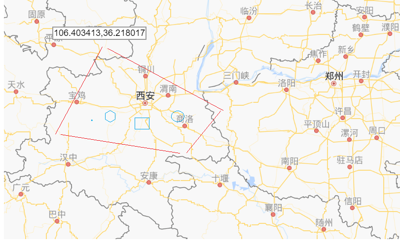

## 	3.1 函數查詢

​		在Solr中提供了大量的函數，允許我們在查詢的時候使用函數進行動態運算。

### 		3.2.1 函數調用語法

​			函數調用語法和java基本相同,格式為:函數名(實參)，實參可以是常量（100,1.45,"hello"），也可以是域名，下面是函數調用例子。

```
functionName()  
functionName(...)  
functionName1(functionName2(...),..)
```

​	數據準備：為了便於我們後面的講解，採用的案例數據,員工信息。

```
業務域:
	員工姓名,工作，領導的員工號，入職日期，月薪，獎金
	 <field name="emp_ename" type="text_ik" indexed="true" stored="true"/>
    <field name="emp_ejob" type="text_ik" indexed="true" stored="true"/>
    <field name="emp_mgr" type="string" indexed="true" stored="true"/>
    <field name="emp_hiredate" type="pdate" indexed="true" stored="true"/>
    <field name="emp_sal" type="pfloat" indexed="true" stored="true"/>
    <field name="emp_comm" type="pfloat" indexed="true" stored="true"/>
    <field name="emp_cv" type="text_ik" indexed="true" stored="false"/>
    <field name="emp_deptno" type="string" indexed="true" stored="true"/>
    
data-import.xml
		<entity name="emp" query="select * from emp">
            <!-- 每一個field映射著數據庫中列與文檔中的域，column是數據庫列，name是solr的域(必須是在managed-schema文件中配置過的域才行) -->
            <field column="empno" name="id"/>
            <field column="ename" name="emp_ename"/>
            <field column="ejob" name="emp_ejob"/>
            <field column="mgr" name="emp_mgr"/>
            <field column="hiredate" name="emp_hiredate"/>
            <field column="sal" name="emp_sal"/>
            <field column="comm" name="emp_comm"/>
            <field column="cv" name="emp_cv"/>
			<field column="deptno" name="emp_deptno"/>
        </entity>
```

### 		3.2.2 函數的使用

##### 			3.2.2.1 將函數返回值作為關鍵字

​			在solr中通常的搜索方式都是根據關鍵字進行搜索。底層首先要對關鍵字分詞，在倒排索引表中根據詞查找對應的文檔返回。

```
item_title:三星手機
```

​			需求：查詢年薪在30000~50000的員工。

​			主查詢條件:查詢所有*:*

​			過濾條件: 利用product()函數計算員工年薪，product函數是Solr自帶函數，可以計算2個數之積。 {!frange}指定範圍。 l表示最小值，u表示最大值.{!frange}語法是Function Query Parser解析器中提供的一種語法。

```
	q=*:*
	&fq={!frange l=30000 u=50000}product(emp_sal,12)	
```

​	需求：查詢年薪+獎金大於50000的員工

​	通過sum函數計算年薪+獎金。

```
	q=*:*
	&fq={!frange l=50000}sum(product(emp_sal,12),emp_comm)	
	上面查詢不出來數據，原因是有些員工emp_comm為空值。
	emp_comm進行空值處理。判斷emp_comm是否存在，不存在指定位0，存在，本身的值
	exists判斷域是否存在
	if指定存在和不存在值
	{!frange l=40000}sum(product(emp_sal,12),if(exists(emp_comm),emp_comm,0))	
```


##### 		3.2.2.1.2 將函數返回值作為偽域

​	偽域：文檔中本身不包含的域，利用函數生成。

​	需求：查詢所有的文檔，每個文檔中包含年薪域。

```
q=*:*&
fl=*,product(emp_sal,12)
指定別名：yearsql:product(emp_sal,12) 便於將來封裝
```

##### 		3.2.2.1.3 根據函數進行排序

​		需求：查詢所有的文檔，並且按照（年薪+獎金）之和降序排序

```
q=*:*&
sort=sum(product(emp_sal,12),if(exists(emp_comm),emp_comm,0)) desc
```

##### 		3.2.2.1.4 使用函數影響相關度排序（了解）

​		之前在講解查詢的時候，我們說的相關度排序，Lucene底層會根據查詢的詞和文檔關係進行相關度打分。

打分高的文檔排在前面，打分低的排在後面。打分的2個指標tf,df;

​		使用函數可以影響相關度排序。

​		需求：查詢emp_cv中包含董事長的員工，年薪高的員工相關度打分高一點。

```
q=emp_cv:董事長 
	AND _val_:"product(emp_sal,12)"  #用來影響相關度排序,不會影響查詢結果									  
可以簡單這麼理解 
lucene本身對查詢文檔有一個打分叫score，每個文檔分數可能不同。
通過函數干預後，打分score += 函數計算結果

_val_:規定

另外一種寫法：
	AND _query_:"{!func}product(emp_sal,12)"
	
```

##### 	3.2.2.1.5 Solr內置函數和自定義函數

###### 	常用內置函數

| 函數                  | 說明                                                         | 舉例                                       |
| --------------------- | ------------------------------------------------------------ | ------------------------------------------ |
| abs(x)                | 返回絕對值                                                   | abs(-5)                                    |
| def(field,value)      | 獲取指定域中值，如果文檔沒有指定域，使用value作為默認值；    | def(emp_comm,0)                            |
| div(x,y)              | 除法，x除以y                                                 | div(1,5)                                   |
| dist                  | 計算兩點之間的距離                                           | dis(2,x,y,0,0)                             |
| docfreq(field,val)    | 返回某值在某域出現的次數                                     | docfreq(title,’solr’)                      |
| field(field)          | 返回該field的索引數量                                        | field(‘title’)                             |
| hsin                  | 曲面圓弧上兩點之間的距離                                     | hsin(2,true,x,y,0,0)                       |
| idf                   | Inverse document frequency 倒排文檔頻率                      | idf(field,’solr’)                          |
| if                    | if(test,value1,value2)                                       | if(termfreq(title,’solr’),popularity,42)   |
| linear(x,m,c)         | 就是m*x+c,等同於sum(product(m,x),c)                          | linear(1,2,4)=1x2+4=6                      |
| log(x)                | 以10為底，x的對數                                            | log(sum(x,100))                            |
| map(x,min,max,target) | 如果x在min和max之間,x=target,否則x=x                         | map(x,0,0,1)                               |
| max(x,y,…)            | 返回最大值                                                   | max(2,3,0)                                 |
| maxdoc                | 返回索引的個數，查看有多少文檔，包括被標記為刪除狀態的文檔   | maxdoc()                                   |
| min(x,y,…)            | 返回最小值                                                   | min(2,4,0)                                 |
| ms                    | 返回兩個參數間毫秒級的差別                                   | ms(datefield1,2000-01-01T00:00:00Z)        |
| norm(field)           | 返回該字段索引值的範數                                       | norm(title)                                |
| numdocs               | 返回索引的個數，查看有多少文檔，不包括被標記為刪除狀態的文檔 | numdocs()
| ord                   | 根據順序索引發貨結果                                         | ord(title)                                 |
| pow(x,y)              | 返回x的y次方                                                 | pow(x,log(y))                              |
| product(x,y)          | 返回多個值得乘積                                             | product(x,2)                               |
| query                 | 返回給定的子查詢的得分，或者文檔不匹配的默認值值             | query(subquery,default)                    |
| recip(x,m,a,b)        | 相當於a/(m*x+b),a,m,b是常量，x是變量                         | recip(myfield,m,a,b)                       |
| rord                  | 按ord的結果反序返回                                          |                                            |
| scale                 | 返回一個在最大值和最小值之間的值                             | scale(x,1,3)                               |
| sqedist               | 平方歐氏距離計算                                             | sqedist(x_td,y_td,0,0)                     |
| sqrt                  | 返回指定值得平方根                                           | sqrt(x)sqrt(100)                           |
| strdist               | 計算兩個字符串之間的距離                                     | strdist(“SOLR”,id,edit)                    |
| sub                   | 返回x-y                                                      | sub(field1,field2)                         |
| sum(x,y)              | 返回指定值的和                                               | sum(x,y,…)                                 |
| sumtotaltermfreq      | 返回所有totaltermfreq的和                                    |                                            |
| termfreq              | 詞出現的次數                                                 | termfreq(title,’sorl’)                     |
| tf                    | 詞頻                                                         | tf(text,’solr’)                            |
| top                   | 功能類似於ord                                                |                                            |
| totaltermfreq         | 返回這個詞在該字段出現的次數                                 | ttf(title,’memory’)                        |
| and                   | 返回true值當且僅當它的所有操作為true                         | and(not(exists(popularity)),exists(price)) |
| or                    | 返回true值當有一個操作為true                                 | or(value1,value2)                          |
| xor                   | 返回false值如果所有操作都為真                                | xor(field1,field2)                         |
| not                   | 排除操作                                                     | not(exists(title))                         |
| exists                | 如果字段存在返回真                                           | exists(title)                              |
| gt,gte,lt,lte,eq      | 比較函數                                                     | 2 gt 1                                     |

###### 	自定義函數

​	自定義函數流程：

​		準備：

```
<dependency>
	<groupId>org.apache.solr</groupId>
	<artifactId>solr-core</artifactId>
	<version>7.7.2</version>
</dependency>
```

​		1.定義一個類繼承 ValueSource 類，用於封裝函數執行結果。

​		2.定義一個類繼承ValueSourceParser，用來解析函數調用語法，並且可以解析參數類型，以及返回指定結果。

​		3. 在solrconfig.xml中配置文件中配置ValueSourceParser實現類的全類名

​	  需求：定義一個solr字符串拼接的函數，將來函數的調用語法concat(域1,域2)，完成字符串拼接。
​		第一步：

```
/**
 * 用來解析函數調用語法，並且將解析的參數返回給第一個類處理。
 * concat(field1,field2)
 */
public class ConcatValueSourceParser extends ValueSourceParser {
    //對函數調用語法進行解析，獲取參數，將參數封裝到ValueSource，返回函數執行結果
    public ValueSource parse(FunctionQParser functionQParser) throws SyntaxError {
        //1.獲取函數調用參數,由於參數類型可能是字符串，int類型，域名，所以封裝成ValueSource
        //1.1獲取第一個參數封裝對象
        ValueSource arg1 = functionQParser.parseValueSource();
        //1.2獲取第二個參數封裝對象
        ValueSource arg2 = functionQParser.parseValueSource();

        //返回函數執行結果
        return new ConcatValueSource(arg1, arg2);
    }
}
```

​		第二步：

```
public class ConcatValueSource extends ValueSource {

    //使用構造方法接收ConcatValueSourceParser解析獲取的參數
    private ValueSource arg1;
    private ValueSource arg2;

    public ConcatValueSource(ValueSource arg1, ValueSource arg2) {
        this.arg1 = arg1;
        this.arg2 = arg2;
    }

    //返回arg1和arg2計算結果
    public FunctionValues getValues(Map map, LeafReaderContext leafReaderContext) throws IOException {
        FunctionValues values1 = arg1.getValues(map, leafReaderContext); //第一個參數
        FunctionValues values2 = arg1.getValues(map, leafReaderContext); //第二個參數

        //返回一個字符串的結果
        return new StrDocValues(this) {
            @Override
            public String strVal(int doc) throws IOException {
                //根據參數從文檔中獲取值
                return values1.strVal(doc) + values2.strVal(doc);
            }
        };
    }
```

​	第三步：在solrconfig.xml配置

```
<valueSourceParser name="concat" class="cn.itcast.funcation.ConcatValueSourceParser" />
```

​	第四步：打包，並且在solr/WEB-INF/lib 目錄中配置

​	第五步：測試

```
fl=*,concat(id,emp_ename)
```

## 3.2 地理位置查詢

​		在Solr中也支持地理位置查詢，前提是我們需要將地理位置的信息存儲的Solr中，其中地理位置中必須包含一個比較重要的信息，經度和緯度，經度範圍[-180,180]，緯度範圍[-90,90]。對於經度來說東經為正，西經為負，對於緯度來說，北緯正，南緯為負。

### 	3.2.1 數據準備

​	首先我們先來完成數據準備，需要將地理位置信息存儲到Solr中；

​		1.在MySQL導入地理位置信息

​			name是地址名稱

​			position:經緯度坐標，中間用,分割（緯度,經度）

​		2.schema.xml中定義業務域	

```
	name域的定義
	<field name="address_name" type="text_ik" indexed="true" stored="true"/>
	注意：
		坐標域定義
        域類型location，這域類型就是用來定義地理位置域。
        使用location域類型定義的域，底層會被拆分成2個域進行存儲，分別是經度和維度。
        這個域將來會被拆分成2個域進行存儲。
        所以需要定義動態域對底層操作進行支持。
	<field name="address_position" type="location" indexed="true" stored="true"/>

	以下在schema中已經定義好了。
	<fieldType name="location" class="solr.LatLonType" subFieldSuffix="_coordinate"/>
	<dynamicField name="*_coordinate"  type="tdouble" indexed="true"  stored="false"/>
```

​		3.使用DataImport導入數據

```
	<entity name="address" query="select * from address">
            <!-- 每一個field映射著數據庫中列與文檔中的域，column是數據庫列，name是solr的域(必須是在managed-schema文件中配置過的域才行) -->
            <field column="id" name="id"/>
            <field column="name" name="address_name"/>
            <field column="position" name="address_position"/>
        </entity>
```

​		4.測試

​	

​	id：主鍵

   address_name:位置名稱

   address_position:位置坐標

​	還多出2個域：address_position_0_coordinate ,address_position_1_coordinate 基於動態域生成的維度和經度坐標。

### 3.2.2 簡單地理位置查詢

​	Solr中 提供了一種特殊的查詢解析器(geofilt)，它能解析以指定坐標（包含經緯度）為中心。以指定距離（千米）為半徑畫圓，坐標落在圓面積中的文檔，

​	

​	需求：查詢離西安半徑 30 千米範圍內的城市。

1.查詢西安的坐標 

```
	address_name:西安
```

​	

2. 查詢距離西安30千米範圍內的城市

   ```
   q=*:*&
   fq={!geofilt sfield=address_position pt=34.27,108.95 d=30}
   ```

   sfiled:指定坐標域

   pt:中心

   d:半徑

   

   除了可以查詢落在圓面積中的地址外，對於精確度不高的查詢，也可以查詢落在外切正方形中的地理位置。

這種方式比圓的方式效率要高。

​	

```
q=*:*&
ft={!bbox sfield=address_position pt=34.27,108.95 d=30}
```

3. 在solr中還提供了一些計算地理位置的函數，比較常用的函數geodist,該函數可以計算2個地理位置中間的距離。調用方式：geodist(sfield,latitude,longitude);

   需求：計算其他城市到北京的距離，作為偽域展示

   ```
   q=*:*&
   fl=*,distance:geodist(address_position,39.92,116.46)
   sort=geodist(address_position,39.92,116.46) asc
   ```

### 	3.2.3 地理位置高級查詢

​		之前我們在講解簡單地理位置查詢的時候，都是基於正方形或者基於圓進行。有時候我們在進行地理位置查詢的時候需要基於其他形狀。在Solr中提供了一個類SpatialRecursivePrefixTreeFieldType（RPT）可以完成基於任意多邊形查詢。

​		

#### 		3.2.3.1對地理數據進行重寫索引

​			1.修改address_position域類型

​			之前的域定義，域類型location

```
<field name="address_position" type="location" indexed="true" stored="true"/>
```

​			修改後的域定義,域類型location_rpt

```

<field name="address_position" type="location_rpt" indexed="true" stored="true" multiValued="true"/>
	
	location_rpt類型是schema文件已經提供好的一個類型，class就是RPT
<fieldType name="location_rpt" class="solr.SpatialRecursivePrefixTreeFieldType"
		spatialContextFactory="JTS"
        geo="true" distErrPct="0.025" maxDistErr="0.001" distanceUnits="kilometers" />
	
	
```

   2. location_rpt類型，允許存儲的數據格式。

      ​	點：

      ```
      緯度 經度
      緯度,經度
      ```

      ​	任意形狀

      ```
      POLYGON((坐標1,坐標2....))
      ```

      將來我們可以查詢一個點，或者任意形狀是否在另外一個幾何圖形中。

​	3. 複製jst的jar包到solr/WEB-INF/classes目錄

```
<dependency>
    <groupId>org.locationtech.jts</groupId>
    <artifactId>jts-core</artifactId>
    <version>1.16.1</version>
</dependency>
jst：用於構建圖形的jar包
```

 4. 插入測試數據,address_position域中存儲的是一個幾何圖形

    ```
    insert into address values(8989,'三角形任意形狀','POLYGON((108.94224 35.167441,108.776664 34.788863,109.107815 34.80404,108.94224 35.167441))'); 
    ```

    ​	

5. 使用DataImport重新進行索引

#### 	3.2.3.2 基於任意圖形進行查詢

​		查詢基於A,B,C,D這4個點圍城的圖形有哪些城市。


​		可以使用百度地圖的坐標拾取得知A,B,C,D四個點的坐標。

​	http://api.map.baidu.com/lbsapi/getpoint/index.html

 A 109.034226,35.574317     

 B 111.315491,33.719499

 C108.243142,33.117791

 D 107.98558,34.37802

​		利用ABCD四個點構建幾個圖形，查詢地理坐標在該幾何圖形中的文檔。

```
address_position:"Intersects(POLYGON((109.034226 35.574317,
									111.315491 33.719499,
									108.243142 33.117791,
									107.98558 34.37802,
									109.034226 35.574317)))"
```

說明：

POLYGON是JST中提供的構建任意多邊形的語法。

​	每個坐標之間使用,進行分割。

​	經度和緯度之間使用空格隔開

​	如果構建的是一個封閉圖形，最後一個坐標要和第一個坐標相同。


Intersects是一個操作符

​	作用：匹配2個圖形相交部分的文檔。

IsWithin

​	作用：匹配包含在指定圖形面積之內的文檔，不含邊界

Contains:

​	作用：匹配包含在指定圖形面積之內的文檔，含邊界


​		

## 3.3 JSON Facet

​		在Solr中對於Facet查詢提供了另外一種查詢格式。稱為JSON Facet。使用JSON Fact有很多好處，書寫靈活，便於自定義響應結果，便於使用分組統計函數等。

### 3.3.1 JSON Facet 入門

​		根據商品分類，分組統計每個分類對應的商品數量，要求顯示前3個。

傳統的Facet查詢

```
q=*:*&
facet=true&
facet.field=item_category&
facet.limit=3
```

JSON Facet

```
q=*:*&
json.facet={
	category:{
		type:terms,
		field:item_category,
		limit:3
	}
}
測試
http://localhost:8080/solr/collection1/select?q=*:*&json.facet=%7Bcategory:%7Btype:terms,field:item_category,limit:3%7D%7D

其中category是自定義的一個鍵。
type:指的是facet的類型
field:分組統計的域
```

​		

### 3.3.2 JSON Facet的語法

```
json.facet = {
	<facet_name>:{
		type:<fact_type>,
		<other_facet_parameter>
	}
}
facet_name:可以任意取值，是為了將來解析結果使用。
type:取值terms,query,range.
		terms根據域進行Facet查詢,query根據查詢解決進行facet查詢。 range根據范圍進行facet查詢。
other_facet_parameter:其他facet的一些參數。
```

​	根據上面的語法，再來完成一個需求

​	需求：分組統計2015年每月添加的商品數量。

```
q=*:*,
json.facet={
	month_count:{
		type:range,
		field:item_createtime,
		start:'2015-01-01T00:00:00Z',
		end:'2016-01-01T00:00:00Z',
		gap:'+1MONTH'
	}
}

http://localhost:8080/solr/collection1/select?q=*:*&json.facet=%7B
	month_count:%7B
		type:range,
		field:item_createtime,
		start:'2015-01-01T00:00:00Z',
		end:'2016-01-01T00:00:00Z',
		gap:'%2B1MONTH'
	%7D
%7D
```

​	

​	

​		需求：統計品牌是華為的商品數量，分類是平板電視的商品數量。

```
q=*:*,
json.facet={
	brand_count:{
		type:query,
		q:"item_brand:華為"
	},
	category_count:{
		type:query,
		q:"item_category:平板電視"
	}
}

http://localhost:8080/solr/collection1/select?q=*:*&json.facet=%7B
	brand_count:%7B
		type:query,
		q:"item_brand:華為"
	%7D,
	category_count:%7B
		type:query,
		q:"item_category:平板電視"
	%7D
%7D
```

### 3.3.3 SubFacet	

​	在JSON Facet中，還支持另外一種Facet查詢，叫SubFacet.允許用戶在之前分組統計的基礎上，再次進行分組統計,可以實現pivot Facet（多維度分組查詢功能）查詢的功能。

​	需求：對商品的數據，按照品牌進行分組統計,獲取前5個分組數據。

```
q=*:*&
json.facet={
	top_brand:{
		type:terms,
		field:item_brand,
		limit:5
	}
}
http://localhost:8080/solr/collection1/select?q=*:*&
json.facet=%7B
	top_brand:%7B
		type:terms,
		field:item_brand,
		limit:5
	%7D
%7D
```

​			

在以上分組的基礎上，統計每個品牌，不同商品分類的數據。 eg:統計三星手機多少個，三星平板電視多少？

​	

```
q=*:*&
json.facet={
	top_brand:{
		type:terms,
		field:item_brand,
		limit:5,
		facet:{
			top_category:{
				type:terms,
				field:item_category,
				limit:3
			}
		}
	}
}
http://localhost:8080/solr/collection1/select?q=*:*&
json.facet=%7B
	top_brand:%7B
		type:terms,
		field:item_brand,
		limit:5,
		facet:%7B
			top_category:%7B
				type:terms,
				field:item_category,
				limit:3
			%7D
		%7D
	%7D
%7D
```


### 3.3.4 聚合函數查詢

​	在JSON Facet中，還支持另外一種強大的查詢功能，聚合函數查詢。在Facet中也提供了很多聚合函數，也成為Facet函數。很多和SQL中的聚合函數類似。

​	函數如下：

| 聚合函數   | 例子                         | 描述                   |
| ---------- | ---------------------------- | ---------------------- |
| sum        | sum(sales)                   | 聚合求和               |
| avg        | `avg(popularity)`            | 聚合求平均值           |
| min        | `min(salary)`                | 最小值                 |
| max        | `max(mul(price,popularity))` | 最大值                 |
| unique     | `unique(author)`             | 統計域中唯一值的個數   |
| sumsq      | `sumsq(rent)`                | 平方和                 |
| percentile | percentile(salary,30,60,10)  | 可以根據百分比進行統計 |

需求：查詢華為手機價格最大值,最小值，平均值.

```
q=item_title:手機
&fq=item_brand:華為
&json.facet={
	avg_price:"avg(item_price)",
	min_price:"min(item_price)",
	max_price:"max(item_price)"
}

http://localhost:8080/solr/collection1/select?q=item_title:手機
&fq=item_brand:華為
&json.facet=%7B
	avg_price:"avg(item_price)",
	min_price:"min(item_price)",
	max_price:"max(item_price)"
%7D
```

查詢結果：


需求：查詢每個品牌下，最高的手機的價格.

```
q=item_title:手機
&json.facet={
	categories:{
     type:terms,
     field:item_brand,
     facet:{
       x : "max(item_price)"
     }
   }
}
http://localhost:8080/solr/collection1/select?q=item_title:手機&json.facet=%7Bcategories:%7Btype:field,field:item_brand,facet:%7Bx:"max(item_price)"%7D%7D%7D
```

結果：

​	

