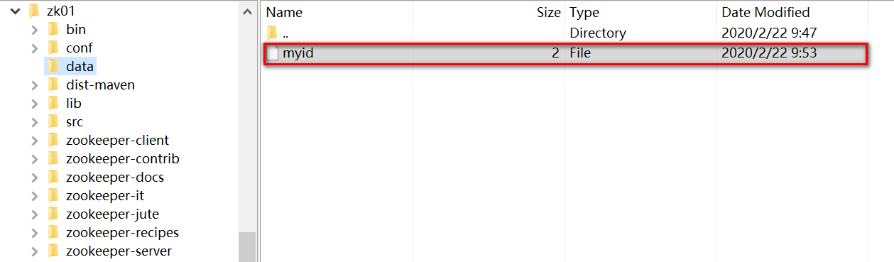
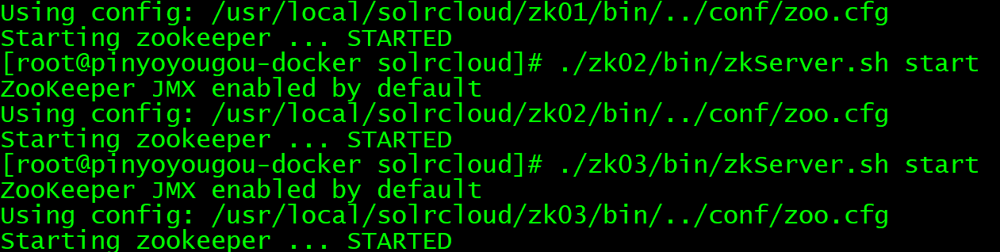
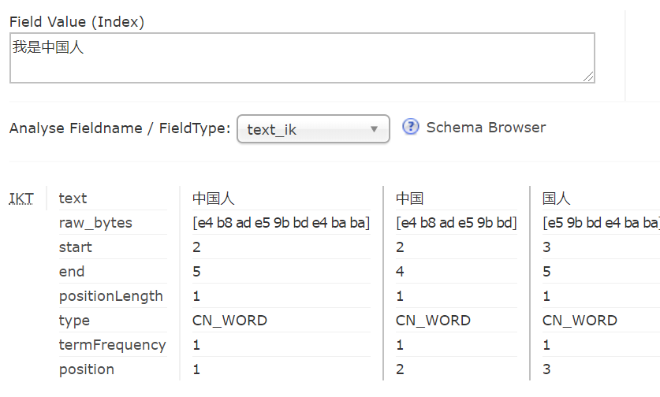

# 2. Solr集群搭建

## 2.1 SolrCloud簡介

### 2.1.1 什麼是SolrCloud

​        Solr集群也成為SolrCloud，是Solr提供的分佈式搜索的解決方案，當你需要大規模存儲數據或者需要分佈式索引和檢索能力時使用 SolrCloud。

​		所有數據庫集群，都是為了解決4個核心個問題，單點故障，數據擴容，高並發，效率

​		搭建SolrCloud是需要依賴一個中間件Zookeeper，它的主要思想是使用Zookeeper作為集群的配置中心。

### 2.1.2 SolrCloud架構

   SolrCloud邏輯概念：

​		一個Solr集群是由多個collection組成，collection不是SolrCore只是一個邏輯概念。一個collection是由多個文檔組成，這些文檔歸屬於指定的分片。下面表示的就是一個邏輯結構圖。

​		該集群只有一個collection組成。 connection中的文檔數據分散在4個分片。 

​		分片中的數據，到底存儲在那呢？這就屬於物理概念。

SolrCloud物理概念：	

​			Solr 集群由一個或多個 Solr服務（tomcat中運行solr服務）組成，這些Solr服務可以部署一台服務器上，也可以在多台服務器。每個Solr服務可以包含一個或者多個Solr Core 。 SolrCore中存儲的是Shard的數據；

​			下面的圖是一個物理結構和邏輯結構圖。

​	

概念：

​	Collection是一個邏輯概念，可以認為是多個文檔構成的一個集合。

​	Shard是一個邏輯概念，是對Collection進行邏輯上的劃分。

​	Replica：Shard的一個副本，一個Shard有多個副本，同一個Shard副本中的數據一樣；

​	Leader：每個Shard會以多個Replica的形式存在，其中一個Replica會被選為Leader，負責集群環境中的索引和搜索。

​	SolrCore：存儲分片數據的基本單元。一個SolrCore只存儲一個分片數據，一個分片數據可以存儲到多個SolrCore中；一個SolrCore對應一個Replica

​	Node：集群中的一個Solr服務


## 2.2Linux集群搭建

### 			2.2.1 基於tomcat的集群搭建

##### 		2.2.1.1集群架構介紹

​			物理上:

​				搭建三個Zookeeper組成集群，管理SolrCloud。

​				搭建四個Solr服務，每個Solr服務一個SorCore.

​			邏輯上:

​				整個SolrCloud一個Connection；

​				Connection中的數據分為2個Shard；

​				Shard1的數據在物理上存儲到solr1和solr2的SolrCore

​				Shard2的數據在物理上存儲到solr3和solr4的SolrCore


​	


##### 	2.2.1.2  環境說明

​	環境:

| 系統      | 版本             |
| --------- | ---------------- |
| Linux     | CentOS 7         |
| JDK       | JDK8             |
| Tomcat    | tomcat 8.5       |
| zookeeper | zookeeper-3.4.14 |
| solr      | solr 7.7.2       |

##### 2.2.1.3 Zookeeper集群搭建

​		首先我們先要完成Zookeeper集群搭建。在搭建集群之前，首先我們先來說一下Zookeeper集群中要求節點的個數。

​	在Zookeeper集群中節點的類型主要有2類，Leader，Follower，一個集群只有一個Leader。

​	到底誰是Leader呢？

​	投票選舉制度：集群中所有的節點來進行投票，半數以上獲票的節點就是Leader.Zookeeper要求集群節點個數奇數。

​	容錯:zookeeper集群一大特性是只要集群中半數以上的節點存活，集群就可以正常提供服務，而2n+1節點和2n+2個節點的容錯能力相同，都是允許n台節點宕機。本著節約的宗旨，一般選擇部署2n+1台機器

​	本次我們採用最少的集群節點3個。


​		1.下載Zookeeper的安裝包到linux。

​		下載地址：

```
http://archive.apache.org/dist/zookeeper/zookeeper-3.4.14/		
上面的地址可能受每日訪問量現在							
wget
https://mirrors.tuna.tsinghua.edu.cn/apache/zookeeper/zookeeper-3.4.14/zookeeper-3.4.14.tar.gz
```

​		2. 解壓zookeeper， 複製三份到/usr/local/solrcloud下，複製三份分別並將目錄名改為zk01、在zk02、zk03

```
mkdir  /usr/local/solrcloud
tar -xzvf zookeeper-3.4.14.tar.gz
cp -r zookeeper-3.4.14 /usr/local/solrcloud/zk01
cp -r zookeeper-3.4.14 /usr/local/solrcloud/zk02
cp -r zookeeper-3.4.14 /usr/local/solrcloud/zk03
```

​	結果

 3. 為每一個Zookeeper創建數據目錄

    
    
    
    
    ```
    mkdir zk01/data
    mkdir zk02/data
    mkdir zk03/data
    ```


4. 在data目錄中為每一個Zookeeper創建myid文件,並且在文件中指定該Zookeeper的id;

   ```
   使用重定向指令>>將打印在控制台上的1 2 3分別寫入到data目錄的myid文件中。
   echo 1 >> zk01/data/myid
   echo 2 >> zk02/data/myid
   echo 3 >> zk03/data/myid
   ```

   

5. 修改Zookeeper的配置文件名稱。

   ​	5.1 需要將每個zookeeper/conf目錄中的zoo_sample.cfg 文件名改名為zoo.cfg，否則該配置文件不起作用。

   ```
   mv zk01/conf/zoo_sample.cfg zk01/conf/zoo.cfg
   mv zk02/conf/zoo_sample.cfg zk02/conf/zoo.cfg
   mv zk03/conf/zoo_sample.cfg zk03/conf/zoo.cfg
   ```


​	6. 編輯zoo.cfg配置文件

​		5.1 修改Zookeeper客戶端連接的端口，Zookeeper對外提供服務的端口。修改目的，我們需要在一台計算機上啟動三個Zookeeper。

```
clientPort=2181
clientPort=2182
clientPort=2183
```

​		5.2 修改數據目錄

```
dataDir=/usr/local/solrcloud/zk01/data
dataDir=/usr/local/solrcloud/zk02/data
dataDir=/usr/local/solrcloud/zk03/data
```

​		5.3 在每一個配置文件的尾部加入，指定集群中每一個Zookeeper的節點信息。

```
server.1=192.168.200.128:2881:3881
server.2=192.168.200.128:2882:3882
server.3=192.168.200.128:2883:3883

server.1 server.2 server.3 指定Zookeeper節點的id.之前我們myid已經指定了每個節點的id;
內部通信端口：
	Zookeeper集群節點相互通信端口；
為什麼會有投票端口呢？
1.因為三台Zookeeper要構成集群，決定誰是leader，Zookeeper中是通過投票機制決定誰是leader。
2.如果有節點產生宕機，也需要通過投票機制將宕機節點從集群中剔除。
所以會有一個投票端口
```

​	7.啟動Zookeeper集群。

​	在bin目錄中提供了一個腳本zkServer.sh，使用zkServer.sh start|restart|stop|status 就可以完成啟動，重啟，停止，查看狀態。

```
可以寫一個腳本性啟動所有Zookeeper。也可以一個個的啟動；
./zk01/bin/zkServer.sh start
./zk02/bin/zkServer.sh start
./zk03/bin/zkServer.sh start
```

​	

8.查看Zookeeper集群狀態。

```
./zk01/bin/zkServer.sh status
./zk02/bin/zkServer.sh status
./zk03/bin/zkServer.sh status
```


```
follower就是slave；

leader就是master;

如果是單機版的Zookeeper，standalone
```

##### 2.2.1.4 SolrCloud集群部署

​	上一節我們已經完成了Zookeeper集群的搭建，下面我們來搭建solr集群。


​		複製4個tomcat，並且要在4個tomcat中部署solr，單機版solr的搭建，我們之前已經講解過了。

​	下面是我們已經搭建好的單機版的solr，他的tomcat和solrhome

 1.1 將tomcat複製4份到solrcloud中，便於集中管理。這4個tomcat中都部署了solr；

```
cp -r apache-tomcat-8.5.50 solrcloud/tomcat1
cp -r apache-tomcat-8.5.50 solrcloud/tomcat2
cp -r apache-tomcat-8.5.50 solrcloud/tomcat3
cp -r apache-tomcat-8.5.50 solrcloud/tomcat4
```


1.2  複製4個solrhome到solrcloud中。分別對應每一個solr的solrhome。

```
cp -r solr_home solrcloud/solrhome1
cp -r solr_home solrcloud/solrhome2
cp -r solr_home solrcloud/solrhome3
cp -r solr_home solrcloud/solrhome4
```

​	


1.3 修改tomcat的配置文件，修改tomcat的端口，保證在一台計算機上，可以啟動4個tomcat；

​	編輯server.xml

```
修改停止端口
對外提供服務端口
AJP端口
<Server port="8005"shutdown="SHUTDOWN">
<Connector port="8080"protocol="HTTP/1.1" connectionTimeout="20000" redirect
<Connector port="8009" protocol="AJP/1.3"redirectPort="8443" />
tomcat1  8105  8180  8109
tomcat1  8205  8280  8209
tomcat1  8305  8380  8309
tomcat1  8405  8480  8409
```

1.4 為tomcat中每一個solr指定正確的solrhome，目前是單機版solrhome的位置。

​	編輯solr/web.xml指定對應的solrhome

```
	 <env-entry>
		<env-entry-name>solr/home</env-entry-name>
		<env-entry-value>/usr/local/solrcloud/solrhomeX</env-entry-value>
		<env-entry-type>java.lang.String</env-entry-type>
  	</env-entry>
```

1.5 修改每個solrhome中solr.xml的集群配置,對應指定tomcat的ip和端口

​	編輯solrhome中solr.xml

```
 <solrcloud>
    <str name="host">192.168.200.1288</str>
    <int name="hostPort">8X80</int>
 </solrcloud>
```


##### 2.2.1.5 Zookeeper管理的Solr集群

​	上一節課我們已經搭建好了Zookeeper集群，和Solr的集群。但是現在Zookeeper集群和Solr集群沒有關係。

需要讓Zookeeper管理Solr集群。
	1.啟動所有的tomcat

```
 ./tomcat1/bin/startup.sh
 ./tomcat2/bin/startup.sh
 ./tomcat3/bin/startup.sh
 ./tomcat4/bin/startup.sh
```

​	2.讓每一個solr節點和zookeeper集群關聯

​		編輯每一個tomcat中bin/catalina.sh文件，指定Zookeeper集群地址。

```
  JAVA_OPTS="-DzkHost=192.168.200.128:2181,192.168.200.128:2182,192.168.200.128:2183"
  需要指定客戶端端口即Zookeeper對外提供服務的端口
```

​	3.讓zookeeper統一管理solr集群的配置文件。

​		因為現在我們已經是一個集群，集群中的每個solr節點配置文件需要一致。所以我們就需要讓zookeeper管理solr集群的配置文件。主要管理的就是solrconfig.xml  / schema.xml文件

```
下面的命令就是將conf目錄中的配置文件，上傳到Zookeeper，以後集群中的配置文件就以Zookeeper中的為準；
搭建好集群後，solrCore中是沒有配置文件的。
./zkcli.sh -zkhost 192.168.200.128:2181,192.168.200.128:2182,192.168.200.128:2183 -cmd upconfig -confdir /usr/local/solrcloud/solrhome1/collection1/conf -confname myconf

-zkhost：指定zookeeper的地址列表；
upconfig ：上傳配置文件；
-confdir ：指定配置文件所在目錄；
-confname：指定上傳到zookeeper後的目錄名；

進入到solr安裝包中
/root/solr-7.7.2/server/scripts/cloud-scripts
./zkcli.sh -zkhost 192.168.200.128:2181,192.168.200.128:2182,192.168.200.128:2183 -cmd upconfig -confdir /usr/local/solrcloud/solrhome1/collection1/conf -confname myconf


./zkcli.sh -zkhost 192.168.200.128:2181,192.168.200.128:2182,192.168.200.128:2183 -cmd upconfig -confdir /root/solr7.7.2/server/solr/configsets/sample_techproducts_configs/conf
 -confname myconf
```


​	4.查看Zookeeper中的配置文件。

​	登錄到任意一個Zookeeper上，看文件是否上傳成功。

```
進入到任意一個Zookeeper，查看文件的上傳狀態。
/zKCli.sh -server 192.168.200.128:2182
```

​	通過Zookeeper客戶端工具查看。 idea的Zookeeper插件，ZooInspector等。

	5. 由於solr的配置文件，已經交由Zookeeper管理。 SolrHome中的SolrCore就可以刪除。

##### 2.2.1.6 創建Solr集群的邏輯結構

​	  之前我們已經搭建好了Zookeeper集群及Solr集群。接下來我們要完成的是邏輯結構的創建。


​		我們本次搭建的邏輯結構整個SolrCloud是由一個Collection構成。 Collection分為2個分片。每個分片有2個副本。分別存儲在不同的SolrCore中。

​		啟動所有的tomcat

```
 ./tomcat1/bin/startup.sh
 ./tomcat2/bin/startup.sh
 ./tomcat3/bin/startup.sh
 ./tomcat4/bin/startup.sh
```

​		

​		訪問任4個solr管理後台；

```
http://192.168.200.131:8180/solr/index.html#/~collections
http://192.168.200.131:8280/solr/index.html#/~collections
http://192.168.200.131:8380/solr/index.html#/~collections
http://192.168.200.131:8480/solr/index.html#/~collections
```

​		使用任何一個後台管理系統，創建邏輯結構

​	

​	   name:指定邏輯結構collection名稱；

   	config set:指定使用Zookeeper中配置文件；

  	 numShards:分片格式

​		replicationFactory:每個分片副本格式；

​	當然我們也可以通過Solr RestAPI完成上面操作

```
http://其中一個solr節點的IP:8983/solr/admin/collections?action=CREATE&name=testcore&numShards=2&replicationFactor=2&collection.configName=myconf
```

​		查詢邏輯結構


​	查看物理結構


說明一下： 原來SolrCore的名字已經發生改變。

​					一旦我們搭建好集群後，每個SolrCore中是沒有conf目錄即沒有配置文件。

​					整個集群的配置文件只有一份，Zookeeper集群中的配置文件。


##### 2.2.1.7測試集群

​	向collection中添加數據

```
{id:"100",name:"zhangsan"}
```

​	由於整合集群邏輯上就一個collection,所以在任何一個solr節點都可以獲取數據。


##### 2.2.1.8 使用SolrJ操作集群


​	之前我們操作單節點的Solr，使用的是HttpSolrClient，操作集群我們使用的是CloudSolrClient。

1. 將CloudSolrClient交由spring管理。

```
      @Bean
    public CloudSolrClient cloudSolrClient() {
         //指定Zookeeper的地址。
        List<String> zkHosts = new ArrayList<>();
        zkHosts.add("192.168.200.131:2181");
        zkHosts.add("192.168.200.131:2182");
        zkHosts.add("192.168.200.131:2183");
        //參數2：指定
        CloudSolrClient.Builder builder = new CloudSolrClient.Builder(zkHosts,Optional.empty());
        CloudSolrClient solrClient = builder.build();
        //設置連接超時時間
        solrClient.setZkClientTimeout(30000);
        solrClient.setZkConnectTimeout(30000);
        //設置collection
        solrClient.setDefaultCollection("collection");
        return solrClient;
    }
```

​	2.使用CloudSolrClient中提供的API操作Solr集群,和HttpSolrClient相同

索引

```

	@Autowired
    private CloudSolrClient cloudSolrClient;
        @Test
        public void testSolrCloudAddDocument() throws Exception {
            SolrInputDocument doc = new SolrInputDocument();
            doc.setField("id", 1);
            doc.setField("name", "java");
            cloudSolrClient.add(doc);
			cloudSolrClient.commit();
        }
```

搜索

```
 @Test
    public void testSolrQuery() throws Exception {
        SolrQuery params = new SolrQuery();
        params.setQuery("*:*");
        QueryResponse response = cloudSolrClient.query(params);
        SolrDocumentList results = response.getResults();
        for (SolrDocument result : results) {
            System.out.println(result);
        }
    }
```

### 2.2.2 SolrCloud的其他操作

##### 	 2.2.2.1 SolrCloud使用中文分詞器（IK）

​	

​		1.在每一個solr服務中，引入IK分詞器的依賴包

​			

​		2.在classes中引入停用詞和擴展詞庫及配置文件

​		

​		

​		3.重啟所有的tomcat

​		4.修改單機版solrcore中schema，加入FiledType

```
<fieldType name ="text_ik" class ="solr.TextField">
    <analyzer class="org.wltea.analyzer.lucene.IKAnalyzer"/>
</fieldType>
```


​	5.將schema重新提交到Zookeeper
​		Solr集群中的配置文件統一由Zookeeper進行管理，所以如果需要修改配置文件，我們需要將修改的文件上傳的Zookeeper。

```
./zkcli.sh -zkhost 192.168.200.128:2181,192.168.200.128:2182,192.168.200.128:2183 -cmd putfile /configs/myconf/managed-schema /usr/local/solr_home/collection1/conf/managed-schema
```

​		6. 測試		

​		7.利用text_ik 創建相關的業務域

​		創建業務域，我們依然需要修改shema文件，這個時候，我們建議使用後台管理系統。

​	

8.查看schema文件是否被修改。

​		通過files查看集群中的配置文件，內容


​	到這關於如何修改集群中的配置文件，已經如何管理Filed我們就講解完畢。


##### 	2.2.2.2  查詢指定分片數據

​			在SolrCloud中，如果我們想查詢指定分片的數據也是允許的。

​			需求：查詢shard1分片的數據

```
http://192.168.200.128:8180/solr/myCollection/select?q=*:*&shards=shard1
```

​		

​	需求：查詢shard1和shard2分片的數據

```
http://192.168.200.128:8180/solr/myCollection/select?q=*:*&shards=shard1,shard2
```

​	上面的操作都是從根據shard的id隨機從shard的副本中獲取數據。 shard1的數據可能來自8380,8280

shard2的數據可能來自8480,8180


​	也可以指定具體的副本；

​	需求：獲取shard1分片8280副本中的數據

```
http://192.168.200.128:8180/solr/myCollection/select?q=*:*&shards=192.168.200.128:8280/solr/myCollection
```

​	需求：獲取8280和8380副本中數據

```
http://192.168.200.128:8180/solr/myCollection/select?q=*:*&shards=192.168.200.128:8280/solr/myCollection,192.168.200.128:8380/solr/myCollection
```

​	混合使用,通過Shard的ID隨機獲取+通過副本獲取。

```
http://192.168.200.128:8180/solr/myCollection/select?q=*:*&shards=shard1,192.168.200.128:8380/solr/myCollection
```


##### 2.2.2.3  SolrCloud並發和線程池相關的一些配置

​	在SolrCloud中，我們也可以配置Shard並發和線程相關的配置，來優化集群性能。

​	主要的配置在solr.xml文件。

```
<solr>
  <!--集群相關的配置,solr服務的地址，端口，上下文solr.是否自動生成solrCore名稱,zk超時時間-->
  <solrcloud>  
    <str name="host">192.168.200.131</str>
    <int name="hostPort">8180</int>
    <str name="hostContext">${hostContext:solr}</str>
    <bool name="genericCoreNodeNames">${genericCoreNodeNames:true}</bool>
    <int name="zkClientTimeout">${zkClientTimeout:30000}</int>
    <int name="distribUpdateSoTimeout">${distribUpdateSoTimeout:600000}</int>
    <int name="distribUpdateConnTimeout">${distribUpdateConnTimeout:60000}</int>
    <str name="zkCredentialsProvider">${zkCredentialsProvider:org.apache.solr.common.cloud.DefaultZkCredentialsProvider}</str>
    <str name="zkACLProvider">${zkACLProvider:org.apache.solr.common.cloud.DefaultZkACLProvider}</str>
  </solrcloud>
	

<!-- 分片並發和線程相關的信息-->
  <shardHandlerFactory name="shardHandlerFactory"
    class="HttpShardHandlerFactory">
    <int name="socketTimeout">${socketTimeout:600000}</int>
    <int name="connTimeout">${connTimeout:60000}</int>
    <str name="shardsWhitelist">${solr.shardsWhitelist:}</str>
  </shardHandlerFactory>

</solr>
```

相關參數

| 參數名                | 描述                                                         | 默認值                   |
| --------------------- | ------------------------------------------------------------ | ------------------------ |
| socketTimeout         | 指客戶端和服務器建立連接後,客戶端從服務器讀取數據的timeout   | distribUpdateSoTimeout   |
| connTimeout           | 指客戶端和服務器建立連接的timeout                            | distribUpdateConnTimeout |
| maxConnectionsPerHost | 最大並發數量                                                 | 20                       |
| maxConnections        | 最大連接數量                                                 | 10000                    |
| corePoolSize          | 線程池初始化線程數量                                         | 0                        |
| maximumPoolSize       | 線程池中線程的最大數量                                       | Integer.MAX_VALUE        |
| maxThreadldleTime     | 設置線程在被回收之前空閒的最大時間                           | 5秒                      |
| sizeOfQueue           | 指定此參數 ，那麼線程池會使用隊列來代替緩衝區，對於追求高吞吐量的系統而 ，可能希望配置為-1 。對於於追求低延遲的系統可能希望配置合理的隊列大小來處理請求 。 | -1                       |
| fairnessPolicy        | 用於選擇JVM特定的隊列的公平策略：如果啟用公平策略，分佈式查詢會以先進先出的方式來處理請求，但是是是以有損吞吐量為代價；如果禁用公平策略，會提高集群查詢吞吐量，但是以響應延遲為代價。 | false                    |
| useRetries            | 是否啟 HTTP 連接自動重試機制，避免由 HTTP 連接池  的限製或者競爭導致的 IOException ，默認未開啟 | false                    |


### 		2.3.2 基於docker的集群搭建

##### 	2.3.2.1 環境準備

​	1.搭建docker

​		要想在docker上搭建solr集群，首先安裝docker的環境。這個就不再演示，如果沒有學過docker的同學可以參考下面的視頻地址進行學習。

​		https://www.boxuegu.com/freecourse/detail-1553.html

​		如果學習過但是忘瞭如何搭建，參考一下地址。

​		https://www.runoob.com/docker/centos-docker-install.html

 2. 拉取zookeeper鏡像和solr的鏡像，採用的版本是3.4.14和7.7.2

    ```
    docker pull zookeeper:3.4.14
    docker pull solr:7.7.2
    ```

    查看拉取鏡像

    ```
    docker images
    ```

    

##### 2.3.2.2 搭建zookeeper集群

​		搭建zookeeper集群，我們需要利用我們剛才拉取的zookeeper的鏡像創建3個容器。並且讓他們產生集群關係。

​		單獨創建一個橋接網卡

```
docker network create itcast-zookeeper
docker network ls
```

###### 		1.容器1創建

```
docker run 
	 -id 
	 --restart=always 
     -v /opt/docker/zookeeper/zoo1/data:/data 
     -v /opt/docker/zookeeper/zoo1/datalog:/datalog 
     -e ZOO_MY_ID=1 
     -e ZOO_SERVERS="server.1=zookeeper1:2888:3888 server.2=zookeeper2:2888:3888 server.3=zookeeper3:2888:3888" 
     -p 2181:2181
     --name=zookeeper1 
     --net=itcast-zookeeper
     --privileged 
     zookeeper:3.4.14
 
 docker run -id --restart=always -v /opt/docker/zookeeper/zoo1/data:/data -v /opt/docker/zookeeper/zoo1/datalog:/datalog -e ZOO_MY_ID=1 -e ZOO_SERVERS="server.1=zookeeper1:2888:3888 server.2=zookeeper2:2888:3888 server.3=zookeeper3:2888:3888" -p 2181:2181  --name=zookeeper1 --privileged --net=itcast-zookeeper zookeeper:3.4.14
 
 說明：
 	 --restart:docker重啟，容器重啟。
 	-d:守護式方式運行方式，除此之外還有-it
 	-v:目錄掛載，用宿主機/opt/docker/zookeeper/zoo1/data，映射容器的/data目錄
 	-e:指定環境參數。分別指定了自己的id,集群中其他節點的地址，包含通信端口和投票端口
 	--name:容器的名稱
 	-p:端口映射，用宿主機2181映射容器 2181,將來我們就需要通過本機2181訪問容器。
 	--privileged:開啟特權，運行修改容器參數
 	 --net=itcast-zookeeper 指定橋接網卡
 	zookeeper:3.4.14：創建容器的鏡像
```

​	查看創建好的容器

```
docker ps
```


​	查看宿主機的目錄,該目錄映射的就是zookeeper1容器中的data目錄。

```
cd /opt/docker/zookeeper/zoo1/data

```

​	查看Zookeeper節點的id

```
cat myid
```


###### 	2.容器2創建

```
docker run -d --restart=always 
     -v /opt/docker/zookeeper/zoo2/data:/data 
     -v /opt/docker/zookeeper/zoo2/datalog:/datalog 
     -e ZOO_MY_ID=2 
     -e ZOO_SERVERS="server.1=zookeeper1:2888:3888 server.2=zookeeper2:2888:3888 server.3=zookeeper3:2888:3888" 
     -p 2182:2181
     --name=zookeeper2
     --net=itcast-zookeeper
     --privileged 
     zookeeper:3.4.14
 
 docker run -d --restart=always -v /opt/docker/zookeeper/zoo2/data:/data -v /opt/docker/zookeeper/zoo2/datalog:/datalog -e ZOO_MY_ID=2 -e ZOO_SERVERS="server.1=zookeeper1:2888:3888 server.2=zookeeper2:2888:3888 server.3=zookeeper3:2888:3888" -p 2182:2181 --name=zookeeper2 --net=itcast-zookeeper --privileged zookeeper:3.4.14
 說明：
 	需要修改目錄掛載。
 	   修改Zookeeper的id
 	   端口映射：用宿主機2182 映射容器 2181
 	   容器名稱：zookeeper2
 
```

###### 	3.容器3創建

```
docker run -d --restart=always 
     -v /opt/docker/zookeeper/zoo3/data:/data 
     -v /opt/docker/zookeeper/zoo3/datalog:/datalog 
     -e ZOO_MY_ID=3
     -e ZOO_SERVERS="server.1=zookeeper1:2888:3888 server.2=zookeeper2:2888:3888 server.3=zookeeper3:2888:3888" 
     -p 2183:2181
     --name=zookeeper3
      --net=itcast-zookeeper
     --privileged 
     zookeeper:3.4.14
 
 docker run -d --restart=always -v /opt/docker/zookeeper/zoo3/data:/data -v /opt/docker/zookeeper/zoo3/datalog:/datalog -e ZOO_MY_ID=3 -e ZOO_SERVERS="server.1=zookeeper1:2888:3888 server.2=zookeeper2:2888:3888 server.3=zookeeper3:2888:3888" -p 2183:2181  --name=zookeeper3 --net=itcast-zookeeper --privileged zookeeper:3.4.14
 說明：
 	   需要修改目錄掛載。
 	   修改Zookeeper的id
 	   端口映射：用宿主機2183 映射容器 2181 
 	   容器名稱：zookeeper3
 	
```

​	查看容器創建情況


##### 2.3.2.3 測試Zookeeper集群的搭建情況

​	使用yum安裝nc指令

```
yum install -y nc
```

​	方式1：

​	通過容器的ip查看Zookeeper容器狀態

​	查看三個Zookeeper容器的ip

```
docker   inspect -f '{{range .NetworkSettings.Networks}}{{.IPAddress}}{{end}}'   zookeeper1
docker   inspect -f '{{range .NetworkSettings.Networks}}{{.IPAddress}}{{end}}'   zookeeper2
docker   inspect -f '{{range .NetworkSettings.Networks}}{{.IPAddress}}{{end}}'   zookeeper3
```

​	查看Zookeeper集群的狀態

```
echo stat|nc ip 2181
echo stat|nc ip 2181
echo stat|nc ip 2181
```


方式2：通過宿主機的ip查詢Zookeeper容器狀態


##### 2.3.2.4 zookeeper集群的架構

​		Zookeeper集群架構

​	Zookeeper客戶端連接Zookeeper容器

​			


##### 2.3.2.3 搭建solr集群 

​		搭建Solr集群，我們需要利用我們剛才拉取的solr的鏡像創建4個容器。並且需要將集群交由Zookeeper管理，Solr容器內部使用jetty作為solr的服務器。

​		1.容器1創建

```
docker run --name solr1 --net=itcast-zookeeper -d -p 8983:8983 solr:7.7.2  bash -c '/opt/solr/bin/solr start -f -z zookeeper1:2181,zookeeper2:2181,zookeeper3:2181'
--name:指定容器名稱
--net:指定網卡，之前創建的橋接網卡
-d:後台運行
-p:端口映射，宿主機8983映射容器中8983
-c:
/opt/solr/bin/solr:通過容器中腳本，指定Zookeeper的集群地址

```

​		2.容器2創建

```
docker run --name solr2 --net=itcast-zookeeper -d -p 8984:8983 solr:7.7.2  bash -c '/opt/solr/bin/solr start -f -z zookeeper1:2181,zookeeper2:2181,zookeeper3:2181'
--name:指定容器名稱
--net:指定網卡，之前創建的橋接網卡
-d:後台運行
-p:端口映射，宿主機8983映射容器中8984
-c:/opt/solr/bin/solr:通過容器中腳本，指定Zookeeper的集群地址
```

​		3.容器3創建

```
docker run --name solr3 --net=itcast-zookeeper -d -p 8985:8983 solr:7.7.2  bash -c '/opt/solr/bin/solr start -f -z zookeeper1:2181,zookeeper2:2181,zookeeper3:2181'
--name:指定容器名稱
--net:指定網卡，之前創建的橋接網卡
-d:後台運行
-p:端口映射，宿主機8983映射容器中8984
-c:/opt/solr/bin/solr:通過容器中腳本，指定Zookeeper的集群地址
```

​		4.容器4創建

```
docker run --name solr4 --net=itcast-zookeeper -d -p 8986:8983 solr:7.7.2  bash -c '/opt/solr/bin/solr start -f -z zookeeper1:2181,zookeeper2:2181,zookeeper3:2181'
--name:指定容器名稱
--net:指定網卡，之前創建的橋接網卡
-d:後台運行
-p:端口映射，宿主機8983映射容器中8985
-c:/opt/solr/bin/solr:通過容器中腳本，指定Zookeeper的集群地址
```

​	 5.查看結果


##### 	2.3.2.5 整體架構


##### 		2.3.2.6  創建集群的邏輯結構

​			1.通過端口映射訪問solr的後台系統（注意關閉防火牆）

```
	http://192.168.200.128:8983/solr
	http://192.168.200.128:8984/solr
	http://192.168.200.128:8985/solr
	http://192.168.200.128:8986/solr
```

​			2.上傳solr配置文件到Zookeeper集群。

​			進入到某個solr容器中，使用/opt/solr/server/scripts/cloud-scripts/的zkcli.sh 。上傳solr的配置文件。

位置/opt/solr/example/example-DIH/solr/solr/conf到Zookeeper集群zookeeper1:2181,zookeeper2:2181,zookeeper3:2181。

```
docker exec -it solr1 /opt/solr/server/scripts/cloud-scripts/zkcli.sh -zkhost zookeeper1:2181,zookeeper2:2181,zookeeper3:2181 -cmd upconfig -confdir /opt/solr/server/solr/configsets/sample_techproducts_configs/conf -confname myconfig
```

​			3.使用zooInterceptor查看配置文件上傳情況

​	


​			4.使用後台管理系統創建connection

​					

​			


​		5. 查看集群的邏輯結構

​		

​	到這基於docker的solr集群我們就講解完畢。

​		6.測試集群

```
{id:1,name:"zx"}
```

##### 2.3.2.7  solr配置文件修改

1.在linux服務器上需要有一份solr的配置文件,修改宿主機中的配置文件。

​	之前單機版solr的/usr/local/solr_home下，就有solr的配置文件。

​	/usr/local/solr_home下面的配置文件，schema已經配置了基於IK分詞器的FieldType

2.將宿主機中的配置文件，替換到某個solr容器中。

```
docker cp /usr/local/solr_home/collection1/conf/managed-schema solr1:/opt/solr/server/solr/configsets/sample_techproducts_configs/conf/managed-schema
```

3.將容器中修改後managed-schema配置文件，重新上傳到Zookeeper集群。

​	進入到solr1容器中，使用zkcli.sh命令，將最新的配置文件上傳到Zookeeper集群

​	容器文件位置：/opt/solr/server/solr/configsets/sample_techproducts_configs/conf/managed-schema

​	集群文件位置： /configs/myconfig/managed-schema		

```
docker exec -it solr1 /opt/solr/server/scripts/cloud-scripts/zkcli.sh -zkhost zookeeper1:2181,zookeeper2:2181,zookeeper3:2181 -cmd putfile /configs/myconfig/managed-schema /opt/solr/server/solr/configsets/sample_techproducts_configs/conf/managed-schema
```

 4.在Files中查看，修改後的配置文件

 5.將IK分詞器的jar包，及配置文件複製到4個solr容器中。

​	5.1 將IK分詞器上傳到linux服務器

​	5.2 使用docker cp命令進行jar包的拷貝

```
docker cp /root/ik-analyzer-solr5-5.x.jar solr1:/opt/solr/server/solr-webapp/webapp/WEB-INF/lib/ik-analyzer-solr5-5.x.jar
```

```
docker cp /root/ik-analyzer-solr5-5.x.jar solr2:/opt/solr/server/solr-webapp/webapp/WEB-INF/lib/ik-analyzer-solr5-5.x.jar
```

```
docker cp /root/ik-analyzer-solr5-5.x.jar solr3:/opt/solr/server/solr-webapp/webapp/WEB-INF/lib/ik-analyzer-solr5-5.x.jar
```

```
docker cp /root/ik-analyzer-solr5-5.x.jar solr4:/opt/solr/server/solr-webapp/webapp/WEB-INF/lib/ik-analyzer-solr5-5.x.jar
```

5.3 使用docker cp命令進行配置文件的拷貝

​	將IK分析器的相關配置文件複製到/root/classes目錄中

```
docker cp /root/classes solr1:/opt/solr/server/solr-webapp/webapp/WEB-INF/classes
```

```
docker cp  /root/classes solr2:/opt/solr/server/solr-webapp/webapp/WEB-INF/classes
```

```
docker cp /root/classes solr3:/opt/solr/server/solr-webapp/webapp/WEB-INF/classes
```

```
docker cp  /root/classes solr4:/opt/solr/server/solr-webapp/webapp/WEB-INF/classes
```


6、重啟所有solr容器

```
docker restart solr1
docker restart solr2
docker restart solr3
docker restart solr4
```

7、使用text_ik創建業務域

不再使用修改配置文件的方式，直接利用後台管理系統進行。


```
{id:2,book_name:"java編程思想"}
```

##### 	2.3.2.7  使用SolrJ操作solr集群

​	1.修改Zookeeper地址和connection名稱

```
 @Bean
    public CloudSolrClient cloudSolrClient() {
        //指定Zookeeper的地址。
        List<String> zkHosts = new ArrayList<>();
        zkHosts.add("192.168.200.128:2181");
        zkHosts.add("192.168.200.128:2182");
        zkHosts.add("192.168.200.128:2183");
        //參數2：指定
        CloudSolrClient.Builder builder = new CloudSolrClient.Builder(zkHosts,Optional.empty());
        CloudSolrClient solrClient = builder.build();
        //設置連接超時時間
        solrClient.setZkClientTimeout(30000);
        solrClient.setZkConnectTimeout(30000);
        //設置collection
        solrClient.setDefaultCollection("myCollection");
        return solrClient;
    }
```

 2. 將之前的索引和搜索的代碼執行一下

    ```
    @Test
            public void testSolrCloudAddDocument() throws Exception {
                 SolrInputDocument doc = new SolrInputDocument();
                 doc.setField("id", "3");
                 doc.setField("book_name", "葵花寶典");
    
                  cloudSolrClient.add(doc);
                cloudSolrClient.commit();
            }
    
        @Test
        public void testSolrQuery() throws Exception {
            SolrQuery params = new SolrQuery();
            params.setQuery("*:*");
            QueryResponse response = cloudSolrClient.query(params);
            SolrDocumentList results = response.getResults();
            for (SolrDocument result : results) {
                System.out.println(result);
                
            }
        }
    ```

3. 執行之前的代碼會報錯

   

   錯誤的原因：連接不上172.19.0.6.8983。

   這個容器是誰？

   

   為什麼連接不上呢？

   4. 錯誤的原因

   

    5. 正確的測試方案

       ​	將客戶端應用部署到docker容器中，容器之間是可以相互通信的。

       ​	如何將我們的應用部署到docker容器中。

       ​	5.1 修改代碼，將添加文檔的操作寫在controller方法中，便於我們進行測試；

       ```
       @RestController
       @RequestMapping("/test")
       public class TestController {
           @Autowired
           private CloudSolrClient cloudSolrClient;
           @RequestMapping("/addDocument")
           public Map<String,Object> addDocument(String id,String bookName) throws IOException, SolrServerException {
               SolrInputDocument doc = new SolrInputDocument();
               doc.setField("id", id);
               doc.setField("book_name", bookName);
               cloudSolrClient.add(doc);
               cloudSolrClient.commit();
               Map<String,Object> result = new HashMap<>();
               result.put("flag", true);
               result.put("msg","添加文檔成功" );
               return result;
           }
       }
       ```

       5.2 將spring boot項目打成可以運行jar包。

       ```
       <build>
               <plugins>
                   <plugin>
                       <groupId>org.springframework.boot</groupId>
                       <artifactId>spring-boot-maven-plugin</artifactId>
                   </plugin>
               </plugins>
       </build>
       ```

       5.3 使用package命令打成jar

       ```
       clean package -DskipTests=true
       ```

       5.4 將jar包上傳到linux服務器製作鏡像

       ​	5.4.1上傳

       ​	5.4.2 編寫DockerFile文件

       ```
       #基礎鏡像
       FROM java:8  
       #作者
       MAINTAINER itcast 
       #將jar包添加到鏡像app.jar
       ADD solr_solrJ_other-1.0-SNAPSHOT.jar app.jar 
       #運行app的命令 java -jar app.jar
       ENTRYPOINT ["java","-jar","/app.jar"]
       ```

       ​	5.4.3 創建鏡像

       ```
       docker build -t myapp:1.0 ./   使用當前目錄的DockerFile文件創建鏡像myapp，版本1.0
       ```

       ​	查看鏡像

       ```
       docker images
       ```

       

       ​	5.4.4 利用myapp:1.0鏡像創建容器

       ```
        docker run -d --net=itcast-zookeeper -p 8888:8080 myapp:1.0  #使用本地8888映射容器中8080
       ```

       ​	5.4.5 查看日誌

       ```
       docker logs -f 容器id
       ```

       ​	5.5.6 訪問controller

       ```
       http://192.168.200.128:8888/test/addDocument?id=999&bookName=葵花寶典
       ```

       ​	注意：如果發現連接不上Zookeeper，注意關閉防火牆;

       ```
       systemctl stop firewalld
       ```


