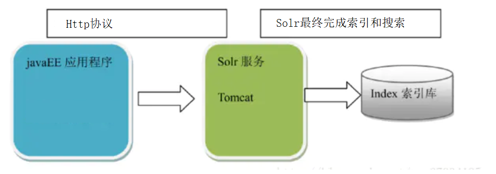

# SolrJ

## 0.1 SolrJ的引入

​	使用java如何操作Solr；

​	第一種方式Rest API


​		流程：

​			使用Rest API的好處，我們只需要通過Http協議連接到Solr，即可完成全文檢索的功能。

​	

​	在java中可以發送Http請求的工具包比較多。

​			Apache：HttpClient 

​			Square: OKHttpClient 

​			JDK : URLConnection

​			Spring: 以上的API提供的發送Http請求的方式都是不同，所以Spring提供了一個模板RestTemplate，可以對以上Http請求工具類進行封裝從而統一API。

​	演示：

​		通過RestTemplate發送http請求，請求Solr服務完成查詢item_title:手機的文檔。並且需要完成結果封裝。

​	

​	開發步驟：

​			1.創建服務，引入spring-boot-stater-web的依賴（包含了RestTemplate）

```
	<parent>
        <groupId>org.springframework.boot</groupId>
        <artifactId>spring-boot-starter-parent</artifactId>
        <version>2.1.10.RELEASE</version>
    </parent>
    <dependencies>
        <dependency>
            <groupId>org.springframework.boot</groupId>
            <artifactId>spring-boot-starter-web</artifactId>
        </dependency>
        <dependency>
            <groupId>org.springframework.boot</groupId>
            <artifactId>spring-boot-starter-test</artifactId>
        </dependency>
    </dependencies>
```

​			2.編寫啟動類和yml配置文件

```
@SpringBootApplication
public class Application {
    public static void main(String[] args) {
        SpringApplication.run(Application.class, args);
    }

}
```

​			3.將RestTemplate交由spring管理

```
    @Bean
    public RestTemplate restTemplate() {
        return new RestTemplate(); //底層封裝URLConnection
    }
```

​			4. 使用RestTemplate，向Solr發送請求，獲取結果並進行解析。

```
@Test
    public void test01() {
        //定義請求的url
        String url = "http://localhost:8080/solr/collection1/select?q=item_title:手機";
        //發送請求，指定響應結果類型，由於響應的結果是JSON，指定Pojo/Map
        ResponseEntity<Map> resp = restTemplate.getForEntity(url, Map.class);
        //獲取響應體結果
        Map<String,Object> body = resp.getBody();
        //獲取Map中--->response
        Map<String,Object> response = (Map<String, Object>) body.get("response");
        //獲取總記錄數
        System.out.println(response.get("numFound"));
        //獲取起始下標
        System.out.println(response.get("start"));
        //獲取文檔
        List<Map<String,Object>> docs = (List<Map<String, Object>>) response.get("docs");
        for (Map<String, Object> doc : docs) {
            System.out.println(doc.get("id"));
            System.out.println(doc.get("item_title"));
            System.out.println(doc.get("item_price"));
            System.out.println(doc.get("item_image"));
            System.out.println("=====================");
        }
    }
```

## 0.2 SolrJ 介紹


​	Solr官方就推出了一套專門操作Solr的java API，叫SolrJ。

​	使用SolrJ操作Solr會比利用RestTemplate來操作Solr要簡單。 SolrJ底層還是通過使用httpClient中的方法來完成Solr的操作.

​	SolrJ核心的API

​		SolrClient

​		HttpSolrClient：適合於單節點的情況下和Solr進行交互。

​		CloudSolrClient：適合於集群的情況下和Solr進行交互。

​	由於當前我們Solr未搭建集群，所以我們使用HttpSolrClient即可。要想使用SolrJ，需要在項目中引入SorlJ的依賴，建議Solr的版本一致.

```
<dependency>
    <groupId>org.apache.solr</groupId>
    <artifactId>solr-solrj</artifactId>
    <version>7.7.2</version>
</dependency>
```

​	將HttpSolrClient交由spring管理。

​		1.在yml配置文件中配置Solr服務·	`

```
url: http://localhost:8080/solr/collection1
```

​		2.在啟動類中配置HttpSolrClient

```
    @Value("${url}")
    private String url;
    @Bean
    public HttpSolrClient httpSolrClient() {
        HttpSolrClient.Builder builder = new HttpSolrClient.Builder(url);
        return builder.build();
    }
```

## 0.3 HttpSolrClient

##### 0.3.1 索引

###### 0.3.1.1添加

​		需求：添加一個圖書文檔。

​		添加有很多重載方法，SolrJ中支持添加一個文檔，也支持一次添加文檔集合。

```
@Test
    public void testAddDocument() throws IOException, SolrServerException {
        //創建文檔
        SolrInputDocument document = new SolrInputDocument();
        //指定文檔中的域
        document.setField("id", "889922");
        document.setField("item_title","華為 Meta30 高清手機");
        document.setField("item_price", 20);
        document.setField("item_images", "21312312.jpg");
        document.setField("item_createtime", new Date());
        document.setField("item_updatetime", new Date());
        document.setField("item_category", "手機");
        document.setField("item_brand","華為");
        //添加文檔
        httpSolrClient.add(document);
        httpSolrClient.commit();
    }
```

###### 0.3.1.2 修改

​				如果文檔id相同就是修改；

```
@Test
    public void testAddDocument() throws IOException, SolrServerException {

        //創建文檔
        SolrInputDocument document = new SolrInputDocument();
        //指定文檔中的域
        document.setField("id", "889922");
        document.setField("book_name","SolrJ是Solr提供的操作Solr的javaAPI,挺好用");
        document.setField("book_num", 20);
        document.setField("book_pic", "21312312.jpg");
        document.setField("book_price", 20.0);
        //添加文檔
        httpSolrClient.add(document);
        httpSolrClient.commit();
    }
```

###### 0.3.1.3 刪除

​	支持基於id刪除，支持基於條件刪除。

​	基於id刪除

```
   @Test
    public void testDeleteDocument() throws IOException, SolrServerException {
        httpSolrClient.deleteById("889922");
        httpSolrClient.commit();
    }
```

​	支持基於條件刪除，刪除所有數據要慎重

```
    @Test
    public void testDeleteQuery() throws IOException, SolrServerException {
        httpSolrClient.deleteByQuery("book_name:java"); //*:*刪除所有
        httpSolrClient.commit();
    }
```

##### 0.3.2 基本查詢

###### 0.3.2.1 主查詢+過濾查詢

​		查詢的操作分為很多種下面我們講解基本查詢。

​	核心的API方法：

​		solrClient.query(SolrParams)；

​		SolrParams是一個抽像類，通常使用其子類SolrQuery封裝查詢條件；		

​		查詢item_title中包含手機的商品

```
@Test
    public void testBaseQuery() throws IOException, SolrServerException {
        //封裝查詢條件
        SolrQuery params = new SolrQuery();
        //設置查詢條件,參數1：查詢參數,q,fq...
        params.setQuery("item_title:手機");
        //執行查詢,獲取結果
        QueryResponse resp = httpSolrClient.query(params);
        //滿足條件的文檔
        SolrDocumentList results = resp.getResults();
        //迭代results
        for (SolrDocument result : results) {
            System.out.println(result.get("id") + "--" + result.get("item_title"));
        }
        //獲取總記錄
        long numFound = results.getNumFound();
        System.out.println(numFound);
    }
```

​		

​		這是關於我們這一塊核心API，接下來我們在這個基礎上。我們做一些其他操作。添加過濾條件:品牌是華為。

價格在[1000-2000].

​		注意：過濾條件可以添加多個，所以使用的是SolrQuery的add方法。如果使用set後面過濾條件會將前面的覆蓋.

```
 @Test
    public void testBaseFilterQuery() throws IOException, SolrServerException {
        //封裝查詢條件
        SolrQuery params = new SolrQuery();
        //設置查詢條件,參數1：查詢參數,q,fq...
        params.setQuery("item_title:手機");
        params.addFilterQuery("item_brand:華為");
        params.addFilterQuery("item_price:[1000 TO 2000]");
        //執行查詢,獲取結果
        QueryResponse resp = httpSolrClient.query(params);
        //滿足條件的文檔
        SolrDocumentList results = resp.getResults();
        //迭代results
        for (SolrDocument result : results) {
            System.out.println(result.get("id") + "--" + result.get("item_title") + "---" + result.get("item_brand") + "---" + result.get("item_price"));
        }
        //獲取總記錄
        long numFound = results.getNumFound();
        System.out.println(numFound);
    }
```

###### 0.3.2.1 分頁

​	接下來我們要完成的是分頁，需求：在以上查詢的條件查詢，查詢第1頁的20條數據。

```
params.setStart(10);
params.setRows(10);
```

###### 0.3.2.1 排序

​	除了分頁外，還有排序。需求：按照價格升序。如果價格相同，按照id降序。

```
params.addSort("item_price,",Order.desc);
params.addSort("id",Order.asc);
```

###### 0.3.2.2 域名起別名

​	到這基本查詢就基本講解完畢。有時候我們需要對查詢結果文檔的字段起別名。

​	需求：將域名中的item_去掉。

```
  //指定查詢結果的字段列表，並且指定別名
  params.setFields("id,price:item_price,title:item_title,brand:item_brand,category:item_category,image:item_image");
 System.out.println(result.get("id") + "--" + result.get("title") + "---" + result.get("brand") + "---" + result.get("category"));
```

​	別名指定完畢後，便於我們後期進行封裝；到這關於基本查詢講解完畢，下面講解組合查詢。

##### 0.3.3 組合查詢

​	需求：查詢Item_title中包含手機或者平板電視的文檔。

```
params.setQuery("q","item_title:手機 OR item_title:平板電視");
```

​	需求：查詢Item_title中包含手機 並且包含三星的文檔

```
params.setQuery("item_title:手機 AND item_title:三星");
params.setQuery(,"+item_title:手機  +item_title:三星");
```

​	需求: 查詢item_title中包含手機但是不包含三星的文檔

```
params.setQuery("item_title:手機  NOT item_title:三星");
params.setQuery("+item_title:手機  -item_title:三星");
```

​	需求：查詢item_title中包含iphone開頭的詞的文檔，使用通配符。 ；

```
params.setQuery("item_title:iphone*");
```

## 1.SorJ其他查詢

##### 1.1 facet查詢

​		之前我們講解Facet查詢，我們說他是分為4類。

​		Field,Query,Range（時間範圍，數字範圍）,Interval（和Range類似）

###### 1.1.2 基於Field的Facet查詢

​		需求：對item_title中包含手機的文檔，按照品牌域進行分組，並且統計數量；

```
http://localhost:8080/solr/collection1/select?q=item_title:手機&facet=on&facet.field=item_brand&facet.mincount=1
```

```
@Test
    public void testFacetFieldQuery() throws IOException, SolrServerException {
        SolrQuery params = new SolrQuery();
        //查詢條件
        params.setQuery( "item_title:手機");
        //Facet相關參數
        params.setFacet(true); //facet=on
        params.addFacetField("item_brand"); //item_brand
        params.setFacetMinCount(1);
        QueryResponse response = httpSolrClient.query(params);

        //對於Fact查詢來說，我們主要獲取Facet相關的數據
        //根據域名獲取指定分組數據
        FacetField facetField = response.getFacetField("item_brand");
        List<FacetField.Count> values = facetField.getValues();
        for (FacetField.Count value : values) {
            System.out.println(value.getName() + "--" + value.getCount());
        }

    }
```

###### 1.1.3 基於Query的Facet查詢

​	需求：查詢分類是平板電視的商品數量 ，品牌是華為的商品數量 ，品牌是三星的商品數量，價格在1000-2000的商品數量；

```
http://localhost:8080/solr/collection1/select?
q=*:*&
facet=on&
facet.query=item_category:平板電視&
facet.query=item_brand:華為&
facet.query=item_brand:三星&
facet.query=item_price:%5B1000 TO 2000%5D
```

```
public void testFacetFieldQuery() throws IOException, SolrServerException {
        SolrQuery params = new SolrQuery();
        //查詢條件
        params.setQuery( "*:*");
        //Facet相關參數
        /**
         * facet.query=item_category:平板電視&
         * facet.query=item_brand:華為&
         * facet.query=item_brand:三星&
         * facet.query=item_price:[1000 TO 2000]
         */
        params.setFacet(true); //facet=on
        params.addFacetQuery("{!key=平板電視}item_category:平板電視");
        params.addFacetQuery("{!key=華為品牌}item_brand:華為");
        params.addFacetQuery("{!key=三星品牌}item_brand:三星");
        params.addFacetQuery("{!key=1000到2000}item_price:[1000 TO 2000]");
        QueryResponse response = httpSolrClient.query(params);

        //對於Fact查詢來說，我們主要獲取Facet相關的數據
        //根據域名獲取指定分組數據
        /**
         * item_category:平板電視: 207,
         * item_brand:華為: 67,
         * item_brand:三星: 154,
         * item_price:[1000 TO 2000]: 217
         */
        Map<String, Integer> facetQuery = response.getFacetQuery();
        for (String key : facetQuery.keySet()) {
            System.out.println(key + "--" +facetQuery.get(key));
        }

    }
```

###### 1.1.4 基於Range的Facet查詢

​	需求：分組查詢價格0-2000 ，2000-4000，4000-6000....18000-20000每個區間商品數量

```
q=*:*&
facet=on&
facet.range=item_price&
facet.range.start=0&
facet.range.end=20000&
facet.range.gap=2000
```

```
public void testFacetRange() throws IOException, SolrServerException {
        SolrQuery params = new SolrQuery();
        //查詢條件
        params.setQuery( "*:*");
        //Facet相關參數
        /**
         * facet=on&
         * facet.range=item_price&
         * facet.range.start=0&
         * facet.range.end=20000&
         * facet.range.gap=2000
   
         */
        params.setFacet(true); //facet=on
        params.addNumericRangeFacet("item_price", 0, 20000, 2000);
        QueryResponse response = httpSolrClient.query(params);

        List<RangeFacet> facetRanges = response.getFacetRanges();
        for (RangeFacet facetRange : facetRanges) {
            System.out.println(facetRange.getName());
            List<RangeFacet.Count> counts = facetRange.getCounts();
            for (RangeFacet.Count count : counts) {
                System.out.println(count.getValue() + "---" + count.getCount());
            }
        }

    }
```

需求：統計2015年每個季度添加的商品數量

```
http://localhost:8080/solr/collection1/select?
q=*:*&
facet=on&
facet.range=item_createtime&
facet.range.start=2015-01-01T00:00:00Z&
facet.range.end=2016-01-01T00:00:00Z&
facet.range.gap=%2B3MONTH


```

```
@Test
    public void testFacetRange() throws IOException, SolrServerException, ParseException {
        SolrQuery params = new SolrQuery();
        //查詢條件
        params.setQuery( "*:*");
        //Facet相關參數
        /**
         * facet=on&
         * facet.range=item_price&
         * facet.range.start=0&
         * facet.range.end=20000&
         * facet.range.gap=2000
         */
        params.setFacet(true); //facet=on
        Date start =  new SimpleDateFormat("yyyy-MM-dd HH:mm:ss").parse("2015-01-01 00:00:00");
        Date end = new SimpleDateFormat("yyyy-MM-dd HH:mm:ss").parse("2016-01-01 00:00:00");
        params.addDateRangeFacet("item_createtime", start, end, "+4MONTH");
        QueryResponse response = httpSolrClient.query(params);
        List<RangeFacet> facetRanges = response.getFacetRanges();
        for (RangeFacet facetRange : facetRanges) {
            System.out.println(facetRange.getName());
            List<RangeFacet.Count> counts = facetRange.getCounts();
            for (RangeFacet.Count count : counts) {
                System.out.println(count.getValue() + "---" + count.getCount());
            }
        }

    }
```


###### 1.1.5 基於Interval的Facet查詢

​	需求：統計item_price在0-1000和0-100商品數量和item_createtime是2019年~現在添加的商品數量

```
&facet=on
&facet.interval=item_price
&f.item_price.facet.interval.set=[0,1000]
&f.item_price.facet.interval.set=[0,100]
&facet.interval=item_createtime
&f.item_createtime.facet.interval.set=[2019-01-01T0:0:0Z,NOW]
由於有特殊符號需要進行URL編碼[---->%5B   ]---->%5D
http://localhost:8080/solr/collection1/select?q=*:*&facet=on&facet.interval=item_price&f.item_price.facet.interval.set=%5B0,1000%5D&f.item_price.facet.interval.set=%5B0,100%5D&facet.interval=item_createtime&f.item_createtime.facet.interval.set=%5B2019-01-01T0:0:0Z,NOW%5D
```

```
@Test
    public void testIntervalRange() throws IOException, SolrServerException, ParseException {
        SolrQuery params = new SolrQuery();
        //查詢條件
        params.setQuery( "*:*");
        //Facet相關參數
        /**
         &facet=on
         &facet.interval=item_price
         &f.item_price.facet.interval.set=[0,10]
         &facet.interval=item_createtime
         &f.item_createtime.facet.interval.set=[2019-01-01T0:0:0Z,NOW]
         */
        params.setFacet(true); //facet=on
        params.addIntervalFacets("item_price", new String[]{"[0,10]"});
        params.addIntervalFacets("item_createtime", new String[]{"[2019-01-01T0:0:0Z,NOW]"});
        QueryResponse response = httpSolrClient.query(params);

        /*
            item_price: {
            [0,10]: 11
            },
            item_createtime: {
            [2019-01-01T0:0:0Z,NOW]: 22
            }
         */
        List<IntervalFacet> intervalFacets = response.getIntervalFacets();
        for (IntervalFacet intervalFacet : intervalFacets) {
            String field = intervalFacet.getField();
            System.out.println(field);
            List<IntervalFacet.Count> intervals = intervalFacet.getIntervals();
            for (IntervalFacet.Count interval : intervals) {
                System.out.println(interval.getKey());
                System.out.println(interval.getCount());
            }

        }
    }
```

###### 1.1.6 Facet維度查詢

​	需求：統計每一個品牌和其不同分類商品對應的數量；

​	  聯想 手機 10

​	  聯想  電腦 2

​	  華為 手機 10

​	...

```
 http://localhost:8080/solr/collection1/select?q=*:*&
 &facet=on
 &facet.pivot=item_brand,item_category
```

```
@Test
    public void testPivotFacet() throws IOException, SolrServerException, ParseException {
        SolrQuery params = new SolrQuery();
        //查詢條件
        params.setQuery( "*:*");
  
        /**
         *  &facet=on
         *  &facet.pivot=item_brand,item_category
         */
        params.addFacetPivotField("item_brand,item_category");
        //執行查詢
        QueryResponse response = httpSolrClient.query(params);

        //解析
        NamedList<List<PivotField>> facetPivot = response.getFacetPivot();

        for (Map.Entry<String, List<PivotField>> stringListEntry : facetPivot) {
            List<PivotField> value = stringListEntry.getValue();
            for (PivotField pivotField : value) {
                System.out.println(pivotField.getField());
                System.out.println(pivotField.getValue());
                System.out.println(pivotField.getCount());
                List<PivotField> pivot = pivotField.getPivot();
                for (PivotField field : pivot) {
                    System.out.println(field.getField());
                    System.out.println(field.getValue());
                    System.out.println(field.getCount());
                }
                System.out.println("--------------------");
            }
        }
    }
```

##### 1.2  group查詢

###### 1.2.1 基礎的分組

​	需求：查詢Item_title中包含手機的文檔，按照品牌對文檔進行分組；同組中的文檔放在一起。

```
http://localhost:8080/solr/collection1/select?
q=item_title:手機
&group=true
&group.field=item_brand
```

```
@Test
    public void testGroupQuery() throws IOException, SolrServerException, ParseException {
        SolrQuery params = new SolrQuery();
        params.setQuery("item_title:手機");

        /**
         * q=item_title:手機
         * &group=true
         * &group.field=item_brand
         */
        //注意solrJ中每沒有提供分組特有API。需要使用set方法完成
        params.setGetFieldStatistics(true);
        params.set(GroupParams.GROUP, true);
        params.set(GroupParams.GROUP_FIELD,"item_brand");

        //封裝了整個Group分組查詢結果
        QueryResponse response = httpSolrClient.query(params);
        GroupResponse groupResponse = response.getGroupResponse();
        //由於分組的字段可以是多個。所以返回數組
        List<GroupCommand> values = groupResponse.getValues();
        //獲取品牌分組結果
        GroupCommand groupCommand = values.get(0);
        //匹配到的文檔數量
        int matches = groupCommand.getMatches();
        System.out.println(matches);
        //每個組合每個組中的文檔信息
        List<Group> groups = groupCommand.getValues();
        for (Group group : groups) {
            //分組名稱
            System.out.println(group.getGroupValue());
            //組內文檔
            SolrDocumentList result = group.getResult();
            System.out.println(group.getGroupValue() +":文檔個數" + result.getNumFound());
            for (SolrDocument entries : result) {
                System.out.println(entries);
            }
        }
    }
```


###### 1.2.2 group分頁

​		默認情況下分組結果中只會展示前10個組，並且每組展示相關對最高的1個文檔。我們可以使用start和rows可以設置組的分頁，使用group.limit和group.offset設置組內文檔分頁。

```
q=item_title:手機&group=true&group.field=item_brand&start=0&rows=3
&group.limit=5&group.offset=0
```

​	展示前3個組及每組前5個文檔。

```
 //設置組的分頁參數
 params.setStart(0);
 params.setRows(3);
 //設置組內文檔的分頁參數
 params.set(GroupParams.GROUP_OFFSET, 0);
 params.set(GroupParams.GROUP_LIMIT, 5);
```

###### 1.2.3  group排序

​	之前講解排序的時候，group排序分為組排序，組內文檔排序；對應的參數為sort和group.sort

​	需求：按照組內價格排序降序；

```
 params.set(GroupParams.GROUP_SORT, "item_price desc");
```

##### 1.3 高亮

###### 1.3.1 高亮查詢

​		查詢item_title中包含手機的文檔，並且對item_title中的手機關鍵字進行高亮；

```
   http://localhost:8080/solr/collection1/select?
    q=item_title:手機
    &hl=true
    &hl.fl=item_title
    &hl.simple.pre=<font>
    &h1.simple.post=</font>
```

```
@Test
    public void testHighlightingQuery() throws IOException, SolrServerException {
        SolrQuery params = new SolrQuery();
        params.setQuery("item_title:三星手機");
        //開啟高亮
        params.setHighlight(true);
        //設置高亮域
        //高亮的前後綴
        params.addHighlightField("item_title");
        params.setHighlightSimplePre("<font>");
        params.setHighlightSimplePost("</font>");

        QueryResponse response = httpSolrClient.query(params);

        SolrDocumentList results = response.getResults();
        for (SolrDocument result : results) {
            System.out.println(result);
        }
        
        //解析高亮
        Map<String, Map<String, List<String>>> highlighting = response.getHighlighting();
        //map的key是文檔id,map的value包含高亮的數據
        for (String id : highlighting.keySet()) {
            System.out.println(id);
            /**
             * item_title: [
             * "飛利浦 老人<em>手機</em> (X2560) 深情藍 移動聯通2G<em>手機</em> 雙卡雙待"
             * ]
             */
            Map<String, List<String>> highLightData = highlighting.get(id);
            //highLightData key包含高亮域名
            //獲取包含高亮的數據
            if(highLightData != null && highLightData.size() > 0) {
                //[
                //             * "飛利浦 老人<em>手機</em> (X2560) 深情藍 移動聯通2G<em>手機</em> 雙卡雙待"
                //             * ]
                List<String> stringList = highLightData.get("item_title");
                if(stringList != null && stringList.size() >0) {
                    String title = stringList.get(0);
                    System.out.println(title);
                }
            }
        }

        //將高亮的數據替換到原有文檔中。

    }
```


###### 1.3.2 高亮器的切換

​		當然我們也可以使用SolrJ完成高亮器的切換。之前我們講解過一個高亮器fastVector,可以實現域中不同的詞使用不同顏色。

​	查詢item_title中包含三星手機的文檔.item_title中三星手機中不同的詞，顯示不同的顏色；

```
http://localhost:8080/solr/collection1/select?
q=item_title:三星手機
&hl=true
&hl.fl=item_title
&hl.method=fastVector
```

##### 1.4 suggest查詢

###### 1.4.1 spell-checking 拼寫檢查。

​	需求：查詢item_title中包含iphone的內容。要求進行拼寫檢查。

```
http://localhost:8080/solr/collection1/select?
q=item_title:iphonx&spellcheck=true
```

​	

```
@Test
    public void test01() throws IOException, SolrServerException {
        SolrQuery params = new SolrQuery();
        params.setQuery("item_title:iphonxx");
        params.set("spellcheck",true);
        QueryResponse response = httpSolrClient.query(params);
        /**
         * suggestions: [
         * "iphonxx",
         * {
         * numFound: 1,
         * startOffset: 11,
         * endOffset: 18,
         * suggestion: [
         * "iphone6"
         * ]
         * }
         * ]
         */
        SpellCheckResponse spellCheckResponse = response.getSpellCheckResponse();
        Map<String, SpellCheckResponse.Suggestion> suggestionMap = spellCheckResponse.getSuggestionMap();
        for (String s : suggestionMap.keySet()) {
            //錯誤的詞
            System.out.println(s);
            //建議的詞
            SpellCheckResponse.Suggestion suggestion = suggestionMap.get(s);

            List<String> alternatives = suggestion.getAlternatives();
            System.out.println(alternatives);
        }

    }
```

​		

###### 1.4.2Auto Suggest自動建議。

上面我們講解完畢拼寫檢查，下面我們講解自動建議，自動建議也是需要在SolrConfig.xml中進行相關的配置。

需求：查詢三星，要求基於item_title域進行自動建議

```
http://localhost:8080/solr/collection1/select?
q=三星&suggest=true&suggest.dictionary=mySuggester&suggest.count=5
```

​	

```
@Test
    public void test02() throws IOException, SolrServerException {
        SolrQuery params = new SolrQuery();
        //設置參數
        params.setQuery("java");
        //開啟自動建議
        params.set("suggest",true);
        //指定自動建議的組件
        params.set("suggest.dictionary","mySuggester");
      
        QueryResponse response = httpSolrClient.query(params);
        SuggesterResponse suggesterResponse = response.getSuggesterResponse();
        Map<String, List<Suggestion>> suggestions = suggesterResponse.getSuggestions();
        for (String key : suggestions.keySet()) {
            //詞
            System.out.println(key);
            List<Suggestion> suggestionList = suggestions.get(key);
            for (Suggestion suggestion : suggestionList) {
                String term = suggestion.getTerm();
                System.out.println(term);
            }
        }
    }
```

##### 1.5  使用SolrJ完成Core的管理

###### 1.5.1 Core添加

​		1.要想完成SolrCore的添加，在solr_home必須提前創建好SolrCore的目錄結構，而且必須包相關的配置文件。

​		

```
修改配置文件中url:http://localhost:8080/solr
CoreAdminRequest.createCore("collection4", "D:\\solr_home\\collection4", solrClient );
```

###### 1.5.2 重新加載Core

​	從Solr中移除掉，然後在添加。

```
CoreAdminRequest.reloadCore("collection4",  solrClient );
```

###### 1.5.3	重命名Core

```
CoreAdminRequest.renameCore("collection4","newCore" , solrClient)
```

###### 1.5.4 卸載solrCore

​		卸載僅僅是從Solr中將該Core移除，但是SolrCore的物理文件依然存在

```
CoreAdminRequest.unloadCore("collection4",  solrClient );
```

###### 1.5.5 solrCore  swap

```
 CoreAdminRequest.swapCore("collection1", "collection4", solrClient);
```


