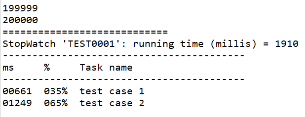

# 1.獲取ApplicationContext 方式

  a.使用WebApplicationContextUtils

```java
ApplicationContext context = WebApplicationContextUtils.getWebApplicationContext(this.getServletContext());
```

b.

# 處理fileUpload IE getOriginalFilename 取檔名跟其他瀏覽器不一樣問題


```java
	@RequestMapping(value = "/apple",method = RequestMethod.POST)
	public void file(MultipartFile  apple) {
		System.err.println(apple.getOriginalFilename());
		String fileName = apple.getOriginalFilename();

		int startIndex = fileName.replaceAll("\\\\", "/").lastIndexOf("/");
		fileName = fileName.substring(startIndex + 1);
		System.err.println("111111111::"+fileName);
		System.err.println(apple.getName());
	}
```

# 效能調教工具StopWatch

```java
import org.springframework.util.StopWatch;

StopWatch stopWatch = new StopWatch("TEST0001");
stopWatch.start("test case 1");
int count = 0;
for (int i = 0; i < 100000; i++) {
		count++;
		System.out.println(count);
}
stopWatch.stop();
stopWatch.start("test case 2");
int count1 = 0;
for (int i = 0; i < 200000; i++) {
		count1++;
		System.out.println(count1);
}
System.out.println("============================");
stopWatch.stop();
System.out.println(stopWatch.prettyPrint());
```
result:


