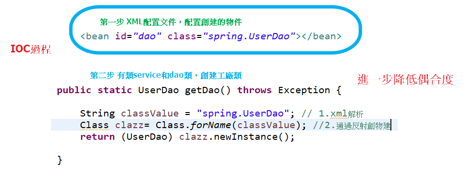
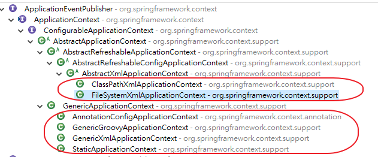

# IOC

- 1.控制反轉，也就是把物件的創建以及物件之間的調用過程，全部交給Spring進行管理
- 2.使用IOC目的:為了降低偶合度

## IOC底層原理

- 1、xml解析、工廠模式、反射



## IOC BeanFactory 接口

- 1、IOC思想基於IOC容器完成，IOC容器底層就是對象工廠
- 2、Spring提供IOC容器實現兩種方式：（兩個接口）
    - （1）BeanFactory：IOC容器基本實現，是Spring內部的使用接口，不提供開發人員進行使用
        * 加載配置文件時候不會創建對象，在獲取對象（使用）才去創建對象
    - （2）ApplicationContext：BeanFactory接口的子接口，提供更多更強大的功能，一般由開發人員進行使用
        * 加載配置文件時候就會把在配置文件對象進行創建
        * 一般來說會把創建物件的過程，放在服務器啟動時，以增加系統運行效能
- 3、ApplicationContext接口的實現類



## IOC 操作 Bean 管理（概念）

- 1、什麼是Bean管理
    - （0）Bean管理指的是兩個操作
    - （1）Spring創建對象
    - （2）Spirng注入屬性

- 2、Bean管理操作有兩種方式
    - （1）基於xml配置文件方式實現
    - （2）基於註解方式實現

## [基於XML方式，操作IOC容器](SpringFramework/xmlBean.md)


## [基于注解方式，操作IOC容器](SpringFramework/annotationBean.md)

## [事務](SpringFramework/tx.md)


# 1、IOC思想基於IOC容器完成，IOC容器底層就是物件工廠
# 2、Spring提供IOC容器實現兩種方式：（兩個接口）
  （1）BeanFactory：IOC容器基本實現，是Spring內部的使用接口，不提供開發人員進行使用
 * 加載配置文件時候不會創建物件，在獲取對象（使用）才去創建物件
 
  （2）ApplicationContext：BeanFactory接口的子接口，提供更多更強大的功能，一般由開發人員進行使用
  * 加載配置文件時候就會把在配置文件物件進行創建，也就是說在Server啟動應用程式時就已經創建配置文件裡的物件

# 3.獲取ApplicationContext 方式

  a.使用WebApplicationContextUtils

```java
ApplicationContext context = WebApplicationContextUtils.getWebApplicationContext(this.getServletContext());
```

b.

# 處理fileUpload IE getOriginalFilename 取檔名跟其他瀏覽器不一樣問題


```java
	@RequestMapping(value = "/apple",method = RequestMethod.POST)
	public void file(MultipartFile  apple) {
		System.err.println(apple.getOriginalFilename());
		String fileName = apple.getOriginalFilename();

		int startIndex = fileName.replaceAll("\\\\", "/").lastIndexOf("/");
		fileName = fileName.substring(startIndex + 1);
		System.err.println("111111111::"+fileName);
		System.err.println(apple.getName());
	}
```

# 效能調教工具StopWatch

```java
import org.springframework.util.StopWatch;

StopWatch stopWatch = new StopWatch("TEST0001");
stopWatch.start("test case 1");
int count = 0;
for (int i = 0; i < 100000; i++) {
		count++;
		System.out.println(count);
}
stopWatch.stop();
stopWatch.start("test case 2");
int count1 = 0;
for (int i = 0; i < 200000; i++) {
		count1++;
		System.out.println(count1);
}
System.out.println("============================");
stopWatch.stop();
System.out.println(stopWatch.prettyPrint());
```
result:


