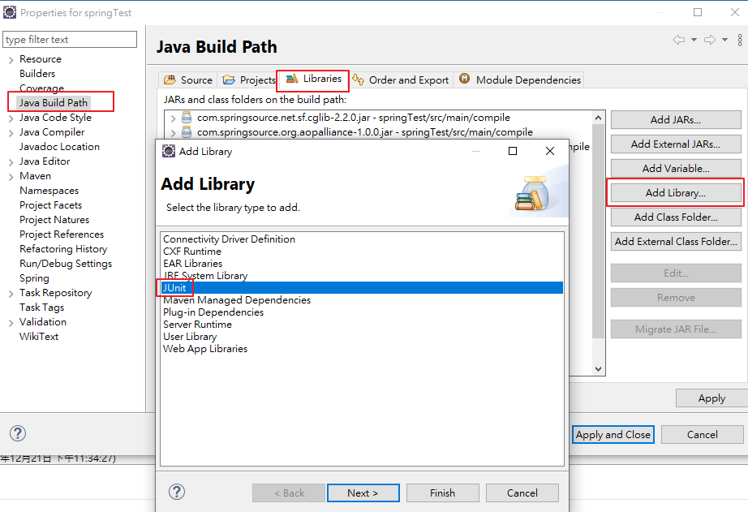
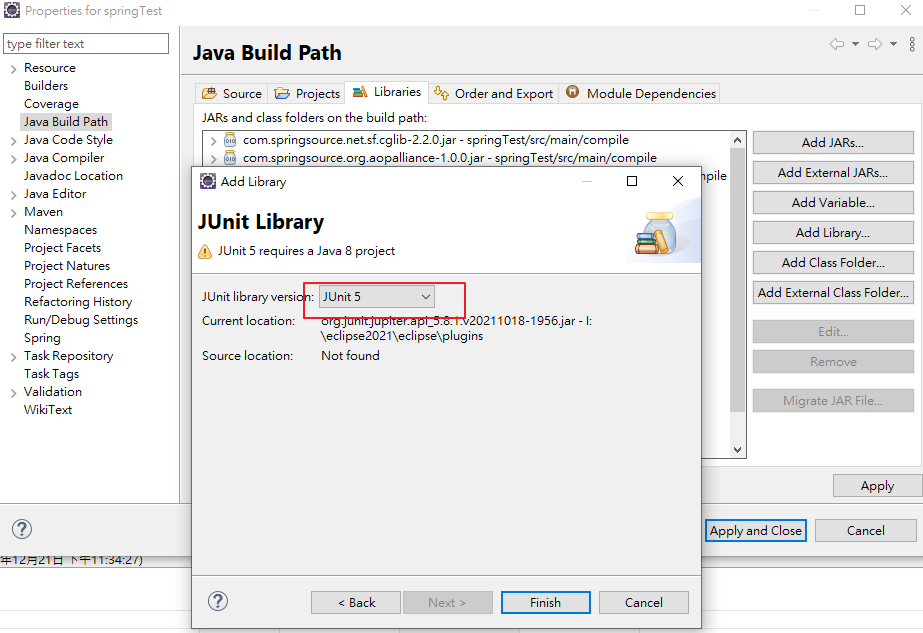

# Junit4

```java
package spring.transaction;

import org.junit.Test;
import org.junit.runner.RunWith;
import org.springframework.beans.factory.annotation.Autowired;
import org.springframework.context.ApplicationContext;
import org.springframework.context.support.ClassPathXmlApplicationContext;
import org.springframework.test.context.ContextConfiguration;
import org.springframework.test.context.junit4.SpringJUnit4ClassRunner;

import spring.transaction.config.JdbcConfig;
import spring.transaction.service.AccountService;

@RunWith(SpringJUnit4ClassRunner.class) //單元測試框架
//@ContextConfiguration("classpath:jdbc.xml") //加載配置文件
@ContextConfiguration(classes = {JdbcConfig.class})//加載配置類
public class JTest4 {

	@Autowired//因為使用了@ContextConfiguration註解加載配置文件，所以在單元測試類可以直加自動裝配
	AccountService accountService;

    @Test
    public void test1() {
//		ApplicationContext context = new ClassPathXmlApplicationContext("jdbc.xml");
//		AccountService accountService = context.getBean("accountService",AccountService.class);
		accountService.accountMoney();
    }
}

```

# Junit5

- 1.需先引入Junit5 jar包


```java
package spring.transaction;

import org.junit.jupiter.api.Test;
import org.junit.jupiter.api.extension.ExtendWith;
import org.springframework.beans.factory.annotation.Autowired;
import org.springframework.test.context.ContextConfiguration;
import org.springframework.test.context.junit.jupiter.SpringExtension;
import org.springframework.test.context.junit.jupiter.web.SpringJUnitWebConfig;

import spring.transaction.config.JdbcConfig;
import spring.transaction.service.AccountService;

//第一種寫法
//@ExtendWith(SpringExtension.class)
//@ContextConfiguration("classpath:jdbc.xml")
//@ContextConfiguration(classes = {JdbcConfig.class})
//第二種寫法
//@SpringJUnitWebConfig(classes = {JdbcConfig.class}) 
@SpringJUnitWebConfig(locations = {"classpath:jdbc.xml"}) 
public class Junit5 {
	
	@Autowired//因為使用了@ContextConfiguration註解加載配置文件，所以在單元測試類可以直加自動裝配
	AccountService accountService;

    @Test
    public void test1() {
		accountService.accountMoney();
    }
}

```