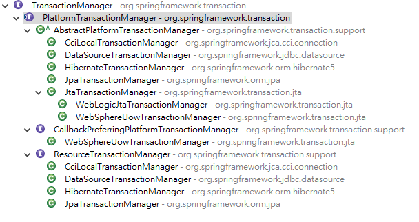
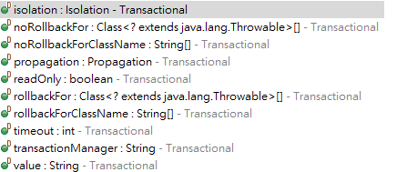
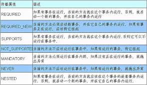

# 事務操作 

## 事務的4個特性

- 原子性（Atomicity）：一個事務（transaction）中的所有操作，或者全部完成，或者全部不完成，不會結束在中間某個環節。事務在執行過程中發生錯誤，會被回滾（Rollback）到事務開始前的狀態，就像這個事務從來沒有執行過一樣。即，事務不可分割、不可約簡。
- 一致性（Consistency）：在事務開始之前和事務結束以後，資料庫的完整性沒有被破壞。這表示寫入的資料必須完全符合所有的預設約束、觸發器、級聯回滾等。
- 事務隔離（Isolation）：資料庫允許多個並發事務同時對其數據進行讀寫和修改的能力，隔離性可以防止多個事務並發執行時由於交叉執行而導致數據的不一致。事務隔離分為不同級別，包括未提交讀（Read uncommitted）、提交讀（read committed）、可重複讀（repeatable read）和串行化（Serializable）。
- 持久性（Durability）：事務處理結束後，對數據的修改就是永久的，即便系統故障也不會丟失。


## 事務操作

- 1、事務添加到JavaEE三層結構裡面Service層（業務邏輯層）
- 2、在Spring進行事務管理操作
    - （1）有兩種方式：編程式事務管理和聲明式事務管理
- 3、聲明式事務管理
    - （1）基於註解方式（使用）
    - （2）基於xml配置文件方式
- 4、在Spring進行聲明式事務管理，底層使用AOP原理
- 5、Spring事務管理API
    - （1）提供一個接口，代表事務管理器，這個接口針對不同的框架提供不同的實現類
事



## 註解配置事務

- 1.在spring配置文件配置事務管理器

```xml
	<!-- 創建事務管理器 -->
	<bean id="transactionManager" class="org.springframework.jdbc.datasource.DataSourceTransactionManager">
		<property name="dataSource" ref="dataSource"></property>
	</bean>
```

- 2.在spring配置文件，開啟事務註解

    - 1.在spring配置文件引入命名空間tx
    ```xml
    <beans xmlns="http://www.springframework.org/schema/beans" xmlns:xsi="http://www.w3.org/2001/XMLSchema-instance" xmlns:context="http://www.springframework.org/schema/context" xmlns:aop="http://www.springframework.org/schema/aop" xmlns:tx="http://www.springframework.org/schema/tx" xsi:schemaLocation="http://www.springframework.org/schema/beans http://www.springframework.org/schema/beans/spring-beans.xsd http://www.springframework.org/schema/context http://www.springframework.org/schema/context/spring-context.xsd http://www.springframework.org/schema/aop http://www.springframework.org/schema/aop/spring-aop.xsd
    http://www.springframework.org/schema/tx http://www.springframework.org/schema/tx/spring-tx.xsd">

    ```
    - 2.開啟事務註解

    ```xml
    	<!-- 開啟事務註解 -->
	<tx:annotation-driven transaction-manager="transactionManager"></tx:annotation-driven>
    ```
    - 3、在service類上面（或者service類裡面方法上面）添加事務註解
        - （1）@Transactional，這個註解添加到類上面，也可以添加方法上面
        - （2）如果把這個註解添加類上面，這個類裡面所有的方法都添加事務
        - （3）如果把這個註解添加方法上面，為這個方法添加事務
        ```java
        @Service 
        @Transactional 
        public class UserService {
        ```
    
    - 4.聲明式事務管理配置

        - 1、在service類上面添加註解@Transactional，在這個註解裡面可以配置事務相關參數
        
        - 2、propagation：事務傳播行為
            - （1）多事務方法直接進行調用，這個過程中事務 是如何進行管理的

        - 1、在service類上面添加註解@Transactional，在這個註解裡面可以配置事務相關參數
        
        ```java
        @Service
        @Transactional(propagation = Propagation.REQUIRED)
        public class AccountService {
        ```
    - 5、ioslation：事務隔離級別
        - （1）事務有特性成為隔離性，多事務操作之間不會產生影響。不考慮隔離性產生很多問題
        - （2）有三個讀問題：臟讀、不可重複讀、虛（幻）讀
        - （3）臟讀：一個未提交事務讀取到另一個未提交事務的數據
    - 4、timeout：超時時間
        - （1）事務需要在一定時間內進行提交，如果不提交進行回滾
        - （2）默認值是 -1 ，設置時間以秒單位進行計算
    - 5、readOnly：是否只讀
        - （1）讀：查詢操作，寫：添加修改刪除操作
        - （2）readOnly默認值false，表示可以查詢，可以添加修改刪除操作
        - （3）設置readOnly值是true，設置成true之後，只能查詢
    - 6、rollbackFor：回滾
        - （1）設置出現哪些異常進行事務回滾
    - 7、noRollbackFor：不回滾
        - （1）設置出現哪些異常不進行事務回滾

## XML 聲明式事務管理

- 1、在spring配置文件中進行配置
    - 第一步 配置事務管理器
    - 第二步 配置通知
    - 第三步 配置切入點和切面

    ```xml

    	<!--1 創建事務管理器 -->
	<bean id="transactionManager"
		class="org.springframework.jdbc.datasource.DataSourceTransactionManager"> <!--注入數據源 -->
		<property name="dataSource" ref="dataSource"></property>
	</bean> <!--2 配置通知 -->
	<tx:advice id="txadvice"> <!--配置事務參數 -->
		<tx:attributes> <!--指定哪種規則的方法上面添加事務 -->
			<tx:method name="accountMoney" propagation="REQUIRED" /> <!--<tx:method name="account*"/> -->
		</tx:attributes>
	</tx:advice> <!--3 配置切入點和切面 -->
	<aop:config> <!--配置切入點 -->
		<aop:pointcut id="pt"
			expression="execution(* com.atguigu.spring5.service.UserService.*(..))" /> <!--配置切面 -->
		<aop:advisor advice-ref="txadvice" pointcut-ref="pt" />
	</aop:config>
    ```

## 完全註解聲明式事務管理

```java
@Configuration//配置類 
@ComponentScan(basePackages = "com.atguigu")//組件掃描 
@EnableTransactionManagement//開啟事務 
public class TxConfig {
	// 創建數據庫連接池
	@Bean
	public DruidDataSource getDruidDataSource() {
		DruidDataSource dataSource = new DruidDataSource();
		dataSource.setDriverClassName("com.mysql.jdbc.Driver");
		dataSource.setUrl("jdbc:mysql:///user_db");
		dataSource.setUsername("root");
		dataSource.setPassword("root");
		return dataSource;
	}

	// 創建JdbcTemplate對象
	@Bean
	public JdbcTemplate getJdbcTemplate(DataSource dataSource) {
		// 到ioc容器中根據類型找到dataSource
		JdbcTemplate jdbcTemplate = new JdbcTemplate(); // 注入dataSource j
		dbcTemplate.setDataSource(dataSource);
	}return jdbcTemplate;

	}

//創建事務管理器 
	@Bean
	public DataSourceTransactionManager getDataSourceTransactionManager(DataSource dataSource) {
		DataSourceTransactionManager transactionManager = new DataSourceTransactionManager();
		transactionManager.setDataSource(dataSource);
		return transactionManager;
	}
}
```