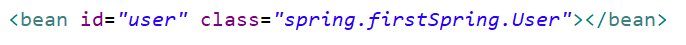

# 基於XML方式，操作IOC容器

## 1.基於XML方式創建物件



- （1）在spring配置文件中，使用bean標籤，標籤裡面添加對應屬性，就可以實現物件創建
- （2）在bean標籤有很多屬性，介紹常用的屬性
     * id屬性：唯一標識
     * class屬性：類全路徑（包類路徑）
- （3）創建物件時候，默認也是執行無參數構造方法完成物件創建

## 2.基於XML方式注入屬性

- （1）DI：依賴注入，就是注入屬性

## 3.第一種注入方式:使用set 方法進行注入

- (1) 創建類，定義屬性和對應的set方法
```java
package spring;

public class Book {
	private String bname;
	private String bauthor; 

	public void setBname(String bname) {
		this.bname = bname;
	}

	public void setBauthor(String bauthor) {
		this.bauthor = bauthor;
	}
}

```
- (2) 在spring 配置文件配置物件創建

```xml
<!--2 set方法注入屬性--> 
<bean id="book" class="com.atguigu.spring5.Book"> 
    <!--使用property完成屬性注入 name：類裡面屬性名稱 value：向屬性名稱注入的值 --> <property name="bname" value="一本書"></property> 
    <property name="bauthor" value="兩本書"></property> 
</bean>
```

## 4.第二種注入方式:使用有建構式進行注入

- (1) 創建類，定義屬性，創建屬性對應有參建構式
```java
package spring;

public class Orders {
	// 屬性
	private String oname;
	private String address;

	// 有參建構式
	public Orders(String oname, String address) {
		this.oname = oname;
		this.address = address;
	}
}


```
- (2) 在spring配置文件中進行配置
```xml
<!--3 有參建構式注入屬性 -->
<bean id="orders" class="com.atguigu.spring5.Orders">
    <constructor-arg name="oname" value="電腦"></constructor-arg>
    <constructor-arg name="address" value="日本"></constructor-arg>
</bean>
```

## 5.p名稱空間注入

- (1) 使用p名稱空間注入，可以簡化基於XML配置方式
    - 第一步 添加p名稱空間在配置文件中 
    - 第二步 进行属性注入，在bean标签里面进行操作
```xml
<?xml version="1.0" encoding="UTF-8"?>
<beans xmlns="http://www.springframework.org/schema/beans"
	xmlns:xsi="http://www.w3.org/2001/XMLSchema-instance"
	xmlns:p="http://www.w3.org/2001/p"
	xsi:schemaLocation="http://www.springframework.org/schema/beans http://www.springframework.org/schema/beans/spring-beans.xsd">

	<bean id="book" class="spring.Book" p:bname="JAVA" p:bauthor="FRANk"></bean>
</beans>

```
## 6.XML注入其他類型屬性

- 1.字面量
    - (1) NULL值
    ```xml
    <property name="address"> 
        <null/> 
    </property>
    ```
    - (2) 屬性值包含特殊符號
    ```xml
    	<!--屬性值包含特殊符號 1 把<>進行轉義 &lt; &gt; 2 把帶特殊符號內容寫到CDATA -->
	<property name="address">
		<value><![CDATA[<<南京>>]]></value>
	</property>
    ```

- 2.注入屬性-外部Bean
   ```xml
   	<!--1 service和dao物件創建 -->
	<bean id="userService"
		class="com.frank.spring5.service.UserService"> <!--注入userDao物件 name屬性：類裡面屬性名稱 ref屬性：創建userDao物件bean標籤id值 -->
		<property name="userDao" ref="userDaoImpl"></property>
	</bean>
	<bean id="userDaoImpl" class="com.frank.spring5.dao.UserDaoImpl"></bean>
   ```

- 3、注入屬性-內部bean
```xml
	<!--內部bean -->
	<bean id="emp" class="com.atguigu.spring5.bean.Emp"> 
		<property name="ename" value="lucy"></property>
		<property name="gender" value="女"></property> <!--設置物件屬性 -->
		<property name="dept">
			<bean id="dept" class="com.atguigu.spring5.bean.Dept">
				<property name="dname" value="安保部"></property>
			</bean>
		</property>
	</bean>
```

- 4、注入屬性-級聯賦值 
    - （1）第一種寫法
    ```xml
    	<!--級聯賦值 -->
	<bean id="emp" class="com.atguigu.spring5.bean.Emp"> <!--設置兩個普通屬性 -->
		<property name="ename" value="lucy"></property>
		<property name="gender" value="女"></property> <!--級聯賦值 -->
		<property name="dept" ref="dept"></property>
	</bean>
	<bean id="dept" class="com.atguigu.spring5.bean.Dept">
		<property name="dname" value="財務部"></property>
	</bean>
    ```
    - （1）第二種寫法
    ```xml
	<!--級聯賦值 -->
	<bean id="emp" class="com.atguigu.spring5.bean.Emp"> <!--設置兩個普通屬性 -->
		<property name="ename" value="lucy"></property>
		<property name="gender" value="女"></property> <!--級聯賦值 -->
		<property name="dept" ref="dept"></property>
		<property name="dept.dname" value="技術部"></property>
	</bean>
	<bean id="dept" class="com.atguigu.spring5.bean.Dept">
		<property name="dname" value="財務部"></property>
	</bean>
    ```

## 7.XML注入集合屬性

- 1、list、map、set類型屬性，生成對應set方法
```xml
	<!--1 集合類型屬性注入 -->
	<bean id="stu" class="com.atguigu.spring5.collectiontype.Stu"> <!--數組類型屬性注入 -->
		<property name="courses">
			<array>
				<value>java課程</value>
				<value>數據庫課程</value>
			</array>
		</property> <!--list類型屬性注入 -->
		<property name="list">
			<list>
				<value>張三</value>
				<value>小三</value>
			</list>
		</property> <!--map類型屬性注入 -->
		<property name="maps">
			<map>
				<entry key="JAVA" value="java"></entry>
				<entry key="PHP" value="php"></entry>
			</map>
		</property> <!--set類型屬性注入 -->
		<property name="sets">
			<set>
				<value>MySQL</value>
				<value>Redis</value>
			</set>
		</property>
	</bean>
```
- 4、在集合裡面設置對像類型值
```xml
	<!--創建多個course物件 -->
	<bean id="course1"
		class="com.atguigu.spring5.collectiontype.Course">
		<property name="cname" value="Spring5框架"></property>
	</bean>
	<bean id="course2"
		class="com.atguigu.spring5.collectiontype.Course">
		<property name="cname" value="MyBatis框架"></property>
	</bean> <!--注入list集合類型，值是物件 -->
	<property name="courseList">
		<list>
			<ref bean="course1"></ref>
			<ref bean="course2"></ref>
		</list>
	</property>
```
- 5、把集合注入部分提取出來
    - （1）在spring配置文件中引入名稱空間 util
```xml
<?xml version="1.0" encoding="UTF-8"?> <beans xmlns="http://www.springframework.org/schema/beans" xmlns:xsi="http://www.w3.org/2001/XMLSchema-instance" xmlns:p="http://www.springframework.org/schema/p" xmlns:util="http://www.springframework.org/schema/util" xsi:schemaLocation="http://www.springframework.org/schema/beans http://www.springframework.org/schema/beans/spring-beans.xsd http://www.springframework.org/schema/util http://www.springframework.org/schema/util/spring-util.xsd">
```
    - （2）使用util標籤完成list集合注入提取
```xml
	<!--1 提取list集合類型屬性注入 -->
	<util:list id="bookList">
		<value>易筋經</value>
		<value>九陰真經</value>
		<value>九陽神功</value>
	</util:list> <!--2 提取list集合類型屬性注入使用 -->
	<bean id="book" class="com.atguigu.spring5.collectiontype.Book">
		<property name="list" ref="bookList"></property>
	</bean>
```

# 8.FactoryBean

- 1、Spring有兩種類型bean，一種普通bean，另外一種工廠bean（FactoryBean）
- 2、普通bean：在配置文件中定義bean類型就是返回類型
- 3、工廠bean：在配置文件定義bean類型可以和返回類型不一樣
    - 第一步 創建類，讓這個類作為工廠bean，實現接口 FactoryBean
    - 第二步 實現接口裡面的方法，在實現的方法中定義返回的bean類型
```java
public class MyBean implements FactoryBean<Course> {
	// 定義返回bean
	@Override
	public Course getObject() throws Exception {
		Course course = new Course();
		course.setCname("abc");
		return course;
	}

	@Override
	public Class<?> getObjectType() {
		return null;
	}

	@Override
	public boolean isSingleton() {
		return false;
	}
}
```
```xml
<bean id="myBean" class="com.frank.spring5.factorybean.MyBean"> </bean>
```
```java
	@Test
	public void test3() {
		ApplicationContext context = new ClassPathXmlApplicationContext("bean3.xml");
		Course course = context.getBean("myBean", Course.class);
		System.out.println(course);
	}
```

## 9.bean作用域

- 1、在Spring裡面，設置創建bean實例是單實例還是多實例
- 2、在Spring裡面，默認情況下，bean是單實例對象
- 3、如何設置單實例還是多實例
    - （1）在spring配置文件bean標籤裡面有屬性（scope）用於設置單實例還是多實例
    - （2）scope屬性值
        - 第一個值 默認值，singleton，表示是單實例對象
        - 第二個值 prototype，表示是多實例對象
    - （3）singleton和prototype區別
        - 第一 singleton單實例，prototype多實例
        - 第二 設置scope值是singleton時候，加載spring配置文件時候就會創建單實例對象
        設置scope值是prototype時候，不是在加載spring配置文件時候創建 對象，在調用getBean方法時候創建多實例對象
        IOC
```xml
	<bean id="book" class="spring.Book" scope="prototype"></bean>
	<bean id="book" class="spring.Book" scope="singleton"></bean>
```

## 10.生命週期

- 1、生命週期
    - （1）從對象創建到對象銷毀的過程
- 2、bean生命週期
    - （1）通過構造器創建bean實例（無參數構造）
    - （2）為bean的屬性設置值和對其他bean引用（調用set方法）
    - （3）調用bean的初始化的方法（需要進行配置初始化的方法）
    - （4）bean可以使用了（對象獲取到了）
    - （5）當容器關閉時候，調用bean的銷毀的方法（需要進行配置銷毀的方法）
- 3、演示bean生命週期
```java
public class Orders {
//無參數構造 
	public Orders() {
		System.out.println("第一步 執行無參數構造創建bean實例");
	}

	private String oname;

	public void setOname(String oname) {
		this.oname = oname;
		System.out.println("第二步 調用set方法設置屬性值");
	}

	// 創建執行的初始化的方法
	public void initMethod() {
		System.out.println("第三步 執行初始化的方法");
	}

	// 創建執行的銷毀的方法
	public void destroyMethod() {
		System.out.println("第五步 執行銷毀的方法");
	}
}
```
```xml
	<bean id="orders" class="com.frank.spring5.bean.Orders"
		init-method="initMethod" destroy-method="destroyMethod">
		<property name="oname" value="手機"></property>
	</bean>
```
```java
	@Test
	public void testBean3() {
		// ApplicationContext context = // new
		// ClassPathXmlApplicationContext("bean4.xml");
		ClassPathXmlApplicationContext context = new ClassPathXmlApplicationContext("bean4.xml");
		Orders orders = context.getBean("orders", Orders.class);
		System.out.println("第四步 獲取創建bean實例對象");
		System.out.println(orders); 
		// 手動讓bean實例銷毀 
		context.close(); 
	}
```
- 4、bean的後置處理器，bean生命週期有七步
    - （1）通過構造器創建bean實例（無參數構造）
    - （2）為bean的屬性設置值和對其他bean引用（調用set方法） 
    - （3）把bean實例傳遞bean後置處理器的方法postProcessBeforeInitialization
    - （4）調用bean的初始化的方法（需要進行配置初始化的方法）
    - （5）把bean實例傳遞bean後置處理器的方法 postProcessAfterInitialization
    - （6）bean可以使用了（對象獲取到了）
    - （7）當容器關閉時候，調用bean的銷毀的方法（需要進行配置銷毀的方法）
- 5、演示添加後置處理器效果
    - （1）創建類，實現接口BeanPostProcessor，創建後置處理器
```java
public class MyBeanPost implements BeanPostProcessor {
    @Override
    public Object postProcessBeforeInitialization(Object bean, String beanName) throws BeansException {
        System.out.println("在初始化之前執行的方法");
        return bean;
    }

    @Override
    public Object postProcessAfterInitialization(Object bean, String beanName) throws BeansException {
        System.out.println("在初始化之後執行的方法");
        return bean;
    }
}
```
```xml
<!--配置後置處理器--> 
<!--只要在XML配置了後置處理器，每個類都會執行--> 

<bean id="myBeanPost" class="com.frank.spring5.bean.MyBeanPost"></bean>
```

## 11.XML自動裝配
- 1、什麼是自動裝配
    - （1）根據指定裝配規則（屬性名稱或者屬性類型），Spring自動將匹配的屬性值進行注入
```xml
	<!--實現自動裝配 bean標籤屬性autowire，配置自動裝配 autowire屬性常用兩個值： byName根據屬性名稱注入 ，注入值bean的id值和類屬性名稱一樣 
		byType根據屬性類型注入 -->
	<bean id="emp" class="com.atguigu.spring5.autowire.Emp"
		autowire="byName"> <!--<property name="dept" ref="dept"></property> -->
	</bean>
	<bean id="dept" class="com.atguigu.spring5.autowire.Dept"></bean>
```
- 2、演示自動裝配過程
    - （1）根據屬性名稱自動注入
    - （2）根據屬性類型自動注入

```xml
	<!--實現自動裝配 bean標籤屬性autowire，配置自動裝配 autowire屬性常用兩個值： byName根據屬性名稱注入 ，注入值bean的id值和類屬性名稱一樣 
		byType根據屬性類型注入 -->
	<bean id="emp" class="com.atguigu.spring5.autowire.Emp"
		autowire="byType"> <!--<property name="dept" ref="dept"></property> -->
	</bean>
	<bean id="dept" class="com.atguigu.spring5.autowire.Dept"></bean>
```

## 12.外部屬性文件
- 1、直接配置數據庫信息
    - （1）配置德魯伊連接池
    - （2）引入德魯伊連接池依賴jar包
```xml
	<!--直接配置連接池 -->
	<bean id="dataSource"
		class="com.alibaba.druid.pool.DruidDataSource">
		<property name="driverClassName"
			value="com.mysql.jdbc.Driver"></property>
		<property name="url"
			value="jdbc:mysql://localhost:3306/userDb"></property>
		<property name="username" value="root"></property>
		<property name="password" value="root"></property>
	</bean>
```
- 2、引入外部屬性文件配置數據庫連接池
    - （1）創建外部屬性文件，properties格式文件，寫數據庫信息
    - （2）把外部properties屬性文件引入到spring配置文件中
        * 引入context名稱空間
```xml
<beans xmlns="http://www.springframework.org/schema/beans"
xmlns:xsi="http://www.w3.org/2001/XMLSchema-instance" xmlns:p="http://www.springframework.org/schema/p" xmlns:util="http://www.springframework.org/schema/util" xmlns:context="http://www.springframework.org/schema/context" xsi:schemaLocation="http://www.springframework.org/schema/beans http://www.springframework.org/schema/beans/spring-beans.xsd http://www.springframework.org/schema/util http://www.springframework.org/schema/util/spring-util.xsd http://www.springframework.org/schema/context http://www.springframework.org/schema/context/spring-context.xsd">

```
 ⚫ 在spring配置文件使用標籤引入外部屬性文件
 ```xml
 	<!--引入外部屬性文件 -->
	<context:property-placeholder
		location="classpath:jdbc.properties" /> <!--配置連接池 -->
	<bean id="dataSource"
		class="com.alibaba.druid.pool.DruidDataSource">
		<property name="driverClassName" value="${prop.driverClass}"></property>
		<property name="url" value="${prop.url}"></property>
		<property name="username" value="${prop.userName}"></property>
		<property name="password" value="${prop.password}"></property>
	</bean>
 ```
