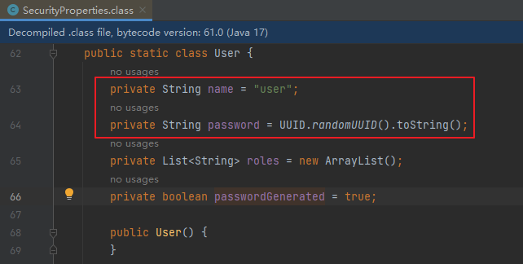

# 第一章 Spring Security快速入門

**官方文件：**

https://docs.spring.io/spring-security/reference/index.html


**功能：**

- 身份認證（authentication）
- 授權（authorization）
- 防禦常見攻擊（protection against common attacks）


**身份認證：**

- 身分認證是驗證`誰正在存取系統資源`，判斷使用者是否為合法使用者。認證使用者的常見方式是要求使用者輸入使用者名稱和密碼。


**授權：**

- 使用者進行身分認證後，系統會控制`誰能存取哪些資源`，這個過程叫做授權。使用者無法存取沒有權限的資源。


**防禦常見攻擊：**

- CSRF
- HTTP Headers
- HTTP Requests


## 1、身分認證（authentication）

**官方程式碼範例：**[GitHub - spring-projects/spring-security-samples](https://github.com/spring-projects/spring-security-samples/tree/main)

### 1.1、創建Spring Boot項目

專案名：security-demo

JDK：17

SpringBoot：3.2.0（依賴了Spring Security 6.2.0）

Dependencies：Spring Web、Spring Security、Thymeleaf


### 1.2、建立IndexController

```java

@Controller
public class IndexController {

 @GetMapping("/")
 public String index() {
 return "index";
 }
}
```


### 1.3、創建index.html

在路徑resources/templates中建立index.html

```html
<html xmlns:th="https://www.thymeleaf.org">
<head>
 <title>Hello Security!</title>
</head>
<body>
<h1>Hello Security</h1>
<!--透過使用@{/logout}，Thymeleaf將自動處理產生正確的URL，以適應目前的上下文路徑。
這樣，無論應用程式部署在哪個上下文路徑下，產生的URL都能正確地指向註銷功能。 -->
<a th:href="@{/logout}">Log Out</a>
</body>
</html>
```


### 1.4、啟動專案測試Controller

瀏覽器中造訪：http://localhost:8080/

**瀏覽器自動跳到登入頁面：**http://localhost:8080/login


輸入使用者名稱：user

輸入密碼：在控制台的啟動日誌中尋找初始的預設密碼


點擊"Sign in"進行登錄，瀏覽器就跳到了index頁面


### 1.5、注意事項

#### 1.5.1、@{/logout}的作用

透過使用@{/logout}，Thymeleaf將自動處理產生正確的URL，以適應目前的上下文路徑。這樣，無論應用程式部署在哪個上下文路徑下，產生的URL都能正確地指向註銷功能。

例如：如果我們在設定檔中新增如下內容

```yaml
server.servlet.context-path=/demo
```

那麼@{/logout}可以自動處理url為正確的相對路徑

但是如果是普通的/logout，路徑就會不正確


### 1.6、Spring Security預設做了什麼

- 保護應用程式URL，要求對應用程式的任何互動進行身份驗證。
- 程式啟動時產生一個預設使用者「user」。
- 產生一個預設的隨機密碼，並將此密碼記錄在控制台上。
- 產生預設的登入表單和登出頁面。
- 提供基於表單的登入和登出流程。
- 對於Web請求，重定向到登入頁面；
- 對於服務請求，返回401未經授權。
- 處理跨站請求偽造（CSRF）攻擊。
- 處理會話劫持攻擊。
- 寫入Strict-Transport-Security以確保HTTPS。
- 寫入X-Content-Type-Options以處理嗅探攻擊。
- 寫入Cache Control頭來保護經過驗證的資源。
- 寫入X-Frame-Options以處理點擊劫持攻擊。


## 2、Spring Security 的底層原理

**官方文件：**[Spring Security的底層原理](https://docs.spring.io/spring-security/reference/servlet/architecture.html)

Spring Security之所以預設幫我們做了那麼多事情，它的底層原理是傳統的`Servlet過濾器`


### 2.1、Filter

下圖展示了處理一個Http請求時，過濾器和Servlet的工作流程：


因此我們可以在過濾器中對請求進行修改或增強。


### 2.2、DelegatingFilterProxy

- DelegatingFilterProxy 是 Spring Security 提供的 Filter 實現，可在 Servlet 容器和 Spring 容器之間建立橋樑。
- 可以將傳統的註冊在Spring Bean管理的Filter加載到Servlet的生命週期當中
- 透過使用 DelegatingFilterProxy，這樣就可以將Servlet容器中的 Filter 執行個體放在 Spring 容器中管理。


### 2.3、FilterChainProxy

複雜的業務中不可能只有一個過濾器。因此FilterChainProxy是Spring Security提供的一個特殊的Filter，它允許透過SecurityFilterChain將過濾器的工作委託給多個Bean Filter實例。


### 2.4、SecurityFilterChain

SecurityFilterChain 被 FilterChainProxy 使用，負責尋找目前的要求需要執行的Security Filter清單。


### 2.5、Multiple SecurityFilterChain

可以有多個SecurityFilterChain的配置，FilterChainProxy決定使用哪個SecurityFilterChain。如果要求的URL是/api/messages/，它首先符合SecurityFilterChain0的模式/api/\*\*，因此只呼叫SecurityFilterChain 0。假設沒有其他SecurityFilterChain實例匹配，那麼將會呼叫SecurityFilterChain n。


## 3、程式的啟動與運行

### 3.1、DefaultSecurityFilterChain

SecurityFilterChain介面的實現，載入了預設的16個Filter


### 3.2、SecurityProperties

預設情況下Spring Security將初始的使用者名稱和密碼存在了SecurityProperties類別中。這個類別中有一個靜態內部類別User，配置了預設的使用者名稱（name = "user"）和密碼（password = uuid）




我們也可以將使用者名稱、密碼配置在SpringBoot的設定檔中：在application.properties中設定自訂使用者名稱和密碼

```properties
spring.security.user.name=user
spring.security.user.password=123
```

# 第二章 Spring Security自訂配置


## 1、基於記憶體的使用者認證

### 1.1、建立自訂配置

在實際開發的過程中，我們需要應用程式更加靈活，可以在SpringSecurity中建立自訂設定檔

**官方文件：**[Java自訂設定](https://docs.spring.io/spring-security/reference/servlet/configuration/java.html)

**UserDetailsS​​ervice**用來管理使用者訊息，**InMemoryUserDetailsManager**是UserDetailsS​​ervice的實現，用來管理基於記憶體的使用者資訊。


建立一個WebSecurityConfig檔：

定義一個@Bean，類型是UserDetailsS​​ervice，實作是InMemoryUserDetailsManager

```java
package com.frank.SpringSecurity.config;

@Configuration
@EnableWebSecurity//Spring專案總是需要添加此註解，SpringBoot專案中不需要
public class WebSecurityConfig {

	@Bean
	public UserDetailsS​​ervice userDetailsS​​ervice() {
		InMemoryUserDetailsManager manager = new InMemoryUserDetailsManager();
		manager.createUser( // 此行設定斷點可以查看已建立的user對象
				User.withDefaultPasswordEncoder().username("frank") // 自訂使用者名稱
						.password("password1") // 自訂密碼
						.roles("USER") // 自訂角色
						.build());
		manager.createUser( // 此行設定斷點可以查看已建立的user對象
				User.withDefaultPasswordEncoder().username("frank1") // 自訂使用者名稱
						.password("password") // 自訂密碼
						.roles("USER") // 自訂角色
						.build());
		manager.createUser( // 此行設定斷點可以查看已建立的user對象
				User.withDefaultPasswordEncoder().username("frank2") // 自訂使用者名稱
						.password("password2") // 自訂密碼
						.roles("USER") // 自訂角色
						.build());
		return manager;
	}
}
```

- 可以設定多組

**測試：**使用使用者名稱frank，密碼password登入
**測試：**使用使用者名稱frank1，密碼password1登入
**測試：**使用使用者名稱frank2，密碼password2登入


### 1.2、基於記憶體的使用者認證流程

- 程式啟動時：
 - 建立`InMemoryUserDetailsManager`對象
 - 建立`User`對象，封裝使用者名稱密碼
 - 使用InMemoryUserDetailsManager`將User存入記憶體`
- 校驗用戶時：
 - SpringSecurity自動使用`InMemoryUserDetailsManager`的`loadUserByUsername`方法從`記憶體中`取得User對象
 - 在`UsernamePasswordAuthenticationFilter`過濾器中的`attemptAuthentication`方法中將使用者輸入的使用者名稱密碼和從記憶體中取得的使用者資訊進行比較，進行使用者認證


## 2、基於資料庫的資料來源

### 2.1、SQL

建立三個資料庫表並插入測試數據

```sql
-- 建立資料庫
CREATE DATABASE `security-demo`;
USE `security-demo`;

-- 建立使用者表
CREATE TABLE `user`(
`id` INT NOT NULL AUTO_INCREMENT PRIMARY KEY,
`username` VARCHAR(50) DEFAULT NULL ,
`password` VARCHAR(500) DEFAULT NULL,
`enabled` BOOLEAN NOT NULL
);
-- 唯一索引
CREATE UNIQUE INDEX `user_username_uindex` ON `user`(`username`);

-- 插入使用者資料(密碼是 "abc" )
INSERT INTO `user` (`username`, `password`, `enabled`) VALUES
('admin', '{bcrypt}$2a$10$GRLdNijSQMUvl/au9ofL.eDwmoohzzS7.rmNSJZ.0FxO/BTk76klW', TRUE),
('Helen', '{bcrypt}$2a$10$GRLdNijSQMUvl/au9ofL.eDwmoohzzS7.rmNSJZ.0FxO/BTk76klW', TRUE),
('Tom', '{bcrypt}$2a$10$GRLdNijSQMUvl/au9ofL.eDwmoohzzS7.rmNSJZ.0FxO/BTk76klW', TRUE);
```


### 2.2、引入依賴

```xml
<dependency>
 <groupId>mysql</groupId>
 <artifactId>mysql-connector-java</artifactId>
 <version>8.0.30</version>
</dependency>

<dependency>
 <groupId>com.baomidou</groupId>
 <artifactId>mybatis-plus-boot-starter</artifactId>
 <version>3.5.5</version>
 <exclusions>
 <exclusion>
 <groupId>org.mybatis</groupId>
 <artifactId>mybatis-spring</artifactId>
 </exclusion>
 </exclusions>
</dependency>

<dependency>
 <groupId>org.mybatis</groupId>
 <artifactId>mybatis-spring</artifactId>
 <version>3.0.3</version>
</dependency>

<dependency>
 <groupId>org.projectlombok</groupId>
 <artifactId>lombok</artifactId>
</dependency>
```


### 2.3、設定資料來源

```properties
#MySQL資料來源
spring.datasource.driver-class-name=com.mysql.cj.jdbc.Driver
spring.datasource.url=jdbc:mysql://localhost:3306/security-demo
spring.datasource.username=root
spring.datasource.password=123456
#SQL日誌
mybatis-plus.configuration.log-impl=org.apache.ibatis.logging.stdout.StdOutImpl
```


### 2.4、實體類

```java
package com.frank.SpringSecurity.entity;

import com.baomidou.mybatisplus.annotation.IdType;
import com.baomidou.mybatisplus.annotation.TableId;
import lombok.Data;

@Data
public class User {

 @TableId(value = "id", type = IdType.AUTO)//主鍵自增
 private Integer id;

 private String username;

 private String password;

 private Boolean enabled;


}

```


### 2.5、Mapper

介面

```java
package com.frank.SpringSecurity.mapper;

@Mapper
public interface UserMapper extends BaseMapper<User> {
}
```


xml

resources/mapper/UserMapper.xml

```xml
<?xml version="1.0" encoding="UTF-8"?>
<!DOCTYPE mapper PUBLIC "-//mybatis.org//DTD Mapper 3.0//EN" "http://mybatis.org/dtd/mybatis-3-mapper.dtd">
<mapper namespace="com.frank.SpringSecurity.mapper.UserMapper">

</mapper>
```


### 2.6、Service

介面

```java
package com.frank.SpringSecurity.service;

import com.baomidou.mybatisplus.extension.service.IService;
import com.frank.SpringSecurity.entity.User;

public interface UserService extends IService<User> {

}

```

實現

```java
package com.frank.SpringSecurity.service.impl;

@Service
public class UserServiceImpl extends ServiceImpl<UserMapper, User> implements UserService {
}
```


### 2.7、Controller

```java
package com.frank.SpringSecurity.controller;

@RestController
@RequestMapping("/user")
public class UserController {

 @Resource
 public UserService userService;

 @GetMapping("/list")
 public List<User> getList(){
 return userService.list();
 }
}
```


**測試：**[localhost:8080/demo/user/list](http://localhost:8080/demo/user/list)


## 3、基於資料庫的使用者認證

### 3.1、基於資料庫的使用者認證流程

- 程式啟動時：
  - 建立`DBUserDetailsManager`類，實作介面 UserDetailsManager, UserDetailsPasswordService
  - 在應用程式中初始化這個類別的對象
- 校驗用戶時：
  - SpringSecurity自動使用`DBUserDetailsManager`的`loadUserByUsername`方法從`資料庫中`取得User對象
  - 在`UsernamePasswordAuthenticationFilter`過濾器中的`attemptAuthentication`方法中將使用者輸入的使用者名稱密碼和從資料庫中取得的使用者資訊進行比較，進行使用者認證


### 3.2、定義DBUserDetailsManager

- 主要實作loadUserByUsername方法，用於登入驗證

```java
package com.frank.SpringSecurity.config;

public class DBUserDetailsManager implements UserDetailsManager, UserDetailsPasswordService {

 @Resource
 private UserMapper userMapper;

 @Override
 public UserDetails loadUserByUsername(String username) throws UsernameNotFoundException {

 QueryWrapper<User> queryWrapper = new QueryWrapper<>();
 queryWrapper.eq("username", 用戶name);
 User user = userMapper.selectOne(queryWrapper);
 if (user == null) {
 throw new UsernameNotFoundException(username);
 } else {
 Collection<GrantedAuthority> authorities = new ArrayList<>();
 return new org.springframework.security.core.userdetails.User(
 user.getUsername(),
 user.getPassword(),
 user.getEnabled(),
 true, //使用者帳號是否過期
 true, //使用者憑證是否過期
 true, //使用者是否未被鎖定
 authorities); //權限列表
 }
 }

 @Override
 public UserDetails updatePassword(UserDetails user, String newPassword) {
 return null;
 }

 @Override
 public void createUser(UserDetails user) {

 }

 @Override
 public void updateUser(UserDetails user) {

 }

 @Override
 public void deleteUser(String username) {

 }

 @Override
 public void changePassword(String oldPassword, String newPassword) {

 }

 @Override
 public boolean userExists(String username) {
 return false;
 }
}

```

### 3.3、初始化UserDetailsS​​ervice

修改WebSecurityConfig中的userDetailsS​​ervice方法如下

```java
@Bean
public UserDetailsS​​ervice userDetailsS​​ervice() {
 DBUserDetailsManager manager = new DBUserDetailsManager();
 return manager;
}
```

**或直接在DBUserDetailsManager類別上新增@Component註解**


**測試：**使用資料庫中配置的使用者名稱和密碼進行登入


## 4、SpringSecurity的預設配置

在WebSecurityConfig中新增如下配置

```java
	
	@Bean
	public SecurityFilterChain securityFilterChain(HttpSecurity http) throws Exception {
		//authorizeRequests()：開啟授權保護
		 //anyRequest()：對所有請求開啟授權保護
		 //authenticated()：已認證請求會自動被授權
		http
			.authorizeHttpRequests((authorize) -> authorize
				.anyRequest().authenticated()
			)
			.httpBasic(Customizer.withDefaults())//表單授權方式
			.formLogin(Customizer.withDefaults());//基本授權方式(使用瀏覽器的輸入框)

		return http.build();
	}
```


## 5、新增使用者功能

### 5.1、Controller

UserController中新增方法

```java
@PostMapping("/add")
public void add(@RequestBody User user){
 userService.saveUserDetails(user);
}
```


### 5.2、Service

UserService介面中新增方法

```java
void saveUserDetails(User user);
```

UserServiceImpl實作中新增方法

```java
@Resource
private DBUserDetailsManager dbUserDetailsManager;

@Override
public void saveUserDetails(User user) {

 UserDetails userDetails = org.springframework.security.core.userdetails.User
 .withDefaultPasswordEncoder()
 .username(user.getUsername()) //自訂使用者名稱
 .password(user.getPassword()) //自訂密碼
 .build();
 dbUserDetailsManager.createUser(userDetails);

}
```


### 5.3、修改配置

DBUserDetailsManager中新增方法

```java
@Override
public void createUser(UserDetails userDetails) {

 User user = new User();
 user.setUsername(userDetails.getUsername());
 user.setPassword(userDetails.getPassword());
 user.setEnabled(true);
 userMapper.insert(user);
}
```


### 5.4、使用Swagger測試

pom中新增配置用於測試

```xml
<!--swagger測試-->
<dependency>
 <groupId>com.github.xiaoymin</groupId>
 <artifactId>knife4j-openapi3-jakarta-spring-boot-starter</artifactId>
 <version>4.1.0</version>
</dependency>
```


**Swagger測試位址：**http://localhost:8080/demo/doc.html


### 5.5、關閉csrf攻擊防禦

預設情況下SpringSecurity開啟了csrf攻擊防禦的功能，這要求請求參數中必須有一個隱藏的**_csrf**字段，如下：


在filterChain方法中加入以下程式碼，關閉csrf攻擊防禦

```java
//關閉csrf攻擊防禦
http.csrf((csrf) -> {
 csrf.disable();
});
```

## 6、密碼加密演算法

**參考文件：**[Password Storage :: Spring Security](https://docs.spring.io/spring-security/reference/features/authentication/password-storage.html)


### 6.1、密碼加密方式

**明文密碼：**

最初，密碼以明文形式儲存在資料庫中。但是惡意使用者可能會透過SQL注入等手段取得到明文密碼，或是程式設計師將資料庫資料外洩的情況也可能發生。


**Hash演算法：**

Spring Security的`PasswordEncoder`介面用於對密碼進行`單向轉換`，從而將密碼安全地儲存。對密碼單向轉換需要用到`雜湊演算法`，例如MD5、SHA-256、SHA-512等，雜湊演算法是單向的，`只能加密，不能解密`。

因此，`資料庫中儲存的是單向轉換後的密碼`，Spring Security在進行使用者驗證時需要將使用者輸入的密碼進行單向轉換，然後與資料庫的密碼進行比較。

因此，如果發生資料洩露，只有密碼的單向雜湊會被暴露。由於哈希是單向的，並且在給定哈希的情況下只能通過`暴力破解的方式猜測密碼`。


**彩虹表：**

惡意使用者建立稱為`彩虹表`的查找表。

```
彩虹表就是一個龐大的、針對各種可能的字母組合預先產生的雜湊值集合，有了它可以快速破解各類密碼。越是複雜的密碼，所需的彩虹表就越大，主流的彩虹表都是100G以上，目前主要的演算法有LM, NTLM, MD5, SHA1, MYSQLSHA1, HALFLMCHALL, NTLMCHALL, ORACLE-SYSTEM, MD5-HALF。
```


**加上鹽密碼：**

為了減輕彩虹表的效果，開發人員開始使用加鹽密碼。不再只使用密碼作為雜湊函數的輸入，而是為每個使用者的密碼產生隨機位元組（稱為鹽）。鹽和用戶的密碼將一起經過雜湊函數運算，產生一個唯一的雜湊。鹽將以明文形式與使用者的密碼一起儲存。然後，當使用者嘗試進行身份驗證時，鹽和使用者輸入的密碼一起經過雜湊函數運算，再與儲存的密碼進行比較。唯一的鹽意味著彩虹表不再有效，因為對於每個鹽和密碼的組合，雜湊都是不同的。


**自適應單向函數：**

隨著硬體的不斷發展，加鹽哈希也不再安全。原因是，計算機可以每秒執行數十億次哈希計算。這意味著我們可以輕鬆地破解每個密碼。

現在，開發人員開始使用自適應單向函數來儲存密碼。使用自適應單向函數驗證密碼時，`故意佔用資源（故意使用大量的CPU、記憶體或其他資源）`。自適應單向函數允許配置一個`“工作因子”`，隨著硬體的改進而增加。我們建議將「工作因子」調整到系統中驗證密碼需要約一秒鐘的時間。這種權衡是為了`讓攻擊者難以破解密碼`。

自適應單向函數包括`bcrypt、PBKDF2、scrypt和argon2`。


### 6.2、PasswordEncoder

**BCryptPasswordEncoder**

使用廣泛支援的bcrypt演算法來對密碼進行雜湊。為了增加對密碼破解的抵抗力，bcrypt故意設計得較慢。和其他自適應單向函數一樣，應該調整其參數，使其在您的系統上驗證一個密碼大約需要1秒鐘的時間。 BCryptPasswordEncoder的預設實現使用強度10。建議您在自己的系統上調整和測試強度參數，以便驗證密碼時大約需要1秒鐘的時間。


**Argon2PasswordEncoder**

使用Argon2演算法對密碼進行雜湊處理。 Argon2是密碼雜湊比賽的贏家。為了防止在自訂硬體上進行密碼破解，Argon2是一種故意緩慢的演算法，需要大量記憶體。與其他自適應單向函數一樣，它應該在您的系統上調整為大約1秒鐘以驗證一個密碼。目前的Argon2PasswordEncoder實作需要使用BouncyCastle函式庫。


**Pbkdf2PasswordEncoder**

使用PBKDF2演算法對密碼進行雜湊處理。為了防止密碼破解，PBKDF2是一種故意緩慢的演算法。與其他自適應單向函數一樣，它應該在您的系統上調整為大約1秒鐘以驗證一個密碼。當需要FIPS認證時，這種演算法是一個很好的選擇。


**SCryptPasswordEncoder**

使用scrypt演算法對密碼進行雜湊處理。為了防止在自訂硬體上進行密碼破解，scrypt是一種故意緩慢的演算法，需要大量記憶體。與其他自適應單向函數一樣，它應該在您的系統上調整為大約1秒鐘以驗證一個密碼。


### 6.3、密码加密测试

在测试类中编写一个测试方法

```java
@Test
void testPassword() {

    // 工作因子，默认值是10，最小值是4，最大值是31，值越大运算速度越慢
    PasswordEncoder encoder = new BCryptPasswordEncoder(4);
    //明文："password"
    //密文：result，即使明文密码相同，每次生成的密文也不一致
    String result = encoder.encode("password");
    System.out.println(result);

    //密码校验
    Assert.isTrue(encoder.matches("password", result), "密码不一致");
}
```


### 6.4、DelegatingPasswordEncoder

- 表中存储的密码形式：`{bcrypt}`$2a$10$GRLdNijSQMUvl/au9ofL.eDwmoohzzS7.rmNSJZ.0FxO/BTk76klW
- 通过如下源码可以知道：可以通过`{bcrypt}`前缀动态获取和密码的形式类型一致的PasswordEncoder对象
- 目的：方便随时做密码策略的升级，兼容数据库中的老版本密码策略生成的密码


## 7、自訂登入頁面

### 7.1、建立登入Controller

```java
package com.frank.SpringSecurity.controller;

@Controller
public class LoginController {

 @GetMapping("/login")
 public String login() {
 return "login";
 }
}
```


### 7.2、建立登入頁面

resources/templates/login.html

```html
<!DOCTYPE html>
<html xmlns:th="https://www.thymeleaf.org">
<head>
 <title>登入</title>
</head>
<body>
<h1>登入</h1>
<div th:if="${param.error}">
 錯誤的使用者名稱和密碼.</div>

<!--method必須為"post"-->
<!--th:action="@{/login}" ，
使用動態參數，表單中會自動產生_csrf隱藏字段，用於防止csrf攻擊
login: 和登入頁面保持一致即可，SpringSecurity自動進行登入認證-->
<form th:action="@{/login}" method="post">
 <div>
 <!--name必須為"username"-->
 <input type="text" name="username" placeholder="使用者名稱"/>
 </div>
 <div>
 <!--name必須為"password"-->
 <input type="password" name="password" placeholder="密碼"/>
 </div>
 <input type="submit" value="登入" />
</form>
</body>
</html>
```


### 7.3、設定SecurityFilterChain

SecurityConfiguration：

```java
.formLogin( form -> {
 form
 .loginPage("/login").permitAll() //登入頁面無需授權即可訪問
 .usernameParameter("username") //自訂表單使用者名稱參數，預設是username
 .passwordParameter("password") //自訂表單密碼參數，預設是password
 .failureUrl("/login?error") //登入失敗的回傳位址
 ;
}); //使用表單授權方式
```


# 第三章 前後端分離

## 1、使用者認證流程

- 登入成功後呼叫：AuthenticationSuccessHandler
- 登入失敗後呼叫：AuthenticationFailureHandler


## 2、引進fastjson

```xml
<dependency>
 <groupId>com.alibaba.fastjson2</groupId>
 <artifactId>fastjson2</artifactId>
 <version>2.0.37</version>
</dependency>
```


## 3、認證成功的回應

### 3.1、成功結果處理

```java
package com.frank.SpringSecurity.config;

public class MyAuthenticationSuccessHandler implements AuthenticationSuccessHandler {
 @Override
 public void onAuthenticationSuccess(HttpServletRequest request, HttpServletResponse response, Authentication authentication) throws IOException, ServletException {

 //取得使用者識別資訊
 Object principal = authentication.getPrincipal();

 //建立結果對象
 HashMap result = new HashMap();
 result.put("code", 0);
 result.put("message", "登入成功");
 result.put("data", principal);

 //轉換成json字串
 String json = JSON.toJSONString(result);

 //回傳回應
 response.setContentType("application/json;charset=UTF-8");
 response.getWriter().println(json);
 }
}
```

### 3.2、SecurityFilterChain配置

```java
form.successHandler(new MyAuthenticationSuccessHandler()) //認證成功時的處理
```


## 4、認證失敗回應

### 4.1、失敗結果處理

```java
package com.frank.SpringSecurity.config;

public class MyAuthenticationFailureHandler implements AuthenticationFailureHandler {

 @Override
 public void onAuthenticationFailure(HttpServletRequest request, HttpServletResponse response, AuthenticationException exception) throws IOException, ServletException {

 //取得錯誤訊息
 String localizedMessage = exception.getLocalizedMessage();

 //建立結果對象
 HashMap result = new HashMap();
 result.put("code", -1);
 result.put("message", localizedMessage);

 //轉換成json字串
 String json = JSON.toJSONString(result);

 //回傳回應
 response.setContentType("application/json;charset=UTF-8");
 response.getWriter().println(json);
 }
}
```

### 4.2SecurityFilterChain配置

```java
form.failureHandler(new MyAuthenticationFailureHandler()) //認證失敗時的處理
```


## 5、註銷回應

### 5.1、註銷結果處理

```java
package com.frank.SpringSecurity.config;

public class MyLogoutSuccessHandler implements LogoutSuccessHandler {

 @Override
 public void onLogoutSuccess(HttpServletRequest request, HttpServletResponse response, Authentication authentication) throws IOException, ServletException {

 //建立結果對象
 HashMap result = new HashMap();
 result.put("code", 0);
 result.put("message", "註銷成功");

 //轉換成json字串
 String json = JSON.toJSONString(result);

 //回傳回應
 response.setContentType("application/json;charset=UTF-8");
 response.getWriter().println(json);
 }
}
```


### 5.2、SecurityFilterChain配置

```java
http.logout(logout -> {
 logout.logoutSuccessHandler(new MyLogoutSuccessHandler()); //登出成功時的處理
});
```

## 6、請求未認證的接口

### 6.1、實作AuthenticationEntryPoint接口

[Servlet Authentication Architecture :: Spring Security](https://docs.spring.io/spring-security/reference/servlet/authentication/architecture.html)

當存取一個需要認證之後才能存取的介面的時候，Spring Security會使用`AuthenticationEntryPoint`將使用者要求跳到登入頁面，要求使用者提供登入憑證。

這裡我們也希望系統`回傳json結果`，因此我們定義類別`實作AuthenticationEntryPoint介面`

```java
package com.frank.SpringSecurity.config;

public class MyAuthenticationEntryPoint implements AuthenticationEntryPoint {
 @Override
 public void commence(HttpServletRequest request, HttpServletResponse response, AuthenticationException authException) throws IOException, ServletException {

 //取得錯誤訊息
 //String localizedMessage = authException.getLocalizedMessage();

 //建立結果對象
 HashMap result = new HashMap();
 result.put("code", -1);
 result.put("message", "需要登入");

 //轉換成json字串
 String json = JSON.toJSONString(result);

 //回傳回應
 response.setContentType("application/json;charset=UTF-8");
 response.getWriter().println(json);
 }
}
```


### 6.2、SecurityFilterChain配置

```java
//錯誤處理
http.exceptionHandling(exception -> {
 exception.authenticationEntryPoint(new MyAuthenticationEntryPoint());//請求未認證的接口
});
```

## 7、跨域

跨域全名為跨域資源共享(Cross-Origin Resources Sharing,CORS)，它是瀏覽器的保護機制，只允許網頁請求統一域名下的服務，同一域名指=>協議、域名、端口號都要保持一致，如果有一項不同，那麼就是跨域請求。在前後端分離的專案中，需要解決跨域的問題。

### 跨域參數內容

- 首先要把域名告訴瀏覽器那些可以使用不要阻擋
  - Access-Control-Allow-Origin
- Access-Control-Allow-Headers:要帶自訂義Header時使用
- 要使用cookie時
  - Access-Control-Allow-Origin 不能是 *
  - Access-Control-Allow-Credentials: true
- 前端需要存取 header
  - 後端必須提供 Access-Control-Expose-Headers，跟瀏覽器說前端可以拿到哪些 header
- 而前端如果要使用 HEAD、GET 跟 POST 之外的 method
  - 後端要加上 Access-Control-Allow-Methods
- 快取的部分，則是用 Access-Control-Max-Age

- 在SpringSecurity中解決跨域很簡單，在設定檔中加入如下配置即可

```java
//跨域
http.cors(withDefaults());
```

- 或者複寫 CorsConfigurationSource Bean

```
	//配置跨域請求
	@Bean
	CorsConfigurationSource corsConfigurationSource() {
		CorsConfiguration configuration = new CorsConfiguration();
		configuration.setAllowedOrigins(Arrays.asList("https://example.com"));
		configuration.setAllowedMethods(Arrays.asList("GET","POST"));
		configuration.setAllowCredentials(true);
		configuration.setAllowedHeaders(Arrays.asList("PUT"));
		configuration.setExposedHeaders(Arrays.asList("custom"));
		UrlBasedCorsConfigurationSource source = new UrlBasedCorsConfigurationSource();
		source.registerCorsConfiguration("/**", configuration);
		return source;
	}
```

# 第四章 身分認證

## 1、使用者認證訊息

### 1.1、基本概念


在Spring Security框架中，SecurityContextHolder、SecurityContext、Authentication、Principal和Credential是一些與身分驗證和授權相關的重要概念。它們之間的關係如下：


1. SecurityContextHolder：SecurityContextHolder 是 Spring Security 儲存已認證使用者詳細資料的地方。
2. SecurityContext：SecurityContext 是從 SecurityContextHolder 取得的內容，包含目前已認證使用者的 Authentication 資訊。
3. Authentication：Authentication 表示使用者的身分認證資訊。它包含了用戶的Principal、Credential和Authority資訊。
4. Principal：表示使用者的身份標識。它通常是一個表示使用者的實體對象，例如使用者名稱。 Principal可以透過Authentication物件的getPrincipal()方法來取得。
5. Credentials：表示使用者的憑證訊息，例如密碼、證書或其他認證憑證。 Credential可以透過Authentication物件的getCredentials()方法來取得。
6. GrantedAuthority：表示使用者被授予的權限

總結起來，SecurityContextHolder用於管理當前線程的安全上下文，存儲已認證用戶的詳細信息，其中包含了SecurityContext對象，該對象包含了Authentication對象，後者表示用戶的身份驗證信息，包括Principal（用戶的身份標識）和Credential（使用者的憑證資訊）。

### 1.2、在Controller中取得使用者資訊

IndexController：

```java
package com.frank.SpringSecurity.controller;

@RestController
public class IndexController {

 @GetMapping("/")
 public Map index(){

 System.out.println("index controller");

 SecurityContext context = SecurityContextHolder.getContext();//儲存認證物件的上下文
 Authentication authentication = context.getAuthentication();//認證對象
 String username = authentication.getName();//使用者名稱
 Object principal =authentication.getPrincipal();//身份
 Object credentials = authentication.getCredentials();//憑證(脫敏)
 Collection<? extends GrantedAuthority> authorities = authentication.getAuthorities();//權限

 System.out.println(username);
 System.out.println(principal);
 System.out.println(credentials);
 System.out.println(authorities);

 //建立結果對象
 HashMap result = new HashMap();
 result.put("code", 0);
 result.put("data", username);

 return result;
 }
}
```


## 2、會話同時處理

後登入的帳號會使先登入的帳號失效

### 2.1、實作處理器介面

實作介面SessionInformationExpiredStrategy

```java
package com.frank.SpringSecurity.config;

public class MySessionInformationExpiredStrategy implements SessionInformationExpiredStrategy {
 @Override
 public void onExpiredSessionDetected(SessionInformationExpiredEvent event) throws IOException, ServletException {

 //建立結果對象
 HashMap result = new HashMap();
 result.put("code", -1);
 result.put("message", "該帳號已從其他裝置登入");

 //轉換成json字串
 String json = JSON.toJSONString(result);

 HttpServletResponse response = event.getResponse();
 //回傳回應
 response.setContentType("application/json;charset=UTF-8");
 response.getWriter().println(json);
 }
}
```

### 2.2、SecurityFilterChain配置

```java
//會話管理
http.sessionManagement(session -> {
 session
 .maximumSessions(1)
 .expiredSessionStrategy(new MySessionInformationExpiredStrategy());
});
```


# 第五章 授權

授權管理的實作在SpringSecurity中非常靈活，可以幫助應用程式實現以下兩種常見的授權需求：

- 使用者-權限-資源：例如張三的權限是新增使用者、檢視使用者列表，李四的權限是檢視使用者列表

- 用戶-角色-權限-資源：例如 張三是角色是管理員、李四的角色是普通用戶，管理員能做所有操作，普通用戶只能查看信息


## 1、基於request的授權

### 1.1、使用者-權限-資源

**需求：**

- 具有USER_LIST權限的使用者可以存取/user/list接口
- 具有USER_ADD權限的使用者可以存取/user/add接口

#### 設定權限

SecurityFilterChain

```java
//開啟授權保護
http.authorizeRequests(
 authorize -> authorize
 //具有USER_LIST權限的使用者可以存取/user/list
 .requestMatchers("/user/list").hasAuthority("USER_LIST")
 //具有USER_ADD權限的使用者可以存取/user/add
 .requestMatchers("/user/add").hasAuthority("USER_ADD")
 //對所有請求開啟授權保護
 .anyRequest()
 //已認證的請求會被自動授權
 .authenticated()
 );
```

#### 授予權限

DBUserDetailsManager中的loadUserByUsername方法：

```java
Collection<GrantedAuthority> authorities = new ArrayList<>();
authorities.add(()->"USER_LIST");
authorities.add(()->"USER_ADD");

/*authorities.add(new GrantedAuthority() {
 @Override
 public String getAuthority() {
 return "USER_LIST";
 }
});
authorities.add(new GrantedAuthority() {
 @Override
 public String getAuthority() {
 return "USER_ADD";
 }
});*/
```

#### 請求未授權的接口

SecurityFilterChain

```java
//錯誤處理
http.exceptionHandling(exception -> {
 exception.authenticationEntryPoint(new MyAuthenticationEntryPoint());//請求未認證的接口
 exception.accessDeniedHandler((request, response, e)->{ //請求未授權的接口

 //建立結果對象
 HashMap result = new HashMap();
 result.put("code", -1);
 result.put("message", "沒有權限");

 //轉換成json字串
 String json = JSON.toJSONString(result);

 //回傳回應
 response.setContentType("application/json;charset=UTF-8");
 response.getWriter().println(json);
 });
});
```

或者

```
package com.frank.SpringSecurity.config;

import java.io.IOException;
import java.util.HashMap;

import org.springframework.security.access.AccessDeniedException;
import org.springframework.security.web.access.AccessDeniedHandler;

import com.alibaba.fastjson2.JSON;

import jakarta.servlet.ServletException;
import jakarta.servlet.http.HttpServletRequest;
import jakarta.servlet.http.HttpServletResponse;

public class CustomizeAccessDeniedHandler implements AccessDeniedHandler {

	@Override
	public void handle(HttpServletRequest request, HttpServletResponse response,
			AccessDeniedException accessDeniedException) throws IOException, ServletException {

		 //建立結果對象
		 HashMap result = new HashMap();
		 result.put("code", -1);
		 result.put("message", "沒有權限");

		 //轉換成json字串
		 String json = JSON.toJSONString(result);

		 //回傳回應
		 response.setContentType("application/json;charset=UTF-8");
		 response.getWriter().println(json);

	}

}

```


**更多的例子：**[Authorize HttpServletRequests :: Spring Security](https://docs.spring.io/spring-security/reference/servlet/authorization/authorize-http-requests.html)


### 1.2、使用者-角色-資源

**需求：**角色為ADMIN的使用者才可以存取/user/**路徑下的資源

#### 設定角色

SecurityFilterChain

```java
//開啟授權保護
http.authorizeRequests(
 authorize -> authorize
 //具有管理員角色的使用者可以存取/user/**
 .requestMatchers("/user/**").hasRole("ADMIN")
 //對所有請求開啟授權保護
 .anyRequest()
 //已認證的請求會被自動授權
 .authenticated()
);
```

#### 授予角色

DBUserDetailsManager中的loadUserByUsername方法：

```java
return org.springframework.security.core.userdetails.User
 .withUsername(user.getUsername())
 .password(user.getPassword())
 .roles("ADMIN")
 .build();
```

- 這總方式角色會是以 ROLE_ 開頭


### 1.3、使用者-角色-權限-資源

RBAC（Role-Based Access Control，基於角色的存取控制）是一種常用的資料庫設計方案，它將使用者的權限指派和管理與角色相關聯。以下是一個基本的RBAC資料庫設計方案的範例：

1. 使用者表（User table）：包含使用者的基本訊息，例如使用者名稱、密碼和其他驗證資訊。

| 列名 | 資料類型 | 描述 |
| -------- | -------- | ------------ |
| user_id | int | 使用者ID |
| username | varchar | 使用者名稱 |
| password | varchar | 密碼 |
| email | varchar | 電子郵件地址 |
| ... | ... | ... |

2. 角色表（Role table）：儲存所有可能的角色及其描述。

| 列名 | 資料類型 | 描述 |
| ----------- | -------- | -------- |
| role_id | int | 角色ID |
| role_name | varchar | 角色名稱 |
| description | varchar | 角色描述 |
| ... | ... | ... |

3. 權限表（Permission table）：定義系統中所有可能的權限。

| 列名 | 資料類型 | 描述 |
| --------------- | -------- | -------- |
| permission_id | int | 權限ID |
| permission_name | varchar | 權限名稱 |
| description | varchar | 權限描述 |
| ... | ... | ... |

4. 使用者角色關聯表（User-Role table）：將使用者與角色關聯。

| 列名 | 資料類型 | 描述 |
| ------------ | -------- | -------------- |
| user_role_id | int | 使用者角色關聯ID |
| user_id | int | 使用者ID |
| role_id | int | 角色ID |
| ... | ... | ... |

5. 角色權限關聯表（Role-Permission table）：將角色與權限關聯。

| 列名 | 資料類型 | 描述 |
| ------------------ | -------- | -------------- |
| role_permission_id | int | 角色權限關聯ID |
| role_id | int | 角色ID |
| permission_id | int | 權限ID |
| ... | ... | ... |

在這個設計方案中，使用者可以被指派一個或多個角色，而每個角色又可以有一個或多個權限。透過對使用者角色關聯和角色權限關聯表進行操作，可以實現靈活的權限管理和存取控制。

當使用者嘗試存取系統資源時，系統可以根據使用者的角色和權限決定是否允許存取。這樣的設計方案使得權限管理更加簡單和可維護，因為只需調整角色和權限的分配即可，而不需要針對每個使用者進行單獨的設定。

## 2、基於方法的授權

### 2.1、開啟方法授權

在設定檔中加入如下註解

```java
@EnableMethodSecurity
```

- 默認情況下，只加這個註解，沒加@PreAuthorize的方法都有權限可以訪問


### 2.2、授予使用者角色和權限

DBUserDetailsManager中的loadUserByUsername方法：

```java
return org.springframework.security.core.userdetails.User
 .withUsername(user.getUsername())
 .password(user.getPassword())
 .roles("ADMIN")
 .authorities("USER_ADD", "USER_UPDATE")
 .build();
```


### 2.2、常用授權註解

```java
//使用者必須有 ADMIN 角色 且 使用者名稱是 admin 才能存取此方法
@PreAuthorize("hasRole('ADMIN') and authentication.name == 'admim'")
@GetMapping("/list")
public List<User> getList(){
 return userService.list();
}

//使用者必須有 USER_ADD 權限 才能存取此方法
@PreAuthorize("hasAuthority('USER_ADD')")
@PostMapping("/add")
public void add(@RequestBody User user){
 userService.saveUserDetails(user);
}
```


**更多的例子：**[Method Security :: Spring Security](https://docs.spring.io/spring-security/reference/servlet/authorization/method-security.html)


# 第六章 OAuth2

## 1、OAuth2簡介

### 1.1、OAuth2是什麼

“Auth” 表示 “授權” Authorization

 “O” 是 Open 的簡稱，表示 “開放”

連在一起就表示 **「開放授權」**，OAuth2是一種開放授權協議。


**OAuth2最簡嚮導：**[The Simplest Guide To OAuth 2.0](https://darutk.medium.com/the-simplest-guide-to-oauth-2-0-8c71bd9a15bb)


### 1.2、OAuth2的角色

OAuth 2協定包含以下角色：

1. 資源擁有者（Resource Owner）：也就是用戶，資源的擁有人，想要透過客戶應用程式存取資源伺服器上的資源。
2. 客戶應用（Client）：通常是一個Web或無線應用，它需要存取使用者的受保護資源。
3. 資源伺服器（Resource Server）：儲存受保護資源的伺服器或定義了可以存取到資源的API，接收並驗證用戶端的存取令牌，以決定是否授權存取資源。
4. 授權伺服器（Authorization Server）：負責驗證資源擁有者的身分並向客戶端頒發存取權杖。


### 1.3、OAuth2的使用場景

#### 開放系統間授權

##### 社群登入

在傳統的身份驗證中，使用者需要提供使用者名稱和密碼，並且還有很多網站登入時，允許使用第三方網站的身份，這稱為"第三方登入"。所謂第三方登錄，實質就是 OAuth 授權。使用者想要登入 A 網站，A 網站讓使用者提供第三方網站的數據，證明自己的身分。取得第三方網站的身份數據，就需要 OAuth 授權。


##### 開放API

例如雲端沖印服務的實現


#### 現代微服務安全

##### 單一區塊應用安全


##### 微服務安全


#### 企業內部應用程式認證授權

- SSO：Single Sign On 單一登入

- IAM：Identity and Access Management 身分識別與存取管理


### 1.4、OAuth2的四種授權模式

RFC6749：

[RFC 6749 - The OAuth 2.0 Authorization Framework (ietf.org)](https://datatracker.ietf.org/doc/html/rfc6749)

阮一峰：

[OAuth 2.0 的四種方式 - 阮一峰的網誌 (ruanyifeng.com)](https://www.ruanyifeng.com/blog/2019/04/oauth-grant-types.html)


四種模式：

- 授權碼（authorization-code）
- 隱藏式（implicit）
- 密碼式（password）
- 客戶端憑證（client credentials）


#### 第一種方式：授權碼

**授權碼（authorization code），指的是第三方應用程式先申請一個授權碼，然後再用該碼取得令牌。 **

這種方式是最常用，最複雜，也是最安全的，它適用於那些有後端的 Web 應用。授權碼透過前端傳送，令牌則是儲存在後端，而且所有與資源伺服器的通訊都在後端完成。這樣的前後端分離，可以避免令牌洩漏。


- 註冊客戶應用程式：客戶應用程式如果想要存取資源伺服器需要有憑證，則需要在授權伺服器上註冊客戶應用程式。註冊後會**取得到一個ClientID和ClientSecrets**


#### 第二種方式：隱藏式

**隱藏式（implicit），也叫簡化模式，有些 Web 應用是純前端應用，沒有後端。這時就不能用上面的方式了，必須將令牌儲存在前端。 **

RFC 6749 規定了這種方式，允許直接向前端頒發令牌。這種方式沒有授權碼這個中間步驟，所以稱為隱藏式。這種方式把令牌直接傳給前端，是很不安全的。因此，只能用於一些安全要求不高的場景，且令牌的有效期限必須非常短，通常就是會話期間（session）有效，瀏覽器關掉，令牌就失效了。


```
https://a.com/callback#token=ACCESS_TOKEN
將存取權杖包含在URL錨點中的好處：錨點在HTTP請求中不會傳送到伺服器，減少了洩漏令牌的風險。
```


#### 第三種方式：密碼式

**密碼式（Resource Owner Password Credentials）：如果你高度信任某個應用，RFC 6749 也允許使用者把使用者名稱和密碼，直接告訴該應用程式。該應用程式就使用你的密碼，申請令牌。 **

這種方式需要使用者給出自己的使用者名稱/密碼，顯然風險很大，因此只適用於其他授權方式都無法採用的情況，而且必須是使用者高度信任的應用程式。


#### 第四種方式：憑證式

**憑證式（client credentials）：也叫客戶端模式，適用於沒有前端的命令列應用，即在命令列下請求令牌。 **

這種方式給出的令牌，是針對第三方應用的，而不是針對用戶的，即有可能多個用戶共享同一個令牌。


### 1.5、授權類型的選擇


## 2、Spring中的OAuth2

### 2.1、相關角色

**回顧：**OAuth 2中的角色

1. 資源所有者（Resource Owner）
2. 客戶應用（Client）
3. 資源伺服器（Resource Server）
4. 授權伺服器（Authorization Server）


### 2.2、Spring中的實現

[OAuth2 :: Spring Security](https://docs.spring.io/spring-security/reference/servlet/oauth2/index.html)

**Spring Security**

- 客戶應用程式（OAuth2 Client）：OAuth2客戶端功能中包含OAuth2 Login
- 資源伺服器（OAuth2 Resource Server）

**Spring**

- 授權伺服器（Spring Authorization Server）：它是在Spring Security之上的一個單獨的專案。


### 2.3、相關依賴

```xml
<!-- 資源伺服器 -->
<dependency>
<groupId>org.springframework.boot</groupId>
<artifactId>spring-boot-starter-oauth2-resource-server</artifactId>
</dependency>

<!-- 客戶應用程式 -->
<dependency>
<groupId>org.springframework.boot</groupId>
<artifactId>spring-boot-starter-oauth2-client</artifactId>
</dependency>

<!-- 授權伺服器 -->
<dependency>
 <groupId>org.springframework.boot</groupId>
 <artifactId>spring-boot-starter-oauth2-authorization-server</artifactId>
</dependency>
```


### 2.4、授權登入的實作思路

使用OAuth2 Login


## 3、GiuHub社群登入案例

### 3.1、創建應用

**註冊客戶應用程式：**

登入GitHub，在開發者設定中找到OAuth Apps，建立一個application，為客戶應用程式建立存取GitHub的憑證：


填寫應用程式資訊：`預設的重定向URI模板為{baseUrl}/login/oauth2/code/{registrationId}`。 registrationId是ClientRegistration的唯一識別碼。


取得應用程式id，產生應用程式金鑰：


### 3.2、建立測試項目

建立一個springboot專案oauth2-login-demo，建立時引入以下依賴


範例程式碼參考：[spring-security-samples/servlet/spring-boot/java/oauth2/login at 6.2.x · spring-projects/spring-security-samples (github.com)](https://github.com/spring-projects/spring-security-samples/tree/6.2.x/servlet/spring-boot/java/oauth2/login)


### 3.3、設定OAuth客戶端屬性

application.yml：

```properties
spring:
 security:
 oauth2:
 client:
 registration:
 github:
 client-id: 7807cc3bb1534abce9f2
 client-secret: 008dc141879134433f4db7f62b693c4a5361771b
# redirectUri: http://localhost:8200/login/oauth2/code/github
```


### 3.4、建立Controller

```java
package com.atguigu.oauthdemo.controller;

@Controller
public class IndexController {

 @GetMapping("/")
 public String index(
 Model model,
 @RegisteredOAuth2AuthorizedClient OAuth2AuthorizedClient authorizedClient,
 @AuthenticationPrincipal OAuth2User oauth2User) {
 model.addAttribute("userName", oauth2User.getName());
 model.addAttribute("clientName", authorizedClient.getClientRegistration().getClientName());
 model.addAttribute("userAttributes", oauth2User.getAttributes());
 return "index";
 }
}
```


### 3.5、建立html頁面

resources/templates/index.html

```html
<!DOCTYPE html>
<html xmlns="http://www.w3.org/1999/xhtml"
	xmlns:th="https://www.thymeleaf.org"
	xmlns:sec="https://www.thymeleaf.org/thymeleaf -extras-springsecurity5">
<head>
<title>Spring Security - OAuth 2.0 Login</title>
<meta charset="utf-8" />
</head>
<body>
	<div style="float: right" th:fragment="logout"
		sec:authorize="isAuthenticated()">
		<div style="float: left">
			<span style="font-weight: bold">User: </span><span
				sec:authentication="name"></span>
		</div>
		<div style="float: none">&nbsp;</div>
		<div style="float: right">
			<form action="#" th:action="@{/logout}" method="post">
				<input type="submit" value="Logout" />
			</form>
		</div>
	</div>
	<h1>OAuth 2.0 Login with Spring Security</h1>
	<div>
		You are successfully logged in <span style="font-weight: bold"
			th:text="${userName}"></span> via the OAuth 2.0 Client <span
			style="font-weight: bold" th:text="${clientName}"></span>
	</div>
	<div>&nbsp;</div>
	<div>
		<span style="font-weight: bold">User Attributes:</span>
		<ul>
			<li th:each="userAttribute : ${userAttributes}"><span
				style="font-weight: bold" th:text="${userAttribute.key}"></span>: <span
				th:text="${userAttribute.value}"></span></li>
		</ul>
	</div>
</body>
</html>
```


### 3.6、啟動應用程式

- 啟動程式並存取localhost:8080。瀏覽器將被重定向到預設的自動產生的登入頁面，該頁面顯示了一個用於GitHub登入的連結。
- 點擊GitHub鏈接，瀏覽器將被重定向到GitHub進行身份驗證。
- 使用GitHub帳號憑證進行驗證後，使用者會看到授權頁面，詢問使用者是否允許或拒絕客戶應用程式存取GitHub上的使用者資料。點擊允許以授權OAuth用戶端存取使用者的基本個人資料資訊。
- 此時，OAuth用戶端存取GitHub的獲取使用者資訊的介面取得基本個人資料信息，並建立一個已認證的會話。


## 4、案例分析

### 4.1、登入流程

1. **A 網站讓使用者跳到 GitHub，並攜帶參數ClientID 以及 Redirection URI。 **
2. GitHub 要求使用者登錄，然後詢問使用者"A 網站要求取得使用者資訊的權限，你是否同意？"
3. 使用者同意，GitHub 就會重新導向回 A 網站，同時發回一個授權碼。
4. **A 網站使用授權碼，向 GitHub 請求令牌。 **
5. GitHub 返回令牌.
6. **A 網站使用令牌，向 GitHub 請求使用者資料。 **
7. GitHub返回用戶數據
8. **A 網站使用 GitHub使用者資料登入**


### 4.2、CommonOAuth2Provider

CommonOAuth2Provider是一個預先定義的通用OAuth2Provider，為一些知名資源服務API提供者（如Google、GitHub、Facebook）預先定義了一組預設的屬性。

例如，**授權URI、令牌URI和使用者資訊URI**通常不經常變更。因此，提供預設值以減少所需的配置。

因此，當我們設定GitHub客戶端時，只需要提供client-id和client-secret屬性。

```java
GITHUB {
 public ClientRegistration.Builder getBuilder(String registrationId) {
 ClientRegistration.Builder builder = this.getBuilder(
 registrationId,
 ClientAuthenticationMethod.CLIENT_SECRET_BASIC,

 //授權回呼位址(GitHub向客戶應用程式傳送回呼請求，並攜帶授權碼)
"{baseUrl}/{action}/oauth2/code/{registrationId}");
 builder.scope(new String[]{"read:user"});
 //授權頁面
 builder.authorizationUri("https://github.com/login/oauth/authorize");
 //客戶應用使用授權碼，向 GitHub 請求令牌
 builder.tokenUri("https://github.com/login/oauth/access_token");
 //客戶應用程式使用令牌向GitHub請求用戶數據
 builder.userInfoUri("https://api.github.com/user");
 //username屬性顯示GitHub中取得的哪個屬性的信息
 builder.userNameAttributeName("id");
 //登入頁面超連結的文本
 builder.clientName("GitHub");
 return builder;
 }
},
```

