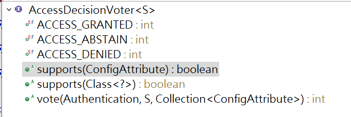
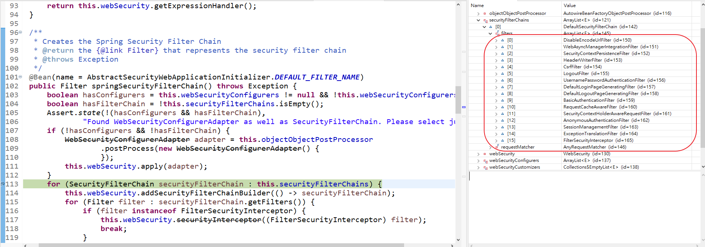
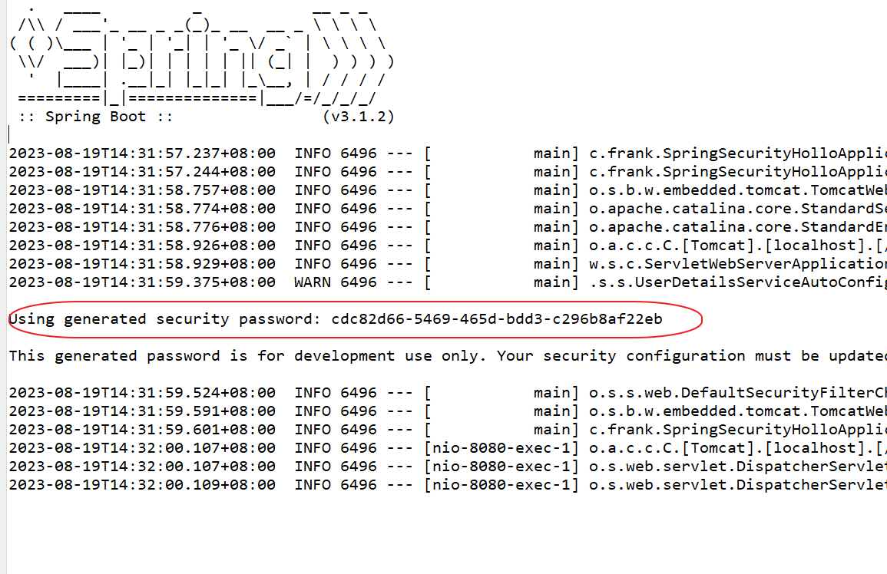
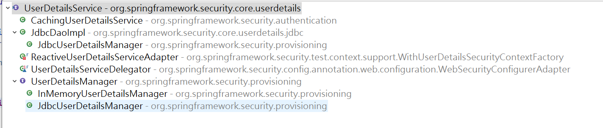

# 簡介概要

* 基於Spring的權限管理框架，權限管理主要由身分認證(Authenticaton)和權限管理(Authorization)兩部分組成。
* 身分認證負責對用戶進行身分鑑定，例如:驗證用戶明及密碼的方式，鑑定的結果就是通過及不同過兩種。
* 權限管理負責對用戶在系統的的權限提供支持，例如:使用者A允許訪問某個頁面或者文件，使用者B不允許使用某個功能
  
# 原理概要


* AuthenticationManager組要用來做認證的，認證成功後會將訊息保存到Authentication，而Authentication會保存到當前執行續(ThreadLocal)的SecurityContextHolder中，實際上當請求處裡完SecurityContextHolder會清空，下次請求來再從session拿出來保存在SecurityContextHolder中，之後再controller或service層想獲取認證訊息，直接從SecurityContextHolder中獲取即可
* 授權時當請求訪問資源時，會先經過AccessDecisionManager，AccessDecisionManager會將當前用戶所擁有的角色封裝成ConfigAttribute，再經由AccessDecisionVoter比較跟資源的角色匹不匹配

### Authentication(認證)

* 在Spring Security中，用戶的認證訊息主要由Authentication的實現類來保存

#### Authentication保存認證以及認證成功的信息，其接口定義為：

```java
public interface Authentication extends Principal, Serializable {

	Collection<? extends GrantedAuthority> getAuthorities();

	Object getDetails();

	Object getPrincipal();

	boolean isAuthenticated();

	void setAuthenticated(boolean isAuthenticated) throws IllegalArgumentException;

}

```

* getAuthorities 用來獲取用戶權限
* getCredentials 用來獲取用戶憑證，如密碼
* getdetails 用來獲取用戶攜帶的詳細信息，可能是當前請求的類等
* getPrincipal 用來獲取當前用戶，例如是一個用戶名或者一個用戶物件
* isAuthenticated 當前用戶是否認證成功
* 當用戶使用用戶名/密碼登錄或使用Remember-me登陸時，都會對應一個不同的Authentication實例

### AuthenticationManager(認證)

* Spring Security中的認證工作主要由AuthenticationManager接口來負責

```java
public interface AuthenticationManager {
	Authentication authenticate(Authentication authentication) throws AuthenticationException;

}
```

#### <font color="#f00">AuthenticationManager</font> 是一個接口，定義了<font color="#f00">authenticate</font>方法，在系統中來進行身分認證的方法：

* 一開始參數Authentication只會有帳號密碼，認證成功後補齊其他數據並返回
* 返回 <font color=green>Authentication</font> 表示認證成功
* 拋出 <font color=red>AuthenticationException</font> 異常表示認證失敗
* 返回null，表示不能斷定

AuthenticationManager主要實現類是ProviderManager，ProviderManager中管理眾多AuthenticationProvider。因此，在一次完整的認證流程中，實際允許存在多個（種）認證，例如表單認證、用戶名密碼認證、指紋認證，每一個認證都是一個AuthenticationProvider，都由ProviderManager進行統一管理。


### AuthenticationManager

* AuthenticationManager最主要的實現類是ProviderManager
* ProviderManager管理了眾多的AuthenticationProvider實例
* AuthenticationProvider有點類似於AuthenticationManager，但它多了一個supports方法，用來判斷是否支持給定的Authentication類型

```java

package org.springframework.security.authentication;

import org.springframework.security.core.Authentication;
import org.springframework.security.core.AuthenticationException;

public interface AuthenticationProvider {

	Authentication authenticate(Authentication authentication) throws AuthenticationException;

	boolean supports(Class<?> authentication);

}

```


### SecurityContextHolder(用來獲取認證成功後的訊息)

* SecurityContextHolder 用來獲取登入之後的用戶訊息，spring security會將登入用戶數具保存在session
* 為了使用方便，spring security在此基礎上還做了一些改進，其中最主要的變化就是執行緒綁定(ThreadLocal)
* 當用戶登入成功後，spring security會將登入成功的用戶信息保存到SecurityContextHolder中
* SecurityContextHolder中的數據保存默認式通過ThreadLocal來實現的，使用ThreadLocal創建的變亮只能被當前執行緒訪問，不能被其他執行緒訪問和修改，也就是用戶數據和請求執行緒綁定在一起
* 當登入請求處理完畢後，spring security會將SecurityContextHolder中的數據拿出來保存到session中，同時將SecurityContextHolder中的數據清空
* 之後每當有請求到來時，spring security就會先從session中取出用戶登入數據，放進SecurityContextHolder裡，方便在該請求的後續處理過程中使用，同時請求結束後再放進session裡，再將SecurityContextHolder清空
* 這樣的策略非常方便用戶在Controller、Service層以及任何代碼中獲取當前登入的用戶數據
* 在子執行緒想要獲取用戶登陸數據，必需使用Spring Security提供的解決方案，如過開發者使用@Async註解來開啟異步任務的話，那眨需要添加如下闢至，使用spring security提供的異步任務代理，就可以在異步任務中從SecurityContextHolder裡面獲取當前登入的用戶信息

```java
package com.frank.config;

import java.util.concurrent.Executor;
import java.util.concurrent.Executors;

import org.springframework.context.annotation.Configuration;
import org.springframework.scheduling.annotation.AsyncConfigurerSupport;
import org.springframework.security.concurrent.DelegatingSecurityContextExecutorService;

@Configuration
public class ApplicationConfig extends AsyncConfigurerSupport{

	@Override
	public Executor getAsyncExecutor() {
		return new DelegatingSecurityContextExecutorService(Executors.newFixedThreadPool(5));
	}

	
}

```


  
## 授權

當完成認證後，接下來就是授權了，在spring security地授權體系中，有兩個關鍵接口

### AccessDecisionManager

* AccessDecisionManager(訪問決策管理器)，用來決定此次訪問是否被允許訪問當前資源


### AccessDecisionVoter

* AccessDecisionVoter(訪問決定投票器)，投票器會檢查用戶是否具備應有的角色，進而投出贊成，反對或者棄權票
* 



* AccessDecisionVoter 和 AccessDecisionManager都有眾多的實現類，在AccessDecisionManager中會遍歷AccessDecisionVoter進而決定是否允許用戶訪問
  
* AccessDecisionVoter可以有多個不同的邏輯投票規則，由AccessDecisionManager統計，只要有一個贊成就有權限可以訪問


## ConfigAttribute

* ConfigAttribute，用來保存授權時的角色訊息
* 


* 在spring security中，用戶請求一個資源(通常是一個接口或者一個JAVA方法)，該資源需要的角色會被封裝成一個ConfigAttribute物件
  
* 在ConfigAttribute只有一個getAtrribute方法，該方法返回一個字串，就是角色名稱，一般來說，角色名稱都帶有一個 ROLE_ 前綴，投票器AccessDecisionVoter所做的事情，就是比較用戶所具有的各個角色和請求的資源所需角色，是否有匹配，也就是比較有用戶有沒有符合ConfigAttribute物件裡的角色
  

# 實現原理

* 默認過濾器並不是直接放在WEB項目的原生過濾器鏈中，而是通過一個FilterChainProxy來統一管理
* Spring Security中的過濾器鍊通過，FilterChainProxy嵌入到WEB項目的原生過濾器鏈中


* 在Spring Security中，這樣個過濾器鏈不僅僅只有一個，可能會有多個
* 當存在多個過濾器鏈時，多個過濾器鏈之間要指定優先級，當請求來到達後，會由FilterChainProxy進行分發，先河哪個過濾器鏈匹配上，就用哪個過濾器鏈進行處理


* FilterChainProxy做為一個Spring Security頂層管理者，將艇依管理spring security filter
* spring security FilterChainProxy本身將通過Spring框架提供的DelegatingFilterProxy 整合到原生過濾器鏈中

# SpringSecurity默認提供的過濾器

*  在Spring Security中給我們提供那些過濾器?默認情況下那些過濾器會被加載呢?

```
ForceEagerSessionCreationFilter

ChannelProcessingFilter//過濾請求協議http、https。默認不加載

WebAsyncManagerIntegrationFilter//將WebAsyncManager與SpringSecurity上下文進行集成，默認加載。

SecurityContextPersistenceFilter//在處理請求前將安全信息加載到SpringContextHolder中。默認加載

HeaderWriterFilter//處理頭信息加入響應中，默認加載

CorsFilter//處理跨域問題，默認不加載

CsrfFilter//處理CSRF攻擊，默認加載

LogoutFilter//處理註銷登錄，默認加載

OAuth2AuthorizationRequestRedirectFilter//處理OAuth2認證重定向，NO

Saml2WebSsoAuthenticationRequestFilter//處理SAML認證，NO

X509AuthenticationFilter//處理X509認證，NO

AbstractPreAuthenticatedProcessingFilter//處理預認證問題，NO

CasAuthenticationFilter//處理CAS單點登錄

OAuth2LoginAuthenticationFilter//處理OAuth2認證

Saml2WebSsoAuthenticationFilter//處理SAML認證

UsernamePasswordAuthenticationFilter//處理表單登錄

OpenIDAuthenticationFilter//處理OpenId認證

DefaultLoginPageGeneratingFilter//配置默認登錄頁面

DefaultLogoutPageGeneratingFilter//配置默認註銷頁面

ConcurrentSessionFilter//處理session有效期

DigestAuthenticationFilter//處理HTTP摘要認證

BearerTokenAuthenticationFilter//處理OAuth2認證的AccessToken

BasicAuthenticationFilter//處理HTTP basic登錄

RequestCacheAwareFilter//處理請求緩存

SecurityContextHolderAwareRequestFilter//包裝原始請求

JaasApiIntegrationFilter//處理JAAS認證

RememberMeAuthenticationFilter//處理RememberMe登錄

AnonymousAuthenticationFilter//配置匿名認證

OAuth2AuthorizationCodeGrantFilter//處理OAuth2認證中的授權碼

SessionManagementFilter//處理session並發問題

ExceptionTranslationFilter//處理認證授權中的異常

FilterSecurityInterceptor//處理授權相關

SwitchUserFilter//處理賬戶切換
```

默認加載的filter



# 快速入門

* Spring Security只要引入進spring boot 即可使用

## manven 設定

```xml
<?xml version="1.0" encoding="UTF-8"?>
<project xmlns="http://maven.apache.org/POM/4.0.0" xmlns:xsi="http://www.w3.org/2001/XMLSchema-instance"
	xsi:schemaLocation="http://maven.apache.org/POM/4.0.0 https://maven.apache.org/xsd/maven-4.0.0.xsd">
	<modelVersion>4.0.0</modelVersion>
	<parent>
		<groupId>org.springframework.boot</groupId>
		<artifactId>spring-boot-starter-parent</artifactId>
		<version>3.1.2</version>
		<relativePath/> <!-- lookup parent from repository -->
	</parent>
	<groupId>com.example</groupId>
	<artifactId>SpringSecurity_hollo</artifactId>
	<version>0.0.1-SNAPSHOT</version>
	<name>SpringSecurity_hollo</name>
	<description>Demo project for Spring Boot</description>
	<properties>
		<java.version>8</java.version>
	</properties>
	<dependencies>
		<dependency>
			<groupId>org.springframework.boot</groupId>
			<artifactId>spring-boot-starter-security</artifactId>
		</dependency>
		<dependency>
			<groupId>org.springframework.boot</groupId>
			<artifactId>spring-boot-starter-web</artifactId>
		</dependency>

		<dependency>
			<groupId>org.springframework.boot</groupId>
			<artifactId>spring-boot-starter-test</artifactId>
			<scope>test</scope>
		</dependency>
		<dependency>
			<groupId>org.springframework.security</groupId>
			<artifactId>spring-security-test</artifactId>
			<scope>test</scope>
		</dependency>
	</dependencies>

	<build>
		<plugins>
			<plugin>
				<groupId>org.springframework.boot</groupId>
				<artifactId>spring-boot-maven-plugin</artifactId>
			</plugin>
		</plugins>
	</build>

</project>

```

java
```
package com.frank.controller;

import org.springframework.web.bind.annotation.RequestMapping;
import org.springframework.web.bind.annotation.RestController;

@RestController
public class HelloController {

	@RequestMapping(value = "/hello")
	public String hello() {
		return "hello spring security";
	}
}

```

測試:

預設帳密:user/console上面的密碼



# 流程分析


* 1.請求/hello接口，在引入spring security之後會先經過一系列過濾器
* 2.在請求到達FilterSecurityInterceptor時，發現請求並未認證。請求會被攔截下來，並拋出AccessDeniedException
* 3.拋出AccessDeniedException的異常會被ExceptionTranslationFilter捕獲，這個Filter中會調用LoginUrlAuthenticationEntryPoint的commence方法給客戶端返回302，要求客戶端進行重定向到/login頁面
* 4.客戶端發送/login請求
* /login請求會再次被攔截器中DefaultLoginPageGeneratingFilter攔截到，並在攔截器中返回生成的登入頁面

  


## 查看自動配置

* 查看 SecurityAutoConfiguration發現import了SpringBootWebSecurityConfiguration.class, SecurityDataConfiguration.class
```java
@AutoConfiguration
@ConditionalOnClass(DefaultAuthenticationEventPublisher.class)
@EnableConfigurationProperties(SecurityProperties.class)
@Import({ SpringBootWebSecurityConfiguration.class, SecurityDataConfiguration.class })
public class SecurityAutoConfiguration {

	@Bean
	@ConditionalOnMissingBean(AuthenticationEventPublisher.class)
	public DefaultAuthenticationEventPublisher authenticationEventPublisher(ApplicationEventPublisher publisher) {
		return new DefaultAuthenticationEventPublisher(publisher);
	}

}
```
* SpringBootWebSecurityConfiguration這個類就是SpringBoot自動配置類，通過這個源碼得知，默認情況下對所有請求進行權限控制

```java
@Configuration(proxyBeanMethods = false)
@ConditionalOnWebApplication(type = Type.SERVLET)
class SpringBootWebSecurityConfiguration {

	/**
	 * The default configuration for web security. It relies on Spring Security's
	 * content-negotiation strategy to determine what sort of authentication to use. If
	 * the user specifies their own {@code WebSecurityConfigurerAdapter} or
	 * {@link SecurityFilterChain} bean, this will back-off completely and the users
	 * should specify all the bits that they want to configure as part of the custom
	 * security configuration.
	 */
	@Configuration(proxyBeanMethods = false)
	@ConditionalOnDefaultWebSecurity
	static class SecurityFilterChainConfiguration {

		@Bean
		@Order(SecurityProperties.BASIC_AUTH_ORDER)
		SecurityFilterChain defaultSecurityFilterChain(HttpSecurity http) throws Exception {
			http.authorizeRequests().anyRequest().authenticated(); //默認對所有請求進行權限控制
			http.formLogin();
			http.httpBasic();//類似FTP服務器的登入彈窗
			return http.build();
		}

	}

	/**
	 * Configures the {@link ErrorPageSecurityFilter}.
	 */
	@Configuration(proxyBeanMethods = false)
	@ConditionalOnClass(WebInvocationPrivilegeEvaluator.class)
	@ConditionalOnBean(WebInvocationPrivilegeEvaluator.class)
	static class ErrorPageSecurityFilterConfiguration {

		@Bean
		FilterRegistrationBean<ErrorPageSecurityFilter> errorPageSecurityFilter(ApplicationContext context) {
			FilterRegistrationBean<ErrorPageSecurityFilter> registration = new FilterRegistrationBean<>(
					new ErrorPageSecurityFilter(context));
			registration.setDispatcherTypes(DispatcherType.ERROR);
			return registration;
		}

	}

	/**
	 * Adds the {@link EnableWebSecurity @EnableWebSecurity} annotation if Spring Security
	 * is on the classpath. This will make sure that the annotation is present with
	 * default security auto-configuration and also if the user adds custom security and
	 * forgets to add the annotation. If {@link EnableWebSecurity @EnableWebSecurity} has
	 * already been added or if a bean with name
	 * {@value BeanIds#SPRING_SECURITY_FILTER_CHAIN} has been configured by the user, this
	 * will back-off.
	 */
	@Configuration(proxyBeanMethods = false)
	@ConditionalOnMissingBean(name = BeanIds.SPRING_SECURITY_FILTER_CHAIN)
	@ConditionalOnClass(EnableWebSecurity.class)
	@EnableWebSecurity
	static class WebSecurityEnablerConfiguration {

	}

}
```
- 通過上面源碼得知，默認情況下對所有請求進行權限控制。

- 這就是為什麼在引入 Spring Security 中沒有任何配置情況下，請求會被攔截的原因！

- 通過上面對自動配置分析，我們也能看出默認生效條件為:

```java
class DefaultWebSecurityCondition extends AllNestedConditions {
 ​
     DefaultWebSecurityCondition() {
         super(ConfigurationPhase.REGISTER_BEAN);
     }
 ​
     @ConditionalOnClass({ SecurityFilterChain.class, HttpSecurity.class })
     static class Classes {
 ​
     }
 ​
     @ConditionalOnMissingBean({ WebSecurityConfigurerAdapter.class, SecurityFilterChain.class })
     static class Beans {
 ​
     }
 ​
 }
```

- 條件一：classpath中存在 SecurityFilterChain.class、HttpSecurity.class

- 條件二：沒有自定義的WebSecurityConfigurerAdapter.class（主要用於自定義配置）、SecurityFilterChain.class（主要用於自定義Filter） 默認情況下，條件都是滿足的。 
 - WebSecurityConfigurerAdapter 這個類極其重要，Spring Security 核心配置都在這個類中:


# UserDetailService

- 通過上面源碼分析也能得知UserDetailService 是頂層⽗接⼝，接⼝中loadUserByUserName ⽅法是⽤來在認證時進⾏⽤戶名認證⽅法，默認實現使⽤是內存實現，如果想要修改數據庫實現我們只需要⾃定義UserDetailService 實現，最終返回UserDetails 實例即可

```java
public interface UserDetailsService {

	/**
	 * Locates the user based on the username. In the actual implementation, the search
	 * may possibly be case sensitive, or case insensitive depending on how the
	 * implementation instance is configured. In this case, the <code>UserDetails</code>
	 * object that comes back may have a username that is of a different case than what
	 * was actually requested..
	 * @param username the username identifying the user whose data is required.
	 * @return a fully populated user record (never <code>null</code>)
	 * @throws UsernameNotFoundException if the user could not be found or the user has no
	 * GrantedAuthority
	 */
	UserDetails loadUserByUsername(String username) throws UsernameNotFoundException;

}

```



## SpringBoot 自動裝配的UserDetailsServiceAutoConfiguration

```java
@AutoConfiguration
@ConditionalOnClass(AuthenticationManager.class)
@ConditionalOnBean(ObjectPostProcessor.class)
@ConditionalOnMissingBean(
		value = { AuthenticationManager.class, AuthenticationProvider.class, UserDetailsService.class,
				AuthenticationManagerResolver.class },
		type = { "org.springframework.security.oauth2.jwt.JwtDecoder",
				"org.springframework.security.oauth2.server.resource.introspection.OpaqueTokenIntrospector",
				"org.springframework.security.oauth2.client.registration.ClientRegistrationRepository",
				"org.springframework.security.saml2.provider.service.registration.RelyingPartyRegistrationRepository" })
public class UserDetailsServiceAutoConfiguration {

	private static final String NOOP_PASSWORD_PREFIX = "{noop}";

	private static final Pattern PASSWORD_ALGORITHM_PATTERN = Pattern.compile("^\\{.+}.*$");

	private static final Log logger = LogFactory.getLog(UserDetailsServiceAutoConfiguration.class);

	@Bean
	@Lazy
	public InMemoryUserDetailsManager inMemoryUserDetailsManager(SecurityProperties properties,
			ObjectProvider<PasswordEncoder> passwordEncoder) {
		SecurityProperties.User user = properties.getUser();
		List<String> roles = user.getRoles();
		return new InMemoryUserDetailsManager(User.withUsername(user.getName())
			.password(getOrDeducePassword(user, passwordEncoder.getIfAvailable()))
			.roles(StringUtils.toStringArray(roles))
			.build());
	}

	private String getOrDeducePassword(SecurityProperties.User user, PasswordEncoder encoder) {
		String password = user.getPassword();
		if (user.isPasswordGenerated()) {
			logger.warn(String.format(
					"%n%nUsing generated security password: %s%n%nThis generated password is for development use only. "
							+ "Your security configuration must be updated before running your application in "
							+ "production.%n",
					user.getPassword()));
		}
		if (encoder != null || PASSWORD_ALGORITHM_PATTERN.matcher(password).matches()) {
			return password;
		}
		return NOOP_PASSWORD_PREFIX + password;
	}

}
```

- 結論

  - 1. 從⾃動配置源碼中得知當  classpath 下存在  AuthenticationManager 類

  - 2. 當前項⽬中，系統沒有提供  AuthenticationManager.class、AuthenticationProvider.class、UserDetailsService.class、AuthenticationManagerResolver.class實例

  - 默認情況下都會滿⾜，此時Spring Security會提供⼀個InMemoryUserDetailManager 實例


# 自定義認證

* /index 公共資源
* /hello... 受保護的資源

## 從源碼可以知道默認啟動的配置有兩個條件


### 2.7以前版本

* 1.存在SecurityFilterChain 和 HttpSecurity 兩個類，這兩個在引入spring security 的 jar 就會有
* 2.沒有配置WebSecurityConfigurerAdapter.class或SecurityFilterChain.class


```java
package com.frank.config;

import org.springframework.context.annotation.Configuration;
import org.springframework.security.config.annotation.web.builders.HttpSecurity;
import org.springframework.security.config.annotation.web.configuration.WebSecurityConfigurerAdapter;

@Configuration
public class WebSecurityConfig extends WebSecurityConfigurerAdapter{

	@Override
	protected void configure(HttpSecurity http) throws Exception {
		http.authorizeRequests()
		    .mvcMatchers("/index").permitAll() //放行
		    .mvcMatchers("/").permitAll() //放行
		    .mvcMatchers("/hello").authenticated() //需要認證
		    .anyRequest().authenticated() //所有請求需要認證
		    .and()
		    .formLogin();
	}

}

```

```markdown
# 說明
- permitAll() 代表放行該資源，該資源為共共資源，無需認證和授權可以直接訪問
- anyRequest().authenticated() 代表所有請求，必需認證之後才能反問
- formLogin() 代表開啟表單認證

## 注意: 放行資源必需放在所有認證請求之前!
```

### 2.7版本以後

* 1.存在SecurityFilterChain 和 HttpSecurity 兩個類，這兩個在引入spring security 的 jar 就會有
* 2.沒有配置SecurityFilterChain.class


```java
package com.frank.config;

import static org.springframework.security.config.Customizer.withDefaults;

import org.springframework.context.annotation.Bean;
import org.springframework.context.annotation.Configuration;
import org.springframework.security.config.annotation.web.builders.HttpSecurity;
import org.springframework.security.web.SecurityFilterChain;

@Configuration
public class WebSecurityConfig {

	/**
     * 說明: SpringBoot2.7.1版本後
     *    permitAll() 代表放行該資源,該資源為公共資源，無需認證和授權可以直接訪問
     *    anyRequest().authenticated() 代表所有請求,必須認證之後才能訪問
     *    formLogin() 代表開啟表單認證
     * 注意: 放行資源必須放在所有認證請求之前!
     */
    @Bean
    SecurityFilterChain filterChain(HttpSecurity http) throws Exception {
//    	http
//			.authorizeHttpRequests((authorizeHttpRequests) ->
//				authorizeHttpRequests
//					.requestMatchers("/**").hasRole("USER")
//			)
//			.formLogin((formLogin) ->
//				formLogin
//					.usernameParameter("username")
//					.passwordParameter("password")
//					.loginPage("/authentication/login")
//					.failureUrl("/authentication/login?failed")
//					.loginProcessingUrl("/authentication/login/process"));
//		return http.build();
    	http.authorizeHttpRequests((requests) -> requests
    			.requestMatchers("/index")
    			.permitAll()
    			.anyRequest().authenticated());
		http.formLogin(withDefaults());
		http.httpBasic(withDefaults());
		return http.build();
    }

}


```

- 總結：新替代方案中Spring Security 就不需要再去繼承WebSecurityConfigurerAdapter，然後重寫 configure()方法了，直接通過 filterChain() 方法就能使用 HttpSecurity 來配置相關信息。

# 自定義登入頁面

* 引入模板依賴
  
```xml
		<dependency>
			<groupId>org.springframework.boot</groupId>
			<artifactId>spring-boot-starter-thymeleaf</artifactId>
		</dependency>
						<!--引入jquery-webjar-->
		<dependency>
			<groupId>org.webjars</groupId>
			<artifactId>jquery</artifactId>
			<version>3.3.1</version>
		</dependency>

		<!--引入bootstrap-->
		<dependency>
			<groupId>org.webjars</groupId>
			<artifactId>bootstrap</artifactId>
			<version>4.0.0</version>
		</dependency>
```

- application.properties配置Thymeleaf
```properties
# Thymeleaf配置
 # 關閉緩存
 spring.thymeleaf.cache=false 
 # 默認前綴路徑，可不配置
 spring.thymeleaf.prefix=classpath:/templates/
 # 默認文件後綴，可不配置
 spring.thymeleaf.suffix=.html

```

* 定義登入頁面controller

```java
@Controller
public class LoginController {

	@GetMapping("login.html")
	public String login() {
		return "login";
	}
	@PostMapping("login.html")
	public String login1() {
		return "login";
	}
}

```

* 在templates中定義登入介面login.html
  - 需要注意的是：

    - 登錄表單 method 必須為 post，action 的請求路徑可以定義為 /doLogin

    - 用戶名的 name 屬性為 username，用戶名可以指定為除username外的其他名稱

    - 密碼的 name 屬性為 password，密碼可以指定為除password外的其他名稱

```html
<!DOCTYPE html>
<html lang="en"  xmlns:th="http://www.thymeleaf.org">
	<head>
		<meta http-equiv="Content-Type" content="text/html; charset=UTF-8">
		<meta name="viewport" content="width=device-width, initial-scale=1, shrink-to-fit=no">
		<meta name="description" content="">
		<meta name="author" content="">
		<title>Signin Template for Bootstrap</title>
		<!-- Bootstrap core CSS -->
		<link href="asserts/css/bootstrap.min.css" th:href="@{/webjars/bootstrap/4.0.0/css/bootstrap.css}" rel="stylesheet">
		<!-- Custom styles for this template -->
		<link href="asserts/css/signin.css" th:href="@{/asserts/css/signin.css}" rel="stylesheet">
	</head>
	<body class="text-center">
			<h1 style="color: red" th:text="${SPRING_SECURITY_LAST_EXCEPTION}" ></h1>
		<form class="form-signin" action="dashboard.html" th:action="@{/doLogin}" method="post">
			
			<h1 class="h3 mb-3 font-weight-normal" >Please sign in</h1>
			<!--判断-->
			<p style="color: red" th:text="${session.SPRING_SECURITY_LAST_EXCEPTION}" ></p>
			<label class="sr-only" >Username</label>
			<input type="text"  name="username" class="form-control" placeholder="Username" th:placeholder="#{login.username}" required="" autofocus="">
			<label class="sr-only" >Password</label>
			<input type="password" name="password" class="form-control" placeholder="Password" th:placeholder="#{login.password}" required="">
			<div class="checkbox mb-3">
				<label>
          			<input type="checkbox" value="remember-me"/> [[#{login.remember}]]
        		</label>
			</div>
			<button class="btn btn-lg btn-primary btn-block" type="submit" >Sign in</button>
			<p class="mt-5 mb-3 text-muted">© 2022-2023</p>
			<a class="btn btn-sm" th:href="@{/index.html(l='zh_CN')}">中文</a>
			<a class="btn btn-sm" th:href="@{/index.html(l='en_US')}">English</a>
		</form>
	</body>

</html>
```

* 配置頁面， Spring Security 配置類繼承WebSecurityConfigurerAdapter

- 注意：successForwardUrl 、defaultSuccessUrl 這兩個方法都可以實現成功之後跳轉，其中：

  - successForwardUrl 默認使用 forward跳轉 注意:不會跳轉到之前請求路徑

  - defaultSuccessUrl 默認使用 redirect 跳轉 注意:如果之前請求路徑,會有優先跳轉之前請求路徑,可以傳入第二個參數進行修改
  
```java
package com.frank.config;

import java.util.Arrays;

import javax.sql.DataSource;

import org.springframework.beans.factory.annotation.Autowired;
import org.springframework.context.annotation.Bean;
import org.springframework.context.annotation.Configuration;
import org.springframework.security.config.annotation.authentication.builders.AuthenticationManagerBuilder;
import org.springframework.security.config.annotation.web.builders.HttpSecurity;
import org.springframework.security.config.annotation.web.builders.WebSecurity;
import org.springframework.security.config.annotation.web.configuration.WebSecurityConfigurerAdapter;
import org.springframework.security.core.userdetails.User;
import org.springframework.security.core.userdetails.UserDetailsService;
import org.springframework.security.provisioning.InMemoryUserDetailsManager;
import org.springframework.security.web.util.matcher.AntPathRequestMatcher;
import org.springframework.security.web.util.matcher.OrRequestMatcher;

import com.frank.hanlder.MyAuthenticationFailureHandler;
import com.frank.hanlder.MyAuthenticationSuccessHandler;
import com.frank.hanlder.MyLogoutSuccessHandler;

@Configuration
public class WebSecurityConfig extends WebSecurityConfigurerAdapter{
	@Override
	protected void configure(HttpSecurity http) throws Exception {
		http.authorizeRequests()
		    .mvcMatchers("/login.html").permitAll() //放行
		    .mvcMatchers("/favicon.ico").permitAll() //放行
		    .mvcMatchers("/").permitAll() //放行
		    .mvcMatchers("/hello").authenticated() //需要認證
		    .anyRequest().authenticated() //所有請求需要認證
		    .and()
		    .formLogin()
		    .loginPage("/login.html") //一但自定義的login page，就必須提供登入的URL
		    .loginProcessingUrl("/doLogin") //指定處理登入的URL
//		    .usernameParameter("name")
//		    .passwordParameter("pwd")
//		    .successForwardUrl("hello") //認證成功後 forward 跳轉路徑 始終在認證成功之後跳轉到指定路徑
//		    .defaultSuccessUrl("/hello") //認證成功後 rediredt 之後跳轉 就是使用者請求的路徑沒有對應資源才跳轉到指定頁面
		    .successHandler(new MyAuthenticationSuccessHandler())//認證成功後的處理，前後端分離的解決方案
//		    .failureForwardUrl("/login.html") //認證失敗後，forward 跳轉
//		    .failureUrl("/login.html") //認證失敗橫 redirect跳轉
		    .failureHandler(new MyAuthenticationFailureHandler())//認證失敗後的處理，前後端分離的解決方案
		    .and()
		    .logout() //指定註銷登入 URL 默認請求方式必需:GET 
		    .logoutRequestMatcher(new OrRequestMatcher(
		    		Arrays.asList(
		    		    	new AntPathRequestMatcher("/aa","GET"),
		    		    	new AntPathRequestMatcher("/bb","POST")
		    		)))//對用logout請求進行匹配，可以指定請求方式POST...
//		    .logoutUrl("/logout")
		    .invalidateHttpSession(true)//默認 會話失效
		    .clearAuthentication(true)//默認 清除認證標記
//		    .logoutSuccessUrl("/login.html")//註銷登入 成功後跳轉頁面ˋ
		    .logoutSuccessHandler(new MyLogoutSuccessHandler())
		    .and()
		    .csrf()
		    .disable();
	}

	@Override
	public void configure(WebSecurity web) throws Exception {
		web.ignoring()
		.mvcMatchers("/webjars/**")
		.mvcMatchers("/asserts/**");
	}

	
}

```

* 自訂義登入成功後處理頁面

- 在前後端分離的系統，只需義給前端返回一個JSON通知登入成功還是失敗，這時候可以通過自訂義 AuthenticationSuccessHandler、AuthenticationFailureHandler來實現
```java
package com.frank.hanlder;

import java.io.IOException;
import java.util.HashMap;
import java.util.Map;

import javax.servlet.ServletException;
import javax.servlet.http.HttpServletRequest;
import javax.servlet.http.HttpServletResponse;

import org.springframework.security.core.AuthenticationException;
import org.springframework.security.web.authentication.AuthenticationFailureHandler;

import com.fasterxml.jackson.databind.ObjectMapper;

public class MyAuthenticationFailureHandler implements AuthenticationFailureHandler{

	@Override
	public void onAuthenticationFailure(HttpServletRequest request, HttpServletResponse response,
			AuthenticationException exception) throws IOException, ServletException {
		Map<String, Object> map = new HashMap<>();
		map.put("status", 600);
		map.put("message", "認證失敗");
		String res = new ObjectMapper().writeValueAsString(map);
		response.setContentType("application/json;charset=UTF-8");
		response.getWriter().println(res);
	}

}

```

```java
package com.frank.hanlder;

import java.io.IOException;
import java.util.HashMap;
import java.util.Map;

import javax.servlet.ServletException;
import javax.servlet.http.HttpServletRequest;
import javax.servlet.http.HttpServletResponse;

import org.springframework.security.core.Authentication;
import org.springframework.security.web.authentication.AuthenticationSuccessHandler;

import com.fasterxml.jackson.databind.ObjectMapper;

public class MyAuthenticationSuccessHandler implements AuthenticationSuccessHandler{

	@Override
	public void onAuthenticationSuccess(HttpServletRequest request, HttpServletResponse response,
			Authentication authentication) throws IOException, ServletException {
		
		Map<String, Object> map = new HashMap<>();
		map.put("status", 200);
		map.put("message", "登入成功");
		String res = new ObjectMapper().writeValueAsString(map);
		response.setContentType("application/json;charset=UTF-8");
		response.getWriter().println(res);
		
	}

}

```
## 註銷登入

Spring Security中也提供了默認的註銷登陸配置，在開發時也可以按照自己需求對註銷進行訂製

* 開啟註銷登入(默認開啟)

    *  通過logout()方法開啟註銷配置
    *  logoutUrl:指定退出登入請求地址，默認是GET請求，路徑為/logout
    *  invalidateHttpSession:退出時是否是session失效，默認值為true
    *  clearAuthentication:退出時是否清除認證信息，默認值為true
    *  logoutSuccessUrl:退出登入時跳轉地址

```java
package com.frank.config;

import java.util.Arrays;

import javax.sql.DataSource;

import org.springframework.beans.factory.annotation.Autowired;
import org.springframework.context.annotation.Bean;
import org.springframework.context.annotation.Configuration;
import org.springframework.security.config.annotation.authentication.builders.AuthenticationManagerBuilder;
import org.springframework.security.config.annotation.web.builders.HttpSecurity;
import org.springframework.security.config.annotation.web.builders.WebSecurity;
import org.springframework.security.config.annotation.web.configuration.WebSecurityConfigurerAdapter;
import org.springframework.security.core.userdetails.User;
import org.springframework.security.core.userdetails.UserDetailsService;
import org.springframework.security.provisioning.InMemoryUserDetailsManager;
import org.springframework.security.web.util.matcher.AntPathRequestMatcher;
import org.springframework.security.web.util.matcher.OrRequestMatcher;

import com.frank.hanlder.MyAuthenticationFailureHandler;
import com.frank.hanlder.MyAuthenticationSuccessHandler;
import com.frank.hanlder.MyLogoutSuccessHandler;

@Configuration
public class WebSecurityConfig extends WebSecurityConfigurerAdapter{
	
	@Override
	protected void configure(HttpSecurity http) throws Exception {
		http.authorizeRequests()

             //......

		    .logout() //指定註銷登入 URL 默認請求方式必需:GET 
		    .logoutRequestMatcher(new OrRequestMatcher(
		    		Arrays.asList(
		    		    	new AntPathRequestMatcher("/aa","GET"),
		    		    	new AntPathRequestMatcher("/bb","POST")
		    		)))//對用logout請求進行匹配，可以指定請求方式POST...
//		    .logoutUrl("/logout")
		    .invalidateHttpSession(true)//默認 會話失效
		    .clearAuthentication(true)//默認 清除認證標記
//		    .logoutSuccessUrl("/login.html")//註銷登入 成功後跳轉頁面ˋ
		    .logoutSuccessHandler(new MyLogoutSuccessHandler())
		    .and()
		    .csrf()
		    .disable();
	}

	@Override
	public void configure(WebSecurity web) throws Exception {
		web.ignoring()
		.mvcMatchers("/webjars/**")
		.mvcMatchers("/asserts/**");
	}

	
}

``` 

# 登入用戶數據獲取

## SecurityContextHolder


# 自訂義認證數據源

## 認證流程分析

* 發起認證請求，請求中攜帶用戶名、密碼，該請求會被


# 配置全局 AuthenticationManager

* 默認的全局 AuthenticationManager

```java
```

* 自訂義全局 AuthenticationManager

```java
```


