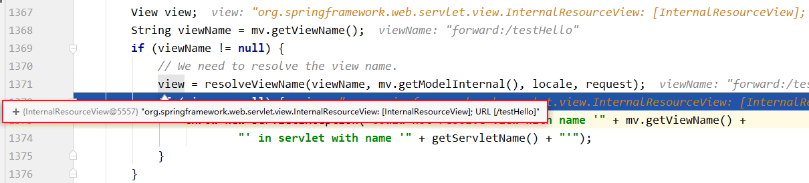

# 一、SpringMVC 簡介

### 1、什麼是 MVC

MVC 是一種軟件架構的思想，將軟件按照模型、視圖、控制器來劃分

M：Model，模型層，指工程中的 JavaBean，作用是處理數據

JavaBean 分為兩類：

- 一類稱為實體類 Bean：專門存儲業務數據的，如 Student、User 等
- 一類稱為業務處理 Bean：指 Service 或 Dao 對象，專門用於處理業務邏輯和數據訪問。

V：View，視圖層，指工程中的 html 或 jsp 等頁面，作用是與用戶進行交互，展示數據

C：Controller，控制層，指工程中的 servlet，作用是接收請求和響應瀏覽器

MVC 的工作流程：
用戶通過視圖層發送請求到服務器，在服務器中請求被 Controller 接收，Controller 調用相應的 Model 層處理請求，處理完畢將結果返回到 Controller，Controller 再根據請求處理的結果找到相應的 View 視圖，渲染數據後最終響應給瀏覽器

### 2、maven 依賴

```xml
<dependencies>
    <!-- SpringMVC -->
    <dependency>
        <groupId>org.springframework</groupId>
        <artifactId>spring-webmvc</artifactId>
        <version>5.3.1</version>
    </dependency>

    <!-- 日誌 -->
    <dependency>
        <groupId>ch.qos.logback</groupId>
        <artifactId>logback-classic</artifactId>
        <version>1.2.3</version>
    </dependency>

    <!-- ServletAPI -->
    <dependency>
        <groupId>javax.servlet</groupId>
        <artifactId>javax.servlet-api</artifactId>
        <version>3.1.0</version>
        <scope>provided</scope>
    </dependency>

    <!-- Spring5和Thymeleaf整合包 -->
    <dependency>
        <groupId>org.thymeleaf</groupId>
        <artifactId>thymeleaf-spring5</artifactId>
        <version>3.0.12.RELEASE</version>
    </dependency>
</dependencies>
```

注：由於 Maven 的傳遞性，不必將所有需要的包全部配置依賴，而是配置最頂端的依賴，其他靠傳遞性導入。


### 3、配置 web.xml

配置 SpringMVC 的前端控制器 DispatcherServlet

##### a>默認配置方式

此配置作用下，SpringMVC 的配置文件默認位於 WEB-INF 下，默認名稱為\<servlet-name>-servlet.xml，例如，以下配置所對應 SpringMVC 的配置文件位於 WEB-INF 下，文件名為 springMVC-servlet.xml

```xml
<!-- 配置SpringMVC的前端控制器，對瀏覽器發送的請求統一進行處理 -->
<servlet>
    <servlet-name>springMVC</servlet-name>
    <servlet-class>org.springframework.web.servlet.DispatcherServlet</servlet-class>
</servlet>
<servlet-mapping>
    <servlet-name>springMVC</servlet-name>
    <!--
        設置springMVC的核心控制器所能處理的請求的請求路徑
        /所匹配的請求可以是/login或.html或.js或.css方式的請求路徑
        但是/不能匹配.jsp請求路徑的請求
    -->
    <url-pattern>/</url-pattern>
</servlet-mapping>
```

##### b>擴展配置方式

可通過 init-param 標籤設置 SpringMVC 配置文件的位置和名稱，通過 load-on-startup 標籤設置 SpringMVC 前端控制器 DispatcherServlet 的初始化時間

```xml
<!-- 配置SpringMVC的前端控制器，對瀏覽器發送的請求統一進行處理 -->
<servlet>
    <servlet-name>springMVC</servlet-name>
    <servlet-class>org.springframework.web.servlet.DispatcherServlet</servlet-class>
    <!-- 通過初始化參數指定SpringMVC配置文件的位置和名稱 -->
    <init-param>
        <!-- contextConfigLocation為固定值 -->
        <param-name>contextConfigLocation</param-name>
        <!-- 使用classpath:表示從類路徑查找配置文件，例如maven工程中的src/main/resources -->
        <param-value>classpath:springMVC.xml</param-value>
    </init-param>
    <!--
 		作為框架的核心組件，在啟動過程中有大量的初始化操作要做
		而這些操作放在第一次請求時才執行會嚴重影響訪問速度
		因此需要通過此標籤將啟動控制DispatcherServlet的初始化時間提前到服務器啟動時
	-->
    <load-on-startup>1</load-on-startup>
</servlet>
<servlet-mapping>
    <servlet-name>springMVC</servlet-name>
    <!--
        設置springMVC的核心控制器所能處理的請求的請求路徑
        /所匹配的請求可以是/login或.html或.js或.css方式的請求路徑
        但是/不能匹配.jsp請求路徑的請求
    -->
    <url-pattern>/</url-pattern>
</servlet-mapping>
```

> 注：
>
> \<url-pattern>標籤中使用/和/\*的區別：
>
> /所匹配的請求可以是/login 或.html 或.js 或.css 方式的請求路徑，但是/不能匹配.jsp 請求路徑的請求
>
> 因此就可以避免在訪問 jsp 頁面時，該請求被 DispatcherServlet 處理，從而找不到相應的頁面
>
> /\*則能夠匹配所有請求，例如在使用過濾器時，若需要對所有請求進行過濾，就需要使用/\*的寫法

### 4、創建請求控制器

由於前端控制器對瀏覽器發送的請求進行了統一的處理，但是具體的請求有不同的處理過程，因此需要創建處理具體請求的類，即請求控制器

請求控制器中每一個處理請求的方法成為控制器方法

因為 SpringMVC 的控制器由一個 POJO（普通的 Java 類）擔任，因此需要通過@Controller 註解將其標識為一個控制層組件，交給 Spring 的 IoC 容器管理，此時 SpringMVC 才能夠識別控制器的存在

```java
@Controller
public class HelloController {

}
```

### 5、創建 springMVC 的配置文件

- \<mvc:default-servlet-handler/> :

  - 1.處理靜態資源，例如 html、js、css、jpg
  - 2.獲取靜態資源時，先交由配置的 DispatcherServlet 去匹配路徑，如匹配不不到會拋出 404，此時若配置此標籤會再交由 default 的 servlet 去匹配資源(通常是 server 配置的 web.xml，例如 tomcat 的 web.xml)

```xml
<!-- 自動掃描包 -->
<context:component-scan base-package="com.frank.mvc.controller"/>

<!-- 配置Thymeleaf視圖解析器 -->
<bean id="viewResolver" class="org.thymeleaf.spring5.view.ThymeleafViewResolver">
    <property name="order" value="1"/>
    <property name="characterEncoding" value="UTF-8"/>
    <property name="templateEngine">
        <bean class="org.thymeleaf.spring5.SpringTemplateEngine">
            <property name="templateResolver">
                <bean class="org.thymeleaf.spring5.templateresolver.SpringResourceTemplateResolver">

                    <!-- 視圖前綴 -->
                    <property name="prefix" value="/WEB-INF/templates/"/>

                    <!-- 視圖後綴 -->
                    <property name="suffix" value=".html"/>
                    <property name="templateMode" value="HTML5"/>
                    <property name="characterEncoding" value="UTF-8" />
                </bean>
            </property>
        </bean>
    </property>
</bean>

<!--
 處理靜態資源，例如html、js、css、jpg
  若只設置該標籤，則只能訪問靜態資源，其他請求則無法訪問
  此時必須設置<mvc:annotation-driven/>解決問題
 -->
<mvc:default-servlet-handler/>

<!-- 開啟mvc註解驅動 -->
<mvc:annotation-driven>
    <mvc:message-converters>
        <!-- 處理響應中文內容亂碼 -->
        <bean class="org.springframework.http.converter.StringHttpMessageConverter">
            <property name="defaultCharset" value="UTF-8" />
            <property name="supportedMediaTypes">
                <list>
                    <value>text/html</value>
                    <value>application/json</value>
                </list>
            </property>
        </bean>
    </mvc:message-converters>
</mvc:annotation-driven>
```

### 6、測試

##### a>實現對首頁的訪問

在請求控制器中創建處理請求的方法

```java
// @RequestMapping註解：處理請求和控制器方法之間的映射關係
// @RequestMapping註解的value屬性可以通過請求地址匹配請求，/表示的當前工程的上下文路徑
// localhost:8080/springMVC/
@RequestMapping("/")
public String index() {
    //設置視圖名稱
    return "index";
}
```

##### b>通過超鏈接跳轉到指定頁面

在主頁 index.html 中設置超鏈接

```html
<!DOCTYPE html>
<html lang="en" xmlns:th="http://www.thymeleaf.org">
  <head>
    <meta charset="UTF-8" />
    <title>首頁</title>
  </head>
  <body>
    <h1>首頁</h1>
    <a th:href="@{/hello}">HelloWorld</a><br />
  </body>
</html>
```

在請求控制器中創建處理請求的方法

```java
@RequestMapping("/hello")
public String HelloWorld() {
    return "target";
}
```

### 7、總結

瀏覽器發送請求，若請求地址符合前端控制器的 url-pattern，該請求就會被前端控制器 DispatcherServlet 處理。前端控制器會讀取 SpringMVC 的核心配置文件，通過掃描組件找到控制器，將請求地址和控制器中@RequestMapping 註解的 value 屬性值進行匹配，若匹配成功，該註解所標識的控制器方法就是處理請求的方法。處理請求的方法需要返回一個字符串類型的視圖名稱，該視圖名稱會被視圖解析器解析，加上前綴和後綴組成視圖的路徑，通過 Thymeleaf 對視圖進行渲染，最終轉發到視圖所對應頁面

# 三、@RequestMapping 註解

### 1、@RequestMapping 註解的功能

從註解名稱上我們可以看到，@RequestMapping 註解的作用就是將請求和處理請求的控制器方法關聯起來，建立映射關係。

SpringMVC 接收到指定的請求，就會來找到在映射關係中對應的控制器方法來處理這個請求。

### 2、@RequestMapping 註解的位置

@RequestMapping 標識一個類：設置映射請求的請求路徑的初始信息

@RequestMapping 標識一個方法：設置映射請求請求路徑的具體信息

```java
@Controller
@RequestMapping("/test")
public class RequestMappingController {

	//此時請求映射所映射的請求的請求路徑為：/test/testRequestMapping
    @RequestMapping("/testRequestMapping")
    public String testRequestMapping(){
        return "success";
    }

}
```

### 3、@RequestMapping 註解的 value 屬性

@RequestMapping 註解的 value 屬性通過請求的請求地址匹配請求映射

@RequestMapping 註解的 value 屬性是一個字符串類型的數組，表示該請求映射能夠匹配多個請求地址所對應的請求

@RequestMapping 註解的 value 屬性必須設置，至少通過請求地址匹配請求映射

```html
<a th:href="@{/testRequestMapping}"
  >測試@RequestMapping的value屬性-->/testRequestMapping</a
><br />
<a th:href="@{/test}">測試@RequestMapping的value屬性-->/test</a><br />
```

```java
@RequestMapping(
        value = {"/testRequestMapping", "/test"}
)
public String testRequestMapping(){
    return "success";
}
```

### 4、@RequestMapping 註解的 method 屬性

@RequestMapping 註解的 method 屬性通過請求的請求方式（get 或 post）匹配請求映射

@RequestMapping 註解的 method 屬性是一個 RequestMethod 類型的數組，表示該請求映射能夠匹配多種請求方式的請求

若當前請求的請求地址滿足請求映射的 value 屬性，但是請求方式不滿足 method 屬性，則瀏覽器報錯 405：Request method 'POST' not supported

```html
<a th:href="@{/test}">測試@RequestMapping的value屬性-->/test</a><br />
<form th:action="@{/test}" method="post">
  <input type="submit" />
</form>
```

```java
@RequestMapping(
        value = {"/testRequestMapping", "/test"},
        method = {RequestMethod.GET, RequestMethod.POST}
)
public String testRequestMapping(){
    return "success";
}
```

> 注：
>
> 1、對於處理指定請求方式的控制器方法，SpringMVC 中提供了@RequestMapping 的派生註解
>
> 處理 get 請求的映射-->@GetMapping
>
> 處理 post 請求的映射-->@PostMapping
>
> 處理 put 請求的映射-->@PutMapping
>
> 處理 delete 請求的映射-->@DeleteMapping
>
> 2、常用的請求方式有 get，post，put，delete
>
> 但是目前瀏覽器只支持 get 和 post，若在 form 表單提交時，為 method 設置了其他請求方式的字符串（put 或 delete），則按照默認的請求方式 get 處理
>
> 若要發送 put 和 delete 請求，則需要通過 spring 提供的過濾器 HiddenHttpMethodFilter，在 RESTful 部分會講到

### 5、@RequestMapping 註解的 params 屬性（了解）

@RequestMapping 註解的 params 屬性通過請求的請求參數匹配請求映射

@RequestMapping 註解的 params 屬性是一個字符串類型的數組，可以通過四種表達式設置請求參數和請求映射的匹配關係

"param"：要求請求映射所匹配的請求必須攜帶 param 請求參數

"!param"：要求請求映射所匹配的請求必須不能攜帶 param 請求參數

"param=value"：要求請求映射所匹配的請求必須攜帶 param 請求參數且 param=value

"param!=value"：要求請求映射所匹配的請求必須攜帶 param 請求參數但是 param!=value

```html
<a th:href="@{/test(username='admin',password=123456)"
  >測試@RequestMapping的params屬性-->/test</a
><br />
```

```java
@RequestMapping(
        value = {"/testRequestMapping", "/test"}
        ,method = {RequestMethod.GET, RequestMethod.POST}
        ,params = {"username","password!=123456"}
)
public String testRequestMapping(){
    return "success";
}
```

> 注：
>
> 若當前請求滿足@RequestMapping 註解的 value 和 method 屬性，但是不滿足 params 屬性，此時頁面回報錯 400：Parameter conditions "username, password!=123456" not met for actual request parameters: username={admin}, password={123456}

### 6、@RequestMapping 註解的 headers 屬性（了解）

@RequestMapping 註解的 headers 屬性通過請求的請求頭信息匹配請求映射

@RequestMapping 註解的 headers 屬性是一個字符串類型的數組，可以通過四種表達式設置請求頭信息和請求映射的匹配關係

"header"：要求請求映射所匹配的請求必須攜帶 header 請求頭信息

"!header"：要求請求映射所匹配的請求必須不能攜帶 header 請求頭信息

"header=value"：要求請求映射所匹配的請求必須攜帶 header 請求頭信息且 header=value

"header!=value"：要求請求映射所匹配的請求必須攜帶 header 請求頭信息且 header!=value

若當前請求滿足@RequestMapping 註解的 value 和 method 屬性，但是不滿足 headers 屬性，此時頁面顯示 404 錯誤，即資源未找到

### 7、SpringMVC 支持 ant 風格的路徑

？ ：表示任意的單個字符

\*：表示任意的 0 個或多個字符

\*\*：表示任意的一層或多層目錄

注意：在使用\*\*時，只能使用/\*\*/xxx 的方式

### 8、SpringMVC 支持路徑中的佔位符（重點）

原始方式：/deleteUser?id=1

rest 方式：/deleteUser/1

SpringMVC 路徑中的佔位符常用於 RESTful 風格中，當請求路徑中將某些數據通過路徑的方式傳輸到服務器中，就可以在相應的@RequestMapping 註解的 value 屬性中通過佔位符{xxx}表示傳輸的數據，在通過@PathVariable 註解，將佔位符所表示的數據賦值給控制器方法的形參

```html
<a th:href="@{/testRest/1/admin}">測試路徑中的佔位符-->/testRest</a><br />
```

```java
@RequestMapping("/testRest/{id}/{username}")
public String testRest(@PathVariable("id") String id, @PathVariable("username") String username){
    System.out.println("id:"+id+",username:"+username);
    return "success";
}
//最終輸出的內容為-->id:1,username:admin
```

# 四、SpringMVC 獲取請求參數

- @RequestParam ← application/x-www-form-urlencoded
- @RequestBody ← application/json
- @RequestPart ← multipart/form-data

### 1、通過 ServletAPI 獲取

將 HttpServletRequest 作為控制器方法的形參，此時 HttpServletRequest 類型的參數表示封裝了當前請求的請求報文的對象

```java
@RequestMapping("/testParam")
public String testParam(HttpServletRequest request){
    String username = request.getParameter("username");
    String password = request.getParameter("password");
    System.out.println("username:"+username+",password:"+password);
    return "success";
}
```

### 2、通過控制器方法的形參獲取請求參數

在控制器方法的形參位置，設置和請求參數同名的形參，當瀏覽器發送請求，匹配到請求映射時，在 DispatcherServlet 中就會將請求參數賦值給相應的形參

```html
<a th:href="@{/testParam(username='admin',password=123456)}"
  >測試獲取請求參數-->/testParam</a
><br />
```

```java
@RequestMapping("/testParam")
public String testParam(String username, String password){
    System.out.println("username:"+username+",password:"+password);
    return "success";
}
```

> 注：
>
> 若請求所傳輸的請求參數中有多個同名的請求參數，此時可以在控制器方法的形參中設置字符串數組或者字符串類型的形參接收此請求參數
>
> 若使用字符串數組類型的形參，此參數的數組中包含了每一個數據
>
> 若使用字符串類型的形參，此參數的值為每個數據中間使用逗號拼接的結果

### 3、@RequestParam

@RequestParam 是將請求參數和控制器方法的形參創建映射關係

@RequestParam 註解一共有三個屬性：

value：指定為形參賦值的請求參數的參數名

required：設置是否必須傳輸此請求參數，默認值為 true

若設置為 true 時，則當前請求必須傳輸 value 所指定的請求參數，若沒有傳輸該請求參數，且沒有設置 defaultValue 屬性，則頁面報錯 400：Required String parameter 'xxx' is not present；若設置為 false，則當前請求不是必須傳輸 value 所指定的請求參數，若沒有傳輸，則註解所標識的形參的值為 null

defaultValue：不管 required 屬性值為 true 或 false，當 value 所指定的請求參數沒有傳輸或傳輸的值為""時，則使用默認值為形參賦值

### 4、@RequestHeader

@RequestHeader 是將請求頭信息和控制器方法的形參創建映射關係

@RequestHeader 註解一共有三個屬性：value、required、defaultValue，用法同@RequestParam

### 5、@CookieValue

@CookieValue 是將 cookie 數據和控制器方法的形參創建映射關係

@CookieValue 註解一共有三個屬性：value、required、defaultValue，用法同@RequestParam# 四、SpringMVC 獲取請求參數

### 1、通過 ServletAPI 獲取

將 HttpServletRequest 作為控制器方法的形參，此時 HttpServletRequest 類型的參數表示封裝了當前請求的請求報文的對象

```java
@RequestMapping("/testParam")
public String testParam(HttpServletRequest request){
    String username = request.getParameter("username");
    String password = request.getParameter("password");
    System.out.println("username:"+username+",password:"+password);
    return "success";
}
```

### 2、通過控制器方法的形參獲取請求參數

在控制器方法的形參位置，設置和請求參數同名的形參，當瀏覽器發送請求，匹配到請求映射時，在 DispatcherServlet 中就會將請求參數賦值給相應的形參

```html
<a th:href="@{/testParam(username='admin',password=123456)}"
  >測試獲取請求參數-->/testParam</a
><br />
```

```java
@RequestMapping("/testParam")
public String testParam(String username, String password){
    System.out.println("username:"+username+",password:"+password);
    return "success";
}
```

> 注：
>
> 若請求所傳輸的請求參數中有多個同名的請求參數，此時可以在控制器方法的形參中設置字符串數組或者字符串類型的形參接收此請求參數
>
> 若使用字符串數組類型的形參，此參數的數組中包含了每一個數據
>
> 若使用字符串類型的形參，此參數的值為每個數據中間使用逗號拼接的結果

### 3、@RequestParam

@RequestParam 是將請求參數和控制器方法的形參創建映射關係

@RequestParam 註解一共有三個屬性：

value：指定為形參賦值的請求參數的參數名

required：設置是否必須傳輸此請求參數，默認值為 true

若設置為 true 時，則當前請求必須傳輸 value 所指定的請求參數，若沒有傳輸該請求參數，且沒有設置 defaultValue 屬性，則頁面報錯 400：Required String parameter 'xxx' is not present；若設置為 false，則當前請求不是必須傳輸 value 所指定的請求參數，若沒有傳輸，則註解所標識的形參的值為 null

defaultValue：不管 required 屬性值為 true 或 false，當 value 所指定的請求參數沒有傳輸或傳輸的值為""時，則使用默認值為形參賦值

### 4、@RequestHeader

@RequestHeader 是將請求頭信息和控制器方法的形參創建映射關係

@RequestHeader 註解一共有三個屬性：value、required、defaultValue，用法同@RequestParam

### 5、@CookieValue

@CookieValue 是將 cookie 數據和控制器方法的形參創建映射關係

@CookieValue 註解一共有三個屬性：value、required、defaultValue，用法同@RequestParam

### 6、通過 POJO 獲取請求參數

可以在控制器方法的形參位置設置一個實體類類型的形參，此時若瀏覽器傳輸的請求參數的參數名和實體類中的屬性名一致，那麼請求參數就會為此屬性賦值

```html
<form th:action="@{/testpojo}" method="post">
  用戶名：<input type="text" name="username" /><br />
  密碼：<input type="password" name="password" /><br />
  性別：<input type="radio" name="sex" value="男" />男<input
    type="radio"
    name="sex"
    value="女"
  />女<br />
  年齡：<input type="text" name="age" /><br />
  郵箱：<input type="text" name="email" /><br />
  <input type="submit" />
</form>
```

```java
@RequestMapping("/testpojo")
public String testPOJO(User user){
    System.out.println(user);
    return "success";
}
//最終結果-->User{id=null, username='張三', password='123', age=23, sex='男', email='123@qq.com'}
```

### 7、解決獲取請求參數的亂碼問題

解決獲取請求參數的亂碼問題，可以使用 SpringMVC 提供的編碼過濾器 CharacterEncodingFilter，但是必須在 web.xml 中進行註冊

```xml
<!--配置springMVC的編碼過濾器-->
<filter>
    <filter-name>CharacterEncodingFilter</filter-name>
    <filter-class>org.springframework.web.filter.CharacterEncodingFilter</filter-class>
    <init-param>
        <param-name>encoding</param-name>
        <param-value>UTF-8</param-value>
    </init-param>
    <init-param>
        <param-name>forceResponseEncoding</param-name>
        <param-value>true</param-value>
    </init-param>
</filter>
<filter-mapping>
    <filter-name>CharacterEncodingFilter</filter-name>
    <url-pattern>/*</url-pattern>
</filter-mapping>
```

> 注：
>
> SpringMVC 中處理編碼的過濾器一定要配置到其他過濾器之前，否則無效

# 五、域對象共享數據

### 1、使用 ServletAPI 向 request 域對象共享數據

```java
@RequestMapping("/testServletAPI")
public String testServletAPI(HttpServletRequest request){
    request.setAttribute("testScope", "hello,servletAPI");
    return "success";
}
```

### 2、使用 ModelAndView 向 request 域對象共享數據

```java
@RequestMapping("/testModelAndView")
public ModelAndView testModelAndView(){
    /**
     * ModelAndView有Model和View的功能
     * Model主要用於向請求域共享數據
     * View主要用於設置視圖，實現頁面跳轉
     */
    ModelAndView mav = new ModelAndView();
    //向請求域共享數據
    mav.addObject("testScope", "hello,ModelAndView");
    //設置視圖，實現頁面跳轉
    mav.setViewName("success");
    return mav;
}
```

### 3、使用 Model 向 request 域對象共享數據

```java
@RequestMapping("/testModel")
public String testModel(Model model){
    model.addAttribute("testScope", "hello,Model");
    return "success";
}
```

### 4、使用 map 向 request 域對象共享數據

```java
@RequestMapping("/testMap")
public String testMap(Map<String, Object> map){
    map.put("testScope", "hello,Map");
    return "success";
}
```

### 5、使用 ModelMap 向 request 域對象共享數據

```java
@RequestMapping("/testModelMap")
public String testModelMap(ModelMap modelMap){
    modelMap.addAttribute("testScope", "hello,ModelMap");
    return "success";
}
```

### 6、Model、ModelMap、Map 的關係

Model、ModelMap、Map 類型的參數其實本質上都是 BindingAwareModelMap 類型的

```
public interface Model{}
public class ModelMap extends LinkedHashMap<String, Object> {}
public class ExtendedModelMap extends ModelMap implements Model {}
public class BindingAwareModelMap extends ExtendedModelMap {}
```

### 7、向 session 域共享數據

```java
@RequestMapping("/testSession")
public String testSession(HttpSession session){
    session.setAttribute("testSessionScope", "hello,session");
    return "success";
}
```

### 8、向 application 域共享數據

```java
@RequestMapping("/testApplication")
public String testApplication(HttpSession session){
	ServletContext application = session.getServletContext();
    application.setAttribute("testApplicationScope", "hello,application");
    return "success";
}
```

# 六、SpringMVC 的視圖

SpringMVC 中的視圖是 View 接口，視圖的作用渲染數據，將模型 Model 中的數據展示給用戶

SpringMVC 視圖的種類很多，默認有轉發視圖和重定向視圖

當工程引入 jstl 的依賴，轉發視圖會自動轉換為 JstlView

若使用的視圖技術為 Thymeleaf，在 SpringMVC 的配置文件中配置了 Thymeleaf 的視圖解析器，由此視圖解析器解析之後所得到的是 ThymeleafView

### 1、ThymeleafView

當控制器方法中所設置的視圖名稱沒有任何前綴時，此時的視圖名稱會被 SpringMVC 配置文件中所配置的視圖解析器解析，視圖名稱拼接視圖前綴和視圖後綴所得到的最終路徑，會通過轉發的方式實現跳轉

```java
@RequestMapping("/testHello")
public String testHello(){
    return "hello";
}
```


### 2、轉發視圖

SpringMVC 中默認的轉發視圖是 InternalResourceView

SpringMVC 中創建轉發視圖的情況：

當控制器方法中所設置的視圖名稱以"forward:"為前綴時，創建 InternalResourceView 視圖，此時的視圖名稱不會被 SpringMVC 配置文件中所配置的視圖解析器解析，而是會將前綴"forward:"去掉，剩餘部分作為最終路徑通過轉發的方式實現跳轉

例如"forward:/"，"forward:/employee"

```java
@RequestMapping("/testForward")
public String testForward(){
    return "forward:/testHello";
}
```



### 3、重定向視圖

SpringMVC 中默認的重定向視圖是 RedirectView

當控制器方法中所設置的視圖名稱以"redirect:"為前綴時，創建 RedirectView 視圖，此時的視圖名稱不會被 SpringMVC 配置文件中所配置的視圖解析器解析，而是會將前綴"redirect:"去掉，剩餘部分作為最終路徑通過重定向的方式實現跳轉

例如"redirect:/"，"redirect:/employee"

```java
@RequestMapping("/testRedirect")
public String testRedirect(){
    return "redirect:/testHello";
}
```


> 注：
>
> 重定向視圖在解析時，會先將 redirect:前綴去掉，然後會判斷剩餘部分是否以/開頭，若是則會自動拼接上下文路徑

### 4、視圖控制器 view-controller

當控制器方法中，僅僅用來實現頁面跳轉，即只需要設置視圖名稱時，可以將處理器方法使用 view-controller 標籤進行表示

```xml
<!--
	path：設置處理的請求地址
	view-name：設置請求地址所對應的視圖名稱
-->
<mvc:view-controller path="/testView" view-name="success"></mvc:view-controller>
```

> 注：
>
> 當 SpringMVC 中設置任何一個 view-controller 時，其他控制器中的請求映射將全部失效，此時需要在 SpringMVC 的核心配置文件中設置開啟 mvc 註解驅動的標籤：
>
> <mvc:annotation-driven />

# 七、RESTful

### 1、RESTful 簡介

REST：**Re**presentational **S**tate **T**ransfer，表現層資源狀態轉移。

##### a>資源

資源是一種看待服務器的方式，即，將服務器看作是由很多離散的資源組成。每個資源是服務器上一個可命名的抽象概念。因為資源是一個抽象的概念，所以它不僅僅能代表服務器文件系統中的一個文件、數據庫中的一張表等等具體的東西，可以將資源設計的要多抽像有多抽象，只要想像力允許而且客戶端應用開發者能夠理解。與面向對象設計類似，資源是以名詞為核心來組織的，首先關注的是名詞。一個資源可以由一個或多個 URI 來標識。 URI 既是資源的名稱，也是資源在 Web 上的地址。對某個資源感興趣的客戶端應用，可以通過資源的 URI 與其進行交互。

##### b>資源的表述

資源的表述是一段對於資源在某個特定時刻的狀態的描述。可以在客戶端-服務器端之間轉移（交換）。資源的表述可以有多種格式，例如 HTML/XML/JSON/純文本/圖片/視頻/音頻等等。資源的表述格式可以通過協商機制來確定。請求-響應方向的表述通常使用不同的格式。

##### c>狀態轉移

狀態轉移說的是：在客戶端和服務器端之間轉移（transfer）代表資源(部屬上服務器的所有東西)狀態(jsp、json、css...)的表述。通過轉移和操作資源的表述(就是請求的 URL)，來間接實現操作資源的目的。

### 2、RESTful 的實現

具體說，就是 HTTP 協議裡面，四個表示操作方式的動詞：GET、POST、PUT、DELETE。

它們分別對應四種基本操作：GET 用來獲取資源，POST 用來新建資源，PUT 用來更新資源，DELETE 用來刪除資源。

REST 風格提倡 URL 地址使用統一的風格設計，從前到後各個單詞使用斜杠分開，不使用問號鍵值對方式攜帶請求參數，而是將要發送給服務器的數據作為 URL 地址的一部分，以保證整體風格的一致性。

| 操作     | 傳統方式         | REST 風格                |
| -------- | ---------------- | ------------------------ |
| 查詢操作 | getUserById?id=1 | user/1-->get 請求方式    |
| 保存操作 | saveUser         | user-->post 請求方式     |
| 刪除操作 | deleteUser?id=1  | user/1-->delete 請求方式 |
| 更新操作 | updateUser       | user-->put 請求方式      |

### 3、HiddenHttpMethodFilter

由於瀏覽器只支持發送 get 和 post 方式的請求，那麼該如何發送 put 和 delete 請求呢？

SpringMVC 提供了 **HiddenHttpMethodFilter** 幫助我們**將 POST 請求轉換為 DELETE 或 PUT 請求**

**HiddenHttpMethodFilter** 處理 put 和 delete 請求的條件：

a>當前請求的請求方式必須為 post

b>當前請求必須傳輸請求參數\_method

滿足以上條件，**HiddenHttpMethodFilter** 過濾器就會將當前請求的請求方式轉換為請求參數\_method 的值，因此請求參數\_method 的值才是最終的請求方式

在 web.xml 中註冊**HiddenHttpMethodFilter**

```xml
<filter>
    <filter-name>HiddenHttpMethodFilter</filter-name>
    <filter-class>org.springframework.web.filter.HiddenHttpMethodFilter</filter-class>
</filter>
<filter-mapping>
    <filter-name>HiddenHttpMethodFilter</filter-name>
    <url-pattern>/*</url-pattern>
</filter-mapping>
```

> 注：
>
> 目前為止，SpringMVC 中提供了兩個過濾器：CharacterEncodingFilter 和 HiddenHttpMethodFilter
>
> 在 web.xml 中註冊時，必須先註冊 CharacterEncodingFilter，再註冊 HiddenHttpMethodFilter(意思就是在 WEB.XML 先配置 CharacterEncodingFilter 再配置 HiddenHttpMethodFilter)
>
> 原因：
>
> - 在 CharacterEncodingFilter 中通過 request.setCharacterEncoding(encoding) 方法設置字符集的
>
> - request.setCharacterEncoding(encoding) 方法要求前面不能有任何獲取請求參數的操作
>
> - 而 HiddenHttpMethodFilter 恰恰有一個獲取請求方式的操作：
>
> - ```
>   String paramValue = request.getParameter(this.methodParam);
>   ```

# 八、RESTful 案例

### 1、準備工作

和傳統 CRUD 一樣，實現對員工信息的增刪改查。

- 搭建環境

- 準備實體類

  ```java
  package com.atguigu.mvc.bean;

  public class Employee {

     private Integer id;
     private String lastName;

     private String email;
     //1 male, 0 female
     private Integer gender;

     public Integer getId() {
        return id;
     }

     public void setId(Integer id) {
        this.id = id;
     }

     public String getLastName() {
        return lastName;
     }

     public void setLastName(String lastName) {
        this.lastName = lastName;
     }

     public String getEmail() {
        return email;
     }

     public void setEmail(String email) {
        this.email = email;
     }

     public Integer getGender() {
        return gender;
     }

     public void setGender(Integer gender) {
        this.gender = gender;
     }

     public Employee(Integer id, String lastName, String email, Integer gender) {
        super();
        this.id = id;
        this.lastName = lastName;
        this.email = email;
        this.gender = gender;
     }

     public Employee() {
     }
  }
  ```

- 準備 dao 模擬數據

  ```java
  package com.atguigu.mvc.dao;

  import java.util.Collection;
  import java.util.HashMap;
  import java.util.Map;

  import com.atguigu.mvc.bean.Employee;
  import org.springframework.stereotype.Repository;


  @Repository
  public class EmployeeDao {

     private static Map<Integer, Employee> employees = null;

     static{
        employees = new HashMap<Integer, Employee>();

        employees.put(1001, new Employee(1001, "E-AA", "aa@163.com", 1));
        employees.put(1002, new Employee(1002, "E-BB", "bb@163.com", 1));
        employees.put(1003, new Employee(1003, "E-CC", "cc@163.com", 0));
        employees.put(1004, new Employee(1004, "E-DD", "dd@163.com", 0));
        employees.put(1005, new Employee(1005, "E-EE", "ee@163.com", 1));
     }

     private static Integer initId = 1006;

     public void save(Employee employee){
        if(employee.getId() == null){
           employee.setId(initId++);
        }
        employees.put(employee.getId(), employee);
     }

     public Collection<Employee> getAll(){
        return employees.values();
     }

     public Employee get(Integer id){
        return employees.get(id);
     }

     public void delete(Integer id){
        employees.remove(id);
     }
  }
  ```

### 2、功能清單

| 功能                 | URL 地址    | 請求方式 |
| -------------------- | ----------- | -------- |
| 訪問首頁 √           | /           | GET      |
| 查詢全部數據 √       | /employee   | GET      |
| 刪除 √               | /employee/2 | DELETE   |
| 跳轉到添加數據頁面 √ | /toAdd      | GET      |
| 執行保存 √           | /employee   | POST     |
| 跳轉到更新數據頁面 √ | /employee/2 | GET      |
| 執行更新 √           | /employee   | PUT      |

### 3、具體功能：訪問首頁

##### a>配置 view-controller

```xml
<mvc:view-controller path="/" view-name="index"/>
```

##### b>創建頁面

```html
<!DOCTYPE html>
<html lang="en" xmlns:th="http://www.thymeleaf.org">
  <head>
    <meta charset="UTF-8" />
    <title>Title</title>
  </head>
  <body>
    <h1>首頁</h1>
    <a th:href="@{/employee}">訪問員工信息</a>
  </body>
</html>
```

### 4、具體功能：查詢所有員工數據

##### a>控制器方法

```java
@RequestMapping(value = "/employee", method = RequestMethod.GET)
public String getEmployeeList(Model model){
    Collection<Employee> employeeList = employeeDao.getAll();
    model.addAttribute("employeeList", employeeList);
    return "employee_list";
}
```

##### b>創建 employee_list.html

```html
<!DOCTYPE html>
<html lang="en" xmlns:th="http://www.thymeleaf.org">
  <head>
    <meta charset="UTF-8" />
    <title>Employee Info</title>
    <script type="text/javascript" th:src="@{/static/js/vue.js}"></script>
  </head>
  <body>
    <table
      border="1"
      cellpadding="0"
      cellspacing="0"
      style="text-align: center;"
      id="dataTable"
    >
      <tr>
        <th colspan="5">Employee Info</th>
      </tr>
      <tr>
        <th>id</th>
        <th>lastName</th>
        <th>email</th>
        <th>gender</th>
        <th>options(<a th:href="@{/toAdd}">add</a>)</th>
      </tr>
      <tr th:each="employee : ${employeeList}">
        <td th:text="${employee.id}"></td>
        <td th:text="${employee.lastName}"></td>
        <td th:text="${employee.email}"></td>
        <td th:text="${employee.gender}"></td>
        <td>
          <a
            class="deleteA"
            @click="deleteEmployee"
            th:href="@{'/employee/'+${employee.id}}"
            >delete</a
          >
          <a th:href="@{'/employee/'+${employee.id}}">update</a>
        </td>
      </tr>
    </table>
  </body>
</html>
```

### 5、具體功能：刪除

##### a>創建處理 delete 請求方式的表單

```html
<!-- 作用：通過超鏈接控製表單的提交，將post請求轉換為delete請求 -->
<form id="delete_form" method="post">
  <!-- HiddenHttpMethodFilter要求：必須傳輸_method請求參數，並且值為最終的請求方式 -->
  <input type="hidden" name="_method" value="delete" />
</form>
```

##### b>刪除超鏈接綁定點擊事件

引入 vue.js

```html
<script type="text/javascript" th:src="@{/static/js/vue.js}"></script>
```

刪除超鏈接

```html
<a
  class="deleteA"
  @click="deleteEmployee"
  th:href="@{'/employee/'+${employee.id}}"
  >delete</a
>
```

通過 vue 處理點擊事件

```html
<script type="text/javascript">
  var vue = new Vue({
    el: "#dataTable",
    methods: {
      //event表示當前事件
      deleteEmployee: function (event) {
        //通過id獲取表單標籤
        var delete_form = document.getElementById("delete_form");
        //將觸發事件的超鏈接的href屬性為表單的action屬性賦值
        delete_form.action = event.target.href;
        //提交表單
        delete_form.submit();
        //阻止超鏈接的默認跳轉行為
        event.preventDefault();
      },
    },
  });
</script>
```

##### c>控制器方法

```java
@RequestMapping(value = "/employee/{id}", method = RequestMethod.DELETE)
public String deleteEmployee(@PathVariable("id") Integer id){
    employeeDao.delete(id);
    return "redirect:/employee";
}
```

### 6、具體功能：跳轉到添加數據頁面

##### a>配置 view-controller

```xml
<mvc:view-controller path="/toAdd" view-name="employee_add"></mvc:view-controller>
```

##### b>創建 employee_add.html

```html
<!DOCTYPE html>
<html lang="en" xmlns:th="http://www.thymeleaf.org">
  <head>
    <meta charset="UTF-8" />
    <title>Add Employee</title>
  </head>
  <body>
    <form th:action="@{/employee}" method="post">
      lastName:<input type="text" name="lastName" /><br />
      email:<input type="text" name="email" /><br />
      gender:<input type="radio" name="gender" value="1" />male
      <input type="radio" name="gender" value="0" />female<br />
      <input type="submit" value="add" /><br />
    </form>
  </body>
</html>
```

### 7、具體功能：執行保存

##### a>控制器方法

```java
@RequestMapping(value = "/employee", method = RequestMethod.POST)
public String addEmployee(Employee employee){
    employeeDao.save(employee);
    return "redirect:/employee";
}
```

### 8、具體功能：跳轉到更新數據頁面

##### a>修改超鏈接

```html
<a th:href="@{'/employee/'+${employee.id}}">update</a>
```

##### b>控制器方法

```java
@RequestMapping(value = "/employee/{id}", method = RequestMethod.GET)
public String getEmployeeById(@PathVariable("id") Integer id, Model model){
    Employee employee = employeeDao.get(id);
    model.addAttribute("employee", employee);
    return "employee_update";
}
```

##### c>創建 employee_update.html

```html
<!DOCTYPE html>
<html lang="en" xmlns:th="http://www.thymeleaf.org">
  <head>
    <meta charset="UTF-8" />
    <title>Update Employee</title>
  </head>
  <body>
    <form th:action="@{/employee}" method="post">
      <input type="hidden" name="_method" value="put" />
      <input type="hidden" name="id" th:value="${employee.id}" />
      lastName:<input
        type="text"
        name="lastName"
        th:value="${employee.lastName}"
      /><br />
      email:<input
        type="text"
        name="email"
        th:value="${employee.email}"
      /><br />
      <!--
        th:field="${employee.gender}"可用於單選框或複選框的回顯
        若單選框的value和employee.gender的值一致，則添加checked="checked"屬性
    -->
      gender:<input
        type="radio"
        name="gender"
        value="1"
        th:field="${employee.gender}"
      />male
      <input
        type="radio"
        name="gender"
        value="0"
        th:field="${employee.gender}"
      />female<br />
      <input type="submit" value="update" /><br />
    </form>
  </body>
</html>
```

### 9、具體功能：執行更新

##### a>控制器方法

```java
@RequestMapping(value = "/employee", method = RequestMethod.PUT)
public String updateEmployee(Employee employee){
    employeeDao.save(employee);
    return "redirect:/employee";
}
```

# 八、HttpMessageConverter

HttpMessageConverter，報文信息轉換器，將請求報文轉換為 Java 對象，或將 Java 對象轉換為響應報文

HttpMessageConverter 提供了兩個註解和兩個類型：

- @RequestBody : 將請求報文轉換為 Java 對象
- @ResponseBody : 將 Java 對象轉換為響應報文
- RequestEntity : 請求實體，可以接收整個請求體，裡面包含請求頭跟請求體
- ResponseEntity : 響應實體，裡面包含響應頭跟響應體

### 1、@RequestBody

@RequestBody 可以獲取請求體，需要在控制器方法設置一個形參，使用@RequestBody 進行標識，當前請求的請求體就會為當前註解所標識的形參賦值

```html
<form th:action="@{/testRequestBody}" method="post">
  用戶名：<input type="text" name="username" /><br />
  密碼：<input type="password" name="password" /><br />
  <input type="submit" />
</form>
```

```java
@RequestMapping("/testRequestBody")
public String testRequestBody(@RequestBody String requestBody){
    System.out.println("requestBody:"+requestBody);
    return "success";
}
```

輸出結果：

requestBody:username=admin&password=123456

### 2、RequestEntity

RequestEntity 封裝請求報文的一種類型，需要在控制器方法的形參中設置該類型的形參，當前請求的請求報文就會賦值給該形參，可以通過 getHeaders()獲取請求頭信息，通過 getBody()獲取請求體信息

```java
@RequestMapping("/testRequestEntity")
public String testRequestEntity(RequestEntity<String> requestEntity){
    System.out.println("requestHeader:"+requestEntity.getHeaders());
    System.out.println("requestBody:"+requestEntity.getBody());
    return "success";
}
```

輸出結果：
requestHeader:[host:"localhost:8080", connection:"keep-alive", content-length:"27", cache-control:"max-age=0", sec-ch-ua:"" Not A;Brand";v="99", "Chromium";v="90", "Google Chrome";v="90"", sec-ch-ua-mobile:"?0", upgrade-insecure-requests:"1", origin:"http://localhost:8080", user-agent:"Mozilla/5.0 (Windows NT 10.0; Win64; x64) AppleWebKit/537.36 (KHTML, like Gecko) Chrome/90.0.4430.93 Safari/537.36"]
requestBody:username=admin&password=123

### 3、@ResponseBody

@ResponseBody 用於標識一個控制器方法，可以將該方法的返回值直接作為響應報文的響應體響應到瀏覽器

```java
@RequestMapping("/testResponseBody")
@ResponseBody
public String testResponseBody(){
    return "success";
}
```

結果：瀏覽器頁面顯示 success

### 4、SpringMVC 處理 json

@ResponseBody 處理 json 的步驟：

a>導入 jackson 的依賴

```xml
<dependency>
    <groupId>com.fasterxml.jackson.core</groupId>
    <artifactId>jackson-databind</artifactId>
    <version>2.12.1</version>
</dependency>
```

b>在 SpringMVC 的核心配置文件中開啟 mvc 的註解驅動，此時在 HandlerAdaptor 中會自動裝配一個消息轉換器：MappingJackson2HttpMessageConverter，可以將響應到瀏覽器的 Java 對象轉換為 Json 格式的**字符串**

```
<mvc:annotation-driven />
```

c>在處理器方法上使用@ResponseBody 註解進行標識

d>將 Java 對象直接作為控制器方法的返回值返回，就會自動轉換為 Json 格式的字符串

```java
@RequestMapping("/testResponseUser")
@ResponseBody
public User testResponseUser(){
    return new User(1001,"admin","123456",23,"男");
}
```

瀏覽器的頁面中展示的結果：

{"id":1001,"username":"admin","password":"123456","age":23,"sex":"男"}

### 5、SpringMVC 處理 ajax

a>請求超鏈接：

```html
<div id="app">
  <a th:href="@{/testAjax}" @click="testAjax">testAjax</a><br />
</div>
```

b>通過 vue 和 axios 處理點擊事件：

```html
<script type="text/javascript" th:src="@{/static/js/vue.js}"></script>
<script type="text/javascript" th:src="@{/static/js/axios.min.js}"></script>
<script type="text/javascript">
  var vue = new Vue({
    el: "#app",
    methods: {
      testAjax: function (event) {
        axios({
          method: "post",
          url: event.target.href,
          params: {
            username: "admin",
            password: "123456",
          },
        }).then(function (response) {
          alert(response.data);
        });
        event.preventDefault();
      },
    },
  });
</script>
```

c>控制器方法：

```java
@RequestMapping("/testAjax")
@ResponseBody
public String testAjax(String username, String password){
    System.out.println("username:"+username+",password:"+password);
    return "hello,ajax";
}
```

### 6、@RestController 註解

@RestController 註解是 springMVC 提供的一個複合註解，標識在控制器的類上，就相當於為類添加了@Controller 註解，並且為其中的每個方法添加了@ResponseBody 註解

### 7、ResponseEntity

ResponseEntity 用於控制器方法的返回值類型，該控制器方法的返回值就是響應到瀏覽器的響應報文

#九、文件上傳和下載

### 1、文件下載

使用 ResponseEntity 實現下載文件的功能

```java
@RequestMapping("/testDown")
public ResponseEntity<byte[]> testResponseEntity(HttpSession session) throws IOException {
    //獲取ServletContext對象
    ServletContext servletContext = session.getServletContext();
    //獲取服務器中文件的真實路徑
    String realPath = servletContext.getRealPath("/static/img/1.jpg");
    //創建輸入流
    InputStream is = new FileInputStream(realPath);
    //創建字節數組，available()所有可用的字節數
    byte[] bytes = new byte[is.available()];
    //將流讀到字節數組中
    is.read(bytes);
    //創建HttpHeaders對象設置響應頭信息
    MultiValueMap<String, String> headers = new HttpHeaders();
    //設置要下載方式以及下載文件的名字，attachment:以附件的方式下載filename下載後的檔案名稱
    headers.add("Content-Disposition", "attachment;filename=1.jpg");
    //設置響應狀態碼
    HttpStatus statusCode = HttpStatus.OK;
    //創建ResponseEntity對象
    ResponseEntity<byte[]> responseEntity = new ResponseEntity<>(bytes, headers, statusCode);
    //關閉輸入流
    is.close();
    return responseEntity;
}
```

### 2、文件上傳

文件上傳要求 form 表單的請求方式必須為 post，並且添加屬性 enctype="multipart/form-data"

SpringMVC 中將上傳的文件封裝到 MultipartFile 對像中，通過此對象可以獲取文件相關信息

上傳步驟：

a>添加依賴：

```xml
<!-- https://mvnrepository.com/artifact/commons-fileupload/commons-fileupload -->
<dependency>
    <groupId>commons-fileupload</groupId>
    <artifactId>commons-fileupload</artifactId>
    <version>1.3.1</version>
</dependency>
```

b>在 SpringMVC 的配置文件中添加配置：

```xml
<!--必須通過文件解析器的解析才能將文件轉換為MultipartFile對象-->
<bean id="multipartResolver" class="org.springframework.web.multipart.commons.CommonsMultipartResolver"></bean>
```

c>控制器方法：

```java
@RequestMapping("/testUp")
public String testUp(MultipartFile photo, HttpSession session) throws IOException {
    //獲取上傳的文件的文件名
    String fileName = photo.getOriginalFilename();
    //處理文件重名問題
    String hzName = fileName.substring(fileName.lastIndexOf("."));
    fileName = UUID.randomUUID().toString() + hzName;
    //獲取服務器中photo目錄的路徑
    ServletContext servletContext = session.getServletContext();
    String photoPath = servletContext.getRealPath("photo/1/1/");
    File file = new File(photoPath);
    if(!file.exists()){
        file.mkdirs();//可以建立多層目錄
        file.mkdir();//只能建立一層目錄
    }
    String finalPath = photoPath + File.separator + fileName;
    //實現上傳功能
    photo.transferTo(new File(finalPath));
    return "success";
}
```

# 十、攔截器

### 1、攔截器的配置

SpringMVC 中的攔截器用於攔截控制器方法的執行

SpringMVC 中的攔截器需要實現 HandlerInterceptor

SpringMVC 的攔截器必須在 SpringMVC 的配置文件中進行配置：

```xml
<bean class="com.atguigu.interceptor.FirstInterceptor"></bean>
<ref bean="firstInterceptor"></ref>
<!-- 以上兩種配置方式都是對DispatcherServlet所處理的所有的請求進行攔截 -->
<mvc:interceptor>
    <!-- /*一個星號代表匹配一層路徑，如有匹配所有路徑要用兩個星號 -->
    <mvc:mapping path="/**"/>
    <mvc:exclude-mapping path="/testRequestEntity"/>
    <ref bean="firstInterceptor"></ref>
</mvc:interceptor>
<!--
	以上配置方式可以通過ref或bean標籤設置攔截器，通過mvc:mapping設置需要攔截的請求，通過mvc:exclude-mapping設置需要排除的請求，即不需要攔截的請求
-->
```

### 2、攔截器的三個抽象方法

SpringMVC 中的攔截器有三個抽象方法：

preHandle：控制器方法執行之前執行 preHandle()，其 boolean 類型的返回值表示是否攔截或放行，返回 true 為放行，即調用控制器方法；返回 false 表示攔截，即不調用控制器方法

postHandle：控制器方法執行之後執行 postHandle()

afterComplation：處理完視圖和模型數據，渲染視圖完畢之後執行 afterComplation()

```java
package com.frank.controller.interceptor;

import javax.servlet.http.HttpServletRequest;
import javax.servlet.http.HttpServletResponse;

import org.springframework.web.servlet.HandlerInterceptor;
import org.springframework.web.servlet.ModelAndView;

public class FirstInterceptor implements HandlerInterceptor{

	//控制器方法執行之前執行
	@Override
	public boolean preHandle(HttpServletRequest request, HttpServletResponse response, Object handler)
			throws Exception {
		System.out.println("FirstInterceptor ---> preHandle");
		return HandlerInterceptor.super.preHandle(request, response, handler);
	}


	//控制器方法執行之後執行
	@Override
	public void postHandle(HttpServletRequest request, HttpServletResponse response, Object handler,
			ModelAndView modelAndView) throws Exception {
		System.out.println("FirstInterceptor ---> postHandle");
		HandlerInterceptor.super.postHandle(request, response, handler, modelAndView);
	}

	//在視圖渲染之後執行
	@Override
	public void afterCompletion(HttpServletRequest request, HttpServletResponse response, Object handler, Exception ex)
			throws Exception {
		System.out.println("FirstInterceptor ---> afterCompletion");
		HandlerInterceptor.super.afterCompletion(request, response, handler, ex);
	}

}

```

### 3、多個攔截器的執行順序

a>若每個攔截器的 preHandle()都返回 true

此時多個攔截器的執行順序和攔截器在 SpringMVC 的配置文件的配置順序有關：

preHandle()會按照配置的順序執行，而 postHandle()和 afterComplation()會按照配置的反序執行

b>若某個攔截器的 preHandle()返回了 false

preHandle()返回 false 和它之前的攔截器的 preHandle()都會執行，postHandle()都不執行，返回 false 的攔截器之前的攔截器的 afterComplation()會執行

# 十一、異常處理器

### 1、基於配置的異常處理

SpringMVC 提供了一個處理控制器方法執行過程中所出現的異常的接口：HandlerExceptionResolver

HandlerExceptionResolver 接口的實現類有：DefaultHandlerExceptionResolver(spring 預設使用的)和 SimpleMappingExceptionResolver

SpringMVC 提供了自定義的異常處理器 SimpleMappingExceptionResolver，使用方式：

```xml
<bean class="org.springframework.web.servlet.handler.SimpleMappingExceptionResolver">
    <property name="exceptionMappings">
        <props>
        	<!--
        		properties的鍵表示處理器方法執行過程中出現的異常
        		properties的值表示若出現指定異常時，設置一個新的視圖名稱，跳轉到指定頁面
        	-->
            <prop key="java.lang.ArithmeticException">error</prop>
        </props>
    </property>
    <!--
    	exceptionAttribute屬性設置一個屬性名，將出現的異常信息在請求域中進行共享
    -->
    <property name="exceptionAttribute" value="ex"></property>
</bean>
```

### 2、基於註解的異常處理

```java
//@ControllerAdvice將當前類標識為異常處理的組件
@ControllerAdvice
public class ExceptionController {

    //@ExceptionHandler用於設置所標識方法處理的異常
    @ExceptionHandler(ArithmeticException.class)
    //ex表示當前請求處理中出現的異常對象
    public String handleArithmeticException(Exception ex, Model model){
        model.addAttribute("ex", ex);
        return "error";
    }

}
```

# 十二、註解配置 SpringMVC

使用配置類和註解代替 web.xml 和 SpringMVC 配置文件的功能

### 1、創建初始化類，代替 web.xml

在 Servlet3.0 環境中，容器會在類路徑中查找實現 javax.servlet.ServletContainerInitializer 接口的類，如果找到的話就用它來配置 Servlet 容器。
Spring 提供了這個接口的實現，名為 SpringServletContainerInitializer，這個類反過來又會查找實現 WebApplicationInitializer 的類並將配置的任務交給它們來完成。 Spring3.2 引入了一個便利的 WebApplicationInitializer 基礎實現，名為 AbstractAnnotationConfigDispatcherServletInitializer，當我們的類擴展了 AbstractAnnotationConfigDispatcherServletInitializer 並將其部署到 Servlet3.0 容器的時候，容器會自動發現它，並用它來配置 Servlet 上下文。

```java
public class WebInit extends AbstractAnnotationConfigDispatcherServletInitializer {

    /**
     * 指定spring的配置類
     * @return
     */
    @Override
    protected Class<?>[] getRootConfigClasses() {
        return new Class[]{SpringConfig.class};
    }

    /**
     * 指定SpringMVC的配置類
     * @return
     */
    @Override
    protected Class<?>[] getServletConfigClasses() {
        return new Class[]{WebConfig.class};
    }

    /**
     * 指定DispatcherServlet的映射規則，即url-pattern
     * @return
     */
    @Override
    protected String[] getServletMappings() {
        return new String[]{"/"};
    }

    /**
     * 添加過濾器
     * @return
     */
    @Override
    protected Filter[] getServletFilters() {
        CharacterEncodingFilter encodingFilter = new CharacterEncodingFilter();
        encodingFilter.setEncoding("UTF-8");
        encodingFilter.setForceRequestEncoding(true);
        HiddenHttpMethodFilter hiddenHttpMethodFilter = new HiddenHttpMethodFilter();
        return new Filter[]{encodingFilter, hiddenHttpMethodFilter};
    }
}
```

### 2、創建 SpringConfig 配置類，代替 spring 的配置文件

```java
@Configuration
public class SpringConfig {
	//ssm整合之後，spring的配置信息寫在此類中
}
```

### 3、創建 WebConfig 配置類，代替 SpringMVC 的配置文件

- WebMvcConfigurer:提供了 SpringMVC 的配置文件中非 Bean 類型的參數，例如:default-servlet-handler、攔截器(mvc:interceptors)、

```java
@Configuration
//掃描組件
@ComponentScan("com.atguigu.mvc.controller")
//開啟MVC註解驅動
@EnableWebMvc
public class WebConfig implements WebMvcConfigurer {

    //使用默認的servlet處理靜態資源
    @Override
    public void configureDefaultServletHandling(DefaultServletHandlerConfigurer configurer) {
        configurer.enable();
    }

    //配置文件上傳解析器
    @Bean
    public CommonsMultipartResolver multipartResolver(){
        return new CommonsMultipartResolver();
    }

    //配置攔截器
    @Override
    public void addInterceptors(InterceptorRegistry registry) {
        FirstInterceptor firstInterceptor = new FirstInterceptor();
        registry.addInterceptor(firstInterceptor).addPathPatterns("/**");
    }

    //配置視圖控制

    /*@Override
    public void addViewControllers(ViewControllerRegistry registry) {
        registry.addViewController("/").setViewName("index");
    }*/

    //配置異常映射
    /*@Override
    public void configureHandlerExceptionResolvers(List<HandlerExceptionResolver> resolvers) {
        SimpleMappingExceptionResolver exceptionResolver = new SimpleMappingExceptionResolver();
        Properties prop = new Properties();
        prop.setProperty("java.lang.ArithmeticException", "error");
        //設置異常映射
        exceptionResolver.setExceptionMappings(prop);
        //設置共享異常信息的鍵
        exceptionResolver.setExceptionAttribute("ex");
        resolvers.add(exceptionResolver);
    }*/

    //配置生成模板解析器
    @Bean
    public ITemplateResolver templateResolver() {
        WebApplicationContext webApplicationContext = ContextLoader.getCurrentWebApplicationContext();
        // ServletContextTemplateResolver需要一個ServletContext作為構造參數，可通過WebApplicationContext 的方法獲得
        ServletContextTemplateResolver templateResolver = new ServletContextTemplateResolver(
                webApplicationContext.getServletContext());
        templateResolver.setPrefix("/WEB-INF/templates/");
        templateResolver.setSuffix(".html");
        templateResolver.setCharacterEncoding("UTF-8");
        templateResolver.setTemplateMode(TemplateMode.HTML);
        return templateResolver;
    }

    //生成模板引擎並為模板引擎注入模板解析器
    @Bean
    public SpringTemplateEngine templateEngine(ITemplateResolver templateResolver) {
        SpringTemplateEngine templateEngine = new SpringTemplateEngine();
        templateEngine.setTemplateResolver(templateResolver);
        return templateEngine;
    }

    //生成視圖解析器並未解析器注入模板引擎
    @Bean
    public ViewResolver viewResolver(SpringTemplateEngine templateEngine) {
        ThymeleafViewResolver viewResolver = new ThymeleafViewResolver();
        viewResolver.setCharacterEncoding("UTF-8");
        viewResolver.setTemplateEngine(templateEngine);
        return viewResolver;
    }


}
```

### 4、測試功能

```java
@RequestMapping("/")
public String index(){
    return "index";
}
```

# 十三、SpringMVC 執行流程

### 1、SpringMVC 常用組件

- DispatcherServlet：**前端控制器**，不需要工程師開發，由框架提供

作用：統一處理請求和響應，整個流程控制的中心，由它調用其它組件處理用戶的請求

- HandlerMapping：**處理器映射器**，不需要工程師開發，由框架提供

作用：根據請求的 url、method 等信息查找 Handler(Controller)，即控制器方法，也就是把請求跟控制器建立關聯

- Handler(Controller)：**處理器**，需要工程師開發

作用：在 DispatcherServlet 的控制下 Handler 對具體的用戶請求進行處理

- HandlerAdapter：**處理器適配器**，不需要工程師開發，由框架提供

作用：通過 HandlerAdapter 對處理器（控制器方法）進行執行

- ViewResolver：**視圖解析器**，不需要工程師開發，由框架提供

作用：進行視圖解析，得到相應的視圖，例如：ThymeleafView、InternalResourceView、RedirectView

- View：**視圖**

作用：將模型數據通過頁面展示給用戶

### 2、DispatcherServlet 初始化過程

DispatcherServlet 本質上是一個 Servlet，所以天然的遵循 Servlet 的生命週期。所以宏觀上是 Servlet 生命週期來進行調度。


##### a>初始化 WebApplicationContext

所在類：org.springframework.web.servlet.FrameworkServlet

```java
protected WebApplicationContext initWebApplicationContext() {
    WebApplicationContext rootContext =
        WebApplicationContextUtils.getWebApplicationContext(getServletContext());
    WebApplicationContext wac = null;

    if (this.webApplicationContext != null) {
        // A context instance was injected at construction time -> use it
        wac = this.webApplicationContext;
        if (wac instanceof ConfigurableWebApplicationContext) {
            ConfigurableWebApplicationContext cwac = (ConfigurableWebApplicationContext) wac;
            if (!cwac.isActive()) {
                // The context has not yet been refreshed -> provide services such as
                // setting the parent context, setting the application context id, etc
                if (cwac.getParent() == null) {
                    // The context instance was injected without an explicit parent -> set
                    // the root application context (if any; may be null) as the parent
                    cwac.setParent(rootContext);
                }
                configureAndRefreshWebApplicationContext(cwac);
            }
        }
    }
    if (wac == null) {
        // No context instance was injected at construction time -> see if one
        // has been registered in the servlet context. If one exists, it is assumed
        // that the parent context (if any) has already been set and that the
        // user has performed any initialization such as setting the context id
        wac = findWebApplicationContext();
    }
    if (wac == null) {
        // No context instance is defined for this servlet -> create a local one
        // 創建WebApplicationContext
        wac = createWebApplicationContext(rootContext);
    }

    if (!this.refreshEventReceived) {
        // Either the context is not a ConfigurableApplicationContext with refresh
        // support or the context injected at construction time had already been
        // refreshed -> trigger initial onRefresh manually here.
        synchronized (this.onRefreshMonitor) {
            // 刷新WebApplicationContext
            onRefresh(wac);
        }
    }

    if (this.publishContext) {
        // Publish the context as a servlet context attribute.
        // 將IOC容器在應用域共享
        String attrName = getServletContextAttributeName();
        getServletContext().setAttribute(attrName, wac);
    }

    return wac;
}
```

##### b>創建 WebApplicationContext

所在類：org.springframework.web.servlet.FrameworkServlet

```java
protected WebApplicationContext createWebApplicationContext(@Nullable ApplicationContext parent) {
    Class<?> contextClass = getContextClass();
    if (!ConfigurableWebApplicationContext.class.isAssignableFrom(contextClass)) {
        throw new ApplicationContextException(
            "Fatal initialization error in servlet with name '" + getServletName() +
            "': custom WebApplicationContext class [" + contextClass.getName() +
            "] is not of type ConfigurableWebApplicationContext");
    }
    // 通過反射創建 IOC 容器對象
    ConfigurableWebApplicationContext wac =
        (ConfigurableWebApplicationContext) BeanUtils.instantiateClass(contextClass);

    wac.setEnvironment(getEnvironment());
    // 設置父容器
    wac.setParent(parent);
    String configLocation = getContextConfigLocation();
    if (configLocation != null) {
        wac.setConfigLocation(configLocation);
    }
    configureAndRefreshWebApplicationContext(wac);

    return wac;
}
```

##### c>DispatcherServlet 初始化策略

FrameworkServlet 創建 WebApplicationContext 後，刷新容器，調用 onRefresh(wac)，此方法在 DispatcherServlet 中進行了重寫，調用了 initStrategies(context)方法，初始化策略，即初始化 DispatcherServlet 的各個組件

所在類：org.springframework.web.servlet.DispatcherServlet

```java
protected void initStrategies(ApplicationContext context) {
   initMultipartResolver(context);
   initLocaleResolver(context);
   initThemeResolver(context);
   initHandlerMappings(context);
   initHandlerAdapters(context);
   initHandlerExceptionResolvers(context);
   initRequestToViewNameTranslator(context);
   initViewResolvers(context);
   initFlashMapManager(context);
}
```

### 3、DispatcherServlet 調用組件處理請求

##### a>processRequest()

FrameworkServlet 重寫 HttpServlet 中的 service()和 doXxx()，這些方法中調用了 processRequest(request, response)

所在類：org.springframework.web.servlet.FrameworkServlet

```java
protected final void processRequest(HttpServletRequest request, HttpServletResponse response)
    throws ServletException, IOException {

    long startTime = System.currentTimeMillis();
    Throwable failureCause = null;

    LocaleContext previousLocaleContext = LocaleContextHolder.getLocaleContext();
    LocaleContext localeContext = buildLocaleContext(request);

    RequestAttributes previousAttributes = RequestContextHolder.getRequestAttributes();
    ServletRequestAttributes requestAttributes = buildRequestAttributes(request, response, previousAttributes);

    WebAsyncManager asyncManager = WebAsyncUtils.getAsyncManager(request);
    asyncManager.registerCallableInterceptor(FrameworkServlet.class.getName(), new RequestBindingInterceptor());

    initContextHolders(request, localeContext, requestAttributes);

    try {
		// 執行服務，doService()是一個抽象方法，在DispatcherServlet中進行了重寫
        doService(request, response);
    }
    catch (ServletException | IOException ex) {
        failureCause = ex;
        throw ex;
    }
    catch (Throwable ex) {
        failureCause = ex;
        throw new NestedServletException("Request processing failed", ex);
    }

    finally {
        resetContextHolders(request, previousLocaleContext, previousAttributes);
        if (requestAttributes != null) {
            requestAttributes.requestCompleted();
        }
        logResult(request, response, failureCause, asyncManager);
        publishRequestHandledEvent(request, response, startTime, failureCause);
    }
}
```

##### b>doService()

所在類：org.springframework.web.servlet.DispatcherServlet

```java
@Override
protected void doService(HttpServletRequest request, HttpServletResponse response) throws Exception {
    logRequest(request);

    // Keep a snapshot of the request attributes in case of an include,
    // to be able to restore the original attributes after the include.
    Map<String, Object> attributesSnapshot = null;
    if (WebUtils.isIncludeRequest(request)) {
        attributesSnapshot = new HashMap<>();
        Enumeration<?> attrNames = request.getAttributeNames();
        while (attrNames.hasMoreElements()) {
            String attrName = (String) attrNames.nextElement();
            if (this.cleanupAfterInclude || attrName.startsWith(DEFAULT_STRATEGIES_PREFIX)) {
                attributesSnapshot.put(attrName, request.getAttribute(attrName));
            }
        }
    }

    // Make framework objects available to handlers and view objects.
    request.setAttribute(WEB_APPLICATION_CONTEXT_ATTRIBUTE, getWebApplicationContext());
    request.setAttribute(LOCALE_RESOLVER_ATTRIBUTE, this.localeResolver);
    request.setAttribute(THEME_RESOLVER_ATTRIBUTE, this.themeResolver);
    request.setAttribute(THEME_SOURCE_ATTRIBUTE, getThemeSource());

    if (this.flashMapManager != null) {
        FlashMap inputFlashMap = this.flashMapManager.retrieveAndUpdate(request, response);
        if (inputFlashMap != null) {
            request.setAttribute(INPUT_FLASH_MAP_ATTRIBUTE, Collections.unmodifiableMap(inputFlashMap));
        }
        request.setAttribute(OUTPUT_FLASH_MAP_ATTRIBUTE, new FlashMap());
        request.setAttribute(FLASH_MAP_MANAGER_ATTRIBUTE, this.flashMapManager);
    }

    RequestPath requestPath = null;
    if (this.parseRequestPath && !ServletRequestPathUtils.hasParsedRequestPath(request)) {
        requestPath = ServletRequestPathUtils.parseAndCache(request);
    }

    try {
        // 處理請求和響應
        doDispatch(request, response);
    }
    finally {
        if (!WebAsyncUtils.getAsyncManager(request).isConcurrentHandlingStarted()) {
            // Restore the original attribute snapshot, in case of an include.
            if (attributesSnapshot != null) {
                restoreAttributesAfterInclude(request, attributesSnapshot);
            }
        }
        if (requestPath != null) {
            ServletRequestPathUtils.clearParsedRequestPath(request);
        }
    }
}
```

##### c>doDispatch()

所在類：org.springframework.web.servlet.DispatcherServlet

```java
protected void doDispatch(HttpServletRequest request, HttpServletResponse response) throws Exception {
    HttpServletRequest processedRequest = request;
    HandlerExecutionChain mappedHandler = null;
    boolean multipartRequestParsed = false;

    WebAsyncManager asyncManager = WebAsyncUtils.getAsyncManager(request);

    try {
        ModelAndView mv = null;
        Exception dispatchException = null;

        try {
            processedRequest = checkMultipart(request);
            multipartRequestParsed = (processedRequest != request);

            // Determine handler for the current request.
            /*
            	mappedHandler：調用鏈
                包含handler、interceptorList、interceptorIndex
            	handler：瀏覽器發送的請求所匹配的控制器方法
            	interceptorList：處理控制器方法的所有攔截器集合
            	interceptorIndex：攔截器索引，控制攔截器afterCompletion()的執行
            */
            mappedHandler = getHandler(processedRequest);
            if (mappedHandler == null) {
                noHandlerFound(processedRequest, response);
                return;
            }

            // Determine handler adapter for the current request.
           	// 通過控制器方法創建相應的處理器適配器，調用所對應的控制器方法
            HandlerAdapter ha = getHandlerAdapter(mappedHandler.getHandler());

            // Process last-modified header, if supported by the handler.
            String method = request.getMethod();
            boolean isGet = "GET".equals(method);
            if (isGet || "HEAD".equals(method)) {
                long lastModified = ha.getLastModified(request, mappedHandler.getHandler());
                if (new ServletWebRequest(request, response).checkNotModified(lastModified) && isGet) {
                    return;
                }
            }

            // 調用攔截器的preHandle()
            if (!mappedHandler.applyPreHandle(processedRequest, response)) {
                return;
            }

            // Actually invoke the handler.
            // 由處理器適配器調用具體的控制器方法，最終獲得ModelAndView對象
            mv = ha.handle(processedRequest, response, mappedHandler.getHandler());

            if (asyncManager.isConcurrentHandlingStarted()) {
                return;
            }

            applyDefaultViewName(processedRequest, mv);
            // 調用攔截器的postHandle()
            mappedHandler.applyPostHandle(processedRequest, response, mv);
        }
        catch (Exception ex) {
            dispatchException = ex;
        }
        catch (Throwable err) {
            // As of 4.3, we're processing Errors thrown from handler methods as well,
            // making them available for @ExceptionHandler methods and other scenarios.
            dispatchException = new NestedServletException("Handler dispatch failed", err);
        }
        // 後續處理：處理模型數據和渲染視圖
        processDispatchResult(processedRequest, response, mappedHandler, mv, dispatchException);
    }
    catch (Exception ex) {
        triggerAfterCompletion(processedRequest, response, mappedHandler, ex);
    }
    catch (Throwable err) {
        triggerAfterCompletion(processedRequest, response, mappedHandler,
                               new NestedServletException("Handler processing failed", err));
    }
    finally {
        if (asyncManager.isConcurrentHandlingStarted()) {
            // Instead of postHandle and afterCompletion
            if (mappedHandler != null) {
                mappedHandler.applyAfterConcurrentHandlingStarted(processedRequest, response);
            }
        }
        else {
            // Clean up any resources used by a multipart request.
            if (multipartRequestParsed) {
                cleanupMultipart(processedRequest);
            }
        }
    }
}
```

##### d>processDispatchResult()

```java
private void processDispatchResult(HttpServletRequest request, HttpServletResponse response,
                                   @Nullable HandlerExecutionChain mappedHandler, @Nullable ModelAndView mv,
                                   @Nullable Exception exception) throws Exception {

    boolean errorView = false;

    if (exception != null) {
        if (exception instanceof ModelAndViewDefiningException) {
            logger.debug("ModelAndViewDefiningException encountered", exception);
            mv = ((ModelAndViewDefiningException) exception).getModelAndView();
        }
        else {
            Object handler = (mappedHandler != null ? mappedHandler.getHandler() : null);
            mv = processHandlerException(request, response, handler, exception);
            errorView = (mv != null);
        }
    }

    // Did the handler return a view to render?
    if (mv != null && !mv.wasCleared()) {
        // 處理模型數據和渲染視圖
        render(mv, request, response);
        if (errorView) {
            WebUtils.clearErrorRequestAttributes(request);
        }
    }
    else {
        if (logger.isTraceEnabled()) {
            logger.trace("No view rendering, null ModelAndView returned.");
        }
    }

    if (WebAsyncUtils.getAsyncManager(request).isConcurrentHandlingStarted()) {
        // Concurrent handling started during a forward
        return;
    }

    if (mappedHandler != null) {
        // Exception (if any) is already handled..
        // 調用攔截器的afterCompletion()
        mappedHandler.triggerAfterCompletion(request, response, null);
    }
}
```

### 4、SpringMVC 的執行流程

1. 用戶向服務器發送請求，請求被 SpringMVC 前端控制器 DispatcherServlet 捕獲。

2. DispatcherServlet 對請求 URL 進行解析，得到請求資源標識符（URI），判斷請求 URI 對應的映射：

a) 不存在

i. 再判斷是否配置了 mvc:default-servlet-handler

ii. 如果沒配置，則控制台報映射查找不到，客戶端展示 404 錯誤


iii. 如果有配置，則訪問目標資源（一般為靜態資源，如：JS,CSS,HTML），找不到客戶端也會展示 404 錯誤


b) 存在則執行下面的流程

3. 根據該 URI，調用 HandlerMapping 獲得該 Handler 配置的所有相關的對象（包括 Handler 對像以及 Handler 對像對應的攔截器），最後以 HandlerExecutionChain 執行鏈對象的形式返回。

4. DispatcherServlet 根據獲得的 Handler，選擇一個合適的 HandlerAdapter。

5. 如果成功獲得 HandlerAdapter，此時將開始執行攔截器的 preHandler(…)方法【正向】

6. 提取 Request 中的模型數據，填充 Handler 入參，開始執行 Handler（Controller)方法，處理請求。在填充 Handler 的入參過程中，根據你的配置，Spring 將幫你做一些額外的工作：

a) HttpMessageConveter： 將請求消息（如 Json、xml 等數據）轉換成一個對象，將對象轉換為指定的響應信息

b) 數據轉換：對請求消息進行數據轉換。如 String 轉換成 Integer、Double 等

c) 數據格式化：對請求消息進行數據格式化。如將字符串轉換成格式化數字或格式化日期等

d) 數據驗證： 驗證數據的有效性（長度、格式等），驗證結果存儲到 BindingResult 或 Error 中

7. Handler 執行完成後，向 DispatcherServlet 返回一個 ModelAndView 對象。

8. 此時將開始執行攔截器的 postHandle(...)方法【逆向】。

9. 根據返回的 ModelAndView（此時會判斷是否存在異常：如果存在異常，則執行 HandlerExceptionResolver 進行異常處理）選擇一個適合的 ViewResolver 進行視圖解析，根據 Model 和 View，來渲染視圖。

10. 渲染視圖完畢執行攔截器的 afterCompletion(…)方法【逆向】。

11. 將渲染結果返回給客戶端。
