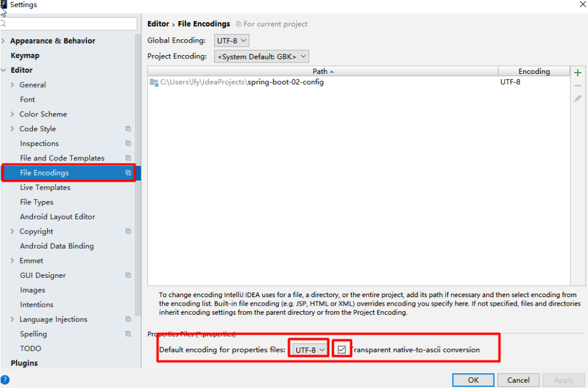
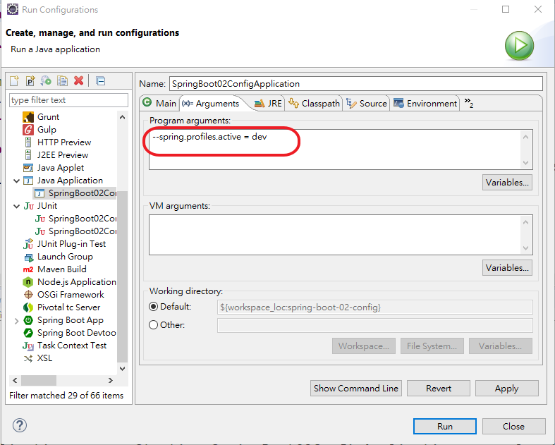
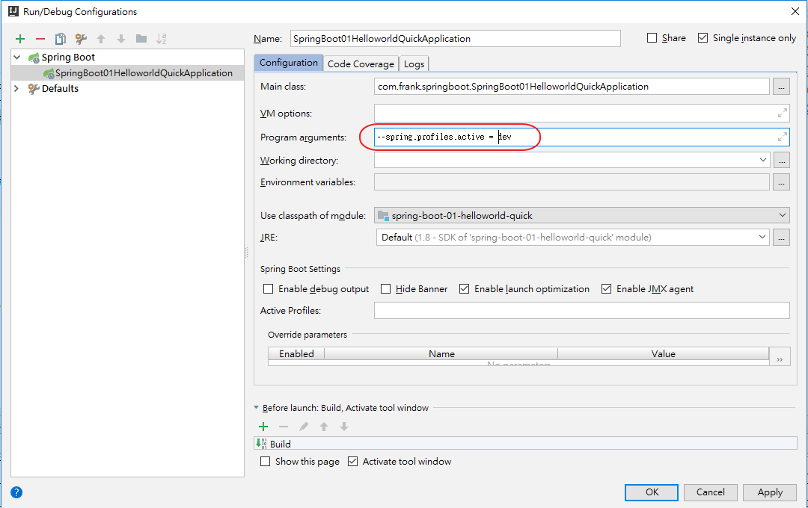
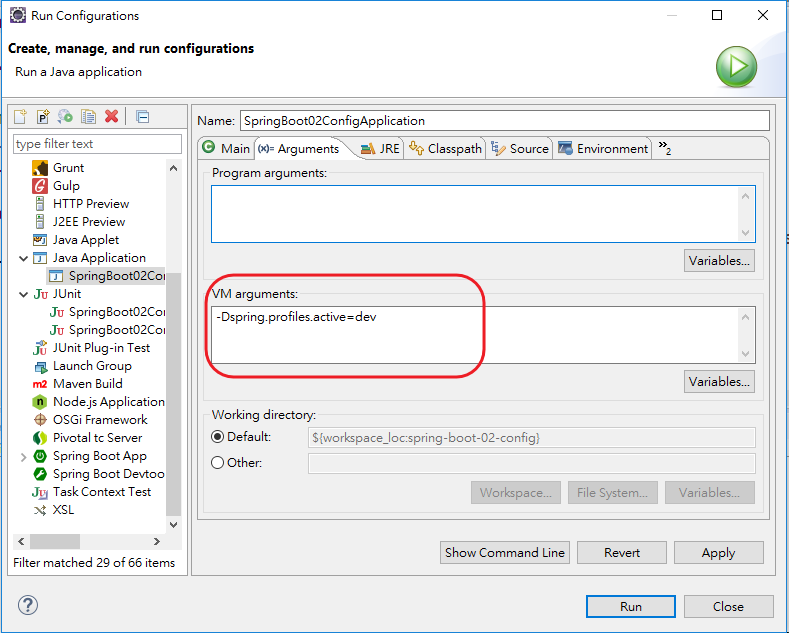
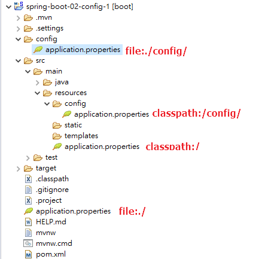
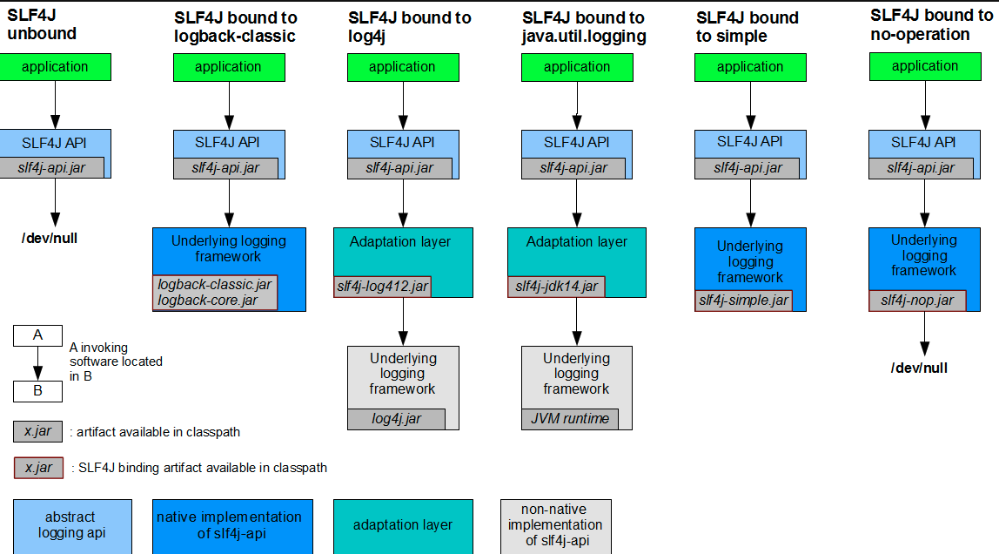

---

---

# **1. 配置文件**

SpringBoot使用一個全局的配置文件，配置文件的名稱是固定的:

​	application.properties

​	application.yaml 或 application.yml 

配置文件的作用:修改SpringBoot自動配置的默認值，SpringBoot在底層都給我們自動配置好了

YAML: (YAML Ain't Markup Language)

標記語言

​	以前的配置文件，大都使用XXXX.xml文件
​	YAML:是以數據為中心的文件，比json、XML等更適合做配置文件

​	YAML:配置的例子

```yaml
server:
    port: 8081
```


​	XML:

```xml
<server>
    <port>8081</port>
</server>
```


# 2.YAML語法:

### 1.**基本語法**

​	k:(空格)v : 表示一對件值隊	(空格必須有)

以空格的縮牌來控制層級關係，只要是左邊對其的一列數據，都是同一層級的數據

```yaml
server:
    port: 8081
    path: /hello
```

**有區分大小寫**


### 2.**值得寫法**

## 	變量:普通的值(數字、字串、布爾值)

k: v：字面量直接寫

字串默認不用加上單引號或者雙引號

"": 雙引號，不會轉譯字串裡面的特殊字，特殊字會昨為其本身要表達的意思，例如換行、空格...等

​	EX : name: "zhangsan \n lisi" ---> 輸出 : zhangsan 換行 lisi

'' : 單引號，會轉譯特殊字，特殊字最終只是一個普通的字串數據，例如直接輸出 \

​	EX : name: ‘zhangsan \n lisi’：輸出；zhangsan \n lisi


​	**物件、Map(屬性和值)(鍵值對) :**

​		K : V 在下一行來寫物件的屬性和值的關係，注意縮排

​		物件還是K: V的方式

```yaml
    friends:
    lastName: zhangsan
    age: 20
```

​		同一行的寫法:

```yaml
friends: {lastName: zhangsan,age: 18}
```

​	**陣列(List、Set)**

​		用-(空格)值表示陣列的一個元素

```yaml
pets:
    - cat
    - dog
    - pig
```

​		同一行的寫法:

```yaml
pets: [cat,dog,pig]
```

# 3.SpringBoot resources文件夾中目錄結構

1. ​	static : 保存所有的靜態資源(js、CSS、image...等)
2. ​    templates : 保存所有的模板頁面(spring boot默認jar包使用嵌入式的    tomcat ，默認不支持JSP頁面)，可以使用模板引擎(freemarker、 thymeleaf)
3. ​    application.properties：Spring Boot應用的配置文件，可以修改一些默認的配置；

# 4.配置文件注入值

配置文件

```yaml
person:
    lastName: hello
    age: 18
    boss: false
    birth: 2017/12/12
    maps: {k1: v1,k2: 12}
    lists:
        ‐ lisi
        ‐ zhaoliu
    dog:
        name: 小狗
        age: 12
```

javaBean:

```java
/**
 * 將配置文件中配置的每一個屬性值，映射到這個組件中
 * @ConfigurationProperties: 告訴springboot將本類中的所有屬性和配置文件中相關的配置進行綁定
 * 		prefix = "person" :配置文件中哪個下面的所有屬性進行一一映射
 * 
 * 只有這個組件是容器中的組件，才能使用容器提供的@ConfigurationProperties功能
 * */
@Component
@ConfigurationProperties(prefix = "person")
public class Persion {
	
	    private String lastName;
	    private Integer age;
	    private Boolean boss;
	    private Date birth;
	    private Map<String,Object> maps;
	    private List<Object> lists;
	    private Dog dog;
    
```

我們可以導入配置文件處理器，以後編寫配置就有提示了

```xml
	<!--導入配置文件處理器，配置文件進行綁定就會有提示-->
<dependency>
<groupId>org.springframework.boot</groupId>
<artifactId>spring-boot-configuration-processor</artifactId>
<optional>true</optional>
</dependency>

```

#### 1.properties配置文件在idea中默認utf-8可能會亂碼

調整



#### 2.@Value 獲取值和@ConfigurationProperties獲取值比較

|                | @ConfigurationProperties | @VALUE     |
| :------------- | ------------------------ | ---------- |
| 功能           | 批量注入配置文件中屬性   | 一個個指定 |
| 鬆散綁定       | 支持                     | 不支持     |
| SpEL           | 不支持                   | 支持       |
| JSR303數據較驗 | 支持                     | 不支持     |
| 複雜類型封裝   | 支持                     | 不支持     |

配置文件yaml還是properties他們都能獲取到值

如過說，我們只是在某個業務邏輯中需要獲取一下配置文件中的某個值，使用@Value

如果說，我們專門編寫了一個javaBean來和配置文件進行映射，我們就直接使用  @ConfigurationProperties

#### 3.配置文件注入值數據校驗

```java
@Component
@ConfigurationProperties(prefix = "person")
@Validated
public class Persion {
	/**
	* <bean class="Person">
	* 	<property name="lastName" value="字面量/${key}從環境變亮、配置文件中獲取/#{SpEL}"></property>
	* <bean/>
	*/
	   //lastName必須是郵件格式
	   // @Email
	    //@Value("${person.last-name}")
	    private String lastName;
	    //@Value("#{11*2}")
	    private Integer age;
	    //@Value("true")
	    private Boolean boss;

	    private Date birth;
	    //@Value("${person.maps}")
	    private Map<String,Object> maps;
	    private List<Object> lists;
	    private Dog dog;
```

#### 4.@PropertySource&@ImportResource&@Bean

@PropertySource: 加載指定的配置文件

```java
@PropertySource(value = {"classpath:person.properties"})
@Component
//@ConfigurationProperties(prefix = "person")
//@Validated
public class Person {

    /**
     * <bean class="Person">
     *      <property name="lastName" value="變量/${key}從環境變量、配置文件中獲取值/#{SpEL}"></property>
     * <bean/>
     */

   //lastName必需是郵件格式
   // @Email
    //@Value("${person.last-name}")
    private String lastName;
    //@Value("#{11*2}")
    private Integer age;
    //@Value("true")
    private Boolean boss;

    private Date birth;
    //@Value("${person.maps}")
    private Map<String,Object> maps;
    private List<Object> lists;
    private Dog dog;
```


@ImportResource: 導入Spring的配置文件，讓配置文件裡面的內容生效

### **方法2:**

Spring boot 裡面沒有Spring的配置文件，我們自己編寫的配置文件，也不能自動識別，想讓Spring的配置文件生效，加載進來，就把@ImportResource標註在一個配置類上

```java
//導入Spring的配置文件讓其生效
@ImportResource(locations = {"classpath:beans.xml"})
@SpringBootApplication
public class SpringBoot02ConfigApplication {

	public static void main(String[] args) {
		SpringApplication.run(SpringBoot02ConfigApplication.class, args);
	}

}
```

不用編寫Spring的配置文件

```xml
<?xml version="1.0" encoding="UTF‐8"?>
	<beans xmlns="http://www.springframework.org/schema/beans"
		xmlns:xsi="http://www.w3.org/2001/XMLSchema‐instance"
		xsi:schemaLocation="http://www.springframework.org/schema/beans
		http://www.springframework.org/schema/beans/spring‐beans.xsd">
		
			<bean id="helloService" class="com.frank.springboot.service.HelloService"></bean>
		
	</beans>
```

以上方式不是SpringBoot推薦的，SpringBoot推薦給容器中添加組件的方式，推薦使用全註解的方式(寫配置類的方式)

### **方法2:**

1.配置類@Configuration ---->Spring配置文件

2.使用@Bean給容器中添加組件

```java
/**
 * @Configuration：指名當前類是一個配置類，就是來替代之前的Spring配置文件
 *
 *配置文件中用<bean><bean/>標籤添加組件
 *
 */
@Configuration
public class MyAppConfig {

	//將方法的返回值添加到容器中，容器中這個組件默認的ID就是方法名
    @Bean
    public HelloService helloService02(){
        System.out.println("配置類@Bean給容器中添加組件了");
        return new HelloService();
    }

}
```

# 5.配置占位符

1.隨機數

```java
${random.value}、${random.int}、${random.long}
${random.int(10)}、${random.int[1024,65536]}
```

2.站位符獲取之前配置的值，如果沒有可以是用指定默認值

```properties
person.last‐name=張三${random.uuid}
person.age=${random.int}
person.birth=2017/12/15
person.boss=false
person.maps.k1=v1
person.maps.k2=14
person.lists=a,b,c
#可用:來設置默認值
person.dog.name=${person.hello:hello}_dog
person.dog.age=15
```

# 6.Profile

### **1.多Profile文件**

我們在主配置文件編寫的時候，文件名可以是application-**{profile}**.properties/yml

{profile}:可以自訂名稱，例如:DEV 、PROD....等

默認使用application.properties的配置

### **2.yml支持多文檔塊方式**

**注意:spring boot 預設是先讀取application.properties，沒有此檔案才會讀取**

**application.yml設定**

```yaml
server:
    port: 8081
spring:
    profiles:
        active: prod #用來指定運行時，要用哪個環境的設定檔
‐‐‐ #可以用---來區分3個區塊
server:
    port: 8083
spring:
    profiles: dev #指定屬於哪個環境
‐‐‐
server:
    port: 8084
spring:
    profiles: prod #指定屬於哪個環境
```

### **3.激活指定的profile方式**

1.在配置文件中指定 **spring.profiles.active**=dev (用來指定運行時，要用哪個環境的設定檔)

2..命令行: **--spring.profiles.active=dev**

**cmd/sh:**

​    java -jar spring-boot-02-config-0.0.1-SNAPSHOT.jar --spring.profiles.active=dev；

**eclipse:**



**idea:**




可以直接在測試的時候，配置傳入命令行參數

3.虛擬機參數:

-Dspring.profiles.active=dev



# 7.配置文件加載位子

springboot啟動會掃描以下位子的application.properties或者application.yml文件作為spring boot的默認配置文件

–file:./config/
–file:./ (當前項目的文件路徑下)
–classpath:/config/
–classpath:/ (類路徑下的跟目錄)

**修先順序高到低，高修先級的配置會覆蓋低優先級的配置**

**也就是說如果file:./config/裡的配置跟classpath:/裡的配置有相同參數時，以file:./config/為準**




SpringBoot會從這四個位置全部加載主配置文件，互補配置


**==我們還可以通過spring.config.location來改變默認的配置文件位子==**

**項目打包好以後，我們可以使用命令行參數的形式，啟動項目的時候來指定配置文件的新位子，指定配置文件和默認加載的這些配置文件共同起作用形成互補配置**

java -jar spring-boot-02-config-02-0.0.1-SNAPSHOT.jar --spring.config.location=G:/application.properties


# 8、外部配置加載程序

**==SpringBoot也可以從以下位子加載配置，優先即從高到低，高優先級的配置覆蓋低修先級的配置，所有的配置會形成互補配置==**

**1.命令行參數**

所有的配置都可以在命令行上進行

```
java -jar spring-boot-02-config-02-0.0.1-SNAPSHOT.jar --server.port=8087  --server.context-path=/abc
```

多個配置用空格分開， --配置項=值


2.來自java:comp/env的JNDI屬性

3.Java系統屬性（System.getProperties()）

4.操作系統環境變量

5.RandomValuePropertySource配置的random.*屬性值


==**由jar包外向jar包內進行尋找；**==

==**優先加載帶profile**==

**6.jar包 外部的application-{profile}.properties或application.yml(带spring.profile)配置文件**

**7.jar包内部的application-{profile}.properties或application.yml(带spring.profile)配置文件**


==**再來加載不帶profile**==

**8.jar包外部的application.properties或application.yml(不帶spring.profile)配置文件**

**9.jar包内部的application.properties或application.yml(不帶spring.profile)配置文件**


10.@Configuration註解上的@PropertySource

11.通過SpringApplication.setDefaultProperties指定的默認屬性

所有支持的配置加載來源；

[參考官方文檔(https://docs.spring.io/spring-boot/docs/1.5.9.RELEASE/reference/htmlsingle/#boot-features-external-config)


# 9、自動配置原理

配置文件到底能寫什麼?怎麼寫?自動配置原理

[配置文件能配置的屬性參照](https://docs.spring.io/spring-boot/docs/1.5.9.RELEASE/reference/htmlsingle/#common-application-properties)


### 1、**自動配置原理：**

1）、SpringBoot啟動的時候加載主配置類，開啟了自動配置功能 ==@EnableAutoConfiguration==

**2）、@EnableAutoConfiguration 作用：**

 -  利用EnableAutoConfigurationImportSelector給容器導入一些組件？

- 可以查看selectImports()方法的內容；

- List<String> configurations = getCandidateConfigurations(annotationMetadata,      attributes);獲取候選配置

  
  
  
  
  - ```java
  SpringFactoriesLoader.loadFactoryNames()
    掃描所有jar包類路徑下  META-INF/spring.factories
  把掃描到的這些文件的內容包裝成properties物件
    從properties中獲取到EnableAutoConfiguration.class類（類名）對應的值，然後把它們添加到容器中
  
    ```
  
    

**==將類路徑下  META-INF/sring.factories 裡面配置的所有EnableAutoConfiguration的值加入到容器中；==**

```properties
# Auto Configure
org.springframework.boot.autoconfigure.EnableAutoConfiguration=\
org.springframework.boot.autoconfigure.admin.SpringApplicationAdminJmxAutoConfiguration,\
org.springframework.boot.autoconfigure.aop.AopAutoConfiguration,\
org.springframework.boot.autoconfigure.amqp.RabbitAutoConfiguration,\
org.springframework.boot.autoconfigure.batch.BatchAutoConfiguration,\
org.springframework.boot.autoconfigure.cache.CacheAutoConfiguration,\
org.springframework.boot.autoconfigure.cassandra.CassandraAutoConfiguration,\
org.springframework.boot.autoconfigure.cloud.CloudAutoConfiguration,\
org.springframework.boot.autoconfigure.context.ConfigurationPropertiesAutoConfiguration,\
org.springframework.boot.autoconfigure.context.MessageSourceAutoConfiguration,\
org.springframework.boot.autoconfigure.context.PropertyPlaceholderAutoConfiguration,\
org.springframework.boot.autoconfigure.couchbase.CouchbaseAutoConfiguration,\
org.springframework.boot.autoconfigure.dao.PersistenceExceptionTranslationAutoConfiguration,\
org.springframework.boot.autoconfigure.data.cassandra.CassandraDataAutoConfiguration,\
org.springframework.boot.autoconfigure.data.cassandra.CassandraRepositoriesAutoConfiguration,\
org.springframework.boot.autoconfigure.data.couchbase.CouchbaseDataAutoConfiguration,\
org.springframework.boot.autoconfigure.data.couchbase.CouchbaseRepositoriesAutoConfiguration,\
org.springframework.boot.autoconfigure.data.elasticsearch.ElasticsearchAutoConfiguration,\
org.springframework.boot.autoconfigure.data.elasticsearch.ElasticsearchDataAutoConfiguration,\
org.springframework.boot.autoconfigure.data.elasticsearch.ElasticsearchRepositoriesAutoConfiguration,\
org.springframework.boot.autoconfigure.data.jpa.JpaRepositoriesAutoConfiguration,\
org.springframework.boot.autoconfigure.data.ldap.LdapDataAutoConfiguration,\
org.springframework.boot.autoconfigure.data.ldap.LdapRepositoriesAutoConfiguration,\
org.springframework.boot.autoconfigure.data.mongo.MongoDataAutoConfiguration,\
org.springframework.boot.autoconfigure.data.mongo.MongoRepositoriesAutoConfiguration,\
org.springframework.boot.autoconfigure.data.neo4j.Neo4jDataAutoConfiguration,\
org.springframework.boot.autoconfigure.data.neo4j.Neo4jRepositoriesAutoConfiguration,\
org.springframework.boot.autoconfigure.data.solr.SolrRepositoriesAutoConfiguration,\
org.springframework.boot.autoconfigure.data.redis.RedisAutoConfiguration,\
org.springframework.boot.autoconfigure.data.redis.RedisRepositoriesAutoConfiguration,\
org.springframework.boot.autoconfigure.data.rest.RepositoryRestMvcAutoConfiguration,\
org.springframework.boot.autoconfigure.data.web.SpringDataWebAutoConfiguration,\
org.springframework.boot.autoconfigure.elasticsearch.jest.JestAutoConfiguration,\
org.springframework.boot.autoconfigure.freemarker.FreeMarkerAutoConfiguration,\
org.springframework.boot.autoconfigure.gson.GsonAutoConfiguration,\
org.springframework.boot.autoconfigure.h2.H2ConsoleAutoConfiguration,\
org.springframework.boot.autoconfigure.hateoas.HypermediaAutoConfiguration,\
org.springframework.boot.autoconfigure.hazelcast.HazelcastAutoConfiguration,\
org.springframework.boot.autoconfigure.hazelcast.HazelcastJpaDependencyAutoConfiguration,\
org.springframework.boot.autoconfigure.info.ProjectInfoAutoConfiguration,\
org.springframework.boot.autoconfigure.integration.IntegrationAutoConfiguration,\
org.springframework.boot.autoconfigure.jackson.JacksonAutoConfiguration,\
org.springframework.boot.autoconfigure.jdbc.DataSourceAutoConfiguration,\
org.springframework.boot.autoconfigure.jdbc.JdbcTemplateAutoConfiguration,\
org.springframework.boot.autoconfigure.jdbc.JndiDataSourceAutoConfiguration,\
org.springframework.boot.autoconfigure.jdbc.XADataSourceAutoConfiguration,\
org.springframework.boot.autoconfigure.jdbc.DataSourceTransactionManagerAutoConfiguration,\
org.springframework.boot.autoconfigure.jms.JmsAutoConfiguration,\
org.springframework.boot.autoconfigure.jmx.JmxAutoConfiguration,\
org.springframework.boot.autoconfigure.jms.JndiConnectionFactoryAutoConfiguration,\
org.springframework.boot.autoconfigure.jms.activemq.ActiveMQAutoConfiguration,\
org.springframework.boot.autoconfigure.jms.artemis.ArtemisAutoConfiguration,\
org.springframework.boot.autoconfigure.flyway.FlywayAutoConfiguration,\
org.springframework.boot.autoconfigure.groovy.template.GroovyTemplateAutoConfiguration,\
org.springframework.boot.autoconfigure.jersey.JerseyAutoConfiguration,\
org.springframework.boot.autoconfigure.jooq.JooqAutoConfiguration,\
org.springframework.boot.autoconfigure.kafka.KafkaAutoConfiguration,\
org.springframework.boot.autoconfigure.ldap.embedded.EmbeddedLdapAutoConfiguration,\
org.springframework.boot.autoconfigure.ldap.LdapAutoConfiguration,\
org.springframework.boot.autoconfigure.liquibase.LiquibaseAutoConfiguration,\
org.springframework.boot.autoconfigure.mail.MailSenderAutoConfiguration,\
org.springframework.boot.autoconfigure.mail.MailSenderValidatorAutoConfiguration,\
org.springframework.boot.autoconfigure.mobile.DeviceResolverAutoConfiguration,\
org.springframework.boot.autoconfigure.mobile.DeviceDelegatingViewResolverAutoConfiguration,\
org.springframework.boot.autoconfigure.mobile.SitePreferenceAutoConfiguration,\
org.springframework.boot.autoconfigure.mongo.embedded.EmbeddedMongoAutoConfiguration,\
org.springframework.boot.autoconfigure.mongo.MongoAutoConfiguration,\
org.springframework.boot.autoconfigure.mustache.MustacheAutoConfiguration,\
org.springframework.boot.autoconfigure.orm.jpa.HibernateJpaAutoConfiguration,\
org.springframework.boot.autoconfigure.reactor.ReactorAutoConfiguration,\
org.springframework.boot.autoconfigure.security.SecurityAutoConfiguration,\
org.springframework.boot.autoconfigure.security.SecurityFilterAutoConfiguration,\
org.springframework.boot.autoconfigure.security.FallbackWebSecurityAutoConfiguration,\
org.springframework.boot.autoconfigure.security.oauth2.OAuth2AutoConfiguration,\
org.springframework.boot.autoconfigure.sendgrid.SendGridAutoConfiguration,\
org.springframework.boot.autoconfigure.session.SessionAutoConfiguration,\
org.springframework.boot.autoconfigure.social.SocialWebAutoConfiguration,\
org.springframework.boot.autoconfigure.social.FacebookAutoConfiguration,\
org.springframework.boot.autoconfigure.social.LinkedInAutoConfiguration,\
org.springframework.boot.autoconfigure.social.TwitterAutoConfiguration,\
org.springframework.boot.autoconfigure.solr.SolrAutoConfiguration,\
org.springframework.boot.autoconfigure.thymeleaf.ThymeleafAutoConfiguration,\
org.springframework.boot.autoconfigure.transaction.TransactionAutoConfiguration,\
org.springframework.boot.autoconfigure.transaction.jta.JtaAutoConfiguration,\
org.springframework.boot.autoconfigure.validation.ValidationAutoConfiguration,\
org.springframework.boot.autoconfigure.web.DispatcherServletAutoConfiguration,\
org.springframework.boot.autoconfigure.web.EmbeddedServletContainerAutoConfiguration,\
org.springframework.boot.autoconfigure.web.ErrorMvcAutoConfiguration,\
org.springframework.boot.autoconfigure.web.HttpEncodingAutoConfiguration,\
org.springframework.boot.autoconfigure.web.HttpMessageConvertersAutoConfiguration,\
org.springframework.boot.autoconfigure.web.MultipartAutoConfiguration,\
org.springframework.boot.autoconfigure.web.ServerPropertiesAutoConfiguration,\
org.springframework.boot.autoconfigure.web.WebClientAutoConfiguration,\
org.springframework.boot.autoconfigure.web.WebMvcAutoConfiguration,\
org.springframework.boot.autoconfigure.websocket.WebSocketAutoConfiguration,\
org.springframework.boot.autoconfigure.websocket.WebSocketMessagingAutoConfiguration,\
org.springframework.boot.autoconfigure.webservices.WebServicesAutoConfiguration
```

每一個這樣的  xxxAutoConfiguration淚都是容器中的一個組件，都加入到容器中；用他們來做自動配置；

3）、每一個自動配置類進行自動配置功能；

4）、以**HttpEncodingAutoConfiguration（Http編碼自動配置）**為例解釋自動配置原理；

```java
@Configuration   //表示這是一個配置類，以前編寫的配置文件一樣，也可以給容器添加組件
@EnableConfigurationProperties(HttpEncodingProperties.class)  //啟動指定類的ConfigurationProperties功能，將配置文件中對應的值和HttpEncodingProperties綁定起來，並把HttpEncodingProperties加入倒IOC容器中

@ConditionalOnWebApplication //Spring底層@Conditional註解，根據不同的條件，如果滿足指定的條件，整個配置類裡面的配置就會生效， @ConditionalOnWebApplication也就是判斷當前應用是否是WEB應用，如果是，當前配置類生效

@ConditionalOnClass(CharacterEncodingFilter.class)  //判斷當前項目有沒有這個類CharacterEncodingFilter，SpringMVC中進行亂碼解決的過濾器
@ConditionalOnProperty(prefix = "spring.http.encoding", value = "enabled", matchIfMissing = true)  //判斷配置文件是否存在某個配置  spring.http.encoding.enabled。matchIfMissing:如果不存在，判斷也是成立的
//即使我們配置文件中不配置spring.http.encoding.enabled=true，也是默認生效的

public class HttpEncodingAutoConfiguration {
  
    //他已經和SpringBoot的配置文件映射了
  	private final HttpEncodingProperties properties;
  
    //只有一個有參數建構式的情況下，參數的值就會從容器中拿
  	public HttpEncodingAutoConfiguration(HttpEncodingProperties properties) {
		this.properties = properties;
	}
  
    @Bean   //給容器中添加一個組件，這個組件的某些值需要從properties中獲取
	@ConditionalOnMissingBean(CharacterEncodingFilter.class) 
    //判斷容器沒有這個組件?
	public CharacterEncodingFilter characterEncodingFilter() {
		CharacterEncodingFilter filter = new OrderedCharacterEncodingFilter();
		filter.setEncoding(this.properties.getCharset().name());
		filter.setForceRequestEncoding(this.properties.shouldForce(Type.REQUEST));
		filter.setForceResponseEncoding(this.properties.shouldForce(Type.RESPONSE));
		return filter;
	}
```

根據當前不同的條件判斷，決定這個配置類是否生效?

一但這個配置類生效，這個配置類就會給容器中添加各種組件，這些組件的屬性是從對應的properties類中獲取的，這些類裡面的每一個屬性又是和配置文件綁定的

5)、所有在配置文件中能配置的屬性都是在xxxxProperties類中封裝的，配置文件能配置什麼就可以參照某個功能對應的這個屬性類

```java
@ConfigurationProperties(prefix = "spring.http.encoding") 
//從配置文件中獲取指定的值和bean的屬性進行綁定
public class HttpEncodingProperties {

   public static final Charset DEFAULT_CHARSET = Charset.forName("UTF-8");
```


給容器中的自動配置類添加組件的時候，會從 類中獲取某些屬性。我們就可以在配置文件中指定這些屬性值

**精隨：**

​	**1）、SpringBoot啟動會加載大量的自動配置類**

​	**2）、我們看我們需要的功能有沒有SpringBoot 默認寫好的自動配置類；**

​	**3）、我們在來看這個自動配置類中到底配置了那些組件，(只要我們要用的組件有，我們就不需要再來配置了)**

​	**4）、給容器中的自動配置類添加組件的時候，會從properties類中獲取某些屬性。我們就可以在配置文件中指定這些屬性值**


xxxxAutoConfigurartion：自動配置類；

給容器中添加組件

xxxxProperties:封裝配置文件中相關屬性；


### 2、細節


#### 1、@Conditional原生註解（Spring註解版原生的@Conditional作用）

作用:必需是@Conditional指定的條件成立，才給容器中添加組件，配置類裡面的所有內容才會生效

| @Conditional擴展註解            | 作用（判斷是否滿足當前指定條件）                 |
| ------------------------------- | ------------------------------------------------ |
| @ConditionalOnJava              | 系統的java版本是否符合要求                       |
| @ConditionalOnBean              | 容器中存在指定的Bean；                           |
| @ConditionalOnMissingBean       | 容器中不存在指定的Bean；                         |
| @ConditionalOnExpression        | 滿足指定的SpEL表達式                             |
| @ConditionalOnClass             | 系統中有指定的類                                 |
| @ConditionalOnMissingClass      | 系統中沒有指定的類                               |
| @ConditionalOnSingleCandidate   | 容器中只有一個指定的Bean，或者這個Bean是首選Bean |
| @ConditionalOnProperty          | 系統中指定的屬性是否有指定的值                   |
| @ConditionalOnResource          | 類路徑下是否存在指定資源文件                     |
| @ConditionalOnWebApplication    | 當前是WEB環境                                    |
| @ConditionalOnNotWebApplication | 當前不是web環境                                  |
| @ConditionalOnJndi              | 存在指定的JNDI                                   |

### **自動配置類必須在一定的條件下才能生效**

我們怎麼知道那些自動配置類生效?

**我們可以通過在application.properties配值文件裡配置debug=true屬性，來讓控制台打印自動配置報告，這樣我們就可以很方便的知道那些自動配置類生效**

```java
=========================
AUTO-CONFIGURATION REPORT
=========================


Positive matches:（自動配置類匹配到的，有啟用的）
-----------------

   DispatcherServletAutoConfiguration matched:
      - @ConditionalOnClass found required class 'org.springframework.web.servlet.DispatcherServlet'; @ConditionalOnMissingClass did not find unwanted class (OnClassCondition)
      - @ConditionalOnWebApplication (required) found StandardServletEnvironment (OnWebApplicationCondition)
        
    
Negative matches:（沒有啟用的，沒有匹配的自動配置類）
-----------------

   ActiveMQAutoConfiguration:
      Did not match:
         - @ConditionalOnClass did not find required classes 'javax.jms.ConnectionFactory', 'org.apache.activemq.ActiveMQConnectionFactory' (OnClassCondition)

   AopAutoConfiguration:
      Did not match:
         - @ConditionalOnClass did not find required classes 'org.aspectj.lang.annotation.Aspect', 'org.aspectj.lang.reflect.Advice' (OnClassCondition)
        
```


# 三、日誌

## 1、日志框架

**市面上的日誌框架**

JUL、JCL、Jboss-logging、logback、log4j、log4j2、slf4j....

| 日誌接口                                                     | 日誌實作                                             |
| ------------------------------------------------------------ | ---------------------------------------------------- |
| ~~JCL（Jakarta  Commons Logging）~~    SLF4j（Simple  Logging Facade for Java）    **~~jboss-logging~~** | Log4j  JUL（java.util.logging）  Log4j2  **Logback** |

左邊選一個門面（抽象成）、右邊選一個實作；

日誌接口 ：  SLF4J；

日誌實作：Logback；


SpringBoot：底層式Spring框架，Spring框架默認是用JCL‘

​	**==SpringBoot選 SLF4j和logback；==**


## 2、SLF4j使用

### 1、如何在系統中使用SLF4j   https://www.slf4j.org

以後開發的時候，日誌紀錄方法的調用，不應該來直接調用日誌的實現類，而是調用日誌抽象層裡面的方法

首先給系統裡面導入slf4j的jar和  logback的實現jar

```java
import org.slf4j.Logger;
import org.slf4j.LoggerFactory;

public class HelloWorld {
  public static void main(String[] args) {
    Logger logger = LoggerFactory.getLogger(HelloWorld.class);
    logger.info("Hello World");
  }
}
```

圖示；



每一個日誌的實現框架都有自己的配置文件，**使用slf4j以後，配置文件還是做成日誌實現框架自己本身的配置文件**

### 2、遺留問題

a（slf4j+logback）: Spring（commons-logging）、Hibernate（jboss-logging）、MyBatis、xxxx

統一日誌紀錄，即使是別的框架和我們憶起統一使用slf4j進行輸出?


**如何讓系統中所有的日誌都統一到slf4j**

1.將系統中其他的日誌框架先排除出去

2.用中間包來替換原有的日誌框架

3.我們導入slf4j其他的實現


## 3、SpringBoot日誌關係

```xml
		<dependency>
			<groupId>org.springframework.boot</groupId>
			<artifactId>spring-boot-starter</artifactId>
		</dependency>
```


SpringBoot使用它來做日誌功能；

```xml
	<dependency>
			<groupId>org.springframework.boot</groupId>
			<artifactId>spring-boot-starter-logging</artifactId>
		</dependency>
```

底層依賴關係


總結：

​	1）、SpringBoot底層也是用slf4j+logback的方式進行日誌紀錄

​	2）、SpringBoot也把其他日誌都替換成了slf4j；

​	3）、中間替換包？

```java
@SuppressWarnings("rawtypes")
public abstract class LogFactory {

    static String UNSUPPORTED_OPERATION_IN_JCL_OVER_SLF4J = "http://www.slf4j.org/codes.html#unsupported_operation_in_jcl_over_slf4j";

    static LogFactory logFactory = new SLF4JLogFactory();
```


​	4）、如果我們要引入其他框架?一定要把這個框架的默認日誌依賴移除掉?

​			Spring框架用的是commons-logging；

```xml
		<dependency>
			<groupId>org.springframework</groupId>
			<artifactId>spring-core</artifactId>
			<exclusions>
				<exclusion>
					<groupId>commons-logging</groupId>
					<artifactId>commons-logging</artifactId>
				</exclusion>
			</exclusions>
		</dependency>
```


### **SpringBoot能自動匹配所有日誌，而且底層使用slf4j+logback的方式記錄日誌，引入其他框架的時候，只需要把這個框架依賴的日誌框架排除掉即可**

## 4、日誌使用；

### 1、默認配置

SpringBoot默認幫我們配置好了日誌

```java
	//紀錄器
	Logger logger = LoggerFactory.getLogger(getClass());
	@Test
	public void contextLoads() {
		//System.out.println();

		//日誌級別；
		//由低到高   trace<debug<info<warn<error
        //可以調整輸出的日誌級別，日誌就只會在這個級別已以後的高級別生效
		logger.trace("這是trace日誌...");
		logger.debug("這是debug日誌...");
		//SpringBoot默認給我們使用的是info級別的，沒有指定級別的就用SpringBoot默認規定的級別，root級別
		logger.info("這是info日誌...");
		logger.warn("這是warn日誌...");
		logger.error("這是error日誌...");


	}
```


        日誌輸出格式：
    		%d表示日期時間，
    		%thread表示執行緒名，
    		%-5level：級別從左顯示5個字符寬度
    		%logger{50} 表示logger名子最長50個字，否則案這據點分割。 
    		%msg：日誌消息，
    		%n是換行
        -->
        %d{yyyy-MM-dd HH:mm:ss.SSS} [%thread] %-5level %logger{50} - %msg%n
SpringBoot修改日誌的默認配置

```properties
#com.frank 可以指定包名
logging.level.com.frank=trace


#logging.path=
#不指定路徑，就在當前項目下生成log日誌
#可以指定完整的路徑:E:/spring.log ，就會在E槽生成
logging.file=E:/spring.log

#在當前的磁盤的根路徑下創建 spring文件夾和裡面的log文件夾，使用spring.log作為默認文件
logging.path=/spring/log

#  在控制台输出的日志的格式
logging.pattern.console= %d{yyyy-MM-dd HH:mm:ss.SSS} [%thread] %-5level %logger{50} - %msg%n
# 指定文件中日志输出的格式
logging.pattern.file= %d{yyyy-MM-dd HH:mm:ss.SSS} [%thread] %-5level %logger{50} - %msg%n
```

| logging.file | logging.path | Example  | Description                        |
| ------------ | ------------ | -------- | ---------------------------------- |
| (none)       | (none)       |          | 指在控制台輸出                     |
| 指定文件名   | (none)       | my.log   | 輸出日誌到my.log文件               |
| (none)       | 指定目錄     | /var/log | 輸出到指定目錄的 spring.log 文件中 |

### 2、指定配置

給類路徑下放上每個日誌框架自己的配置文件即可，SpringBoot就不使用他默認配置的了

| Logging System          | Customization                            |
| ----------------------- | ---------------------------------------- |
| Logback                 | `logback-spring.xml`, `logback-spring.groovy`, `logback.xml` or `logback.groovy` |
| Log4j2                  | `log4j2-spring.xml` or `log4j2.xml`      |
| JDK (Java Util Logging) | `logging.properties`                     |

logback.xml：直接就被日誌框架識別了；

**logback-spring.xml**：日誌框架就不直接加載日誌的配置項，由SpringBoot解析日誌，可以使用SpringBoot的高級Profile功能

```xml
<springProfile name="staging">
    <!-- configuration to be enabled when the "staging" profile is active -->
    可以指定某段配置指在某個環境下生效
</springProfile>

```

如：

```xml
<appender name="stdout" class="ch.qos.logback.core.ConsoleAppender">
        <!--
            %d表示日期時間，
            %thread表示執行緒名，
            %-5level：級別從左顯示5個字符寬度
            %logger{50} 表示logger名子最長50個字，否則案這據點分割。 
            %msg：日誌消息，
            %n是換行
        -->
        <layout class="ch.qos.logback.classic.PatternLayout">
            <springProfile name="dev">
                <pattern>%d{yyyy-MM-dd HH:mm:ss.SSS} ----> [%thread] ---> %-5level %logger{50} - %msg%n</pattern>
            </springProfile>
            <springProfile name="!dev">
                <pattern>%d{yyyy-MM-dd HH:mm:ss.SSS} ==== [%thread] ==== %-5level %logger{50} - %msg%n</pattern>
            </springProfile>
        </layout>
    </appender>
```


如果使用logback.xml作為日誌配置文件，還要使用profile功能，會有以下錯誤

 `no applicable action for [springProfile]`

## 5、切換日誌框架

可以按照slf4j的日誌匹配圖，進行相關的切換

slf4j+log4j的方式；

```xml
<dependency>
  <groupId>org.springframework.boot</groupId>
  <artifactId>spring-boot-starter-web</artifactId>
  <exclusions>
    <exclusion>
      <artifactId>logback-classic</artifactId>
      <groupId>ch.qos.logback</groupId>
    </exclusion>
    <exclusion>
      <artifactId>log4j-over-slf4j</artifactId>
      <groupId>org.slf4j</groupId>
    </exclusion>
  </exclusions>
</dependency>

<dependency>
  <groupId>org.slf4j</groupId>
  <artifactId>slf4j-log4j12</artifactId>
</dependency>

```


切換為log4j2

```xml
   <dependency>
            <groupId>org.springframework.boot</groupId>
            <artifactId>spring-boot-starter-web</artifactId>
            <exclusions>
                <exclusion>
                    <artifactId>spring-boot-starter-logging</artifactId>
                    <groupId>org.springframework.boot</groupId>
                </exclusion>
            </exclusions>
        </dependency>

<dependency>
  <groupId>org.springframework.boot</groupId>
  <artifactId>spring-boot-starter-log4j2</artifactId>
</dependency>
```

-----------------