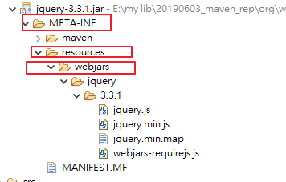

---

---

# **1. 配置文件**

SpringBoot使用一個全局的配置文件，配置文件的名稱是固定的:

​	application.properties

​	application.yaml 或 application.yml 

配置文件的作用:修改SpringBoot自動配置的默認值，SpringBoot在底層都給我們自動配置好了

YAML: (YAML Ain't Markup Language)

標記語言

​	以前的配置文件，大都使用XXXX.xml文件
​	YAML:是以數據為中心的文件，比json、XML等更適合做配置文件

​	YAML:配置的例子

```yaml
server:
    port: 8081
```


​	XML:

```xml
<server>
    <port>8081</port>
</server>
```


# 2.YAML語法:

### 1.**基本語法**

​	k:(空格)v : 表示一對件值隊	(空格必須有)

以空格的縮牌來控制層級關係，只要是左邊對其的一列數據，都是同一層級的數據

```yaml
server:
    port: 8081
    path: /hello
```

**有區分大小寫**


### 2.**值得寫法**

## 	變量:普通的值(數字、字串、布爾值)

k: v：字面量直接寫

字串默認不用加上單引號或者雙引號

"": 雙引號，不會轉譯字串裡面的特殊字，特殊字會昨為其本身要表達的意思，例如換行、空格...等

​	EX : name: "zhangsan \n lisi" ---> 輸出 : zhangsan 換行 lisi

'' : 單引號，會轉譯特殊字，特殊字最終只是一個普通的字串數據，例如直接輸出 \

​	EX : name: ‘zhangsan \n lisi’：輸出；zhangsan \n lisi


​	**物件、Map(屬性和值)(鍵值對) :**

​		K : V 在下一行來寫物件的屬性和值的關係，注意縮排

​		物件還是K: V的方式

```yaml
    friends:
    lastName: zhangsan
    age: 20
```

​		同一行的寫法:

```yaml
friends: {lastName: zhangsan,age: 18}
```

​	**陣列(List、Set)**

​		用-(空格)值表示陣列的一個元素

```yaml
pets:
    - cat
    - dog
    - pig
```

​		同一行的寫法:

```yaml
pets: [cat,dog,pig]
```

# 3.SpringBoot resources文件夾中目錄結構

1. ​	static : 保存所有的靜態資源(js、CSS、image...等)
2. ​    templates : 保存所有的模板頁面(spring boot默認jar包使用嵌入式的    tomcat ，默認不支持JSP頁面)，可以使用模板引擎(freemarker、 thymeleaf)
3. ​    application.properties：Spring Boot應用的配置文件，可以修改一些默認的配置；

# 4.配置文件注入值

配置文件

```yaml
person:
    lastName: hello
    age: 18
    boss: false
    birth: 2017/12/12
    maps: {k1: v1,k2: 12}
    lists:
        ‐ lisi
        ‐ zhaoliu
    dog:
        name: 小狗
        age: 12
```

javaBean:

```java
/**
 * 將配置文件中配置的每一個屬性值，映射到這個組件中
 * @ConfigurationProperties: 告訴springboot將本類中的所有屬性和配置文件中相關的配置進行綁定
 * 		prefix = "person" :配置文件中哪個下面的所有屬性進行一一映射
 * 
 * 只有這個組件是容器中的組件，才能使用容器提供的@ConfigurationProperties功能
 * */
@Component
@ConfigurationProperties(prefix = "person")
public class Persion {
	
	    private String lastName;
	    private Integer age;
	    private Boolean boss;
	    private Date birth;
	    private Map<String,Object> maps;
	    private List<Object> lists;
	    private Dog dog;
    
```

我們可以導入配置文件處理器，以後編寫配置就有提示了

```xml
	<!--導入配置文件處理器，配置文件進行綁定就會有提示-->
<dependency>
<groupId>org.springframework.boot</groupId>
<artifactId>spring-boot-configuration-processor</artifactId>
<optional>true</optional>
</dependency>

```

#### 1.properties配置文件在idea中默認utf-8可能會亂碼

調整


#### 2.@Value 獲取值和@ConfigurationProperties獲取值比較

|                | @ConfigurationProperties | @VALUE     |
| :------------- | ------------------------ | ---------- |
| 功能           | 批量注入配置文件中屬性   | 一個個指定 |
| 鬆散綁定       | 支持                     | 不支持     |
| SpEL           | 不支持                   | 支持       |
| JSR303數據較驗 | 支持                     | 不支持     |
| 複雜類型封裝   | 支持                     | 不支持     |

配置文件yaml還是properties他們都能獲取到值

如過說，我們只是在某個業務邏輯中需要獲取一下配置文件中的某個值，使用@Value

如果說，我們專門編寫了一個javaBean來和配置文件進行映射，我們就直接使用  @ConfigurationProperties

#### 3.配置文件注入值數據校驗

```java
@Component
@ConfigurationProperties(prefix = "person")
@Validated
public class Persion {
	/**
	* <bean class="Person">
	* 	<property name="lastName" value="字面量/${key}從環境變亮、配置文件中獲取/#{SpEL}"></property>
	* <bean/>
	*/
	   //lastName必須是郵件格式
	   // @Email
	    //@Value("${person.last-name}")
	    private String lastName;
	    //@Value("#{11*2}")
	    private Integer age;
	    //@Value("true")
	    private Boolean boss;

	    private Date birth;
	    //@Value("${person.maps}")
	    private Map<String,Object> maps;
	    private List<Object> lists;
	    private Dog dog;
```

#### 4.@PropertySource&@ImportResource&@Bean

@PropertySource: 加載指定的配置文件

```java
@PropertySource(value = {"classpath:person.properties"})
@Component
//@ConfigurationProperties(prefix = "person")
//@Validated
public class Person {

    /**
     * <bean class="Person">
     *      <property name="lastName" value="變量/${key}從環境變量、配置文件中獲取值/#{SpEL}"></property>
     * <bean/>
     */

   //lastName必需是郵件格式
   // @Email
    //@Value("${person.last-name}")
    private String lastName;
    //@Value("#{11*2}")
    private Integer age;
    //@Value("true")
    private Boolean boss;

    private Date birth;
    //@Value("${person.maps}")
    private Map<String,Object> maps;
    private List<Object> lists;
    private Dog dog;
```


@ImportResource: 導入Spring的配置文件，讓配置文件裡面的內容生效

### **方法2:**

Spring boot 裡面沒有Spring的配置文件，我們自己編寫的配置文件，也不能自動識別，想讓Spring的配置文件生效，加載進來，就把@ImportResource標註在一個配置類上

```java
//導入Spring的配置文件讓其生效
@ImportResource(locations = {"classpath:beans.xml"})
@SpringBootApplication
public class SpringBoot02ConfigApplication {

	public static void main(String[] args) {
		SpringApplication.run(SpringBoot02ConfigApplication.class, args);
	}

}
```

不用編寫Spring的配置文件

```xml
<?xml version="1.0" encoding="UTF‐8"?>
	<beans xmlns="http://www.springframework.org/schema/beans"
		xmlns:xsi="http://www.w3.org/2001/XMLSchema‐instance"
		xsi:schemaLocation="http://www.springframework.org/schema/beans
		http://www.springframework.org/schema/beans/spring‐beans.xsd">
		
			<bean id="helloService" class="com.frank.springboot.service.HelloService"></bean>
		
	</beans>
```

以上方式不是SpringBoot推薦的，SpringBoot推薦給容器中添加組件的方式，推薦使用全註解的方式(寫配置類的方式)

### **方法2:**

1.配置類@Configuration ---->Spring配置文件

2.使用@Bean給容器中添加組件

```java
/**
 * @Configuration：指名當前類是一個配置類，就是來替代之前的Spring配置文件
 *
 *配置文件中用<bean><bean/>標籤添加組件
 *
 */
@Configuration
public class MyAppConfig {

	//將方法的返回值添加到容器中，容器中這個組件默認的ID就是方法名
    @Bean
    public HelloService helloService02(){
        System.out.println("配置類@Bean給容器中添加組件了");
        return new HelloService();
    }

}
```

# 5.配置占位符

1.隨機數

```java
${random.value}、${random.int}、${random.long}
${random.int(10)}、${random.int[1024,65536]}
```

2.站位符獲取之前配置的值，如果沒有可以是用指定默認值

```properties
person.last‐name=張三${random.uuid}
person.age=${random.int}
person.birth=2017/12/15
person.boss=false
person.maps.k1=v1
person.maps.k2=14
person.lists=a,b,c
#可用:來設置默認值
person.dog.name=${person.hello:hello}_dog
person.dog.age=15
```

# 6.Profile

### **1.多Profile文件**

我們在主配置文件編寫的時候，文件名可以是application-**{profile}**.properties/yml

{profile}:可以自訂名稱，例如:DEV 、PROD....等

默認使用application.properties的配置

### **2.yml支持多文檔塊方式**

**注意:spring boot 預設是先讀取application.properties，沒有此檔案才會讀取**

**application.yml設定**

```yaml
server:
    port: 8081
spring:
    profiles:
        active: prod #用來指定運行時，要用哪個環境的設定檔
‐‐‐ #可以用---來區分3個區塊
server:
    port: 8083
spring:
    profiles: dev #指定屬於哪個環境
‐‐‐
server:
    port: 8084
spring:
    profiles: prod #指定屬於哪個環境
```

### **3.激活指定的profile方式**

1.在配置文件中指定 **spring.profiles.active**=dev (用來指定運行時，要用哪個環境的設定檔)

2..命令行: **--spring.profiles.active=dev**

**cmd/sh:**

​    java -jar spring-boot-02-config-0.0.1-SNAPSHOT.jar --spring.profiles.active=dev；

**eclipse:**


**idea:**


可以直接在測試的時候，配置傳入命令行參數

3.虛擬機參數:

-Dspring.profiles.active=dev


# 7.配置文件加載位子

springboot啟動會掃描以下位子的application.properties或者application.yml文件作為spring boot的默認配置文件

–file:./config/
–file:./ (當前項目的文件路徑下)
–classpath:/config/
–classpath:/ (類路徑下的跟目錄)

**修先順序高到低，高修先級的配置會覆蓋低優先級的配置**

**也就是說如果file:./config/裡的配置跟classpath:/裡的配置有相同參數時，以file:./config/為準**


SpringBoot會從這四個位置全部加載主配置文件，互補配置


**==我們還可以通過spring.config.location來改變默認的配置文件位子==**

**項目打包好以後，我們可以使用命令行參數的形式，啟動項目的時候來指定配置文件的新位子，指定配置文件和默認加載的這些配置文件共同起作用形成互補配置**

java -jar spring-boot-02-config-02-0.0.1-SNAPSHOT.jar --spring.config.location=G:/application.properties


# 8、外部配置加載程序

**==SpringBoot也可以從以下位子加載配置，優先即從高到低，高優先級的配置覆蓋低修先級的配置，所有的配置會形成互補配置==**

**1.命令行參數**

所有的配置都可以在命令行上進行

```
java -jar spring-boot-02-config-02-0.0.1-SNAPSHOT.jar --server.port=8087  --server.context-path=/abc
```

多個配置用空格分開， --配置項=值


2.來自java:comp/env的JNDI屬性

3.Java系統屬性（System.getProperties()）

4.操作系統環境變量

5.RandomValuePropertySource配置的random.*屬性值


==**由jar包外向jar包內進行尋找；**==

==**優先加載帶profile**==

**6.jar包 外部的application-{profile}.properties或application.yml(带spring.profile)配置文件**

**7.jar包内部的application-{profile}.properties或application.yml(带spring.profile)配置文件**


==**再來加載不帶profile**==

**8.jar包外部的application.properties或application.yml(不帶spring.profile)配置文件**

**9.jar包内部的application.properties或application.yml(不帶spring.profile)配置文件**


10.@Configuration註解上的@PropertySource

11.通過SpringApplication.setDefaultProperties指定的默認屬性

所有支持的配置加載來源；

[參考官方文檔(https://docs.spring.io/spring-boot/docs/1.5.9.RELEASE/reference/htmlsingle/#boot-features-external-config)


# 9、自動配置原理

配置文件到底能寫什麼?怎麼寫?自動配置原理

[配置文件能配置的屬性參照](https://docs.spring.io/spring-boot/docs/1.5.9.RELEASE/reference/htmlsingle/#common-application-properties)


### 1、**自動配置原理：**

1）、SpringBoot啟動的時候加載主配置類，開啟了自動配置功能 ==@EnableAutoConfiguration==

**2）、@EnableAutoConfiguration 作用：**

 -  利用EnableAutoConfigurationImportSelector給容器導入一些組件？

- 可以查看selectImports()方法的內容；

- List<String> configurations = getCandidateConfigurations(annotationMetadata,      attributes);獲取候選配置

  
  
  
  
  - ```java
  SpringFactoriesLoader.loadFactoryNames()
    掃描所有jar包類路徑下  META-INF/spring.factories
  把掃描到的這些文件的內容包裝成properties物件
    從properties中獲取到EnableAutoConfiguration.class類（類名）對應的值，然後把它們添加到容器中
  
    ```
  
    

**==將類路徑下  META-INF/sring.factories 裡面配置的所有EnableAutoConfiguration的值加入到容器中；==**

```properties
# Auto Configure
org.springframework.boot.autoconfigure.EnableAutoConfiguration=\
org.springframework.boot.autoconfigure.admin.SpringApplicationAdminJmxAutoConfiguration,\
org.springframework.boot.autoconfigure.aop.AopAutoConfiguration,\
org.springframework.boot.autoconfigure.amqp.RabbitAutoConfiguration,\
org.springframework.boot.autoconfigure.batch.BatchAutoConfiguration,\
org.springframework.boot.autoconfigure.cache.CacheAutoConfiguration,\
org.springframework.boot.autoconfigure.cassandra.CassandraAutoConfiguration,\
org.springframework.boot.autoconfigure.cloud.CloudAutoConfiguration,\
org.springframework.boot.autoconfigure.context.ConfigurationPropertiesAutoConfiguration,\
org.springframework.boot.autoconfigure.context.MessageSourceAutoConfiguration,\
org.springframework.boot.autoconfigure.context.PropertyPlaceholderAutoConfiguration,\
org.springframework.boot.autoconfigure.couchbase.CouchbaseAutoConfiguration,\
org.springframework.boot.autoconfigure.dao.PersistenceExceptionTranslationAutoConfiguration,\
org.springframework.boot.autoconfigure.data.cassandra.CassandraDataAutoConfiguration,\
org.springframework.boot.autoconfigure.data.cassandra.CassandraRepositoriesAutoConfiguration,\
org.springframework.boot.autoconfigure.data.couchbase.CouchbaseDataAutoConfiguration,\
org.springframework.boot.autoconfigure.data.couchbase.CouchbaseRepositoriesAutoConfiguration,\
org.springframework.boot.autoconfigure.data.elasticsearch.ElasticsearchAutoConfiguration,\
org.springframework.boot.autoconfigure.data.elasticsearch.ElasticsearchDataAutoConfiguration,\
org.springframework.boot.autoconfigure.data.elasticsearch.ElasticsearchRepositoriesAutoConfiguration,\
org.springframework.boot.autoconfigure.data.jpa.JpaRepositoriesAutoConfiguration,\
org.springframework.boot.autoconfigure.data.ldap.LdapDataAutoConfiguration,\
org.springframework.boot.autoconfigure.data.ldap.LdapRepositoriesAutoConfiguration,\
org.springframework.boot.autoconfigure.data.mongo.MongoDataAutoConfiguration,\
org.springframework.boot.autoconfigure.data.mongo.MongoRepositoriesAutoConfiguration,\
org.springframework.boot.autoconfigure.data.neo4j.Neo4jDataAutoConfiguration,\
org.springframework.boot.autoconfigure.data.neo4j.Neo4jRepositoriesAutoConfiguration,\
org.springframework.boot.autoconfigure.data.solr.SolrRepositoriesAutoConfiguration,\
org.springframework.boot.autoconfigure.data.redis.RedisAutoConfiguration,\
org.springframework.boot.autoconfigure.data.redis.RedisRepositoriesAutoConfiguration,\
org.springframework.boot.autoconfigure.data.rest.RepositoryRestMvcAutoConfiguration,\
org.springframework.boot.autoconfigure.data.web.SpringDataWebAutoConfiguration,\
org.springframework.boot.autoconfigure.elasticsearch.jest.JestAutoConfiguration,\
org.springframework.boot.autoconfigure.freemarker.FreeMarkerAutoConfiguration,\
org.springframework.boot.autoconfigure.gson.GsonAutoConfiguration,\
org.springframework.boot.autoconfigure.h2.H2ConsoleAutoConfiguration,\
org.springframework.boot.autoconfigure.hateoas.HypermediaAutoConfiguration,\
org.springframework.boot.autoconfigure.hazelcast.HazelcastAutoConfiguration,\
org.springframework.boot.autoconfigure.hazelcast.HazelcastJpaDependencyAutoConfiguration,\
org.springframework.boot.autoconfigure.info.ProjectInfoAutoConfiguration,\
org.springframework.boot.autoconfigure.integration.IntegrationAutoConfiguration,\
org.springframework.boot.autoconfigure.jackson.JacksonAutoConfiguration,\
org.springframework.boot.autoconfigure.jdbc.DataSourceAutoConfiguration,\
org.springframework.boot.autoconfigure.jdbc.JdbcTemplateAutoConfiguration,\
org.springframework.boot.autoconfigure.jdbc.JndiDataSourceAutoConfiguration,\
org.springframework.boot.autoconfigure.jdbc.XADataSourceAutoConfiguration,\
org.springframework.boot.autoconfigure.jdbc.DataSourceTransactionManagerAutoConfiguration,\
org.springframework.boot.autoconfigure.jms.JmsAutoConfiguration,\
org.springframework.boot.autoconfigure.jmx.JmxAutoConfiguration,\
org.springframework.boot.autoconfigure.jms.JndiConnectionFactoryAutoConfiguration,\
org.springframework.boot.autoconfigure.jms.activemq.ActiveMQAutoConfiguration,\
org.springframework.boot.autoconfigure.jms.artemis.ArtemisAutoConfiguration,\
org.springframework.boot.autoconfigure.flyway.FlywayAutoConfiguration,\
org.springframework.boot.autoconfigure.groovy.template.GroovyTemplateAutoConfiguration,\
org.springframework.boot.autoconfigure.jersey.JerseyAutoConfiguration,\
org.springframework.boot.autoconfigure.jooq.JooqAutoConfiguration,\
org.springframework.boot.autoconfigure.kafka.KafkaAutoConfiguration,\
org.springframework.boot.autoconfigure.ldap.embedded.EmbeddedLdapAutoConfiguration,\
org.springframework.boot.autoconfigure.ldap.LdapAutoConfiguration,\
org.springframework.boot.autoconfigure.liquibase.LiquibaseAutoConfiguration,\
org.springframework.boot.autoconfigure.mail.MailSenderAutoConfiguration,\
org.springframework.boot.autoconfigure.mail.MailSenderValidatorAutoConfiguration,\
org.springframework.boot.autoconfigure.mobile.DeviceResolverAutoConfiguration,\
org.springframework.boot.autoconfigure.mobile.DeviceDelegatingViewResolverAutoConfiguration,\
org.springframework.boot.autoconfigure.mobile.SitePreferenceAutoConfiguration,\
org.springframework.boot.autoconfigure.mongo.embedded.EmbeddedMongoAutoConfiguration,\
org.springframework.boot.autoconfigure.mongo.MongoAutoConfiguration,\
org.springframework.boot.autoconfigure.mustache.MustacheAutoConfiguration,\
org.springframework.boot.autoconfigure.orm.jpa.HibernateJpaAutoConfiguration,\
org.springframework.boot.autoconfigure.reactor.ReactorAutoConfiguration,\
org.springframework.boot.autoconfigure.security.SecurityAutoConfiguration,\
org.springframework.boot.autoconfigure.security.SecurityFilterAutoConfiguration,\
org.springframework.boot.autoconfigure.security.FallbackWebSecurityAutoConfiguration,\
org.springframework.boot.autoconfigure.security.oauth2.OAuth2AutoConfiguration,\
org.springframework.boot.autoconfigure.sendgrid.SendGridAutoConfiguration,\
org.springframework.boot.autoconfigure.session.SessionAutoConfiguration,\
org.springframework.boot.autoconfigure.social.SocialWebAutoConfiguration,\
org.springframework.boot.autoconfigure.social.FacebookAutoConfiguration,\
org.springframework.boot.autoconfigure.social.LinkedInAutoConfiguration,\
org.springframework.boot.autoconfigure.social.TwitterAutoConfiguration,\
org.springframework.boot.autoconfigure.solr.SolrAutoConfiguration,\
org.springframework.boot.autoconfigure.thymeleaf.ThymeleafAutoConfiguration,\
org.springframework.boot.autoconfigure.transaction.TransactionAutoConfiguration,\
org.springframework.boot.autoconfigure.transaction.jta.JtaAutoConfiguration,\
org.springframework.boot.autoconfigure.validation.ValidationAutoConfiguration,\
org.springframework.boot.autoconfigure.web.DispatcherServletAutoConfiguration,\
org.springframework.boot.autoconfigure.web.EmbeddedServletContainerAutoConfiguration,\
org.springframework.boot.autoconfigure.web.ErrorMvcAutoConfiguration,\
org.springframework.boot.autoconfigure.web.HttpEncodingAutoConfiguration,\
org.springframework.boot.autoconfigure.web.HttpMessageConvertersAutoConfiguration,\
org.springframework.boot.autoconfigure.web.MultipartAutoConfiguration,\
org.springframework.boot.autoconfigure.web.ServerPropertiesAutoConfiguration,\
org.springframework.boot.autoconfigure.web.WebClientAutoConfiguration,\
org.springframework.boot.autoconfigure.web.WebMvcAutoConfiguration,\
org.springframework.boot.autoconfigure.websocket.WebSocketAutoConfiguration,\
org.springframework.boot.autoconfigure.websocket.WebSocketMessagingAutoConfiguration,\
org.springframework.boot.autoconfigure.webservices.WebServicesAutoConfiguration
```

每一個這樣的  xxxAutoConfiguration淚都是容器中的一個組件，都加入到容器中；用他們來做自動配置；

3）、每一個自動配置類進行自動配置功能；

4）、以**HttpEncodingAutoConfiguration（Http編碼自動配置）**為例解釋自動配置原理；

```java
@Configuration   //表示這是一個配置類，以前編寫的配置文件一樣，也可以給容器添加組件
@EnableConfigurationProperties(HttpEncodingProperties.class)  //啟動指定類的ConfigurationProperties功能，將配置文件中對應的值和HttpEncodingProperties綁定起來，並把HttpEncodingProperties加入倒IOC容器中

@ConditionalOnWebApplication //Spring底層@Conditional註解，根據不同的條件，如果滿足指定的條件，整個配置類裡面的配置就會生效， @ConditionalOnWebApplication也就是判斷當前應用是否是WEB應用，如果是，當前配置類生效

@ConditionalOnClass(CharacterEncodingFilter.class)  //判斷當前項目有沒有這個類CharacterEncodingFilter，SpringMVC中進行亂碼解決的過濾器
@ConditionalOnProperty(prefix = "spring.http.encoding", value = "enabled", matchIfMissing = true)  //判斷配置文件是否存在某個配置  spring.http.encoding.enabled。matchIfMissing:如果不存在，判斷也是成立的
//即使我們配置文件中不配置spring.http.encoding.enabled=true，也是默認生效的

public class HttpEncodingAutoConfiguration {
  
    //他已經和SpringBoot的配置文件映射了
  	private final HttpEncodingProperties properties;
  
    //只有一個有參數建構式的情況下，參數的值就會從容器中拿
  	public HttpEncodingAutoConfiguration(HttpEncodingProperties properties) {
		this.properties = properties;
	}
  
    @Bean   //給容器中添加一個組件，這個組件的某些值需要從properties中獲取
	@ConditionalOnMissingBean(CharacterEncodingFilter.class) 
    //判斷容器沒有這個組件?
	public CharacterEncodingFilter characterEncodingFilter() {
		CharacterEncodingFilter filter = new OrderedCharacterEncodingFilter();
		filter.setEncoding(this.properties.getCharset().name());
		filter.setForceRequestEncoding(this.properties.shouldForce(Type.REQUEST));
		filter.setForceResponseEncoding(this.properties.shouldForce(Type.RESPONSE));
		return filter;
	}
```

根據當前不同的條件判斷，決定這個配置類是否生效?

一但這個配置類生效，這個配置類就會給容器中添加各種組件，這些組件的屬性是從對應的properties類中獲取的，這些類裡面的每一個屬性又是和配置文件綁定的

5)、所有在配置文件中能配置的屬性都是在xxxxProperties類中封裝的，配置文件能配置什麼就可以參照某個功能對應的這個屬性類

```java
@ConfigurationProperties(prefix = "spring.http.encoding") 
//從配置文件中獲取指定的值和bean的屬性進行綁定
public class HttpEncodingProperties {

   public static final Charset DEFAULT_CHARSET = Charset.forName("UTF-8");
```


給容器中的自動配置類添加組件的時候，會從 類中獲取某些屬性。我們就可以在配置文件中指定這些屬性值

**精隨：**

​	**1）、SpringBoot啟動會加載大量的自動配置類**

​	**2）、我們看我們需要的功能有沒有SpringBoot 默認寫好的自動配置類；**

​	**3）、我們在來看這個自動配置類中到底配置了那些組件，(只要我們要用的組件有，我們就不需要再來配置了)**

​	**4）、給容器中的自動配置類添加組件的時候，會從properties類中獲取某些屬性。我們就可以在配置文件中指定這些屬性值**


xxxxAutoConfigurartion：自動配置類；

給容器中添加組件

xxxxProperties:封裝配置文件中相關屬性；


### 2、細節


#### 1、@Conditional原生註解（Spring註解版原生的@Conditional作用）

作用:必需是@Conditional指定的條件成立，才給容器中添加組件，配置類裡面的所有內容才會生效

| @Conditional擴展註解            | 作用（判斷是否滿足當前指定條件）                 |
| ------------------------------- | ------------------------------------------------ |
| @ConditionalOnJava              | 系統的java版本是否符合要求                       |
| @ConditionalOnBean              | 容器中存在指定的Bean；                           |
| @ConditionalOnMissingBean       | 容器中不存在指定的Bean；                         |
| @ConditionalOnExpression        | 滿足指定的SpEL表達式                             |
| @ConditionalOnClass             | 系統中有指定的類                                 |
| @ConditionalOnMissingClass      | 系統中沒有指定的類                               |
| @ConditionalOnSingleCandidate   | 容器中只有一個指定的Bean，或者這個Bean是首選Bean |
| @ConditionalOnProperty          | 系統中指定的屬性是否有指定的值                   |
| @ConditionalOnResource          | 類路徑下是否存在指定資源文件                     |
| @ConditionalOnWebApplication    | 當前是WEB環境                                    |
| @ConditionalOnNotWebApplication | 當前不是web環境                                  |
| @ConditionalOnJndi              | 存在指定的JNDI                                   |

### **自動配置類必須在一定的條件下才能生效**

我們怎麼知道那些自動配置類生效?

**我們可以通過在application.properties配值文件裡配置debug=true屬性，來讓控制台打印自動配置報告，這樣我們就可以很方便的知道那些自動配置類生效**

```java
=========================
AUTO-CONFIGURATION REPORT
=========================


Positive matches:（自動配置類匹配到的，有啟用的）
-----------------

   DispatcherServletAutoConfiguration matched:
      - @ConditionalOnClass found required class 'org.springframework.web.servlet.DispatcherServlet'; @ConditionalOnMissingClass did not find unwanted class (OnClassCondition)
      - @ConditionalOnWebApplication (required) found StandardServletEnvironment (OnWebApplicationCondition)
        
    
Negative matches:（沒有啟用的，沒有匹配的自動配置類）
-----------------

   ActiveMQAutoConfiguration:
      Did not match:
         - @ConditionalOnClass did not find required classes 'javax.jms.ConnectionFactory', 'org.apache.activemq.ActiveMQConnectionFactory' (OnClassCondition)

   AopAutoConfiguration:
      Did not match:
         - @ConditionalOnClass did not find required classes 'org.aspectj.lang.annotation.Aspect', 'org.aspectj.lang.reflect.Advice' (OnClassCondition)
        
```


# 三、日誌

## 1、日志框架

**市面上的日誌框架**

JUL、JCL、Jboss-logging、logback、log4j、log4j2、slf4j....

| 日誌接口                                                     | 日誌實作                                             |
| ------------------------------------------------------------ | ---------------------------------------------------- |
| ~~JCL（Jakarta  Commons Logging）~~    SLF4j（Simple  Logging Facade for Java）    **~~jboss-logging~~** | Log4j  JUL（java.util.logging）  Log4j2  **Logback** |

左邊選一個門面（抽象成）、右邊選一個實作；

日誌接口 ：  SLF4J；

日誌實作：Logback；


SpringBoot：底層式Spring框架，Spring框架默認是用JCL‘

​	**==SpringBoot選 SLF4j和logback；==**


## 2、SLF4j使用

### 1、如何在系統中使用SLF4j   https://www.slf4j.org

以後開發的時候，日誌紀錄方法的調用，不應該來直接調用日誌的實現類，而是調用日誌抽象層裡面的方法

首先給系統裡面導入slf4j的jar和  logback的實現jar

```java
import org.slf4j.Logger;
import org.slf4j.LoggerFactory;

public class HelloWorld {
  public static void main(String[] args) {
    Logger logger = LoggerFactory.getLogger(HelloWorld.class);
    logger.info("Hello World");
  }
}
```

圖示；


每一個日誌的實現框架都有自己的配置文件，**使用slf4j以後，配置文件還是做成日誌實現框架自己本身的配置文件**

### 2、遺留問題

a（slf4j+logback）: Spring（commons-logging）、Hibernate（jboss-logging）、MyBatis、xxxx

統一日誌紀錄，即使是別的框架和我們憶起統一使用slf4j進行輸出?


**如何讓系統中所有的日誌都統一到slf4j**

1.將系統中其他的日誌框架先排除出去

2.用中間包來替換原有的日誌框架

3.我們導入slf4j其他的實現


## 3、SpringBoot日誌關係

```xml
		<dependency>
			<groupId>org.springframework.boot</groupId>
			<artifactId>spring-boot-starter</artifactId>
		</dependency>
```


SpringBoot使用它來做日誌功能；

```xml
	<dependency>
			<groupId>org.springframework.boot</groupId>
			<artifactId>spring-boot-starter-logging</artifactId>
		</dependency>
```

底層依賴關係


總結：

​	1）、SpringBoot底層也是用slf4j+logback的方式進行日誌紀錄

​	2）、SpringBoot也把其他日誌都替換成了slf4j；

​	3）、中間替換包？

```java
@SuppressWarnings("rawtypes")
public abstract class LogFactory {

    static String UNSUPPORTED_OPERATION_IN_JCL_OVER_SLF4J = "http://www.slf4j.org/codes.html#unsupported_operation_in_jcl_over_slf4j";

    static LogFactory logFactory = new SLF4JLogFactory();
```


​	4）、如果我們要引入其他框架?一定要把這個框架的默認日誌依賴移除掉?

​			Spring框架用的是commons-logging；

```xml
		<dependency>
			<groupId>org.springframework</groupId>
			<artifactId>spring-core</artifactId>
			<exclusions>
				<exclusion>
					<groupId>commons-logging</groupId>
					<artifactId>commons-logging</artifactId>
				</exclusion>
			</exclusions>
		</dependency>
```


### **SpringBoot能自動匹配所有日誌，而且底層使用slf4j+logback的方式記錄日誌，引入其他框架的時候，只需要把這個框架依賴的日誌框架排除掉即可**

## 4、日誌使用；

### 1、默認配置

SpringBoot默認幫我們配置好了日誌

```java
	//紀錄器
	Logger logger = LoggerFactory.getLogger(getClass());
	@Test
	public void contextLoads() {
		//System.out.println();

		//日誌級別；
		//由低到高   trace<debug<info<warn<error
        //可以調整輸出的日誌級別，日誌就只會在這個級別已以後的高級別生效
		logger.trace("這是trace日誌...");
		logger.debug("這是debug日誌...");
		//SpringBoot默認給我們使用的是info級別的，沒有指定級別的就用SpringBoot默認規定的級別，root級別
		logger.info("這是info日誌...");
		logger.warn("這是warn日誌...");
		logger.error("這是error日誌...");


	}
```


        日誌輸出格式：
    		%d表示日期時間，
    		%thread表示執行緒名，
    		%-5level：級別從左顯示5個字符寬度
    		%logger{50} 表示logger名子最長50個字，否則案這據點分割。 
    		%msg：日誌消息，
    		%n是換行
        -->
        %d{yyyy-MM-dd HH:mm:ss.SSS} [%thread] %-5level %logger{50} - %msg%n
SpringBoot修改日誌的默認配置

```properties
#com.frank 可以指定包名
logging.level.com.frank=trace


#logging.path=
#不指定路徑，就在當前項目下生成log日誌
#可以指定完整的路徑:E:/spring.log ，就會在E槽生成
logging.file=E:/spring.log

#在當前的磁盤的根路徑下創建 spring文件夾和裡面的log文件夾，使用spring.log作為默認文件
logging.path=/spring/log

#  在控制台输出的日志的格式
logging.pattern.console= %d{yyyy-MM-dd HH:mm:ss.SSS} [%thread] %-5level %logger{50} - %msg%n
# 指定文件中日志输出的格式
logging.pattern.file= %d{yyyy-MM-dd HH:mm:ss.SSS} [%thread] %-5level %logger{50} - %msg%n
```

| logging.file | logging.path | Example  | Description                        |
| ------------ | ------------ | -------- | ---------------------------------- |
| (none)       | (none)       |          | 指在控制台輸出                     |
| 指定文件名   | (none)       | my.log   | 輸出日誌到my.log文件               |
| (none)       | 指定目錄     | /var/log | 輸出到指定目錄的 spring.log 文件中 |

### 2、指定配置

給類路徑下放上每個日誌框架自己的配置文件即可，SpringBoot就不使用他默認配置的了

| Logging System          | Customization                            |
| ----------------------- | ---------------------------------------- |
| Logback                 | `logback-spring.xml`, `logback-spring.groovy`, `logback.xml` or `logback.groovy` |
| Log4j2                  | `log4j2-spring.xml` or `log4j2.xml`      |
| JDK (Java Util Logging) | `logging.properties`                     |

logback.xml：直接就被日誌框架識別了；

**logback-spring.xml**：日誌框架就不直接加載日誌的配置項，由SpringBoot解析日誌，可以使用SpringBoot的高級Profile功能

```xml
<springProfile name="staging">
    <!-- configuration to be enabled when the "staging" profile is active -->
    可以指定某段配置指在某個環境下生效
</springProfile>

```

如：

```xml
<appender name="stdout" class="ch.qos.logback.core.ConsoleAppender">
        <!--
            %d表示日期時間，
            %thread表示執行緒名，
            %-5level：級別從左顯示5個字符寬度
            %logger{50} 表示logger名子最長50個字，否則案這據點分割。 
            %msg：日誌消息，
            %n是換行
        -->
        <layout class="ch.qos.logback.classic.PatternLayout">
            <springProfile name="dev">
                <pattern>%d{yyyy-MM-dd HH:mm:ss.SSS} ----> [%thread] ---> %-5level %logger{50} - %msg%n</pattern>
            </springProfile>
            <springProfile name="!dev">
                <pattern>%d{yyyy-MM-dd HH:mm:ss.SSS} ==== [%thread] ==== %-5level %logger{50} - %msg%n</pattern>
            </springProfile>
        </layout>
    </appender>
```


如果使用logback.xml作為日誌配置文件，還要使用profile功能，會有以下錯誤

 `no applicable action for [springProfile]`

## 5、切換日誌框架

可以按照slf4j的日誌匹配圖，進行相關的切換

slf4j+log4j的方式；

```xml
<dependency>
  <groupId>org.springframework.boot</groupId>
  <artifactId>spring-boot-starter-web</artifactId>
  <exclusions>
    <exclusion>
      <artifactId>logback-classic</artifactId>
      <groupId>ch.qos.logback</groupId>
    </exclusion>
    <exclusion>
      <artifactId>log4j-over-slf4j</artifactId>
      <groupId>org.slf4j</groupId>
    </exclusion>
  </exclusions>
</dependency>

<dependency>
  <groupId>org.slf4j</groupId>
  <artifactId>slf4j-log4j12</artifactId>
</dependency>

```


切換為log4j2

```xml
   <dependency>
            <groupId>org.springframework.boot</groupId>
            <artifactId>spring-boot-starter-web</artifactId>
            <exclusions>
                <exclusion>
                    <artifactId>spring-boot-starter-logging</artifactId>
                    <groupId>org.springframework.boot</groupId>
                </exclusion>
            </exclusions>
        </dependency>

<dependency>
  <groupId>org.springframework.boot</groupId>
  <artifactId>spring-boot-starter-log4j2</artifactId>
</dependency>
```

-----------------

-----------------

# 四、Web開發

## 1、簡介


使用SpringBoot；

1)、創建SpringBoot應用，選種我們需要的模塊

2)、SpringBoot已經默認將這些廠景配置好了，只需要在配置文件中指定少量配置就可以運行起來

3)、自己編寫業務程式


**自動配置原理？**

這個場景SpringBoot幫我們配置了什麼？能不能修改？能修改哪些配置？能不能擴展？xxx

```
xxxxAutoConfiguration：幫我們給容器自鄧配置組件；
xxxxProperties:配置類來封裝配置內容；

```


## 2、SpringBoot對靜態資源的映射規則；

```java
@ConfigurationProperties(prefix = "spring.resources", ignoreUnknownFields = false)
public class ResourceProperties implements ResourceLoaderAware {
    //可以設置和靜態資源有關的參數，缓存時間等
```


```java
	WebMvcAuotConfiguration：
		@Override
		public void addResourceHandlers(ResourceHandlerRegistry registry) {
			if (!this.resourceProperties.isAddMappings()) {
				logger.debug("Default resource handling disabled");
				return;
			}
			Integer cachePeriod = this.resourceProperties.getCachePeriod();
			if (!registry.hasMappingForPattern("/webjars/**")) {
				customizeResourceHandlerRegistration(
						registry.addResourceHandler("/webjars/**")
								.addResourceLocations(
										"classpath:/META-INF/resources/webjars/")
						.setCachePeriod(cachePeriod));
						//設置了缓存時間
			}
			String staticPathPattern = this.mvcProperties.getStaticPathPattern();
          	//靜態資源文件夾映射
			if (!registry.hasMappingForPattern(staticPathPattern)) {
				customizeResourceHandlerRegistration(
						registry.addResourceHandler(staticPathPattern)
								.addResourceLocations(
										this.resourceProperties.getStaticLocations())
						.setCachePeriod(cachePeriod));
			}
		}

        //配置歡迎頁映射
		@Bean
		public WelcomePageHandlerMapping welcomePageHandlerMapping(
				ResourceProperties resourceProperties) {
			return new WelcomePageHandlerMapping(resourceProperties.getWelcomePage(),
					this.mvcProperties.getStaticPathPattern());
		}

       //配置喜歡的圖標
		@Configuration
		@ConditionalOnProperty(value = "spring.mvc.favicon.enabled", matchIfMissing = true)
		public static class FaviconConfiguration {

			private final ResourceProperties resourceProperties;

			public FaviconConfiguration(ResourceProperties resourceProperties) {
				this.resourceProperties = resourceProperties;
			}

			@Bean
			public SimpleUrlHandlerMapping faviconHandlerMapping() {
				SimpleUrlHandlerMapping mapping = new SimpleUrlHandlerMapping();
				mapping.setOrder(Ordered.HIGHEST_PRECEDENCE + 1);
              	//所有  **/favicon.ico 
				mapping.setUrlMap(Collections.singletonMap("**/favicon.ico",
						faviconRequestHandler()));
				return mapping;
			}

			@Bean
			public ResourceHttpRequestHandler faviconRequestHandler() {
				ResourceHttpRequestHandler requestHandler = new ResourceHttpRequestHandler();
				requestHandler
						.setLocations(this.resourceProperties.getFaviconLocations());
				return requestHandler;
			}

		}

```


==1）、所有 /webjars/** ，都去 classpath:/META-INF/resources/webjars/ 找資源；==

​	webjars：以jar包的方式引入靜態資源；

http://www.webjars.org/



### 如果訪問路徑是:**localhost:8080/webjars/jquery/3.3.1/jquery.js**，可以訪問到靜態文件

```xml
<!--引入jquery-webjar-->在訪問的時候只需要寫webjars下面資源的名稱即可
		<dependency>
			<groupId>org.webjars</groupId>
			<artifactId>jquery</artifactId>
			<version>3.3.1</version>
		</dependency>
```


==2）、"/**" 訪問當前項目的任何資源，都去(靜態資源的文夾)找映射==

```
"classpath:/META-INF/resources/", 
"classpath:/resources/",
"classpath:/static/", 
"classpath:/public/" 
"/"：當前項目跟路徑
```

localhost:8080/abc ===  去靜態資源文件夾裡面找abc

EX:http://localhost:8080/asserts/css/dashboard.css

==3）、歡迎頁，靜態資源文件夾下的所有index.html頁面，被"/**"映射；==

​	localhost:8080/   找index頁面

==4）、所有的 **/favicon.ico  都是在靜態資源文件下找；==

### **以上是SpringBoot默認對靜態資源處理的路徑**

也可以更改其除理路徑

```properties
#更改後SpringBoot默認的靜態資源處理路徑失效，只剩下下列路徑可以訪問
spring.resources.static-locations=classoath:/frank/,classpath:/apple/
```


## 3、模板引擎

JSP、Velocity、Freemarker、Thymeleaf

 


SpringBoot推薦的Thymeleaf；

語法簡單功能強大；


### 1、引入thymeleaf；

```xml
		<dependency>
			<groupId>org.springframework.boot</groupId>
			<artifactId>spring-boot-starter-thymeleaf</artifactId>
          	2.1.6
		</dependency>
切换thymeleaf版本
<properties>
		<thymeleaf.version>3.0.9.RELEASE</thymeleaf.version>
		<!-- 布局功能的支持程序  thymeleaf3主程序  layout2以上版本 -->
		<!-- thymeleaf2   layout1-->
		<thymeleaf-layout-dialect.version>2.2.2</thymeleaf-layout-dialect.version>
  </properties>
```


### 2、Thymeleaf使用

```java
@ConfigurationProperties(prefix = "spring.thymeleaf")
public class ThymeleafProperties {

	private static final Charset DEFAULT_ENCODING = Charset.forName("UTF-8");

	private static final MimeType DEFAULT_CONTENT_TYPE = MimeType.valueOf("text/html");

	public static final String DEFAULT_PREFIX = "classpath:/templates/";

	public static final String DEFAULT_SUFFIX = ".html";
  	//
```

只要我們把HTML頁面放在classpath:/templates/，thymeleaf就能自動匹配html；

使用：

1、導入thymeleaf的命名空間

```xml
<html lang="en" xmlns:th="http://www.thymeleaf.org">
```

2、使用thymeleaf語法；

```html
<!DOCTYPE html>
<html lang="en" xmlns:th="http://www.thymeleaf.org">
<head>
    <meta charset="UTF-8">
    <title>Title</title>
</head>
<body>
    <h1>成功！</h1>
    <!--th:text 將div裡面的文本內容設置為 -->
    <div th:text="${hello}">這是喜事歡迎的訊息</div>
</body>
</html>
```

### 3、語法規則

1）、th:text；改變當前元素裡面的文本內容；

​	th：任意html數'ˋ；來替換原生屬性的值


2）、表達式？

```properties
Simple expressions:（表達式語法）
    Variable Expressions: ${...}：獲取變量值；OGNL；
    		1）、獲取物件的屬性、調用方法
    		2）、使用內置基本物件：
    			#ctx : the context object.
    			#vars: the context variables.
                #locale : the context locale.
                #request : (only in Web Contexts) the HttpServletRequest object.
                #response : (only in Web Contexts) the HttpServletResponse object.
                #session : (only in Web Contexts) the HttpSession object.
                #servletContext : (only in Web Contexts) the ServletContext object.
                
                ${session.foo}
            3）、内置的一些工具物件：
#execInfo : information about the template being processed.
#messages : methods for obtaining externalized messages inside variables expressions, in the same way as they would be obtained using #{…} syntax.
#uris : methods for escaping parts of URLs/URIs
#conversions : methods for executing the configured conversion service (if any).
#dates : methods for java.util.Date objects: formatting, component extraction, etc.
#calendars : analogous to #dates , but for java.util.Calendar objects.
#numbers : methods for formatting numeric objects.
#strings : methods for String objects: contains, startsWith, prepending/appending, etc.
#objects : methods for objects in general.
#bools : methods for boolean evaluation.
#arrays : methods for arrays.
#lists : methods for lists.
#sets : methods for sets.
#maps : methods for maps.
#aggregates : methods for creating aggregates on arrays or collections.
#ids : methods for dealing with id attributes that might be repeated (for example, as a result of an iteration).

    Selection Variable Expressions: *{...}：選擇表達式：和${}在功能上是一樣；
    	補充：配合 th:object="${session.user}：
   <div th:object="${session.user}">
    <p>Name: <span th:text="*{firstName}">Sebastian</span>.</p>
    <p>Surname: <span th:text="*{lastName}">Pepper</span>.</p>
    <p>Nationality: <span th:text="*{nationality}">Saturn</span>.</p>
    </div>
    
    Message Expressions: #{...}：獲取國際化內容
    Link URL Expressions: @{...}：定義URL；
    		@{/order/process(execId=${execId},execType='FAST')}
    Fragment Expressions: ~{...}：片段引用表答式
    		<div th:insert="~{commons :: main}">...</div>
    		
Literals（字面量）
      Text literals: 'one text' , 'Another one!' ,…
      Number literals: 0 , 34 , 3.0 , 12.3 ,…
      Boolean literals: true , false
      Null literal: null
      Literal tokens: one , sometext , main ,…
Text operations:（文本操作）
    String concatenation: +
    Literal substitutions: |The name is ${name}|
Arithmetic operations:（數據運算）
    Binary operators: + , - , * , / , %
    Minus sign (unary operator): -
Boolean operations:（布爾運算）
    Binary operators: and , or
    Boolean negation (unary operator): ! , not
Comparisons and equality:（比較運算）
    Comparators: > , < , >= , <= ( gt , lt , ge , le )
    Equality operators: == , != ( eq , ne )
Conditional operators:條件運算（三元運算符）
    If-then: (if) ? (then)
    If-then-else: (if) ? (then) : (else)
    Default: (value) ?: (defaultvalue)
Special tokens:
    No-Operation: _ 
```

## 4、SpringMVC自動配置

https://docs.spring.io/spring-boot/docs/1.5.10.RELEASE/reference/htmlsingle/#boot-features-developing-web-applications

### 1. Spring MVC auto-configuration

Spring Boot 自動配置好了SpringMVC

以下是SpringBoot對SpringMVC的默認配置:**==（WebMvcAutoConfiguration）==**

- Inclusion of `ContentNegotiatingViewResolver` and `BeanNameViewResolver` beans.
  - 自動配置了ViewResolver（視圖解析器：根據方法的返回值得到視圖物件（View），視圖物件決定如何渲染（轉發？重定向？））
  - ContentNegotiatingViewResolver：組合所有的試圖解析器的；
  - ==如何定制:我們可以自己給容器中添加一個是圖解析器，自動的將其組合進來；==

- Support for serving static resources, including support for WebJars (see below).靜態資源文件夾路徑,webjars

- Static `index.html` support. 靜態首頁訪問

- Custom `Favicon` support (see below).  favicon.ico

  

- 自動註冊了of `Converter`, `GenericConverter`, `Formatter` beans.

  - Converter：轉換器；  public String hello(User user)：類型轉換使用Converter
  - `Formatter`  格式化器；  2017.12.17===Date；

```java
		@Bean
		@ConditionalOnProperty(prefix = "spring.mvc", name = "date-format")//在文件配置日期格式化規則
		public Formatter<Date> dateFormatter() {
			return new DateFormatter(this.mvcProperties.getDateFormat());//日期格式化組件
		}
```

​	==自己添加的格式化器轉換器，我們只需要放在容器中即可==

- Support for `HttpMessageConverters` (see below).

  - HttpMessageConverter：SpringMVC用來轉換Http請求和響應的；User---Json；

  - `HttpMessageConverters` 是從容器中確定，獲取所有的HttpMessageConverter；

    ==自己給容器添加HttpMessageConverter，只需要將自己的組件註冊在容器中（@Bean,@Component）==

    

- Automatic registration of `MessageCodesResolver` (see below).定義錯誤代碼生成規則

- Automatic use of a `ConfigurableWebBindingInitializer` bean (see below).

  ==我們可以配置一個ConfigurableWebBindingInitializer來替換默認的(添加到容器)==

  ```
  初始化WebDataBinder；
  請求數據=====JavaBean；
  ```

**org.springframework.boot.autoconfigure.web：web的所有自動場景；**

If you want to keep Spring Boot MVC features, and you just want to add additional [MVC configuration](https://docs.spring.io/spring/docs/4.3.14.RELEASE/spring-framework-reference/htmlsingle#mvc) (interceptors, formatters, view controllers etc.) you can add your own `@Configuration` class of type `WebMvcConfigurerAdapter`, but **without** `@EnableWebMvc`. If you wish to provide custom instances of `RequestMappingHandlerMapping`, `RequestMappingHandlerAdapter` or `ExceptionHandlerExceptionResolver` you can declare a `WebMvcRegistrationsAdapter` instance providing such components.

If you want to take complete control of Spring MVC, you can add your own `@Configuration` annotated with `@EnableWebMvc`.

### 2、擴展SpringMVC

```xml
    <mvc:view-controller path="/hello" view-name="success"/>
    <mvc:interceptors>
        <mvc:interceptor>
            <mvc:mapping path="/hello"/>
            <bean></bean>
        </mvc:interceptor>
    </mvc:interceptors>
```

**==編寫一個配置類（@Configuration），是WebMvcConfigurerAdapter類型；不能標註@EnableWebMvc==**;

既保留了所有的自動配置，也能用我們擴展的配置

```java
//使用WebMvcConfigurerAdapter可以來擴展SpringMVC的功能
@Configuration
public class MyMvcConfig extends WebMvcConfigurerAdapter {

    @Override
    public void addViewControllers(ViewControllerRegistry registry) {
       // super.addViewControllers(registry);
        //瀏覽器發送/atguigu 請求來到 success
        registry.addViewController("/atguigu").setViewName("success");
    }
}
```

原理：

​	1）、WebMvcAutoConfiguration是SpringMVC的自動配置類

​	2）、在做其他自動配置時會導入；@Import(**EnableWebMvcConfiguration**.class)

```java
    @Configuration
	public static class EnableWebMvcConfiguration extends DelegatingWebMvcConfiguration {
      private final WebMvcConfigurerComposite configurers = new WebMvcConfigurerComposite();

	 //從容器中獲取所有的WebMvcConfigurer
      @Autowired(required = false)
      public void setConfigurers(List<WebMvcConfigurer> configurers) {
          if (!CollectionUtils.isEmpty(configurers)) {
              this.configurers.addWebMvcConfigurers(configurers);
            	//一個參考實現，將所有的WebMvcConfigurer相關配置都來一起調用
            	@Override
             // public void addViewControllers(ViewControllerRegistry registry) {
              //    for (WebMvcConfigurer delegate : this.delegates) {
               //       delegate.addViewControllers(registry);
               //   }
              }
          }
	}
```

​	3）、容器中所有的WebMvcConfigurer都會一起起作用；

​	4）、我們的配置類也會被調用；

​	效果：SpringMVC的自動配置和我們的擴展配置都會起作用；

### 3、全面接管SpringMVC；

SpringBoot对SpringMVC的自动配置不需要了，所有都是我们自己配置；所有的SpringMVC的自动配置都失效了

**我们需要在配置类中添加@EnableWebMvc即可；**

```java
//使用WebMvcConfigurerAdapter可以来扩展SpringMVC的功能
@EnableWebMvc
@Configuration
public class MyMvcConfig extends WebMvcConfigurerAdapter {

    @Override
    public void addViewControllers(ViewControllerRegistry registry) {
       // super.addViewControllers(registry);
        //浏览器发送 /atguigu 请求来到 success
        registry.addViewController("/atguigu").setViewName("success");
    }
}
```

原理：

为什么@EnableWebMvc自动配置就失效了；

1）@EnableWebMvc的核心

```java
@Import(DelegatingWebMvcConfiguration.class)
public @interface EnableWebMvc {
```

2）、

```java
@Configuration
public class DelegatingWebMvcConfiguration extends WebMvcConfigurationSupport {
```

3）、

```java
@Configuration
@ConditionalOnWebApplication
@ConditionalOnClass({ Servlet.class, DispatcherServlet.class,
		WebMvcConfigurerAdapter.class })
//容器中没有这个组件的时候，这个自动配置类才生效
@ConditionalOnMissingBean(WebMvcConfigurationSupport.class)
@AutoConfigureOrder(Ordered.HIGHEST_PRECEDENCE + 10)
@AutoConfigureAfter({ DispatcherServletAutoConfiguration.class,
		ValidationAutoConfiguration.class })
public class WebMvcAutoConfiguration {
```

4）、@EnableWebMvc将WebMvcConfigurationSupport组件导入进来；

5）、导入的WebMvcConfigurationSupport只是SpringMVC最基本的功能；


## 5、如何修改SpringBoot的默认配置

模式：

​	1）、SpringBoot在自动配置很多组件的时候，先看容器中有没有用户自己配置的（@Bean、@Component）如果有就用用户配置的，如果没有，才自动配置；如果有些组件可以有多个（ViewResolver）将用户配置的和自己默认的组合起来；

​	2）、在SpringBoot中会有非常多的xxxConfigurer帮助我们进行扩展配置

​	3）、在SpringBoot中会有很多的xxxCustomizer帮助我们进行定制配置

## 6、RestfulCRUD

### 1）、默认访问首页

```java

//使用WebMvcConfigurerAdapter可以来扩展SpringMVC的功能
//@EnableWebMvc   不要接管SpringMVC
@Configuration
public class MyMvcConfig extends WebMvcConfigurerAdapter {

    @Override
    public void addViewControllers(ViewControllerRegistry registry) {
       // super.addViewControllers(registry);
        //浏览器发送 /atguigu 请求来到 success
        registry.addViewController("/atguigu").setViewName("success");
    }

    //所有的WebMvcConfigurerAdapter组件都会一起起作用
    @Bean //将组件注册在容器
    public WebMvcConfigurerAdapter webMvcConfigurerAdapter(){
        WebMvcConfigurerAdapter adapter = new WebMvcConfigurerAdapter() {
            @Override
            public void addViewControllers(ViewControllerRegistry registry) {
                registry.addViewController("/").setViewName("login");
                registry.addViewController("/index.html").setViewName("login");
            }
        };
        return adapter;
    }
}

```

### 2）、国际化

**1）、编写国际化配置文件；**

2）、使用ResourceBundleMessageSource管理国际化资源文件

3）、在页面使用fmt:message取出国际化内容


步骤：

1）、编写国际化配置文件，抽取页面需要显示的国际化消息


2）、SpringBoot自动配置好了管理国际化资源文件的组件；

```java
@ConfigurationProperties(prefix = "spring.messages")
public class MessageSourceAutoConfiguration {
    
    /**
	 * Comma-separated list of basenames (essentially a fully-qualified classpath
	 * location), each following the ResourceBundle convention with relaxed support for
	 * slash based locations. If it doesn't contain a package qualifier (such as
	 * "org.mypackage"), it will be resolved from the classpath root.
	 */
	private String basename = "messages";  
    //我们的配置文件可以直接放在类路径下叫messages.properties；
    
    @Bean
	public MessageSource messageSource() {
		ResourceBundleMessageSource messageSource = new ResourceBundleMessageSource();
		if (StringUtils.hasText(this.basename)) {
            //设置国际化资源文件的基础名（去掉语言国家代码的）
			messageSource.setBasenames(StringUtils.commaDelimitedListToStringArray(
					StringUtils.trimAllWhitespace(this.basename)));
		}
		if (this.encoding != null) {
			messageSource.setDefaultEncoding(this.encoding.name());
		}
		messageSource.setFallbackToSystemLocale(this.fallbackToSystemLocale);
		messageSource.setCacheSeconds(this.cacheSeconds);
		messageSource.setAlwaysUseMessageFormat(this.alwaysUseMessageFormat);
		return messageSource;
	}
```


3）、去页面获取国际化的值；


```html
<!DOCTYPE html>
<html lang="en"  xmlns:th="http://www.thymeleaf.org">
	<head>
		<meta http-equiv="Content-Type" content="text/html; charset=UTF-8">
		<meta name="viewport" content="width=device-width, initial-scale=1, shrink-to-fit=no">
		<meta name="description" content="">
		<meta name="author" content="">
		<title>Signin Template for Bootstrap</title>
		<!-- Bootstrap core CSS -->
		<link href="asserts/css/bootstrap.min.css" th:href="@{/webjars/bootstrap/4.0.0/css/bootstrap.css}" rel="stylesheet">
		<!-- Custom styles for this template -->
		<link href="asserts/css/signin.css" th:href="@{/asserts/css/signin.css}" rel="stylesheet">
	</head>

	<body class="text-center">
		<form class="form-signin" action="dashboard.html">
			
			<h1 class="h3 mb-3 font-weight-normal" th:text="#{login.tip}">Please sign in</h1>
			<label class="sr-only" th:text="#{login.username}">Username</label>
			<input type="text" class="form-control" placeholder="Username" th:placeholder="#{login.username}" required="" autofocus="">
			<label class="sr-only" th:text="#{login.password}">Password</label>
			<input type="password" class="form-control" placeholder="Password" th:placeholder="#{login.password}" required="">
			<div class="checkbox mb-3">
				<label>
          		<input type="checkbox" value="remember-me"/> [[#{login.remember}]]
        </label>
			</div>
			<button class="btn btn-lg btn-primary btn-block" type="submit" th:text="#{login.btn}">Sign in</button>
			<p class="mt-5 mb-3 text-muted">© 2017-2018</p>
			<a class="btn btn-sm">中文</a>
			<a class="btn btn-sm">English</a>
		</form>

	</body>

</html>
```

效果：根据浏览器语言设置的信息切换了国际化；


原理：

​	国际化Locale（区域信息对象）；LocaleResolver（获取区域信息对象）；

```java
		@Bean
		@ConditionalOnMissingBean
		@ConditionalOnProperty(prefix = "spring.mvc", name = "locale")
		public LocaleResolver localeResolver() {
			if (this.mvcProperties
					.getLocaleResolver() == WebMvcProperties.LocaleResolver.FIXED) {
				return new FixedLocaleResolver(this.mvcProperties.getLocale());
			}
			AcceptHeaderLocaleResolver localeResolver = new AcceptHeaderLocaleResolver();
			localeResolver.setDefaultLocale(this.mvcProperties.getLocale());
			return localeResolver;
		}
默认的就是根据请求头带来的区域信息获取Locale进行国际化
```

4）、点击链接切换国际化

```java
/**
 * 可以在连接上携带区域信息
 */
public class MyLocaleResolver implements LocaleResolver {
    
    @Override
    public Locale resolveLocale(HttpServletRequest request) {
        String l = request.getParameter("l");
        Locale locale = Locale.getDefault();
        if(!StringUtils.isEmpty(l)){
            String[] split = l.split("_");
            locale = new Locale(split[0],split[1]);
        }
        return locale;
    }

    @Override
    public void setLocale(HttpServletRequest request, HttpServletResponse response, Locale locale) {

    }
}


 @Bean
    public LocaleResolver localeResolver(){
        return new MyLocaleResolver();
    }
}


```

### 3）、登陆

开发期间模板引擎页面修改以后，要实时生效

1）、禁用模板引擎的缓存

```
# 禁用缓存
spring.thymeleaf.cache=false 
```

2）、页面修改完成以后ctrl+f9：重新编译；


登陆错误消息的显示

```html
<p style="color: red" th:text="${msg}" th:if="${not #strings.isEmpty(msg)}"></p>
```


### 4）、拦截器进行登陆检查

拦截器

```java

/**
 * 登陆检查，
 */
public class LoginHandlerInterceptor implements HandlerInterceptor {
    //目标方法执行之前
    @Override
    public boolean preHandle(HttpServletRequest request, HttpServletResponse response, Object handler) throws Exception {
        Object user = request.getSession().getAttribute("loginUser");
        if(user == null){
            //未登陆，返回登陆页面
            request.setAttribute("msg","没有权限请先登陆");
            request.getRequestDispatcher("/index.html").forward(request,response);
            return false;
        }else{
            //已登陆，放行请求
            return true;
        }

    }

    @Override
    public void postHandle(HttpServletRequest request, HttpServletResponse response, Object handler, ModelAndView modelAndView) throws Exception {

    }

    @Override
    public void afterCompletion(HttpServletRequest request, HttpServletResponse response, Object handler, Exception ex) throws Exception {

    }
}

```


注册拦截器

```java
  //所有的WebMvcConfigurerAdapter组件都会一起起作用
    @Bean //将组件注册在容器
    public WebMvcConfigurerAdapter webMvcConfigurerAdapter(){
        WebMvcConfigurerAdapter adapter = new WebMvcConfigurerAdapter() {
            @Override
            public void addViewControllers(ViewControllerRegistry registry) {
                registry.addViewController("/").setViewName("login");
                registry.addViewController("/index.html").setViewName("login");
                registry.addViewController("/main.html").setViewName("dashboard");
            }

            //注册拦截器
            @Override
            public void addInterceptors(InterceptorRegistry registry) {
                //super.addInterceptors(registry);
                //静态资源；  *.css , *.js
                //SpringBoot已经做好了静态资源映射
                registry.addInterceptor(new LoginHandlerInterceptor()).addPathPatterns("/**")
                        .excludePathPatterns("/index.html","/","/user/login");
            }
        };
        return adapter;
    }
```

### 5）、CRUD-员工列表

实验要求：

1）、RestfulCRUD：CRUD满足Rest风格；

URI：  /资源名称/资源标识       HTTP请求方式区分对资源CRUD操作

|      | 普通CRUD（uri来区分操作） | RestfulCRUD       |
| ---- | ------------------------- | ----------------- |
| 查询 | getEmp                    | emp---GET         |
| 添加 | addEmp?xxx                | emp---POST        |
| 修改 | updateEmp?id=xxx&xxx=xx   | emp/{id}---PUT    |
| 删除 | deleteEmp?id=1            | emp/{id}---DELETE |

2）、实验的请求架构;

| 实验功能                             | 请求URI | 请求方式 |
| ------------------------------------ | ------- | -------- |
| 查询所有员工                         | emps    | GET      |
| 查询某个员工(来到修改页面)           | emp/1   | GET      |
| 来到添加页面                         | emp     | GET      |
| 添加员工                             | emp     | POST     |
| 来到修改页面（查出员工进行信息回显） | emp/1   | GET      |
| 修改员工                             | emp     | PUT      |
| 删除员工                             | emp/1   | DELETE   |

3）、员工列表：

#### thymeleaf公共页面元素抽取

```html
1、抽取公共片段
<div th:fragment="copy">
&copy; 2011 The Good Thymes Virtual Grocery
</div>

2、引入公共片段
<div th:insert="~{footer :: copy}"></div>
~{templatename::selector}：模板名::选择器
~{templatename::fragmentname}:模板名::片段名

3、默认效果：
insert的公共片段在div标签中
如果使用th:insert等属性进行引入，可以不用写~{}：
行内写法可以加上：[[~{}]];[(~{})]；
```


三种引入公共片段的th属性：

**th:insert**：将公共片段整个插入到声明引入的元素中

**th:replace**：将声明引入的元素替换为公共片段

**th:include**：将被引入的片段的内容包含进这个标签中


```html
<footer th:fragment="copy">
&copy; 2011 The Good Thymes Virtual Grocery
</footer>

引入方式
<div th:insert="footer :: copy"></div>
<div th:replace="footer :: copy"></div>
<div th:include="footer :: copy"></div>

效果
<div>
    <footer>
    &copy; 2011 The Good Thymes Virtual Grocery
    </footer>
</div>

<footer>
&copy; 2011 The Good Thymes Virtual Grocery
</footer>

<div>
&copy; 2011 The Good Thymes Virtual Grocery
</div>
```


引入片段的时候传入参数： 

```html

<nav class="col-md-2 d-none d-md-block bg-light sidebar" id="sidebar">
    <div class="sidebar-sticky">
        <ul class="nav flex-column">
            <li class="nav-item">
                <a class="nav-link active"
                   th:class="${activeUri=='main.html'?'nav-link active':'nav-link'}"
                   href="#" th:href="@{/main.html}">
                    <svg xmlns="http://www.w3.org/2000/svg" width="24" height="24" viewBox="0 0 24 24" fill="none" stroke="currentColor" stroke-width="2" stroke-linecap="round" stroke-linejoin="round" class="feather feather-home">
                        <path d="M3 9l9-7 9 7v11a2 2 0 0 1-2 2H5a2 2 0 0 1-2-2z"></path>
                        <polyline points="9 22 9 12 15 12 15 22"></polyline>
                    </svg>
                    Dashboard <span class="sr-only">(current)</span>
                </a>
            </li>

<!--引入侧边栏;传入参数-->
<div th:replace="commons/bar::#sidebar(activeUri='emps')"></div>
```

### 6）、CRUD-员工添加

添加页面

```html
<form>
    <div class="form-group">
        <label>LastName</label>
        <input type="text" class="form-control" placeholder="zhangsan">
    </div>
    <div class="form-group">
        <label>Email</label>
        <input type="email" class="form-control" placeholder="zhangsan@atguigu.com">
    </div>
    <div class="form-group">
        <label>Gender</label><br/>
        <div class="form-check form-check-inline">
            <input class="form-check-input" type="radio" name="gender"  value="1">
            <label class="form-check-label">男</label>
        </div>
        <div class="form-check form-check-inline">
            <input class="form-check-input" type="radio" name="gender"  value="0">
            <label class="form-check-label">女</label>
        </div>
    </div>
    <div class="form-group">
        <label>department</label>
        <select class="form-control">
            <option>1</option>
            <option>2</option>
            <option>3</option>
            <option>4</option>
            <option>5</option>
        </select>
    </div>
    <div class="form-group">
        <label>Birth</label>
        <input type="text" class="form-control" placeholder="zhangsan">
    </div>
    <button type="submit" class="btn btn-primary">添加</button>
</form>
```

提交的数据格式不对：生日：日期；

2017-12-12；2017/12/12；2017.12.12；

日期的格式化；SpringMVC将页面提交的值需要转换为指定的类型;

2017-12-12---Date； 类型转换，格式化;

默认日期是按照/的方式；

### 7）、CRUD-员工修改

修改添加二合一表单

```html
<!--需要区分是员工修改还是添加；-->
<form th:action="@{/emp}" method="post">
    <!--发送put请求修改员工数据-->
    <!--
1、SpringMVC中配置HiddenHttpMethodFilter;（SpringBoot自动配置好的）
2、页面创建一个post表单
3、创建一个input项，name="_method";值就是我们指定的请求方式
-->
    <input type="hidden" name="_method" value="put" th:if="${emp!=null}"/>
    <input type="hidden" name="id" th:if="${emp!=null}" th:value="${emp.id}">
    <div class="form-group">
        <label>LastName</label>
        <input name="lastName" type="text" class="form-control" placeholder="zhangsan" th:value="${emp!=null}?${emp.lastName}">
    </div>
    <div class="form-group">
        <label>Email</label>
        <input name="email" type="email" class="form-control" placeholder="zhangsan@atguigu.com" th:value="${emp!=null}?${emp.email}">
    </div>
    <div class="form-group">
        <label>Gender</label><br/>
        <div class="form-check form-check-inline">
            <input class="form-check-input" type="radio" name="gender" value="1" th:checked="${emp!=null}?${emp.gender==1}">
            <label class="form-check-label">男</label>
        </div>
        <div class="form-check form-check-inline">
            <input class="form-check-input" type="radio" name="gender" value="0" th:checked="${emp!=null}?${emp.gender==0}">
            <label class="form-check-label">女</label>
        </div>
    </div>
    <div class="form-group">
        <label>department</label>
        <!--提交的是部门的id-->
        <select class="form-control" name="department.id">
            <option th:selected="${emp!=null}?${dept.id == emp.department.id}" th:value="${dept.id}" th:each="dept:${depts}" th:text="${dept.departmentName}">1</option>
        </select>
    </div>
    <div class="form-group">
        <label>Birth</label>
        <input name="birth" type="text" class="form-control" placeholder="zhangsan" th:value="${emp!=null}?${#dates.format(emp.birth, 'yyyy-MM-dd HH:mm')}">
    </div>
    <button type="submit" class="btn btn-primary" th:text="${emp!=null}?'修改':'添加'">添加</button>
</form>
```

### 8）、CRUD-员工删除

```html
<tr th:each="emp:${emps}">
    <td th:text="${emp.id}"></td>
    <td>[[${emp.lastName}]]</td>
    <td th:text="${emp.email}"></td>
    <td th:text="${emp.gender}==0?'女':'男'"></td>
    <td th:text="${emp.department.departmentName}"></td>
    <td th:text="${#dates.format(emp.birth, 'yyyy-MM-dd HH:mm')}"></td>
    <td>
        <a class="btn btn-sm btn-primary" th:href="@{/emp/}+${emp.id}">编辑</a>
        <button th:attr="del_uri=@{/emp/}+${emp.id}" class="btn btn-sm btn-danger deleteBtn">删除</button>
    </td>
</tr>


<script>
    $(".deleteBtn").click(function(){
        //删除当前员工的
        $("#deleteEmpForm").attr("action",$(this).attr("del_uri")).submit();
        return false;
    });
</script>
```


## 7、错误处理机制

### 1）、SpringBoot默认的错误处理机制

默认效果：

​		1）、浏览器，返回一个默认的错误页面


  浏览器发送请求的请求头：


​		2）、如果是其他客户端，默认响应一个json数据


​		

原理：

​	可以参照ErrorMvcAutoConfiguration；错误处理的自动配置；

  	给容器中添加了以下组件

​	1、DefaultErrorAttributes：

```java
帮我们在页面共享信息；
@Override
	public Map<String, Object> getErrorAttributes(RequestAttributes requestAttributes,
			boolean includeStackTrace) {
		Map<String, Object> errorAttributes = new LinkedHashMap<String, Object>();
		errorAttributes.put("timestamp", new Date());
		addStatus(errorAttributes, requestAttributes);
		addErrorDetails(errorAttributes, requestAttributes, includeStackTrace);
		addPath(errorAttributes, requestAttributes);
		return errorAttributes;
	}
```


​	2、BasicErrorController：处理默认/error请求

```java
@Controller
@RequestMapping("${server.error.path:${error.path:/error}}")
public class BasicErrorController extends AbstractErrorController {
    
    @RequestMapping(produces = "text/html")//产生html类型的数据；浏览器发送的请求来到这个方法处理
	public ModelAndView errorHtml(HttpServletRequest request,
			HttpServletResponse response) {
		HttpStatus status = getStatus(request);
		Map<String, Object> model = Collections.unmodifiableMap(getErrorAttributes(
				request, isIncludeStackTrace(request, MediaType.TEXT_HTML)));
		response.setStatus(status.value());
        
        //去哪个页面作为错误页面；包含页面地址和页面内容
		ModelAndView modelAndView = resolveErrorView(request, response, status, model);
		return (modelAndView == null ? new ModelAndView("error", model) : modelAndView);
	}

	@RequestMapping
	@ResponseBody    //产生json数据，其他客户端来到这个方法处理；
	public ResponseEntity<Map<String, Object>> error(HttpServletRequest request) {
		Map<String, Object> body = getErrorAttributes(request,
				isIncludeStackTrace(request, MediaType.ALL));
		HttpStatus status = getStatus(request);
		return new ResponseEntity<Map<String, Object>>(body, status);
	}
```


​	3、ErrorPageCustomizer：

```java
	@Value("${error.path:/error}")
	private String path = "/error";  系统出现错误以后来到error请求进行处理；（web.xml注册的错误页面规则）
```


​	4、DefaultErrorViewResolver：

```java
@Override
	public ModelAndView resolveErrorView(HttpServletRequest request, HttpStatus status,
			Map<String, Object> model) {
		ModelAndView modelAndView = resolve(String.valueOf(status), model);
		if (modelAndView == null && SERIES_VIEWS.containsKey(status.series())) {
			modelAndView = resolve(SERIES_VIEWS.get(status.series()), model);
		}
		return modelAndView;
	}

	private ModelAndView resolve(String viewName, Map<String, Object> model) {
        //默认SpringBoot可以去找到一个页面？  error/404
		String errorViewName = "error/" + viewName;
        
        //模板引擎可以解析这个页面地址就用模板引擎解析
		TemplateAvailabilityProvider provider = this.templateAvailabilityProviders
				.getProvider(errorViewName, this.applicationContext);
		if (provider != null) {
            //模板引擎可用的情况下返回到errorViewName指定的视图地址
			return new ModelAndView(errorViewName, model);
		}
        //模板引擎不可用，就在静态资源文件夹下找errorViewName对应的页面   error/404.html
		return resolveResource(errorViewName, model);
	}
```


​	步骤：

​		一但系统出现4xx或者5xx之类的错误；ErrorPageCustomizer就会生效（定制错误的响应规则）；就会来到/error请求；就会被**BasicErrorController**处理；

​		1）响应页面；去哪个页面是由**DefaultErrorViewResolver**解析得到的；

```java
protected ModelAndView resolveErrorView(HttpServletRequest request,
      HttpServletResponse response, HttpStatus status, Map<String, Object> model) {
    //所有的ErrorViewResolver得到ModelAndView
   for (ErrorViewResolver resolver : this.errorViewResolvers) {
      ModelAndView modelAndView = resolver.resolveErrorView(request, status, model);
      if (modelAndView != null) {
         return modelAndView;
      }
   }
   return null;
}
```

### 2）、如果定制错误响应：

#### 	**1）、如何定制错误的页面；**

​			**1）、有模板引擎的情况下；error/状态码;** 【将错误页面命名为  错误状态码.html 放在模板引擎文件夹里面的 error文件夹下】，发生此状态码的错误就会来到  对应的页面；

​			我们可以使用4xx和5xx作为错误页面的文件名来匹配这种类型的所有错误，精确优先（优先寻找精确的状态码.html）；		

​			页面能获取的信息；

​				timestamp：时间戳

​				status：状态码

​				error：错误提示

​				exception：异常对象

​				message：异常消息

​				errors：JSR303数据校验的错误都在这里

​			2）、没有模板引擎（模板引擎找不到这个错误页面），静态资源文件夹下找；

​			3）、以上都没有错误页面，就是默认来到SpringBoot默认的错误提示页面；


#### 	2）、如何定制错误的json数据；

​		1）、自定义异常处理&返回定制json数据；

```java
@ControllerAdvice
public class MyExceptionHandler {

    @ResponseBody
    @ExceptionHandler(UserNotExistException.class)
    public Map<String,Object> handleException(Exception e){
        Map<String,Object> map = new HashMap<>();
        map.put("code","user.notexist");
        map.put("message",e.getMessage());
        return map;
    }
}
//没有自适应效果...
```


​		2）、转发到/error进行自适应响应效果处理

```java
 @ExceptionHandler(UserNotExistException.class)
    public String handleException(Exception e, HttpServletRequest request){
        Map<String,Object> map = new HashMap<>();
        //传入我们自己的错误状态码  4xx 5xx，否则就不会进入定制错误页面的解析流程
        /**
         * Integer statusCode = (Integer) request
         .getAttribute("javax.servlet.error.status_code");
         */
        request.setAttribute("javax.servlet.error.status_code",500);
        map.put("code","user.notexist");
        map.put("message",e.getMessage());
        //转发到/error
        return "forward:/error";
    }
```

#### 	3）、将我们的定制数据携带出去；

出现错误以后，会来到/error请求，会被BasicErrorController处理，响应出去可以获取的数据是由getErrorAttributes得到的（是AbstractErrorController（ErrorController）规定的方法）；

​	1、完全来编写一个ErrorController的实现类【或者是编写AbstractErrorController的子类】，放在容器中；

​	2、页面上能用的数据，或者是json返回能用的数据都是通过errorAttributes.getErrorAttributes得到；

​			容器中DefaultErrorAttributes.getErrorAttributes()；默认进行数据处理的；

自定义ErrorAttributes

```java
//给容器中加入我们自己定义的ErrorAttributes
@Component
public class MyErrorAttributes extends DefaultErrorAttributes {

    @Override
    public Map<String, Object> getErrorAttributes(RequestAttributes requestAttributes, boolean includeStackTrace) {
        Map<String, Object> map = super.getErrorAttributes(requestAttributes, includeStackTrace);
        map.put("company","atguigu");
        return map;
    }
}
```

最终的效果：响应是自适应的，可以通过定制ErrorAttributes改变需要返回的内容，


## 8、配置嵌入式Servlet容器

SpringBoot默认使用Tomcat作为嵌入式的Servlet容器；


问题？

### 1）、如何定制和修改Servlet容器的相关配置；

1、修改和server有关的配置（ServerProperties【也是EmbeddedServletContainerCustomizer】）；

```properties
server.port=8081
server.context-path=/crud

server.tomcat.uri-encoding=UTF-8

//通用的Servlet容器设置
server.xxx
//Tomcat的设置
server.tomcat.xxx
```

2、编写一个**EmbeddedServletContainerCustomizer**：嵌入式的Servlet容器的定制器；来修改Servlet容器的配置

```java
@Bean  //一定要将这个定制器加入到容器中
public EmbeddedServletContainerCustomizer embeddedServletContainerCustomizer(){
    return new EmbeddedServletContainerCustomizer() {

        //定制嵌入式的Servlet容器相关的规则
        @Override
        public void customize(ConfigurableEmbeddedServletContainer container) {
            container.setPort(8083);
        }
    };
}
```

### 2）、注册Servlet三大组件【Servlet、Filter、Listener】

由于SpringBoot默认是以jar包的方式启动嵌入式的Servlet容器来启动SpringBoot的web应用，没有web.xml文件。

注册三大组件用以下方式

ServletRegistrationBean

```java
//注册三大组件
@Bean
public ServletRegistrationBean myServlet(){
    ServletRegistrationBean registrationBean = new ServletRegistrationBean(new MyServlet(),"/myServlet");
    return registrationBean;
}

```

FilterRegistrationBean

```java
@Bean
public FilterRegistrationBean myFilter(){
    FilterRegistrationBean registrationBean = new FilterRegistrationBean();
    registrationBean.setFilter(new MyFilter());
    registrationBean.setUrlPatterns(Arrays.asList("/hello","/myServlet"));
    return registrationBean;
}
```

ServletListenerRegistrationBean

```java
@Bean
public ServletListenerRegistrationBean myListener(){
    ServletListenerRegistrationBean<MyListener> registrationBean = new ServletListenerRegistrationBean<>(new MyListener());
    return registrationBean;
}
```


SpringBoot帮我们自动SpringMVC的时候，自动的注册SpringMVC的前端控制器；DIspatcherServlet；

DispatcherServletAutoConfiguration中：

```java
@Bean(name = DEFAULT_DISPATCHER_SERVLET_REGISTRATION_BEAN_NAME)
@ConditionalOnBean(value = DispatcherServlet.class, name = DEFAULT_DISPATCHER_SERVLET_BEAN_NAME)
public ServletRegistrationBean dispatcherServletRegistration(
      DispatcherServlet dispatcherServlet) {
   ServletRegistrationBean registration = new ServletRegistrationBean(
         dispatcherServlet, this.serverProperties.getServletMapping());
    //默认拦截： /  所有请求；包静态资源，但是不拦截jsp请求；   /*会拦截jsp
    //可以通过server.servletPath来修改SpringMVC前端控制器默认拦截的请求路径
    
   registration.setName(DEFAULT_DISPATCHER_SERVLET_BEAN_NAME);
   registration.setLoadOnStartup(
         this.webMvcProperties.getServlet().getLoadOnStartup());
   if (this.multipartConfig != null) {
      registration.setMultipartConfig(this.multipartConfig);
   }
   return registration;
}

```

2）、SpringBoot能不能支持其他的Servlet容器；

### 3）、替换为其他嵌入式Servlet容器


默认支持：

Tomcat（默认使用）

```xml
<dependency>
   <groupId>org.springframework.boot</groupId>
   <artifactId>spring-boot-starter-web</artifactId>
   引入web模块默认就是使用嵌入式的Tomcat作为Servlet容器；
</dependency>
```

Jetty

```xml
<!-- 引入web模块 -->
<dependency>
   <groupId>org.springframework.boot</groupId>
   <artifactId>spring-boot-starter-web</artifactId>
   <exclusions>
      <exclusion>
         <artifactId>spring-boot-starter-tomcat</artifactId>
         <groupId>org.springframework.boot</groupId>
      </exclusion>
   </exclusions>
</dependency>

<!--引入其他的Servlet容器-->
<dependency>
   <artifactId>spring-boot-starter-jetty</artifactId>
   <groupId>org.springframework.boot</groupId>
</dependency>
```

Undertow

```xml
<!-- 引入web模块 -->
<dependency>
   <groupId>org.springframework.boot</groupId>
   <artifactId>spring-boot-starter-web</artifactId>
   <exclusions>
      <exclusion>
         <artifactId>spring-boot-starter-tomcat</artifactId>
         <groupId>org.springframework.boot</groupId>
      </exclusion>
   </exclusions>
</dependency>

<!--引入其他的Servlet容器-->
<dependency>
   <artifactId>spring-boot-starter-undertow</artifactId>
   <groupId>org.springframework.boot</groupId>
</dependency>
```

### 4）、嵌入式Servlet容器自动配置原理；


EmbeddedServletContainerAutoConfiguration：嵌入式的Servlet容器自动配置？

```java
@AutoConfigureOrder(Ordered.HIGHEST_PRECEDENCE)
@Configuration
@ConditionalOnWebApplication
@Import(BeanPostProcessorsRegistrar.class)
//导入BeanPostProcessorsRegistrar：Spring注解版；给容器中导入一些组件
//导入了EmbeddedServletContainerCustomizerBeanPostProcessor：
//后置处理器：bean初始化前后（创建完对象，还没赋值赋值）执行初始化工作
public class EmbeddedServletContainerAutoConfiguration {
    
    @Configuration
	@ConditionalOnClass({ Servlet.class, Tomcat.class })//判断当前是否引入了Tomcat依赖；
	@ConditionalOnMissingBean(value = EmbeddedServletContainerFactory.class, search = SearchStrategy.CURRENT)//判断当前容器没有用户自己定义EmbeddedServletContainerFactory：嵌入式的Servlet容器工厂；作用：创建嵌入式的Servlet容器
	public static class EmbeddedTomcat {

		@Bean
		public TomcatEmbeddedServletContainerFactory tomcatEmbeddedServletContainerFactory() {
			return new TomcatEmbeddedServletContainerFactory();
		}

	}
    
    /**
	 * Nested configuration if Jetty is being used.
	 */
	@Configuration
	@ConditionalOnClass({ Servlet.class, Server.class, Loader.class,
			WebAppContext.class })
	@ConditionalOnMissingBean(value = EmbeddedServletContainerFactory.class, search = SearchStrategy.CURRENT)
	public static class EmbeddedJetty {

		@Bean
		public JettyEmbeddedServletContainerFactory jettyEmbeddedServletContainerFactory() {
			return new JettyEmbeddedServletContainerFactory();
		}

	}

	/**
	 * Nested configuration if Undertow is being used.
	 */
	@Configuration
	@ConditionalOnClass({ Servlet.class, Undertow.class, SslClientAuthMode.class })
	@ConditionalOnMissingBean(value = EmbeddedServletContainerFactory.class, search = SearchStrategy.CURRENT)
	public static class EmbeddedUndertow {

		@Bean
		public UndertowEmbeddedServletContainerFactory undertowEmbeddedServletContainerFactory() {
			return new UndertowEmbeddedServletContainerFactory();
		}

	}
```

1）、EmbeddedServletContainerFactory（嵌入式Servlet容器工厂）

```java
public interface EmbeddedServletContainerFactory {

   //获取嵌入式的Servlet容器
   EmbeddedServletContainer getEmbeddedServletContainer(
         ServletContextInitializer... initializers);

}
```


2）、EmbeddedServletContainer：（嵌入式的Servlet容器）


3）、以**TomcatEmbeddedServletContainerFactory**为例

```java
@Override
public EmbeddedServletContainer getEmbeddedServletContainer(
      ServletContextInitializer... initializers) {
    //创建一个Tomcat
   Tomcat tomcat = new Tomcat();
    
    //配置Tomcat的基本环节
   File baseDir = (this.baseDirectory != null ? this.baseDirectory
         : createTempDir("tomcat"));
   tomcat.setBaseDir(baseDir.getAbsolutePath());
   Connector connector = new Connector(this.protocol);
   tomcat.getService().addConnector(connector);
   customizeConnector(connector);
   tomcat.setConnector(connector);
   tomcat.getHost().setAutoDeploy(false);
   configureEngine(tomcat.getEngine());
   for (Connector additionalConnector : this.additionalTomcatConnectors) {
      tomcat.getService().addConnector(additionalConnector);
   }
   prepareContext(tomcat.getHost(), initializers);
    
    //将配置好的Tomcat传入进去，返回一个EmbeddedServletContainer；并且启动Tomcat服务器
   return getTomcatEmbeddedServletContainer(tomcat);
}
```

4）、我们对嵌入式容器的配置修改是怎么生效？

```
ServerProperties、EmbeddedServletContainerCustomizer
```


**EmbeddedServletContainerCustomizer**：定制器帮我们修改了Servlet容器的配置？

怎么修改的原理？

5）、容器中导入了**EmbeddedServletContainerCustomizerBeanPostProcessor**

```java
//初始化之前
@Override
public Object postProcessBeforeInitialization(Object bean, String beanName)
      throws BeansException {
    //如果当前初始化的是一个ConfigurableEmbeddedServletContainer类型的组件
   if (bean instanceof ConfigurableEmbeddedServletContainer) {
       //
      postProcessBeforeInitialization((ConfigurableEmbeddedServletContainer) bean);
   }
   return bean;
}

private void postProcessBeforeInitialization(
			ConfigurableEmbeddedServletContainer bean) {
    //获取所有的定制器，调用每一个定制器的customize方法来给Servlet容器进行属性赋值；
    for (EmbeddedServletContainerCustomizer customizer : getCustomizers()) {
        customizer.customize(bean);
    }
}

private Collection<EmbeddedServletContainerCustomizer> getCustomizers() {
    if (this.customizers == null) {
        // Look up does not include the parent context
        this.customizers = new ArrayList<EmbeddedServletContainerCustomizer>(
            this.beanFactory
            //从容器中获取所有这葛类型的组件：EmbeddedServletContainerCustomizer
            //定制Servlet容器，给容器中可以添加一个EmbeddedServletContainerCustomizer类型的组件
            .getBeansOfType(EmbeddedServletContainerCustomizer.class,
                            false, false)
            .values());
        Collections.sort(this.customizers, AnnotationAwareOrderComparator.INSTANCE);
        this.customizers = Collections.unmodifiableList(this.customizers);
    }
    return this.customizers;
}

ServerProperties也是定制器
```

步骤：

1）、SpringBoot根据导入的依赖情况，给容器中添加相应的EmbeddedServletContainerFactory【TomcatEmbeddedServletContainerFactory】

2）、容器中某个组件要创建对象就会惊动后置处理器；EmbeddedServletContainerCustomizerBeanPostProcessor；

只要是嵌入式的Servlet容器工厂，后置处理器就工作；

3）、后置处理器，从容器中获取所有的**EmbeddedServletContainerCustomizer**，调用定制器的定制方法


###5）、嵌入式Servlet容器启动原理；

什么时候创建嵌入式的Servlet容器工厂？什么时候获取嵌入式的Servlet容器并启动Tomcat；

获取嵌入式的Servlet容器工厂：

1）、SpringBoot应用启动运行run方法

2）、refreshContext(context);SpringBoot刷新IOC容器【创建IOC容器对象，并初始化容器，创建容器中的每一个组件】；如果是web应用创建**AnnotationConfigEmbeddedWebApplicationContext**，否则：**AnnotationConfigApplicationContext**

3）、refresh(context);**刷新刚才创建好的ioc容器；**

```java
public void refresh() throws BeansException, IllegalStateException {
   synchronized (this.startupShutdownMonitor) {
      // Prepare this context for refreshing.
      prepareRefresh();

      // Tell the subclass to refresh the internal bean factory.
      ConfigurableListableBeanFactory beanFactory = obtainFreshBeanFactory();

      // Prepare the bean factory for use in this context.
      prepareBeanFactory(beanFactory);

      try {
         // Allows post-processing of the bean factory in context subclasses.
         postProcessBeanFactory(beanFactory);

         // Invoke factory processors registered as beans in the context.
         invokeBeanFactoryPostProcessors(beanFactory);

         // Register bean processors that intercept bean creation.
         registerBeanPostProcessors(beanFactory);

         // Initialize message source for this context.
         initMessageSource();

         // Initialize event multicaster for this context.
         initApplicationEventMulticaster();

         // Initialize other special beans in specific context subclasses.
         onRefresh();

         // Check for listener beans and register them.
         registerListeners();

         // Instantiate all remaining (non-lazy-init) singletons.
         finishBeanFactoryInitialization(beanFactory);

         // Last step: publish corresponding event.
         finishRefresh();
      }

      catch (BeansException ex) {
         if (logger.isWarnEnabled()) {
            logger.warn("Exception encountered during context initialization - " +
                  "cancelling refresh attempt: " + ex);
         }

         // Destroy already created singletons to avoid dangling resources.
         destroyBeans();

         // Reset 'active' flag.
         cancelRefresh(ex);

         // Propagate exception to caller.
         throw ex;
      }

      finally {
         // Reset common introspection caches in Spring's core, since we
         // might not ever need metadata for singleton beans anymore...
         resetCommonCaches();
      }
   }
}
```

4）、  onRefresh(); web的ioc容器重写了onRefresh方法

5）、webioc容器会创建嵌入式的Servlet容器；**createEmbeddedServletContainer**();

**6）、获取嵌入式的Servlet容器工厂：**

EmbeddedServletContainerFactory containerFactory = getEmbeddedServletContainerFactory();

​	从ioc容器中获取EmbeddedServletContainerFactory 组件；**TomcatEmbeddedServletContainerFactory**创建对象，后置处理器一看是这个对象，就获取所有的定制器来先定制Servlet容器的相关配置；

7）、**使用容器工厂获取嵌入式的Servlet容器**：this.embeddedServletContainer = containerFactory      .getEmbeddedServletContainer(getSelfInitializer());

8）、嵌入式的Servlet容器创建对象并启动Servlet容器；

**先启动嵌入式的Servlet容器，再将ioc容器中剩下没有创建出的对象获取出来；**

**==IOC容器启动创建嵌入式的Servlet容器==**


## 9、使用外置的Servlet容器

嵌入式Servlet容器：应用打成可执行的jar

​		优点：简单、便携；

​		缺点：默认不支持JSP、优化定制比较复杂（使用定制器【ServerProperties、自定义EmbeddedServletContainerCustomizer】，自己编写嵌入式Servlet容器的创建工厂【EmbeddedServletContainerFactory】）；


外置的Servlet容器：外面安装Tomcat---应用war包的方式打包；

### 步骤

1）、必须创建一个war项目；（利用idea创建好目录结构）

2）、将嵌入式的Tomcat指定为provided；

```xml
<dependency>
   <groupId>org.springframework.boot</groupId>
   <artifactId>spring-boot-starter-tomcat</artifactId>
   <scope>provided</scope>
</dependency>
```

3）、必须编写一个**SpringBootServletInitializer**的子类，并调用configure方法

```java
public class ServletInitializer extends SpringBootServletInitializer {

   @Override
   protected SpringApplicationBuilder configure(SpringApplicationBuilder application) {
       //传入SpringBoot应用的主程序
      return application.sources(SpringBoot04WebJspApplication.class);
   }

}
```

4）、启动服务器就可以使用；

### 原理

jar包：执行SpringBoot主类的main方法，启动ioc容器，创建嵌入式的Servlet容器；

war包：启动服务器，**服务器启动SpringBoot应用**【SpringBootServletInitializer】，启动ioc容器；


servlet3.0（Spring注解版）：

8.2.4 Shared libraries / runtimes pluggability：

规则：

​	1）、服务器启动（web应用启动）会创建当前web应用里面每一个jar包里面ServletContainerInitializer实例：

​	2）、ServletContainerInitializer的实现放在jar包的META-INF/services文件夹下，有一个名为javax.servlet.ServletContainerInitializer的文件，内容就是ServletContainerInitializer的实现类的全类名

​	3）、还可以使用@HandlesTypes，在应用启动的时候加载我们感兴趣的类；


流程：

1）、启动Tomcat

2）、org\springframework\spring-web\4.3.14.RELEASE\spring-web-4.3.14.RELEASE.jar!\META-INF\services\javax.servlet.ServletContainerInitializer：

Spring的web模块里面有这个文件：**org.springframework.web.SpringServletContainerInitializer**

3）、SpringServletContainerInitializer将@HandlesTypes(WebApplicationInitializer.class)标注的所有这个类型的类都传入到onStartup方法的Set<Class<?>>；为这些WebApplicationInitializer类型的类创建实例；

4）、每一个WebApplicationInitializer都调用自己的onStartup；


5）、相当于我们的SpringBootServletInitializer的类会被创建对象，并执行onStartup方法

6）、SpringBootServletInitializer实例执行onStartup的时候会createRootApplicationContext；创建容器

```java
protected WebApplicationContext createRootApplicationContext(
      ServletContext servletContext) {
    //1、创建SpringApplicationBuilder
   SpringApplicationBuilder builder = createSpringApplicationBuilder();
   StandardServletEnvironment environment = new StandardServletEnvironment();
   environment.initPropertySources(servletContext, null);
   builder.environment(environment);
   builder.main(getClass());
   ApplicationContext parent = getExistingRootWebApplicationContext(servletContext);
   if (parent != null) {
      this.logger.info("Root context already created (using as parent).");
      servletContext.setAttribute(
            WebApplicationContext.ROOT_WEB_APPLICATION_CONTEXT_ATTRIBUTE, null);
      builder.initializers(new ParentContextApplicationContextInitializer(parent));
   }
   builder.initializers(
         new ServletContextApplicationContextInitializer(servletContext));
   builder.contextClass(AnnotationConfigEmbeddedWebApplicationContext.class);
    
    //调用configure方法，子类重写了这个方法，将SpringBoot的主程序类传入了进来
   builder = configure(builder);
    
    //使用builder创建一个Spring应用
   SpringApplication application = builder.build();
   if (application.getSources().isEmpty() && AnnotationUtils
         .findAnnotation(getClass(), Configuration.class) != null) {
      application.getSources().add(getClass());
   }
   Assert.state(!application.getSources().isEmpty(),
         "No SpringApplication sources have been defined. Either override the "
               + "configure method or add an @Configuration annotation");
   // Ensure error pages are registered
   if (this.registerErrorPageFilter) {
      application.getSources().add(ErrorPageFilterConfiguration.class);
   }
    //启动Spring应用
   return run(application);
}
```

7）、Spring的应用就启动并且创建IOC容器

```java
public ConfigurableApplicationContext run(String... args) {
   StopWatch stopWatch = new StopWatch();
   stopWatch.start();
   ConfigurableApplicationContext context = null;
   FailureAnalyzers analyzers = null;
   configureHeadlessProperty();
   SpringApplicationRunListeners listeners = getRunListeners(args);
   listeners.starting();
   try {
      ApplicationArguments applicationArguments = new DefaultApplicationArguments(
            args);
      ConfigurableEnvironment environment = prepareEnvironment(listeners,
            applicationArguments);
      Banner printedBanner = printBanner(environment);
      context = createApplicationContext();
      analyzers = new FailureAnalyzers(context);
      prepareContext(context, environment, listeners, applicationArguments,
            printedBanner);
       
       //刷新IOC容器
      refreshContext(context);
      afterRefresh(context, applicationArguments);
      listeners.finished(context, null);
      stopWatch.stop();
      if (this.logStartupInfo) {
         new StartupInfoLogger(this.mainApplicationClass)
               .logStarted(getApplicationLog(), stopWatch);
      }
      return context;
   }
   catch (Throwable ex) {
      handleRunFailure(context, listeners, analyzers, ex);
      throw new IllegalStateException(ex);
   }
}
```

**==启动Servlet容器，再启动SpringBoot应用==**


# 五、Docker

## 1、简介

**Docker**是一个开源的应用容器引擎；是一个轻量级容器技术；

Docker支持将软件编译成一个镜像；然后在镜像中各种软件做好配置，将镜像发布出去，其他使用者可以直接使用这个镜像；

运行中的这个镜像称为容器，容器启动是非常快速的。


## 2、核心概念

docker主机(Host)：安装了Docker程序的机器（Docker直接安装在操作系统之上）；

docker客户端(Client)：连接docker主机进行操作；

docker仓库(Registry)：用来保存各种打包好的软件镜像；

docker镜像(Images)：软件打包好的镜像；放在docker仓库中；

docker容器(Container)：镜像启动后的实例称为一个容器；容器是独立运行的一个或一组应用


使用Docker的步骤：

1）、安装Docker

2）、去Docker仓库找到这个软件对应的镜像；

3）、使用Docker运行这个镜像，这个镜像就会生成一个Docker容器；

4）、对容器的启动停止就是对软件的启动停止；

## 3、安装Docker

#### 1）、安装linux虚拟机

​	1）、VMWare、VirtualBox（安装）；

​	2）、导入虚拟机文件centos7-atguigu.ova；

​	3）、双击启动linux虚拟机;使用  root/ 123456登陆

​	4）、使用客户端连接linux服务器进行命令操作；

​	5）、设置虚拟机网络；

​		桥接网络===选好网卡====接入网线；

​	6）、设置好网络以后使用命令重启虚拟机的网络

```shell
service network restart
```

​	7）、查看linux的ip地址

```shell
ip addr
```

​	8）、使用客户端连接linux；

#### 2）、在linux虚拟机上安装docker

步骤：

```shell
1、检查内核版本，必须是3.10及以上
uname -r
2、安装docker
yum install docker
3、输入y确认安装
4、启动docker
[root@localhost ~]# systemctl start docker
[root@localhost ~]# docker -v
Docker version 1.12.6, build 3e8e77d/1.12.6
5、开机启动docker
[root@localhost ~]# systemctl enable docker
Created symlink from /etc/systemd/system/multi-user.target.wants/docker.service to /usr/lib/systemd/system/docker.service.
6、停止docker
systemctl stop docker
```

## 4、Docker常用命令&操作

### 1）、镜像操作

| 操作 | 命令                                            | 说明                                                     |
| ---- | ----------------------------------------------- | -------------------------------------------------------- |
| 检索 | docker  search 关键字  eg：docker  search redis | 我们经常去docker  hub上检索镜像的详细信息，如镜像的TAG。 |
| 拉取 | docker pull 镜像名:tag                          | :tag是可选的，tag表示标签，多为软件的版本，默认是latest  |
| 列表 | docker images                                   | 查看所有本地镜像                                         |
| 删除 | docker rmi image-id                             | 删除指定的本地镜像                                       |

https://hub.docker.com/

### 2）、容器操作

软件镜像（QQ安装程序）----运行镜像----产生一个容器（正在运行的软件，运行的QQ）；

步骤：

````shell
1、搜索镜像
[root@localhost ~]# docker search tomcat
2、拉取镜像
[root@localhost ~]# docker pull tomcat
3、根据镜像启动容器
docker run --name mytomcat -d tomcat:latest
4、docker ps  
查看运行中的容器
5、 停止运行中的容器
docker stop  容器的id
6、查看所有的容器
docker ps -a
7、启动容器
docker start 容器id
8、删除一个容器
 docker rm 容器id
9、启动一个做了端口映射的tomcat
[root@localhost ~]# docker run -d -p 8888:8080 tomcat
-d：后台运行
-p: 将主机的端口映射到容器的一个端口    主机端口:容器内部的端口

10、为了演示简单关闭了linux的防火墙
service firewalld status ；查看防火墙状态
service firewalld stop：关闭防火墙
11、查看容器的日志
docker logs container-name/container-id

更多命令参看
https://docs.docker.com/engine/reference/commandline/docker/
可以参考每一个镜像的文档

````


### 3）、安装MySQL示例

```shell
docker pull mysql
```


错误的启动

```shell
[root@localhost ~]# docker run --name mysql01 -d mysql
42f09819908bb72dd99ae19e792e0a5d03c48638421fa64cce5f8ba0f40f5846

mysql退出了
[root@localhost ~]# docker ps -a
CONTAINER ID        IMAGE               COMMAND                  CREATED             STATUS                           PORTS               NAMES
42f09819908b        mysql               "docker-entrypoint.sh"   34 seconds ago      Exited (1) 33 seconds ago                            mysql01
538bde63e500        tomcat              "catalina.sh run"        About an hour ago   Exited (143) About an hour ago                       compassionate_
goldstine
c4f1ac60b3fc        tomcat              "catalina.sh run"        About an hour ago   Exited (143) About an hour ago                       lonely_fermi
81ec743a5271        tomcat              "catalina.sh run"        About an hour ago   Exited (143) About an hour ago                       sick_ramanujan


//错误日志
[root@localhost ~]# docker logs 42f09819908b
error: database is uninitialized and password option is not specified 
  You need to specify one of MYSQL_ROOT_PASSWORD, MYSQL_ALLOW_EMPTY_PASSWORD and MYSQL_RANDOM_ROOT_PASSWORD；这个三个参数必须指定一个
```

正确的启动

```shell
[root@localhost ~]# docker run --name mysql01 -e MYSQL_ROOT_PASSWORD=123456 -d mysql
b874c56bec49fb43024b3805ab51e9097da779f2f572c22c695305dedd684c5f
[root@localhost ~]# docker ps
CONTAINER ID        IMAGE               COMMAND                  CREATED             STATUS              PORTS               NAMES
b874c56bec49        mysql               "docker-entrypoint.sh"   4 seconds ago       Up 3 seconds        3306/tcp            mysql01
```

做了端口映射

```shell
[root@localhost ~]# docker run -p 3306:3306 --name mysql02 -e MYSQL_ROOT_PASSWORD=123456 -d mysql
ad10e4bc5c6a0f61cbad43898de71d366117d120e39db651844c0e73863b9434
[root@localhost ~]# docker ps
CONTAINER ID        IMAGE               COMMAND                  CREATED             STATUS              PORTS                    NAMES
ad10e4bc5c6a        mysql               "docker-entrypoint.sh"   4 seconds ago       Up 2 seconds        0.0.0.0:3306->3306/tcp   mysql02
```


几个其他的高级操作

```
docker run --name mysql03 -v /conf/mysql:/etc/mysql/conf.d -e MYSQL_ROOT_PASSWORD=my-secret-pw -d mysql:tag
把主机的/conf/mysql文件夹挂载到 mysqldocker容器的/etc/mysql/conf.d文件夹里面
改mysql的配置文件就只需要把mysql配置文件放在自定义的文件夹下（/conf/mysql）

docker run --name some-mysql -e MYSQL_ROOT_PASSWORD=my-secret-pw -d mysql:tag --character-set-server=utf8mb4 --collation-server=utf8mb4_unicode_ci
指定mysql的一些配置参数
```


# 六、SpringBoot与数据访问

## 1、JDBC

```xml
<dependency>
			<groupId>org.springframework.boot</groupId>
			<artifactId>spring-boot-starter-jdbc</artifactId>
		</dependency>
		<dependency>
			<groupId>mysql</groupId>
			<artifactId>mysql-connector-java</artifactId>
			<scope>runtime</scope>
		</dependency>
```


```yaml
spring:
  datasource:
    username: root
    password: 123456
    url: jdbc:mysql://192.168.15.22:3306/jdbc
    driver-class-name: com.mysql.jdbc.Driver
```

效果：

​	默认是用org.apache.tomcat.jdbc.pool.DataSource作为数据源；

​	数据源的相关配置都在DataSourceProperties里面；

自动配置原理：

org.springframework.boot.autoconfigure.jdbc：

1、参考DataSourceConfiguration，根据配置创建数据源，默认使用Tomcat连接池；可以使用spring.datasource.type指定自定义的数据源类型；

2、SpringBoot默认可以支持；

```
org.apache.tomcat.jdbc.pool.DataSource、HikariDataSource、BasicDataSource、
```

3、自定义数据源类型

```java
/**
 * Generic DataSource configuration.
 */
@ConditionalOnMissingBean(DataSource.class)
@ConditionalOnProperty(name = "spring.datasource.type")
static class Generic {

   @Bean
   public DataSource dataSource(DataSourceProperties properties) {
       //使用DataSourceBuilder创建数据源，利用反射创建响应type的数据源，并且绑定相关属性
      return properties.initializeDataSourceBuilder().build();
   }

}
```

4、**DataSourceInitializer：ApplicationListener**；

​	作用：

​		1）、runSchemaScripts();运行建表语句；

​		2）、runDataScripts();运行插入数据的sql语句；

默认只需要将文件命名为：

```properties
schema-*.sql、data-*.sql
默认规则：schema.sql，schema-all.sql；
可以使用   
	schema:
      - classpath:department.sql
      指定位置
```

5、操作数据库：自动配置了JdbcTemplate操作数据库

## 2、整合Druid数据源

```java
导入druid数据源
@Configuration
public class DruidConfig {

    @ConfigurationProperties(prefix = "spring.datasource")
    @Bean
    public DataSource druid(){
       return  new DruidDataSource();
    }

    //配置Druid的监控
    //1、配置一个管理后台的Servlet
    @Bean
    public ServletRegistrationBean statViewServlet(){
        ServletRegistrationBean bean = new ServletRegistrationBean(new StatViewServlet(), "/druid/*");
        Map<String,String> initParams = new HashMap<>();

        initParams.put("loginUsername","admin");
        initParams.put("loginPassword","123456");
        initParams.put("allow","");//默认就是允许所有访问
        initParams.put("deny","192.168.15.21");

        bean.setInitParameters(initParams);
        return bean;
    }


    //2、配置一个web监控的filter
    @Bean
    public FilterRegistrationBean webStatFilter(){
        FilterRegistrationBean bean = new FilterRegistrationBean();
        bean.setFilter(new WebStatFilter());

        Map<String,String> initParams = new HashMap<>();
        initParams.put("exclusions","*.js,*.css,/druid/*");

        bean.setInitParameters(initParams);

        bean.setUrlPatterns(Arrays.asList("/*"));

        return  bean;
    }
}

```

## 3、整合MyBatis

```xml
		<dependency>
			<groupId>org.mybatis.spring.boot</groupId>
			<artifactId>mybatis-spring-boot-starter</artifactId>
			<version>1.3.1</version>
		</dependency>
```


步骤：

​	1）、配置数据源相关属性（见上一节Druid）

​	2）、给数据库建表

​	3）、创建JavaBean

### 	4）、注解版

```java
//指定这是一个操作数据库的mapper
@Mapper
public interface DepartmentMapper {

    @Select("select * from department where id=#{id}")
    public Department getDeptById(Integer id);

    @Delete("delete from department where id=#{id}")
    public int deleteDeptById(Integer id);

    @Options(useGeneratedKeys = true,keyProperty = "id")
    @Insert("insert into department(departmentName) values(#{departmentName})")
    public int insertDept(Department department);

    @Update("update department set departmentName=#{departmentName} where id=#{id}")
    public int updateDept(Department department);
}
```

问题：

自定义MyBatis的配置规则；给容器中添加一个ConfigurationCustomizer；

```java
@org.springframework.context.annotation.Configuration
public class MyBatisConfig {

    @Bean
    public ConfigurationCustomizer configurationCustomizer(){
        return new ConfigurationCustomizer(){

            @Override
            public void customize(Configuration configuration) {
                configuration.setMapUnderscoreToCamelCase(true);
            }
        };
    }
}
```


```java
使用MapperScan批量扫描所有的Mapper接口；
@MapperScan(value = "com.atguigu.springboot.mapper")
@SpringBootApplication
public class SpringBoot06DataMybatisApplication {

	public static void main(String[] args) {
		SpringApplication.run(SpringBoot06DataMybatisApplication.class, args);
	}
}
```

### 5）、配置文件版

```yaml
mybatis:
  config-location: classpath:mybatis/mybatis-config.xml 指定全局配置文件的位置
  mapper-locations: classpath:mybatis/mapper/*.xml  指定sql映射文件的位置
```

更多使用参照

http://www.mybatis.org/spring-boot-starter/mybatis-spring-boot-autoconfigure/


## 4、整合SpringData JPA

### 1）、SpringData简介


### 2）、整合SpringData JPA

JPA:ORM（Object Relational Mapping）；

1）、编写一个实体类（bean）和数据表进行映射，并且配置好映射关系；

```java
//使用JPA注解配置映射关系
@Entity //告诉JPA这是一个实体类（和数据表映射的类）
@Table(name = "tbl_user") //@Table来指定和哪个数据表对应;如果省略默认表名就是user；
public class User {

    @Id //这是一个主键
    @GeneratedValue(strategy = GenerationType.IDENTITY)//自增主键
    private Integer id;

    @Column(name = "last_name",length = 50) //这是和数据表对应的一个列
    private String lastName;
    @Column //省略默认列名就是属性名
    private String email;
```

2）、编写一个Dao接口来操作实体类对应的数据表（Repository）

```java
//继承JpaRepository来完成对数据库的操作
public interface UserRepository extends JpaRepository<User,Integer> {
}

```

3）、基本的配置JpaProperties

```yaml
spring:  
 jpa:
    hibernate:
#     更新或者创建数据表结构
      ddl-auto: update
#    控制台显示SQL
    show-sql: true
```


# 七、启动配置原理

几个重要的事件回调机制

配置在META-INF/spring.factories

**ApplicationContextInitializer**

**SpringApplicationRunListener**


只需要放在ioc容器中

**ApplicationRunner**

**CommandLineRunner**


启动流程：

## **1、创建SpringApplication对象**

```java
initialize(sources);
private void initialize(Object[] sources) {
    //保存主配置类
    if (sources != null && sources.length > 0) {
        this.sources.addAll(Arrays.asList(sources));
    }
    //判断当前是否一个web应用
    this.webEnvironment = deduceWebEnvironment();
    //从类路径下找到META-INF/spring.factories配置的所有ApplicationContextInitializer；然后保存起来
    setInitializers((Collection) getSpringFactoriesInstances(
        ApplicationContextInitializer.class));
    //从类路径下找到ETA-INF/spring.factories配置的所有ApplicationListener
    setListeners((Collection) getSpringFactoriesInstances(ApplicationListener.class));
    //从多个配置类中找到有main方法的主配置类
    this.mainApplicationClass = deduceMainApplicationClass();
}
```


## 2、运行run方法

```java
public ConfigurableApplicationContext run(String... args) {
   StopWatch stopWatch = new StopWatch();
   stopWatch.start();
   ConfigurableApplicationContext context = null;
   FailureAnalyzers analyzers = null;
   configureHeadlessProperty();
    
   //获取SpringApplicationRunListeners；从类路径下META-INF/spring.factories
   SpringApplicationRunListeners listeners = getRunListeners(args);
    //回调所有的获取SpringApplicationRunListener.starting()方法
   listeners.starting();
   try {
       //封装命令行参数
      ApplicationArguments applicationArguments = new DefaultApplicationArguments(
            args);
      //准备环境
      ConfigurableEnvironment environment = prepareEnvironment(listeners,
            applicationArguments);
       		//创建环境完成后回调SpringApplicationRunListener.environmentPrepared()；表示环境准备完成
       
      Banner printedBanner = printBanner(environment);
       
       //创建ApplicationContext；决定创建web的ioc还是普通的ioc
      context = createApplicationContext();
       
      analyzers = new FailureAnalyzers(context);
       //准备上下文环境;将environment保存到ioc中；而且applyInitializers()；
       //applyInitializers()：回调之前保存的所有的ApplicationContextInitializer的initialize方法
       //回调所有的SpringApplicationRunListener的contextPrepared()；
       //
      prepareContext(context, environment, listeners, applicationArguments,
            printedBanner);
       //prepareContext运行完成以后回调所有的SpringApplicationRunListener的contextLoaded（）；
       
       //s刷新容器；ioc容器初始化（如果是web应用还会创建嵌入式的Tomcat）；Spring注解版
       //扫描，创建，加载所有组件的地方；（配置类，组件，自动配置）
      refreshContext(context);
       //从ioc容器中获取所有的ApplicationRunner和CommandLineRunner进行回调
       //ApplicationRunner先回调，CommandLineRunner再回调
      afterRefresh(context, applicationArguments);
       //所有的SpringApplicationRunListener回调finished方法
      listeners.finished(context, null);
      stopWatch.stop();
      if (this.logStartupInfo) {
         new StartupInfoLogger(this.mainApplicationClass)
               .logStarted(getApplicationLog(), stopWatch);
      }
       //整个SpringBoot应用启动完成以后返回启动的ioc容器；
      return context;
   }
   catch (Throwable ex) {
      handleRunFailure(context, listeners, analyzers, ex);
      throw new IllegalStateException(ex);
   }
}
```

## 3、事件监听机制

配置在META-INF/spring.factories

**ApplicationContextInitializer**

```java
public class HelloApplicationContextInitializer implements ApplicationContextInitializer<ConfigurableApplicationContext> {
    @Override
    public void initialize(ConfigurableApplicationContext applicationContext) {
        System.out.println("ApplicationContextInitializer...initialize..."+applicationContext);
    }
}

```

**SpringApplicationRunListener**

```java
public class HelloSpringApplicationRunListener implements SpringApplicationRunListener {

    //必须有的构造器
    public HelloSpringApplicationRunListener(SpringApplication application, String[] args){

    }

    @Override
    public void starting() {
        System.out.println("SpringApplicationRunListener...starting...");
    }

    @Override
    public void environmentPrepared(ConfigurableEnvironment environment) {
        Object o = environment.getSystemProperties().get("os.name");
        System.out.println("SpringApplicationRunListener...environmentPrepared.."+o);
    }

    @Override
    public void contextPrepared(ConfigurableApplicationContext context) {
        System.out.println("SpringApplicationRunListener...contextPrepared...");
    }

    @Override
    public void contextLoaded(ConfigurableApplicationContext context) {
        System.out.println("SpringApplicationRunListener...contextLoaded...");
    }

    @Override
    public void finished(ConfigurableApplicationContext context, Throwable exception) {
        System.out.println("SpringApplicationRunListener...finished...");
    }
}

```

配置（META-INF/spring.factories）

```properties
org.springframework.context.ApplicationContextInitializer=\
com.atguigu.springboot.listener.HelloApplicationContextInitializer

org.springframework.boot.SpringApplicationRunListener=\
com.atguigu.springboot.listener.HelloSpringApplicationRunListener
```


只需要放在ioc容器中

**ApplicationRunner**

```java
@Component
public class HelloApplicationRunner implements ApplicationRunner {
    @Override
    public void run(ApplicationArguments args) throws Exception {
        System.out.println("ApplicationRunner...run....");
    }
}
```


**CommandLineRunner**

```java
@Component
public class HelloCommandLineRunner implements CommandLineRunner {
    @Override
    public void run(String... args) throws Exception {
        System.out.println("CommandLineRunner...run..."+ Arrays.asList(args));
    }
}
```


# 八、自定义starter

starter：

​	1、这个场景需要使用到的依赖是什么？

​	2、如何编写自动配置

```java
@Configuration  //指定这个类是一个配置类
@ConditionalOnXXX  //在指定条件成立的情况下自动配置类生效
@AutoConfigureAfter  //指定自动配置类的顺序
@Bean  //给容器中添加组件

@ConfigurationPropertie结合相关xxxProperties类来绑定相关的配置
@EnableConfigurationProperties //让xxxProperties生效加入到容器中

自动配置类要能加载
将需要启动就加载的自动配置类，配置在META-INF/spring.factories
org.springframework.boot.autoconfigure.EnableAutoConfiguration=\
org.springframework.boot.autoconfigure.admin.SpringApplicationAdminJmxAutoConfiguration,\
org.springframework.boot.autoconfigure.aop.AopAutoConfiguration,\
```

​	3、模式：

启动器只用来做依赖导入；

专门来写一个自动配置模块；

启动器依赖自动配置；别人只需要引入启动器（starter）

mybatis-spring-boot-starter；自定义启动器名-spring-boot-starter


步骤：

1）、启动器模块

```xml
<?xml version="1.0" encoding="UTF-8"?>
<project xmlns="http://maven.apache.org/POM/4.0.0"
         xmlns:xsi="http://www.w3.org/2001/XMLSchema-instance"
         xsi:schemaLocation="http://maven.apache.org/POM/4.0.0 http://maven.apache.org/xsd/maven-4.0.0.xsd">
    <modelVersion>4.0.0</modelVersion>

    <groupId>com.atguigu.starter</groupId>
    <artifactId>atguigu-spring-boot-starter</artifactId>
    <version>1.0-SNAPSHOT</version>

    <!--启动器-->
    <dependencies>

        <!--引入自动配置模块-->
        <dependency>
            <groupId>com.atguigu.starter</groupId>
            <artifactId>atguigu-spring-boot-starter-autoconfigurer</artifactId>
            <version>0.0.1-SNAPSHOT</version>
        </dependency>
    </dependencies>

</project>
```

2）、自动配置模块

```xml
<?xml version="1.0" encoding="UTF-8"?>
<project xmlns="http://maven.apache.org/POM/4.0.0" xmlns:xsi="http://www.w3.org/2001/XMLSchema-instance"
   xsi:schemaLocation="http://maven.apache.org/POM/4.0.0 http://maven.apache.org/xsd/maven-4.0.0.xsd">
   <modelVersion>4.0.0</modelVersion>

   <groupId>com.atguigu.starter</groupId>
   <artifactId>atguigu-spring-boot-starter-autoconfigurer</artifactId>
   <version>0.0.1-SNAPSHOT</version>
   <packaging>jar</packaging>

   <name>atguigu-spring-boot-starter-autoconfigurer</name>
   <description>Demo project for Spring Boot</description>

   <parent>
      <groupId>org.springframework.boot</groupId>
      <artifactId>spring-boot-starter-parent</artifactId>
      <version>1.5.10.RELEASE</version>
      <relativePath/> <!-- lookup parent from repository -->
   </parent>

   <properties>
      <project.build.sourceEncoding>UTF-8</project.build.sourceEncoding>
      <project.reporting.outputEncoding>UTF-8</project.reporting.outputEncoding>
      <java.version>1.8</java.version>
   </properties>

   <dependencies>

      <!--引入spring-boot-starter；所有starter的基本配置-->
      <dependency>
         <groupId>org.springframework.boot</groupId>
         <artifactId>spring-boot-starter</artifactId>
      </dependency>

   </dependencies>


</project>

```


```java
package com.atguigu.starter;

import org.springframework.boot.context.properties.ConfigurationProperties;

@ConfigurationProperties(prefix = "atguigu.hello")
public class HelloProperties {

    private String prefix;
    private String suffix;

    public String getPrefix() {
        return prefix;
    }

    public void setPrefix(String prefix) {
        this.prefix = prefix;
    }

    public String getSuffix() {
        return suffix;
    }

    public void setSuffix(String suffix) {
        this.suffix = suffix;
    }
}

```

```java
package com.atguigu.starter;

public class HelloService {

    HelloProperties helloProperties;

    public HelloProperties getHelloProperties() {
        return helloProperties;
    }

    public void setHelloProperties(HelloProperties helloProperties) {
        this.helloProperties = helloProperties;
    }

    public String sayHellAtguigu(String name){
        return helloProperties.getPrefix()+"-" +name + helloProperties.getSuffix();
    }
}

```

```java
package com.atguigu.starter;

import org.springframework.beans.factory.annotation.Autowired;
import org.springframework.boot.autoconfigure.condition.ConditionalOnWebApplication;
import org.springframework.boot.context.properties.EnableConfigurationProperties;
import org.springframework.context.annotation.Bean;
import org.springframework.context.annotation.Configuration;

@Configuration
@ConditionalOnWebApplication //web应用才生效
@EnableConfigurationProperties(HelloProperties.class)
public class HelloServiceAutoConfiguration {

    @Autowired
    HelloProperties helloProperties;
    @Bean
    public HelloService helloService(){
        HelloService service = new HelloService();
        service.setHelloProperties(helloProperties);
        return service;
    }
}

```

# 更多SpringBoot整合示例

https://github.com/spring-projects/spring-boot/tree/master/spring-boot-samples


