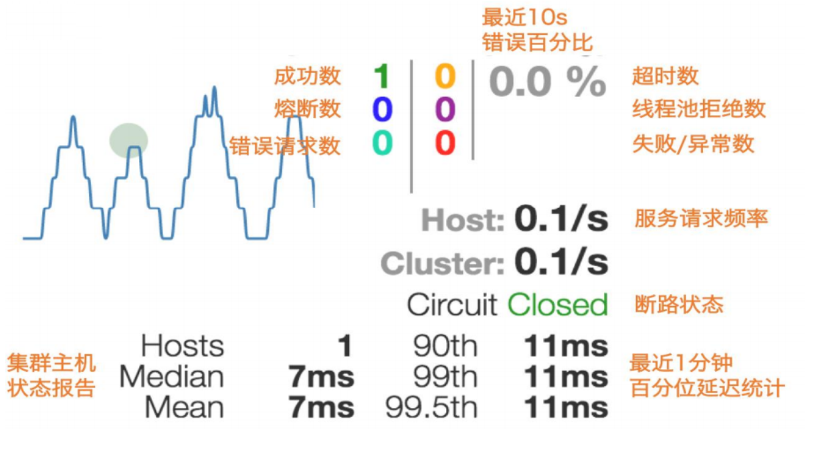
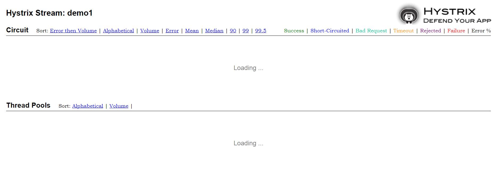
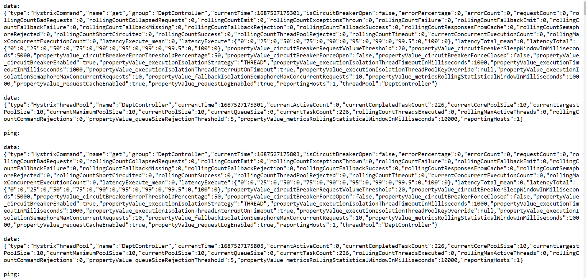
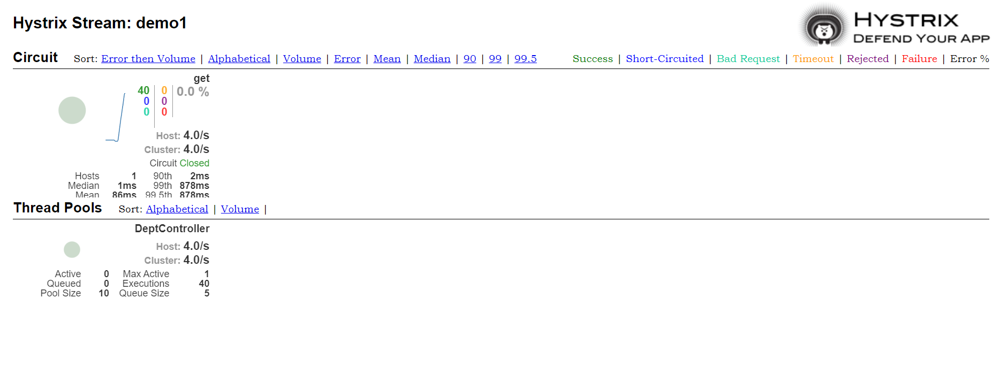

1. 假如我需要引入cloud的一個新技術組件，基本上有兩部
   1. 新增一個相關的maven座標
   2. 在主啟動類上面，標註的啟動該組件技術的相關註解標籤

# 服務監控hystrixDashboard參數說明

# 使用spring boot 1.5.X版本，使用Hystrix.stream遇到以下狀況

### 原因

- 在 Spring Boot 1.5.x 中，Hystrix.stream僅當實際正在執行帶有註釋的調用時才會顯示數據@HystrixCommand

### 加上@HystrixCommand，即可處理

