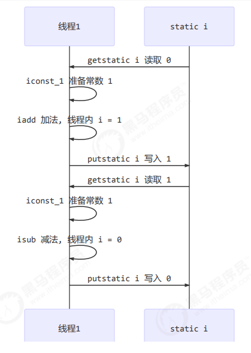
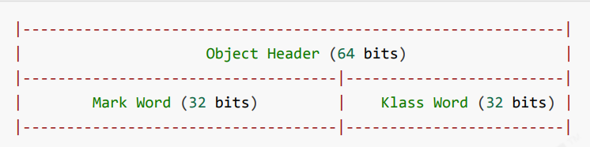
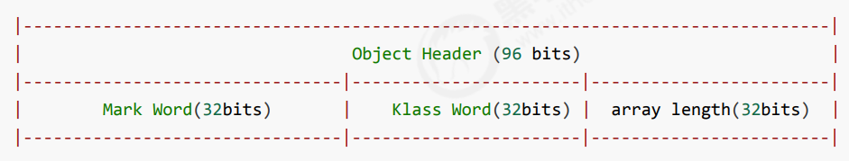
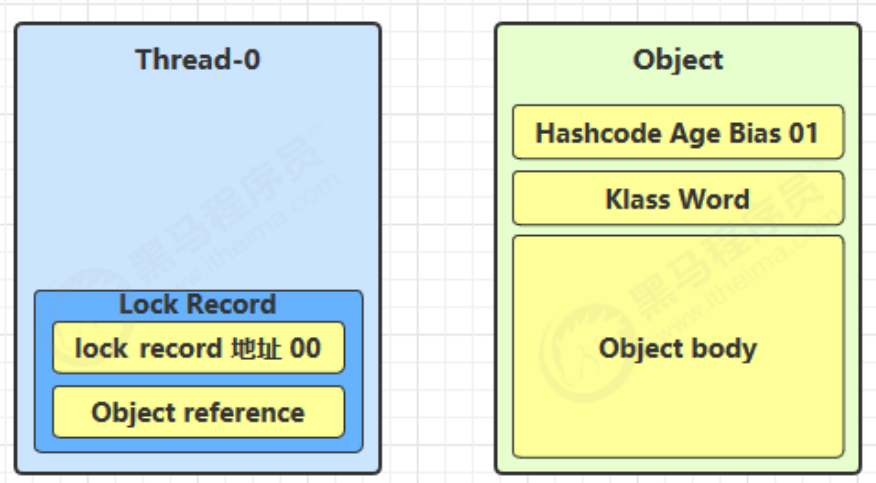
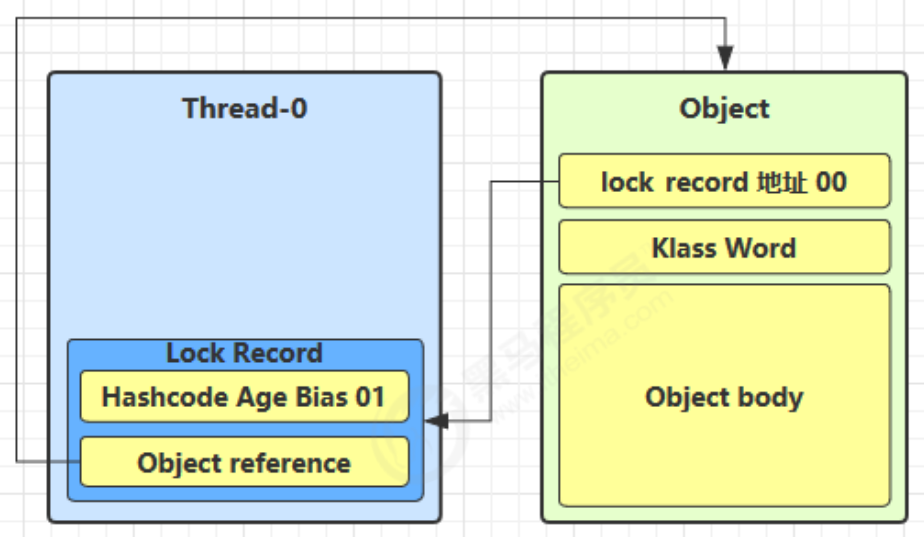
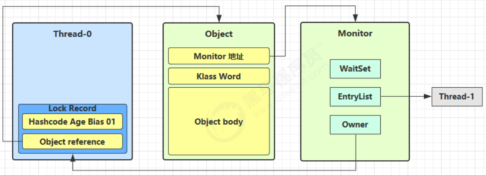

# muti thread

## 進程與執行續(線程)

### 進程
- 程式由指令和資料組成，但這些指令要運行，資料要讀寫，就必須將指令載入到 CPU，資料載入至記憶體。 在指令運行過程中還需要用到磁碟、網路等設備。 進程就是用來載入指令、管理記憶體、管理 IO 的
- 當一個程式被運行，從磁碟加載這個程式的程式碼到內存，這時就開啟了一個進程。
- 進程就可以視為程式的一個實例。 大部分程式可以同時執行多個實例進程（例如記事本、畫圖、瀏覽器
等等），也有的程式只能啟動一個實例進程（例如網易雲音樂、360 安全衛士等）

### 執行緒
- 一個行程之內可以分為一到多個執行緒。
- 一個執行緒就是一個指令流，將指令流中的一條指令以一定的順序交給 CPU 執行
- Java 中，執行緒作為最小調度單位，進程作為資源分配的最小單位。 在 windows 中進程是不活動的，只是作為線程的容器

## 併行(parallel)與併發(concurrent)

### 併發(concurrent)

- 就是一個CPU輪流執行多個執行緒


- 單核心 cpu 下，執行緒實際上還是 串列執行 的。 作業系統中有一個元件叫做任務調度器，將 cpu 的時間片（windows下時間片最小約為 15 毫秒）分給不同的程式使用，只是由於 cpu 在線程間（時間片很短）的切換非常快，人類感覺是 同時運行的 。 總結為一句話是： 微觀串行，宏觀並行，

- 一般會將這種 執行緒輪流使用 CPU 的做法稱為並發， concurrent


### 併行(parallel)

- 就是多個CPU同時執行多個執行緒

- 多核心 cpu下，每個 核心（core） 都可以調度運行線程，這時候線程可以是並行的。


- 引用 Rob Pike 的一段描述：
  - 並發（concurrent）是同一時間應對（dealing with）多件事情的能力
  - 並行（parallel）是同一時間動手做（doing）多件事情的能力

## 創建線程

### 1.直接使用Thread

```java
// 建立線程物件
Thread t = new Thread() {
  public void run() {
  // 要執行的任務
  }
};
// 啟動執行緒
t.start();
```

例如:
```java
// 建構方法的參數是給執行緒指定名字，推薦
Thread t1 = new Thread("t1") {
  @Override
  // run 方法內實作了要執行的任務
  public void run() {
  log.debug("hello");
  }
};
t1.start();
```

輸出
```
19:19:00 [t1] c.ThreadStarter - hello
```


### 2.使用Runnable配合Thread

- 把【線程】和【任務】（要執行的程式碼）分開
  - Thread 代表線程
  - Runnable 可運行的任務（執行緒要執行的程式碼）


```java
Runnable runnable = new Runnable() {
  public void run(){
  // 要執行的任務
  }
};
// 建立線程物件
Thread t = new Thread( runnable );
// 啟動執行緒
t.start();
```

```java
// 建立任務物件
Runnable task2 = new Runnable() {
  @Override
  public void run() {
  log.debug("hello");
  }
};
// 參數1 是任務物件; 參數2 是執行緒名字，推薦
Thread t2 = new Thread(task2, "t2");
t2.start();
```

輸出:

```
19:19:00 [t2] c.ThreadStarter - hello
```

java8 以後使用lambda

```java
// 建立任務物件
Runnable task2 = () -> log.debug("hello");
// 參數1 是任務物件; 參數2 是執行緒名字，推薦
Thread t2 = new Thread(task2, "t2");
t2.start();
```

### 3.FutureTask 配和 Thread

```java
// 建立任務物件
FutureTask<Integer> task3 = new FutureTask<>(() -> {
  log.debug("hello");
  return 100;
});
// 參數1 是任務物件; 參數2 是執行緒名字，推薦
new Thread(task3, "t3").start();
// 主執行緒阻塞，同步等待 task 執行完畢的結果
Integer result = task3.get();
log.debug("結果是:{}", result);
```

輸出:

```
19:22:27 [t3] c.ThreadStarter - hello
19:22:27 [main] c.ThreadStarter - 结果是:100

```


## Thread原理

### 棧與棧禎

- Java Virtual Machine Stacks （Java 虛擬機器堆疊）

- 我們都知道 JVM 中由堆疊、堆疊、方法區所組成，其中棧記憶體是給誰用的呢？ 其實就是線程，每個線程啟動後，虛擬
機器就會為其分配一塊棧記憶體。
- 每個棧由多個棧幀（Frame）組成，對應每次方法呼叫時所佔用的記憶體
- 每個執行緒只能有一個活動棧幀，對應目前正在執行的那個方法

### 線程上下文切換(Thread Context Switch)


- 因為以下一些原因導致 cpu 不再執行目前的線程，轉而執行另一個線程的程式碼
  - 線程的 cpu 時間片用完
  - 垃圾回收
  - 有更高優先權的執行緒需要運行
  - 線程自己呼叫了 sleep、yield、wait、join、park、synchronized、lock 等方法
- 當 Context Switch 發生時，需要由作業系統保存目前執行緒的狀態，並恢復另一個執行緒的狀態，Java 中對應的概念
是程式計數器（Program Counter Register），它的功能是記住下一條 jvm 指令的執行位址，是執行緒私有的
  - 狀態包括程式計數器、虛擬機器棧中每個棧幀的信息，如局部變數、操作數棧、返回地址等
  - Context Switch 頻繁發生會影響效能

## 常見的方法

|方法名|static|功能說明|注意事項|
|--|--|--|--|
|start()||啟動一個新的Thread，在新的Thread運行run方法中的代碼|start 方法只是讓線程進入就緒，裡面程式碼不一定立刻運行（CPU 的時間片還沒分給它）。 每個線程物件的start方法只能呼叫一次，如果呼叫了多次會出現IllegalThreadStateException|
|run()||新執行緒啟動後會呼叫的方法|如果在建構 Thread 物件時傳遞了Runnable 參數，則執行緒啟動後會呼叫 Runnable 中的 run 方法，否則默認不執行任何操作。但可以創建 Thread 的子類物件，來覆寫預設行為|
|join()||等待調用該方法的執行緒運行結束||
|join(long n)||等待執行緒運行結束,最多等待 n毫秒||
|getId()||獲取執行緒長整型的id|id唯一|
|getName()||獲取執行緒名||
|setName(String)||修改執行緒名||
|getPriority()||獲取執行緒優先級||
|setPriority(int)||修改執行緒優先級|java中規定執行緒優先權是1~10 的整數，較大的優先權能提高該執行緒被 CPU 調度的機率|
|getState()||獲取執行緒狀態|Java 中執行緒狀態以 6 個 enum 表示，分別為：NEW, RUNNABLE, BLOCKED, WAITING,TIMED_WAITING, TERMINATED|
|isInterrupted()||判斷是否被打斷|不會清除打斷標記|
|isAlive()||執行緒是否存活(還沒有運行完畢)||
|interrupt()||打斷執行緒|如果被打斷線程正在 sleep，wait，join 會導致被打斷的執行緒拋出 InterruptedException，並清除打斷標記；如果打斷的正在運行的線程，則會設定 打斷標記；park 的線程被打斷，也會設定打斷標記|
|interrupted()|static|判斷當前線程是否被打斷|會清除打斷標記|
|currentThread()|static|獲取當前正在執行的執行緒||
|sleep(long n)|static|讓目前執行的線程休眠n毫秒，休眠時讓出 cpu
的時間片給其它執行緒||
|yield()|static|提示線程調度器，讓出當前線程對CPU的使用權|主要為了測試和調試|

## start與run

### 調用run

```java
    public static void main(String[] args) {
        Thread t1 = new Thread("t1") {

            @Override
            public void run() {
                log.debug(Thread.currentThread().getName());
                FileReader.read(Constants.MP4_FULL_PATH);
            }
        };
        t1.run();
        log.debug("do other things ...");
    }
```

```
19:39:14 [main] c.TestStart - main
19:39:14 [main] c.FileReader - read [1.mp4] start ...
19:39:18 [main] c.FileReader - read [1.mp4] end ... cost: 4227 ms
19:39:18 [main] c.TestStart - do other things ...
```
程式仍在 main 執行緒運行， FileReader.read() 方法呼叫還是同步的

### 調用start

將上述代碼的t1.run()改為

```java
t1.start();
```

```
19:41:30 [main] c.TestStart - do other things ...
19:41:30 [t1] c.TestStart - t1
19:41:30 [t1] c.FileReader - read [1.mp4] start ...
19:41:35 [t1] c.FileReader - read [1.mp4] end ... cost: 4542 ms
```

程式在 t1 執行緒運行， FileReader.read() 方法呼叫是異步的

- 小結
  - 直接呼叫 run 是在主線程中執行了 run，沒有啟動新的線程
  - 使用 start 是啟動新的線程，透過新的線程間接執行 run 中的程式碼

## sleep 與 yield

### sleep

- 1. 呼叫 sleep 會讓目前執行緒從 Running 進入 Timed Waiting 狀態（阻塞）
- 2. 其它線程可以使用 interrupt 方法打斷正在睡眠的線程，這時 sleep 方法會拋出 InterruptedException
- 3. 睡眠結束後的執行緒未必會立刻得到執行
- 4. 建議用 TimeUnit 的 sleep 取代 Thread 的 sleep 來獲得更好的可讀性

### yield

- 1. 呼叫 yield 會讓目前執行緒從 Running 進入 Runnable 就緒狀態，然後調度執行其它線程
- 2. 具體的實作依賴作業系統的任務調度器

### 執行緒優先級

- 線程優先權會提示（hint）調度器優先調度該線程，但它只是一個提示，調度器可以忽略它
- 如果 cpu 比較忙，那麼優先順序高的執行緒會獲得更多的時間片，但 cpu 閒時，優先權幾乎沒作用

```java
        Runnable task1 = () -> {
            int count = 0;
            for (;;) {
                System.out.println("---->1 " + count++);
            }
        };
        Runnable task2 = () -> {
            int count = 0;
            for (;;) {
                // Thread.yield();
                System.out.println(" ---->2 " + count++);
            }
        };
        Thread t1 = new Thread(task1, "t1");
        Thread t2 = new Thread(task2, "t2");
        // t1.setPriority(Thread.MIN_PRIORITY);
        // t2.setPriority(Thread.MAX_PRIORITY);
        t1.start();
        t2.start();
```


## join方法

### 為什麼需要 join

- 下面的程式碼執行，列印 r 是什麼？

```java
static int r = 0;

     public static void main(String[] args) throws InterruptedException {
         test1();
     }

     private static void test1() throws InterruptedException {
         log.debug("開始");
         Thread t1 = new Thread(() -> {
             log.debug("開始");
             sleep(1);
             log.debug("結束");
             r = 10;
         });
         t1.start();
         log.debug("結果為:{}", r);
         log.debug("結束");
     }
```

- 分析
  - 因為主執行緒和執行緒 t1 是並行執行的，t1 執行緒需要 1 秒後才能算出 r=10
  - 而主線程一開始就要印出 r 的結果，所以只能印出 r=0
- 解決方法
  - 用 sleep 行不行？ 為什麼？
  - 用 join，加在 t1.start() 之後即可


- 結論
  - 需要等待結果返回，才能繼續運行就是同步
  - 不需要等待結果返回，就能繼續運行就是非同步

下面代碼cost大約多少秒?

```java
    static int r1 = 0;
    static int r2 = 0;

    public static void main(String[] args) throws InterruptedException {
        test2();
    }

    private static void test2() throws InterruptedException {
        Thread t1 = new Thread(() -> {
            sleep(1);
            r1 = 10;
        });
        Thread t2 = new Thread(() -> {
            sleep(2);
            r2 = 20;
        });
        long start = System.currentTimeMillis();
        t1.start();
        t2.start();
        t1.join();
        t2.join();
        long end = System.currentTimeMillis();
        log.debug("r1: {} r2: {} cost: {}", r1, r2, end - start);
    }
```

- 分析如下
  - 第一個 join：等待 t1 時, t2 並沒有停止, 而在運行
  - 第二個 join：1s 後, 執行到此, t2 也運行了 1s, 因此也只需再等待 1s
- 如果顛倒兩個 join 呢？
- 最終都是輸出

```
20:45:43.239 [main] c.TestJoin - r1: 10 r2: 20 cost: 2005
北
```


### 有時效的join

#### 有等夠時間

```java
    static int r1 = 0;
    static int r2 = 0;

    public static void main(String[] args) throws InterruptedException {
        test3();
    }

    public static void test3() throws InterruptedException {
        Thread t1 = new Thread(() -> {
            sleep(1);
            r1 = 10;
        });
        long start = System.currentTimeMillis();
        t1.start();
        // 執行緒執行結束會導致 join 結束
        t1.join(1500);
        long end = System.currentTimeMillis();
        log.debug("r1: {} r2: {} cost: {}", r1, r2, end - start);
    }
```

輸出

```
20:48:01.320 [main] c.TestJoin - r1: 10 r2: 0 cost: 1010
```

#### 沒等夠時間

```java
    static int r1 = 0;
    static int r2 = 0;

    public static void main(String[] args) throws InterruptedException {
        test3();
    }

    public static void test3() throws InterruptedException {
        Thread t1 = new Thread(() -> {
            sleep(2);
            r1 = 10;
        });
        long start = System.currentTimeMillis();
        t1.start();
        // 執行緒執行結束會導致 join 結束
        t1.join(1500);
        long end = System.currentTimeMillis();
        log.debug("r1: {} r2: {} cost: {}", r1, r2, end - start);
    }
```

輸出

```
20:52:15.623 [main] c.TestJoin - r1: 0 r2: 0 cost: 1502
```

## interrupt 方法

### 打斷 sleep，wait，join 的線程

- 這幾個方法都會讓執行緒進入阻塞狀態
- 打斷 sleep 的線程, 會清空打斷狀態，以 sleep 為例

```java
private static void test1() throws InterruptedException {
         Thread t1 = new Thread(() -> {
             sleep(1);
         }, "t1");
         t1.start();
         sleep(0.5);
         t1.interrupt();
         log.debug(" 打斷狀態: {}", t1.isInterrupted());
     }
```

輸出

```
java.lang.InterruptedException: sleep interrupted
at java.lang.Thread.sleep(Native Method)
at java.lang.Thread.sleep(Thread.java:340)
at java.util.concurrent.TimeUnit.sleep(TimeUnit.java:386)
at cn.itcast.n2.util.Sleeper.sleep(Sleeper.java:8)
at cn.itcast.n4.TestInterrupt.lambda$test1$3(TestInterrupt.java:59)
at java.lang.Thread.run(Thread.java:745)
21:18:10.374 [main] c.TestInterrupt - 打斷狀態: false

```

### 打斷正常運行的線程
- 打斷正常運作的執行緒, 不會清空打斷狀態

```java
    private static void test2() throws InterruptedException {
        Thread t2 = new Thread(() -> {
            while (true) {
                Thread current = Thread.currentThread();
                boolean interrupted = current.isInterrupted();
                if (interrupted) {
                    log.debug(" 打斷狀態: {}", interrupted);
                    break;
                }
            }
        }, "t2");
        t2.start();
        sleep(0.5);
        t2.interrupt();
    }
```

輸出

```
20:57:37.964 [t2] c.TestInterrupt - 打斷狀態: true
```

## 模式:兩階段中止

## 主執行緒與守護執行緒

- 預設情況下，Java 程序需要等待所有執行緒都運行結束，才會結束。 有一個特殊的執行緒叫做守護執行緒，只要其它非守護執行緒運行結束了，即使守護執行緒的程式碼沒有執行完，也會強制結束。

```java
log.debug("開始運作...");
Thread t1 = new Thread(() -> {
     log.debug("開始運作...");
     sleep(2);
     log.debug("運行結束...");
}, "daemon");
// 設定該線程為守護線程
t1.setDaemon(true);
t1.start();
sleep(1);
log.debug("運行結束...");
```

輸出
```
08:26:38.123 [main] c.TestDaemon - 開始運作...
08:26:38.213 [daemon] c.TestDaemon - 開始運行...
08:26:39.215 [main] c.TestDaemon - 運行結束...
```

>注意
>- 垃圾回收器線程就是一種守護線程
>- Tomcat 中的 Acceptor 和 Poller 線程都是守護線程，所以 Tomcat 接收到 shutdown 指令後，不會等待它們處理完當前請求

## 5種執行緒狀態(以操作系統層面來描述)


- 【初始狀態】僅是在語言層面創建了線程物件，尚未與作業系統線程關聯
- 【可運行狀態】（就緒狀態）指該執行緒已經被建立（與作業系統執行緒關聯），可以由 CPU 調度執行
- 【運作狀態】指取得了 CPU 時間片運作中的狀態，當 CPU 時間片用完，會從【運行狀態】轉換至【可運行狀態】，會導致執行緒的上下文切換
- 【阻塞狀態】
  - 如果呼叫了阻塞 API，如 BIO 讀寫文件，這時該執行緒實際上不會用到 CPU，會導致執行緒上下文切換，進入【阻塞狀態】
  - 等 BIO 操作完畢，會由作業系統喚醒阻塞的線程，轉換至【可運行狀態】
  - 與【可運行狀態】的差別是，對【阻塞狀態】的執行緒來說只要它們一直不喚醒，調度器就一直不會考慮調度它們
- 【終止狀態】表示執行緒已經執行完畢，生命週期已經結束，不會再轉換為其它狀態

## 6種執行緒狀態(以JAVA API層面來描述)


- NEW 線程剛被創建，但還沒有呼叫 start() 方法
- RUNNABLE 當呼叫了 start() 方法之後，注意，Java API 層面的 RUNNABLE 狀態涵蓋了 作業系統 層面的【可運行狀態】、【運行狀態】和【阻塞狀態】（由於 BIO 導致的執行緒阻塞，在 Java 裡無法區分，仍然認為是可運行）
- BLOCKED ， WAITING ， TIMED_WAITING 都是 Java API 層面對【阻塞狀態】的細分，後面會在狀態轉換一節詳述
- TERMINATED 當執行緒程式碼運行結束


# 共享模型之管程

## 1.共享帶來問題

- 兩個執行緒對初始值為 0 的靜態變數一個做自增，一個做自減，各做 5000 次，結果是 0 嗎？

```java
static int counter = 0;
public static void main(String[] args) throws InterruptedException {
    Thread t1 = new Thread(() -> {
        for (int i = 0; i < 5000; i++) {
            counter++;
        }
    }, "t1");
    Thread t2 = new Thread(() -> {
        for (int i = 0; i < 5000; i++) {
            counter--;
        }
    }, "t2");
    t1.start();
    t2.start();
    t1.join();
    t2.join();
    log.debug("{}",counter);
}
```

- 問題分析
  - 以上的結果可能是正數、負數、零。 為什麼呢？ 因為 Java 中對靜態變數的自增，自減並不是原子操作，要徹底理解，必須從字節碼來進行分析，例如 i++ 而言（i 為靜態變數），實際上會產生如下的 JVM 字節碼指令：
  
```java
getstatic i // 取得靜態變數i的值
iconst_1 // 準備常數1
iadd // 自增
putstatic i // 將修改後的值存入靜態變數i
```

- 而對應 i-- 也是類似：

```java
getstatic i // 取得靜態變數i的值
iconst_1 // 準備常數1
isub // 自減
putstatic i // 將修改後的值存入靜態變數i
```

- 而 Java 的記憶體模型如下，完成靜態變數的自增，自減則需要在主記憶體和工作記憶體中進行資料交換：


- 如果是單執行緒以上 8 行程式碼是順序執行（不會交錯）沒有問題：



- 但多執行緒下這 8 行程式碼可能交錯運行：
- 出現負數的情況：


- 出現正數的情況：


### 1.臨界區 Critical Section
- 一個程式運行多個執行緒本身是沒有問題的
- 問題出在多個執行緒存取共享資源
  - 多個執行緒讀取共享資源其實也沒問題
  - 在多個執行緒對共享資源讀寫操作時發生指令交錯，就會出現問題
- 一段程式碼區塊內如果存在共享資源的多執行緒讀寫操作，稱這段程式碼區塊為臨界區

- 例如，下面程式碼中的臨界區

```java
static int counter = 0;
static void increment() 
// 臨界區
{ 
 counter++;
}
static void decrement() 
// 臨界區
{ 
 counter--;
}

```

### 2.競態條件 Race Condition
- 個執行緒在臨界區內執行，由於程式碼的執行序列不同而導致結果無法預測，稱為發生了競態條件


## 2. synchronized 解決方案

* 應用之互斥

為了避免臨界區的競態條件發生，有許多手段可以達到目的。
  - 阻塞式的解決方案：synchronized，Lock
  - 非阻塞式的解決方案：原子變數
 
本次課使用阻塞式的解決方案：synchronized，來解決上述問題，即俗稱的【物件鎖】，它採用互斥的方式讓同一時刻至多只有一個線程能持有【物件鎖】，其它線程再想獲取這個【物件鎖】時就會阻塞住。 這樣就能保證擁有鎖的線程可以安全的執行臨界區內的程式碼，不用擔心線程上下文切換

>注意
>>雖然 java 中互斥和同步都可以採用 synchronized 關鍵字來完成，但它們還是有區別的：
  >>- 互斥是保證臨界區的競態條件發生，同一時刻只能有一個執行緒執行臨界區程式碼
  >>- 同步是由於執行緒執行的先後、順序不同、需要一個執行緒等待其它執行緒運行到某個點


### synchronized語法

```java
synchronized(物件) // 執行緒1， 執行緒2(blocked)
{
  臨界區
}

```

解决

```java
	static int counter = 0;
	static final Object room = new Object();

	public static void main(String[] args) throws InterruptedException {
		Thread t1 = new Thread(() -> {
			for (int i = 0; i < 5000; i++) {
				synchronized (room) {
					counter++;
				}
			}
		}, "t1");
		Thread t2 = new Thread(() -> {
			for (int i = 0; i < 5000; i++) {
				synchronized (room) {
					counter--;
				}
			}
		}, "t2");
		t1.start();
		t2.start();
		t1.join();
		t2.join();
		log.debug("{}", counter);
	}
```


- ***synchronized(物件)*** 中的物件，可以想像為一個房間（room），有唯一入口（門）房間只能一次進入一人進行計算，線程 t1，t2 想像成兩個人
- 當線程 t1 執行到 ***synchronized(room)*** 時就好比 t1 進入了這個房間，並鎖住了門拿走了鑰匙，在門內執行***count++*** 程式碼
- 這時候如果 t2 也運行到了 ***synchronized(room)*** 時，它發現門被鎖住了，只能在門外等待，發生了上下文切換，阻塞住了
- 這中間即使 t1 的 cpu 時間片不幸用完，被踢出了門外（不要錯誤理解為鎖住了物件就能一直執行下去哦），
這時門還是鎖住的，t1 仍拿著鑰匙，t2 線程還在阻塞狀態進不來，只有下次輪到 t1 自己再次獲得時間片時才能開門進入
- 當 t1 執行完 ***synchronized{}*** 區塊內的程式碼，這時候才會從 obj 房間出來並解開門上的鎖，喚醒 t2 執行緒把鑰匙給他。 t2 執行緒這時才可以進入 obj 房間，鎖住了門拿上鑰匙，執行它的 ***count--*** 程式碼


### 思考
- synchronized 實際上是用物件鎖定保證了臨界區內程式碼的原子性，臨界區內的程式碼對外是不可分割的，不會被執行緒切換所打斷。

為了加深理解，請思考下面的問題

- 如果把 synchronized(obj) 放在 for 迴圈的外面，如何理解？ -- 原子性
- 如果 t1 synchronized(obj1) 而 t2 synchronized(obj2) 會如何運作？ -- 鎖物件
- 如果 t1 synchronized(obj) 而 t2 沒有加會怎麼樣？ 如何理解？ -- 鎖物件


### 物件導向改進

把需要保護的共享變數放入一個類

```java
class Room {
	int value = 0;

	public void increment() {
		synchronized (this) {
			value++;
		}
	}

	public void decrement() {
		synchronized (this) {
			value--;
		}
	}

	public int get() {
		synchronized (this) {
			return value;
		}
	}
}

@Slf4j
public class Test1 {

	public static void main(String[] args) throws InterruptedException {
		Room room = new Room();
		Thread t1 = new Thread(() -> {
			for (int j = 0; j < 5000; j++) {
				room.increment();
			}
		}, "t1");
		Thread t2 = new Thread(() -> {
			for (int j = 0; j < 5000; j++) {
				room.decrement();
			}
		}, "t2");
		t1.start();
		t2.start();
		t1.join();
		t2.join();
		log.debug("count: {}", room.get());
	}
}

```

### 物件導向改進

把需要保護的共享變數放入一個類

```java
class Test {
	public synchronized void test() {

	}
}

//等價於
class Test {
	public void test() {
		synchronized (this) {

		}
	}
}

```


```java
class Test {
	public synchronized static void test() {
	}
}

//等價於
class Test {
	public static void test() {
		synchronized (Test.class) {

		}
	}
}

```


### 不加 synchronized 的方法
- 不加 synchronzied 的方法就好比不遵守規則的人，不去老實排隊（好比翻窗戶進去的）

### 所謂的“線程八鎖”

 其實就是考察 synchronized 鎖住的是哪個物件

- 情况1：12 或 21

```java
@Slf4j(topic = "c.Number")
class Number {
	public synchronized void a() {
		log.debug("1");
	}

	public synchronized void b() {
		log.debug("2");
	}

}

public static void main(String[] args) {
 Number n1 = new Number();
 new Thread(()->{ n1.a(); }).start();
 new Thread(()->{ n1.b(); }).start();
}
```

- 情况2：1s后12，或 2 1s后 1

```java
@Slf4j(topic = "c.Number")
class Number {
	public synchronized void a() {
		sleep(1);
		log.debug("1");
	}

	public synchronized void b() {
		log.debug("2");
	}

}

public static void main(String[] args) {
 Number n1 = new Number();
 new Thread(()->{ n1.a(); }).start();
 new Thread(()->{ n1.b(); }).start();
}
```

- 情况3：3 1s 12 或 23 1s 1 或 32 1s 1

```java
@Slf4j(topic = "c.Number")
class Number {
	public synchronized void a() {
		sleep(1);
		log.debug("1");
	}

	public synchronized void b() {
		log.debug("2");
	}

	public void c() {
		log.debug("3");
	}

	}

	public static void main(String[] args) {
	 Number n1 = new Number();
	 new Thread(()->{ n1.a(); }).start();
	 new Thread(()->{ n1.b(); }).start();
	 new Thread(()->{ n1.c(); }).start();
	}
```
- 情况4：2 1s 后 1

```java
@Slf4j(topic = "c.Number")
class Number {
	public synchronized void a() {
		sleep(1);
		log.debug("1");
	}

	public synchronized void b() {
		log.debug("2");
	}

}

public static void main(String[] args) {
 Number n1 = new Number();
 Number n2 = new Number();
 new Thread(()->{ n1.a(); }).start();
 new Thread(()->{ n2.b(); }).start();
}

```

- 情况5：2 1s 后 1

```java
@Slf4j(topic = "c.Number")
class Number {
	public static synchronized void a() {
		sleep(1);
		log.debug("1");
	}

	public synchronized void b() {
		log.debug("2");
	}

}

public static void main(String[] args) {
 Number n1 = new Number();
 new Thread(()->{ n1.a(); }).start();
 new Thread(()->{ n1.b(); }).start();
}

```

- 情况6：1s 后12， 或 2 1s后 1

```java
@Slf4j(topic = "c.Number")
class Number {
	public static synchronized void a() {
		sleep(1);
		log.debug("1");
	}

	public static synchronized void b() {
		log.debug("2");
	}

}

public static void main(String[] args) {
 Number n1 = new Number();
 new Thread(()->{ n1.a(); }).start();
 new Thread(()->{ n1.b(); }).start();
}

```
- 情况7：2 1s 后 1

```java
@Slf4j(topic = "c.Number")
class Number {
	public static synchronized void a() {
		sleep(1);
		log.debug("1");
	}

	public synchronized void b() {
		log.debug("2");
	}

}

public static void main(String[] args) {
 Number n1 = new Number();
 Number n2 = new Number();
 new Thread(()->{ n1.a(); }).start();
 new Thread(()->{ n2.b(); }).start();
}
```

- 情况8：1s 后12， 或 2 1s后 1

```java
@Slf4j(topic = "c.Number")
class Number {
	public static synchronized void a() {
		sleep(1);
		log.debug("1");
	}

	public static synchronized void b() {
		log.debug("2");
	}

	}

	public static void main(String[] args) {
	 Number n1 = new Number();
	 Number n2 = new Number();
	 new Thread(()->{ n1.a(); }).start();
	 new Thread(()->{ n2.b(); }).start();
	}

```
# Monitor概念

- Java 物件頭
- 以 32 位元虛擬機器為例


普通物件


陣列物件


其中Mark Word結構為


64 位元虛擬機器 Mark Word


## Monitor原理

- Monitor 翻譯為***監視器***或***管程***
- 每個 Java 物件都可以關聯一個 Monitor 物件，如果使用 synchronized 給對像上鎖（重量級）之後，該物件頭的Mark Word 中就被設定指向 Monitor 物件的指針

Monitor 結構如下


- 剛開始 Monitor 中 Owner 為 null
- 當 Thread-2 執行 synchronized(obj) 就會將 Monitor 的所有者 Owner 置為 Thread-2，Monitor中只能有一個 Owner
- 在 Thread-2 上鎖的過程中，如果 Thread-3，Thread-4，Thread-5 也來執行 synchronized(obj)，就會進入EntryList BLOCKED
- Thread-2 執行完同步程式碼區塊的內容，然後喚醒 EntryList 中等待的執行緒來競爭鎖，競爭的時是非公平的
- 圖中 WaitSet 中的 Thread-0，Thread-1 是之前獲得過鎖，但條件不滿足進入 WAITING 狀態的線程，後wait-notify 會分析

>注意：
>- synchronized 必須是進入同一個物件的 monitor 才有上述的效果
>- 不加 synchronized 的物件不會關聯監視器，不遵從上述規則

## synchronized 原理

```java
static final Object lock = new Object();
static int counter = 0;
public static void main(String[] args) {
  synchronized (lock) {
    counter++;
  }
}

```

對應的字節碼為

```java
public class mutiThread.Test
  minor version: 0
  major version: 52
  flags: (0x0021) ACC_PUBLIC, ACC_SUPER
  this_class: #1                          // mutiThread/Test
  super_class: #3                         // java/lang/Object
  interfaces: 0, fields: 2, methods: 3, attributes: 1
Constant pool:
   #1 = Class              #2             // mutiThread/Test
   #2 = Utf8               mutiThread/Test
   #3 = Class              #4             // java/lang/Object
   #4 = Utf8               java/lang/Object
   #5 = Utf8               lock
   #6 = Utf8               Ljava/lang/Object;
   #7 = Utf8               counter
   #8 = Utf8               I
   #9 = Utf8               <clinit>
  #10 = Utf8               ()V
  #11 = Utf8               Code
  #12 = Methodref          #3.#13         // java/lang/Object."<init>":()V
  #13 = NameAndType        #14:#10        // "<init>":()V
  #14 = Utf8               <init>
  #15 = Fieldref           #1.#16         // mutiThread/Test.lock:Ljava/lang/Object;
  #16 = NameAndType        #5:#6          // lock:Ljava/lang/Object;
  #17 = Fieldref           #1.#18         // mutiThread/Test.counter:I
  #18 = NameAndType        #7:#8          // counter:I
  #19 = Utf8               LineNumberTable
  #20 = Utf8               LocalVariableTable
  #21 = Utf8               this
  #22 = Utf8               LmutiThread/Test;
  #23 = Utf8               main
  #24 = Utf8               ([Ljava/lang/String;)V
  #25 = Utf8               args
  #26 = Utf8               [Ljava/lang/String;
  #27 = Utf8               StackMapTable
  #28 = Class              #26            // "[Ljava/lang/String;"
  #29 = Class              #30            // java/lang/Throwable
  #30 = Utf8               java/lang/Throwable
  #31 = Utf8               SourceFile
  #32 = Utf8               Test.java
{
  static final java.lang.Object lock;
    descriptor: Ljava/lang/Object;
    flags: (0x0018) ACC_STATIC, ACC_FINAL

  static int counter;
    descriptor: I
    flags: (0x0008) ACC_STATIC

  static {};
    descriptor: ()V
    flags: (0x0008) ACC_STATIC
    Code:
      stack=2, locals=0, args_size=0
         0: new           #3                  // class java/lang/Object
         3: dup
         4: invokespecial #12                 // Method java/lang/Object."<init>":()V
         7: putstatic     #15                 // Field lock:Ljava/lang/Object;
        10: iconst_0
        11: putstatic     #17                 // Field counter:I
        14: return
      LineNumberTable:
        line 4: 0
        line 5: 10
      LocalVariableTable:
        Start  Length  Slot  Name   Signature

  public mutiThread.Test();
    descriptor: ()V
    flags: (0x0001) ACC_PUBLIC
    Code:
      stack=1, locals=1, args_size=1
         0: aload_0
         1: invokespecial #12                 // Method java/lang/Object."<init>":()V
         4: return
      LineNumberTable:
        line 3: 0
      LocalVariableTable:
        Start  Length  Slot  Name   Signature
            0       5     0  this   LmutiThread/Test;

  public static void main(java.lang.String[]);
    descriptor: ([Ljava/lang/String;)V
    flags: (0x0009) ACC_PUBLIC, ACC_STATIC
    Code:
      stack=2, locals=2, args_size=1
         0: getstatic     #15                 // <- lock引用 （synchronized開始）// Field lock:Ljava/lang/Object;
         3: dup
         4: astore_1                          // lock引用 -> slot 1
         5: monitorenter                      // 將 lock物件 MarkWord 置為 Monitor 指針
         6: getstatic     #17                 // <-i Field counter:I
         9: iconst_1                          // 準備常數 1
        10: iadd                              //+1
        11: putstatic     #17                 // -> i Field counter:I
        14: aload_1                           // <- lock引用
        15: monitorexit                       // 將 lock物件 MarkWord 重置, 喚醒 EntryList
        16: goto          22
        19: aload_1                           // <- lock引用
        20: monitorexit                       // 將 lock物件 MarkWord 重置, 喚醒 EntryList
        21: athrow                            // throw e
        22: return
      Exception table:
         from    to  target type
             6    16    19   any
            19    21    19   any
      LineNumberTable:
        line 7: 0
        line 8: 6
        line 7: 14
        line 10: 22
      LocalVariableTable:
        Start  Length  Slot  Name   Signature
            0      23     0  args   [Ljava/lang/String;
      StackMapTable: number_of_entries = 2
        frame_type = 255 /* full_frame */
          offset_delta = 19
          locals = [ class "[Ljava/lang/String;", class java/lang/Object ]
          stack = [ class java/lang/Throwable ]
        frame_type = 250 /* chop */
          offset_delta = 2
}
SourceFile: "Test.java"

```

 >***注意***
 >
>方法層級的 synchronized 不會在字節碼指令中有所體現

## synchronized 原理進階

### 1. 輕量級鎖
- 輕量級鎖的使用場景：如果一個物件雖然有多執行緒要加鎖，但加鎖的時間是錯開的（也就是沒有競爭），那麼可以使用輕量級鎖來優化。
- 輕量級鎖定對使用者是透明的，即語法仍然是 synchronized
- 假設有兩個方法同步區塊，利用同一個物件加鎖

```java
	static final Object obj = new Object();

	public static void method1() {
		synchronized (obj) {
			// 同步區塊 A
			method2();
		}
	}

	public static void method2() {
		synchronized (obj) {
			// 同步區塊 B
		}
	}
```


- 建立鎖記錄（Lock Record）物件，每個執行緒都的堆疊幀都會包含一個鎖記錄的結構，內部可以儲存鎖定物件的Mark Word



- 讓鎖定記錄中 Object reference 指向鎖定對象，並嘗試以 cas 取代 Object 的 Mark Word，將 Mark Word 的值存入鎖記錄


- 如果 cas 替換成功，物件頭中儲存了 鎖定記錄位址和狀態 00 ，表示由該執行緒為物件加鎖，這時圖示如下


- 如果 cas 失敗，有兩種情況
  - 如果是其它線程已經持有了該 Object 的輕量級鎖，這時表示有競爭，進入鎖膨脹過程
  - 如果是自己執行了 synchronized 鎖定重入，那麼再增加一條 Lock Record 作為重入的計數


- 當退出 synchronized 程式碼區塊（解鎖時）如果有取值為 null 的鎖定記錄，表示有重入，這時重置鎖定記錄，表示重入計數減一




- 當退出 synchronized 程式碼區塊（解鎖時）鎖定記錄的值不為 null，這時使用 cas 將 Mark Word 的值恢復給對象頭
  - 成功，則解鎖成功
  - 失敗，說明輕量級鎖進行了鎖膨脹或已經升級為重量級鎖，進入重量級鎖解鎖流程

### 鎖膨脹
- 如果在嘗試加輕量級鎖的過程中，CAS 操作無法成功，這時一種情況就是有其它線程為此物件加上了輕量級鎖定（有競爭），這時需要進行鎖膨脹，將輕量級鎖變為重量級鎖。

```java
	static Object obj = new Object();

	public static void method1() {
		synchronized (obj) {
			// 同步區塊
		}
	}
```


- 當 Thread-1 進行輕量級加鎖時，Thread-0 已經對該物件加了輕量級鎖


- 這時 Thread-1 加輕量級鎖定失敗，進入鎖定膨脹流程
  - 即為 Object 物件申請 Monitor 鎖，讓 Object 指向重量級鎖位址
  - 然後自己進入 Monitor 的 EntryList BLOCKED


- 當 Thread-0 退出同步區塊解鎖時，使用 cas 將 Mark Word 的值還原給物件頭，失敗。 這時會進入重量級解鎖流程，即依照 Monitor 位址找到Monitor 對象，設定 Owner 為 null，喚醒 EntryList 中 BLOCKED 執行緒


### 3. 自旋優化
- 重量級鎖競爭的時候，還可以使用自旋來進行最佳化，如果當前線程自旋成功（即這時候持鎖線程已經退出了同步塊，釋放了鎖），這時當前執行緒就可以避免阻塞。

自旋重試成功的情況


自旋重試失敗的情況


- 自旋會佔用 CPU 時間，單核心 CPU 自旋就是浪費，多核心 CPU 自旋才能發揮優勢。
- 在 Java 6 之後自旋鎖是自適應的，例如物件剛剛的一次自旋操作成功過，那麼認為這次自旋成功的可能性會高，就多自旋幾次；反之，就少自旋甚至不自旋，總之，比較智能。
- Java 7 之後無法控制是否開啟自旋功能


### 4. 偏向鎖
- 輕量級鎖在沒有競爭時（就自己這個執行緒），每次重入仍然需要執行 CAS 操作。
- Java 6 中引入了偏向鎖定來做進一步優化：只有第一次使用 CAS 將線程 ID 設定到物件的 Mark Word 頭，之後發現這個線程 ID 是自己的就表示沒有競爭，不用重新 CAS。 以後只要不發生競爭，這個物件就歸該執行緒所有
  
例如：

```java
	static final Object obj = new Object();

	public static void m1() {
		synchronized (obj) {
			// 同步區塊 A
			m2();
		}
	}

	public static void m2() {
		synchronized (obj) {
			// 同步區塊 B
			m3();
		}
	}

	public static void m3() {
		synchronized (obj) {// 同步區塊 C
		}
	}
```


### 偏向狀態

物件頭格式


- 一個物件創建時：
- 如果開啟了偏向鎖定（預設為開啟），那麼物件建立後，markword 值為 0x05 即最後 3 位元為 101，這時它的thread、epoch、age 都為 0
- 偏向鎖是預設是延遲的，不會在程式啟動時立即生效，如果想避免延遲，可以加 VM 參數 -XX:BiasedLockingStartupDelay=0 來停用延遲
- 如果沒有開啟偏向鎖，那麼物件建立後，markword 值為 0x01 即最後 3 位元為 001，這時它的 hashcode、age 都是 0，第一次用到 hashcode 時才會賦值

1） 測試延遲特性

2） 測試偏向鎖

```java
class Dog {}
```

利用 jol 第三方工具來查看物件頭資訊（注意這裡我擴展了 jol 讓它輸出更為簡潔）

```java
	// 新增虛擬機器參數 -XX:BiasedLockingStartupDelay=0
	public static void main(String[] args) throws IOException {
		Dog d = new Dog();
		ClassLayout classLayout = ClassLayout.parseInstance(d);
		new Thread(() -> {
			log.debug("synchronized 前");
			System.out.println(classLayout.toPrintableSimple(true));
			synchronized (d) {
				log.debug("synchronized 中");
				System.out.println(classLayout.toPrintableSimple(true));
			}
			log.debug("synchronized 後");
			System.out.println(classLayout.toPrintableSimple(true));
		}, "t1").start();
	}
```
```
11:08:58.117 c.TestBiased [t1] - synchronized 前
00000000 00000000 00000000 00000000 00000000 00000000 000000000 00000101
11:08:58.121 c.TestBiased [t1] - synchronized 中
00000000 00000000 00000000 00000000 00011111 11101011 11010000 00000101
11:08:58.121 c.TestBiased [t1] - synchronized 後
00000000 00000000 00000000 00000000 00011111 11101011 11010000 00000101
```

>注意
>處於偏向鎖的物件解鎖後，執行緒 id 仍儲存於物件頭中


3）測試禁用

在上面測試程式碼運行時在新增 VM 參數 -XX:-UseBiasedLocking 停用偏向鎖

輸出

```
11:13:10.018 c.TestBiased [t1] - synchronized 前
00000000 00000000 00000000 00000000 00000000 00000000 000000000 00000001
11:13:10.021 c.TestBiased [t1] - synchronized 中
00000000 00000000 00000000 00000000 00100000 00010100 11110011 10001000
11:13:10.021 c.TestBiased [t1] - synchronized 後
00000000 00000000 00000000 00000000 00000000 00000000 000000000 00000001
```


4) 測試 hashCode
   
正常狀態物件一開始是沒有 hashCode 的，第一次呼叫才生成

### 撤銷 - 呼叫物件 hashCode
呼叫了物件的 hashCode，但偏向鎖的物件 MarkWord 中儲存的是執行緒 id，如果呼叫 hashCode 會導致偏向鎖被撤銷
- 輕量級鎖定會在鎖定記錄中記錄 hashCode
- 重量級鎖會在 Monitor 中記錄 hashCode
  
呼叫 hashCode 後使用偏向鎖，記得去掉 -XX:-UseBiasedLocking 輸出


```
11:22:10.386 c.TestBiased [main] - 呼叫 hashCode:1778535015
11:22:10.391 c.TestBiased [t1] - synchronized 前
00000000 00000000 00000000 01101010 00000010 01001010 01100111 00000001
11:22:10.393 c.TestBiased [t1] - synchronized 中
00000000 00000000 00000000 00000000 00100000 11000011 11110011 01101000
11:22:10.393 c.TestBiased [t1] - synchronized 後
00000000 00000000 00000000 01101010 00000010 01001010 01100111 00000001
```

### 撤銷 - 其它線程使用對象
- 當有其它執行緒使用偏向鎖物件時，會將偏向鎖升級為輕量級鎖

```java
	private static void test2() throws InterruptedException {
		Dog d = new Dog();
		Thread t1 = new Thread(() -> {
			synchronized (d) {
				log.debug(ClassLayout.parseInstance(d).toPrintableSimple(true));
			}
			synchronized (TestBiased.class) {
				TestBiased.class.notify();
			}
			// 如果不用 wait/notify 使用 join 必須開啟下面的註釋
			// 因為：t1 線程不能結束，否則底層線程可能被 jvm 重用作為 t2 線程，底層線程 id 是一樣的
			/*
			 * try { System.in.read(); } catch (IOException e) { e.printStackTrace(); }
			 */
		}, "t1");
		t1.start();
		Thread t2 = new Thread(() -> {
			synchronized (TestBiased.class) {
				try {
					TestBiased.class.wait();
				} catch (InterruptedException e) {
					e.printStackTrace();
				}
			}
			log.debug(ClassLayout.parseInstance(d).toPrintableSimple(true));
			synchronized (d) {
				log.debug(ClassLayout.parseInstance(d).toPrintableSimple(true));
			}
			log.debug(ClassLayout.parseInstance(d).toPrintableSimple(true));
		}, "t2");
		t2.start();
	}
```

```
[t1] - 00000000 00000000 00000000 00000000 00011111 01000001 00010000 00000101 
[t2] - 00000000 00000000 00000000 00000000 00011111 01000001 00010000 00000101 
[t2] - 00000000 00000000 00000000 00000000 00011111 10110101 11110000 01000000 
[t2] - 00000000 00000000 00000000 00000000 00000000 00000000 00000000 00000001 
```


### 撤銷 - 呼叫 wait/notify

- 因為wait/notify只有重量級鎖有，所以也會撤銷偏向鎖

```java
	public static void main(String[] args) throws InterruptedException {
		Dog d = new Dog();
		Thread t1 = new Thread(() -> {
			log.debug(ClassLayout.parseInstance(d).toPrintableSimple(true));
			synchronized (d) {
				log.debug(ClassLayout.parseInstance(d).toPrintableSimple(true));
				try {
					d.wait();
				} catch (InterruptedException e) {
					e.printStackTrace();
				}
				log.debug(ClassLayout.parseInstance(d).toPrintableSimple(true));
			}
		}, "t1");
		t1.start();
		new Thread(() -> {
			try {
				Thread.sleep(6000);
			} catch (InterruptedException e) {
				e.printStackTrace();
			}
			synchronized (d) {
				log.debug("notify");
				d.notify();
			}
		}, "t2").start();
	}
```

```
[t1] - 00000000 00000000 00000000 00000000 00000000 00000000 00000000 00000101 
[t1] - 00000000 00000000 00000000 00000000 00011111 10110011 11111000 00000101 
[t2] - notify 
[t1] - 00000000 00000000 00000000 00000000 00011100 11010100 00001101 11001010 
```

### 批量重偏向
- 如果對象雖然被多個線程訪問，但沒有競爭，這時偏向了線程 T1 的對象仍有機會重新偏向 T2，重偏向會重置對象的 Thread ID
- 當撤銷偏向鎖閾值超過 20 次後，jvm 會這樣覺得，我是不是偏向錯了呢，於是會在給這些物件加鎖時重新偏向至加鎖線程

```java
	private static void test3() throws InterruptedException {
		Vector<Dog> list = new Vector<>();
		Thread t1 = new Thread(() -> {
			for (int i = 0; i < 30; i++) {
				Dog d = new Dog();
				list.add(d);
				synchronized (d) {
					log.debug(i + "\t" + ClassLayout.parseInstance(d).toPrintableSimple(true));
				}
			}
			synchronized (list) {
				list.notify();
			}
		}, "t1");
		t1.start();

		Thread t2 = new Thread(() -> {
			synchronized (list) {
				try {
					list.wait();
				} catch (InterruptedException e) {
					e.printStackTrace();
				}
			}
			log.debug("===============> ");
			for (int i = 0; i < 30; i++) {
				Dog d = list.get(i);
				log.debug(i + "\t" + ClassLayout.parseInstance(d).toPrintableSimple(true));
				synchronized (d) {
					log.debug(i + "\t" + ClassLayout.parseInstance(d).toPrintableSimple(true));
				}
				log.debug(i + "\t" + ClassLayout.parseInstance(d).toPrintableSimple(true));
			}
		}, "t2");
		t2.start();
	}
```

```
[t1] - 0 00000000 00000000 00000000 00000000 00011111 11110011 11100000 00000101 
[t1] - 1 00000000 00000000 00000000 00000000 00011111 11110011 11100000 00000101 
[t1] - 2 00000000 00000000 00000000 00000000 00011111 11110011 11100000 00000101 
[t1] - 3 00000000 00000000 00000000 00000000 00011111 11110011 11100000 00000101 
[t1] - 4 00000000 00000000 00000000 00000000 00011111 11110011 11100000 00000101 
[t1] - 5 00000000 00000000 00000000 00000000 00011111 11110011 11100000 00000101 
[t1] - 6 00000000 00000000 00000000 00000000 00011111 11110011 11100000 00000101 
[t1] - 7 00000000 00000000 00000000 00000000 00011111 11110011 11100000 00000101 
[t1] - 8 00000000 00000000 00000000 00000000 00011111 11110011 11100000 00000101 
[t1] - 9 00000000 00000000 00000000 00000000 00011111 11110011 11100000 00000101 
[t1] - 10 00000000 00000000 00000000 00000000 00011111 11110011 11100000 00000101 
[t1] - 11 00000000 00000000 00000000 00000000 00011111 11110011 11100000 00000101 
[t1] - 12 00000000 00000000 00000000 00000000 00011111 11110011 11100000 00000101 
[t1] - 13 00000000 00000000 00000000 00000000 00011111 11110011 11100000 00000101 
[t1] - 14 00000000 00000000 00000000 00000000 00011111 11110011 11100000 00000101 
[t1] - 15 00000000 00000000 00000000 00000000 00011111 11110011 11100000 00000101 
[t1] - 16 00000000 00000000 00000000 00000000 00011111 11110011 11100000 00000101 
[t1] - 17 00000000 00000000 00000000 00000000 00011111 11110011 11100000 00000101 
[t1] - 18 00000000 00000000 00000000 00000000 00011111 11110011 11100000 00000101 
[t1] - 19 00000000 00000000 00000000 00000000 00011111 11110011 11100000 00000101 
[t1] - 20 00000000 00000000 00000000 00000000 00011111 11110011 11100000 00000101 
[t1] - 21 00000000 00000000 00000000 00000000 00011111 11110011 11100000 00000101 
[t1] - 22 00000000 00000000 00000000 00000000 00011111 11110011 11100000 00000101 
[t1] - 23 00000000 00000000 00000000 00000000 00011111 11110011 11100000 00000101 
[t1] - 24 00000000 00000000 00000000 00000000 00011111 11110011 11100000 00000101 
[t1] - 25 00000000 00000000 00000000 00000000 00011111 11110011 11100000 00000101 
[t1] - 26 00000000 00000000 00000000 00000000 00011111 11110011 11100000 00000101 
[t1] - 27 00000000 00000000 00000000 00000000 00011111 11110011 11100000 00000101 
[t1] - 28 00000000 00000000 00000000 00000000 00011111 11110011 11100000 00000101 
[t1] - 29 00000000 00000000 00000000 00000000 00011111 11110011 11100000 00000101 
[t2] - ===============> 
[t2] - 0 00000000 00000000 00000000 00000000 00011111 11110011 11100000 00000101 
[t2] - 0 00000000 00000000 00000000 00000000 00100000 01011000 11110111 00000000 
[t2] - 0 00000000 00000000 00000000 00000000 00000000 00000000 00000000 00000001 
[t2] - 1 00000000 00000000 00000000 00000000 00011111 11110011 11100000 00000101 
[t2] - 1 00000000 00000000 00000000 00000000 00100000 01011000 11110111 00000000 
[t2] - 1 00000000 00000000 00000000 00000000 00000000 00000000 00000000 00000001 
[t2] - 2 00000000 00000000 00000000 00000000 00011111 11110011 11100000 00000101 
[t2] - 2 00000000 00000000 00000000 00000000 00100000 01011000 11110111 00000000 
[t2] - 2 00000000 00000000 00000000 00000000 00000000 00000000 00000000 00000001 
[t2] - 3 00000000 00000000 00000000 00000000 00011111 11110011 11100000 00000101 
[t2] - 3 00000000 00000000 00000000 00000000 00100000 01011000 11110111 00000000 
[t2] - 3 00000000 00000000 00000000 00000000 00000000 00000000 00000000 00000001 
[t2] - 4 00000000 00000000 00000000 00000000 00011111 11110011 11100000 00000101 
[t2] - 4 00000000 00000000 00000000 00000000 00100000 01011000 11110111 00000000 
[t2] - 4 00000000 00000000 00000000 00000000 00000000 00000000 00000000 00000001 
[t2] - 5 00000000 00000000 00000000 00000000 00011111 11110011 11100000 00000101 
[t2] - 5 00000000 00000000 00000000 00000000 00100000 01011000 11110111 00000000 
[t2] - 5 00000000 00000000 00000000 00000000 00000000 00000000 00000000 00000001 
[t2] - 6 00000000 00000000 00000000 00000000 00011111 11110011 11100000 00000101 
[t2] - 6 00000000 00000000 00000000 00000000 00100000 01011000 11110111 00000000 
[t2] - 6 00000000 00000000 00000000 00000000 00000000 00000000 00000000 00000001 
[t2] - 7 00000000 00000000 00000000 00000000 00011111 11110011 11100000 00000101 
[t2] - 7 00000000 00000000 00000000 00000000 00100000 01011000 11110111 00000000 
[t2] - 7 00000000 00000000 00000000 00000000 00000000 00000000 00000000 00000001 
[t2] - 8 00000000 00000000 00000000 00000000 00011111 11110011 11100000 00000101 
[t2] - 8 00000000 00000000 00000000 00000000 00100000 01011000 11110111 00000000 
[t2] - 8 00000000 00000000 00000000 00000000 00000000 00000000 00000000 00000001 
[t2] - 9 00000000 00000000 00000000 00000000 00011111 11110011 11100000 00000101 
[t2] - 9 00000000 00000000 00000000 00000000 00100000 01011000 11110111 00000000 
[t2] - 9 00000000 00000000 00000000 00000000 00000000 00000000 00000000 00000001 
[t2] - 10 00000000 00000000 00000000 00000000 00011111 11110011 11100000 00000101 
[t2] - 10 00000000 00000000 00000000 00000000 00100000 01011000 11110111 00000000 
[t2] - 10 00000000 00000000 00000000 00000000 00000000 00000000 00000000 00000001 
[t2] - 11 00000000 00000000 00000000 00000000 00011111 11110011 11100000 00000101 
[t2] - 11 00000000 00000000 00000000 00000000 00100000 01011000 11110111 00000000 
[t2] - 11 00000000 00000000 00000000 00000000 00000000 00000000 00000000 00000001 
[t2] - 12 00000000 00000000 00000000 00000000 00011111 11110011 11100000 00000101 
[t2] - 12 00000000 00000000 00000000 00000000 00100000 01011000 11110111 00000000 
[t2] - 12 00000000 00000000 00000000 00000000 00000000 00000000 00000000 00000001 
[t2] - 13 00000000 00000000 00000000 00000000 00011111 11110011 11100000 00000101 
[t2] - 13 00000000 00000000 00000000 00000000 00100000 01011000 11110111 00000000 
[t2] - 13 00000000 00000000 00000000 00000000 00000000 00000000 00000000 00000001 
[t2] - 14 00000000 00000000 00000000 00000000 00011111 11110011 11100000 00000101 
[t2] - 14 00000000 00000000 00000000 00000000 00100000 01011000 11110111 00000000 
[t2] - 14 00000000 00000000 00000000 00000000 00000000 00000000 00000000 00000001 
[t2] - 15 00000000 00000000 00000000 00000000 00011111 11110011 11100000 00000101 
[t2] - 15 00000000 00000000 00000000 00000000 00100000 01011000 11110111 00000000 
[t2] - 15 00000000 00000000 00000000 00000000 00000000 00000000 00000000 00000001 
[t2] - 16 00000000 00000000 00000000 00000000 00011111 11110011 11100000 00000101 
[t2] - 16 00000000 00000000 00000000 00000000 00100000 01011000 11110111 00000000 
[t2] - 16 00000000 00000000 00000000 00000000 00000000 00000000 00000000 00000001 
[t2] - 17 00000000 00000000 00000000 00000000 00011111 11110011 11100000 00000101 
[t2] - 17 00000000 00000000 00000000 00000000 00100000 01011000 11110111 00000000 
[t2] - 17 00000000 00000000 00000000 00000000 00000000 00000000 00000000 00000001 
[t2] - 18 00000000 00000000 00000000 00000000 00011111 11110011 11100000 00000101 
[t2] - 18 00000000 00000000 00000000 00000000 00100000 01011000 11110111 00000000 
[t2] - 18 00000000 00000000 00000000 00000000 00000000 00000000 00000000 00000001 
[t2] - 19 00000000 00000000 00000000 00000000 00011111 11110011 11100000 00000101 
[t2] - 19 00000000 00000000 00000000 00000000 00011111 11110011 11110001 00000101 
[t2] - 19 00000000 00000000 00000000 00000000 00011111 11110011 11110001 00000101 
[t2] - 20 00000000 00000000 00000000 00000000 00011111 11110011 11100000 00000101 
[t2] - 20 00000000 00000000 00000000 00000000 00011111 11110011 11110001 00000101 
[t2] - 20 00000000 00000000 00000000 00000000 00011111 11110011 11110001 00000101 
[t2] - 21 00000000 00000000 00000000 00000000 00011111 11110011 11100000 00000101 
[t2] - 21 00000000 00000000 00000000 00000000 00011111 11110011 11110001 00000101 
[t2] - 21 00000000 00000000 00000000 00000000 00011111 11110011 11110001 00000101 
[t2] - 22 00000000 00000000 00000000 00000000 00011111 11110011 11100000 00000101 
[t2] - 22 00000000 00000000 00000000 00000000 00011111 11110011 11110001 00000101 
[t2] - 22 00000000 00000000 00000000 00000000 00011111 11110011 11110001 00000101 
[t2] - 23 00000000 00000000 00000000 00000000 00011111 11110011 11100000 00000101 
[t2] - 23 00000000 00000000 00000000 00000000 00011111 11110011 11110001 00000101 
[t2] - 23 00000000 00000000 00000000 00000000 00011111 11110011 11110001 00000101 
[t2] - 24 00000000 00000000 00000000 00000000 00011111 11110011 11100000 00000101 
[t2] - 24 00000000 00000000 00000000 00000000 00011111 11110011 11110001 00000101 
[t2] - 24 00000000 00000000 00000000 00000000 00011111 11110011 11110001 00000101 
[t2] - 25 00000000 00000000 00000000 00000000 00011111 11110011 11100000 00000101 
[t2] - 25 00000000 00000000 00000000 00000000 00011111 11110011 11110001 00000101 
[t2] - 25 00000000 00000000 00000000 00000000 00011111 11110011 11110001 00000101 
[t2] - 26 00000000 00000000 00000000 00000000 00011111 11110011 11100000 00000101 
[t2] - 26 00000000 00000000 00000000 00000000 00011111 11110011 11110001 00000101 
[t2] - 26 00000000 00000000 00000000 00000000 00011111 11110011 11110001 00000101 
[t2] - 27 00000000 00000000 00000000 00000000 00011111 11110011 11100000 00000101 
[t2] - 27 00000000 00000000 00000000 00000000 00011111 11110011 11110001 00000101 
[t2] - 27 00000000 00000000 00000000 00000000 00011111 11110011 11110001 00000101 
[t2] - 28 00000000 00000000 00000000 00000000 00011111 11110011 11100000 00000101 
[t2] - 28 00000000 00000000 00000000 00000000 00011111 11110011 11110001 00000101 
[t2] - 28 00000000 00000000 00000000 00000000 00011111 11110011 11110001 00000101 
[t2] - 29 00000000 00000000 00000000 00000000 00011111 11110011 11100000 00000101 
[t2] - 29 00000000 00000000 00000000 00000000 00011111 11110011 11110001 00000101 
[t2] - 29 00000000 00000000 00000000 00000000 00011111 11110011 11110001 00000101
```

### 大量撤銷
- 當撤銷偏向鎖定閾值超過 40 次後，jvm 會這樣覺得，自己確實偏向錯了，根本就不該偏向。 於是整個類別的所有對象都會變成不可偏向的，新建的物件也是不可偏向的

```java
	static Thread t1, t2, t3;

	private static void test4() throws InterruptedException {
		Vector<Dog> list = new Vector<>();
		int loopNumber = 39;
		t1 = new Thread(() -> {
			for (int i = 0; i < loopNumber; i++) {
				Dog d = new Dog();
				list.add(d);
				synchronized (d) {
					log.debug(i + "\t" + ClassLayout.parseInstance(d).toPrintableSimple(true));
				}
			}
			LockSupport.unpark(t2);
		}, "t1");
		t1.start();
		t2 = new Thread(() -> {
			LockSupport.park();
			log.debug("===============> ");
			for (int i = 0; i < loopNumber; i++) {
				Dog d = list.get(i);
				log.debug(i + "\t" + ClassLayout.parseInstance(d).toPrintableSimple(true));
				synchronized (d) {
					log.debug(i + "\t" + ClassLayout.parseInstance(d).toPrintableSimple(true));
				}
				log.debug(i + "\t" + ClassLayout.parseInstance(d).toPrintableSimple(true));
			}
			LockSupport.unpark(t3);
		}, "t2");
		t2.start();
		t3 = new Thread(() -> {
			LockSupport.park();
			log.debug("===============> ");
			for (int i = 0; i < loopNumber; i++) {
				Dog d = list.get(i);
				log.debug(i + "\t" + ClassLayout.parseInstance(d).toPrintableSimple(true));
				synchronized (d) {
					log.debug(i + "\t" + ClassLayout.parseInstance(d).toPrintableSimple(true));
				}
				log.debug(i + "\t" + ClassLayout.parseInstance(d).toPrintableSimple(true));
			}
		}, "t3");
		t3.start();
		t3.join();
		log.debug(ClassLayout.parseInstance(new Dog()).toPrintableSimple(true));
	}
```

## 5. 鎖消除
- 鎖消除

```java
@Fork(1)
@BenchmarkMode(Mode.AverageTime)
@Warmup(iterations = 3)
@Measurement(iterations = 5)
@OutputTimeUnit(TimeUnit.NANOSECONDS)
public class MyBenchmark {
	static int x = 0;

	@Benchmark
	public void a() throws Exception {
		x++;
	}

	@Benchmark
	public void b() throws Exception {
		Object o = new Object();
		synchronized (o) {
			x++;
		}
	}
}
```

```
java -jar benchmarks.jar

```

```
# Run complete. Total time: 00:00:20

Benchmark             Mode  Samples  Score  Score error  Units
mutiThread.Test1.a    avgt        5  1.611        0.061  ns/op
mutiThread.Test1.b    avgt        5  1.620        0.061  ns/op
```

- 因為JIT即時編譯器會針對局部變數進行優化，發現物件O不會逃離方法作用域，此物件不會被共享，所以執行的時候沒有加鎖的，所以測試時數據才會跟沒加鎖時相近


- 使用參數 ***-XX:-EliminateLocks*** 關閉鎖消除(前面的減號代表關閉)

```
java -XX:-EliminateLocks -jar benchmarks.jar
```

```
# Run complete. Total time: 00:00:20

Benchmark             Mode  Samples   Score  Score error  Units
mutiThread.Test1.a    avgt        5   1.615        0.020  ns/op
mutiThread.Test1.b    avgt        5  20.343        0.698  ns/op
```

- 鎖粗化
- 對相同物件多次加鎖，導致執行緒發生多次重入，可以使用鎖粗化方式來最佳化，這不同於先前講的細分鎖的粒度。


# wait &  notify

## wait notify 原理


- Owner 執行緒發現條件不滿足，呼叫 wait 方法，即可進入 WaitSet 變成 WAITING 狀態
- BLOCKED 和 WAITING 的執行緒都處於阻塞狀態，不佔用 CPU 時間片
- BLOCKED 執行緒會在 Owner 執行緒釋放鎖定時喚醒
- WAITING 執行緒會在 Owner 執行緒呼叫 notify 或 notifyAll 時喚醒，但喚醒後並不意味著者立刻獲得鎖定，仍需進入EntryList 重新競爭


## API 介绍

- ***obj.wait()*** 讓進入 object 監視器的執行緒到 waitSet 等待
- ***obj.notify()*** 在 object 上正在 waitSet 等待的執行緒中挑一個喚醒
- ***obj.notifyAll()*** 讓 object 上正在 waitSet 等待的執行緒全部喚醒

- 它們都是執行緒之間進行協作的手段，都屬於 Object 物件的方法。 必須取得此物件的鎖，才能呼叫這幾個方法

如果沒獲得鎖直接調用wait()，會拋出IllegalMonitorStateException
```java
	public static void main(String[] args) {
		Object lock = new Object();
		
		try {
			lock.wait();
		} catch (InterruptedException e) {
			e.printStackTrace();
		}
	}
```


需要先獲得鎖才能調用wait()

```java
	public static void main(String[] args) {
		Object lock = new Object();
		
		synchronized (lock) {
			try {
				lock.wait();
			} catch (InterruptedException e) {
				e.printStackTrace();
			}
		}
		
	}
```


```java
	final static Object obj = new Object();

	public static void main(String[] args) {
		new Thread(() -> {
			synchronized (obj) {
				log.debug("執行....");
				try {
					obj.wait(); // 讓執行緒在obj上一直等待下去
				} catch (InterruptedException e) {
					e.printStackTrace();
				}
				log.debug("其它程式碼....");
			}
		}).start();
		new Thread(() -> {
			synchronized (obj) {
				log.debug("執行....");
				try {
					obj.wait(); // 讓執行緒在obj上一直等待下去
				} catch (InterruptedException e) {
					e.printStackTrace();
				}
				log.debug("其它程式碼....");
			}
		}).start();
		// 主執行緒兩秒後執行
		sleep(2);
		log.debug("喚醒 obj 上其它執行緒");
		synchronized (obj) {
			obj.notify(); // 喚醒obj上一個執行緒
			// obj.notifyAll(); // 喚醒obj上所有等待執行緒
		}
	}
```


notify 的一種結果

```
20:00:53.096 [Thread-0] c.TestWaitNotify - 執行....
20:00:53.099 [Thread-1] c.TestWaitNotify - 執行....
20:00:55.096 [main] c.TestWaitNotify - 喚醒 obj 上其它線程
20:00:55.096 [Thread-0] c.TestWaitNotify - 其它程式碼....
```

notifyAll 的結果

```
19:58:15.457 [Thread-0] c.TestWaitNotify - 執行....
19:58:15.460 [Thread-1] c.TestWaitNotify - 執行....
19:58:17.456 [main] c.TestWaitNotify - 喚醒 obj 上其它線程
19:58:17.456 [Thread-1] c.TestWaitNotify - 其它程式碼....
19:58:17.456 [Thread-0] c.TestWaitNotify - 其它程式碼....
```

- ***wait()*** 方法會釋放物件的鎖，進入 WaitSet 等待區，讓其他執行緒就機會取得物件的鎖定。 無限制等待，直到
notify 為止
- ***wait(long n)*** 有時限的等待, 到 n 毫秒後結束等待，或是被 notify

## wait notify 的正確姿勢

### sleep(long n) 和 wait(long n) 的差別
- 1) sleep 是 Thread 方法，而 wait 是 Object 的方法
- 2) sleep 不需要強制和 synchronized 配合使用，但 wait 需要和 synchronized 一起用 
- 3) sleep 在睡眠的同時，不會釋放物件鎖的，但 wait 在等待的時候會釋放物件鎖定 
- 4) 它們狀態 TIMED_WAITING

### step 1

```java
static final Object room = new Object();
static boolean hasCigarette = false;
static boolean hasTakeout = false;
```

思考下面的解決方案好不好，為什麼？

```java
		new Thread(() -> {
			synchronized (room) {
				log.debug("有煙沒？[{}]", hasCigarette);
				if (!hasCigarette) {
					log.debug("沒煙，先歇會！");
					sleep(2);
				}
				log.debug("有煙沒？[{}]", hasCigarette);
				if (hasCigarette) {
					log.debug("可以開始工作了");
				}
			}
		}, "小南").start();
		for (int i = 0; i < 5; i++) {
			new Thread(() -> {
				synchronized (room) {
					log.debug("可以開始工作了");
				}
			}, "其它人").start();
		}
		sleep(1);
		new Thread(() -> {
			// 這裡能不能加 synchronized (room)？
			hasCigarette = true;
			log.debug("煙到了噢！");
		}, "送煙的").start();

```
輸出

```java
20:49:49.883 [小南] c.TestCorrectPosture - 有煙沒？ [false]
20:49:49.887 [小南] c.TestCorrectPosture - 沒煙，先歇會！
20:49:50.882 [送煙的] c.TestCorrectPosture - 煙到了噢！
20:49:51.887 [小南] c.TestCorrectPosture - 有煙沒？ [true]
20:49:51.887 [小南] c.TestCorrectPosture - 可以開始工作了
20:49:51.887 [其它人] c.TestCorrectPosture - 可以開始工作了
20:49:51.887 [其它人] c.TestCorrectPosture - 可以開始工作了
20:49:51.888 [其它人] c.TestCorrectPosture - 可以開始工作了
20:49:51.888 [其它人] c.TestCorrectPosture - 可以開始工作了
20:49:51.888 [其它人] c.TestCorrectPosture - 可以開始工作了
```

- 其它幹活的線程，都要一直阻塞，效率太低
- 小南線程必須睡足 2s 後才能醒來，就算煙提前送到，也無法立刻醒來
- 加了 synchronized (room) 後，就好比小南在裡面反鎖了門睡覺，煙根本沒辦法送進門，main 沒加synchronized 就好像 main 線程是翻窗戶進來的
- 解決方法，使用 wait - notify 機制

### step 2

思考下面的實現行嗎，為什麼？

```java
		new Thread(() -> {
			synchronized (room) {
				log.debug("有煙沒？[{}]", hasCigarette);
				if (!hasCigarette) {
					log.debug("沒煙，先歇會！");
					try {
						room.wait(2000);
					} catch (InterruptedException e) {
						e.printStackTrace();
					}
				}
				log.debug("有煙沒？[{}]", hasCigarette);
				if (hasCigarette) {
					log.debug("可以開始工作了");
				}
			}
		}, "小南").start();
		for (int i = 0; i < 5; i++) {
			new Thread(() -> {
				synchronized (room) {
					log.debug("可以開始工作了");
				}
			}, "其它人").start();
		}
		sleep(1);
		new Thread(() -> {
			synchronized (room) {
				hasCigarette = true;
				log.debug("煙到了噢！");
				room.notify();
			}
		}, "送煙的").start();
```


輸出
```java
20:51:42.489 [小南] c.TestCorrectPosture - 有煙沒？ [false]
20:51:42.493 [小南] c.TestCorrectPosture - 沒煙，先歇會！
20:51:42.493 [其它人] c.TestCorrectPosture - 可以開始工作了
20:51:42.493 [其它人] c.TestCorrectPosture - 可以開始工作了
20:51:42.494 [其它人] c.TestCorrectPosture - 可以開始工作了
20:51:42.494 [其它人] c.TestCorrectPosture - 可以開始工作了
20:51:42.494 [其它人] c.TestCorrectPosture - 可以開始工作了
20:51:43.490 [送煙的] c.TestCorrectPosture - 煙到了噢！
20:51:43.490 [小南] c.TestCorrectPosture - 有煙沒？ [true]
20:51:43.490 [小南] c.TestCorrectPosture - 可以開始工作了
```

- 解決了其它工作的線程阻塞的問題
- 但如果有其它線程也在等待條件呢？

### step 3

```java
		new Thread(() -> {
			synchronized (room) {
				log.debug("有煙沒？[{}]", hasCigarette);
				if (!hasCigarette) {
					log.debug("沒煙，先歇會！");
					try {
						room.wait();
					} catch (InterruptedException e) {
						e.printStackTrace();
					}
				}
				log.debug("有煙沒？[{}]", hasCigarette);
				if (hasCigarette) {
					log.debug("可以開始工作了");
				} else {
					log.debug("沒幹成活...");
				}
			}
		}, "小南").start();
		new Thread(() -> {
			synchronized (room) {
				Thread thread = Thread.currentThread();
				log.debug("外送送到沒？[{}]", hasTakeout);
				if (!hasTakeout) {
					log.debug("沒外賣，先歇會！");
					try {
						room.wait();
					} catch (InterruptedException e) {
						e.printStackTrace();
					}
				}
				log.debug("外送送到沒？[{}]", hasTakeout);
				if (hasTakeout) {
					log.debug("可以開始工作了");
				} else {
					log.debug("沒幹成活...");
				}
			}
		}, "小女").start();
		sleep(1);
		new Thread(() -> {
			synchronized (room) {
				hasTakeout = true;
				log.debug("外送到了噢！");
				room.notify();
			}
		}, "外送的").start();
```

輸出

```java
20:53:12.173 [小南] c.TestCorrectPosture - 有煙沒？ [false]
20:53:12.176 [小南] c.TestCorrectPosture - 沒煙，先歇會！
20:53:12.176 [小女] c.TestCorrectPosture - 外送送到沒？ [false]
20:53:12.176 [小女] c.TestCorrectPosture - 沒外賣，先休會！
20:53:13.174 [外送的] c.TestCorrectPosture - 外賣到了噢！
20:53:13.174 [小南] c.TestCorrectPosture - 有煙沒？ [false]
20:53:13.174 [小南] c.TestCorrectPosture - 沒工作...
```

- notify 只能隨機喚醒一個 WaitSet 中的線程，這時如果有其它線程也在等待，那麼就可能喚醒不了正確的線程，稱為【虛假喚醒】
- 解決方法，改為 notifyAll

### step 4

```java
		new Thread(() -> {
			synchronized (room) {
				hasTakeout = true;
				log.debug("外送到了噢！");
				room.notifyAll();
			}
		}, "外送的").start();
```


```java
20:55:23.978 [小南] c.TestCorrectPosture - 有煙沒？ [false]
20:55:23.982 [小南] c.TestCorrectPosture - 沒煙，先歇會！
20:55:23.982 [小女] c.TestCorrectPosture - 外送送到沒？ [false]
20:55:23.982 [小女] c.TestCorrectPosture - 沒外賣，先休會！
20:55:24.979 [外送的] c.TestCorrectPosture - 外賣到了噢！
20:55:24.979 [小女] c.TestCorrectPosture - 外送送到沒？ [true]
20:55:24.980 [小女] c.TestCorrectPosture - 可以開始工作了
20:55:24.980 [小南] c.TestCorrectPosture - 有煙沒？ [false]
20:55:24.980 [小南] c.TestCorrectPosture - 沒工作...
```
- 用 notifyAll 只解決某個執行緒的喚醒問題，但使用 if + wait 判斷只一次機會，一旦條件不成立，就沒有重新判斷的機會了
- 解法，用 while + wait，當條件不成立，再 wait

### step 5
將 if 改為 while
```java
		if (!hasCigarette) {
			log.debug("沒煙，先歇會！");
			try {
				room.wait();
			} catch (InterruptedException e) {
				e.printStackTrace();
			}
		}
```

改動後
```java
		while (!hasCigarette) {
			log.debug("沒煙，先歇會！");
			try {
				room.wait();
			} catch (InterruptedException e) {
				e.printStackTrace();
			}
		}
```


```java
20:58:34.322 [小南] c.TestCorrectPosture - 有煙沒？ [false]
20:58:34.326 [小南] c.TestCorrectPosture - 沒煙，先歇會！
20:58:34.326 [小女] c.TestCorrectPosture - 外送送到沒？ [false]
20:58:34.326 [小女] c.TestCorrectPosture - 沒外賣，先休會！
20:58:35.323 [外送的] c.TestCorrectPosture - 外賣到了噢！
20:58:35.324 [小女] c.TestCorrectPosture - 外送送到沒？ [true]
20:58:35.324 [小女] c.TestCorrectPosture - 可以開始工作了
20:58:35.324 [小南] c.TestCorrectPosture - 沒煙，先歇會！
```

#### 最後正確的格式

```java
		synchronized (lock) {
			while (條件不成立) {
				lock.wait();
			}
			// 幹活
		}
		// 另一個執行緒
		synchronized (lock) {
			lock.notifyAll();
		}
	}
```

## 模式之保護性暫停

### 1. 定義
- 即 Guarded Suspension，用在一個執行緒等待另一個執行緒的執行結果
- 重點
  - 有一個結果需要從一個線程傳遞到另一個線程，讓他們關聯同一個 GuardedObject
  - 如果有結果不斷從一個執行緒到另一個執行緒那麼可以使用訊息隊列（請參閱生產者/消費者）
  - JDK 中，join 的實作、Future 的實現，採用的就是此模式
  - 因為要等待另一方的結果，因此歸類到同步模式


## 2.實現

```java
class GuardedObject {

     private Object response;
     private final Object lock = new Object();

     public Object get() {
         synchronized (lock) {
             // 條件不滿足則等待
             while (response == null) {
                 try {
                     lock.wait();
                 } catch (InterruptedException e) {
                     e.printStackTrace();
                 }
             }
             return response;
         }
     }

     public void complete(Object response) {
         synchronized (lock) {
             // 條件滿足，通知等待執行緒
             this.response = response;
             lock.notifyAll();
         }
     }
}
```

### 應用

```java
    public static void main(String[] args) {
        GuardedObject guardedObject = new GuardedObject();
        new Thread(() -> {
            try {
                // 子執行緒執行下載
                List<String> response = download();
                log.debug("download complete...");
                guardedObject.complete(response);
            } catch (IOException e) {
                e.printStackTrace();
            }
        }).start();
        log.debug("waiting...");
        // 主執行緒阻塞等待
        Object response = guardedObject.get();
        log.debug("get response: [{}] lines", ((List<String>) response).size());
    }
```

執行結果

```
08:42:18.568 [main] c.TestGuardedObject - waiting...
08:42:23.312 [Thread-0] c.TestGuardedObject - download complete...
08:42:23.312 [main] c.TestGuardedObject - get response: [3] lines
```

## 3. 帶超時版 GuardedObject

如果要控制超時時間呢

```java
class GuardedObjectV2 {

     private Object response;
     private final Object lock = new Object();

     public Object get(long millis) {
         synchronized (lock) {
             // 1) 記錄最初時間
             long begin = System.currentTimeMillis();
             // 2) 已經經歷過的時間
             long timePassed = 0;
             while (response == null) {
                 // 4) 假設 millis 是 1000，結果在 400 時喚醒了，那麼還有 600 要等
                 long waitTime = millis - timePassed;
                 log.debug("waitTime: {}", waitTime);
                 if (waitTime <= 0) {
                     log.debug("break...");
                     break;
                 }
                 try {
                     lock.wait(waitTime);
                 } catch (InterruptedException e) {
                     e.printStackTrace();
                 }
                 // 3) 若事先被喚醒，這時已經經歷的時間假設為 400
                 timePassed = System.currentTimeMillis() - begin;
                 log.debug("timePassed: {}, object is null {}",
                         timePassed, response == null);
             }
             return response;
         }
     }

     public void complete(Object response) {
         synchronized (lock) {
             // 條件滿足，通知等待執行緒
             this.response = response;
             log.debug("notify...");
             lock.notifyAll();
         }
     }
}
```

測試，沒有超時

```java
public static void main(String[] args) {
         GuardedObjectV2 v2 = new GuardedObjectV2();
         new Thread(() -> {
             sleep(1);
             v2.complete(null);
             sleep(1);
             v2.complete(Arrays.asList("a", "b", "c"));
         }).start();
         Object response = v2.get(2500);
         if (response != null) {
             log.debug("get response: [{}] lines", ((List<String>) response).size());
         } else {
             log.debug("can't get response");
         }
     }
```
輸出

```
08:49:39.917 [main] c.GuardedObjectV2 - waitTime: 2500
08:49:40.917 [Thread-0] c.GuardedObjectV2 - notify...
08:49:40.917 [main] c.GuardedObjectV2 - timePassed: 1003, object is null true
08:49:40.917 [main] c.GuardedObjectV2 - waitTime: 1497
08:49:41.918 [Thread-0] c.GuardedObjectV2 - notify...
08:49:41.918 [main] c.GuardedObjectV2 - timePassed: 2004, object is null false
08:49:41.918 [main] c.TestGuardedObjectV2 - get response: [3] lines
```

測試，超時

```java
// 等待時間不足
List<String> lines = v2.get(1500);
```

輸出

```
08:47:54.963 [main] c.GuardedObjectV2 - waitTime: 1500
08:47:55.963 [Thread-0] c.GuardedObjectV2 - notify...
08:47:55.963 [main] c.GuardedObjectV2 - timePassed: 1002, object is null true
08:47:55.963 [main] c.GuardedObjectV2 - waitTime: 498
08:47:56.461 [main] c.GuardedObjectV2 - timePassed: 1500, object is null true
08:47:56.461 [main] c.GuardedObjectV2 - waitTime: 0
08:47:56.461 [main] c.GuardedObjectV2 - break...
08:47:56.461 [main] c.TestGuardedObjectV2 - can't get response
08:47:56.963 [Thread-0] c.GuardedObjectV2 - notify...
```


## 4. 多工版 GuardedObject
- 圖中 Futures 就好比居民樓層的信箱（每個信箱有房間編號），左側的 t0，t2，t4 就好比等待郵件的居民，右側的 t1，t3，t5 就好比郵差
- 如果需要在多個類別之間使用 GuardedObject 對象，作為參數傳遞不是很方便，因此設計一個用來解耦的中間類，這樣不僅能夠解耦【結果等待者】和【結果生產者】，還能夠同時支援多個任務的管理


新增 id 用來標識 Guarded Object

```java
class GuardedObject {

     // 標識 Guarded Object
     private int id;

     public GuardedObject(int id) {
         this.id = id;
     }

     public int getId() {
         return id;
     }

     // 結果
     private Object response;

     // 取得結果
     // timeout 表示要等多久 2000
     public Object get(long timeout) {
         synchronized (this) {
             // 開始時間 15:00:00
             long begin = System.currentTimeMillis();
             // 經歷的時間
             long passedTime = 0;
             while (response == null) {
                 // 這一輪循環應該等待的時間
                 long waitTime = timeout - passedTime;
                 // 經歷的時間超過了最大等待時間時，退出循環
                 if (timeout - passedTime <= 0) {
                     break;
                 }
                 try {
                     this.wait(waitTime); // 虛假喚醒 15:00:01
                 } catch (InterruptedException e) {
                     e.printStackTrace();
                 }
                 //求得經歷時間
                 passedTime = System.currentTimeMillis() - begin; // 15:00:02 1s
             }
             return response;
         }
     }

     //產生結果
     public void complete(Object response) {
         synchronized (this) {
             //給結果成員變數賦值
             this.response = response;
             this.notifyAll();
         }
     }
}
```

中間解耦類

```java
class Mailboxes {

    private static Map<Integer, GuardedObject> boxes = new Hashtable<>();
    private static int id = 1;

    // 產生唯一 id
    private static synchronized int generateId() {
        return id++;
    }

    public static GuardedObject getGuardedObject(int id) {
        return boxes.remove(id);
    }

    public static GuardedObject createGuardedObject() {
        GuardedObject go = new GuardedObject(generateId());
        boxes.put(go.getId(), go);
        return go;
    }

    public static Set<Integer> getIds() {
        return boxes.keySet();
    }
}
```

業務相關類

```java
class People extends Thread {

     @Override
     public void run() {
         // 收信
         GuardedObject guardedObject = Mailboxes.createGuardedObject();
         log.debug("開始收信 id:{}", guardedObject.getId());
         Object mail = guardedObject.get(5000);
         log.debug("收到信 id:{}, 內容:{}", guardedObject.getId(), mail);
     }
}
```

```java
class Postman extends Thread {

    private int id;
    private String mail;

    public Postman(int id, String mail) {
        this.id = id;
        this.mail = mail;
    }

    @Override
    public void run() {
        GuardedObject guardedObject = Mailboxes.getGuardedObject(id);
        log.debug("送信 id:{}, 内容:{}", id, mail);
        guardedObject.complete(mail);
    }
}
```

測試

```java
public static void main(String[] args) throws InterruptedException {
         for (int i = 0; i < 3; i++) {
             new People().start();
         }
         Sleeper.sleep(1);
         for (Integer id : Mailboxes.getIds()) {
             new Postman(id, "內容" + id).start();
         }
     }
```

某次運行結果

```
10:35:05.689 c.People [Thread-1] - 開始收信 id:3
10:35:05.689 c.People [Thread-2] - 開始收信 id:1
10:35:05.689 c.People [Thread-0] - 開始收信 id:2
10:35:06.688 c.Postman [Thread-4] - 送信 id:2, 內容:內容2
10:35:06.688 c.Postman [Thread-5] - 送信 id:1, 內容:內容1
10:35:06.688 c.People [Thread-0] - 收到信 id:2, 內容:內容2
10:35:06.688 c.People [Thread-2] - 收到信 id:1, 內容:內容1
10:35:06.688 c.Postman [Thread-3] - 送信 id:3, 內容:內容3
10:35:06.689 c.People [Thread-1] - 收到信 id:3, 內容:內容3
```


# 模式生產者消費者

### 1. 定義
- 重點
- 與前面的保護性暫停中的 GuardObject 不同，不需要產生結果和消費結果的線程一一對應
- 消費隊列可以用來平衡生產和消費的線程資源
- 生產者僅負責產生結果數據，不關心數據該如何處理，而消費者專心處理結果數據
- 消息隊列是有容量限制的，滿時不會再加入數據，空時不會再消耗數據
- JDK 中各種阻塞佇列，採用的就是這種模式


### 2.實現

```java
class MessageQueue {

     private LinkedList<Message> queue;
     private int capacity;

     public MessageQueue(int capacity) {
         this.capacity = capacity;
         queue = new LinkedList<>();
     }

     public Message take() {
         synchronized (queue) {
             while (queue.isEmpty()) {
                 log.debug("沒貨了, wait");
                 try {
                     queue.wait();
                 } catch (InterruptedException e) {
                     e.printStackTrace();
                 }
             }
             Message message = queue.removeFirst();
             queue.notifyAll();
             return message;
         }
     }

     public void put(Message message) {
         synchronized (queue) {
             while (queue.size() == capacity) {
                 log.debug("庫存已達上限, wait");
                 try {
                     queue.wait();
                 } catch (InterruptedException e) {
                     e.printStackTrace();
                 }
             }
             queue.addLast(message);
             queue.notifyAll();
         }
     }
}
```
#### 應用

```java
MessageQueue messageQueue = new MessageQueue(2);
         // 4 個生產者執行緒, 下載任務
         for (int i = 0; i < 4; i++) {
             int id = i;
             new Thread(() -> {
                 try {
                     log.debug("download...");
                     List<String> response = Downloader.download();
                     log.debug("try put message({})", id);
                     messageQueue.put(new Message(id, response));
                 } catch (IOException e) {
                     e.printStackTrace();
                 }
             }, "生產者" + i).start();
         }
         // 1 個消費者線程, 處理結果
         new Thread(() -> {
             while (true) {
                 Message message = messageQueue.take();
                 List<String> response = (List<String>) message.getMessage();
                 log.debug("take message({}): [{}] lines", message.getId(), response.size());
             }
         }, "消費者").start();
```


某次運行結果

```
10:48:38.070 [生產者3] c.TestProducerConsumer - download...
10:48:38.070 [生產者0] c.TestProducerConsumer - download...
10:48:38.070 [消費者] c.MessageQueue - 沒貨了, wait
10:48:38.070 [生產者1] c.TestProducerConsumer - download...
10:48:38.070 [生產者2] c.TestProducerConsumer - download...
10:48:41.236 [生產者1] c.TestProducerConsumer - try put message(1)
10:48:41.237 [生產者2] c.TestProducerConsumer - try put message(2)
10:48:41.236 [生產者0] c.TestProducerConsumer - try put message(0)
10:48:41.237 [生產者3] c.TestProducerConsumer - try put message(3)
10:48:41.239 [生產者2] c.MessageQueue - 庫存已達上限, wait
10:48:41.240 [生產者1] c.MessageQueue - 庫存已達上限, wait
10:48:41.240 [消費者] c.TestProducerConsumer - take message(0): [3] lines
10:48:41.240 [生產者2] c.MessageQueue - 庫存已達上限, wait
10:48:41.240 [消費者] c.TestProducerConsumer - take message(3): [3] lines
10:48:41.240 [消費者] c.TestProducerConsumer - take message(1): [3] lines
10:48:41.240 [消費者] c.TestProducerConsumer - take message(2): [3] lines
10:48:41.240 [消費者] c.MessageQueue - 沒貨了, wait
```

結果解讀


