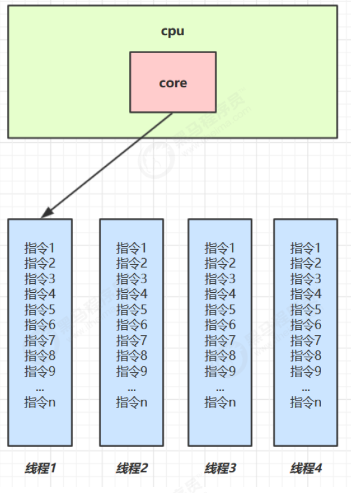
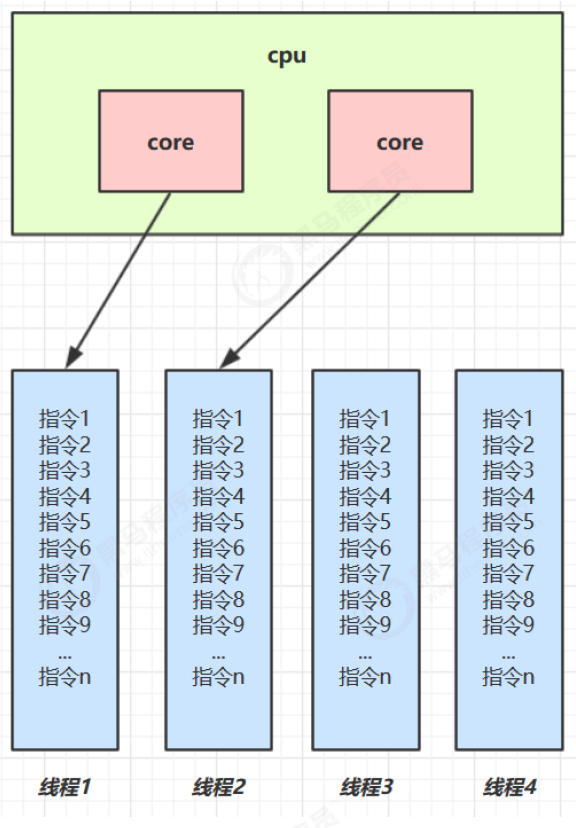

# muti thread

## 進程與執行續(線程)

### 進程
- 程式由指令和資料組成，但這些指令要運行，資料要讀寫，就必須將指令載入到 CPU，資料載入至記憶體。 在指令運行過程中還需要用到磁碟、網路等設備。 進程就是用來載入指令、管理記憶體、管理 IO 的
- 當一個程式被運行，從磁碟加載這個程式的程式碼到內存，這時就開啟了一個進程。
- 進程就可以視為程式的一個實例。 大部分程式可以同時執行多個實例進程（例如記事本、畫圖、瀏覽器
等等），也有的程式只能啟動一個實例進程（例如網易雲音樂、360 安全衛士等）

### 執行緒
- 一個行程之內可以分為一到多個執行緒。
- 一個執行緒就是一個指令流，將指令流中的一條指令以一定的順序交給 CPU 執行
- Java 中，執行緒作為最小調度單位，進程作為資源分配的最小單位。 在 windows 中進程是不活動的，只是作為線程的容器

## 併行(parallel)與併發(concurrent)

### 併發(concurrent)

- 就是一個CPU輪流執行多個執行緒


- 單核心 cpu 下，執行緒實際上還是 串列執行 的。 作業系統中有一個元件叫做任務調度器，將 cpu 的時間片（windows下時間片最小約為 15 毫秒）分給不同的程式使用，只是由於 cpu 在線程間（時間片很短）的切換非常快，人類感覺是 同時運行的 。 總結為一句話是： 微觀串行，宏觀並行，

- 一般會將這種 執行緒輪流使用 CPU 的做法稱為並發， concurrent



### 併行(parallel)

- 就是多個CPU同時執行多個執行緒

- 多核心 cpu下，每個 核心（core） 都可以調度運行線程，這時候線程可以是並行的。




- 引用 Rob Pike 的一段描述：
  - 並發（concurrent）是同一時間應對（dealing with）多件事情的能力
  - 並行（parallel）是同一時間動手做（doing）多件事情的能力


## Thread原理

### 棧與棧禎

- Java Virtual Machine Stacks （Java 虛擬機器堆疊）

- 我們都知道 JVM 中由堆疊、堆疊、方法區所組成，其中棧記憶體是給誰用的呢？ 其實就是線程，每個線程啟動後，虛擬
機器就會為其分配一塊棧記憶體。
- 每個棧由多個棧幀（Frame）組成，對應每次方法呼叫時所佔用的記憶體
- 每個執行緒只能有一個活動棧幀，對應目前正在執行的那個方法

### 線程上下文切換(Thread Context Switch)


- 因為以下一些原因導致 cpu 不再執行目前的線程，轉而執行另一個線程的程式碼
  - 線程的 cpu 時間片用完
  - 垃圾回收
  - 有更高優先權的執行緒需要運行
  - 線程自己呼叫了 sleep、yield、wait、join、park、synchronized、lock 等方法
- 當 Context Switch 發生時，需要由作業系統保存目前執行緒的狀態，並恢復另一個執行緒的狀態，Java 中對應的概念
是程式計數器（Program Counter Register），它的功能是記住下一條 jvm 指令的執行位址，是執行緒私有的
  - 狀態包括程式計數器、虛擬機器棧中每個棧幀的信息，如局部變數、操作數棧、返回地址等
  - Context Switch 頻繁發生會影響效能

## 常見的方法

|方法名|static|功能說明|注意事項|
|--|--|--|--|
|start()||啟動一個新的Thread，在新的Thread運行run方法中的代碼|start 方法只是讓線程進入就緒，裡面程式碼不一定立刻運行（CPU 的時間片還沒分給它）。 每個線程對象的start方法只能呼叫一次，如果呼叫了多次會出現IllegalThreadStateException|
|run()||新執行緒啟動後會呼叫的方法|如果在建構 Thread 物件時傳遞了Runnable 參數，則執行緒啟動後會呼叫 Runnable 中的 run 方法，否則默認不執行任何操作。但可以創建 Thread 的子類對象，來覆寫預設行為|
|join()||等待調用該方法的執行緒運行結束||
|join(long n)||等待執行緒運行結束,最多等待 n毫秒||
|getId()||獲取執行緒長整型的id|id唯一|
|getName()||獲取執行緒名||
|setName(String)||修改執行緒名||
|getPriority()||獲取執行緒優先級||
|setPriority(int)||修改執行緒優先級|java中規定執行緒優先權是1~10 的整數，較大的優先權能提高該執行緒被 CPU 調度的機率|
|getState()||獲取執行緒狀態|Java 中執行緒狀態以 6 個 enum 表示，分別為：NEW, RUNNABLE, BLOCKED, WAITING,TIMED_WAITING, TERMINATED|
|isInterrupted()||判斷是否被打斷|不會清除打斷標記|
|isAlive()||執行緒是否存活(還沒有運行完畢)||
|interrupt()||打斷執行緒|如果被打斷線程正在 sleep，wait，join 會導致被打斷的執行緒拋出 InterruptedException，並清除打斷標記；如果打斷的正在運行的線程，則會設定 打斷標記；park 的線程被打斷，也會設定打斷標記|
|interrupted()|static|判斷當前線程是否被打斷|會清除打斷標記|
|currentThread()|static|獲取當前正在執行的執行緒||
|sleep(long n)|static|讓目前執行的線程休眠n毫秒，休眠時讓出 cpu
的時間片給其它執行緒||
|yield()|static|提示線程調度器，讓出當前線程對CPU的使用權|主要為了測試和調試|

## 3.6start與run

### 調用run

```java

```


