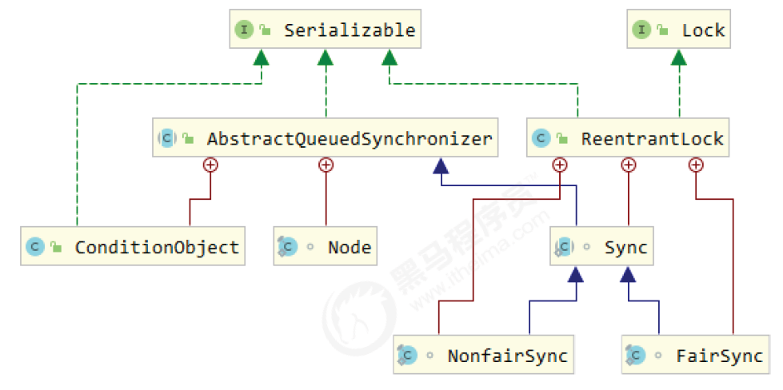
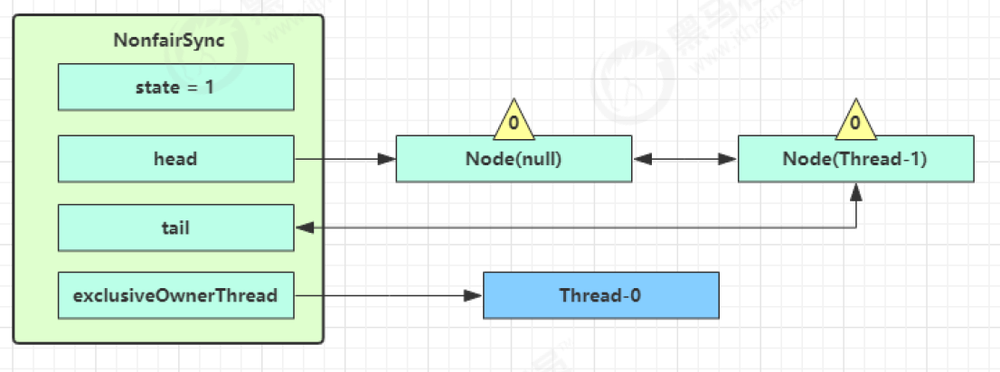

# 共享模型之工具

## 1 執行緒池
### 1. 自訂執行緒池


步驟1：自訂拒絕策略接口

```java
@FunctionalInterface // 拒絕策略
interface RejectPolicy<T> {
  void reject(BlockingQueue<T> queue, T task);
}
```

步驟2：自訂任務佇列

```java
class BlockingQueue<T> {
	// 1. 任務佇列
	private Deque<T> queue = new ArrayDeque<>();
	// 2. 鎖
	private ReentrantLock lock = new ReentrantLock();
	// 3. 生產者條件變數
	private Condition fullWaitSet = lock.newCondition();
	// 4. 消費者條件變數
	private Condition emptyWaitSet = lock.newCondition();
	// 5. 容量
	private int capcity;

	public BlockingQueue(int capcity) {
		this.capcity = capcity;
	}

	// 帶超時阻塞獲取
	public T poll(long timeout, TimeUnit unit) {
		lock.lock();
		try {
			// 將 timeout 統一轉換為 奈秒
			long nanos = unit.toNanos(timeout);
			while (queue.isEmpty()) {
				try {
					// 傳回值是剩餘時間
					if (nanos <= 0) {
						return null;
					}
					nanos = emptyWaitSet.awaitNanos(nanos);
				} catch (InterruptedException e) {
					e.printStackTrace();
				}
			}
			T t = queue.removeFirst();
			fullWaitSet.signal();
			return t;
		} finally {
			lock.unlock();
		}
	}

	// 阻塞取得
	public T take() {
		lock.lock();
		try {
			while (queue.isEmpty()) {
				try {
					emptyWaitSet.await();
				} catch (InterruptedException e) {
					e.printStackTrace();
				}
			}
			T t = queue.removeFirst();
			fullWaitSet.signal();
			return t;
		} finally {
			lock.unlock();
		}
	}

	// 阻塞新增
	public void put(T task) {
		lock.lock();
		try {
			while (queue.size() == capcity) {
				try {
					log.debug("等待加入任務隊列 {} ...", task);
					fullWaitSet.await();
				} catch (InterruptedException e) {
					e.printStackTrace();
				}
			}
			log.debug("加入任務佇列 {}", task);
			queue.addLast(task);
			emptyWaitSet.signal();
		} finally {
			lock.unlock();
		}
	}

	// 帶超時時間阻塞添加
	public boolean offer(T task, long timeout, TimeUnit timeUnit) {
		lock.lock();
		try {
			long nanos = timeUnit.toNanos(timeout);
			while (queue.size() == capcity) {
				try {
					if (nanos <= 0) {
						return false;
					}
					log.debug("等待加入任務隊列 {} ...", task);
					nanos = fullWaitSet.awaitNanos(nanos);
				} catch (InterruptedException e) {
					e.printStackTrace();
				}
			}
			log.debug("加入任務佇列 {}", task);
			queue.addLast(task);
			emptyWaitSet.signal();
			return true;
		} finally {
			lock.unlock();
		}
	}

	public int size() {
		lock.lock();
		try {
			return queue.size();
		} finally {
			lock.unlock();
		}
	}

	public void tryPut(RejectPolicy<T> rejectPolicy, T task) {
		lock.lock();
		try {
			// 判斷隊列是否滿
			if (queue.size() == capcity) {
				rejectPolicy.reject(this, task);
			} else { // 有空閒
				log.debug("加入任務佇列 {}", task);
				queue.addLast(task);
				emptyWaitSet.signal();
			}
		} finally {
			lock.unlock();
		}
	}
}
```

步驟3：自訂執行緒池

```java
class ThreadPool {
	// 任務佇列
	private BlockingQueue<Runnable> taskQueue;
	// 執行緒集合
	private HashSet<Worker> workers = new HashSet<>();
	// 核心執行緒數
	private int coreSize;
	// 取得任務時的超時時間private long timeout;
	private TimeUnit timeUnit;
	private RejectPolicy<Runnable> rejectPolicy;

	// 執行任務
	public void execute(Runnable task) {
		// 當任務數沒有超過 coreSize 時，直接交給 worker 物件執行
		// 若任務數超過 coreSize 時，加入任務佇列暫存
		synchronized (workers) {
			if (workers.size() < coreSize) {
				Worker worker = new Worker(task);
				log.debug("新增 worker{}, {}", worker, task);
				workers.add(worker);
				worker.start();
			} else {
				// taskQueue.put(task);
				// 1) 死等
				// 2) 帶超時等待
				// 3) 讓呼叫者放棄任務執行
				// 4) 讓呼叫者拋出異常
				// 5) 讓呼叫者自己執行任務
				taskQueue.tryPut(rejectPolicy, task);
			}
		}
	}

	public ThreadPool(int coreSize, long timeout, TimeUnit timeUnit, int queueCapcity,
			RejectPolicy<Runnable> rejectPolicy) {
		this.coreSize = coreSize;
		this.timeout = timeout;
		this.timeUnit = timeUnit;
		this.taskQueue = new BlockingQueue<>(queueCapcity);
		this.rejectPolicy = rejectPolicy;
	}

	class Worker extends Thread {
		private Runnable task;

		public Worker(Runnable task) {
			this.task = task;
		}

		@Override
		public void run() {
			// 執行任務
			// 1) 當 task 不為空，執行任務
			// 2) 當 task 執行完畢，然後接著從任務佇列取得任務並執行
			// while(task != null || (task = taskQueue.take()) != null) {
			while (task != null || (task = taskQueue.poll(timeout, timeUnit)) != null) {
				try {
					log.debug("正在執行中...{}", task);
					task.run();
				} catch (Exception e) {
					e.printStackTrace();
				} finally {
					task = null;
				}
			}
			synchronized (workers) {
				log.debug("worker 移除{}", this);
				workers.remove(this);
			}
		}
	}
}
```

步驟4：測試

```java
	public static void main(String[] args) {
		ThreadPool threadPool = new ThreadPool(1, 1000, TimeUnit.MILLISECONDS, 1, (queue, task) -> {
			// 1. 死等
			// queue.put(task);
			// 2) 帶超時等待
			// queue.offer(task, 1500, TimeUnit.MILLISECONDS);
			// 3) 讓呼叫者放棄任務執行
			// log.debug("放棄{}", task);
			// 4) 讓呼叫者拋出異常
			// throw new RuntimeException("任務執行失敗 " + task);
			// 5) 讓呼叫者自己執行任務
			task.run();
		});
		for (int i = 0; i < 4; i++) {
			int j = i;
			threadPool.execute(() -> {
				try {
					Thread.sleep(1000L);
				} catch (InterruptedException e) {
					e.printStackTrace();
				}
				log.debug("{}", j);
			});
		}
	}
```
### 2.ThreadPoolExecutor


#### 1) 執行緒池狀態
- ThreadPoolExecutor 使用 int 的高 3 位元來表示線程池狀態，低 29 位元表示線程數量

||||||
|-|-|-|-|-|
|狀態名|高3位元|接收新任務|處理阻塞隊列任務|說明||
|RUNNING|111|Y|Y|||
|SHUTDOWN|000|N|Y|不會接收新任務，但會處理阻塞佇列剩餘任務||
|STOP|001|N|N|會(調用interrupted)中斷正在執行的任務，並拋棄阻塞佇列任務||
|TIDYING|010|-|-|任務全執行完畢，活動線程為 0 即將進入終結||
|TERMINATED|011|-|-|終點狀態||


- 從數字上比較，***TERMINATED > TIDYING > STOP > SHUTDOWN > RUNNING(因為最高位代表正負數，1為負數，所以最小)***
- 這些資訊儲存在一個原子變數 ctl 中，目的是將線程池狀態與線程個數合而為一，這樣就可以用一次 cas 原子操作進行賦值


```java
// c 為舊值， ctlOf 傳回結果為新值
ctl.compareAndSet(c, ctlOf(targetState, workerCountOf(c))));
// rs 為高 3 位元代表執行緒池狀態， wc 為低 29 位元代表執行緒個數，ctl 是合併它們
private static int ctlOf(int rs, int wc) { return rs | wc; }
```

#### 2) 構造方法

```java
public ThreadPoolExecutor(int corePoolSize,
int maximumPoolSize,
long keepAliveTime,
TimeUnit unit,
BlockingQueue<Runnable> workQueue,
ThreadFactory threadFactory,
RejectedExecutionHandler handler)
```
- ***JDK將執行緒池分成核心執行緒跟救急執行緒***
  - ***救急執行緒=maximumPoolSize - corePoolSize***
  - ***核心執行緒=corePoolSize***

- corePoolSize 核心執行緒數目 (最多保留的執行緒數)
- maximumPoolSize 最大執行緒數目
- keepAliveTime 生存時間 - 針對救急線程
- unit 時間單位 - 針對救急線程
- workQueue 阻塞隊列
- threadFactory 線程工廠 - 可以為線程創建時起個好名字
- handler 拒絕策略

工作方式


- 線程池中剛開始沒有線程，當一個任務提交給線程池後，線程池會建立一個新線程來執行任務。
- 當執行緒數達到 corePoolSize 並沒有執行緒空閒，這時再加入任務，新加的任務會被加入workQueue 佇列排隊，直到有空閒的線程。
- 如果佇列選擇了有界佇列(存放任務的佇列是有限制容量的)，那麼任務超過了佇列大小時，會建立 maximumPoolSize - corePoolSize 數目的線程來救急。
- 如果執行緒到達 maximumPoolSize 仍然有新任務這時會執行拒絕策略。 拒絕策略 jdk 提供了 4 種實現，其它著名框架也提供了實現

  - AbortPolicy 讓呼叫者拋出 RejectedExecutionException 異常，這是預設策略CallerRunsPolicy 讓呼叫者執行任務
  - DiscardPolicy 放棄本次任務
  - DiscardOldestPolicy 放棄隊列中最早的任務，這項任務取而代之
  - Dubbo 的實現，在拋出 RejectedExecutionException 異常之前會記錄日誌，並 dump 線程棧信息，方便定位問題
  - Netty 的實現，是建立一個新執行緒來執行任務
  - ActiveMQ 的實現，帶超時等待（60s）嘗試放入佇列，類似我們先前自訂的拒絕策略
  - PinPoint 的實現，它使用了一個拒絕策略鏈，會逐一嘗試策略鏈中每個拒絕策略


- 當高峰過去後，超過corePoolSize 的救急線程如果一段時間沒有任務做，需要結束節省資源，這個時間由keepAliveTime 和 unit 來控制。


根據這個建構方法，JDK Executors 類別中提供了眾多工廠方法來創建各種用途的線程池


#### 3) newFixedThreadPool


```java
public static ExecutorService newFixedThreadPool(int nThreads) {
  return new ThreadPoolExecutor(nThreads, nThreads,
  0L, TimeUnit.MILLISECONDS,
  new LinkedBlockingQueue<Runnable>());
}
```

- 特點
  - 核心線程數 == 最大線程數（沒有救急線程被創建），因此也無需超時時間
  - 阻塞隊列是無界的，可以放任意數量的任務
>- 評估 適用於任務量已知，相對耗時的任務


#### 4) newCachedThreadPool

```java
public static ExecutorService newCachedThreadPool() {
return new ThreadPoolExecutor(0, Integer.MAX_VALUE,
60L, TimeUnit.SECONDS,
new SynchronousQueue<Runnable>());
}
```

特點
- 核心執行緒數是 0， 最大執行緒數是 Integer.MAX_VALUE，救急執行緒的空閒生存時間是 60s，表示
  - 全部都是救急線程（60s 後可以回收）
  - 救援線程可以無限創建
- 佇列採用了 SynchronousQueue 實作特點是，它沒有容量，也沒有執行緒來取是放不進去的（一手付錢、一手交貨）

```java
		SynchronousQueue<Integer> integers = new SynchronousQueue<>();
		new Thread(() -> {
			try {
				log.debug("putting {} ", 1);
				integers.put(1);
				log.debug("{} putted...", 1);
				log.debug("putting...{} ", 2);
				integers.put(2);
				log.debug("{} putted...", 2);
			} catch (InterruptedException e) {
				e.printStackTrace();
			}
		}, "t1").start();
		sleep(1);
		new Thread(() -> {
			try {
				log.debug("taking {}", 1);
				integers.take();
			} catch (InterruptedException e) {
				e.printStackTrace();
			}
		}, "t2").start();
		sleep(1);
		new Thread(() -> {
			try {
				log.debug("taking {}", 2);
				integers.take();
			} catch (InterruptedException e) {
				e.printStackTrace();
			}
		}, "t3").start();
```

```java
11:48:15.500 c.TestSynchronousQueue [t1] - putting 1
11:48:16.500 c.TestSynchronousQueue [t2] - taking 1
11:48:16.500 c.TestSynchronousQueue [t1] - 1 putted...
11:48:16.500 c.TestSynchronousQueue [t1] - putting...2
11:48:17.502 c.TestSynchronousQueue [t3] - taking 2
11:48:17.503 c.TestSynchronousQueue [t1] - 2 putted...
```

>- 評估 整個執行緒池表現為執行緒數會根據任務量不斷增長，沒有上限，當任務執行完畢，空閒 1分鐘後釋放線程。 適合任務數較密集，但每個任務執行時間較短的情況

#### 5) newSingleThreadExecutor


```java
	public static ExecutorService newSingleThreadExecutor() {
		return new FinalizableDelegatedExecutorService(
				new ThreadPoolExecutor(1, 1, 0L, TimeUnit.MILLISECONDS, new LinkedBlockingQueue<Runnable>()));
	}
```

使用場景：

希望多個任務排隊執行。 執行緒數固定為 1，任務數多於 1 時，會放入無界佇列排隊。 任務執行完畢，這唯一的線程也不會被釋放。

區別：

- 自己建立一個單執行緒串列執行任務，如果任務執行失敗而終止那麼沒有任何補救措施，而執行緒池還會新建一個線程，保證池的正常運作
- Executors.newSingleThreadExecutor() 執行緒個數永遠是1，不能修改
  - FinalizableDelegatedExecutorService 應用的是裝飾器模式，只對外暴露了 ExecutorService 接口，因此不能呼叫 ThreadPoolExecutor 中特有的方法
- Executors.newFixedThreadPool(1) 初始時為1，以後還可以修改
  - 對外暴露的是 ThreadPoolExecutor 對象，可以強轉後調用 setCorePoolSize 等方法進行修改


#### 6) 提交任務

```java
// 執行任務
void execute(Runnable command);
// 提交任務 task，用回傳值 Future 得到任務執行結果
<T> Future<T> submit(Callable<T> task);
// 提交 tasks 中所有任務
<T> List<Future<T>> invokeAll(Collection<? extends Callable<T>> tasks)
throws InterruptedException;
// 提交 tasks 中所有任務，帶超時時間
<T> List<Future<T>> invokeAll(Collection<? extends Callable<T>> tasks,
long timeout, TimeUnit unit)
throws InterruptedException;
// 提交 tasks 中所有任務，哪個任務先成功執行完畢，返回此任務執行結果，其它任務取消
<T> T invokeAny(Collection<? extends Callable<T>> tasks)
throws InterruptedException, ExecutionException;
// 提交 tasks 中所有任務，哪個任務先成功執行完畢，返回此任務執行結果，其它任務取消，帶超時時間
<T> T invokeAny(Collection<? extends Callable<T>> tasks,
long timeout, TimeUnit unit) throws InterruptedException, ExecutionException, TimeoutException;
```

#### 7) 關閉執行緒池

shutdown

```java
/*
線程池狀態變成 SHUTDOWN
- 不會接收新任務
- 但已提交任務會執行完
- 此方法不會阻塞呼叫執行緒的執行
*/
void shutdown();
```

```java
	public void shutdown() {
		final ReentrantLock mainLock = this.mainLock;
		mainLock.lock();
		try {
			checkShutdownAccess();
			// 修改執行緒池狀態
			advanceRunState(SHUTDOWN);
			// 僅會打斷空閒線程
			interruptIdleWorkers();
			onShutdown(); // 擴充點 ScheduledThreadPoolExecutor
		} finally {
			mainLock.unlock();
		}
		// 嘗試終結(沒有運行的執行緒可以立刻終結，如果還有運行的執行緒也不會等)
		tryTerminate();
	}
```

shutdownNow
```java
/*
線程池狀態變成 STOP
- 不會接收新任務
- 會將佇列中的任務當成返回值傳回
- 並以 interrupt 的方式中斷正在執行的任務
*/
List<Runnable> shutdownNow();
```


```java
	public List<Runnable> shutdownNow() {
		List<Runnable> tasks;
		final ReentrantLock mainLock = this.mainLock;
		mainLock.lock();
		try {
			checkShutdownAccess();
			// 修改執行緒池狀態
			advanceRunState(STOP);
			// 打斷所有執行緒
			interruptWorkers();
			// 取得佇列中剩餘任務
			tasks = drainQueue();
		} finally {
			mainLock.unlock();
		}
		// 嘗試終結
		tryTerminate();
		return tasks;
	}
```

其它方法
```java
// 不在 RUNNING 狀態的執行緒池，此方法就傳回 true
boolean isShutdown();
// 執行緒池狀態是否為 TERMINATED
boolean isTerminated();
// 呼叫 shutdown 後，由於呼叫執行緒並不會等待所有任務執行結束，因此如果它想在執行緒池 TERMINATED 後做些事
情，可以利用此方法等待
boolean awaitTermination(long timeout, TimeUnit unit) throws InterruptedException;
```

## 模式之 Worker Thread

### 1. 定義

讓有限的工作執行緒（Worker Thread）來輪流非同步處理無限多的任務。 也可以將其歸類為分工模式，它的典型實現就是線程池，也體現了經典設計模式中的享元模式。

例如，海底撈的服務員（線程），輪流處理每位客人的點餐（任務），如果為每位客人都配一名專屬的服務員，那麼成本就太高了（比較另一種多執行緒設計模式：Thread-Per-Message）

注意，不同任務類型應該使用不同的執行緒池，這樣能夠避免飢餓，並且能提升效率

例如，如果一個餐廳的工人既要招呼客人（任務類型A），又要到後廚做菜（任務類型B）顯然效率不咋地，分成服務生（線程池A）與廚師（線程池B）更為合理，當然你能想到更細緻的分工

### 2. 飢餓
固定大小線程池會有飢餓現象

- 兩個工人是同一個線程池中的兩個線程
- 他們要做的事情是：為客人點餐和到後廚做菜，這是兩個階段的工作
  - 客人點餐：必須先點完餐，等菜做好，上菜，在此期間處理點餐的工人必須等待
  - 後廚做菜：沒啥說的，做就是了
- 例如工人A 處理了點餐任務，接下來它要等 工人B 把菜做好，然後上菜，他倆也配合的蠻好
- 但現在同時來了兩個客人，這個時候工人A 和工人B 都去處理點餐了，這時沒人做飯了，飢餓

```java
public class TestDeadLock {
	static final List<String> MENU = Arrays.asList("地三鮮", "宮保雞丁", "辣子雞丁", "烤雞翅");
	static Random RANDOM = new Random();

	static String cooking() {
		return MENU.get(RANDOM.nextInt(MENU.size()));
	}

	public static void main(String[] args) {
		ExecutorService executorService = Executors.newFixedThreadPool(2);
		executorService.execute(() -> {
			log.debug("處理點餐...");
			Future<String> f = executorService.submit(() -> {
				log.debug("做菜");
				return cooking();
			});
			try {
				log.debug("上菜: {}", f.get());
			} catch (InterruptedException | ExecutionException e) {
				e.printStackTrace();
			}
		});
		/*
		 * executorService.execute(() -> { log.debug("處理點餐..."); Future<String> f =
		 * executorService.submit(() -> { log.debug("做菜"); return cooking(); }); try {
		 * log.debug("上菜: {}", f.get()); } catch (InterruptedException |
		 * ExecutionException e) {e.printStackTrace(); } });
		 */
	}
}
```

輸出

```java
17:21:27.883 c.TestDeadLock [pool-1-thread-1] - 處理點餐...
17:21:27.891 c.TestDeadLock [pool-1-thread-2] - 做菜
17:21:27.891 c.TestDeadLock [pool-1-thread-1] - 上菜: 烤雞翅
```

當註解取消後，可能的輸出


```java
17:08:41.339 c.TestDeadLock [pool-1-thread-2] - 處理點餐...
17:08:41.339 c.TestDeadLock [pool-1-thread-1] - 處理點餐...
```
解決方法可以增加執行緒池的大小，不過不是根本解決方案，還是前面提到的，不同的任務類型，採用不同的執行緒池，例如：

```java
public class TestDeadLock {
	static final List<String> MENU = Arrays.asList("地三鮮", "宮保雞丁", "辣子雞丁", "烤雞翅");
	static Random RANDOM = new Random();

	static String cooking() {
		return MENU.get(RANDOM.nextInt(MENU.size()));
	}

	public static void main(String[] args) {
		ExecutorService waiterPool = Executors.newFixedThreadPool(1);
		ExecutorService cookPool = Executors.newFixedThreadPool(1);
		waiterPool.execute(() -> {
			log.debug("處理點餐...");
			Future<String> f = cookPool.submit(() -> {
				log.debug("做菜");
				return cooking();
			});
			try {
				log.debug("上菜: {}", f.get());
			} catch (InterruptedException | ExecutionException e) {
				e.printStackTrace();
			}
		});
		waiterPool.execute(() -> {
			log.debug("處理點餐...");
			Future<String> f = cookPool.submit(() -> {
				log.debug("做菜");
				return cooking();
			});
			try {
				log.debug("上菜: {}", f.get());
			} catch (InterruptedException | ExecutionException e) {
				e.printStackTrace();
			}
		});
	}
}
```

```java
17:25:14.626 c.TestDeadLock [pool-1-thread-1] - 處理點餐...
17:25:14.630 c.TestDeadLock [pool-2-thread-1] - 做菜
17:25:14.631 c.TestDeadLock [pool-1-thread-1] - 上菜: 地三鮮
17:25:14.632 c.TestDeadLock [pool-1-thread-1] - 處理點餐...
17:25:14.632 c.TestDeadLock [pool-2-thread-1] - 做菜
17:25:14.632 c.TestDeadLock [pool-1-thread-1] - 上菜: 辣子雞丁
```

### 3. 創建多少線程池合適
- 過小會導致程式無法充分利用系統資源、容易導致飢餓
- 過大會導致更多的線程上下文切換，佔用更多內存

#### 3.1 CPU 密集型運算

通常採用 cpu 核數 + 1 能夠實現最優的 CPU 使用率，+1 是保證當線程由於頁缺失故障（操作系統）或其它原因導致暫停時，額外的這個執行緒就能頂上去，保證 CPU 時脈週期不會浪費

#### 3.2 I/O 密集型運算

CPU 不會總是處於繁忙狀態，例如，當你執行業務計算時，這時候會使用 CPU 資源，但當你執行 I/O 作業時、遠端RPC 呼叫時，包含進行資料庫操作時，這時候 CPU 就閒下來了，你可以利用多執行緒來提高它的使用率。

經驗公式如下

***執行緒數 = 核數 * 期望 CPU 使用率 * 總時間(CPU運算時間+等待時間) / CPU 運算時間***

例如 4 核心 CPU 計算時間是 50% ，其它等待時間是 50%，期望 cpu 被 100% 利用，套用公式

***4 * 100% * 100% / 50% = 8***

例如 4 核心 CPU 計算時間是 10% ，其它等待時間是 90%，期望 cpu 被 100% 利用，套用公式

***4 * 100% * 100% / 10% = 40***


### 4. 自訂執行緒池


步驟1：自訂拒絕策略接口

```java
@FunctionalInterface // 拒絕策略
interface RejectPolicy<T> {
	void reject(BlockingQueue<T> queue, T task);
}
```
步驟2：自訂任務佇列
```java
class BlockingQueue<T> {
	// 1. 任務佇列
	private Deque<T> queue = new ArrayDeque<>();
	// 2. 鎖
	private ReentrantLock lock = new ReentrantLock();
	// 3. 生產者條件變數
	private Condition fullWaitSet = lock.newCondition();
	// 4. 消費者條件變數
	private Condition emptyWaitSet = lock.newCondition();
	// 5. 容量
	private int capcity;

	public BlockingQueue(int capcity) {
		this.capcity = capcity;
	}// 帶超時阻塞獲取

	public T poll(long timeout, TimeUnit unit) {
		lock.lock();
		try {
			// 將 timeout 統一轉換為 奈秒
			long nanos = unit.toNanos(timeout);
			while (queue.isEmpty()) {
				try {
					// 傳回值是剩餘時間
					if (nanos <= 0) {
						return null;
					}
					nanos = emptyWaitSet.awaitNanos(nanos);
				} catch (InterruptedException e) {
					e.printStackTrace();
				}
			}
			T t = queue.removeFirst();
			fullWaitSet.signal();
			return t;
		} finally {
			lock.unlock();
		}
	}

	// 阻塞取得
	public T take() {
		lock.lock();
		try {
			while (queue.isEmpty()) {
				try {
					emptyWaitSet.await();
				} catch (InterruptedException e) {
					e.printStackTrace();
				}
			}
			T t = queue.removeFirst();
			fullWaitSet.signal();
			return t;
		} finally {
			lock.unlock();
		}
	}

	// 阻塞新增
	public void put(T task) {
		lock.lock();
		try {
			while (queue.size() == capcity) {
				try {
					log.debug("等待加入任務隊列 {} ...", task);
					fullWaitSet.await();
				} catch (InterruptedException e) {
					e.printStackTrace();
				}
			}
			log.debug("加入任務佇列 {}", task);
			queue.addLast(task);
			emptyWaitSet.signal();
		} finally {
			lock.unlock();
		}
	}

	// 帶超時時間阻塞添加
	public boolean offer(T task, long timeout, TimeUnit timeUnit) {
		lock.lock();
		try {
			long nanos = timeUnit.toNanos(timeout);
			while (queue.size() == capcity) {
				try {
					if (nanos <= 0) {
						return false;
					}
					log.debug("等待加入任務隊列 {} ...", task);
					nanos = fullWaitSet.awaitNanos(nanos);
				} catch (InterruptedException e) {
					e.printStackTrace();
				}
			}
			log.debug("加入任務佇列 {}", task);
			queue.addLast(task);
			emptyWaitSet.signal();
			return true;
		} finally {
			lock.unlock();
		}
	}

	public int size() {
		lock.lock();
		try {
			return queue.size();
		} finally {
			lock.unlock();
		}
	}

	public void tryPut(RejectPolicy<T> rejectPolicy, T task) {
		lock.lock();
		try {
			// 判斷隊列是否滿
			if (queue.size() == capcity) {
				rejectPolicy.reject(this, task);
			} else { // 有空閒log.debug("加入任務佇列 {}", task);
				queue.addLast(task);
				emptyWaitSet.signal();
			}
		} finally {
			lock.unlock();
		}
	}
}
```

步驟3：自訂執行緒池

```java
class ThreadPool {
	// 任務佇列
	private BlockingQueue<Runnable> taskQueue;
	// 執行緒集合
	private HashSet<Worker> workers = new HashSet<>();
	// 核心執行緒數
	private int coreSize;
	// 取得任務時的超時時間
	private long timeout;
	private TimeUnit timeUnit;
	private RejectPolicy<Runnable> rejectPolicy;

	// 執行任務
	public void execute(Runnable task) {
		// 當任務數沒有超過 coreSize 時，直接交給 worker 物件執行
		// 若任務數超過 coreSize 時，加入任務佇列暫存
		synchronized (workers) {
			if (workers.size() < coreSize) {
				Worker worker = new Worker(task);
				log.debug("新增 worker{}, {}", worker, task);
				workers.add(worker);
				worker.start();
			} else {
				// taskQueue.put(task);
				// 1) 死等
				// 2) 帶超時等待
				// 3) 讓呼叫者放棄任務執行
				// 4) 讓呼叫者拋出異常
				// 5) 讓呼叫者自己執行任務
				taskQueue.tryPut(rejectPolicy, task);
			}
		}
	}

	public ThreadPool(int coreSize, long timeout, TimeUnit timeUnit, int queueCapcity,
			RejectPolicy<Runnable> rejectPolicy) {
		this.coreSize = coreSize;
		this.timeout = timeout;
		this.timeUnit = timeUnit;
		this.taskQueue = new BlockingQueue<>(queueCapcity);
		this.rejectPolicy = rejectPolicy;
	}

	class Worker extends Thread {
		private Runnable task;

		public Worker(Runnable task) {
			this.task = task;
		}

		@Override
		public void run() {
			// 執行任務
			// 1) 當 task 不為空，執行任務
			// 2) 當 task 執行完畢，然後接著從任務佇列取得任務並執行
			// while(task != null || (task = taskQueue.take()) != null) {
			while (task != null || (task = taskQueue.poll(timeout, timeUnit)) != null) {
				try {
					log.debug("正在執行中...{}", task);
					task.run();
				} catch (Exception e) {
					e.printStackTrace();
				} finally {
					task = null;
				}
			}
			synchronized (workers) {
				log.debug("worker 移除{}", this);
				workers.remove(this);
			}
		}
	}
}
```


步驟4：測試

```java
	public static void main(String[] args) {
		ThreadPool threadPool = new ThreadPool(1, 1000, TimeUnit.MILLISECONDS, 1, (queue, task) -> {
			// 1. 死等
			// queue.put(task);
			// 2) 帶超時等待
			// queue.offer(task, 1500, TimeUnit.MILLISECONDS);
			// 3) 讓呼叫者放棄任務執行
			// log.debug("放棄{}", task);
			// 4) 讓呼叫者拋出異常
			// throw new RuntimeException("任務執行失敗 " + task);// 5) 讓呼叫者自己執行任務
			task.run();
		});
		for (int i = 0; i < 4; i++) {
			int j = i;
			threadPool.execute(() -> {
				try {
					Thread.sleep(1000L);
				} catch (InterruptedException e) {
					e.printStackTrace();
				}
				log.debug("{}", j);
			});
		}
	}
```

#### 8) 任務調度執行緒池
在『任務排程執行緒池』功能加入之前，可以使用 java.util.Timer 來實現定時功能，Timer 的優點在於簡單易用，但由於所有任務都是由同一個執行緒來調度，因此所有任務都是串列執行的，同一時間只能有一個任務在執行，前一個任務的延遲或異常都會影響到之後的任務。


```java
public static void main(String[] args) {
Timer timer = new Timer();

TimerTask task1 = new TimerTask() {
@Override
public void run() {
log.debug("task 1");
sleep(2);
}
};
TimerTask task2 = new TimerTask() {
@Override
public void run() {
log.debug("task 2");
}
};
// 使用 timer 新增兩個任務，希望它們都在 1s 後執行
// 但由於 timer 內只有一個執行緒來順序執行佇列中的任務，因此『任務1』的延時，影響了『任務2』的執行
timer.schedule(task1, 1000);
timer.schedule(task2, 1000);
}
```

```java
20:46:09.444 c.TestTimer [main] - start...
20:46:10.447 c.TestTimer [Timer-0] - task 1
20:46:12.448 c.TestTimer [Timer-0] - task 2
```

使用 ScheduledExecutorService 改寫：
```java
		ScheduledExecutorService executor = Executors.newScheduledThreadPool(2);
		// 新增兩個任務，希望它們都在 1s 後執行
		executor.schedule(() -> {
			System.out.println("任務1，執行時間：" + new Date());
			try {
				Thread.sleep(2000);
			} catch (InterruptedException e) {
			}
		}, 1000, TimeUnit.MILLISECONDS);
		executor.schedule(() -> {
			System.out.println("任務2，執行時間：" + new Date());
		}, 1000, TimeUnit.MILLISECONDS);
```


```java
任務1，執行時間：Thu Jan 03 12:45:17 CST 2019
任務2，執行時間：Thu Jan 03 12:45:17 CST 2019
```

scheduleAtFixedRate 範例：
```java
		ScheduledExecutorService pool = Executors.newScheduledThreadPool(1);
		log.debug("start...");
		pool.scheduleAtFixedRate(() -> {
			log.debug("running...");
		}, 1, 1, TimeUnit.SECONDS);
```

```java
21:45:43.167 c.TestTimer [main] - start...
21:45:44.215 c.TestTimer [pool-1-thread-1] - running...
21:45:45.215 c.TestTimer [pool-1-thread-1] - running...
21:45:46.215 c.TestTimer [pool-1-thread-1] - running...
21:45:47.215 c.TestTimer [pool-1-thread-1] - running...
```

scheduleAtFixedRate 範例（任務執行時間超過了間隔時間）：
```java
		ScheduledExecutorService pool = Executors.newScheduledThreadPool(1);
		log.debug("start...");
		pool.scheduleAtFixedRate(() -> {
			log.debug("running...");
			sleep(2);
		}, 1, 1, TimeUnit.SECONDS);
```
輸出分析：一開始，延時 1s，接下來，由於任務執行時間 > 間隔時間，間隔被‘撐’到了 2s
```java
21:44:30.311 c.TestTimer [main] - start...
21:44:31.360 c.TestTimer [pool-1-thread-1] - running...
21:44:33.361 c.TestTimer [pool-1-thread-1] - running...
21:44:35.362 c.TestTimer [pool-1-thread-1] - running...
21:44:37.362 c.TestTimer [pool-1-thread-1] - running...
```
scheduleWithFixedDelay 例子：
```java
		ScheduledExecutorService pool = Executors.newScheduledThreadPool(1);
		log.debug("start...");
		pool.scheduleWithFixedDelay(() -> {
			log.debug("running...");
			sleep(2);
		}, 1, 1, TimeUnit.SECONDS);
```
輸出分析：一開始，延時 1s，scheduleWithFixedDelay 的間隔是 上一個任務結束 <-> 延時 <-> 下一個任務開始 所以間隔都是 3s
```java
21:40:55.078 c.TestTimer [main] - start...
21:40:56.140 c.TestTimer [pool-1-thread-1] - running...
21:40:59.143 c.TestTimer [pool-1-thread-1] - running...
21:41:02.145 c.TestTimer [pool-1-thread-1] - running...
21:41:05.147 c.TestTimer [pool-1-thread-1] - running...
```

> 評價 整個執行緒池表現為：執行緒數固定，任務數多於執行緒數時，會放入無界隊列排隊。 任務執行完畢，這些線程也不會被釋放。 用來執行延遲或重複執行的任務


#### 9) 正確處理執行任務異常
方法1：主動捉異常

```java
		ExecutorService pool = Executors.newFixedThreadPool(1);
		pool.submit(() -> {
			try {
				log.debug("task1");
				int i = 1 / 0;
			} catch (Exception e) {
				log.error("error:", e);
			}
		});
```

```java
21:59:04.558 c.TestTimer [pool-1-thread-1] - task1
21:59:04.562 c.TestTimer [pool-1-thread-1] - error:
java.lang.ArithmeticException: / by zero
    at cn.itcast.n8.TestTimer.lambda$main$0(TestTimer.java:28)
    at java.util.concurrent.Executors$RunnableAdapter.call(Executors.java:511)
    at java.util.concurrent.FutureTask.run(FutureTask.java:266)
    at java.util.concurrent.ThreadPoolExecutor.runWorker(ThreadPoolExecutor.java:1149)
    at java.util.concurrent.ThreadPoolExecutor$Worker.run(ThreadPoolExecutor.java:624)
    at java.lang.Thread.run(Thread.java:748)
```

方法2：使用 Future

```java
		ExecutorService pool = Executors.newFixedThreadPool(1);
		Future<Boolean> f = pool.submit(() -> {
			log.debug("task1");
			int i = 1 / 0;
			return true;
		});
		log.debug("result:{}", f.get());
```
```java
21:54:58.208 c.TestTimer [pool-1-thread-1] - task1
Exception in thread "main" java.util.concurrent.ExecutionException:
java.lang.ArithmeticException: / by zero
  at java.util.concurrent.FutureTask.report(FutureTask.java:122)
  at java.util.concurrent.FutureTask.get(FutureTask.java:192)
  at cn.itcast.n8.TestTimer.main(TestTimer.java:31)
Caused by: java.lang.ArithmeticException: / by zero
  at cn.itcast.n8.TestTimer.lambda$main$0(TestTimer.java:28)
  at java.util.concurrent.FutureTask.run(FutureTask.java:266)
  at java.util.concurrent.ThreadPoolExecutor.runWorker(ThreadPoolExecutor.java:1149)
  at java.util.concurrent.ThreadPoolExecutor$Worker.run(ThreadPoolExecutor.java:624)
  at java.lang.Thread.run(Thread.java:748)
```


* 應用之定時任務

#### 10) Tomcat 線程池
Tomcat 在哪裡用到了線程池呢


- LimitLatch 用來限流，可以控制最大連接個數，類似 J.U.C 中的 Semaphore 後面再說
- Acceptor 只負責【接收新的 socket 連線】
- Poller 只負責監聽 socket channel 是否有【可讀的 I/O 事件】
- 一旦可讀，封裝一個任務物件（socketProcessor），提交給 Executor 執行緒池處理
- Executor 執行緒池中的工作執行緒最終負責【處理請求】

Tomcat 線程池擴展了 ThreadPoolExecutor，行為稍有不同

- 如果總線程數達到 maximumPoolSize
  - 這時不會立刻拋 RejectedExecutionException 異常
  - 而是再次嘗試將任務放入隊列，如果還失敗，才拋出 RejectedExecutionException 異常
- 源碼 tomcat-7.0.42

```java
	public void execute(Runnable command, long timeout, TimeUnit unit) {
		submittedCount.incrementAndGet();
		try {
			super.execute(command);
		} catch (RejectedExecutionException rx) {
			if (super.getQueue() instanceof TaskQueue) {
				final TaskQueue queue = (TaskQueue) super.getQueue();
				try {
					if (!queue.force(command, timeout, unit)) {
						submittedCount.decrementAndGet();
						throw new RejectedExecutionException("Queue capacity is full.");
					}
				} catch (InterruptedException x) {
					submittedCount.decrementAndGet();
					Thread.interrupted();
					throw new RejectedExecutionException(x);
				}
			} else {
				submittedCount.decrementAndGet();
				throw rx;
			}
		}
	}
```

TaskQueue.java

```java
	public boolean force(Runnable o, long timeout, TimeUnit unit) throws InterruptedException {
		if (parent.isShutdown())
			throw new RejectedExecutionException("Executor not running, can't force a command into the queue");
		return super.offer(o, timeout, unit); // forces the item onto the queue, to be used if the taskis rejected
	}
```

Connector 配置

|配置項|默認值|說明|
|-|-|-|
|acceptorThreadCount|1|acceptor 線程數量|
|pollerThreadCount|1|poller 線程數量|
|minSpareThreads|10|核心線程數，即 corePoolSize|
|maxThreads|200|最大線程數，即 maximumPoolSize|
|executor||Executor 名稱，用來引用下面的 Executor|


Executor 線程配置

|配置項|預設值|說明|
|-|-|-|
|threadPriority|5|執行緒優先權|
|daemon|true|是否守護線程|
|minSpareThreads|25|核心執行緒數，即 corePoolSize|
|maxThreads|200|最大執行緒數，即 maximumPoolSize|
|maxIdleTime|60000|執行緒生存時間，單位是毫秒，預設值即 1 分鐘|
|maxQueueSize|Integer.MAX_VALUE|佇列長度|
|prestartminSpareThreads|false|核心執行緒是否在伺服器啟動時啟動|


### 3. Fork/Join
#### 1) 概念
- Fork/Join 是 JDK 1.7 加入的新的線程池實現，它體現的是一種分治思想，適用於能夠進行任務拆分的 cpu 密集型運算
- 所謂的任務拆分，是將一個大任務拆分為演算法上相同的小任務，直到不能拆分可以直接求解。 跟遞歸相關的一些計算，如歸併排序、斐波那契數列、都可以用分治思想來求解
- Fork/Join 在分治的基礎上加入了多線程，可以把每個任務的分解和合併交給不同的線程來完成，進一步提升了運算效率
- Fork/Join 預設會建立與 cpu 核心數大小相同的執行緒池
#### 2) 使用
- 提交給 Fork/Join 執行緒池的任務需要繼承 RecursiveTask（有回傳值）或 RecursiveAction（沒有回傳值），例如下面定義了一個對 1~n 之間的整數求和的任務

```java
@Slf4j(topic = "c.AddTask")
class AddTask1 extends RecursiveTask<Integer> {
	int n;

	public AddTask1(int n) {
		this.n = n;
	}

	@Override
	public String toString() {
		return "{" + n + '}';
	}

	@Override
	protected Integer compute() {
// 如果 n 已經為 1，可以求結果了
		if (n == 1) {
			log.debug("join() {}", n);
			return n;
		}
// 將任務進行拆分(fork)
		AddTask1 t1 = new AddTask1(n - 1);
		t1.fork();
		log.debug("fork() {} + {}", n, t1);
// 合併(join)結果
		int result = n + t1.join();
		log.debug("join() {} + {} = {}", n, t1, result);
		return result;
	}
}
```

然後提交給 ForkJoinPool 來執行
```java
public static void main(String[] args) {
  ForkJoinPool pool = new ForkJoinPool(4);
  System.out.println(pool.invoke(new AddTask1(5)));
}
```

```java
[ForkJoinPool-1-worker-0] - fork() 2 + {1}
[ForkJoinPool-1-worker-1] - fork() 5 + {4}
[ForkJoinPool-1-worker-0] - join() 1
[ForkJoinPool-1-worker-0] - join() 2 + {1} = 3
[ForkJoinPool-1-worker-2] - fork() 4 + {3}
[ForkJoinPool-1-worker-3] - fork() 3 + {2}
[ForkJoinPool-1-worker-3] - join() 3 + {2} = 6
[ForkJoinPool-1-worker-2] - join() 4 + {3} = 10
[ForkJoinPool-1-worker-1] - join() 5 + {4} = 15
15
```


```java
class AddTask3 extends RecursiveTask<Integer> {
	int begin;
	int end;

	public AddTask3(int begin, int end) {
		this.begin = begin;
		this.end = end;
	}

	@Override
	public String toString() {
		return "{" + begin + "," + end + '}';
	}

	@Override
	protected Integer compute() {
		// 5, 5
		if (begin == end) {
			log.debug("join() {}", begin);
			return begin;
		}
		// 4, 5
		if (end - begin == 1) {
			log.debug("join() {} + {} = {}", begin, end, end + begin);
			return end + begin;
		}
		// 1 5
		int mid = (end + begin) / 2; // 3
		AddTask3 t1 = new AddTask3(begin, mid); // 1,3
		t1.fork();
		AddTask3 t2 = new AddTask3(mid + 1, end); // 4,5
		t2.fork();
		log.debug("fork() {} + {} = ?", t1, t2);
		int result = t1.join() + t2.join();
		log.debug("join() {} + {} = {}", t1, t2, result);
		return result;
	}
}

```

然後提交給 ForkJoinPool 來執行

```java
public static void main(String[] args) {
  ForkJoinPool pool = new ForkJoinPool(4);
  System.out.println(pool.invoke(new AddTask3(1, 10)));
}
```

```java
[ForkJoinPool-1-worker-0] - join() 1 + 2 = 3
[ForkJoinPool-1-worker-3] - join() 4 + 5 = 9
[ForkJoinPool-1-worker-0] - join() 3
[ForkJoinPool-1-worker-1] - fork() {1,3} + {4,5} = ?
[ForkJoinPool-1-worker-2] - fork() {1,2} + {3,3} = ?
[ForkJoinPool-1-worker-2] - join() {1,2} + {3,3} = 6
[ForkJoinPool-1-worker-1] - join() {1,3} + {4,5} = 15
15
```


##　2 J.U.C

### 1. * AQS 原理

### 1. 概述
全名是 AbstractQueuedSynchronizer，是阻塞式鎖和相關的同步器工具的框架

特點：

- 用 state 屬性表示資源的狀態（分獨佔模式和共用模式），子類別需要定義如何維護這個狀態，控制如何取得
鎖和釋放鎖
  - getState - 取得 state 狀態
  - setState - 設定 state 狀態
  - compareAndSetState - cas 機制設定 state 狀態
  - 獨佔模式是只有一個執行緒能夠存取資源，而共享模式可以允許多個執行緒存取資源
- 提供了基於 FIFO 的等待佇列，類似於 Monitor 的 EntryList
- 條件變數來實現等待、喚醒機制，支援多個條件變量，類似 Monitor 的 WaitSet
  
子類別主要實作這樣一些方法（預設拋出 UnsupportedOperationException）

- tryAcquire
- tryRelease
- tryAcquireShared
- tryReleaseShared
- isHeldExclusively


***獲取鎖的姿勢***

```java
// 如果取得鎖定失敗
if (!tryAcquire(arg)) {
// 入隊, 可以選擇封鎖目前執行緒 park unpark
}
```

***釋放鎖的姿勢***
```java
// 如果釋放鎖定成功
if (tryRelease(arg)) {
// 讓阻塞執行緒恢復運行
}
```

#### 2. 實現不可重入鎖
***自訂同步器***


```java

final class MySync extends AbstractQueuedSynchronizer {
	@Override
	protected boolean tryAcquire(int acquires) {
		if (acquires == 1) {
			if (compareAndSetState(0, 1)) {
				setExclusiveOwnerThread(Thread.currentThread());
				return true;
			}
		}
		return false;
	}

	@Override
	protected boolean tryRelease(int acquires) {
		if (acquires == 1) {
			if (getState() == 0) {
				throw new IllegalMonitorStateException();
			}
			setExclusiveOwnerThread(null);
			setState(0);
			return true;
		}
		return false;
	}

	protected Condition newCondition() {
		return new ConditionObject();
	}

	@Override
	protected boolean isHeldExclusively() {
		return getState() == 1;
	}
}
```

***自訂鎖***

有了自訂同步器，很容易重複使用 AQS ，實現一個功能完備的自訂鎖

```java
class MyLock implements Lock {
	static MySync sync = new MySync();

	@Override
// 嘗試，不成功，進入等待隊列
	public void lock() {
		sync.acquire(1);
	}

	@Override
// 嘗試，不成功，進入等待隊列，可打斷
	public void lockInterruptibly() throws InterruptedException {
		sync.acquireInterruptibly(1);
	}

	@Override
// 嘗試一次，不成功返回，不進入佇列
	public boolean tryLock() {
		return sync.tryAcquire(1);
	}

	@Override
// 嘗試，不成功，進入等待佇列，有時限
	public boolean tryLock(long time, TimeUnit unit) throws InterruptedException {
		return sync.tryAcquireNanos(1, unit.toNanos(time));
	}

	@Override
// 釋放鎖
	public void unlock() {
		sync.release(1);
	}

	@Override
// 生成條件變數
	public Condition newCondition() {
		return sync.newCondition();
	}
}
```

測試一下

```java
		MyLock lock = new MyLock();
		new Thread(() -> {
			lock.lock();
			try {
				log.debug("locking...");
				sleep(1);
			} finally {
				log.debug("unlocking...");
				lock.unlock();
			}
		}, "t1").start();
		new Thread(() -> {
			lock.lock();
			try {
				log.debug("locking...");
			} finally {
				log.debug("unlocking...");
				lock.unlock();
			}
		}, "t2").start();
```

```java
22:29:28.727 c.TestAqs [t1] - locking...
22:29:29.732 c.TestAqs [t1] - unlocking...
22:29:29.732 c.TestAqs [t2] - locking...
22:29:29.732 c.TestAqs [t2] - unlocking...
```


***不可重入測試***

如果改為下面程式碼，會發現自己也會被擋住（只會印一次 locking）

```java
lock.lock();
log.debug("locking...");
lock.lock();
log.debug("locking...");
```

#### 3. 心得
***起源***

早期程式設計師會自己透過一種同步器去實現另一種相近的同步器，例如用可重入鎖去實現信號量，或反之。 這顯然不夠優雅，於是在 JSR166（java 規格提案）中創建了 AQS，提供了這種通用的同步器機制。

***目標***

AQS 要達成的功能目標

- 阻塞版本取得鎖定 acquire 和非阻塞的版本嘗試取得鎖定 tryAcquire
- 取得鎖定超時機制
- 透過打斷取消機制
- 獨佔機制及共享機制
- 條件不滿足時的等待機制


要實現的效能目標

> Instead, the primary performance goal here is scalability: to predictably maintain efficiency even, or especially, when synchronizers are contended.

***設計***

AQS 的基本想法其實很簡單

取得鎖的邏輯

```java
while(state 狀態不允許取得) {
	if(佇列中還沒有此線程) {
		入隊並阻塞
	}
}
目前執行緒出隊
````

釋放鎖的邏輯

```java
if(state 狀態允許了) {
	恢復阻塞的線程(s)
}
````


重點

- 原子維護 state 狀態
- 阻塞及恢復線程
- 維護隊列


- 1) state 設計
  - state 使用 volatile 配合 cas 保證其修改時的原子性
  - state 使用了 32bit int 來維護同步狀態，因為當時使用 long 在許多平台下測試的結果並不理想
- 2) 阻塞恢復設計
  - 早期的控制線程暫停和恢復的 api 有 suspend 和 resume，但它們是不可用的，因為如果先呼叫的 resume  那麼 suspend 將感知不到
  - 解決方法是使用 park & unpark 來實現線程的暫停和恢復，具體原理在之前講過了，先 unpark 再 park 也沒問題
  - park & unpark 是針對線程的，而不是針對同步器的，因此控製粒度更為精細
  - park 線程還可以透過 interrupt 打斷
- 3) 隊列設計
  - 使用了 FIFO 先入先出佇列，並不支援優先權佇列
  - 設計時借鑒了 CLH 隊列，它是一種單向無鎖隊列


佇列中有 head 和 tail 兩個指標節點，都以 volatile 修飾配合 cas 使用，每個節點有 state 維護節點狀態入隊偽代碼，只需要考慮 tail 賦值的原子性

```java
do {
	// 原來的 tail
	Node prev = tail;
	// 用 cas 在原來 tail 的基礎上改為 node
} while(tail.compareAndSet(prev, node))
```
出隊偽代碼

```java
// prev 是上一個節點
while((Node prev=node.prev).state != 喚醒狀態) {
}
// 設定頭節點
head = node;
```

CLH 好處：

- 無鎖，使用自旋

- 快速，無阻塞

AQS 在一些方面改進了 CLH


```java
	private Node enq(final Node node) {
		for (;;) {
			Node t = tail;
			// 佇列中還沒有元素 tail 為 null
			if (t == null) {
				// 將 head 從 null -> dummy
				if (compareAndSetHead(new Node()))
					tail = head;
			} else {
				// 將 node 的 prev 設定為原來的 tail
				node.prev = t;
				// 將 tail 從原來的 tail 設為 node
				if (compareAndSetTail(t, node)) {
					// 原來 tail 的 next 設定為 node
					t.next = node;
					return t;
				}
			}
		}
	}
```

主要用到 AQS 的並發工具類


### 2. * ReentrantLock 原理



#### 1. 非公平鎖實現原理

##### 加鎖解鎖流程

先從構造器開始看，預設為非公平鎖實現

```java
public ReentrantLock() {
	sync = new NonfairSync();
}
```

NonfairSync 繼承自 AQS

沒有競爭時


第一個競爭出現時


Thread-1 執行了

- 1. CAS 嘗試將 state 由 0 改為 1，結果失敗
- 2. 進入 tryAcquire 邏輯，這時 state 已是1，結果還是失敗
- 3. 接下來進入 addWaiter 邏輯，建構 Node 佇列
  - 圖中黃色三角形表示該 Node 的 waitStatus 狀態，其中 0 為預設正常狀態
  - Node 的創建是懶惰的
  - 其中第一個 Node 稱為 Dummy（啞元）或哨兵，用來佔位，並不關聯線程




當前線程進入 acquireQueued 邏輯

- 1. acquireQueued 會在一個死循環中不斷嘗試取得鎖，失敗後進入 park 阻塞
- 2. 如果自己是緊鄰 head（排第二位），那麼再次 tryAcquire 嘗試取得鎖，當然這時 state 仍為 1，失敗
- 3. 進入 shouldParkAfterFailedAcquire 邏輯，將前驅 node，即 head 的 waitStatus 改為 -1，這次回傳 false


- 4. shouldParkAfterFailedAcquire 執行完畢回到 acquireQueued ，再次 tryAcquire 嘗試取得鎖，當然此時state 仍為 1，失敗
- 5. 當再次進入 shouldParkAfterFailedAcquire 時，這時因為其前驅 node 的 waitStatus 已經是 -1，這次返回true
- 6. 進入 parkAndCheckInterrupt， Thread-1 park（灰色表示）
  
  
  
  
- 再次有多個執行緒經歷上述過程競爭失敗，變成這個樣子
  
  
  
- Thread-0 釋放鎖，進入 tryRelease 流程，如果成功設定
  - 設定 exclusiveOwnerThread 為 null
  - state = 0

  


目前隊列不為 null，且 head 的 waitStatus = -1，進入 unparkSuccessor 流程

找到隊列中離 head 最近的一個 Node（沒取消的），unpark 恢復其運行，本例中即為 Thread-1

回到 Thread-1 的 acquireQueued 流程

  


如果加鎖成功（沒有競爭），會設置

  - exclusiveOwnerThread 為 Thread-1，state = 1
  - head 指向剛剛 Thread-1 所在的 Node，該 Node 清空 Thread
  - 原本的 head 因為從鍊錶斷開，而可被垃圾回收

如果這時候有其它線程來競爭（非公平的體現），例如這時有 Thread-4 來了

  


如果不巧又被 Thread-4 佔了先

- Thread-4 被設定為 exclusiveOwnerThread，state = 1
- Thread-1 再次進入 acquireQueued 流程，取得鎖定失敗，重新進入 park 阻塞

#### 加鎖源碼

```java
//Sync 繼承自 AQS
static final class NonfairSync extends Sync {
	private static final long serialVersionUID = 7316153563782823691L;

//加鎖實現
	final void lock() {
		// 首先用 cas 嘗試（只嘗試一次）將 state 從 0 改為 1, 如果成功表示獲得了獨佔鎖
		if (compareAndSetState(0, 1))
			setExclusiveOwnerThread(Thread.currentThread());
		else
			// 如果嘗試失敗，進入 ㈠
			acquire(1);
	}

	// ㈠ AQS 繼承過來的方法, 方便閱讀, 放在此處
	public final void acquire(int arg) {
		// ㈡ tryAcquire
		if (!tryAcquire(arg) &&
		// 當 tryAcquire 回傳為 false 時, 先呼叫 addWaiter ㈣, 接著 acquireQueued ㈤
				acquireQueued(addWaiter(Node.EXCLUSIVE), arg)) {
			selfInterrupt();
		}
	}

	// ㈡ 進入 ㈢
	protected final boolean tryAcquire(int acquires) {
		return nonfairTryAcquire(acquires);
	}

	// ㈢ Sync 繼承過來的方法, 方便閱讀, 放在此處
	final boolean nonfairTryAcquire(int acquires) {
		final Thread current = Thread.currentThread();
		int c = getState();
		// 如果還沒有獲得鎖
		if (c == 0) {
			// 嘗試用 cas 取得, 這裡體現了非公平性: 不去檢查 AQS 佇列
			if (compareAndSetState(0, acquires)) {
				setExclusiveOwnerThread(current);
				return true;
			}
		}
		// 如果已經獲得了鎖, 執行緒還是當前執行緒, 表示發生了鎖重入
		else if (current == getExclusiveOwnerThread()) {
			// state++
			int nextc = c + acquires;
			if (nextc < 0) // overflow
				throw new Error("Maximum lock count exceeded");
			setState(nextc);
			return true;
		}
		// 取得失敗, 回到呼叫處
		return false;
	}

	// ㈣ AQS 繼承過來的方法, 方便閱讀, 放在此處
	private Node addWaiter(Node mode) {
		// 將目前執行緒關聯到一個 Node 物件上, 模式為獨佔模式
		Node node = new Node(Thread.currentThread(), mode);
		// 如果 tail 不會為 null, cas 嘗試將 Node 物件加入 AQS 佇列尾部
		Node pred = tail;
		if (pred != null) {
			node.prev = pred;
			if (compareAndSetTail(pred, node)) {
				// 雙向鍊錶
				pred.next = node;
				return node;
			}
		}
		// 嘗試將 Node 加入 AQS, 進入 ㈥
		enq(node);
		return node;
	}

	// ㈥ AQS 繼承過來的方法, 方便閱讀, 放在此處
	private Node enq(final Node node) {
		for (;;) {
			Node t = tail;
			if (t == null) {
				// 還沒有, 設定 head 為哨兵節點（不對應線程，狀態為 0）
				if (compareAndSetHead(new Node())) {
					tail = head;
				}
			} else {
				// cas 嘗試將 Node 物件加入 AQS 佇列尾部
				node.prev = t;
				if (compareAndSetTail(t, node)) {
					t.next = node;
					return t;
				}
			}
		}
	}

	// ㈤ AQS 繼承過來的方法, 方便閱讀, 放在此處
	final boolean acquireQueued(final Node node, int arg) {
		boolean failed = true;
		try {
			boolean interrupted = false;
			for (;;) {
				final Node p = node.predecessor();
				// 上一個節點是 head, 表示輪到自己（當前線程對應的 node）了, 嘗試獲取
				if (p == head && tryAcquire(arg)) {
					// 取得成功, 設定自己（目前執行緒對應的 node）為 head
					setHead(node);
					// 上一個節點 help GC
					p.next = null;
					failed = false;
					// 回傳中斷標記 false
					return interrupted;
				}
				if (shouldParkAfterFailedAcquire(p, node) && parkAndCheckInterrupt()) {
					// park 等待, 此時 Node 的狀態被置為 Node.SIGNAL ㈧
					// 判斷是否應 park, 進入 ㈦
					interrupted = true;
				}
			}
		} finally

		{
			if (failed)
				cancelAcquire(node);
		}
	}

	// ㈦ AQS 繼承過來的方法, 方便閱讀, 放在此處
	private static boolean shouldParkAfterFailedAcquire(Node pred, Node node) {
		// 取得上一個節點的狀態
		int ws = pred.waitStatus;
		if (ws == Node.SIGNAL) {
			// 上一個節點都在阻塞, 那麼自己也阻塞好了
			return true;
		}
		// > 0 表示取消狀態
		if (ws > 0) {
			// 上一個節點取消, 那麼重構刪除前面所有取消的節點, 返回到外層循環重試
			do {
				node.prev = pred = pred.prev;
			} while (pred.waitStatus > 0);
			pred.next = node;
		} else {
			// 這次還沒阻塞
			// 但下次如果重試不成功, 則需要阻塞，這時需要設定上一個節點狀態為 Node.SIGNAL
			compareAndSetWaitStatus(pred, ws, Node.SIGNAL);
		}
		return false;
	}

	// ㈧ 阻塞目前線程
	private final boolean parkAndCheckInterrupt() {
		LockSupport.park(this);
		return Thread.interrupted();
	}
}
```

### 3. 讀寫鎖
#### 3.1 ReentrantReadWriteLock
當讀取操作遠高於寫入操作時，這時候使用 讀寫鎖定 讓 讀-讀 可以並發，提高效能。 類似於資料庫中的 select ...
from ... lock in share mode

提供一個 資料容器類別 內部分別使用讀鎖保護資料的 read() 方法，寫入鎖定保護資料的 write() 方法

```java
class DataContainer {
	private Object data;
	private ReentrantReadWriteLock rw = new ReentrantReadWriteLock();
	private ReentrantReadWriteLock.ReadLock r = rw.readLock();
	private ReentrantReadWriteLock.WriteLock w = rw.writeLock();

	public Object read() {
		log.debug("取得讀鎖...");
		r.lock();
		try {
			log.debug("讀取");
			sleep(1);
			return data;
		} finally {
			log.debug("釋放讀取鎖定...");
			r.unlock();
		}
	}

	public void write() {
		log.debug("取得寫入鎖...");
		w.lock();
		try {
			log.debug("寫入");
			sleep(1);
		} finally {
			log.debug("釋放寫入鎖...");
			w.unlock();
		}
	}
}
```
測試 ***讀鎖-讀鎖*** 可以並發


```java
		DataContainer dataContainer = new DataContainer();
		new Thread(() -> {
			dataContainer.read();
		}, "t1").start();
		new Thread(() -> {
			dataContainer.read();
		}, "t2").start();
```

輸出結果，從這裡可以看到 Thread-0 鎖定期間，Thread-1 的讀取操作不受影響

```java
14:05:14.341 c.DataContainer [t2] - 取得讀鎖...
14:05:14.341 c.DataContainer [t1] - 取得讀鎖...
14:05:14.345 c.DataContainer [t1] - 讀取
14:05:14.345 c.DataContainer [t2] - 讀取
14:05:15.365 c.DataContainer [t2] - 釋放讀取鎖定...
14:05:15.386 c.DataContainer [t1] - 釋放讀取鎖定...
```

測試 ***讀鎖-寫鎖*** 互相阻塞


```java
		DataContainer dataContainer = new DataContainer();
		new Thread(() -> {
			dataContainer.read();
		}, "t1").start();
		Thread.sleep(100);
		new Thread(() -> {
			dataContainer.write();
		}, "t2").start();
```

```java
14:04:21.838 c.DataContainer [t1] - 取得讀鎖...
14:04:21.838 c.DataContainer [t2] - 取得寫鎖...
14:04:21.841 c.DataContainer [t2] - 寫入
14:04:22.843 c.DataContainer [t2] - 釋放寫鎖...
14:04:22.843 c.DataContainer [t1] - 讀取
14:04:23.843 c.DataContainer [t1] - 釋放讀取鎖定...
```

***寫鎖-寫鎖*** 也是互相阻塞的，這裡就不測試了


- 注意事項
  - 讀鎖不支援條件變量
  - 重入時升級不支援：即持有讀鎖的情況下去取得寫鎖，會導致取得寫入鎖永久等待

```java
r.lock();
try {
  // ...
  w.lock();
  try {
    // ...
  } finally{
    w.unlock();
  }
} finally{
  r.unlock();
}
```

重入時降級支援：即持有寫入鎖的情況下去取得讀鎖

```java
class CachedData {
	Object data;
// 是否有效，如果失效，需要重新計算 data
	volatile boolean cacheValid;
	final ReentrantReadWriteLock rwl = new ReentrantReadWriteLock();

	void processCachedData() {
		rwl.readLock().lock();
		if (!cacheValid) {
			// 取得寫鎖前必須釋放讀鎖
			rwl.readLock().unlock();
			rwl.writeLock().lock();
			try {
				// 判斷是否有其它線程已經獲取了寫鎖、更新了緩存, 避免重複更新
				if (!cacheValid) {
					data = ...
					cacheValid = true;
				}
				// 降級為讀鎖, 釋放寫鎖, 這樣能夠讓它執行緒讀取緩存
				rwl.readLock().lock();
			} 
			finally {
				rwl.writeLock().unlock();
			}
		}
		// 自己用完資料, 釋放讀鎖
		try {
			use(data);
		} 
		finally {
			rwl.readLock().unlock();
		}
	}
}

```

> 注意
> 是否需要 unpark 是由目前節點的前驅節點的 waitStatus == Node.SIGNAL 來決定，而不是本節點的
waitStatus 決定

##### 解鎖原始碼

```java
//Sync 繼承自 AQS
static final class NonfairSync extends Sync {
//解鎖實現
	public void unlock() {
		sync.release(1);
	}

//AQS 繼承過來的方法, 方便閱讀, 放在此處
	public final boolean release(int arg) {
//嘗試釋放鎖, 進入 ㈠
		if (tryRelease(arg)) {
//佇列頭節點 unpark
			Node h = head;
			if (
//隊列不為 null
			h != null &&
//waitStatus == Node.SIGNAL 才需要 unpark
					h.waitStatus != 0) {
//unpark AQS 中等待的線程, 進入 ㈡
				unparkSuccessor(h);
			}
			return true;
		}
		return false;
	}

//㈠ Sync 繼承過來的方法, 方便閱讀, 放在此處
	protected final boolean tryRelease(int releases) {
//state--
		int c = getState() - releases;
		if (Thread.currentThread() != getExclusiveOwnerThread())
			throw new IllegalMonitorStateException();
		boolean free = false;
//支援鎖定重入, 只有 state 減為 0, 才釋放成功
		if (c == 0) {
			free = true;
			setExclusiveOwnerThread(null);
		}
		setState(c);
		return free;
	}

//㈡ AQS 繼承過來的方法, 方便閱讀, 放在此處
	private void unparkSuccessor(Node node) {
//如果狀態為 Node.SIGNAL 嘗試重置狀態為 0
//不成功也可以
		int ws = node.waitStatus;
		if (ws < 0) {
			compareAndSetWaitStatus(node, ws, 0);
		}
//找到需要 unpark 的節點, 但本節點從 AQS 佇列中脫離, 是由喚醒節點完成的Node s = node.next;
//不考慮已取消的節點, 從 AQS 佇列從後至前找到佇列最前面需要 unpark 的節點
		if (s == null || s.waitStatus > 0) {
			s = null;
			for (Node t = tail; t != null && t != node; t = t.prev)
				if (t.waitStatus <= 0)
					s = t;
		}
		if (s != null)
			LockSupport.unpark(s.thread);
	}
}
```

#### 2. 可重入原理

```java
static final class NonfairSync extends Sync {
	// ...
	// Sync 繼承過來的方法, 方便閱讀, 放在此處
	final boolean nonfairTryAcquire(int acquires) {
		final Thread current = Thread.currentThread();
		int c = getState();
		if (c == 0) {
			if (compareAndSetState(0, acquires)) {
				setExclusiveOwnerThread(current);
				return true;
			}
		}
		// 如果已經獲得了鎖, 執行緒還是當前執行緒, 表示發生了鎖重入
		else if (current == getExclusiveOwnerThread()) {
			// state++
			int nextc = c + acquires;
			if (nextc < 0) // overflow
				throw new Error("Maximum lock count exceeded");
			setState(nextc);
			return true;
		}
		return false;
	}

	// Sync 繼承過來的方法, 方便閱讀, 放在此處
	protected final boolean tryRelease(int releases) {
		// state--
		int c = getState() - releases;
		if (Thread.currentThread() != getExclusiveOwnerThread())
			throw new IllegalMonitorStateException();
		boolean free = false;
		// 支援鎖定重入, 只有 state 減為 0, 才釋放成功
		if (c == 0) {
			free = true;
			setExclusiveOwnerThread(null);
		}
		setState(c);
		return free;
	}
}
```

####　3. 可打斷原理
##### 不可打斷模式

在此模式下，即使它被打斷，仍會駐留在 AQS 隊列中，一直要等到獲得鎖後方能得知自己被打斷了

```java
//Sync 繼承自 AQS
static final class NonfairSync extends Sync {
//...
	private final boolean parkAndCheckInterrupt() {
//如果打斷標記已經是 true, 則 park 會失效
		LockSupport.park(this);
//interrupted 會清除打斷標記
		return Thread.interrupted();
	}

	final boolean acquireQueued(final Node node, int arg) {
		boolean failed = true;
		try {
			boolean interrupted = false;
			for (;;) {
				final Node p = node.predecessor();
				if (p == head && tryAcquire(arg)) {
					setHead(node);
					p.next = null;
					failed = false;
//還是需要獲得鎖後, 才能回到打斷狀態
					return interrupted;
				}
				if (shouldParkAfterFailedAcquire(p, node) && parkAndCheckInterrupt()) {
//如果是因為 interrupt 被喚醒, 回傳打斷狀態為 true
					interrupted = true;
				}
			}
		} finally {
			if (failed)
				cancelAcquire(node);
		}
	}

	public final void acquire(int arg) {
		if (!tryAcquire(arg) && acquireQueued(addWaiter(Node.EXCLUSIVE), arg)) {
			// 如果打斷狀態為 true
			selfInterrupt();
		}
	}

	static void selfInterrupt() {
		// 重新產生一次中斷
		Thread.currentThread().interrupt();
	}
}
```

##### 可打斷模式


```java
static final class NonfairSync extends Sync {
	public final void acquireInterruptibly(int arg) throws InterruptedException {
		if (Thread.interrupted())
			throw new InterruptedException();
// 如果沒有獲得到鎖, 進入 ㈠
		if (!tryAcquire(arg))
			doAcquireInterruptibly(arg);
	}

// ㈠ 可打斷的取得鎖定流程
	private void doAcquireInterruptibly(int arg) throws InterruptedException {
		final Node node = addWaiter(Node.EXCLUSIVE);
		boolean failed = true;
		try {
			for (;;) {
				final Node p = node.predecessor();
				if (p == head && tryAcquire(arg)) {
					setHead(node);
					p.next = null; // help GC
					failed = false;
					return;
				}
				if (shouldParkAfterFailedAcquire(p, node) && parkAndCheckInterrupt()) {
// 在 park 過程中如果被 interrupt 會進入此
// 這時候拋出異常, 而不會再進入 for (;;)
					throw new InterruptedException();
				}
			}
		} finally {
			if (failed)
				cancelAcquire(node);
		}
	}
}
```

#### 4. 公平鎖實現原理

```java
static final class FairSync extends Sync {
	private static final long serialVersionUID = -3000897897090466540L;

	final void lock() {
		acquire(1);
	}

// AQS 繼承過來的方法, 方便閱讀, 放在此處
	public final void acquire(int arg) {
		if (!tryAcquire(arg) && acquireQueued(addWaiter(Node.EXCLUSIVE), arg)) {
			selfInterrupt();
		}
	}

// 與非公平鎖主要區別在於 tryAcquire 方法的實現
	protected final boolean tryAcquire(int acquires) {
		final Thread current = Thread.currentThread();
		int c = getState();
		if (c == 0) {
// 先檢查 AQS 佇列中是否有前驅節點, 沒有才去競爭
			if (!hasQueuedPredecessors() && compareAndSetState(0, acquires)) {
				setExclusiveOwnerThread(current);
				return true;
			}
		} else if (current == getExclusiveOwnerThread()) {
			int nextc = c + acquires;
			if (nextc < 0)
				throw new Error("Maximum lock count exceeded");
			setState(nextc);
			return true;
		}
		return false;
	}

// ㈠ AQS 繼承過來的方法, 方便閱讀, 放在此處
	public final boolean hasQueuedPredecessors() {
		Node t = tail;
		Node h = head;
		Node s;
// h != t 時表示佇列中有 Node
		return h != t && (
// (s = h.next) == null 表示佇列中還有沒有老二
		(s = h.next) == null || // 或佇列中老二線程不是此線程
				s.thread != Thread.currentThread());
	}
}
```

#### 5. 條件變數實現原理

每個條件變數其實就對應一個等待佇列，其實作類別是 ConditionObject

##### await 流程

開始 Thread-0 持有鎖，呼叫 await，進入 ConditionObject 的 addConditionWaiter 流程

建立新的 Node 狀態為 -2（Node.CONDITION），關聯 Thread-0，加入等待佇列尾部


接下來進入 AQS 的 fullyRelease 流程，釋放同步器上的鎖


unpark AQS 佇列中的下一個節點，競爭鎖，假設沒有其他競爭線程，那麼 Thread-1 競爭成功


park 阻塞 Thread-0


##### signal 流程
假設 Thread-1 要來喚醒 Thread-0 進


進入 ConditionObject 的 doSignal 流程，取得等待佇列中第一個 Node，即 Thread-0 所在 Node


執行 transferForSignal 流程，將該 Node 加入 AQS 佇列尾部，將 Thread-0 的 waitStatus 改為 0，Thread-3 的waitStatus 改為 -1


Thread-1 釋放鎖，進入 unlock 流程，略

##### 原始碼

```java
public class ConditionObject implements Condition, java.io.Serializable {
	private static final long serialVersionUID = 1173984872572414699L;
// 第一個等待節點
	private transient Node firstWaiter;
// 最後一個等待節點
	private transient Node lastWaiter;

	public ConditionObject() {
	}

// ㈠ 新增一個 Node 至等待佇列
	private Node addConditionWaiter() {
		Node t = lastWaiter;
// 所有已取消的 Node 從佇列鍊錶刪除, 見 ㈡
		if (t != null && t.waitStatus != Node.CONDITION) {
			unlinkCancelledWaiters();
			t = lastWaiter;
		}
// 建立一個關聯目前執行緒的新 Node, 新增至佇列尾部
		Node node = new Node(Thread.currentThread(), Node.CONDITION);
		if (t == null)
			firstWaiter = node;
		else
			t.nextWaiter = node;
		lastWaiter = node;
		return node;
	}

// 喚醒 - 將沒取消的第一個節點轉移至 AQS 佇列
	private void doSignal(Node first) {
		do {
// 已經是尾節點了
			if ((firstWaiter = first.nextWaiter) == null) {
				lastWaiter = null;
			}
			first.nextWaiter = null;
		} while (
// 將等待佇列中的 Node 轉移至 AQS 佇列, 不成功且還有節點則繼續循環 ㈢
		!transferForSignal(first) &&
// 隊列還有節點
				(first = firstWaiter) != null);
	}

// 外部類別方法, 方便閱讀, 放在此處
// ㈢ 如果節點狀態是取消, 回傳 false 表示轉移失敗, 否則轉移成功
final boolean transferForSignal(Node node) {
// 如果狀態已經不是 Node.CONDITION, 說明被取消了
if (!compareAndSetWaitStatus(node, Node.CONDITION, 0))
return false;
// 加入 AQS 佇列尾部
Node p = enq(node);
int ws = p.waitStatus;
if (
// 上一個節點被取消
ws > 0 ||
// 上一個節點不能設定狀態為 Node.SIGNAL
!compareAndSetWaitStatus(p, ws, Node.SIGNAL)
) {
// unpark 取消阻塞, 讓執行緒重新同步狀態
LockSupport.unpark(node.thread);
}
return true;
}
// 全部喚醒 - 等待佇列的所有節點轉移至 AQS 佇列private void doSignalAll(Node first) {
	lastWaiter=firstWaiter=null;do

	{
		Node next = first.nextWaiter;
		first.nextWaiter = null;
		transferForSignal(first);
		first = next;
	}while(first!=null);
}

// ㈡
private void unlinkCancelledWaiters() {
// ...
}

// 喚醒 - 必須持有鎖定才能喚醒, 因此 doSignal 內無需考慮加鎖
	public final void signal() {
		if (!isHeldExclusively())
			throw new IllegalMonitorStateException();
		Node first = firstWaiter;
		if (first != null)
			doSignal(first);
	}

// 全部喚醒 - 必須持有鎖定才能喚醒, 因此 doSignalAll 內無需考慮加鎖
	public final void signalAll() {
		if (!isHeldExclusively())
			throw new IllegalMonitorStateException();
		Node first = firstWaiter;
		if (first != null)
			doSignalAll(first);
	}

// 無法打斷等待 - 直到被喚醒
	public final void awaitUninterruptibly() {
// 新增一個 Node 至等待佇列, 見 ㈠
		Node node = addConditionWaiter();
// 釋放節點所持有的鎖, 見 ㈣
		int savedState = fullyRelease(node);
		boolean interrupted = false;
// 如果節點尚未轉移至 AQS 佇列, 阻塞
		while (!isOnSyncQueue(node)) {
// park 阻塞
			LockSupport.park(this);
// 如果被打斷, 僅設定打斷狀態
			if (Thread.interrupted())
				interrupted = true;
		}
// 喚醒後, 嘗試競爭鎖定, 如果失敗進入 AQS 佇列
		if (acquireQueued(node, savedState) || interrupted)
			selfInterrupt();
	}// 外部類別方法, 方便閱讀, 放在此處
//㈣ 因為某線程可能會重入，所以需要將 state 全部釋放

	final int fullyRelease(Node node) {
		boolean failed = true;
		try {
			int savedState = getState();
			if (release(savedState)) {
				failed = false;
				return savedState;
			} else {
				throw new IllegalMonitorStateException();
			}
		} finally {
			if (failed)
				node.waitStatus = Node.CANCELLED;
		}
	}

//打斷模式 - 在退出等待時重新設定打斷狀態
	private static final int REINTERRUPT = 1;
//打斷模式 - 在退出等待時拋出異常
	private static final int THROW_IE = -1;

//判斷打斷模式
	private int checkInterruptWhileWaiting(Node node) {
		return Thread.interrupted() ? (transferAfterCancelledWait(node) ? THROW_IE : REINTERRUPT) : 0;
	}

//㈤ 應用打斷模式
	private void reportInterruptAfterWait(int interruptMode) throws InterruptedException {
		if (interruptMode == THROW_IE)
			throw new InterruptedException();
		else if (interruptMode == REINTERRUPT)
			selfInterrupt();
	}

//等待 - 直到被喚醒或打斷
	public final void await() throws InterruptedException {
		if (Thread.interrupted()) {
			throw new InterruptedException();
		}
//新增一個 Node 至等待佇列, 見 ㈠
		Node node = addConditionWaiter();
//釋放節點持有的鎖
		int savedState = fullyRelease(node);
		int interruptMode = 0;
//如果節點尚未轉移至 AQS 佇列, 阻塞
		while (!isOnSyncQueue(node)) {
//park 阻塞
			LockSupport.park(this);// 如果被打斷, 退出等待佇列
			if ((interruptMode = checkInterruptWhileWaiting(node)) != 0)
				break;
		}
// 退出等待佇列後, 還需要取得 AQS 佇列的鎖
		if (acquireQueued(node, savedState) && interruptMode != THROW_IE)
			interruptMode = REINTERRUPT;
// 所有已取消的 Node 從佇列鍊錶刪除, 見 ㈡
		if (node.nextWaiter != null)
			unlinkCancelledWaiters();
// 應用打斷模式, 見 ㈤
		if (interruptMode != 0)
			reportInterruptAfterWait(interruptMode);
	}

// 等待 - 直到被喚醒或打斷或超時
	public final long awaitNanos(long nanosTimeout) throws InterruptedException {
		if (Thread.interrupted()) {
			throw new InterruptedException();
		}
// 新增一個 Node 至等待佇列, 見 ㈠
		Node node = addConditionWaiter();
// 釋放節點持有的鎖
		int savedState = fullyRelease(node);
// 取得最後期限
		final long deadline = System.nanoTime() + nanosTimeout;
		int interruptMode = 0;
// 如果節點尚未轉移至 AQS 佇列, 阻塞
		while (!isOnSyncQueue(node)) {
// 已逾時, 退出等待佇列
			if (nanosTimeout <= 0L) {
				transferAfterCancelledWait(node);
				break;
			}
// park 阻塞一定時間, spinForTimeoutThreshold 為 1000 ns
			if (nanosTimeout >= spinForTimeoutThreshold)
				LockSupport.parkNanos(this, nanosTimeout);
// 如果被打斷, 退出等待佇列
			if ((interruptMode = checkInterruptWhileWaiting(node)) != 0)
				break;
			nanosTimeout = deadline - System.nanoTime();
		}
// 退出等待佇列後, 還需要取得 AQS 佇列的鎖
		if (acquireQueued(node, savedState) && interruptMode != THROW_IE)
			interruptMode = REINTERRUPT;
// 所有已取消的 Node 從佇列鍊錶刪除, 見 ㈡
		if (node.nextWaiter != null)
			unlinkCancelledWaiters();
// 應用打斷模式, 見 ㈤
		if (interruptMode != 0)
			reportInterruptAfterWait(interruptMode);
		return deadline - System.nanoTime();
	}// 等待 - 直到被喚醒或打斷或超時, 邏輯類似於 awaitNanos

	public final boolean awaitUntil(Date deadline) throws InterruptedException {
		// ...
	}

	// 等待 - 直到被喚醒或打斷或超時, 邏輯類似於 awaitNanos
	public final boolean await(long time, TimeUnit unit) throws InterruptedException {
		// ...
	}
	// 工具方法 省略 ...
}

```


* 應用之緩存
* 讀寫鎖原理
#### 3.2 StampedLock
- 這類自 JDK 8 加入，是為了進一步優化讀取效能，它的特點是在使用讀鎖、寫鎖時都必須配合【戳】使用
加解讀鎖

```java
long stamp = lock.readLock();
lock.unlockRead(stamp);
```
加解寫鎖
```java
long stamp = lock.writeLock();
lock.unlockWrite(stamp);
```
樂觀讀，StampedLock 支援 ***tryOptimisticRead()*** 方法（樂觀讀），讀取完畢後需要做一次 ***戳校驗*** 如果校驗通過，表示這段期間確實沒有寫入操作，資料可以安全使用，如果校驗沒通過，需要重新取得讀鎖，確保資料安全。


```java
long stamp = lock.tryOptimisticRead();
// 驗戳
if(!lock.validate(stamp)){
// 鎖定升級
}
```

提供一個 資料容器類別 內部分別使用讀鎖保護資料的 ***read()*** 方法，寫入鎖定保護資料的 ***write()*** 方法

```java
class DataContainerStamped {
	private int data;
	private final StampedLock lock = new StampedLock();

	public DataContainerStamped(int data) {
		this.data = data;
	}

	public int read(int readTime) {
		long stamp = lock.tryOptimisticRead();
		log.debug("optimistic read locking...{}", stamp);
		sleep(readTime);
		if (lock.validate(stamp)) {
			log.debug("read finish...{}, data:{}", stamp, data);
			return data;
		}
// 鎖定升級 - 讀鎖
		log.debug("updating to read lock... {}", stamp);
		try {
			stamp = lock.readLock();
			log.debug("read lock {}", stamp);
			sleep(readTime);
			log.debug("read finish...{}, data:{}", stamp, data);
			return data;
		} finally {
			log.debug("read unlock {}", stamp);
			lock.unlockRead(stamp);
		}
	}

	public void write(int newData) {
		long stamp = lock.writeLock();
		log.debug("write lock {}", stamp);
		try {
			sleep(2);
			this.data = newData;
		} finally {
			log.debug("write unlock {}", stamp);
			lock.unlockWrite(stamp);
		}
	}
}
```
測試 ***讀-讀*** 可以最佳化

```java
	public static void main(String[] args) {
		DataContainerStamped dataContainer = new DataContainerStamped(1);
		new Thread(() -> {
			dataContainer.read(1);
		}, "t1").start();
		sleep(0.5);
		new Thread(() -> {
			dataContainer.read(0);
		}, "t2").start();
	}
```


輸出結果，可以看到實際沒有加讀鎖
```java
15:58:50.217 c.DataContainerStamped [t1] - optimistic read locking...256
15:58:50.717 c.DataContainerStamped [t2] - optimistic read locking...256
15:58:50.717 c.DataContainerStamped [t2] - read finish...256, data:1
15:58:51.220 c.DataContainerStamped [t1] - read finish...256, data:1
```

測試 ***讀-寫*** 時最佳化讀補加讀鎖

```java
	public static void main(String[] args) {
		DataContainerStamped dataContainer = new DataContainerStamped(1);
		new Thread(() -> {
			dataContainer.read(1);
		}, "t1").start();
		sleep(0.5);
		new Thread(() -> {
			dataContainer.write(100);
		}, "t2").start();
	}
```
```java
15:57:00.219 c.DataContainerStamped [t1] - optimistic read locking...256
15:57:00.717 c.DataContainerStamped [t2] - write lock 384
15:57:01.225 c.DataContainerStamped [t1] - updating to read lock... 256
15:57:02.719 c.DataContainerStamped [t2] - write unlock 384
15:57:02.719 c.DataContainerStamped [t1] - read lock 513
15:57:03.719 c.DataContainerStamped [t1] - read finish...513, data:1000
15:57:03.719 c.DataContainerStamped [t1] - read unlock 513
```

>注意
>- StampedLock 不支援條件變數
>- StampedLock 不支援可重入


## 4. Semaphore

基本使用

信號量，用來限制能同時存取共享資源的執行緒上限。

```java
	public static void main(String[] args) {
		// 1. 建立 semaphore 對象
		Semaphore semaphore = new Semaphore(3);
		// 2. 10個執行緒同時執行
		for (int i = 0; i < 10; i++) {
			new Thread(() -> {
				// 3. 取得許可
				try {
					semaphore.acquire();
				} catch (InterruptedException e) {
					e.printStackTrace();
				}
				try {
					log.debug("running...");
					sleep(1);
					log.debug("end...");
				} finally {
					// 4. 釋放許可
					semaphore.release();
				}
			}).start();
		}
	}
```
```java
07:35:15.485 c.TestSemaphore [Thread-2] - running...
07:35:15.485 c.TestSemaphore [Thread-1] - running...
07:35:15.485 c.TestSemaphore [Thread-0] - running...
07:35:16.490 c.TestSemaphore [Thread-2] - end...
07:35:16.490 c.TestSemaphore [Thread-0] - end...
07:35:16.490 c.TestSemaphore [Thread-1] - end...
07:35:16.490 c.TestSemaphore [Thread-3] - running...
07:35:16.490 c.TestSemaphore [Thread-5] - running...
07:35:16.490 c.TestSemaphore [Thread-4] - running...
07:35:17.490 c.TestSemaphore [Thread-5] - end...
07:35:17.490 c.TestSemaphore [Thread-4] - end...
07:35:17.490 c.TestSemaphore [Thread-3] - end...
07:35:17.490 c.TestSemaphore [Thread-6] - running...
07:35:17.490 c.TestSemaphore [Thread-7] - running...
07:35:17.490 c.TestSemaphore [Thread-9] - running...
07:35:18.491 c.TestSemaphore [Thread-6] - end...
07:35:18.491 c.TestSemaphore [Thread-7] - end...
07:35:18.491 c.TestSemaphore [Thread-9] - end...
07:35:18.491 c.TestSemaphore [Thread-8] - running...
07:35:19.492 c.TestSemaphore [Thread-8] - end...
```

* Semaphore 應用
* Semaphore 原理

##5. CountdownLatch
- 用來進行執行緒同步協作，等待所有執行緒完成倒數計時。
- 其中建構參數用來初始化等待計數值，await() 用來等待計數歸零，countDown() 用來讓計數減一

```java
	public static void main(String[] args) throws InterruptedException {
		CountDownLatch latch = new CountDownLatch(3);
		new Thread(() -> {
			log.debug("begin...");
			sleep(1);
			latch.countDown();
			log.debug("end...{}", latch.getCount());
		}).start();
		new Thread(() -> {
			log.debug("begin...");
			sleep(2);
			latch.countDown();
			log.debug("end...{}", latch.getCount());
		}).start();
		new Thread(() -> {
			log.debug("begin...");
			sleep(1.5);
			latch.countDown();
			log.debug("end...{}", latch.getCount());
		}).start();
		log.debug("waiting...");
		latch.await();
		log.debug("wait end...");
	}
```
```java
18:44:00.778 c.TestCountDownLatch [main] - waiting...
18:44:00.778 c.TestCountDownLatch [Thread-2] - begin...
18:44:00.778 c.TestCountDownLatch [Thread-0] - begin...
18:44:00.778 c.TestCountDownLatch [Thread-1] - begin...
18:44:01.782 c.TestCountDownLatch [Thread-0] - end...2
18:44:02.283 c.TestCountDownLatch [Thread-2] - end...1
18:44:02.782 c.TestCountDownLatch [Thread-1] - end...0
18:44:02.782 c.TestCountDownLatch [main] - wait end...
```

可以配合線程池使用，改進如下
```java
	public static void main(String[] args) throws InterruptedException {
		CountDownLatch latch = new CountDownLatch(3);
		ExecutorService service = Executors.newFixedThreadPool(4);
		service.submit(() -> {
			log.debug("begin...");
			sleep(1);
			latch.countDown();
			log.debug("end...{}", latch.getCount());
		});
		service.submit(() -> {
			log.debug("begin...");
			sleep(1.5);
			latch.countDown();
			log.debug("end...{}", latch.getCount());
		});
		service.submit(() -> {
			log.debug("begin...");
			sleep(2);
			latch.countDown();
			log.debug("end...{}", latch.getCount());
		});
		service.submit(() -> {
			try {
				log.debug("waiting...");
				latch.await();
				log.debug("wait end...");
			} catch (InterruptedException e) {
				e.printStackTrace();
			}
		});
	}
```

```java
18:52:25.831 c.TestCountDownLatch [pool-1-thread-3] - begin...
18:52:25.831 c.TestCountDownLatch [pool-1-thread-1] - begin...
18:52:25.831 c.TestCountDownLatch [pool-1-thread-2] - begin...
18:52:25.831 c.TestCountDownLatch [pool-1-thread-4] - waiting...
18:52:26.835 c.TestCountDownLatch [pool-1-thread-1] - end...2
18:52:27.335 c.TestCountDownLatch [pool-1-thread-2] - end...1
18:52:27.835 c.TestCountDownLatch [pool-1-thread-3] - end...0
18:52:27.835 c.TestCountDownLatch [pool-1-thread-4] - wait end...
```

* 應用同步等待多執行緒準備完畢


```java
		AtomicInteger num = new AtomicInteger(0);
		ExecutorService service = Executors.newFixedThreadPool(10, (r) -> {
			return new Thread(r, "t" + num.getAndIncrement());
		});
		CountDownLatch latch = new CountDownLatch(10);
		String[] all = new String[10];
		Random r = new Random();
		for (int j = 0; j < 10; j++) {
			int x = j;
			service.submit(() -> {
				for (int i = 0; i <= 100; i++) {
					try {
						Thread.sleep(r.nextInt(100));
					} catch (InterruptedException e) {
					}
					all[x] = Thread.currentThread().getName() + "(" + (i + "%") + ")";
					System.out.print("\r" + Arrays.toString(all));
				}
				latch.countDown();
			});
		}
		latch.await();
		System.out.println("\n遊戲開始...");
		service.shutdown();
```


中間輸出
```java
[t0(52%), t1(47%), t2(51%), t3(40%), t4(49%), t5(44%), t6(49%), t7(52%), t8(46%), t9(46%)]
```
最後輸出
```java
[t0(100%), t1(100%), t2(100%), t3(100%), t4(100%), t5(100%), t6(100%), t7(100%), t8 (100%),
t9(100%)]
遊戲開始...
```


* 應用同步等待多個遠端呼叫結束

```java
@RestController
public class TestCountDownlatchController {
	@GetMapping("/order/{id}")
	public Map<String, Object> order(@PathVariable int id) {
		HashMap<String, Object> map = new HashMap<>();
		map.put("id", id);
		map.put("total", "2300.00");
		sleep(2000);
		return map;
	}

	@GetMapping("/product/{id}")
	public Map<String, Object> product(@PathVariable int id) {
		HashMap<String, Object> map = new HashMap<>();
		if (id == 1) {
			map.put("name", "小愛音箱");
			map.put("price", 300);
		} else if (id == 2) {
			map.put("name", "小米手機");
			map.put("price", 2000);
		}
		map.put("id", id);
		sleep(1000);
		return map;
	}

	@GetMapping("/logistics/{id}")
	public Map<String, Object> logistics(@PathVariable int id) {
		HashMap<String, Object> map = new HashMap<>();
		map.put("id", id);
		map.put("name", "中通快遞");
		sleep(2500);
		return map;
	}

	private void sleep(int millis) {
		try {
			Thread.sleep(millis);
		} catch (InterruptedException e) {
			e.printStackTrace();
		}
	}
}
```

rest 遠程調用

```java
		RestTemplate restTemplate = new RestTemplate();
		log.debug("begin");
		ExecutorService service = Executors.newCachedThreadPool();
		CountDownLatch latch = new CountDownLatch(4);
		Future<Map<String, Object>> f1 = service.submit(() -> {
			Map<String, Object> r = restTemplate.getForObject("http://localhost:8080/order/{1}", Map.class, 1);
			return r;
		});
		Future<Map<String, Object>> f2 = service.submit(() -> {
			Map<String, Object> r = restTemplate.getForObject("http://localhost:8080/product/{1}", Map.class, 1);
			return r;
		});
		Future<Map<String, Object>> f3 = service.submit(() -> {
			Map<String, Object> r = restTemplate.getForObject("http://localhost:8080/product/{1}", Map.class, 2);
			return r;
		});
		Future<Map<String, Object>> f4 = service.submit(() -> {
			Map<String, Object> r = restTemplate.getForObject("http://localhost:8080/logistics/{1}", Map.class, 1);
			return r;
		});
		System.out.println(f1.get());
		System.out.println(f2.get());
		System.out.println(f3.get());
		System.out.println(f4.get());
		log.debug("執行完畢");
		service.shutdown();
```


```java
19:51:39.711 c.TestCountDownLatch [main] - begin
{total=2300.00, id=1}
{price=300, name=小愛音箱, id=1}
{price=2000, name=小米手機, id=2}
{name=中通快遞, id=1}
19:51:42.407 c.TestCountDownLatch [main] - 執行完畢
```

## 6. CyclicBarrier
循環柵欄，用來進行線程協作，等待線程滿足某個計數。 構造時設定‘計數個數’，每個線程執行到某個需要「同步」的時刻呼叫 await() 方法進行等待，當等待的執行緒數滿足『計數個數』時，繼續執行

```java
		CyclicBarrier cb = new CyclicBarrier(2); // 個數為2時才會繼續執行
		new Thread(() -> {
			System.out.println("線程1開始.." + new Date());
			try {
				cb.await(); // 當個數不足時，等待
			} catch (InterruptedException | BrokenBarrierException e) {
				e.printStackTrace();
			}
			System.out.println("執行緒1繼續往下執行..." + new Date());
		}).start();
		new Thread(() -> {
			System.out.println("線程2開始.." + new Date());
			try {
				Thread.sleep(2000);
			} catch (InterruptedException e) {
			}
			try {
				cb.await(); // 2 秒後，線程數夠2，繼續運行
			} catch (InterruptedException | BrokenBarrierException e) {
				e.printStackTrace();
			}
			System.out.println("執行緒2繼續向下執行..." + new Date());
		}).start();
```

>- 注意 CyclicBarrier 與 CountDownLatch 的主要差異在於 CyclicBarrier 是可以重複使用的 CyclicBarrier 可以被比喻為『人滿發車』

## 7. 執行緒安全集合類別概述


 線程安全集合類別可以分為三大類：
- 遺留的線程安全集如 Hashtable ， Vector
- 使用 Collections 裝飾的線程安全集合，如：
  - Collections.synchronizedCollection
  - Collections.synchronizedList
  - Collections.synchronizedMap
  - Collections.synchronizedSet
  - Collections.synchronizedNavigableMap
  - Collections.synchronizedNavigableSet
  - Collections.synchronizedSortedMap
  - Collections.synchronizedSortedSet
- java.util.concurrent.*

重點介紹java.util.concurrent.* 下的線程安全集合類，可以發現它們有規律，裡麵包含三類關鍵字：
Blocking、CopyOnWrite、Concurrent

- Blocking 大部分實作是基於鎖，並提供用來阻塞的方法
- CopyOnWrite 之類容器修改開銷相對較重
- Concurrent 類型的容器
  - 內部很多操作使用 cas 優化，一般可以提供較高吞吐量
  - 弱一致性
    - 遍歷時弱一致性，例如，當利用迭代器遍歷時，如果容器發生修改，迭代器仍然可以繼續進行遍
    歷，這時內容是舊的
    - 求大小弱一致性，size 操作未必 100% 準確
    - 讀取弱一致性

> 遍歷時如果發生了修改，對於非安全容器來講，使用 fail-fast 機制也就是讓遍歷立刻失敗，拋出
ConcurrentModificationException，不再繼續遍歷


## 8. ConcurrentHashMap

練習：單字計數

產生測試數據

```java
	static final String ALPHA = "abcedfghijklmnopqrstuvwxyz";

	public static void main(String[] args) {
		int length = ALPHA.length();
		int count = 200;
		List<String> list = new ArrayList<>(length * count);
		for (int i = 0; i < length; i++) {
			char ch = ALPHA.charAt(i);
			for (int j = 0; j < count; j++) {
				list.add(String.valueOf(ch));
			}
		}
		Collections.shuffle(list);
		for (int i = 0; i < 26; i++) {
			try (PrintWriter out = new PrintWriter(
					new OutputStreamWriter(new FileOutputStream("tmp/" + (i + 1) + ".txt")))) {
				String collect = list.subList(i * count, (i + 1) * count).stream().collect(Collectors.joining("\n"));
				out.print(collect);
			} catch (IOException e) {
			}
		}
	}
```
模版程式碼，模版程式碼中封裝了多執行緒讀取檔案的程式碼

```java
	private static <V> void demo(Supplier<Map<String, V>> supplier, BiConsumer<Map<String, V>, List<String>> consumer) {
		Map<String, V> counterMap = supplier.get();
		List<Thread> ts = new ArrayList<>();
		for (int i = 1; i <= 26; i++) {
			int idx = i;
			Thread thread = new Thread(() -> {
				List<String> words = readFromFile(idx);
				consumer.accept(counterMap, words);
			});
			ts.add(thread);
		}
		ts.forEach(t -> t.start());
		ts.forEach(t -> {
			try {
				t.join();
			} catch (InterruptedException e) {
				e.printStackTrace();
			}
		});
		System.out.println(counterMap);
	}

	public static List<String> readFromFile(int i) {
		ArrayList<String> words = new ArrayList<>();
		try (BufferedReader in = new BufferedReader(new InputStreamReader(new FileInputStream("tmp/" + i + ".txt")))) {
			while (true) {
				String word = in.readLine();
				if (word == null) {
					break;
				}
				words.add(word);
			}
			return words;
		} catch (IOException e) {
			throw new RuntimeException(e);
		}
	}
```

你要做的是實現兩個參數
- 一是提供一個 map 集合，用來存放每個單字的計數結果，key 為單字，value 為計數
- 二是提供一組操作，確保計數的安全性，會傳遞 map 集合以及 單字 List
正確結果輸出應該是每個單字出現 200 次

```java
{a=200, b=200, c=200, d=200, e=200, f=200, g=200, h=200, i=200, j=200, k=200, l=200, m=200,
n=200, o=200, p=200, q=200, r=200, s=200, t=200, u=200, v=200, w=200, x=200, y=200, z=200}
```
下面的實作為：

```java
	demo(
				// 建立 map 集合
				// 建立 ConcurrentHashMap 對不對？
				() -> new HashMap<String, Integer>(),
				// 進行計數
				(map, words) -> {
					for (String word : words) {
						Integer counter = map.get(word);
						int newValue = counter == null ? 1 : counter + 1;
						map.put(word, newValue);
					}
				});
```
有沒有問題？ 請改進
參考解答1
```java
		demo(() -> new ConcurrentHashMap<String, LongAdder>(), (map, words) -> {
			for (String word : words) {
				// 注意不能使用 putIfAbsent，此方法傳回的是上一次的 value，首次呼叫傳回 null
				map.computeIfAbsent(word, (key) -> new LongAdder()).increment();
			}
		});
```
參考解答2
```java
		demo(() -> new ConcurrentHashMap<String, Integer>(), (map, words) -> {
			for (String word : words) {
				// 函數式編程，無需原子變量
				map.merge(word, 1, Integer::sum);
			}
		});
```

* ConcurrentHashMap 原理

## 9. BlockingQueue

* BlockingQueue 原理

## 10. ConcurrentLinkedQueue
ConcurrentLinkedQueue 的設計與 LinkedBlockingQueue 非常像，也是

- 兩把【鎖】，同一時刻，可以允許兩個執行緒同時（一個生產者與一個消費者）執行
- dummy 節點的引入讓兩把【鎖】將來鎖住的是不同對象，避免競爭
- 只是這【鎖】使用了 cas 來實現

事實上，ConcurrentLinkedQueue 應用還是非常廣泛的
例如先前講的 Tomcat 的 Connector 架構時，Acceptor 作為生產者向 Poller 消費者傳遞事件訊息時，正是採用了ConcurrentLinkedQueue 將 SocketChannel 給 Poller 使用

## 11. CopyOnWriteArrayList

***CopyOnWriteArraySet*** 是它的馬甲 底層實現採用了 寫入時拷貝 的思想，增刪改操作會將底層數組拷貝一份，更改操作在新數組上執行，這時不影響其它線程的***並發讀，讀寫分離***。 以新增為例：

```java
	public boolean add(E e) {
		synchronized (lock) {
			// 取得舊的數組
			Object[] es = getArray();
			int len = es.length;
			// 拷貝新的陣列（這裡是比較耗時的操作，但不影響其它讀取線程）
			es = Arrays.copyOf(es, len + 1);
			// 新增元素
			es[len] = e;
			// 取代舊的數組
			setArray(es);
			return true;
		}
	}
```
> 這裡的原始碼版本是 Java 11，在 Java 1.8 中使用的是可重入鎖定而不是 synchronized

其它讀取操作並未加鎖，例如：

```java
	public void forEach(Consumer<? super E> action) {
		Objects.requireNonNull(action);
		for (Object x : getArray()) {
			@SuppressWarnings("unchecked")
			E e = (E) x;
			action.accept(e);
		}
	}
```

適合『讀多寫少』的應用場景
get 弱一致性


|時間點|操作|
|-|-|
|1|Thread-0 getArray()|
|2|Thread-1 getArray()|
|3|Thread-1 setArray(arrayCopy)|
|4|Thread-0 array[index]|

> 不容易測試，但問題確實存在

***迭代器弱一致性***

```java
		CopyOnWriteArrayList<Integer> list = new CopyOnWriteArrayList<>();
		list.add(1);
		list.add(2);
		list.add(3);
		Iterator<Integer> iter = list.iterator();
		new Thread(() -> {
			list.remove(0);
			System.out.println(list);
		}).start();
		sleep1s();
		while (iter.hasNext()) {
			System.out.println(iter.next());
		}
```


> 不要覺得弱一致性不好
>- 資料庫的 MVCC 都是弱一致性的表現
>- 並發高和一致性是矛盾的，需要權衡


