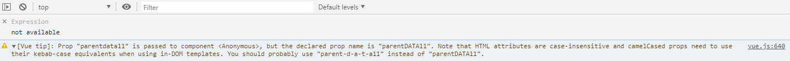
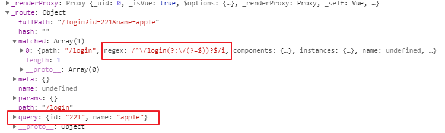
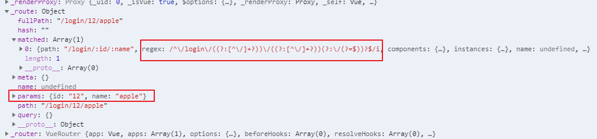
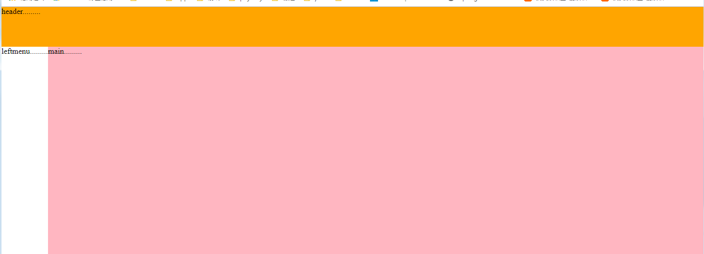

# 1. [MVVM](vue/mvvm.md )

# 2. [第一個VUE](vue/first_VUE.md)

# 3. [常用原素](vue/常用原素.md)


# 4. [表單元素輸入綁定](vue/表單元素輸入綁定.md)

# 5. [過濾器](vue/過濾器.md)

# 6.按鍵事件

使用keyup事件綁定輸入特定按鈕的事件

```html
<body>
    <div id="app">

                    
        <input type="text" name="" id="input" @keyup.enter="add">
    </div>
        
    </body>
    <script src="./lib/vue.js"></script>
<script>

    //自定義全局按鍵修飾符
    Vue.config.keyCodes.f2 = 113;

    let vm =new Vue({
        el: "#app",
        data() {
            return {
            }
        },
        methods: {
            add(){
               .....
            }
        }
    })
</script>
```

# 6.自訂義指令

bind：只調用一次，指令第一次綁定到元素時調用。在這裡可以進行一次性的初始化設置，例如CSS樣式。

inserted：被綁定元素插入父節點時調用，也就是說被放進DOM時調用，通常用於寫DOM的行為，例如focus() (僅保證父節點存在，但不一定已被插入文檔中)。

update：所在組件的 VNode 更新時調用，但是可能發生在其子 VNode 更新之前。指令的值可

函數裡的參數定義:

    el：指令所綁定的元素，可以用來直接操作 DOM
    binding：一個物件，包含以下屬性:
        name：指令名，不包括 v- 前綴。
        value：指定的綁定值，例如：v-my-directive="1 + 1" 中，綁定值為2。
        oldValue：指令綁定的前一個值，僅在 update 和 componentUpdated 鉤子中可用。無論值是否改變都可以用。
        expression：字串形式的指定表達式，例如 v-my-directive="1 + 1" 中，表達式為"1 + 1"。
        arg：傳給指令的參數，可選。例如 v-my-directive:foo 中， 參數為 "foo"。
        modifiers：一個包含修飾服的物件。例如：v-my-directive.foo.bar 中，修飾符物件為 { foo: true, bar: true }。
```html
<!DOCTYPE html>
<html lang="en">
<head>
    <meta charset="UTF-8">
    <meta name="viewport" content="width=device-width, initial-scale=1.0">
    <meta http-equiv="X-UA-Compatible" content="ie=edge">
    <title>Document</title>
</head>
<body>
    <div id="app">
        <input type="text" v-focus>
        <p>{{msg}}</p>
    </div>

    <div id="app2">
        <p v-color="'red'">{{msg}}</p>
    </div>
</body>
<script src="./lib/vue.js"></script>
<script>
    // 註冊一個全局自訂義指令 `v-focus`
    /*Vue.directive("focus",{
        bind(el){
            el.focus();
        },
        inserted(el){
            el.focus();
        },

    });*/

    let vm = new Vue({
        el:"#app",
        data() {
            return {
                msg:"apple...."
            }
        },
        //自訂義局部指令，這只存在vm這個物件裡
        directives:{
            focus:{
                inserted(el){
                     el.focus();
                } 
            }
        }
    })

    let vm1 = new Vue({
        el:"#app2",
        data() {
            return {
                msg:"apple...."
            }
        },
        directives:{
            color:{
                bind(el,binding){
                    el.style.color=binding.value;
                }
            }
        }
    })
</script>
</html>
```

# 7.過度動畫

*   a.列表過度
    *   使用<transition-group>標籤將li包覆起來
        設置過度CSS屬性.v-enter,.v-leave-to 和.v-enter-active,.v-leave-active
*   b.表格過度
    *   在tbody標籤使用is屬性指定為transition-group
        設置過度CSS屬性.v-enter,.v-leave-to 和.v-enter-active,.v-leave-active

```html
<!DOCTYPE html>
<html lang="en">
<head>
    <meta charset="UTF-8">
    <meta name="viewport" content="width=device-width, initial-scale=1.0">
    <meta http-equiv="X-UA-Compatible" content="ie=edge">
    <title>Document</title>
</head>
<link rel="stylesheet" href="./lib/bootstrap-3.3.7.css">
<body>
    <div id="app">
        
        <div class="panel panel-primary">
              <div class="panel-heading">
                    <h3 class="panel-title">Panel title</h3>
              </div>
              <div class="panel-body form-inline">
                   <label>
                       id:
                       <input type="text" v-model="id">
                   </label>
                   <label>
                       name:
                       <input type="text" v-model="name">
                   </label>
                   
                   <button type="button" class="btn btn-large btn-block btn-primary" v-on:click="add">添加</button>
                   
              </div>
        </div>
        
        <ul>
            <transition-group>
                <li v-for="(item, index) in list" :key="item.id" @click="del(index)">{{item.name}}</li>
            </transition-group>
        </ul>
    </div>

    <hr>
    <div id="app1">
        
        <div class="panel panel-primary">
              <div class="panel-heading">
                    <h3 class="panel-title">Panel title</h3>
              </div>
              <div class="panel-body form-inline">
                   <label>
                       id:
                       <input type="text" v-model="id">
                   </label>
                   <label>
                       name:
                       <input type="text" v-model="name">
                   </label>
                   
                   <button type="button" class="btn btn-large btn-block btn-primary" v-on:click="add1">添加</button>
                   
              </div>
        </div>
        
        
        <table class="table table-bordered  table-hover  table-striped table-success">
            <thead>
                <tr>
                    <th>id</th>
                    <th>name</th>
                    <th>操作</th>
                </tr>
            </thead>
            <tbody is="transition-group" name="my">
                    <tr v-for="(item, index) in list" :key="item.id">
                        <td>{{item.id}}</td>
                        <td>{{item.name}}</td>
                        <td>
                        <button type="button" class="btn btn-large btn-block btn-danger" @click="del1(index)">刪除</button>
                        </td>
                    </tr>
            </tbody>
        </table>
        
    </div>
</body>
<script src="./lib/vue.js"></script>
<style>
    /*更改表格 table-striped 顏色*/
    .table-striped > tbody > tr:nth-child(2n+1) > td, .table-striped > tbody > tr:nth-child(2n+1) > th {
    background-color: rgba(0, 255, 255, 0.096);
    }
    .table-striped > tbody > tr:nth-child(2n) > td, .table-striped > tbody > tr:nth-child(2n) > th {
    background-color: rgba(0, 255, 255, 0.356);
    }

    li {
      border: 1px dashed #999;
      margin: 5px;
      line-height: 35px;
      padding-left: 5px;
      font-size: 12px;
      width: 100%;
    }

    /*移動高亮*/
    li:hover {
      background-color: hotpink;
      transition: all 0.8s ease;
    }

    /*過度屬性*/
    .v-enter,
    .v-leave-to {
      opacity: 0;
      transform: translateY(80px);
    }

    .v-enter-active,
    .v-leave-active {
      transition: all 0.6s ease;
    }

    /* 下面的 .v-move 和 .v-leave-active 配合使用，能夠實現列表後續的元素，漸漸地飄上來的效果 */
    .v-move {
      transition: all 0.6s ease;
    }
    .v-leave-active{
      position: absolute;
    }


    .my-move {
      transition: all 0.6s ease;
    }
    .my-leave-active{
      position: absolute;
    }
    .my-enter,
    .my-leave-to {
      opacity: 0;
      transform: translateY(80px);
    }

    .my-enter-active,
    .my-leave-active {
      transition: all 1s ease;
    }
</style>
<script>
    let vm = new Vue({
        el:"#app",
        data() {
            return {
                flag:false,
                id:"",
                name:"",
                list:[
                    {id:"1",name:"frank1"},
                    {id:"2",name:"frank2"},
                    {id:"3",name:"frank3"},
                    {id:"4",name:"frank4"}
                ]
            }
        },
        methods: {
            add(){
                this.list.push({id:this.id,name:this.name});
            },
            del(index){
                this.list.splice(index,1);
            }
        },
    });

    let vm1 = new Vue({
        el:"#app1",
        data() {
            return {
                flag:false,
                id:"",
                name:"",
                list:[
                    {id:"1",name:"frank1"},
                    {id:"2",name:"frank2"},
                    {id:"3",name:"frank3"},
                    {id:"4",name:"frank4"}
                ]
            }
        },
        methods: {
            add1(){
                this.list.push({id:this.id,name:this.name});
            },
            del1(index){
                this.list.splice(index,1);
            }
        },
    });
</script>
</html>
```
# 8.組件

## 自定義全局組件有以下三種方式:

* 1.方式1

    * 使用 Vue.extend 來創建全局的Vue組件
    * 使用 Vue.component('組件的名稱',  Vue.extend 創建出來的組件模闆對象)，來註冊組件
```html
<!DOCTYPE html>
<html lang="en">
<head>
    <meta charset="UTF-8">
    <meta name="viewport" content="width=device-width, initial-scale=1.0">
    <meta http-equiv="X-UA-Compatible" content="ie=edge">
    <title>Document</title>
</head>
<body>
    <div id="app">
        <mycom1></mycom1>
    </div>    
</body>
    <script src="./lib/vue.js"></script>
    <script>


        // 1.1 使用 Vue.extend 來創建全局的Vue組件
        // let com1 = Vue.extend({
        //     template:"<h2>自定義組件方式1</h2>"// 通過 template 屬性，指定了組件要展示的HTML結構
        // });
        // 1.2 使用 Vue.component('組件的名稱', 創建出來的組件模闆對象)
        // 如果使用 Vue.component 定義全局組件的時候，組件名稱使用了 駝峰命名，則在引用組件的時候，需要把 大寫的駝峰改為小寫的字母，同時，兩個單詞之前，使用 - 鏈接；
        // 如果不使用駝峰,則直接拿名稱來使用即可;
        // Vue.component("mycom1",com1);

        Vue.component("mycom1",Vue.extend({
            template:"<h2>自定義組件方式1</h2>"// 通過 template 屬性，指定了組件要展示的HTML結構
        }));

        let vm = new Vue({
            el:"#app",
            data() {
                return {
                    
                }
            },
            methods: {
                
            },
        })
    </script>
</html>
```

* 2.方式2

    *   使用 Vue.component('組件的名稱', 創建出來的組件模闆對象)，來註冊組件

```html
<!DOCTYPE html>
<html lang="en">
<head>
    <meta charset="UTF-8">
    <meta name="viewport" content="width=device-width, initial-scale=1.0">
    <meta http-equiv="X-UA-Compatible" content="ie=edge">
    <title>Document</title>
</head>
<body>
    <div id="app">
        <mycom2></mycom2>
    </div>    
</body>
    <script src="./lib/vue.js"></script>
    <script>
        
        // 注意:不論是哪種方式創建出來的組件,組件的 template 屬性指向的模板內容,必須有且只能有唯一的一個根元素
        Vue.component("mycom2",{
            template:"<div><h2>自定義組件方式2</h2><span>1111</span></div>"
        });


        let vm = new Vue({
            el:"#app",
            data() {
                return {
                    
                }
            },
            methods: {
                
            },
        })
    </script>
</html>
```

* 3.方式3
    * 在 被控制的 #app 外面,使用 template 元素,定義組件的HTML模板結構
    * 使用 Vue.component('組件的名稱', 模板結構ID)，來註冊組件


```html
<!DOCTYPE html>
<html lang="en">
<head>
    <meta charset="UTF-8">
    <meta name="viewport" content="width=device-width, initial-scale=1.0">
    <meta http-equiv="X-UA-Compatible" content="ie=edge">
    <title>Document</title>
</head>
<body>
    <div id="app">
        <mycom3></mycom3>
    </div>    

    <!-- 在 被控制的 #app 外面,使用 template 元素,定義組件的HTML模板結構 -->
    <template id="temp1">
        <div>
            <h1>這是自定義組件3</h1>
            <span>1244</span>
        </div>
    </template>

</body>
    <script src="./lib/vue.js"></script>
    <script>
        
        Vue.component("mycom3",{
            template:"#temp1"
        });

        let vm = new Vue({
            el:"#app",
            data() {
                return {
                    
                }
            },
            methods: {
                
            },
        })

    </script>
</html>
```
## 定義私有組件

在vue物件裡使用components定義

語法:

```javascript
        let vm2 = new Vue({
            el:"#app2",
            components:{
                    組件名:{
                        template:模板定義物件
                    }
                },
        })
```

```html
<!DOCTYPE html>
<html lang="en">
<head>
    <meta charset="UTF-8">
    <meta name="viewport" content="width=device-width, initial-scale=1.0">
    <meta http-equiv="X-UA-Compatible" content="ie=edge">
    <title>Document</title>
</head>
<body>
    <div id="app2">
        <login></login>
    </div>
    <template id="temp2">
        <div>
            <h1>這是私有自定義組件3</h1>
            <span>1244</span>
        </div>
    </template>

</body>
    <script src="./lib/vue.js"></script>
    <script>
        

        let vm2 = new Vue({
            el:"#app2",
            components:{
                    login:{
                        template:"#temp2"
                    }
                },
            data() {return {} },
            methods: {},
        })
    </script>
</html>
```

## 元件DATA，METHODS

* 使用v-if v-else 實踐組件切換

```html
<!DOCTYPE html>
<html lang="en">
<head>
    <meta charset="UTF-8">
    <meta name="viewport" content="width=device-width, initial-scale=1.0">
    <meta http-equiv="X-UA-Compatible" content="ie=edge">
    <title>Document</title>
</head>
<body>
    <div id="app">
        <a href="" v-on:click.prevent="flag=true">登入</a>
        <a href="" v-on:click.prevent="flag=false">註冊</a>
        <login v-if="flag"></login>
        <register v-else="flag"></register>
    </div>

    <template id="tmp1">
        <div>
            <h1>{{msg}}</h1>
        </div>
    </template>
    <template id="tmp2">
        <div>
            <h1>{{msg2}}</h1>
        </div>
    </template>
</body>

<script src="./lib/vue.js"></script>
<script>

    Vue.component("login",{
        template:"#tmp1",
        data() {
            return {
                msg:"登入組件"
            }
        },
        methods:{}
    });

    Vue.component("register",{
        template:"#tmp2",
        data() {
            return {
                msg2:"註冊組件"
            }
        },
        methods:{}
    });

    let vm = new Vue({
        el:"#app",
        data() {
            return {
                flag:true
            }
        },
        methods: {
            
        },
    })
</script>

</html>
```

* 使用component tag 實踐組件切換

```html
<!DOCTYPE html>
<html lang="en">
<head>
    <meta charset="UTF-8">
    <meta name="viewport" content="width=device-width, initial-scale=1.0">
    <meta http-equiv="X-UA-Compatible" content="ie=edge">
    <title>Document</title>
</head>
<style>
    /*過度屬性*/
    .v-enter,
    .v-leave-to {
      opacity: 0;
      transform: translateX(180px);
    }

    .v-enter-active,
    .v-leave-active {
      transition: all 0.6s ease;
    }

</style>
<body>
    <div id="app">
        <a href="" v-on:click.prevent="comName='login'">登入</a>
        <a href="" v-on:click.prevent="comName='register'">註冊</a>
        
        <!-- 通過 mode 屬性,設置組件切換時候的 模式 -->
        <transition mode="in-out">
            <!-- Vue提供了 component ,來展示對應名稱的組件 -->
            <!-- component 是一個佔位符, :is 屬性,可以用來指定要展示的組件的名稱 -->
            <component :is="comName"></component>
        </transition>
    </div>

    <template id="tmp1">
        <div>
            <h1>{{msg}}</h1>
        </div>
    </template>
    <template id="tmp2">
        <div>
            <h1>{{msg2}}</h1>
        </div>
    </template>
</body>

<script src="./lib/vue.js"></script>
<script>

    Vue.component("login",{
        template:"#tmp1",
        data() {
            return {
                msg:"登入組件"
            }
        },
        methods:{}
    });

    Vue.component("register",{
        template:"#tmp2",
        data() {
            return {
                msg2:"註冊組件"
            }
        },
        methods:{}
    });

    let vm = new Vue({
        el:"#app",
        data() {
            return {
                comName:"login"
            }
        },
        methods: {
            
        },
    })
</script>

</html>
```

* 父元件傳vlaue或function給子元件
    * 傳vlaue透過在tag上加上 v-bind:變數名=XXX 傳入
    * 傳function透過在tag上加上 v-On:函式名=XXX 傳入
    * 注意變數名不能有大寫，不然無法傳值，例如:如果設parentDATA11不會出錯，只會出現以下警告資訊


```html
<!DOCTYPE html>
<html lang="en">
<head>
    <meta charset="UTF-8">
    <meta name="viewport" content="width=device-width, initial-scale=1.0">
    <meta http-equiv="X-UA-Compatible" content="ie=edge">
    <title>Document</title>
</head>

<body>
    <div id="app">
        <com1 v-bind:parentdata1="parentDATA1" v-bind:parentdata2="parentDATA2" v-on:func="childrenToparent"></com1>
    </div>  
    <template id="temp1">
        <div>
            <h1>子組件</h1>
            <button type="button" class="btn btn-large btn-block btn-danger" v-on:click="handle">button</button>
        </div>
    </template>  
</body>
<script src="./lib/vue.js"></script>
<script>

    Vue.component("com1",{
        template:"#temp1",
        props:['parentdata1','parentdata2'],
        data(){
            return {
                childrenMsg1:"子組件DATA1",
                childrenMsg2:"子組件DATA2",

            };
        },
        created() {
            this.handle();
        },
        methods:{
            handle(){
                console.log("parentdata1",this.parentdata1);
                console.log("parentdata2",this.parentdata2);

                this.$emit('func',this.childrenMsg1,this.childrenMsg2);
            }
        }
    });

    let vm = new Vue({
        el:"#app",
        data() {
            return {
                parentDATA1:"父祖件DATA1",
                parentDATA2:"父祖件DATA2",
                childrenmodify1:"",
                childrenmodify2:""
            }
        },
        methods: {
            childrenToparent(data1,data2){
                this.childrenmodify1=data1;
                this.childrenmodify2=data2;
                console.log("childrenmodify1",this.childrenmodify1);
                console.log("childrenmodify2",this.childrenmodify2);
            }
        }

    })
</script>
</html>
```

* 子元件向父元件傳值
    * 透過父元件提供的方法傳直到父元件

```html
例子同上

```

* 
    *　透過ref綁定元件，獲取DOM上元件元素，訪問其DATA及function，this.$refs.tag_id.data或function

```html
<!DOCTYPE html>
<html lang="en">
<head>
    <meta charset="UTF-8">
    <meta name="viewport" content="width=device-width, initial-scale=1.0">
    <meta http-equiv="X-UA-Compatible" content="ie=edge">
    <title>Document</title>
</head>
<body>
    <div id="app">
            <login ref="childrenLogin"></login>
            <h1 ref="parentObj">我是父元件</h1>
            <button type="button" class="btn btn-large btn-block btn-default" v-on:click="handle">button</button>
            
    </div>
</body>
<script src="./lib/vue.js"></script>
<script>

    let login={
        template:"<h1>我是子元件</h1>",
        data() {
            return {
                msg:"子元件內容"
            }
        },
        methods:{
            func(){
                console.log("子元件方法");
            }
        }
    }

    Vue.component("login",login);

    let vm = new Vue({
        el:"#app",
        data() {
            return {
                
            }
        },
        methods: {
            handle(){
                let msg=this.$refs.parentObj.innerText;
                console.log(msg); //我是父元件
               
                let msg1=this.$refs.childrenLogin.msg;
                console.log(msg1); //子元件內容
                
                let msg2=this.$refs.childrenLogin.func;
                msg2(); //子元件方法

            }
        },
    })
</script>
</html>

```

# 9.router

*   導入**<script src="./lib/vue-router.js"></script>**
*   創件VueRouter物件，並配置屬性routes作為URL跟組件的映射
*   把上一步創件的VueRouter物件指派給Vue物件裡的router屬性，以做關聯
*   在HTML裡添加TAG(**router-view**)，此TAG就是來顯示VueRouter對應到的組件
*   可以使用**router-link**，做為切換的按鈕，始標籤預設轉換為a tag，如果喜轉匯為其他標籤，使用tag屬性極可轉換，其也會預設添加修改URL hash值的事件

```html
<!DOCTYPE html>
<html lang="en">
<head>
    <meta charset="UTF-8">
    <meta name="viewport" content="width=device-width, initial-scale=1.0">
    <meta http-equiv="X-UA-Compatible" content="ie=edge">
    <title>Document</title>
</head>

<style>
    /* 添加高亮 */
    .router-link-active,/*vue-router預設添加的樣式*/
    .myactive {
        color: red;
        font-weight: 800;
        font-style: italic;
        font-size: 80px;
        text-decoration: underline;
        background-color: green;
    }

    /* 添加動畫 */
    .v-enter,
    .v-leave-to {
        opacity: 0;
        transform: translateX(140px);
    }

    .v-enter-active,
    .v-leave-active {
        transition: all 0.5s ease;
    }
</style>
<body>
    <div id="app">
        <!-- <a href="#/login">login</a> -->
        <!-- <a href="#/register">register</a> -->

         <!-- router-link 默認轉換成a 標籤 ，可以通過tag屬性修改轉換的html標籤，但一樣會添加點擊事件，去修改URL HASH VLAUE -->
        <router-link to="/login" tag="div">login</router-link>
        <router-link to="/register">register</router-link>

        <transition mode="in-out">
            <router-view></router-view>
        </transition>
    </div>

    <template id="login">
        <div>
            <h1>login component</h1>
        </div>
    </template>
    <template id="register">
        <div>
                <h1>register component</h1>
        </div>
    </template>
</body>

<script src="./lib/vue.js"></script>
<script src="./lib/vue-router.js"></script>
<script>
    //組件模板物件
    let login={
        template:"#login"
    };
    let register={
        template:"#register"
    };

    //當導入/vue-router.js後window就有的VueRouter建構式，利用它來創建VueRouter物件
    let routerObj = new VueRouter({//有r
        routes:[//沒有r
        // 路由匹配規則
        // 每個路由規則，都是一個物件，這個規則物件，身上，有兩個必須的屬性：
        // 屬性1 是 path， 表示監聽 哪個路由鏈接地址；
        // 屬性2 是 component， 表示，如果 路由是前面匹配到的 path ，則展示 component 屬性對應的那個組件
        // 注意： component 的屬性值，必須是一個 組件的模闆物件， 不能是 組件的引用名稱；
        //redirect重定向的屬性
        // { path: '/', component: login },
            {path:"/",redirect:"/login"},
            {path:"/login",component:login},//這底船的是模板物件，不是傳組件的註冊名，組件註冊名只能用在TAG上
            {path:"/register",component:register},
        ],
        linkActiveClass: 'myactive' //可以通過linkActiveClass此屬性修改，vue-router預設添加的樣式(router-link-active)

    })

    let vm = new Vue({
        el:"#app",
        data() {
            return {
                
            }
        },
        methods: {
            
        },
        router:routerObj //將vue與VueRouter物件關聯起來
    })
</script>
</html>
```
* router query url 傳值

    *   URL?號後面帶參數傳入，vue router會以正則表達式去解析參數，並附入Vue物件裡的query屬性陣列裡，取值只需使用this.$route.query.xxx即可以取到值

瀏覽器Vue物件



```html
<!DOCTYPE html>
<html lang="en">
<head>
    <meta charset="UTF-8">
    <meta name="viewport" content="width= , initial-scale=1.0">
    <meta http-equiv="X-UA-Compatible" content="ie=edge">
    <title>Document</title>
</head>
<body>
    <div id="app">

        <router-link to="/login?id=221&name=apple">login</router-link>
        <router-link to="/register">register</router-link>

        <router-view></router-view>
    </div>
</body>
<script src="./lib//vue.js"></script>
<script src="./lib/vue-router.js"></script>
<script>
    let login={
        template:"<h1>login----{{this.$route.query.id}}----{{this.$route.query.name}}</h1>",
        created() {
            this.show();
        },
        data() {
            return {
                id:this.$route.query.id,
                name:this.$route.query.name
            }
        },
        methods: {
            show(){
                console.log("id",this.id,"name",this.name);
            }
        },
    }
    let register={
        template:"<h1>register</h>"
    }

    let router  = new VueRouter({
        routes:[
            {path:"/",redirect:"/login"},
            {path:"/login",component:login},
            {path:"/register",component:register}
        ]
    })

    let vm = new Vue({
        el:"#app",
        router
    })
</script>
</html>
```

*    URl後面擺佔位符傳值<br>
    *   例如http://localhost:52330/20_router_params_url%E5%82%B3%E5%80%BC.html#/login/12/apple ，當中12跟apple是要傳入的參數，在router的path的屬性中只需加上 /:變數名 即可獲取對應的參數 例如 path:'/login/:id/:name'

    *   在vue物件裡，此參數是存在params陣列屬性裡，一樣是使用正則匹配，取用時只需用以下方式取
    *   this.$route.params.xxx

瀏覽器Vue物件



```html
<!DOCTYPE html>
<html lang="en">
<head>
    <meta charset="UTF-8">
    <meta name="viewport" content="width= , initial-scale=1.0">
    <meta http-equiv="X-UA-Compatible" content="ie=edge">
    <title>Document</title>
</head>
<body>
    <div id="app">
        <router-link to="/login/12/apple">login</router-link>
        <router-link to="/register">register</router-link>
        <router-view></router-view>
    </div>
</body>
<script src="./lib//vue.js"></script>
<script src="./lib/vue-router.js"></script>
<script>
    let login={
        template:"<h1>login----{{this.$route.params.id}}----{{this.$route.params.name}}</h1>",
        created() {
            this.show();
        },
        data() {
            return {
                id:this.$route.params.id,
                name:this.$route.params.name
            }
        },
        methods: {
            show(){
                console.log("id",this.id,"name",this.name);
            }
        },
    }
    let register={
        template:"<h1>register</h>"
    }

    let router  = new VueRouter({
        routes:[
            {path:"/",redirect:"/login"},
            {path:"/login/:id/:name",component:login},
            {path:"/register",component:register}
        ]
    })

    let vm = new Vue({
        el:"#app",
        router
    })
</script>
</html>
```

*   嵌套router

    *   使用routes裡的children屬性實現嵌套router，注意children屬性裡哦path不用帶/線

```html
<!DOCTYPE html>
<html lang="en">
<head>
    <meta charset="UTF-8">
    <meta name="viewport" content="width=device-width, initial-scale=1.0">
    <meta http-equiv="X-UA-Compatible" content="ie=edge">
    <title>Document</title>
</head>
<script src="./lib/vue.js"></script>
<script src="./lib/vue-router.js"></script>
<body>
    <div id="app">
        <router-link to="/account">account</router-link>

        <router-view></router-view>
    </div>

    <template id="tmp1">
        <div>
            <h1>.........</h1>
             <router-link to="/account/login">login</router-link>
             <router-link to="/account/register">register</router-link>

             <router-view></router-view>
        </div>
    </template>
</body>
<script>
    let account = {
        template:"#tmp1"
    };

    let login={
        template:"<h1>login</h1>"
    }
    let register={
        template:"<h1>register</h1>"
    }

    let router = new VueRouter({
        routes:[
            {
                path:"/account",
                component:account,
                children:[
                    {
                        path:"login",
                        component:login
                    },
                    {
                        path:"register",
                        component:register
                    }
                ]
            }
        ]
    });

    let vm = new Vue({
        el:"#app",
        router
    })
</script>
</html>
```

*   命名router-view

    *   命名router-view實現，多個router-view顯示不同組件

```html
<!DOCTYPE html>
<html lang="en">
<head>
    <meta charset="UTF-8">
    <meta name="viewport" content="width=device-width, initial-scale=1.0">
    <meta http-equiv="X-UA-Compatible" content="ie=edge">
    <title>Document</title>
</head>
<style>

html,
    body {
      margin: 0;
      padding: 0;
    }

    #header {
      background-color: orange;
      height: 80px;
    }

    h1 {
      margin: 0;
      padding: 0;
      font-size: 16px;
    }

    .container {
      display: flex;
      height: 600px;
    }

    #left {
      background-color: lightgreen;
      flex: 5;
    }

    #main {
      background-color: lightpink;
      flex: 5;
    }

</style>
<body>
    <div id="app">
        <router-view></router-view>
        <div class="container">
            <router-view name="left"></router-view>
            <router-view name="main"></router-view>
        </div>
    </div>
</body>
<script src="./lib/vue.js"></script>
<script src="./lib/vue-router.js"></script>
<script>
    let header={
        template:"<div id='header'>header.........</div>"
    };
    let leftmenu={
        template:"<div id='leftmenu'>leftmenu.........</div>"
    };
    let main={
        template:"<div id='main'>main.........</div>"
    };

    let router = new VueRouter({
        routes:[
            {
                path:"/",
                components:{

                    "default":header,
                    "left":leftmenu,
                    "main":main
                }

            }
        ]
    });

    let vm = new Vue({
        el:"#app",
        router
    })

</script>

</html>

```

顯示結果:



# 10.watch

vue物件裡哦watch屬性監視數據變動，有變動才會被監測到，故可以用來監測html tag 的value變動，或者監視router連結的變動

*   監視input tag value的變動

```html
<!DOCTYPE html>
<html lang="en">
<head>
    <meta charset="UTF-8">
    <meta name="viewport" content="width=device-width, initial-scale=1.0">
    <meta http-equiv="X-UA-Compatible" content="ie=edge">
    <title>Document</title>
</head>
<body>
    <div id="app">
        <input type="text" v-model="firstName"> +
        <input type="text" v-model="lastName" > =
        <input type="text" v-model="fullName">
    </div>
</body>
<script src="./lib/vue.js"></script>

<script>
    let vm = new Vue({
        el:"#app",
        data() {
            return {
                firstName:"",
                lastName:"",
                fullName:""
            }
        },
        methods: {

        },
        watch: {
            firstName(newVal,oldVal){
                console.log(newVal,"--",oldVal);
                this.fullName =newVal +this.lastName;
            },
            lastName(newVal,oldVal){
                console.log(newVal,"--",oldVal);
                this.fullName =this.firstName +oldVal;
            }
        },
    })
</script>
</html>
```

*   監視router url變動

```html
<!DOCTYPE html>
<html lang="en">
<head>
    <meta charset="UTF-8">
    <meta name="viewport" content="width=device-width, initial-scale=1.0">
    <meta http-equiv="X-UA-Compatible" content="ie=edge">
    <title>Document</title>
</head>
<body>
    <div id="app">
        <router-link to="/login">login</router-link>
        <router-link to="/register">register</router-link>
        <router-view></router-view>
    </div>

    <template id= "login"> 
        <div>
            <h1>login</h1>
        </div>
    </template>
    <template id= "register"> 
        <div>
            <h1>register</h1>
        </div>
    </template>
</body>

<script src="./lib/vue.js"></script>
<script src="./lib/vue-router.js"></script>
<script>

    let login = {
        template:"#login"
    };
    let register = {
        template:"#register"
    };

    let router = new VueRouter({
        routes:[
            {path:"/login",component:login},
            {path:"/register",component:register}

        ],
    });

    let vm = new Vue({
        el:"#app",
        data() {
            return {
                
            }
        },
        methods: {
            watchPath(path) {
                if(path === "/login"){
                    console.log("您正在登入...");
                }else if(path === "/register"){
                    console.log("您正在註冊...");
                }
            },
        },
        watch: {
            "$route.path"(newValue,oldValue){
                if(newValue === "/login"){
                    console.log("您正在登入...");
                }else if(newValue === "/register"){
                    console.log("您正在註冊...");
                }
            }
        },
        
        router
        
    });
</script>
</html>
```

#   11.computed

*   在Vue物件的computed屬性中定義方法，稱為計算屬性，其只把它當成屬性來用，不作方法使用，故不能調用()

*   computed屬性定義的方法，會存在緩存裡，會監視方法依賴的值有無變化，有變化及會更新緩存，無變化時，調用屬性不在調用方法

```html
<!DOCTYPE html>
<html lang="en">
<head>
    <meta charset="UTF-8">
    <meta name="viewport" content="width=device-width, initial-scale=1.0">
    <meta http-equiv="X-UA-Compatible" content="ie=edge">
    <title>Document</title>
</head>
<body>
    <div id="app">
        <input type="text" v-model="firstName"> +
        <input type="text" v-model="lastName" > =
        <input type="text" v-model="fullName">
    
        <p>{{fullName}}</p>
        <p>{{fullName}}</p>
        <p>{{fullName}}</p>
    </div>

</body>
<script src="./lib/vue.js"></script>

<script>
    let vm = new Vue({
        el:"#app",
        data() {
            return {
                firstName:"",
                lastName:"",
            }
        },
        methods: {
            
        },
        watch: {
        },
        // 在computed 中，可以定義一些屬性，這些屬性，叫做【計算屬性】， 計算屬性的，本質，就是一個方法，只不過，我們在使用這些計算屬性的時候，是把它們的名稱，直接當作屬性來使用的；並不會把計算屬性，當作方法去調用；
        // 注意1： 計算屬性，在引用的時候，一定不要加 () 去調用，直接把它 當作 普通 屬性去使用就好了；
        // 注意2： 只要 計算屬性，這個 function 內部，所用到的 任何 data 中的數據發送了變化，就會 立即重新計算 這個 計算屬性的值
        // 注意3： 計算屬性的求值結果，會被緩存起來，方便下次直接使用； 如果計算屬性方法中，所以來的任何數據，都沒有發生過變化，則，不會重新對計算屬性求值；
        computed: {
            fullName(){
                console.log("調用fullName()");
                return this.firstName + "-" +this.lastName;
            }
            
        },
    })
</script>
</html>
```

#   12webpack