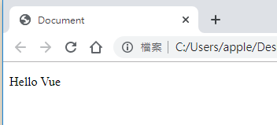

# 1.MVVM

* 1.M:存放數據的地方，通常只vue物件裡的data屬性

* 2.V:html，通常指VUE控制的區域

* 3.VM:負責數據與頁面交互的中介層

# 2.第一個VUE

```html
<script src="./lib/vue.js"></script>
<body>
    <div id="firstVue">
        <p>{{msg}}</p>
    </div>
</body>
<script>
    let vm = new Vue({
        el: "#firstVue", //表示，當前NEW出來的物件，要控制頁面上哪個區域
        data: { //data屬性，存放的是el中要用的數據
            msg:"Hello Vue"
        }
    });
</script>
```
執行結果:



# 3.常用元素

* a.v-text、v-bind、v.html

```html
<body>
    <div id="app">
        <p v-cloak>{{msg}}</p>

        <h1>{{msg}}</h1>
        <h1 v-text="msg2"></h1>
        <!-- 默認 v-text 是沒有閃爍問題的 -->
        <!-- v-text會覆蓋元素中原本的內容，但是 插值表達式 只會替換自己的這個佔位符，不會把 整個元素的內容清空 -->
        <h1 >==============={{msg3}}---------------</h1>
        <h1 v-text="msg3">===============---------------</h1>
        
        <!--v-html 替換時可以顯示HTML-->
        <p v-text="msg5"></p>
        <p>{{msg5}}</p>
        <p v-html="msg5"></p>
        
        <!-- v-bind: 是 Vue中，提供的用於綁定屬性的指令 -->
        value:<input type="text" value="msg4"><br>
        v-bind:value:<input type="text" v-bind:value="msg4"><br>
        <!-- 注意： v-bind: 指令可以被簡寫為 :要綁定的屬性 -->
         :value:<input type="text" :value="msg4"><br>
        <!-- v-bind 中，可以寫合法的JS表達式 -->
        :value:<input type="text" :value="msg4 +1234"><br>
    </div>
</body>

<script src="./lib/vue.js"></script>
<script>
    let vm = new Vue({
        el:"#app",
        data() {
            return {
                msg:"hello",
                msg2:"hello2",
                msg3:"hello3",
                msg4:"hello4",
                msg5:"<h1>HELLO VUE</h1>"
            }
        },
    });
</script>
```

* b.v-on

```html
<body>
    <div id="app">
        <!-- Vue 中提供了 v-on: 事件綁定機制 -->
        <input type="button" value="點擊按鈕" v-on:click="show">
    </div>
</body>
    <script src="./lib/vue.js"></script>
    <script>
        let vm = new Vue({
            el:"#app",
            methods: {
                show(){
                    alert("HELLO");
                }
            },
        })
    </script>
```
* class and style

```html
<style>
    .red {
      color: red;
    }

    .thin {
      font-weight: 200;
    }

    .italic {
      font-style: italic;
    }

    .active {
      letter-spacing: 0.5em;
    }
  </style>
<body>
    <div id="app">
        <!-- 第一種使用方式，直接傳遞一個陣列，注意： 這裡的 class 需要使用 v-bind 做數據綁定 -->
        <h1 :class=["red","thin"]>{{msg}}</h1>
        <!-- 在陣列中使用三元表達式 -->
        <h1 :class=["red","thin",flag?'active':'']>{{msg}}</h1>
        <!-- 在陣列中使用 對象來代替三元表達式，提高代碼的可讀性 -->
        <h1 :class=["red","thin",{'active':flag}]>{{msg}}</h1>
        <!-- 在為class 使用v-bind 綁定物件的時候，對象的屬性是類名，由於對象的屬性可帶引號，也可不帶引號，所以這裡我沒寫引號； 屬性的值是一個標識符-->
        <h1 :class="{ red: true, thin: true, italic: false, active: false }">{{msg}}</h1>
        <h1 :class="classObj">{{msg}}</h1>

        <h1 :style="styleObj1">{{msg}}</h1>
        <h1 :style="[ styleObj1, styleObj2 ]">{{msg}}</h1>
    </div>
</body>
    <script src="./lib/vue.js"></script>
    <script>
        let vm = new Vue({
            el:"#app",
            data() {
                return {
                    msg:"大家好~~~~",
                    flag:true,
                    styleObj1: { color: 'red', 'font-weight': 200 },
                    styleObj2: { 'font-style': 'italic' },
                    classObj: { red: true, thin: true, italic: false, active: false }
                }
            },
            methods: {
                
            },
        })
    </script>
```

