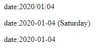

# 13.momentjs

```html
<!DOCTYPE html>
<html lang="en">
<head>
    <meta charset="UTF-8">
    <meta name="viewport" content="width=device-width, initial-scale=1.0">
    <meta http-equiv="X-UA-Compatible" content="ie=edge">
    <title>Document</title>
</head>
<body>
    <div id="app">
        <p>
            date:{{date | dateToStr()}}
        </p>
        <p>
            date:{{date | dateToStr('YYYY-MM-DD (dddd)')}}
        </p>
        <p>
            date:{{date | dateToStr('YYYY-MM-DD')}}
        </p>
    </div>
</body>
<script src="./lib/vue.js"></script>
<script src="https://momentjs.com/downloads/moment.js"></script>
<script>
    Vue.filter('dateToStr',function(value,pattern='YYYY/MM/DD'){
        return new moment(value).format(pattern);
    });
    let vm = new Vue({
        el:'#app',
        data() {
            return {
                date: new Date()
            }
        },
    })
</script>
</html>
```

執行結果:

