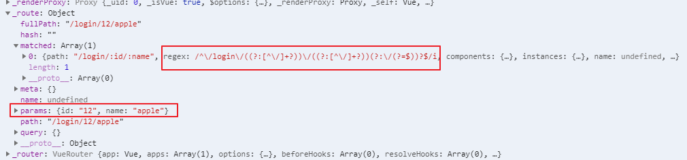
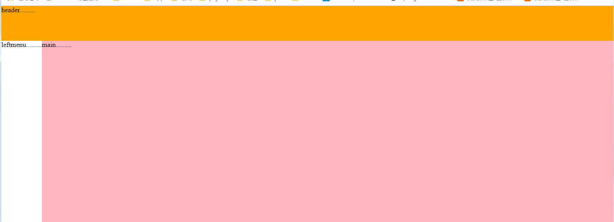

# 10.router

## **前端路由:組件**

## **後端路由:處理請求的回調函數**

## **可以使用<keep-alive>標籤把<router-view>包起來，使其組件切換時，繼續存活著**

*   導入**<script src="./lib/vue-router.js"></script>**
*   創件VueRouter物件，並配置屬性routes作為URL跟組件的映射
*   把上一步創件的VueRouter物件指派給Vue物件裡的router屬性，以做關聯
*   在HTML裡添加TAG(**router-view**)，此TAG就是來顯示VueRouter對應到的組件
*   可以使用**router-link**，做為切換的按鈕，始標籤預設轉換為a tag，如果喜轉匯為其他標籤，使用tag屬性極可轉換，其也會預設添加修改URL hash值的事件

```html
<!DOCTYPE html>
<html lang="en">
<head>
    <meta charset="UTF-8">
    <meta name="viewport" content="width=device-width, initial-scale=1.0">
    <meta http-equiv="X-UA-Compatible" content="ie=edge">
    <title>Document</title>
</head>

<style>
    /* 添加高亮 */
    .router-link-active,/*vue-router預設添加的樣式*/
    .myactive {
        color: red;
        font-weight: 800;
        font-style: italic;
        font-size: 80px;
        text-decoration: underline;
        background-color: green;
    }

    /* 添加動畫 */
    .v-enter,
    .v-leave-to {
        opacity: 0;
        transform: translateX(140px);
    }

    .v-enter-active,
    .v-leave-active {
        transition: all 0.5s ease;
    }
</style>
<body>
    <div id="app">
        <!-- <a href="#/login">login</a> -->
        <!-- <a href="#/register">register</a> -->

         <!-- router-link 默認轉換成a 標籤 ，可以通過tag屬性修改轉換的html標籤，但一樣會添加點擊事件，去修改URL HASH VLAUE -->
        <router-link to="/login" tag="div">login</router-link>
        <router-link to="/register">register</router-link>

        <transition mode="in-out">
            <router-view></router-view>
        </transition>
    </div>

    <template id="login">
        <div>
            <h1>login component</h1>
        </div>
    </template>
    <template id="register">
        <div>
                <h1>register component</h1>
        </div>
    </template>
</body>

<script src="./lib/vue.js"></script>
<script src="./lib/vue-router.js"></script>
<script>
    //組件模板物件
    let login={
        template:"#login"
    };
    let register={
        template:"#register"
    };

    //當導入/vue-router.js後window就有的VueRouter建構式，利用它來創建VueRouter物件
    let routerObj = new VueRouter({//有r
        routes:[//沒有r
        // 路由匹配規則
        // 每個路由規則，都是一個物件，這個規則物件，身上，有兩個必須的屬性：
        // 屬性1 是 path， 表示監聽 哪個路由鏈接地址；
        // 屬性2 是 component， 表示，如果 路由是前面匹配到的 path ，則展示 component 屬性對應的那個組件
        // 注意： component 的屬性值，必須是一個 組件的模闆物件， 不能是 組件的引用名稱；
        //redirect重定向的屬性
        // { path: '/', component: login },
            {path:"/",redirect:"/login"},
            {path:"/login",component:login},//這底船的是模板物件，不是傳組件的註冊名，組件註冊名只能用在TAG上
            {path:"/register",component:register},
        ],
        linkActiveClass: 'myactive' //可以通過linkActiveClass此屬性修改，vue-router預設添加的樣式(router-link-active)

    })

    let vm = new Vue({
        el:"#app",
        data() {
            return {
                
            }
        },
        methods: {
            
        },
        router:routerObj //將vue與VueRouter物件關聯起來
    })
</script>
</html>
```
* router query url 傳值

    *   URL?號後面帶參數傳入，vue router會以正則表達式去解析參數，並附入Vue物件裡的query屬性陣列裡，取值只需使用this.$route.query.xxx即可以取到值

瀏覽器Vue物件


```html
<!DOCTYPE html>
<html lang="en">
<head>
    <meta charset="UTF-8">
    <meta name="viewport" content="width= , initial-scale=1.0">
    <meta http-equiv="X-UA-Compatible" content="ie=edge">
    <title>Document</title>
</head>
<body>
    <div id="app">

        <router-link to="/login?id=221&name=apple">login</router-link>
        <router-link to="/register">register</router-link>

        <router-view></router-view>
    </div>
</body>
<script src="./lib//vue.js"></script>
<script src="./lib/vue-router.js"></script>
<script>
    let login={
        template:"<h1>login----{{this.$route.query.id}}----{{this.$route.query.name}}</h1>",
        created() {
            this.show();
        },
        data() {
            return {
                id:this.$route.query.id,
                name:this.$route.query.name
            }
        },
        methods: {
            show(){
                console.log("id",this.id,"name",this.name);
            }
        },
    }
    let register={
        template:"<h1>register</h>"
    }

    let router  = new VueRouter({
        routes:[
            {path:"/",redirect:"/login"},
            {path:"/login",component:login},
            {path:"/register",component:register}
        ]
    })

    let vm = new Vue({
        el:"#app",
        router
    })
</script>
</html>
```

*    URl後面擺佔位符傳值<br>
    *   例如http://localhost:52330/20_router_params_url%E5%82%B3%E5%80%BC.html#/login/12/apple ，當中12跟apple是要傳入的參數，在router的path的屬性中只需加上 /:變數名 即可獲取對應的參數 例如 path:'/login/:id/:name'

    *   在vue物件裡，此參數是存在params陣列屬性裡，一樣是使用正則匹配，取用時只需用以下方式取
    *   this.$route.params.xxx

瀏覽器Vue物件



```html
<!DOCTYPE html>
<html lang="en">
<head>
    <meta charset="UTF-8">
    <meta name="viewport" content="width= , initial-scale=1.0">
    <meta http-equiv="X-UA-Compatible" content="ie=edge">
    <title>Document</title>
</head>
<body>
    <div id="app">
        <router-link to="/login/12/apple">login</router-link>
        <router-link to="/register">register</router-link>
        <router-view></router-view>
    </div>
</body>
<script src="./lib//vue.js"></script>
<script src="./lib/vue-router.js"></script>
<script>
    let login={
        template:"<h1>login----{{this.$route.params.id}}----{{this.$route.params.name}}</h1>",
        created() {
            this.show();
        },
        data() {
            return {
                id:this.$route.params.id,
                name:this.$route.params.name
            }
        },
        methods: {
            show(){
                console.log("id",this.id,"name",this.name);
            }
        },
    }
    let register={
        template:"<h1>register</h>"
    }

    let router  = new VueRouter({
        routes:[
            {path:"/",redirect:"/login"},
            {path:"/login/:id/:name",component:login},
            {path:"/register",component:register}
        ]
    })

    let vm = new Vue({
        el:"#app",
        router
    })
</script>
</html>
```

*   嵌套router

    *   使用routes裡的children屬性實現嵌套router，注意children屬性裡哦path不用帶/線

```html
<!DOCTYPE html>
<html lang="en">
<head>
    <meta charset="UTF-8">
    <meta name="viewport" content="width=device-width, initial-scale=1.0">
    <meta http-equiv="X-UA-Compatible" content="ie=edge">
    <title>Document</title>
</head>
<script src="./lib/vue.js"></script>
<script src="./lib/vue-router.js"></script>
<body>
    <div id="app">
        <router-link to="/account">account</router-link>

        <router-view></router-view>
    </div>

    <template id="tmp1">
        <div>
            <h1>.........</h1>
             <router-link to="/account/login">login</router-link>
             <router-link to="/account/register">register</router-link>

             <router-view></router-view>
        </div>
    </template>
</body>
<script>
    let account = {
        template:"#tmp1"
    };

    let login={
        template:"<h1>login</h1>"
    }
    let register={
        template:"<h1>register</h1>"
    }

    let router = new VueRouter({
        routes:[
            {
                path:"/account",
                component:account,
                children:[
                    {
                        path:"login",
                        component:login
                    },
                    {
                        path:"register",
                        component:register
                    }
                ]
            }
        ]
    });

    let vm = new Vue({
        el:"#app",
        router
    })
</script>
</html>
```

*   命名router-view

    *   命名router-view實現，多個router-view顯示不同組件

```html
<!DOCTYPE html>
<html lang="en">
<head>
    <meta charset="UTF-8">
    <meta name="viewport" content="width=device-width, initial-scale=1.0">
    <meta http-equiv="X-UA-Compatible" content="ie=edge">
    <title>Document</title>
</head>
<style>

html,
    body {
      margin: 0;
      padding: 0;
    }

    #header {
      background-color: orange;
      height: 80px;
    }

    h1 {
      margin: 0;
      padding: 0;
      font-size: 16px;
    }

    .container {
      display: flex;
      height: 600px;
    }

    #left {
      background-color: lightgreen;
      flex: 5;
    }

    #main {
      background-color: lightpink;
      flex: 5;
    }

</style>
<body>
    <div id="app">
        <router-view></router-view>
        <div class="container">
            <router-view name="left"></router-view>
            <router-view name="main"></router-view>
        </div>
    </div>
</body>
<script src="./lib/vue.js"></script>
<script src="./lib/vue-router.js"></script>
<script>
    let header={
        template:"<div id='header'>header.........</div>"
    };
    let leftmenu={
        template:"<div id='leftmenu'>leftmenu.........</div>"
    };
    let main={
        template:"<div id='main'>main.........</div>"
    };

    let router = new VueRouter({
        routes:[
            {
                path:"/",
                components:{

                    "default":header,
                    "left":leftmenu,
                    "main":main
                }

            }
        ]
    });

    let vm = new Vue({
        el:"#app",
        router
    })

</script>

</html>

```

顯示結果:


