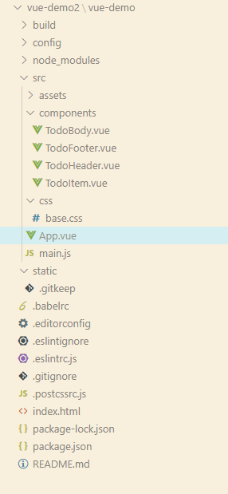

# 待辦事項處理

結果


專案結構




內容

index.html

```html
<!DOCTYPE html>
<html>
  <head>
    <meta charset="utf-8">
    <meta name="viewport" content="width=device-width,initial-scale=1.0">
    <title>vue-demo</title>
  </head>
  <body>
    <div id="app"></div>
    <!-- built files will be auto injected -->
  </body>
</html>

```

main.js

```javascript
// The Vue build version to load with the `import` command
// (runtime-only or standalone) has been set in webpack.base.conf with an alias.
import Vue from 'vue'
import App from './App'

import './css/base.css'
Vue.config.productionTip = false

/* eslint-disable no-new */
new Vue({
  el: '#app',
  components: { App },
  template: '<App/>'
})

```
base.css

```css
body {
    background: #fff;
  }
  
  .btn {
    display: inline-block;
    padding: 4px 12px;
    margin-bottom: 0;
    font-size: 14px;
    line-height: 20px;
    text-align: center;
    vertical-align: middle;
    cursor: pointer;
    box-shadow: inset 0 1px 0 rgba(255, 255, 255, 0.2), 0 1px 2px rgba(0, 0, 0, 0.05);
    border-radius: 4px;
  }
  
  .btn-danger {
    color: #fff;
    background-color: #da4f49;
    border: 1px solid #bd362f;
  }
  
  .btn-danger:hover {
    color: #fff;
    background-color: #bd362f;
  }
  
  .btn:focus {
    outline: none;
  }
```

App.vue

```javascript
<template>
  <div id="root">
    <div class="todo-container">
      <div class="todo-wrap">
        <todo-header :addTodo='addTodo'/>
        <todo-body :todos='todos' :deleteItem='deleteItem'/>
        <todo-footer :calculateComplete='calculateComplete' :calculateTodoSize='calculateTodoSize' :selectAllTodo='selectAllTodo' :delSelectTodo='delSelectTodo'/>
      </div>
    </div>
  </div>
</template>

<script>
import TodoHeader from './components/TodoHeader'
import TodoBody from './components/TodoBody'
import TodoFooter from './components/TodoFooter'
export default {
  data () {
    return {
      // todos: [
      //   {title: '追劇', complete: false},
      //   {title: '聽音樂', complete: true},
      //   {title: '洗澡', complete: false}
      // ]
      todos: JSON.parse(window.localStorage.getItem('todos_data') || '[]')
    }
  },
  watch: {
    todos: {// 監視
      deep: true, // 深度監視
      handler: function (newValue, oldValue) {
        window.localStorage.setItem('todos_data', JSON.stringify(newValue))
      }
    }
  },
  computed: {
    calculateComplete () {
      let count = 0
      this.todos.forEach((item, index) => {
        if (item.complete === true) {
          count = count + 1
        }
      })
      return count
    },
    calculateTodoSize () {
      return this.todos.length
    }
  },
  components: {
    TodoHeader,
    TodoBody,
    TodoFooter
  },
  methods: {
    addTodo (todo) {
      this.todos.unshift(todo)
    },
    deleteItem (index) {
      this.todos.splice(index, 1)
    },
    selectAllTodo (flag) {
      this.todos.forEach((item, index) => {
        item.complete = flag
      })
    },
    delSelectTodo () {
      // let todoNwe = []
      // this.todos.forEach((item, index) => {
      //   if (item.complete === false) {
      //     todoNwe.push(item)
      //   }
      // })
      // this.todos = todoNwe
      // 使用filter過去想移除的東西
      this.todos = this.todos.filter((item) => !item.complete)
    }
  }
}
</script>

<style >
.todo-container {
  width: 600px;
  margin: 0 auto;
}
.todo-container .todo-wrap {
  padding: 10px;
  border: 1px solid #ddd;
  border-radius: 5px;
}
</style>

```

TodoHeader.vue

```javascript
<template>
      <div class="todo-header">
        <input type="text" placeholder="請輸入您的名稱" @keyup.enter='submit' v-model="userData"/>
      </div>
</template>

<script>
export default {
  props: {
    addTodo: Function
  },
  data () {
    return {
      userData: ''
    }
  },
  components: {

  },
  methods: {
    submit () {
      const {addTodo} = this
      addTodo({title: this.userData, complete: false})
      this.userData = ''
    }
  }
}
</script>

<style >
.todo-header input {
  width: 560px;
  height: 28px;
  font-size: 14px;
  border: 1px solid #ccc;
  border-radius: 4px;
  padding: 4px 7px;
}

.todo-header input:focus {
  outline: none;
  border-color: rgba(82, 168, 236, 0.8);
  box-shadow: inset 0 1px 1px rgba(0, 0, 0, 0.075), 0 0 8px rgba(82, 168, 236, 0.6);
}

</style>

```

TodoBody.vue

```javascript
<template>
      <ul class="todo-main">
          <todo-item v-for="(todo, index) in todos" :key="index" :index='index' :todo='todo' :deleteItem='deleteItem'/>
      </ul>
</template>

<script>
import TodoItem from './TodoItem'
export default {
  props: {
    todos: Array,
    deleteItem: Function
  },
  data () {
    return {

    }
  },
  components: {
    TodoItem
  }
}
</script>

<style >
.todo-main {
  margin-left: 0px;
  border: 1px solid #ddd;
  border-radius: 2px;
  padding: 0px;
}

.todo-empty {
  height: 40px;
  line-height: 40px;
  border: 1px solid #ddd;
  border-radius: 2px;
  padding-left: 5px;
  margin-top: 10px;
}
</style>

```

TodoFooter.vue

```javascript
<template>
  <div class="todo-footer">
    <label>
      <input type="checkbox"  v-model="ischeck"/>
    </label>
    <span>
      <span>已完成{{calculateComplete}}</span> / 全部{{calculateTodoSize}}
    </span>
    <button class="btn btn-danger" @click="delAll">清除已完成任務</button>
  </div>
</template>

<script>
export default {
  props: {
    calculateComplete: Number,
    calculateTodoSize: Number,
    selectAllTodo: Function,
    delSelectTodo: Function
  },
  data () {
    return {
      selectAllBtn: false
    }
  },
  components: {},
  computed: {
    ischeck: {
      get () {
        return this.calculateComplete === this.calculateTodoSize && this.calculateTodoSize !== 0
      },
      set (value) { // 是當前checkbox最新的值
        this.selectAllTodo(value)
      }
    }
  },
  methods: {
    delAll () {
      this.delSelectTodo()
    }
  }
}
</script>

<style >
.todo-footer {
  height: 40px;
  line-height: 40px;
  padding-left: 6px;
  margin-top: 5px;
}

.todo-footer label {
  display: inline-block;
  margin-right: 20px;
  cursor: pointer;
}

.todo-footer label input {
  position: relative;
  top: -1px;
  vertical-align: middle;
  margin-right: 5px;
}

.todo-footer button {
  float: right;
  margin-top: 5px;
}

</style>

```

TodoItem.vue

```javascript
<template>
        <li @mouseenter="handleShow(true)"  @mouseleave="handleShow(false)" :style="{background:bgColor}">
          <label>
            <input type="checkbox" v-model="todo.complete"/>
            <span>{{todo.title}}</span>
          </label>
          <button class="btn btn-danger" v-show="isshow" @click="del(index)">刪除</button>
        </li>
</template>

<script>
export default {
  props: {
    todo: Object,
    index: Number,
    deleteItem: Function
  },
  data () {
    return {
      bgColor: 'white',
      isshow: false
    }
  },
  components: {

  },
  methods: {
    handleShow (flag) {
      if (flag) {
        this.bgColor = 'aaaaaa'
        this.isshow = true
      } else {
        this.bgColor = 'white'
        this.isshow = false
      }
    },
    del (index) {
      this.deleteItem(index)
    }
  }
}
</script>

<style >
li {
  list-style: none;
  height: 36px;
  line-height: 36px;
  padding: 0 5px;
  border-bottom: 1px solid #ddd;
}

li label {
  float: left;
  cursor: pointer;
}

li label li input {
  vertical-align: middle;
  margin-right: 6px;
  position: relative;
  top: -1px;
}

li button {
  float: right;
  display: none;
  margin-top: 3px;
}

li:before {
  content: initial;
}

li:last-child {
  border-bottom: none;
}

</style>

```