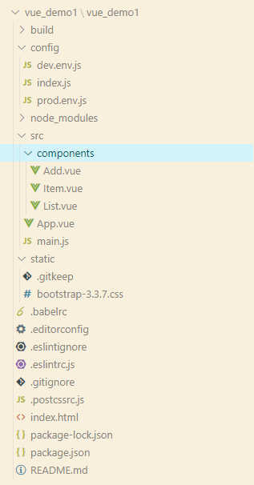

# 評論留言板

1.專案架構



2.內容

index.html

```html
<!DOCTYPE html>
<html>

  <head>
    <meta charset="utf-8">
    <meta name="viewport" content="width=device-width,initial-scale=1.0">
    <title>vue_demo1</title>
  </head>
  <link rel="stylesheet" href="./static/bootstrap-3.3.7.css">
  <body>
    <div id="app"></div>
    <!-- built files will be auto injected -->
  </body>
</html>

```

main.js

```javascript
import Vue from 'vue'
import App from './App'

new Vue({
  el: '#app',
  components: {App},
  template: '<App/>'
})

```

App.vue

```html
<template>
  <div>
    <header class="site-header jumbotron">
      <div class="container">
        <div class="row">
          <div class="col-xs-12">
            <h1>請發表評論</h1>
          </div>
        </div>
      </div>
    </header>
    <div class="container">
        <Add :messages='messages' :addComment='addComment'/>
        <List :messages='messages'  :deleteComment='deleteComment'/>
    </div>
  </div>
</template>

<script>
import Add from './components/Add'
import List from './components/List'
export default {
  data () {
    return {
      messages: [
        {name: 'frank', msg: 'apple'},
        {name: 'frank1', msg: 'apple1'},
        {name: 'frank2', msg: 'apple2'}
      ]
    }
  },
  components: {
    Add,
    List
  },
  methods: {
    addComment (comment) {
      this.messages.unshift(comment)
    },

    deleteComment (index) {
      this.messages.splice(index, 1)
    }
  }
}
</script>

<style>
</style>

```

Add.vue

```html
<template>
  <div class="col-md-4">
    <form class="form-horizontal">
      <div class="form-group">
        <label>用戶名</label>
        <input type="text" class="form-control" placeholder="用戶名" v-model="userName"/>
      </div>
      <div class="form-group">
        <label>評論內容</label>
        <textarea class="form-control" rows="6" placeholder="評論內容" v-model="comment"></textarea>
      </div>
      <div class="form-group">
        <div class="col-sm-offset-2 col-sm-10">
          <button type="button" class="btn btn-default pull-right" @click='submit'>提交</button>
        </div>
      </div>
    </form>
  </div>
</template>

<script>
export default {
  data () {
    return {
      comment: '',
      userName: ''
    }
  },
  components: {},
  props: {
    messages: Array,
    addComment: Function
  },
  methods: {
    submit () {
      this.addComment({name: this.userName, msg: this.comment})

      this.comment = ''
      this.userName = ''
    }
  }
}
</script>

<style >
</style>

```

Item.vue

```html
<template>
  <div>
    <li class="list-group-item">
    <button type="button" class="btn  btn-danger pull-right" @click='del(keyIndex)'>刪除</button>
      <p class="user">
        <span>{{message.name}}</span>
        <span>說:</span>
      </p>
      <p class="centence">{{message.msg}}</p>
    </li>
  </div>
</template>

<script>
export default {
  props: {
    message: Object,
    messages: Array,
    keyIndex: Number,
    deleteComment: Function
  },
  data () {
    return {}
  },
  components: {},
  methods: {
    del (index) {
      const {deleteComment} = this
      if (window.confirm('您確定要刪除此留言')) {
        deleteComment(index)
      }
    }
  }
}
</script>

<style >
.handle {
  width: 40px;
  border: 1px solid #ccc;
  background: #fff;
  position: absolute;
  right: 10px;
  top: 1px;
  text-align: center;
}

.handle a {
  display: block;
  text-decoration: none;
}

.list-group-item .centence {
  padding: 0px 50px;
}

.user {
  font-size: 22px;
}
</style>

```

List.vue

```html
<template>
  <div class="col-md-8">
    <h3 class="reply">評論回復：</h3>
    <h2 style="display: none">暫無評論，點擊左側添加評論！！！</h2>
    <ul class="list-group">
        <Item v-for="(message, index) in messages" :key="index" :message='message' :messages='messages' :keyIndex='index' :deleteComment='deleteComment'/>
    </ul>
  </div>
</template>

<script>
import Item from './Item'
export default {
  props: {
    messages: {
      type: Array,
      required: true
    },
    deleteComment: {
      type: Function,
      required: true
    }

  },
  data () {
    return {
    }
  },
  components: {Item}
}
</script>

<style>
.reply {
  margin-top: 0px;
}

li {
  transition: .5s;
  overflow: hidden;
}

</style>

```
